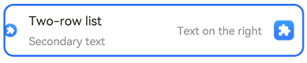

# @ohos.arkui.advanced.ComposeListItem (List)


The list component is a container that presents a series of items arranged in a column with the same width. You can use it to present data of the same type in a multiple and coherent row style, for example, images or text.


> **NOTE**
>
> This component is supported since API version 10. Updates will be marked with a superscript to indicate their earliest API version.


## Modules to Import

```
import { ComposeListItem } from "@ohos.arkui.advanced.ComposeListItem"
```


## Child Components

Not supported

## Attributes
The [universal attributes](ts-universal-attributes-size.md) are supported.


## ComposeListItem

ComposeListItem({contentItem?: ContentItem, operateItem?: OperateItem})

**Decorator**: @Component

**System capability**: SystemCapability.ArkUI.ArkUI.Full


**Parameters**


| Name| Type| Mandatory| Decorator| Description| 
| -------- | -------- | -------- | -------- | -------- |
| contentItem | [ContentItem](#contentitem) | No| \@Prop | Elements on the left and in the center.| 
| operateItem | [OperateItem](#operateitem) | No| \@Prop | Element on the right.| 


## ContentItem

| Name| Type| Mandatory| Description| 
| -------- | -------- | -------- | -------- |
| iconStyle | [IconType](#icontype) | No| Icon style of the element on the left.| 
| icon | [ResourceStr](ts-types.md#resourcestr) | No| Icon resource of the element on the left.| 
| primaryText | [ResourceStr](ts-types.md#resourcestr) | No| Title of the element in the center.| 
| secondaryText | [ResourceStr](ts-types.md#resourcestr) | No| Subtitle of the element in the center.| 
| description | [ResourceStr](ts-types.md#resourcestr) | No| Description of the element in the center.| 


## IconType

| Name| Description| 
| -------- | -------- |
| BADGE | The icon on the left is a badge, in the size of 8 x 8 dp.| 
| NORMAL_ICON | The icon on the left is a small icon, in the size of 16 x 16 dp.| 
| SYSTEM_ICON | The icon on the left is a system icon, in the size of 24 x 24 dp.| 
| HEAD_SCULPTURE | The icon on the left is a profile picture, in the size of 40 x 40 dp.| 
| APP_ICON | The icon on the left is an application icon, in the size of 64 x 64 dp.| 
| PREVIEW | The icon on the left is a preview image, in the size of 96 x 96 dp.| 
| LONGITUDINAL | The icon on the left uses an aspect ratio where width is greater than height, with the longest edge being 96 dp.| 
| VERTICAL | The icon on the left uses an aspect ratio where height is greater than width, with the longest edge being 96 dp.| 


## OperateItem

| Name| Type| Mandatory| Description| 
| -------- | -------- | -------- | -------- |
| arrow | [OperateIcon](#operateicon) | No| The element on the right is an arrow, in the size of 12 x 24 dp.| 
| icon | [OperateIcon](#operateicon) | No| First icon of the element on the right, in the size of 24 x 24 dp.| 
| subIcon | [OperateIcon](#operateicon) | No| Second icon of the element on the right, in the size of 24 x 24 dp.| 
| button | [OperateButton](#operatebutton) | No| The element on the right is a button.| 
| switch | [OperateCheck](#operatecheck) | No| The element on the right is a switch.| 
| checkbox | [OperateCheck](#operatecheck) | No| The element on the right is a check box, in the size of 24 x 24 dp.| 
| radio | [OperateCheck](#operatecheck) | No| The element on the right is a radio button, in the size of 24 x 24 dp.| 
| image | [ResourceStr](ts-types.md#resourcestr) | No| The element on the right is an image, in the size of 48 x 48 dp.| 
| text | [ResourceStr](ts-types.md#resourcestr) | No| The elements on the right is text.| 


## OperateIcon

| Name| Type| Mandatory| Description| 
| -------- | -------- | -------- | -------- |
| value | [ResourceStr](ts-types.md#resourcestr) | Yes| Resource of the icon or arrow on the right.| 
| action | ()=&gt;void | No| Click event of the icon or arrow on the right.| 


## OperateButton

| Name| Type| Mandatory| Description| 
| -------- | -------- | -------- | -------- |
| text | [ResourceStr](ts-types.md#resourcestr) | No| Button text on the right.| 


## OperateCheck

| Name| Type| Mandatory| Description| 
| -------- | -------- | -------- | -------- |
| isCheck | boolean | No| Whether the switch, check box, or radio buttion on the right is selected.| 
| onChange | (value:&nbsp;boolean)=&gt;void | No| Callback invoked when the selected state of the switch, check box, or radio buttion on the right is changed.| 

## Events
The [universal events](ts-universal-events-click.md) are supported.

## Example

```ts
import { IconType } from '@ohos.arkui.advanced.ComposeListItem';
import promptAction from '@ohos.promptAction'

@Entry
@Component
struct ComposeListItemExample {
  build() {
    Column() {
      List() {
        ListItem() {
          ComposeListItem({
            contentItem: ({
              iconStyle: IconType.NORMAL_ICON,
              icon: $r('sys.media.ohos_app_icon'),
              primaryText: 'Two-row list',
              secondaryText:'Secondary text'
            }),
            operateItem: ({
              icon: {
                value: $r('sys.media.ohos_app_icon'),
                action: () => {
                  promptAction.showToast({ message: 'icon' })
                } },
              text:'Text on the right'
            })
          })
        }
      }
    }
  }
}
```


