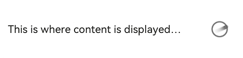

# @ohos.arkui.advanced.Dialog (Dialog Box)


The dialog box is a modal window that commands attention while retaining the current context. It is frequently used to draw the user's attention to vital information or prompt the user to complete a specific task. As all modal windows, this component requires the user to interact before exiting.


> **NOTE**
>
> This component is supported since API version 10. Updates will be marked with a superscript to indicate their earliest API version.


## Modules to Import

```
import { TipsDialog, SelectDialog, ConfirmDialog, AlertDialog, LoadingDialog } from '@ohos.arkui.advanced.Dialog'
```


## Child Components

Not supported

## Attributes
The [universal attributes](ts-universal-attributes-size.md) are not supported.

## TipsDialog


TipsDialog({controller: CustomDialogController, imageRes: Resource, imageSize: SizeOptions, title: ResourceStr, content?: ResourceStr, checkTips?: ResourceStr, ischecked?: boolean, primaryButton?: ButtonOptions, secondaryButton?: ButtonOptions})


Displays an image-attached confirmation dialog box. If necessary, the confirmation dialog box can be displayed in a graphical manner.


**Decorator type**: @CustomDialog


**System capability**: SystemCapability.ArkUI.ArkUI.Full


**Parameters**


| Name| Type| Mandatory| Decorator| Description| 
| -------- | -------- | -------- | -------- | -------- |
| controller | [CustomDialogController](ts-methods-custom-dialog-box.md#customdialogcontroller) | Yes| - | Dialog box controller.| 
| imageRes | [Resource](ts-types.md#resource) | Yes| - | Image to be displayed.| 
| imageSize | [SizeOptions](ts-types.md#sizeoptions) | Yes| - | Image size.| 
| title | [ResourceStr](ts-types.md#resourcestr) | Yes| - | Title of the dialog box.| 
| content | [ResourceStr](ts-types.md#resourcestr) | No| - | Content of the dialog box.| 
| checkTips | [ResourceStr](ts-types.md#resourcestr) | No| - | Content of the check box.| 
| isChecked | boolean | No| \@Prop | Whether to select the check box. The value **true** means to select the checkbox , and **false** means the opposite.<br>Default value: **false**| 
| primaryButton | [ButtonOptions](#buttonoptions) | No| - | Left button of the dialog box.| 
| secondaryButton | [ButtonOptions](#buttonoptions) | No| - | Right button of the dialog box.| 


## SelectDialog

SelectDialog({controller: CustomDialogController, title: ResourceStr, content?: ResourceStr, selectedIndex?: number, confirm?: ButtonOptions, radioContent?: Array&lt;SheetInfo&gt;})

Displays a dialog box from which the user can select options presented in a list or grid.

**Decorator type**: @CustomDialog

**System capability**: SystemCapability.ArkUI.ArkUI.Full

**Parameters**

| Name| Type| Mandatory| Description| 
| -------- | -------- | -------- | -------- |
| controller | CustomDialogController | Yes| Dialog box controller.| 
| title | [ResourceStr](ts-types.md#resourcestr) | Yes| Title of the dialog box.| 
| content | [ResourceStr](ts-types.md#resourcestr) | No| Content of the dialog box.| 
| selectedIndex | number | No| Index of the selected option in the dialog box.<br>Default value: **-1**| 
| confirm | [ButtonOptions](#buttonoptions) | No| Confirm button.| 
| radioContent | Array&lt;[SheetInfo](ts-methods-action-sheet.md#sheetinfo)&gt; | No| List of subitems in the dialog box. You can set text and a select callback for each subitem.| 


## ConfirmDialog

ConfirmDialog({controller: CustomDialogController, title: ResourceStr, content?: ResourceStr, checkTips?: ResourceStr, ischecked?: boolean, primaryButton?: ButtonOptions, secondaryButton?: ButtonOptions})

Displays an error dialog box that informs the user of an operational error (for example, a network error or low battery level) or an incorrect operation (for example, fingerprint enrollment).

**Decorator type**: @CustomDialog

**System capability**: SystemCapability.ArkUI.ArkUI.Full

**Parameters**

| Name| Type| Mandatory| Decorator| Description| 
| -------- | -------- | -------- | -------- | -------- |
| controller | CustomDialogController | Yes| - | Controller of the dialog box.| 
| title | [ResourceStr](ts-types.md#resourcestr) | Yes| - | Title of the dialog box.| 
| content | [ResourceStr](ts-types.md#resourcestr) | No| - | Content of the dialog box.| 
| checkTips | [ResourceStr](ts-types.md#resourcestr) | No| - | Content of the check box.| 
| isChecked | boolean | No| \@Prop | Whether to select the check box. The value **true** means to select the checkbox , and **false** means the opposite.<br>Default value: **false**| 
| primaryButton | [ButtonOptions](#buttonoptions) | No| - | Left button of the dialog box.| 
| secondaryButton | [ButtonOptions](#buttonoptions) | No| - | Right button of the dialog box.| 


## AlertDialog

AlertDialog({controller: CustomDialogController, content?: ResourceStr, primaryButton?: ButtonOptions, secondaryButton?: ButtonOptions})

Displays an alert dialog box to prompt the user to confirm an action that is irreversible and may cause serious consequences, such as deletion, reset, editing cancellation, and stop.

**Decorator type**: @CustomDialog

**System capability**: SystemCapability.ArkUI.ArkUI.Full

**Parameters**

| Name| Type| Mandatory| Description| 
| -------- | -------- | -------- | -------- |
| controller | CustomDialogController | Yes| Controller of the dialog box.| 
| content | [ResourceStr](ts-types.md#resourcestr) | Yes| Content of the dialog box.| 
| primaryButton | [ButtonOptions](#buttonoptions) | No| Left button of the dialog box.| 
| secondaryButton | [ButtonOptions](#buttonoptions) | No| Right button of the dialog box.| 


## LoadingDialog

LoadingDialog({controller: CustomDialogController, content?: ResourceStr})

**Parameters**

| Name| Type| Mandatory| Description| 
| -------- | -------- | -------- | -------- |
| controller | CustomDialogController | Yes| Controller of the dialog box.| 
| content | [ResourceStr](ts-types.md#resourcestr) | Yes| Content of the dialog box.| 


## ButtonOptions

**System capability**: SystemCapability.ArkUI.ArkUI.Full

| Name| Type| Mandatory| Description| 
| -------- | -------- | -------- | -------- |
| value | [ResourceStr](ts-types.md#resourcestr) | Yes| Content of the button.| 
| action | ()&nbsp;=&gt;&nbsp;void | No| Click event of the button.| 
| background | [ResourceColor](ts-types.md#resourcecolor) | No| Background of the button.| 
| fontColor | [ResourceColor](ts-types.md#resourcecolor) | No| Font color of the button.| 


## Events
The [universal events](ts-universal-events-click.md) are not supported.

## Example

### Example 1

```ts
import { TipsDialog } from '@ohos.arkui.advanced.Dialog'
@Entry
@Component
struct Index {
  isChecked = false;
  dialogControllerImage: CustomDialogController = new CustomDialogController({
    builder: TipsDialog({
      imageRes: $r('app.media.icon'),
      title:'Title',
      content: 'This is where content is displayed.',
      isChecked: this.isChecked,
      checkTips:'Don't remind me again',
      primaryButton: {
        value: 'Cancel',
        action: () => {
          console.info('Callback when the CheckBox is clicked')
        },
      },
      secondaryButton: {
        value: 'OK',
        action: () => {
          console.info('Callback when the second button is clicked')
        }
      },
    }),
    autoCancel: true,
    customStyle: true,
    alignment: DialogAlignment.Bottom
  })

  build() {
    Row() {
      Stack() {
        Column(){
          Button ("Text Below Image")
            .width(96)
            .height(40)
            .onClick(() => {
              this.dialogControllerImage.open()
            })
          }.margin({bottom: 300})
        }.align(Alignment.Bottom)
        .width('100%').height('100%')
      }
     .backgroundImageSize({ width: '100%', height: '100%' })
     .height('100%')
   }
}
```


### Example 2

```ts
import { SelectDialog } from '@ohos.arkui.advanced.Dialog'
@Entry
@Component
struct Index {
  radioIndex = 0;
dialogControllerList: CustomDialogController = new CustomDialogController({
  builder: SelectDialog({
    title:'Title',
      selectedIndex: this.radioIndex,
    confirm: {
      value: 'Cancel',
      action: () => {},
    },
    radioContent: [
      {
      title: 'List item',
      action: () => {
        this.radioIndex = 0
      }
    },
      {
      title: 'List item',
      action: () => {
        this.radioIndex = 1
      }
    },
      {
      title: 'List item',
      action: () => {
        this.radioIndex = 2
      }
    },
    ]
  }),
  customStyle: true,
  alignment: DialogAlignment.Bottom,
  autoCancel: false
})

  build() {
    Row() {
      Stack() {
        Column(){
          Button("List Dialog Box")
            .width(96)
            .height(40)
            .onClick(() => {
              this.dialogControllerList.open()
            })
          }.margin({bottom: 300})
        }.align(Alignment.Bottom)
        .width('100%').height('100%')
      }
     .backgroundImageSize({ width: '100%', height: '100%' })
     .height('100%')
   }
}
```


### Example 3

```ts
import { ConfirmDialog } from '@ohos.arkui.advanced.Dialog'
@Entry
@Component
struct Index {
  isChecked = false;
dialogControllerCheckBox: CustomDialogController = new CustomDialogController({
  builder: ConfirmDialog({
    title:'Title',
    content: 'This is where content is displayed. This is where content is displayed. ',
    isChecked: this.isChecked,
    checkTips:'Don't ask again after denying',
    primaryButton: {
      value: 'Deny',
      action: () => {},
    },
    secondaryButton: {
      value: 'Allow',
      action: () => {
        this.isChecked = false
        console.info('Callback when the second button is clicked')
      }
    },
  }),
  autoCancel: true,
  customStyle: true,
  alignment: DialogAlignment.Bottom
})

  build() {
    Row() {
      Stack() {
        Column(){
          Button ("Text + Check Box Dialog Box")
            .width(96)
            .height(40)
            .onClick(() => {
              this.dialogControllerCheckBox.open()
            })
          }.margin({bottom: 300})
        }.align(Alignment.Bottom)
        .width('100%').height('100%')
      }
     .backgroundImageSize({ width: '100%', height: '100%' })
     .height('100%')
   }
}
```


### Example 4

```ts
import { AlertDialog } from '@ohos.arkui.advanced.Dialog'
@Entry
@Component
struct Index {
dialogControllerConfirm: CustomDialogController = new CustomDialogController({
  builder: AlertDialog({
    content: 'This is where content is displayed.',
    primaryButton: {
      value: 'Cancel',
      action: () => {},
    },
    secondaryButton: {
      value: 'OK',
      fontColor: $r('sys.color.ohos_id_color_warning'),
      action: () => {
        console.info('Callback when the second button is clicked')
      }
    },
  }),
  autoCancel: true,
  customStyle: true,
  alignment: DialogAlignment.Bottom
})

  build() {
    Row() {
      Stack() {
        Column(){
          Button("Text Dialog Box")
            .width(96)
            .height(40)
            .onClick(() => {
              this.dialogControllerConfirm.open()
            })
          }.margin({bottom: 300})
        }.align(Alignment.Bottom)
        .width('100%').height('100%')
      }
     .backgroundImageSize({ width: '100%', height: '100%' })
     .height('100%')
   }
}
```


### Example 5

```ts
import { LoadingDialog } from '@ohos.arkui.advanced.Dialog'
@Entry
@Component
struct Index {
dialogControllerProgress: CustomDialogController = new CustomDialogController({
  builder: LoadingDialog({
    content: 'This is where content is displayed...',
  }),
  autoCancel: true,
  customStyle: true,
  alignment: DialogAlignment.Bottom
})

  build() {
    Row() {
      Stack() {
        Column(){
          Button ("Progress Dialog Box")
            .width(96)
            .height(40)
            .onClick(() => {
              this.dialogControllerProgress.open()
            })
          }.margin({bottom: 300})
        }.align(Alignment.Bottom)
        .width('100%').height('100%')
      }
     .backgroundImageSize({ width: '100%', height: '100%' })
     .height('100%')
   }
}
```


