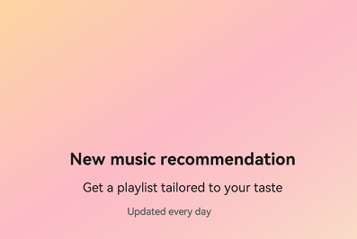

# @ohos.arkui.advanced.SplitLayout (Split Layout)


The split layout component allows you to split the available space into different content areas, which can be text only or a mixture of imagery and text.


> **NOTE**
>
> This component is supported since API version 10. Updates will be marked with a superscript to indicate their earliest API version.


## Modules to Import

```
import { SplitLayout } from '@ohos.arkui.advanced.SplitLayout'
```


## Child Components

Not supported

## Attributes
The [universal attributes](ts-universal-attributes-size.md) are not supported.


## SplitLayout

SplitLayout({mainImage: Resource, primaryText: string, secondaryText?: string, tertiaryText?: string})

**Decorator**: @Component

**System capability**: SystemCapability.ArkUI.ArkUI.Full

**Parameters**

| Name| Type| Mandatory| Description|
| -------- | -------- | -------- | -------- |
| mainImage | [ResourceStr](ts-types.md#resourcestr) | Yes| Image.|
| primaryText | [ResourceStr](ts-types.md#resourcestr) | Yes| Title.|
| secondaryText | [ResourceStr](ts-types.md#resourcestr) | No| Subtitle.|
| tertiaryText | [ResourceStr](ts-types.md#resourcestr) | No| Auxiliary text.|
| container | () =&gt; void | Yes| Container in the component.|

## Events
The [universal events](ts-universal-events-click.md) are not supported.

## Example

```ts
import { SplitLayout } from '@ohos.arkui.advanced.SplitLayout'
@Entry
@Component
struct Index {
  @State demoImage: Resource = $r("app.media.music")
  @State primaryText: string = "Title"
  @State secondaryText: string = "Subtitle"

  build() {
      Column() {
        SplitLayout({
          mainImage: this.demoImage,
          primaryText:'New music recommendation',
          secondaryText: 'Get a playlist tailored to your taste;',
          tertiaryText: "Updated every day",
        }) {
          Text('Example: Components can be added to a blank area container.')
            .margin({top:36})
        }
      }
      .justifyContent(FlexAlign.SpaceBetween)
      .height('100%')
      .width('100%')
  }
}
```


Layout less than 600 vp:





Layout between 600 vp and 840 vp:


Layout greater than 840 vp:


