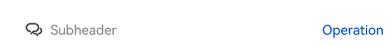

# @ohos.arkui.advanced.SubHeader (Subheader)


A subheader signifies the top of a list or the beginning a subdivision of content and tells the user what the list or subdivision is about.


> **NOTE**
>
> This component is supported since API version 10. Updates will be marked with a superscript to indicate their earliest API version.


## Modules to Import

```ts
import { SubHeader } from '@ohos.arkui.advanced.SubHeader'
```


## Child Components

Not supported

## Attributes
The [universal attributes](ts-universal-attributes-size.md) are supported.

## SubHeader

SubHeader({primaryTitle?: ResourceStr, secondaryTitle?: ResourceStr, icon?: ResourceStr, select?: SelectOptions, operationType?: OperationType, operationItem?: Array&lt;OperationOption&gt;})

**Decorator**: @Component

**System capability**: SystemCapability.ArkUI.ArkUI.Full


**Parameters**


| Name| Type| Mandatory| Decorator| Description|
| -------- | -------- | -------- | -------- | -------- |
| primaryTitle | [ResourceStr](ts-types.md#resourcestr) | No| \@Prop | Title. |
| secondaryTitle | [ResourceStr](ts-types.md#resourcestr) | No| \@Prop | Secondary text. |
| icon | [ResourceStr](ts-types.md#resourcestr) | No| \@Prop | Icon.|
| select | [SelectOptions](#selectoptions) | No| - | Content and events for selection.|
| operationType | [OperationType](#operationtype) | No| \@Prop | Type of operation in the operation area (right).<br>Default value: **OperationType.BUTTON**|
| operationItem | Array&lt;[OperationOption](#operationoption)&gt; | No| - | Settings of the operation in the operation area (right).|


## OperationType

| Name| Description|
| -------- | -------- |
| TEXT_ARROW | Text button with a right arrow.|
| BUTTON | Text button without a right arrow.|
| ICON_GROUP | Icon-attached button (A maximum of three icons can be configured.)|
| LOADING | Loading animation.|


## SelectOptions

| Name| Type| Mandatory| Description|
| -------- | -------- | -------- | -------- |
| options | Array&lt;[SelectOption](ts-basic-components-select.md)&gt; | Yes| Value of an option in the drop-down list box.|
| selected | number | No| Index of the initial selected option in the drop-down list.<br>The index of the first option is 0.<br>If this attribute is not set,<br>the default value **-1** is used, indicating that the option is not selected.|
| value | [ResourceStr](ts-types.md#resourcestr) | No| Text content of the drop-down list button itself.|
| onSelect | callback: (index: number, value?: string) =&gt; void | No| Invoked when an option in the drop-down list box is selected.<br>- **index**: index of the selected option.<br>- **value**: value of the selected option.|


## OperationOption

| Name| Type| Mandatory| Description|
| -------- | -------- | -------- | -------- |
| value | [ResourceStr](ts-types.md#resourcestr) | Yes| Text content.|
| action | ()=&gt;void | No| Event.|

## Events
The [universal events](ts-universal-events-click.md) are supported.

## Example
### Example 1

```ts
import promptAction from '@ohos.promptAction'
import { OperationType, SubHeader } from '@ohos.arkui.advanced.SubHeader'

@Entry
@Component
struct SubHeaderExample {
  build() {
    Column() {
      SubHeader({
        icon: $r('app.media.ic_public_community_messages'),
        primaryTitle: 'Subheader',
        operationType: OperationType.BUTTON,
        operationItem: [{ value: 'Operation',
          action: () => {
            promptAction.showToast({ message: 'demo' })
          }
        }]
      })
    }
  }
}
```



### Example 2

```ts
import promptAction from '@ohos.promptAction'
import { OperationType, SubHeader } from '@ohos.arkui.advanced.SubHeader'

@Entry
@Component
struct SubHeaderExample {
  build() {
    Column() {
      SubHeader({
        primaryTitle: 'Title',
        secondaryTitle:'Secondary text',
        operationType: OperationType.TEXT_ARROW,
        operationItem: [{value:'More',
          action: () => {
            promptAction.showToast({ message: 'demo' })
          }
        }]
      })
    }
  }
}
```


### Example 3

```ts
import promptAction from '@ohos.promptAction'
import { OperationType, SubHeader } from '@ohos.arkui.advanced.SubHeader'

@Entry
@Component
struct SubHeaderExample {
  build() {
    Column() {
      SubHeader({
        select: {
          options: [{ value: 'aaa' }, { value: 'bbb' }, { value: 'ccc' }],
          value: 'selectdemo',
          selected: 2,
          onSelect: (index: number, value?: string) => {
            promptAction.showToast({ message: 'demo' })
          }
        },
        operationType: OperationType.ICON_GROUP,
        operationItem: [{
          value: $r('app.media.ic_public_community_messages'),
          action: () => {
            promptAction.showToast({ message: 'demo' })
          }
        }, {
          value: $r('app.media.ic_public_community_messages'),
          action: () => {
            promptAction.showToast({ message: 'demo' })
          }
        }, {
          value: $r('app.media.ic_public_community_messages'),
          action: () => {
            promptAction.showToast({ message: 'demo' })
          }
        }]
      })
    }
  }
}
```


