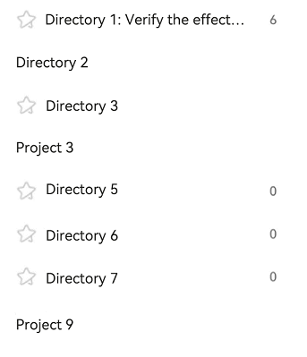

# @ohos.arkui.advanced.TreeView (Tree View)


The tree view component is used to display a hierarchical list of items. Each item can contain subitems, which may be expanded or collapsed.


This component is applicable in productivity applications, such as side navigation bars in notepad, email, and Gallery applications.


> **NOTE**
>
> This component is supported since API version 10. Updates will be marked with a superscript to indicate their earliest API version.


## Modules to Import

```
import { TreeView } from "@ohos.arkui.advanced.TreeView"
```


## Child Components

Not supported

## Attributes
The [universal attributes](ts-universal-attributes-size.md) are not supported.

## TreeView

TreeView({ treeController: TreeController })

**Decorator**: @Component

**System capability**: SystemCapability.ArkUI.ArkUI.Full


**Parameters**


| Name| Type| Mandatory| Description| 
| -------- | -------- | -------- | -------- |
| treeController | [TreeController](#treecontroller) | Yes| Node information of the tree view.| 


## TreeController

Implements a **TreeController** object, which can be bound to a tree view component to control the node information of the component. One **TreeController** object can be bound to only one tree view component.


### addNode


addNode(nodeParam?: NodeParam): void


Adds a child node to the selected node.


**Parameters**


| Name| Type| Mandatory| Description| 
| -------- | -------- | -------- | -------- |
| nodeParam | [NodeParam](#nodeparam) | No| Node information.| 


### removeNode

removeNode(): void

Removes the selected node.


### modifyNode


modifyNode(): void


Modifies the selected node.


### buildDone

buildDone(): void

Builds a tree view. After a node is added, this API must be called to save the tree information.


### refreshNode

refreshNode(parentId: number, parentSubTitle: ResourceStr, currentSubtitle: ResourceStr): void

**Parameters**

| Name| Type| Mandatory| Description| 
| -------- | -------- | -------- | -------- |
| parentId | number | Yes| ID of the parent node.| 
| parentSubTitle | [ResourceStr](ts-types.md#resourcestr) | Yes| Secondary text of the parent node.| 
| currentSubtitle | [ResourceStr](ts-types.md#resourcestr) | Yes| Secondary text of the current node.| 


## NodeParam

| Name| Type| Mandatory| Description| 
| -------- | -------- | -------- | -------- |
| parentNodeId | number | No| Parent node.| 
| currentNodeId | number | No| Current child node.| 
| isFolder | boolean | No| Whether the node is a directory.| 
| icon | ResourceStr | No| Icon.| 
| selectedIcon | ResourceStr | No| Icon of the selected node.| 
| editIcon | ResourceStr | No| Edit icon.| 
| primaryTitle | ResourceStr | No| Primary title.| 
| secondaryTitle | ResourceStr | No| Secondary title.| 
| container | () =&gt; void | No| Right-click child component bound to the node. The child component is decorated with @Builder.| 


## TreeListenerManager

Implements a **TreeListenerManager** object, which can be bound to a tree view component to listen for changes of tree nodes. One **TreeListenerManager** object can be bound to only one tree view component.


### getInstance

getInstance(): TreeListenerManager

Obtains a **TreeListenerManager** singleton object.


### getTreeListener()

getTreeListener(): TreeListener

Obtainsa listener.


## TreeListener

Listener of the tree view component. You can bind it to the tree view component and use it to listen for changes of tree nodes. A listener can be bound to only one tree view component.


### on

on(type: TreeListenType, callback: (callbackParam: CallbackParam) =&gt; void): void;

Register a listener.

**Parameters**

| Name| Type| Mandatory| Description| 
| -------- | -------- | -------- | -------- |
| type | [TreeListenType](#treelistentype) | Yes| Listening type.| 
| callbackParam | [CallbackParam](#callbackparam) | Yes| Node information.| 


### once

once(type: TreeListenType, callback: (callbackParam: CallbackParam) =&gt; void): void;

Registers a one-time listener.

**Parameters**

| Name| Type| Mandatory| Description| 
| -------- | -------- | -------- | -------- |
| type | [TreeListenType](#treelistentype) | Yes| Listening type.| 
| callbackParam | [CallbackParam](#callbackparam) | Yes| Node information.| 


### off


off(type: TreeListenType, callback?: (callbackParam: CallbackParam) =&gt; void): void;


Unregiseters a listener.


**Parameters**


| Name| Type| Mandatory| Description| 
| -------- | -------- | -------- | -------- |
| type | [TreeListenType](#treelistentype) | Yes| Listening type.| 
| nodeParam | [NodeParam](#nodeparam) | Yes| Node information.| 


## TreeListenType

| Name| Description| 
| -------- | -------- |
| NODE_CLICK | Listens for click events of nodes.| 
| NODE_ADD | Listens for add events of nodes.| 
| NODE_DELETE | Listens for delete events of nodes.| 
| NODE_MODIFY | Listens for modify events of nodes.| 
| NODE_MOVE | Listens for move events of nodes.| 


## CallbackParam

| Name| Type| Mandatory| Description| 
| -------- | -------- | -------- | -------- |
| currentNodeId | number | Yes| Current child node.| 
| parentNodeId | number | No| Parent node.| 
| childIndex: number | number | No| Child index.| 

## Events
The [universal events](ts-universal-events-click.md) are not supported.

## Example

```ts
import { TreeController, TreeListener, TreeListenerManager, TreeListenType, NodeParam, TreeView, CallbackParam } from '@ohos.arkui.advanced.TreeView'

@Entry
@Component
struct TreeViewDemo {
  private treeController: TreeController = new TreeController();
  private treeListener: TreeListener = TreeListenerManager.getInstance().getTreeListener();
  @State clickNodeId: number = 0;
  @State numbers: string[] = ['one', 'two', 'three', 'four', 'five', 'six'];

  aboutToDisappear(): void {
    this.treeListener.off(TreeListenType.NODE_CLICK, undefined);
    this.treeListener.off(TreeListenType.NODE_ADD, undefined);
    this.treeListener.off(TreeListenType.NODE_DELETE, undefined);
  }

  aboutToAppear(): void {
    this.treeListener.on(TreeListenType.NODE_MOVE, (callbackParam: CallbackParam) => {
    })
    this.treeListener.on(TreeListenType.NODE_CLICK, (callbackParam: CallbackParam) => {
    })

    let normalResource: Resource = $r('app.media.ic_public_collect_normal');
    let selectedResource: Resource = $r('app.media.ic_public_collect_selected');
    let editResource: Resource = $r('app.media.ic_public_collect_edit');
    let nodeParam: NodeParam = { parentNodeId:-1, currentNodeId: 1, isFolder: true, icon: normalResource, selectedIcon: selectedResource,
      editIcon: editResource, primaryTitle: "Directory 1: Verify the effect of the floating box",
      secondaryTitle: "6" };
    this.treeController
      .addNode(nodeParam)
      .addNode({parentNodeId:1, currentNodeId: 2, isFolder: false, primaryTitle: "Project 1_1" })
      .addNode({ parentNodeId:-1, currentNodeId: 7, isFolder: true, primaryTitle: "Directory 2" })
      .addNode({ parentNodeId:-1, currentNodeId: 23, isFolder: true, icon: normalResource, selectedIcon: selectedResource,
        editIcon: editResource, primaryTitle: "Directory 3" })
      .addNode({ parentNodeId:-1, currentNodeId: 24, isFolder: false, primaryTitle: "Project 4" })
      .addNode({ parentNodeId:-1, currentNodeId: 31, isFolder: true, icon: normalResource, selectedIcon: selectedResource,
        editIcon: editResource, primaryTitle: "Directory 5", secondaryTitle: "0" })
      .addNode({ parentNodeId:-1, currentNodeId: 32, isFolder: true, icon: normalResource, selectedIcon: selectedResource,
        editIcon: editResource, primaryTitle: "Directory 6", secondaryTitle: "0" })
      .addNode({ parentNodeId:32, currentNodeId: 35, isFolder: true, icon: normalResource, selectedIcon: selectedResource,
        editIcon: editResource, primaryTitle: "Directory 6-1", secondaryTitle: "0" })
      .addNode({ parentNodeId:-1, currentNodeId: 33, isFolder: true, icon: normalResource, selectedIcon: selectedResource,
        editIcon: editResource, primaryTitle: "Directory 7", secondaryTitle: "0" })
      .addNode({ parentNodeId:33, currentNodeId: 34, isFolder: false, primaryTitle: "Project 8" })
      .addNode({ parentNodeId:-1, currentNodeId: 36, isFolder: false, primaryTitle: "Project 9" })
      .buildDone();
  }

  build() {
    SideBarContainer(SideBarContainerType.Embed)
    {
      TreeView({ treeController: this.treeController })
      Row() {
        Divider().vertical(true).strokeWidth(2).color(0x000000).lineCap(LineCapStyle.Round)
        Column() {
          Row() {
            Text('ClickNodeId=' + this.clickNodeId).fontSize('16fp')
            Button('Add', { type: ButtonType.Normal, stateEffect: true })
              .borderRadius(8).backgroundColor(0x317aff).width(90)
              .onClick((event: ClickEvent) => {
                this.treeController.addNode();
              })
            Button('Modify', { type: ButtonType.Normal, stateEffect: true })
              .borderRadius(8).backgroundColor(0x317aff).width(90)
              .onClick((event: ClickEvent) => {
                this.treeController.modifyNode();
              })
            Button('Remove', { type: ButtonType.Normal, stateEffect: true })
              .borderRadius(8).backgroundColor(0x317aff).width(120)
              .onClick((event: ClickEvent) => {
                this.treeController.removeNode();
              })
          }
        }.height('100%').width('70%').alignItems(HorizontalAlign.Start)
      }
    }
    .focusable(true)
    .showControlButton(false)
    .showSideBar(true)
  }
}
```


