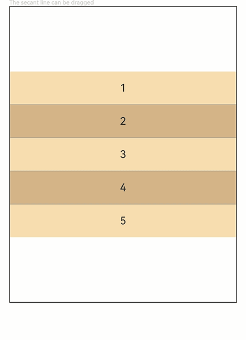

# ColumnSplit

The **\<ColumnSplit>** component lays out child components vertically and inserts a horizontal divider between every two child components.

>  **NOTE**
>
> This component is supported since API version 7. Updates will be marked with a superscript to indicate their earliest API version.
## Child Components

Supported

This component limits the height of its child components. During initialization, the layout of the component is calculated based on the height of its child components. After initialization, changes to the height of the child components do not take effect. Still, the space occupied by the child components can be changed by dragging the dividers between them.
## APIs

ColumnSplit()


## Attributes

| Name                  | Type                                                             | Description                            |
|-----------------------|-------------------------------------------------------------------|---------------------------------|
| resizeable            | boolean                                                           | Whether the divider can be dragged.<br/>Default value: **false**  |
| divider<sup>10+</sup> | [ColumnSplitDividerStyle](#columnsplitdividerstyle10) \| null | Margin of the divider.<br>- **DividerStyle**: distance between the divider and the child component above or below it.<br>- Default value: **null**, indicating that the top and bottom margins of the divider are 0.|

## ColumnSplitDividerStyle<sup>10+</sup>

| Name       | Type     | Mandatory| Description                      |
| ----------- | ------------- | ---- |--------------------------|
| startMargin | [Dimension](ts-types.md#dimension10)       | No  | Distance between the divider and the child component above it.<br>Default value: **0**|
| endMargin   | [Dimension](ts-types.md#dimension10)       | No  | Distance between the divider and the child component below it.<br>Default value: **0**|

>  **NOTE**
>
> Similar to **\<RowSplit>**, the divider of **\<ColumnSplit>** can change the height of the upper and lower child components, but only to the extent that the resultant height falls within the maximum and minimum heights of the child components.
>
> Universal attributes such as **clip** and **margin** are supported. If **clip** is not set, the default value **true** is used.


## Example

```ts
// xxx.ets
@Entry
@Component
struct ColumnSplitExample {
  build() {
    Column(){
      Text('The secant line can be dragged').fontSize(9).fontColor(0xCCCCCC).width('90%')
      ColumnSplit() {
        Text('1').width('100%').height(50).backgroundColor(0xF5DEB3).textAlign(TextAlign.Center)
        Text('2').width('100%').height(50).backgroundColor(0xD2B48C).textAlign(TextAlign.Center)
        Text('3').width('100%').height(50).backgroundColor(0xF5DEB3).textAlign(TextAlign.Center)
        Text('4').width('100%').height(50).backgroundColor(0xD2B48C).textAlign(TextAlign.Center)
        Text('5').width('100%').height(50).backgroundColor(0xF5DEB3).textAlign(TextAlign.Center)
      }
      .borderWidth(1)
      .resizeable(true) // The divider can be dragged.
      .width('90%').height('60%')
    }.width('100%')
  }
}
```


