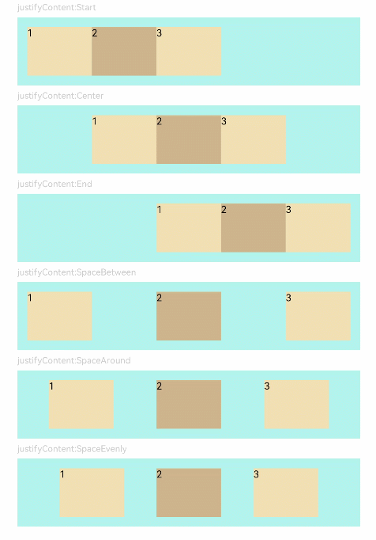

# Flex<a name="EN-US_TOPIC_0000001237475079"></a>

> **NOTE:** 
>This component is supported since API version 7. Updates will be marked with a superscript to indicate their earliest API version.

The  **<Flex\>**  component allows for an elastic layout.

## Required Permissions<a name="section11841179295"></a>

None

## Child Components<a name="section87974157296"></a>

This component can contain child components.

## APIs<a name="section14196162892911"></a>

Flex\(options?: \{ direction?: FlexDirection, wrap?: FlexWrap,  justifyContent?: FlexAlign, alignItems?: ItemAlign, alignContent?: FlexAlign \}\)

Creates a standard  **<Flex\>**  component.

-   Parameters

    <a name="table1392916196212"></a>
    <table><thead align="left"><tr id="row19306191218"><th class="cellrowborder" valign="top" width="16.11%" id="mcps1.1.6.1.1"><p id="p199307193217"><a name="p199307193217"></a><a name="p199307193217"></a>Name</p>
    </th>
    <th class="cellrowborder" valign="top" width="15.959999999999999%" id="mcps1.1.6.1.2"><p id="p119302191128"><a name="p119302191128"></a><a name="p119302191128"></a>Type</p>
    </th>
    <th class="cellrowborder" valign="top" width="11.04%" id="mcps1.1.6.1.3"><p id="p7930141911211"><a name="p7930141911211"></a><a name="p7930141911211"></a>Mandatory</p>
    </th>
    <th class="cellrowborder" valign="top" width="16.96%" id="mcps1.1.6.1.4"><p id="p1393020194219"><a name="p1393020194219"></a><a name="p1393020194219"></a>Default Value</p>
    </th>
    <th class="cellrowborder" valign="top" width="39.93%" id="mcps1.1.6.1.5"><p id="p693061912210"><a name="p693061912210"></a><a name="p693061912210"></a>Description</p>
    </th>
    </tr>
    </thead>
    <tbody><tr id="row1093021911217"><td class="cellrowborder" valign="top" width="16.11%" headers="mcps1.1.6.1.1 "><p id="p119307198218"><a name="p119307198218"></a><a name="p119307198218"></a>direction</p>
    </td>
    <td class="cellrowborder" valign="top" width="15.959999999999999%" headers="mcps1.1.6.1.2 "><p id="p129301719828"><a name="p129301719828"></a><a name="p129301719828"></a><a href="#li1282804954411">FlexDirection</a></p>
    </td>
    <td class="cellrowborder" valign="top" width="11.04%" headers="mcps1.1.6.1.3 "><p id="p893091913213"><a name="p893091913213"></a><a name="p893091913213"></a>No</p>
    </td>
    <td class="cellrowborder" valign="top" width="16.96%" headers="mcps1.1.6.1.4 "><p id="p029607124312"><a name="p029607124312"></a><a name="p029607124312"></a>Row</p>
    </td>
    <td class="cellrowborder" valign="top" width="39.93%" headers="mcps1.1.6.1.5 "><p id="p693016198212"><a name="p693016198212"></a><a name="p693016198212"></a>Direction in which child components are arranged in the <strong id="b57824685219"><a name="b57824685219"></a><a name="b57824685219"></a>&lt;Flex&gt;</strong> component, that is, the direction of the main axis.</p>
    </td>
    </tr>
    <tr id="row1924045711917"><td class="cellrowborder" valign="top" width="16.11%" headers="mcps1.1.6.1.1 "><p id="p72401857201915"><a name="p72401857201915"></a><a name="p72401857201915"></a>wrap</p>
    </td>
    <td class="cellrowborder" valign="top" width="15.959999999999999%" headers="mcps1.1.6.1.2 "><p id="p14240957171918"><a name="p14240957171918"></a><a name="p14240957171918"></a><a href="#li8211359104415">FlexWrap</a></p>
    </td>
    <td class="cellrowborder" valign="top" width="11.04%" headers="mcps1.1.6.1.3 "><p id="p62402572196"><a name="p62402572196"></a><a name="p62402572196"></a>No</p>
    </td>
    <td class="cellrowborder" valign="top" width="16.96%" headers="mcps1.1.6.1.4 "><p id="p4240957101912"><a name="p4240957101912"></a><a name="p4240957101912"></a>NoWrap</p>
    </td>
    <td class="cellrowborder" valign="top" width="39.93%" headers="mcps1.1.6.1.5 "><p id="p4240145781913"><a name="p4240145781913"></a><a name="p4240145781913"></a>Whether the <strong id="b254013538"><a name="b254013538"></a><a name="b254013538"></a>&lt;Flex&gt;</strong> component has a single line or multiple lines.</p>
    </td>
    </tr>
    <tr id="row186691154417"><td class="cellrowborder" valign="top" width="16.11%" headers="mcps1.1.6.1.1 "><p id="p1366161134412"><a name="p1366161134412"></a><a name="p1366161134412"></a>justifyContent</p>
    </td>
    <td class="cellrowborder" valign="top" width="15.959999999999999%" headers="mcps1.1.6.1.2 "><p id="p126661174410"><a name="p126661174410"></a><a name="p126661174410"></a><a href="#li1540916112452">FlexAlign</a></p>
    </td>
    <td class="cellrowborder" valign="top" width="11.04%" headers="mcps1.1.6.1.3 "><p id="p12671018444"><a name="p12671018444"></a><a name="p12671018444"></a>No</p>
    </td>
    <td class="cellrowborder" valign="top" width="16.96%" headers="mcps1.1.6.1.4 "><p id="p106741164418"><a name="p106741164418"></a><a name="p106741164418"></a>Start</p>
    </td>
    <td class="cellrowborder" valign="top" width="39.93%" headers="mcps1.1.6.1.5 "><p id="p186715174414"><a name="p186715174414"></a><a name="p186715174414"></a>Alignment mode of the child components in the <strong id="b516691085414"><a name="b516691085414"></a><a name="b516691085414"></a>&lt;Flex&gt;</strong> component along the main axis.</p>
    </td>
    </tr>
    <tr id="row146013564415"><td class="cellrowborder" valign="top" width="16.11%" headers="mcps1.1.6.1.1 "><p id="p12602145154413"><a name="p12602145154413"></a><a name="p12602145154413"></a>alignItems</p>
    </td>
    <td class="cellrowborder" valign="top" width="15.959999999999999%" headers="mcps1.1.6.1.2 "><p id="p76024516446"><a name="p76024516446"></a><a name="p76024516446"></a><a href="ts-appendix-enums.md#section14211428171612">ItemAlign</a></p>
    </td>
    <td class="cellrowborder" valign="top" width="11.04%" headers="mcps1.1.6.1.3 "><p id="p18602105114417"><a name="p18602105114417"></a><a name="p18602105114417"></a>No</p>
    </td>
    <td class="cellrowborder" valign="top" width="16.96%" headers="mcps1.1.6.1.4 "><p id="p1760213594419"><a name="p1760213594419"></a><a name="p1760213594419"></a>Stretch</p>
    </td>
    <td class="cellrowborder" valign="top" width="39.93%" headers="mcps1.1.6.1.5 "><p id="p131528112370"><a name="p131528112370"></a><a name="p131528112370"></a>Alignment mode of the child components in the <strong id="b185701352125416"><a name="b185701352125416"></a><a name="b185701352125416"></a>&lt;Flex&gt;</strong> component along the cross axis.</p>
    </td>
    </tr>
    <tr id="row0512101004411"><td class="cellrowborder" valign="top" width="16.11%" headers="mcps1.1.6.1.1 "><p id="p7512151013447"><a name="p7512151013447"></a><a name="p7512151013447"></a>alignContent</p>
    </td>
    <td class="cellrowborder" valign="top" width="15.959999999999999%" headers="mcps1.1.6.1.2 "><p id="p125121810184411"><a name="p125121810184411"></a><a name="p125121810184411"></a><a href="#li1540916112452">FlexAlign</a></p>
    </td>
    <td class="cellrowborder" valign="top" width="11.04%" headers="mcps1.1.6.1.3 "><p id="p165121010194414"><a name="p165121010194414"></a><a name="p165121010194414"></a>No</p>
    </td>
    <td class="cellrowborder" valign="top" width="16.96%" headers="mcps1.1.6.1.4 "><p id="p185121310134412"><a name="p185121310134412"></a><a name="p185121310134412"></a>Start</p>
    </td>
    <td class="cellrowborder" valign="top" width="39.93%" headers="mcps1.1.6.1.5 "><p id="p151219104444"><a name="p151219104444"></a><a name="p151219104444"></a>Alignment mode of the child components in a multi-line <strong id="b18263203718317"><a name="b18263203718317"></a><a name="b18263203718317"></a>&lt;Flex&gt;</strong> component along the cross axis. This parameter is valid only when <strong id="b1176602216556"><a name="b1176602216556"></a><a name="b1176602216556"></a>wrap</strong> is set to <strong id="b15251726135518"><a name="b15251726135518"></a><a name="b15251726135518"></a>Wrap</strong> or <strong id="b1147516323559"><a name="b1147516323559"></a><a name="b1147516323559"></a>WrapReverse</strong>.</p>
    </td>
    </tr>
    </tbody>
    </table>

-   <a name="li1282804954411"></a>FlexDirection enums

    <a name="table3452114216394"></a>
    <table><thead align="left"><tr id="row245219426397"><th class="cellrowborder" valign="top" width="25.2%" id="mcps1.1.3.1.1"><p id="p545244283914"><a name="p545244283914"></a><a name="p545244283914"></a>Name</p>
    </th>
    <th class="cellrowborder" valign="top" width="74.8%" id="mcps1.1.3.1.2"><p id="p2452114203917"><a name="p2452114203917"></a><a name="p2452114203917"></a>Description</p>
    </th>
    </tr>
    </thead>
    <tbody><tr id="row6452144218390"><td class="cellrowborder" valign="top" width="25.2%" headers="mcps1.1.3.1.1 "><p id="p34529427398"><a name="p34529427398"></a><a name="p34529427398"></a>Row</p>
    </td>
    <td class="cellrowborder" valign="top" width="74.8%" headers="mcps1.1.3.1.2 "><p id="p1245211421393"><a name="p1245211421393"></a><a name="p1245211421393"></a>The child components are arranged in the same direction as the main axis runs along the rows.</p>
    </td>
    </tr>
    <tr id="row12452184217398"><td class="cellrowborder" valign="top" width="25.2%" headers="mcps1.1.3.1.1 "><p id="p54523425398"><a name="p54523425398"></a><a name="p54523425398"></a>RowReverse</p>
    </td>
    <td class="cellrowborder" valign="top" width="74.8%" headers="mcps1.1.3.1.2 "><p id="p745215426391"><a name="p745215426391"></a><a name="p745215426391"></a>The child components are arranged opposite to the <strong id="b207941318124617"><a name="b207941318124617"></a><a name="b207941318124617"></a>Row</strong> direction.</p>
    </td>
    </tr>
    <tr id="row9452134213392"><td class="cellrowborder" valign="top" width="25.2%" headers="mcps1.1.3.1.1 "><p id="p510719111403"><a name="p510719111403"></a><a name="p510719111403"></a>Column</p>
    </td>
    <td class="cellrowborder" valign="top" width="74.8%" headers="mcps1.1.3.1.2 "><p id="p154533425394"><a name="p154533425394"></a><a name="p154533425394"></a>The child components are arranged in the same direction as the main axis runs down the columns.</p>
    </td>
    </tr>
    <tr id="row1345313424399"><td class="cellrowborder" valign="top" width="25.2%" headers="mcps1.1.3.1.1 "><p id="p1766215124010"><a name="p1766215124010"></a><a name="p1766215124010"></a>ColumnReverse</p>
    </td>
    <td class="cellrowborder" valign="top" width="74.8%" headers="mcps1.1.3.1.2 "><p id="p1245319426394"><a name="p1245319426394"></a><a name="p1245319426394"></a>The child components are arranged opposite to the <strong id="b9521933125411"><a name="b9521933125411"></a><a name="b9521933125411"></a>Column</strong> direction.</p>
    </td>
    </tr>
    </tbody>
    </table>


-   <a name="li8211359104415"></a>FlexWrap enums

    <a name="table0702724614"></a>
    <table><thead align="left"><tr id="row1702182467"><th class="cellrowborder" valign="top" width="25.2%" id="mcps1.1.3.1.1"><p id="p1670213215619"><a name="p1670213215619"></a><a name="p1670213215619"></a>Name</p>
    </th>
    <th class="cellrowborder" valign="top" width="74.8%" id="mcps1.1.3.1.2"><p id="p16702721668"><a name="p16702721668"></a><a name="p16702721668"></a>Description</p>
    </th>
    </tr>
    </thead>
    <tbody><tr id="row1870292668"><td class="cellrowborder" valign="top" width="25.2%" headers="mcps1.1.3.1.1 "><p id="p11702622618"><a name="p11702622618"></a><a name="p11702622618"></a>NoWrap</p>
    </td>
    <td class="cellrowborder" valign="top" width="74.8%" headers="mcps1.1.3.1.2 "><p id="p870222861"><a name="p870222861"></a><a name="p870222861"></a>The child components in the <strong id="b1459093217319"><a name="b1459093217319"></a><a name="b1459093217319"></a>&lt;Flex&gt;</strong> component are arranged in a single line, and they may overflow.</p>
    </td>
    </tr>
    <tr id="row67021021269"><td class="cellrowborder" valign="top" width="25.2%" headers="mcps1.1.3.1.1 "><p id="p870232968"><a name="p870232968"></a><a name="p870232968"></a>Wrap</p>
    </td>
    <td class="cellrowborder" valign="top" width="74.8%" headers="mcps1.1.3.1.2 "><p id="p1470218216616"><a name="p1470218216616"></a><a name="p1470218216616"></a>The child components in the <strong id="b13156747413"><a name="b13156747413"></a><a name="b13156747413"></a>&lt;Flex&gt;</strong> component are arranged in multiple lines, and they may overflow.</p>
    </td>
    </tr>
    <tr id="row2702621867"><td class="cellrowborder" valign="top" width="25.2%" headers="mcps1.1.3.1.1 "><p id="p3702321463"><a name="p3702321463"></a><a name="p3702321463"></a>WrapReverse</p>
    </td>
    <td class="cellrowborder" valign="top" width="74.8%" headers="mcps1.1.3.1.2 "><p id="p870213213620"><a name="p870213213620"></a><a name="p870213213620"></a>The child components in the <strong id="b1829466757"><a name="b1829466757"></a><a name="b1829466757"></a>&lt;Flex&gt;</strong> component are reversely arranged in multiple lines, and they may overflow.</p>
    </td>
    </tr>
    </tbody>
    </table>


-   <a name="li1540916112452"></a>FlexAlign enums

    <a name="table1688854511115"></a>
    <table><thead align="left"><tr id="row488814456115"><th class="cellrowborder" valign="top" width="25.2%" id="mcps1.1.3.1.1"><p id="p15888245171113"><a name="p15888245171113"></a><a name="p15888245171113"></a>Name</p>
    </th>
    <th class="cellrowborder" valign="top" width="74.8%" id="mcps1.1.3.1.2"><p id="p68881545171110"><a name="p68881545171110"></a><a name="p68881545171110"></a>Description</p>
    </th>
    </tr>
    </thead>
    <tbody><tr id="row3888164515112"><td class="cellrowborder" valign="top" width="25.2%" headers="mcps1.1.3.1.1 "><p id="p18888114513115"><a name="p18888114513115"></a><a name="p18888114513115"></a>Start</p>
    </td>
    <td class="cellrowborder" valign="top" width="74.8%" headers="mcps1.1.3.1.2 "><p id="p788818451116"><a name="p788818451116"></a><a name="p788818451116"></a>The child components are aligned with the start edge of the main axis. The first component is aligned with the main-start, and subsequent components are aligned with the previous one.</p>
    </td>
    </tr>
    <tr id="row1488834517117"><td class="cellrowborder" valign="top" width="25.2%" headers="mcps1.1.3.1.1 "><p id="p0888164551119"><a name="p0888164551119"></a><a name="p0888164551119"></a>Center</p>
    </td>
    <td class="cellrowborder" valign="top" width="74.8%" headers="mcps1.1.3.1.2 "><p id="p5888945161112"><a name="p5888945161112"></a><a name="p5888945161112"></a>The child components are aligned in the center of the main axis. The space between the first component and the main-start is the same as that between the last component and the main-end.</p>
    </td>
    </tr>
    <tr id="row6888545131114"><td class="cellrowborder" valign="top" width="25.2%" headers="mcps1.1.3.1.1 "><p id="p988813459116"><a name="p988813459116"></a><a name="p988813459116"></a>End</p>
    </td>
    <td class="cellrowborder" valign="top" width="74.8%" headers="mcps1.1.3.1.2 "><p id="p7888945151114"><a name="p7888945151114"></a><a name="p7888945151114"></a>The child components are aligned with the end edge of the main axis. The last component is aligned with the main-end, and other components are aligned with the next one.</p>
    </td>
    </tr>
    <tr id="row1888104591116"><td class="cellrowborder" valign="top" width="25.2%" headers="mcps1.1.3.1.1 "><p id="p2088819453111"><a name="p2088819453111"></a><a name="p2088819453111"></a>SpaceBetween</p>
    </td>
    <td class="cellrowborder" valign="top" width="74.8%" headers="mcps1.1.3.1.2 "><p id="p16888845151118"><a name="p16888845151118"></a><a name="p16888845151118"></a>The child components are evenly distributed along the main axis. The first component is aligned with the main-start, the last component is aligned with the main-end, and the remaining components are distributed so that the space between any two adjacent components is the same.</p>
    </td>
    </tr>
    <tr id="row1271965421219"><td class="cellrowborder" valign="top" width="25.2%" headers="mcps1.1.3.1.1 "><p id="p77209547128"><a name="p77209547128"></a><a name="p77209547128"></a>SpaceAround</p>
    </td>
    <td class="cellrowborder" valign="top" width="74.8%" headers="mcps1.1.3.1.2 "><p id="p643212229589"><a name="p643212229589"></a><a name="p643212229589"></a>The child components are evenly distributed along the main axis, with a half-size space on either end. The space between any two adjacent components is the same. The space between the first component and main-start, and that between the last component and cross-main are both half the size of the space between two adjacent components.</p>
    </td>
    </tr>
    <tr id="row18985013132"><td class="cellrowborder" valign="top" width="25.2%" headers="mcps1.1.3.1.1 "><p id="p1789816012137"><a name="p1789816012137"></a><a name="p1789816012137"></a>SpaceEvenly</p>
    </td>
    <td class="cellrowborder" valign="top" width="74.8%" headers="mcps1.1.3.1.2 "><p id="p1889818012134"><a name="p1889818012134"></a><a name="p1889818012134"></a>The child components are equally distributed along the main axis. The space between the first component and main-start, the space between the last component and main-end, and the space between two adjacent components are the same.</p>
    </td>
    </tr>
    </tbody>
    </table>


## Example<a name="section14441203783118"></a>

```
// Example 01
@Entry
@Component
struct FlexExample1 {
  build() {
    Column() {
      Column({ space: 5 }) {
        Text('direction:Row').fontSize(9).fontColor(0xCCCCCC).width('90%')
        Flex({ direction: FlexDirection.Row }) {
          Text('1').width('20%').height(50).backgroundColor(0xF5DEB3)
          Text('2').width('20%').height(50).backgroundColor(0xD2B48C)
          Text('3').width('20%').height(50).backgroundColor(0xF5DEB3)
          Text('4').width('20%').height(50).backgroundColor(0xD2B48C)
        }
        .height(70)
        .width('90%')
        .padding(10)
        .backgroundColor(0xAFEEEE)

        Text('direction:RowReverse').fontSize(9).fontColor(0xCCCCCC).width('90%')
        Flex({ direction: FlexDirection.RowReverse }) {
          Text('1').width('20%').height(50).backgroundColor(0xF5DEB3)
          Text('2').width('20%').height(50).backgroundColor(0xD2B48C)
          Text('3').width('20%').height(50).backgroundColor(0xF5DEB3)
          Text('4').width('20%').height(50).backgroundColor(0xD2B48C)
        }
        .height(70)
        .width('90%')
        .padding(10)
        .backgroundColor(0xAFEEEE)

        Text('direction:Column').fontSize(9).fontColor(0xCCCCCC).width('90%')
        Flex({ direction: FlexDirection.Column }) {
          Text('1').width('100%').height(40).backgroundColor(0xF5DEB3)
          Text('2').width('100%').height(40).backgroundColor(0xD2B48C)
          Text('3').width('100%').height(40).backgroundColor(0xF5DEB3)
          Text('4').width('100%').height(40).backgroundColor(0xD2B48C)
        }
        .height(160)
        .width('90%')
        .padding(10)
        .backgroundColor(0xAFEEEE)

        Text('direction:ColumnReverse').fontSize(9).fontColor(0xCCCCCC).width('90%')
        Flex({ direction: FlexDirection.ColumnReverse }) {
          Text('1').width('100%').height(40).backgroundColor(0xF5DEB3)
          Text('2').width('100%').height(40).backgroundColor(0xD2B48C)
          Text('3').width('100%').height(40).backgroundColor(0xF5DEB3)
          Text('4').width('100%').height(40).backgroundColor(0xD2B48C)
        }
        .height(160)
        .width('90%')
        .padding(10)
        .backgroundColor(0xAFEEEE)
      }.width('100%').margin({ top: 5 })
    }.width('100%')
  }
}
```


```
// Example 02
@Entry
@Component
struct FlexExample2 {
  build() {
    Column() {
      Column({ space: 5 }) {
        Text('Wrap').fontSize(9).fontColor(0xCCCCCC).width('90%')
        Flex({ wrap: FlexWrap.Wrap }) {
          Text('1').width('50%').height(50).backgroundColor(0xF5DEB3)
          Text('2').width('50%').height(50).backgroundColor(0xD2B48C)
          Text('3').width('50%').height(50).backgroundColor(0xD2B48C)
        }
        .width('90%')
        .padding(10)
        .backgroundColor(0xAFEEEE)

        Text('NoWrap').fontSize(9).fontColor(0xCCCCCC).width('90%')
        Flex({ wrap: FlexWrap.NoWrap }) {
          Text('1').width('50%').height(50).backgroundColor(0xF5DEB3)
          Text('2').width('50%').height(50).backgroundColor(0xD2B48C)
          Text('3').width('50%').height(50).backgroundColor(0xF5DEB3)
        }
        .width('90%')
        .padding(10)
        .backgroundColor(0xAFEEEE)

        Text('WrapReverse').fontSize(9).fontColor(0xCCCCCC).width('90%')
        Flex({ wrap: FlexWrap.WrapReverse , direction:FlexDirection.Row }) {
          Text('1').width('50%').height(50).backgroundColor(0xF5DEB3)
          Text('2').width('50%').height(50).backgroundColor(0xD2B48C)
          Text('3').width('50%').height(50).backgroundColor(0xD2B48C)
        }
        .width('90%')
        .height(120)
        .padding(10)
        .backgroundColor(0xAFEEEE)
      }.width('100%').margin({ top: 5 })
    }.width('100%')
  }
}
```


```
// Example 03
@Component
struct JustifyContentFlex {
  @Prop justifyContent : number

  build() {
    Flex({ justifyContent: this.justifyContent }) {
      Text('1').width('20%').height(50).backgroundColor(0xF5DEB3)
      Text('2').width('20%').height(50).backgroundColor(0xD2B48C)
      Text('3').width('20%').height(50).backgroundColor(0xF5DEB3)
    }
    .width('90%')
    .padding(10)
    .backgroundColor(0xAFEEEE)
  }
}

@Entry
@Component
struct FlexExample3 {
  build() {
    Column() {
      Column({ space: 5 }) {
        Text('justifyContent:Start').fontSize(9).fontColor(0xCCCCCC).width('90%')
        JustifyContentFlex({ justifyContent: FlexAlign.Start })

        Text('justifyContent:Center').fontSize(9).fontColor(0xCCCCCC).width('90%')
        JustifyContentFlex({ justifyContent: FlexAlign.Center })

        Text('justifyContent:End').fontSize(9).fontColor(0xCCCCCC).width('90%')
        JustifyContentFlex({ justifyContent: FlexAlign.End })

        Text('justifyContent:SpaceBetween').fontSize(9).fontColor(0xCCCCCC).width('90%')
        JustifyContentFlex({ justifyContent: FlexAlign.SpaceBetween })

        Text('justifyContent:SpaceAround').fontSize(9).fontColor(0xCCCCCC).width('90%')
        JustifyContentFlex({ justifyContent: FlexAlign.SpaceAround })

        Text('justifyContent:SpaceEvenly').fontSize(9).fontColor(0xCCCCCC).width('90%')
        JustifyContentFlex({ justifyContent: FlexAlign.SpaceEvenly })
      }.width('100%').margin({ top: 5 })
    }.width('100%')
  }
}
```



```
// Example 04
@Component
struct AlignItemsFlex {
  @Prop alignItems : number

  build() {
    Flex({ alignItems: this.alignItems }) {
      Text('1').width('33%').height(30).backgroundColor(0xF5DEB3)
      Text('2').width('33%').height(40).backgroundColor(0xD2B48C)
      Text('3').width('33%').height(50).backgroundColor(0xF5DEB3)
    }
    .size({width: '90%', height: 80})
    .padding(10)
    .backgroundColor(0xAFEEEE)
  }
}

@Entry
@Component
struct FlexExample4 {
  build() {
    Column() {
      Column({ space: 5 }) {
        Text('alignItems:Auto').fontSize(9).fontColor(0xCCCCCC).width('90%')
        AlignItemsFlex({ alignItems: ItemAlign.Auto })

        Text('alignItems:Start').fontSize(9).fontColor(0xCCCCCC).width('90%')
        AlignItemsFlex({ alignItems: ItemAlign.Start })

        Text('alignItems:Center').fontSize(9).fontColor(0xCCCCCC).width('90%')
        AlignItemsFlex({ alignItems: ItemAlign.Center })

        Text('alignItems:End').fontSize(9).fontColor(0xCCCCCC).width('90%')
        AlignItemsFlex({ alignItems: ItemAlign.End })

        Text('alignItems:Stretch').fontSize(9).fontColor(0xCCCCCC).width('90%')
        AlignItemsFlex({ alignItems: ItemAlign.Stretch })

        Text('alignItems:Baseline').fontSize(9).fontColor(0xCCCCCC).width('90%')
        AlignItemsFlex({ alignItems: ItemAlign.Baseline })
      }.width('100%').margin({ top: 5 })
    }.width('100%')
  }
}
```


```
// Example 05
@Component
struct AlignContentFlex {
  @Prop alignContent: number

  build() {
    Flex({ wrap: FlexWrap.Wrap, alignContent: this.alignContent }) {
      Text('1').width('50%').height(20).backgroundColor(0xF5DEB3)
      Text('2').width('50%').height(20).backgroundColor(0xD2B48C)
      Text('3').width('50%').height(20).backgroundColor(0xD2B48C)
    }
    .size({ width: '90%', height: 90 })
    .padding(10)
    .backgroundColor(0xAFEEEE)
  }
}

@Entry
@Component
struct FlexExample5 {
  build() {
    Column() {
      Column({ space: 5 }) {
        Text('alignContent:Start').fontSize(9).fontColor(0xCCCCCC).width('90%')
        AlignContentFlex({ alignContent: FlexAlign.Start })

        Text('alignContent:Center').fontSize(9).fontColor(0xCCCCCC).width('90%')
        AlignContentFlex({ alignContent: FlexAlign.Center })

        Text('alignContent:End').fontSize(9).fontColor(0xCCCCCC).width('90%')
        AlignContentFlex({ alignContent: FlexAlign.End })

        Text('alignContent:SpaceBetween').fontSize(9).fontColor(0xCCCCCC).width('90%')
        AlignContentFlex({ alignContent: FlexAlign.SpaceBetween })

        Text('alignContent:SpaceAround').fontSize(9).fontColor(0xCCCCCC).width('90%')
        AlignContentFlex({ alignContent: FlexAlign.SpaceAround })

        Text('alignContent:SpaceEvenly').fontSize(9).fontColor(0xCCCCCC).width('90%')
        AlignContentFlex({ alignContent: FlexAlign.SpaceEvenly })
      }.width('100%').margin({ top: 5 })
    }.width('100%')
  }
}
```


