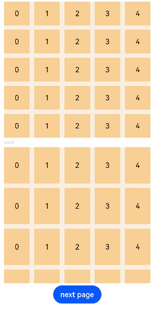

# Grid

The **\<Grid>** component consists of cells formed by rows and columns. You can specify the cells where items are located to form various layouts.

>  **NOTE**
>
>  This component is supported since API version 7. Updates will be marked with a superscript to indicate their earliest API version.


## Child Components

The **\<Grid>** component accepts only **\<[GridItem](ts-container-griditem.md)>** as its child components.

>  **NOTE**
>
>  Below are the rules for calculating the indexes of the child components of **\<Grid>**:
>
>  The index increases in ascending order of child components.
>
>  In the **if/else** statement, only the child components in the branch where the condition is met participate in the index calculation.
>
>  In the **ForEach** or **LazyForEach** statement, the indexes of all expanded subnodes are calculated.
>
>  If the values of [if/else](../../quick-start/arkts-rendering-control-ifelse.md), [ForEach](../../quick-start/arkts-rendering-control-foreach.md), and [LazyForEach](../../quick-start/arkts-rendering-control-lazyforeach.md) change, the indexes of subnodes are updated.
>
>  Child components of **\<Grid>** whose **visibility** attribute is set to **Hidden** or **None** are included in the index calculation.
>
>  Child components of **\<Grid>** whose **visibility** attribute is set to **None** are not displayed, but still take up the corresponding cells.


## APIs

Grid(scroller?: Scroller)

**Parameters**

| Name  | Type                                   | Mandatory| Description                                                    |
| -------- | ------------------------------------------- | ---- | ------------------------------------------------------------ |
| scroller | [Scroller](ts-container-scroll.md#scroller) | No  | Controller, which can be bound to scrollable components.<br>**NOTE**<br>The scroller cannot be bound to other [scrollable components](ts-container-list.md).|

## Attributes

In addition to the [universal attributes](ts-universal-attributes-size.md), the following attributes are supported.

| Name| Type| Description|
| -------- | -------- | -------- |
| columnsTemplate | string | Number of columns in the current grid layout. If this attribute is not set, one column will be used.<br>For example, **'1fr 1fr 2fr'** indicates three columns, with the first column taking up 1/4 of the parent component's full width, the second column 1/4, and the third column 2/4.<br>**NOTE**<br>If this attribute is set to **'0fr'**, the column width is 0, and grid item in the column is not displayed. If this attribute is set to any other invalid value, the grid item is displayed as one column.|
| rowsTemplate | string | Number of rows in the current grid layout. If this attribute is not set, one row will be used.<br>For example, **'1fr 1fr 2fr'** indicates three rows, with the first row taking up 1/4 of the parent component's full height, the second row 1/4, and the third row 2/4.<br>**NOTE**<br>If this attribute is set to **'0fr'**, the row width is 0, and grid item in the row is not displayed. If this attribute is set to any other invalid value, the grid item is displayed as one row.|
| columnsGap | [Length](ts-types.md#length) | Gap between columns.<br>Default value: **0**<br>**NOTE**<br>A value less than 0 evaluates to the default value.|
| rowsGap | [Length](ts-types.md#length) | Gap between rows.<br>Default value: **0**<br>**NOTE**<br>A value less than 0 evaluates to the default value.|
| scrollBar      | [BarState](ts-appendix-enums.md#barstate) | Scrollbar status.<br>Default value: **BarState.Off**<br>**NOTE**<br>In API version 9 and earlier versions, the default value is **BarState.Off**. In API version 10, the default value is **BarState.Auto**.|
| scrollBarColor | string \| number \| [Color](ts-appendix-enums.md#color) | Color of the scrollbar.|
| scrollBarWidth | string \| number    | Width of the scrollbar. After the width is set, the scrollbar is displayed with the set width in normal state and pressed state.<br>Default value: **4**<br>Unit: vp|
| cachedCount | number                                   | Number of grid items to be preloaded (cached). It works only in [LazyForEach](../../quick-start/arkts-rendering-control-lazyforeach.md). For details, see [Minimizing White Blocks During Swiping](../../ui/arkts-performance-improvement-recommendation.md#minimizing-white-blocks-during-swiping).<br>Default value: **1**<br>**NOTE**<br>The number of the grid items to be cached before and after the currently displayed one equals the value of **cachedCount** multiplied by the number of columns.<br>Grid items that exceed the display and cache range are released.<br>A value less than 0 evaluates to the default value.|
| editMode <sup>8+</sup>                   | boolean | Whether to enter editing mode. In editing mode, the user can drag the **\<[GridItem](ts-container-griditem.md)>** in the **\<Grid>** component.<br>Default value: **false**|
| layoutDirection<sup>8+</sup>             | [GridDirection](#griddirection8) | Main axis direction of the grid.<br>Default value: **GridDirection.Row**|
| maxCount<sup>8+</sup> | number  | When **layoutDirection** is **Row** or **RowReverse**: maximum number of columns that can be displayed.<br>When **layoutDirection** is **Column** or **ColumnReverse**: maximum number of rows that can be displayed.<br>Default value: **Infinity**<br>**NOTE**<br>If the value of **maxCount** is smaller than that of **minCount**, the default values of **maxCount** and **minCount** are used.<br>A value less than 0 evaluates to the default value.|
| minCount<sup>8+</sup> | number  | When **layoutDirection** is **Row** or **RowReverse**: minimum number of columns that can be displayed.<br>When **layoutDirection** is **Column** or **ColumnReverse**: minimum number of rows that can be displayed.<br>Default value: **1**<br>**NOTE**<br>A value less than 0 evaluates to the default value.|
| cellLength<sup>8+</sup> | number  | When **layoutDirection** is **Row** or **RowReverse**: fixed height per row.<br>When **layoutDirection** is **Column** or **ColumnReverse**: fixed width per column.<br>Default value: size of the first element|
| multiSelectable<sup>8+</sup> | boolean | Whether to enable mouse frame selection.<br>Default value: **false**<br>- **false**: The mouse frame selection is disabled.<br>- **true**: The mouse frame selection is enabled.|
| supportAnimation<sup>8+</sup> | boolean | Whether to enable animation. Currently, the grid item drag animation is supported.<br>Default value: **false**|
| edgeEffect<sup>10+</sup> | [EdgeEffect](ts-appendix-enums.md#edgeeffect) | Scroll effect. The spring effect and shadow effect are supported.<br>Default value: **EdgeEffect.None**<br>|
| enableScrollInteraction<sup>10+</sup>  |  boolean  |   Whether to support scroll gestures. When this attribute is set to **false**, scrolling by finger or mouse is not supported, but the scrolling controller API is not affected.<br>Default value: **true**     |

Depending on the settings of the **rowsTemplate** and **columnsTemplate** attributes, the **\<Grid>** component supports the following layout modes:

1. **rowsTemplate** and **columnsTemplate** are both set

- The **\<Grid>** component displays only elements in a fixed number of rows and columns and cannot be scrolled.
- In this mode, the following attributes do not take effect: **layoutDirection**, **maxCount**, **minCount**, and **cellLength**.
- If the width and height of a grid are not set, the grid adapts to the size of its parent component by default.
- The size of the grid rows and columns is the size of the grid content area minus the gap between rows and columns. It is allocated based on the proportion of each row and column.
- By default, the grid items fill the entire grid.
- In this mode, if a grid item has both **rowStart** and **columnStart** set, it is placed in the position based on the settings. If a grid item already exists in this position, overlapping occurs.
- If a grid item has only **rowStart** or **columnStart** set, the system traverses the previous grid item layout to search for an idle position that meets the settings. If no idle position meets the requirements, the grid item is not laid out.
- If a grid item has neither **rowStart** nor **columnStart** set, the system traverses the previous grid item layout to search for an idle position. If no idle position is available, the grid item is not laid out.
- If a grid item has **rowEnd** set but not **rowStart**, **rowStart** is considered as set to the same value as **rowEnd**. If a grid item has **columnEnd** set but not **columnStart**, **columnStart** is considered as set to the same value as **columnEnd**.

2. Either **rowsTemplate** or **columnsTemplate** is set

- The **\<Grid>** component arranges elements in the specified direction and allows for scrolling to display excess elements.
- If **columnsTemplate** is set, the component scrolls vertically, the main axis runs vertically, and the cross axis runs horizontally.
- If **rowsTemplate** is set, the component scrolls horizontally, the main axis runs horizontally, and the cross axis runs vertically.
- In this mode, the following attributes do not take effect: **layoutDirection**, **maxCount**, minCount, and **cellLength**.
- The cross axis size of the grid is the cross axis size of the grid content area minus the gaps along the cross axis. It is allocated based on the proportion of each row and column.
- The main axis size of the grid is the maximum height of all grid items in the cross axis direction of the current grid.
- In this mode, if a grid item has both **rowStart** and **columnStart** set, it is placed in the position based on the settings. If a grid item already exists in this position, overlapping occurs.
- If a grid item has only **rowStart** or **columnStart** set, the system traverses the previous grid item layout to search for an idle position that meets the settings.
- If a grid item has neither **rowStart** nor **columnStart** set, the system traverses the previous grid item layout to search for an idle position.
- If a grid item has **rowEnd** set but not **rowStart**, **rowStart** is considered as set to the same value as **rowEnd**. If a grid item has **columnEnd** set but not **columnStart**, **columnStart** is considered as set to the same value as **columnEnd**.

3. Neither **rowsTemplate** nor **columnsTemplate** is set

- The **\<Grid>** component arranges elements in the direction specified by **layoutDirection**. The number of columns is jointly determined by the grid width, width of the first element, **minCount**, **maxCount**, and **columnsGap**.
- The number of rows is jointly determined by the grid height, height of the first element, **cellLength**, and **rowsGap**. Elements outside the determined range of rows and columns are not displayed and cannot be viewed through scrolling.
- In this mode, only the following attributes take effect: **layoutDirection**, **maxCount**, **minCount**, **cellLength**, **editMode**, **columnsGap**, and **rowsGap**.
- When **layoutDirection** is set to **Row**, elements are arranged from left to right. When a row is full, a new row will be added. If the remaining height is insufficient, no more elements will be laid out, and the top of the content is centered.
- When **layoutDirection** is set to **Column**, elements are arranged from top to bottom. When a column is full, a new column will be added. If the remaining height is insufficient, no more elements will be laid out, and the top of the content is centered.
- In this mode, **rowStart** and **columnStart** of the grid item do not take effect.

## GridDirection<sup>8+</sup>

| Name  | Description                                  |
| ------ | -------------------------------------- |
| Row  | Horizontal layout, where the child components are arranged from left to right as the main axis runs along the rows.|
| Column | Vertical layout, where the child components are arranged from top to bottom as the main axis runs down the columns.|
| RowReverse    | Reverse horizontal layout, where the child components are arranged from right to left as the main axis runs along the rows.|
| ColumnReverse   | Reverse vertical layout, where the child components are arranged from bottom up as the main axis runs down the columns.|

> **NOTE**
>
> The default value of the universal attribute [clip](ts-universal-attributes-sharp-clipping.md) is **true** for the **\<Grid>** component.

## Events

In addition to the [universal events](ts-universal-events-click.md), the following events are supported.

| Name| Description|
| -------- | -------- |
| onScrollIndex(event: (first: number) => void) | Triggered when the first item displayed in the grid changes. It is triggered once when the grid is initialized.<br>- **first**: index of the first item of the grid.<br>If it changes, this event will be triggered.|
| onItemDragStart(event: (event: ItemDragInfo, itemIndex: number) => (() => any) \| void) | Triggered when a grid item starts to be dragged.<br>- **event**: See [ItemDragInfo](#itemdraginfo).<br>- **itemIndex**: index of the dragged item.<br>**NOTE**<br>If **void** is returned, the drag operation cannot be performed.<br>This event is triggered when the user long presses a grid item.|
| onItemDragEnter(event: (event: ItemDragInfo) => void) | Triggered when the dragged item enters the drop target of the grid.<br>- **event**: See [ItemDragInfo](#itemdraginfo).|
| onItemDragMove(event: (event: ItemDragInfo, itemIndex: number, insertIndex: number) => void) | Triggered when the dragged item moves over the drop target of the grid.<br>- **event**: See [ItemDragInfo](#itemdraginfo).<br>- **itemIndex**: initial position of the dragged item.<br>- **insertIndex**: index of the position to which the dragged item will be dropped.|
| onItemDragLeave(event: (event: ItemDragInfo, itemIndex: number) => void) | Triggered when the dragged item leaves the drop target of the grid.<br>- **event**: See [ItemDragInfo](#itemdraginfo).<br>- **itemIndex**: index of the dragged item.|
| onItemDrop(event: (event: ItemDragInfo, itemIndex: number, insertIndex: number, isSuccess: boolean) => void) | Triggered when the dragged item is dropped on the drop target of the grid.<br>- **event**: See [ItemDragInfo](#itemdraginfo).<br>- **itemIndex**: initial position of the dragged item.<br>- **insertIndex**: index of the position to which the dragged item will be dropped.<br>- **isSuccess**: whether the dragged item is successfully dropped.|
| onScrollBarUpdate(event: (index: number, offset: number) => ComputedBarAttribute) | Triggered when the first item displayed in the grid changes. You can use this callback to set the position and length of the scrollbar.<br>- **index**: index of the first item displayed in the grid.<br>- **offset**: offset of the displayed first item relative to the start position of the grid.<br>- **ComputedBarAttribute**: See [ComputedBarAttribute](#computedbarattribute). |

## ItemDragInfo

| Name        | Type        |   Description        |
| ---------- | ---------- | ---------- |
| x | number |  X coordinate of the dragged item.   |
| y   | number |  Y coordinate of the dragged item.   |

## ComputedBarAttribute

| Name        | Type        |   Description        |
| ---------- | ---------- | ---------- |
| totalOffset | number |  Total offset of the grid content relative to the display area.   |
| totalLength   | number |  Total length of the grid content.   |

## Example

```ts
// xxx.ets
@Entry
@Component
struct GridExample {
  @State Number: String[] = ['0', '1', '2', '3', '4']
  scroller: Scroller = new Scroller()

  build() {
    Column({ space: 5 }) {
      Grid() {
        ForEach(this.Number, (day: string) => {
          ForEach(this.Number, (day: string) => {
            GridItem() {
              Text(day)
                .fontSize(16)
                .backgroundColor(0xF9CF93)
                .width('100%')
                .height('100%')
                .textAlign(TextAlign.Center)
            }
          }, day => day)
        }, day => day)
      }
      .columnsTemplate('1fr 1fr 1fr 1fr 1fr')
      .rowsTemplate('1fr 1fr 1fr 1fr 1fr')
      .columnsGap(10)
      .rowsGap(10)
      .width('90%')
      .backgroundColor(0xFAEEE0)
      .height(300)

      Text('scroll').fontColor(0xCCCCCC).fontSize(9).width('90%')
      Grid(this.scroller) {
        ForEach(this.Number, (day: string) => {
          ForEach(this.Number, (day: string) => {
            GridItem() {
              Text(day)
                .fontSize(16)
                .backgroundColor(0xF9CF93)
                .width('100%')
                .height(80)
                .textAlign(TextAlign.Center)
            }
          }, day => day)
        }, day => day)
      }
      .columnsTemplate('1fr 1fr 1fr 1fr 1fr')
      .columnsGap(10)
      .rowsGap(10)
      .edgeEffect(EdgeEffect.Spring)
      .onScrollIndex((first: number) => {
        console.info(first.toString())
      })
      .onScrollBarUpdate((index: number, offset: number) => {
        return {totalOffset: (index / 5) * (80 + 10) - 10 + offset, totalLength: 80 * 5 + 10 * 4}
      })
      .width('90%')
      .backgroundColor(0xFAEEE0)
      .height(300)
      .scrollBar(BarState.Off)
      Button('next page')
        .onClick(() => {// Click to go to the next page.
          this.scroller.scrollPage({ next: true })
        })
    }.width('100%').margin({ top: 5 })
  }
}
```


