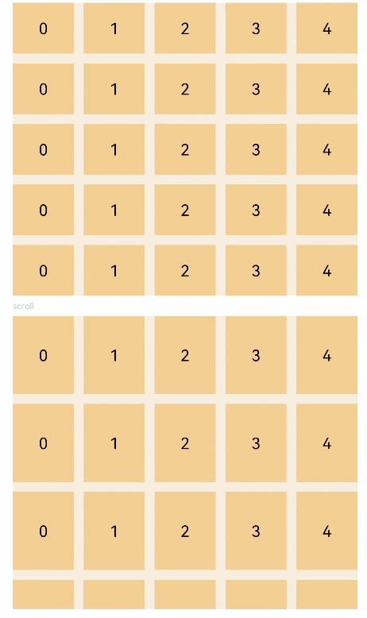

# Grid<a name="EN-US_TOPIC_0000001237355067"></a>

> **NOTE:** 
>This component is supported since API version 7. Updates will be marked with a superscript to indicate their earliest API version.

The  **<Grid\>**  component is a two-dimensional layout. The component is divided into rows and columns, to form cells. You can specify the cell where an item is located and combine different grids to form various layouts.

## Required Permissions<a name="section62209458329"></a>

None

## Child Components<a name="section18342185015322"></a>

This component contains the child component  [<GridItem\>](ts-container-griditem.md).

## APIs<a name="section3362154133312"></a>

Grid\(\)

## Attributes<a name="section4907201336"></a>

<a name="table1689mcpsimp"></a>
<table><thead align="left"><tr id="row1696mcpsimp"><th class="cellrowborder" valign="top" width="19.09%" id="mcps1.1.5.1.1"><p id="p1698mcpsimp"><a name="p1698mcpsimp"></a><a name="p1698mcpsimp"></a>Name</p>
</th>
<th class="cellrowborder" valign="top" width="11.600000000000001%" id="mcps1.1.5.1.2"><p id="p1700mcpsimp"><a name="p1700mcpsimp"></a><a name="p1700mcpsimp"></a>Type</p>
</th>
<th class="cellrowborder" valign="top" width="11.92%" id="mcps1.1.5.1.3"><p id="p1702mcpsimp"><a name="p1702mcpsimp"></a><a name="p1702mcpsimp"></a>Default Value</p>
</th>
<th class="cellrowborder" valign="top" width="57.38999999999999%" id="mcps1.1.5.1.4"><p id="p1704mcpsimp"><a name="p1704mcpsimp"></a><a name="p1704mcpsimp"></a>Description</p>
</th>
</tr>
</thead>
<tbody><tr id="row1705mcpsimp"><td class="cellrowborder" valign="top" width="19.09%" headers="mcps1.1.5.1.1 "><p id="p1707mcpsimp"><a name="p1707mcpsimp"></a><a name="p1707mcpsimp"></a>columnsTemplate</p>
</td>
<td class="cellrowborder" valign="top" width="11.600000000000001%" headers="mcps1.1.5.1.2 "><p id="p1709mcpsimp"><a name="p1709mcpsimp"></a><a name="p1709mcpsimp"></a>string</p>
</td>
<td class="cellrowborder" valign="top" width="11.92%" headers="mcps1.1.5.1.3 "><p id="p1711mcpsimp"><a name="p1711mcpsimp"></a><a name="p1711mcpsimp"></a>'1fr'</p>
</td>
<td class="cellrowborder" valign="top" width="57.38999999999999%" headers="mcps1.1.5.1.4 "><p id="p1713mcpsimp"><a name="p1713mcpsimp"></a><a name="p1713mcpsimp"></a>Number of columns in the current grid layout. If this parameter is not set, one column is used by default. For example, '1fr 1fr 2fr' divides the component into three columns, with four equal parts. The first column occupies one part, the second column occupies one part, and the third column occupies two parts.</p>
</td>
</tr>
<tr id="row1714mcpsimp"><td class="cellrowborder" valign="top" width="19.09%" headers="mcps1.1.5.1.1 "><p id="p1716mcpsimp"><a name="p1716mcpsimp"></a><a name="p1716mcpsimp"></a>rowsTemplate</p>
</td>
<td class="cellrowborder" valign="top" width="11.600000000000001%" headers="mcps1.1.5.1.2 "><p id="p1718mcpsimp"><a name="p1718mcpsimp"></a><a name="p1718mcpsimp"></a>string</p>
</td>
<td class="cellrowborder" valign="top" width="11.92%" headers="mcps1.1.5.1.3 "><p id="p1720mcpsimp"><a name="p1720mcpsimp"></a><a name="p1720mcpsimp"></a>'1fr'</p>
</td>
<td class="cellrowborder" valign="top" width="57.38999999999999%" headers="mcps1.1.5.1.4 "><p id="p1722mcpsimp"><a name="p1722mcpsimp"></a><a name="p1722mcpsimp"></a>Number of rows in the current grid layout. If this parameter is not set, one row is used by default. For example, '1fr 1fr 2fr' divides the component into three rows. The width allowed by the parent component is divided into four equal parts. The first row occupies one part, the second row occupies one part, and the third row occupies two parts.</p>
</td>
</tr>
<tr id="row1723mcpsimp"><td class="cellrowborder" valign="top" width="19.09%" headers="mcps1.1.5.1.1 "><p id="p1725mcpsimp"><a name="p1725mcpsimp"></a><a name="p1725mcpsimp"></a>columnsGap</p>
</td>
<td class="cellrowborder" valign="top" width="11.600000000000001%" headers="mcps1.1.5.1.2 "><p id="p1727mcpsimp"><a name="p1727mcpsimp"></a><a name="p1727mcpsimp"></a>Length</p>
</td>
<td class="cellrowborder" valign="top" width="11.92%" headers="mcps1.1.5.1.3 "><p id="p1729mcpsimp"><a name="p1729mcpsimp"></a><a name="p1729mcpsimp"></a>0</p>
</td>
<td class="cellrowborder" valign="top" width="57.38999999999999%" headers="mcps1.1.5.1.4 "><p id="p1731mcpsimp"><a name="p1731mcpsimp"></a><a name="p1731mcpsimp"></a>Spacing between columns.</p>
</td>
</tr>
<tr id="row1732mcpsimp"><td class="cellrowborder" valign="top" width="19.09%" headers="mcps1.1.5.1.1 "><p id="p1734mcpsimp"><a name="p1734mcpsimp"></a><a name="p1734mcpsimp"></a>rowsGap</p>
</td>
<td class="cellrowborder" valign="top" width="11.600000000000001%" headers="mcps1.1.5.1.2 "><p id="p1736mcpsimp"><a name="p1736mcpsimp"></a><a name="p1736mcpsimp"></a>Length</p>
</td>
<td class="cellrowborder" valign="top" width="11.92%" headers="mcps1.1.5.1.3 "><p id="p1738mcpsimp"><a name="p1738mcpsimp"></a><a name="p1738mcpsimp"></a>0</p>
</td>
<td class="cellrowborder" valign="top" width="57.38999999999999%" headers="mcps1.1.5.1.4 "><p id="p1740mcpsimp"><a name="p1740mcpsimp"></a><a name="p1740mcpsimp"></a>Spacing between rows.</p>
</td>
</tr>
</tbody>
</table>

## Events<a name="section1822319492372"></a>

<a name="table1422484983716"></a>
<table><thead align="left"><tr id="row122247497373"><th class="cellrowborder" valign="top" width="39.77%" id="mcps1.1.3.1.1"><p id="p1224949123712"><a name="p1224949123712"></a><a name="p1224949123712"></a>Name</p>
</th>
<th class="cellrowborder" valign="top" width="60.23%" id="mcps1.1.3.1.2"><p id="p1022424983717"><a name="p1022424983717"></a><a name="p1022424983717"></a>Description</p>
</th>
</tr>
</thead>
<tbody><tr id="row19224134910371"><td class="cellrowborder" valign="top" width="39.77%" headers="mcps1.1.3.1.1 "><p id="p622474918373"><a name="p622474918373"></a><a name="p622474918373"></a>onScrollIndex(first: number) =&gt; void</p>
</td>
<td class="cellrowborder" valign="top" width="60.23%" headers="mcps1.1.3.1.2 "><p id="p18224144918373"><a name="p18224144918373"></a><a name="p18224144918373"></a>Triggered when the start item of the grid changes.</p>
</td>
</tr>
</tbody>
</table>

## Example<a name="section183419570330"></a>

```
@Entry
@Component
struct GridExample {
  @State Number: String[] = ['0', '1', '2', '3', '4']

  build() {
    Column({ space: 5 }) {
      Grid() {
        ForEach(this.Number, (day: string) => {
          ForEach(this.Number, (day: string) => {
            GridItem() {
              Text(day)
                .fontSize(16)
                .backgroundColor(0xF9CF93)
                .width('100%')
                .height('100%')
                .textAlign(TextAlign.Center)
            }
          }, day => day)
        }, day => day)
      }
      .columnsTemplate('1fr 1fr 1fr 1fr 1fr')
      .rowsTemplate('1fr 1fr 1fr 1fr 1fr')
      .columnsGap(10)
      .rowsGap(10)
      .width('90%')
      .backgroundColor(0xFAEEE0)
      .height(300)

      Text('scroll').fontColor(0xCCCCCC).fontSize(9).width('90%')
      Grid() {
        ForEach(this.Number, (day: string) => {
          ForEach(this.Number, (day: string) => {
            GridItem() {
              Text(day)
                .fontSize(16)
                .backgroundColor(0xF9CF93)
                .width('100%')
                .height(80)
                .textAlign(TextAlign.Center)
            }
          }, day => day)
        }, day => day)
      }
      .columnsTemplate('1fr 1fr 1fr 1fr 1fr')
      .columnsGap(10)
      .rowsGap(10)
      .onScrollIndex((first: number) => {
        console.info(first.toString())
      })
      .width('90%')
      .backgroundColor(0xFAEEE0)
      .height(300)
    }.width('100%').margin({ top: 5 })
  }
}
```



