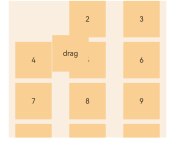

# Grid

The **\<Grid>** component consists of cells formed by rows and columns. You can specify the cells where items are located to form various layouts.

>  **NOTE**
>
>  This component is supported since API version 7. Updates will be marked with a superscript to indicate their earliest API version.


## Child Components

The **\<Grid>** component accepts only **\<[GridItem](ts-container-griditem.md)>** as its child components.

>  **NOTE**
>
>  Below are the rules for calculating the indexes of the child components of **\<Grid>**:
>
>  The index increases in ascending order of child components.
>
>  In the **if/else** statement, only the child components in the branch where the condition is met participate in the index calculation.
>
>  In the **ForEach** or **LazyForEach** statement, the indexes of all expanded subnodes are calculated.
>
>  If the values of [if/else](../../quick-start/arkts-rendering-control-ifelse.md), [ForEach](../../quick-start/arkts-rendering-control-foreach.md), and [LazyForEach](../../quick-start/arkts-rendering-control-lazyforeach.md) change, the indexes of subnodes are updated.
>
>  The child component that has the **visibility** attribute set to **Hidden** or **None** is included in the index calculation.
>
>  The child component that has the **visibility** attribute set to **None** is not displayed, but still takes up the corresponding cell.
>
>  The child component that has the **position** attribute set is displayed in the corresponding cell, offset by the distance specified by **position** relative to the upper left corner of the grid. This child component does not scroll with the corresponding cell and is not displayed after the corresponding cell extends beyond the display range of the grid.
>
>  When there is a gap between child components, it is filled as much as possible based on the current display area. Therefore, the relative position of grid items may change as the grid scrolls.

## APIs

Grid(scroller?: Scroller, layoutOptions?: GridLayoutOptions)

**Parameters**

| Name  | Type                                   | Mandatory| Description                                                    |
| -------- | ------------------------------------------- | ---- | ------------------------------------------------------------ |
| scroller | [Scroller](ts-container-scroll.md#scroller) | No  | Controller, which can be bound to scrollable components.<br>**NOTE**<br>The scroller cannot be bound to other [scrollable components](ts-container-list.md).|
| layoutOptions<sup>10+</sup> | GridLayoutOptions | No| Layout options of a scrolling grid.|

### GridLayoutOptions<sup>10+</sup>

Defines grid layout options. This API can be used for the grid for which either **rowsTemplate** or **columnsTemplate** is set, and can take place of the combination of **columnStart** and **columnEnd** or of **rowStart** and **rowEnd** in setting columns or rows occupied by a grid item.

**Parameters**
| Name   | Type     | Mandatory  | Description                   |
| ----- | ------- | ---- | --------------------- |
| regularSize  | [number, number]  | Yes   | Number of rows and columns occupied by a grid item with regular size. The only supported value is **[1, 1]**, meaning that the grid item occupies one row and one column.  |
| irregularIndexes | number[] | No   | Indexes of a grid item with irregular size in all subnodes of the grid. When **onGetIrregularSizeByIndex** is not set, the grid item specified in this parameter occupies an entire row of the grid that scrolls vertically or an entire column of the grid that scrolls horizontally.|
| onGetIrregularSizeByIndex | (index: number) => [number, number] | No   | Callback used to obtain the number of rows and columns occupied by the grid item with irregular size. Its input parameter is the indexes of the grid item specified in **irregularIndexes**. A grid item cannot occupy multiple rows in vertical scrolling mode, or multiple columns in horizontal scrolling mode.|

## Attributes

In addition to the [universal attributes](ts-universal-attributes-size.md), the following attributes are supported.

| Name| Type| Description|
| -------- | -------- | -------- |
| columnsTemplate | string | Number of columns or minimum column width in the grid. If this attribute is not set, one column will be used.<br>For example, **'1fr 1fr 2fr'** indicates three columns, with the first column taking up 1/4 of the parent component's full width, the second column 1/4, and the third column 2/4.<br>**columnsTemplate('repeat(auto-fit, track-size)')** sets the minimum column width to **track-size**, based on which the number of columns and the actual column width are automatically obtained.<br>**columnsTemplate('repeat(auto-fill, track-size)')** sets the fixed column width to **track-size**, based on which the number of columns is automatically obtained.<br>**repeat**, **auto-fit**, and **auto-fill** are keywords. **track-size** indicates the column width, in the unit of px, vp, %, or any valid digit. The value must be greater than or equal to one valid column width.<br>**NOTE**<br>If this attribute is set to **'0fr'**, the column width is 0, and grid item in the column is not displayed. If this attribute is set to any other invalid value, the grid item is displayed as one column.|
| rowsTemplate | string | Number of rows or minimum row height in the grid. If this attribute is not set, one row will be used.<br>For example, **'1fr 1fr 2fr'** indicates three rows, with the first row taking up 1/4 of the parent component's full height, the second row 1/4, and the third row 2/4.<br>**rowsTemplate('repeat(auto-fit, track-size)')** sets the minimum row height to **track-size**, based on which the number of rows and the actual row height are automatically obtained.<br>**rowsTemplate('repeat(auto-fill, track-size)')** sets the fixed row height to **track-size**, based on which the number of rows is automatically obtained.<br>**repeat**, **auto-fit**, and **auto-fill** are keywords. **track-size** indicates the row height, in the unit of px, vp, %, or any valid digit. The value must be greater than or equal to one valid row height.<br>**NOTE**<br>If this attribute is set to **'0fr'**, the row width is 0, and grid item in the row is not displayed. If this attribute is set to any other invalid value, the grid item is displayed as one row.|
| columnsGap | [Length](ts-types.md#length) | Gap between columns.<br>Default value: **0**<br>**NOTE**<br>A value less than 0 evaluates to the default value.|
| rowsGap | [Length](ts-types.md#length) | Gap between rows.<br>Default value: **0**<br>**NOTE**<br>A value less than 0 evaluates to the default value.|
| scrollBar      | [BarState](ts-appendix-enums.md#barstate) | Scrollbar status.<br>Default value: **BarState.Off**<br>**NOTE**<br>In API version 9 and earlier versions, the default value is **BarState.Off**. In API version 10, the default value is **BarState.Auto**.|
| scrollBarColor | string \| number \| [Color](ts-appendix-enums.md#color) | Color of the scrollbar.|
| scrollBarWidth | string \| number    | Width of the scrollbar. After the width is set, the scrollbar is displayed with the set width in normal state and pressed state.<br>Default value: **4**<br>Unit: vp|
| cachedCount | number                                   | Number of grid items to be preloaded (cached). It works only in [LazyForEach](../../quick-start/arkts-rendering-control-lazyforeach.md). For details, see [Minimizing White Blocks During Swiping](../../performance/arkts-performance-improvement-recommendation.md#minimizing-white-blocks-during-swiping).<br>Default value: **1**<br>**NOTE**<br>The number of the grid items to be cached before and after the currently displayed one equals the value of **cachedCount** multiplied by the number of columns.<br>Grid items that exceed the display and cache range are released.<br>A value less than 0 evaluates to the default value.|
| editMode <sup>8+</sup>                   | boolean | Whether to enter editing mode. In editing mode, the user can drag the **\<[GridItem](ts-container-griditem.md)>** in the **\<Grid>** component.<br>Default value: **false**|
| layoutDirection<sup>8+</sup>             | [GridDirection](#griddirection8) | Main axis direction of the grid.<br>Default value: **GridDirection.Row**|
| maxCount<sup>8+</sup> | number  | When **layoutDirection** is **Row** or **RowReverse**: maximum number of columns that can be displayed.<br>When **layoutDirection** is **Column** or **ColumnReverse**: maximum number of rows that can be displayed.<br>Default value: **Infinity**<br>**NOTE**<br>If the value of **maxCount** is smaller than that of **minCount**, the default values of **maxCount** and **minCount** are used.<br>A value less than 1 evaluates to the default value.|
| minCount<sup>8+</sup> | number  | When **layoutDirection** is **Row** or **RowReverse**: minimum number of columns that can be displayed.<br>When **layoutDirection** is **Column** or **ColumnReverse**: minimum number of rows that can be displayed.<br>Default value: **1**<br>**NOTE**<br>A value less than 1 evaluates to the default value.|
| cellLength<sup>8+</sup> | number  | When **layoutDirection** is **Row** or **RowReverse**: fixed height per row.<br>When **layoutDirection** is **Column** or **ColumnReverse**: fixed width per column.<br>Default value: size of the first element|
| multiSelectable<sup>8+</sup> | boolean | Whether to enable mouse frame selection.<br>Default value: **false**<br>- **false**: The mouse frame selection is disabled.<br>- **true**: The mouse frame selection is enabled.<br>**NOTE**<br> When mouse frame selection is enabled, you can use the **selected** attribute and the **onSelect** event of the **\<Griditem>** component to obtain the selection status of the component; you can also set the [style](./ts-universal-attributes-polymorphic-style.md) of the component in the selected state (by default, no style is set for the selected state).|
| supportAnimation<sup>8+</sup> | boolean | Whether to enable animation. Currently, the grid item drag animation is supported.<br>Default value: **false**<br>**NOTE**<br> Animation is supported only in scrolling mode (only **rowsTemplate** or **columnsTemplate** is set).|
| edgeEffect<sup>10+</sup> | [EdgeEffect](ts-appendix-enums.md#edgeeffect) | Scroll effect. The spring effect and shadow effect are supported.<br>Default value: **EdgeEffect.None**<br>|
| enableScrollInteraction<sup>10+</sup>  |  boolean  |   Whether to support scroll gestures. When this attribute is set to **false**, scrolling by finger or mouse is not supported, but the scrolling controller API is not affected.<br>Default value: **true**     |
| nestedScroll<sup>10+</sup>                 | [NestedScrollOptions](ts-container-scroll.md#nestedscrolloptions10)         | Nested scrolling options. You can set the nested scrolling mode in the forward and backward directions to implement scrolling linkage with the parent component.|
| friction<sup>10+</sup> | number \| [Resource](ts-types.md#resource)    | Friction coefficient. It applies only to gestures in the scrolling area, and it affects only indirectly the scroll chaining during the inertial scrolling process.<br>Default value: **0.9** for wearable devices and **0.6** for non-wearable devices<br>**NOTE**<br>A value less than or equal to 0 evaluates to the default value.|

Depending on the settings of the **rowsTemplate** and **columnsTemplate** attributes, the **\<Grid>** component supports the following layout modes:

1. **rowsTemplate** and **columnsTemplate** are both set

- The **\<Grid>** component displays only elements in a fixed number of rows and columns and cannot be scrolled.
- In this mode, the following attributes do not take effect: **layoutDirection**, **maxCount**, **minCount**, and **cellLength**.
- If the width and height of a grid are not set, the grid adapts to the size of its parent component by default.
- The size of the grid rows and columns is the size of the grid content area minus the gap between rows and columns. It is allocated based on the proportion of each row and column.
- By default, the grid items fill the entire grid.

2. Either **rowsTemplate** or **columnsTemplate** is set

- The **\<Grid>** component arranges elements in the specified direction and allows for scrolling to display excess elements.
- If **columnsTemplate** is set, the component scrolls vertically, the main axis runs vertically, and the cross axis runs horizontally.
- If **rowsTemplate** is set, the component scrolls horizontally, the main axis runs horizontally, and the cross axis runs vertically.
- In this mode, the following attributes do not take effect: **layoutDirection**, **maxCount**, minCount, and **cellLength**.
- The cross axis size of the grid is the cross axis size of the grid content area minus the gaps along the cross axis. It is allocated based on the proportion of each row and column.
- The main axis size of the grid is the maximum height of all grid items in the cross axis direction of the current grid.

3. Neither **rowsTemplate** nor **columnsTemplate** is set

- The **\<Grid>** component arranges elements in the direction specified by **layoutDirection**. The number of columns is jointly determined by the grid width, width of the first element, **minCount**, **maxCount**, and **columnsGap**.
- The number of rows is jointly determined by the grid height, height of the first element, **cellLength**, and **rowsGap**. Elements outside the determined range of rows and columns are not displayed and cannot be viewed through scrolling.
- In this mode, only the following attributes take effect: **layoutDirection**, **maxCount**, **minCount**, **cellLength**, **editMode**, **columnsGap**, and **rowsGap**.
- When **layoutDirection** is set to **Row**, elements are arranged row by row from left to right. If the remaining height is insufficient, no more elements will be laid out, and the whole content is centered at the top.
- When **layoutDirection** is set to **Column**, elements are arranged column by column from top to bottom. If the remaining height is insufficient, no more elements will be laid out, and the whole content is centered at the top.

## GridDirection<sup>8+</sup>

| Name  | Description                                  |
| ------ | -------------------------------------- |
| Row  | Horizontal layout, where the child components are arranged from left to right as the main axis runs along the rows.|
| Column | Vertical layout, where the child components are arranged from top to bottom as the main axis runs down the columns.|
| RowReverse    | Reverse horizontal layout, where the child components are arranged from right to left as the main axis runs along the rows.|
| ColumnReverse   | Reverse vertical layout, where the child components are arranged from bottom up as the main axis runs down the columns.|

> **NOTE**
>
> The default value of the universal attribute [clip](ts-universal-attributes-sharp-clipping.md) is **true** for the **\<Grid>** component.

## Events

In addition to the [universal events](ts-universal-events-click.md), the following events are supported.

| Name| Description|
| -------- | -------- |
| onScrollIndex(event: (first: number, last<sup>10+</sup>: number) => void) | Triggered when the first or last item displayed in the grid changes. It is triggered once when the grid is initialized.<br>- **first**: index of the first item of the grid.<br>- **last**: index of the last item of the grid.<br>This event is triggered when either of the preceding indexes changes.|
| onItemDragStart(event: (event: ItemDragInfo, itemIndex: number) => (() => any) \| void) | Triggered when a grid item starts to be dragged.<br>- **event**: See [ItemDragInfo](#itemdraginfo).<br>- **itemIndex**: index of the dragged item.<br>**NOTE**<br>If **void** is returned, the drag operation cannot be performed.<br>This event is triggered when the user long presses a grid item.<br>Drag detection also requires long press, and the event processing mechanism preferentially triggers child component events. Therefore, when **LongPressGesture** is bound to the grid item, the drag operation cannot be performed. In light of this, if both long press and drag operations are required, you can use universal drag events.|
| onItemDragEnter(event: (event: ItemDragInfo) => void) | Triggered when the dragged item enters the drop target of the grid.<br>- **event**: See [ItemDragInfo](#itemdraginfo).|
| onItemDragMove(event: (event: ItemDragInfo, itemIndex: number, insertIndex: number) => void) | Triggered when the dragged item moves over the drop target of the grid.<br>- **event**: See [ItemDragInfo](#itemdraginfo).<br>- **itemIndex**: initial position of the dragged item.<br>- **insertIndex**: index of the position to which the dragged item will be dropped.|
| onItemDragLeave(event: (event: ItemDragInfo, itemIndex: number) => void) | Triggered when the dragged item leaves the drop target of the grid.<br>- **event**: See [ItemDragInfo](#itemdraginfo).<br>- **itemIndex**: index of the dragged item.|
| onItemDrop(event: (event: ItemDragInfo, itemIndex: number, insertIndex: number, isSuccess: boolean) => void) | Triggered when the dragged item is dropped on the drop target of the grid.<br>- **event**: See [ItemDragInfo](#itemdraginfo).<br>- **itemIndex**: initial position of the dragged item.<br>- **insertIndex**: index of the position to which the dragged item will be dropped.<br>- **isSuccess**: whether the dragged item is successfully dropped.|
| onScrollBarUpdate(event: (index: number, offset: number) => ComputedBarAttribute) | Triggered when the first item displayed in the grid changes. You can use this callback to set the position and length of the scrollbar.<br>- **index**: index of the first item displayed in the grid.<br>- **offset**: offset of the displayed first item relative to the start position of the grid.<br>- **ComputedBarAttribute**: See [ComputedBarAttribute](#computedbarattribute). |
| onScroll<sup>10+</sup>(event: (scrollOffset: number, scrollState: ScrollState) => void) | Triggered when the grid scrolls.<br>- **scrollOffset**: scroll offset of each frame. The offset is positive when the grid is scrolled up and negative when the list is scrolled down.<br>- [scrollState](ts-container-list.md#scrollstate): current scroll state.|
| onReachStart<sup>10+</sup>(event: () => void)          | Triggered when the grid reaches the start position.<br>**NOTE**<br>This event is triggered once when **initialIndex** is **0** during grid initialization and once when the grid scrolls to the start position. When the grid edge scrolling effect is the spring effect, this event is triggered once when the grid passes the start position and is triggered again when the grid returns to the start position.|
| onReachEnd<sup>10+</sup>(event: () => void)            | Triggered when the grid reaches the end position.<br>**NOTE**<br>When the grid edge effect is the spring effect, this event is triggered once when the grid passes the end position and is triggered again when the grid returns to the end position.|
| onScrollFrameBegin<sup>10+</sup>(event: (offset: number, state: ScrollState) => { offsetRemain }) | Triggered when the grid starts to scroll. The input parameters indicate the amount by which the grid will scroll. The event handler then works out the amount by which the grid needs to scroll based on the real-world situation and returns the result.<br>\- **offset**: amount to scroll by, in vp.<br>\- **state**: current scrolling state.<br>- **offsetRemain**: actual amount by which the grid scrolls, in vp.<br>This event is triggered when the user starts dragging the grid or the grid starts inertial scrolling. This event is not triggered when the grid rebounds or the scrolling controller is used.<br>**NOTE**<br>If **gridDirection** is set to **Axis.Vertical**, the return value is the amount by which the grid needs to scroll in the vertical direction. If **gridDirection** is set to **Axis.Horizontal**, the return value is the amount by which the grid needs to scroll in the horizontal direction.|
| onScrollStart<sup>10+</sup>(event: () => void) | Triggered when the grid starts scrolling initiated by the user's finger dragging the grid or its scrollbar. This event is also triggered when the animation contained in the scrolling triggered by [Scroller](ts-container-scroll.md#scroller) starts.|
| onScrollStop<sup>10+</sup>(event: () => void)          | Triggered when the grid stops scrolling after the user's finger leaves the screen. This event is also triggered when the animation contained in the scrolling triggered by [Scroller](ts-container-scroll.md#scroller) stops.|

## ItemDragInfo

| Name        | Type        |   Description        |
| ---------- | ---------- | ---------- |
| x | number |  X coordinate of the dragged item.   |
| y   | number |  Y coordinate of the dragged item.   |

## ComputedBarAttribute

| Name        | Type        |   Description        |
| ---------- | ---------- | ---------- |
| totalOffset | number |  Total offset of the grid content relative to the display area.   |
| totalLength   | number |  Total length of the grid content.   |

## Example

### Example 1

```ts
// xxx.ets
@Entry
@Component
struct GridExample {
  @State Number: String[] = ['0', '1', '2', '3', '4']
  scroller: Scroller = new Scroller()

  build() {
    Column({ space: 5 }) {
      Grid() {
        ForEach(this.Number, (day: string) => {
          ForEach(this.Number, (day: string) => {
            GridItem() {
              Text(day)
                .fontSize(16)
                .backgroundColor(0xF9CF93)
                .width('100%')
                .height('100%')
                .textAlign(TextAlign.Center)
            }
          }, (day: string) => day)
        }, (day: string) => day)
      }
      .columnsTemplate('1fr 1fr 1fr 1fr 1fr')
      .rowsTemplate('1fr 1fr 1fr 1fr 1fr')
      .columnsGap(10)
      .rowsGap(10)
      .width('90%')
      .backgroundColor(0xFAEEE0)
      .height(300)

      Text('scroll').fontColor(0xCCCCCC).fontSize(9).width('90%')
      Grid(this.scroller) {
        ForEach(this.Number, (day: string) => {
          ForEach(this.Number, (day: string) => {
            GridItem() {
              Text(day)
                .fontSize(16)
                .backgroundColor(0xF9CF93)
                .width('100%')
                .height(80)
                .textAlign(TextAlign.Center)
            }
          }, (day: string) => day)
        }, (day: string) => day)
      }
      .columnsTemplate('1fr 1fr 1fr 1fr 1fr')
      .columnsGap(10)
      .rowsGap(10)
      .friction(0.6)
      .edgeEffect(EdgeEffect.Spring)
      .scrollBar(BarState.On)
      .onScrollIndex((first: number) => {
        console.info(first.toString())
      })
      .width('90%')
      .backgroundColor(0xFAEEE0)
      .height(300)
      Button('next page')
        .onClick(() => {// Click to go to the next page.
          this.scroller.scrollPage({ next: true })
        })
    }.width('100%').margin({ top: 5 })
  }
}
```


### Example 2

1.  Set **editMode\(true\)** to enable the grid to enter editing mode, where the user can drag the grid items.

2.  Through [onItemDragStart](#events), set the image to be displayed during dragging.

3.  Through [onItemDrop](#events), obtain the initial position of the dragged item and the position to which the dragged item will be dropped. Through [onDrag](#events), complete the array position exchange logic.

```ts
@Entry
@Component
struct GridExample {
  @State numbers: string[] = []
  scroller: Scroller = new Scroller()
  @State text: string = 'drag'

  @Builder pixelMapBuilder () { // Style for the drag event.
    Column() {
      Text(this.text)
        .fontSize(16)
        .backgroundColor(0xF9CF93)
        .width(80)
        .height(80)
        .textAlign(TextAlign.Center)
    }
  }

  aboutToAppear() {
    for (let i = 1;i <= 15; i++) {
      this.numbers.push(i + '')
    }
  }

  changeIndex(index1: number, index2: number) { // Exchange the array position.
    let temp: string;
    temp = this.numbers[index1];
    this.numbers[index1] = this.numbers[index2];
    this.numbers[index2] = temp;
  }

  build() {
    Column({ space: 5 }) {
      Grid(this.scroller) {
        ForEach(this.numbers, (day: string) => {
          GridItem() {
            Text(day)
              .fontSize(16)
              .backgroundColor(0xF9CF93)
              .width(80)
              .height(80)
              .textAlign(TextAlign.Center)
          }
        })
      }
      .columnsTemplate('1fr 1fr 1fr')
      .columnsGap(10)
      .rowsGap(10)
      .onScrollIndex((first: number) => {
        console.info(first.toString())
      })
      .width('90%')
      .backgroundColor(0xFAEEE0)
      .height(300)
      .editMode(true) // Enable the grid to enter editing mode, where the user can drag the grid items.
      .onItemDragStart((event: ItemDragInfo, itemIndex: number) => { // Triggered when a grid item starts to be dragged.
        this.text = this.numbers[itemIndex]
        return this.pixelMapBuilder() // Set the image to be displayed during dragging.
      })
      .onItemDrop((event: ItemDragInfo, itemIndex: number, insertIndex: number, isSuccess: boolean) => { // Triggered when the dragged item is dropped on the drop target of the grid.
        // If isSuccess is set to false, the item is dropped outside of the grid. If the value of insertIndex is greater than that of length, an item adding event occurs.
        if (!isSuccess || insertIndex >= this.numbers.length) {
          return
        }
        console.info('beixiang' + itemIndex + '', insertIndex + '') // itemIndex indicates the initial position of the dragged item. insertIndex indicates the position to which the dragged item will be dropped.
        this.changeIndex(itemIndex, insertIndex)
      })
    }.width('100%').margin({ top: 5 })
  }
}
```

Below are some examples.

Below shows how the grid looks when dragging of grid items starts.


Below shows how the grid looks when dragging of grid items is in progress.



Below shows how the grid looks after grid item 1 and grid item 6 swap their positions.


### Example 3

This example shows how **GridLayoutOptions** works.

```ts
// xxx.ets
@Entry
@Component
struct GridExample {
  @State Number: String[] = ['0', '1', '2', '3', '4']
  scroller: Scroller = new Scroller()
  layoutOptions1: GridLayoutOptions = {
    regularSize: [1, 1],        // Only [1, 1] is supported.
    irregularIndexes: [0, 6], // The grid item whose indexes are 0 and 6 occupies one row.
  }

  layoutOptions2: GridLayoutOptions = {
    regularSize: [1, 1],
    irregularIndexes: [0, 7], // The number of columns occupied by the grid item whose indexes are 0 and 7 is specified by onGetIrregularSizeByIndex.
    onGetIrregularSizeByIndex: (index: number) => {
      if (index === 0) {
        return [1, 5]
      }
      return [1, index % 6 + 1]
    }
  }

  build() {
    Column({ space: 5 }) {
      Grid(this.scroller, this.layoutOptions1) {
        ForEach(this.Number, (day: string) => {
          ForEach(this.Number, (day: string) => {
            GridItem() {
              Text(day)
                .fontSize(16)
                .backgroundColor(0xF9CF93)
                .width('100%')
                .height(80)
                .textAlign(TextAlign.Center)
            }
          }, (day: string) => day)
        }, (day: string) => day)
      }
      .columnsTemplate('1fr 1fr 1fr 1fr 1fr')
      .columnsGap(10)
      .rowsGap(10)
      .scrollBar(BarState.Off)
      .width('90%')
      .backgroundColor(0xFAEEE0)
      .height(300)

      Text('scroll').fontColor(0xCCCCCC).fontSize(9).width('90%')
      // The grid does not scroll, and undefined is used to reserve space.
      Grid(undefined, this.layoutOptions2) {
        ForEach(this.Number, (day: string) => {
          ForEach(this.Number, (day: string) => {
            GridItem() {
              Text(day)
                .fontSize(16)
                .backgroundColor(0xF9CF93)
                .width('100%')
                .height(80)
                .textAlign(TextAlign.Center)
            }
          }, (day: string) => day)
        }, (day: string) => day)
      }
      .columnsTemplate('1fr 1fr 1fr 1fr 1fr')
      .columnsGap(10)
      .rowsGap(10)
      .scrollBar(BarState.Off)
      .width('90%')
      .backgroundColor(0xFAEEE0)
      .height(300)
    }.width('100%').margin({ top: 5 })
  }
}
```


