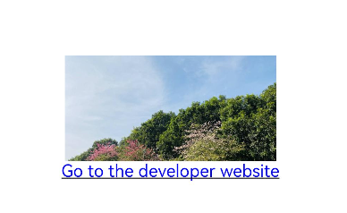

# Hyperlink

The **\<Hyperlink>** component implements a link from a location in the component to another location.

>  **NOTE**
>
>  - This component is supported since API version 7. Updates will be marked with a superscript to indicate their earliest API version.
>  - This component must be used with the system browser.

## Required Permissions

If Internet access is required, you need to apply for the **ohos.permission.INTERNET** permission. For details about how to apply for a permission, see [Declaring Permissions](../../security/AccessToken/declare-permissions.md).

## Child Components

Supported


## APIs

Hyperlink(address: string | Resource, content?: string | Resource)

Since API version 9, this API is supported in ArkTS widgets.

**Parameters**

| Name| Type| Mandatory| Description|
| -------- | -------- | -------- | -------- |
| address | string \| [Resource](ts-types.md#resource) | Yes| Web page to which the hyperlink is redirected.|
| content | string \| [Resource](ts-types.md#resource) | No| Text displayed in the hyperlink.<br>**NOTE**<br>If this component has child components, the hyperlink text is not displayed.|

## Attributes

Only the following attributes are supported.

| Name| Type| Description|
| -------- | -------- | -------- |
| color | [ResourceColor](ts-types.md#resourcecolor) | Color of the hyperlink text.|

## Example

```ts
@Entry
@Component
struct HyperlinkExample {
  build() {
    Column() {
      Column() {
        Hyperlink('https://example.com/') {
          Image($r('app.media.bg'))
            .width(200)
            .height(100)
        }
      }

      Column() {
        Hyperlink('https://example.com/', 'Go to the developer website') {
        }
        .color(Color.Blue)
      }
    }.width('100%').height('100%').justifyContent(FlexAlign.Center)
  }
}
```


<!--no_check-->