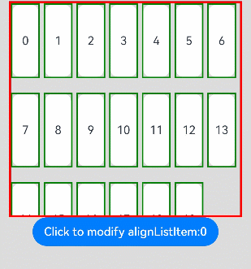

# List

The **\<list>** component provides a list container that presents a series of list items arranged in a column with the same width. It supports presentations of the same type of data in a multiple and coherent row style, for example, images or text.

> **NOTE**
>
> - This component is supported since API version 7. Updates will be marked with a superscript to indicate their earliest API version.
> - This component can produce a bounce effect only when there is more than one screen of content.


## Child Components

This component supports the **[\<ListItem>](ts-container-listitem.md)** and **[\<ListItemGroup>](ts-container-listitemgroup.md)** child components.


## APIs

List(value?:{space?: number | string, initialIndex?: number, scroller?: Scroller})

**Parameters**

| Name| Type| Mandatory| Description|
| -------- | -------- | -------- | -------- |
| space | number \| string | No| Spacing between list items.<br>Default value: **0**|
| initialIndex | number | No| Item displayed at the beginning of the viewport when the current list is loaded for the first time, that is, the first item to be displayed. If the value set is greater than the sequence number of the last item, the setting does not take effect.<br>Default value: **0**|
| scroller | [Scroller](ts-container-scroll.md#scroller) | No| Scroller, which can be bound to scrollable components.|

## Attributes

In addition to the [universal attributes](ts-universal-attributes-size.md), the following attributes are supported.

| Name| Type| Description|
| -------- | -------- | -------- |
| listDirection | [Axis](ts-appendix-enums.md#axis) | Direction in which the list items are arranged.<br>Default value: **Axis.Vertical**|
| divider                      | {<br>strokeWidth: [Length](ts-types.md#length),<br>color?:[ResourceColor](ts-types.md),<br>startMargin?: Length,<br>endMargin?: Length<br>} \| null | Style of the divider for the list items. By default, there is no divider.<br>- **strokeWidth**: stroke width of the divider.<br>- **color**: color of the divider.<br>- **startMargin**: distance between the divider and the start edge of the list.<br>- **endMargin**: distance between the divider and the end edge of the list.|
| scrollBar      | [BarState](ts-appendix-enums.md#barstate) | Scrollbar status.<br>Default value: **BarState.Off**|
| cachedCount | number                                   | Number of list items or list item groups to be preloaded. A list item group is calculated as a whole, and all list items of the group are preloaded at the same time. For details, see [Minimizing White Blocks During Swiping](../../ui/ui-ts-performance-improvement-recommendation.md#minimizing-white-blocks-during-swiping).<br>Default value: **1**|
| editMode<sup>(deprecated)</sup> | boolean | Whether to enter editing mode.<br>This API is deprecated since API version 9.<br>Default value: **false**|
| edgeEffect | [EdgeEffect](ts-appendix-enums.md#edgeeffect) | Scroll effect.<br>Default value: **EdgeEffect.Spring**|
| chainAnimation | boolean | Whether to display chained animations on this list when it slides or its top or bottom is dragged. The list items are separated with even space, and one item animation starts after the previous animation during basic sliding interactions. The chained animation effect is similar with spring physics.<br>Default value: **false**<br>- **false**: No chained animations are displayed.<br>- **true**: Chained animations are displayed.|
| multiSelectable<sup>8+</sup> | boolean | Whether to enable mouse frame selection.<br>Default value: **false**<br>- **false**: The mouse frame selection is disabled.<br>- **true**: The mouse frame selection is enabled.|
| lanes<sup>9+</sup> | number \| [LengthConstrain](ts-types.md#lengthconstrain) | In the following description, **listDirection** is set to **Axis.Vertical**:<br>Number of columns in which the list items are arranged along the cross axis.<br>Default value: **1**<br>The rules are as follows:<br>- If the value is set to a number, the column width is determined based on the specified number and the cross-axis width of the **\<List>** component.<br>- If the value is set to {minLength, maxLength}, the number of columns is adjusted adaptively based on the width of the **\<List>** component, ensuring that the width respects the {minLength, maxLength} constraints during adaptation. The **minLength** constraint is prioritized. For example, if **lanes** is set to **{minLength: 40vp, maxLength: 60vp}** and the width of the **\<List>** component is 70 vp, the list items are arranged in one column with their alignment compliant with the **alignListItem** settings. If the width of the **\<List>** component is changed to 80 vp, which is twice the value of **minLength**, the list items are arranged in two columns.|
| alignListItem<sup>9+</sup> | ListItemAlign | Alignment mode of list items along the cross axis when: Cross-axis width of the **\<List>** component > Cross-axis width of list items x Value of **lanes**.<br>Default value: **ListItemAlign.Start**|
| sticky<sup>9+</sup> | StickyStyle | Whether to pin the header to the top or the footer to the bottom in the **\<ListItemGroup>** component. This attribute is used together with the **[\<ListItemGroup>](ts-container-listitemgroup.md)** component.<br>Default value: **StickyStyle.None**<br>**NOTE**<br>The **sticky** attribute can be set to **StickyStyle.Header** or \| **StickyStyle.Footer** to support both the pin-to-top and pin-to-bottom features.|

## ListItemAlign<sup>9+</sup>

| Name  | Description                                  |
| ------ | -------------------------------------- |
| Start  | The list items are packed toward the start edge of the **\<List>** component along the cross axis.|
| Center | The list items are centered in the **\<List>** component along the cross axis.|
| End    | The list items are packed toward the end edge of the **\<List>** component in the cross axis.|

## StickyStyle<sup>9+</sup>

| Name  | Description                                  |
| ------ | -------------------------------------- |
| None  | In the **\<ListItemGroup>** component, the header is not pinned to the top, and the footer is not pinned to the bottom.|
| Header | In the **\<ListItemGroup>** component, the header is pinned to the top.|
| Footer | In the **\<ListItemGroup>** component, the footer is pinned to the bottom.|


## Events

| Name| Description|
| -------- | -------- |
| onItemDelete<sup>(deprecated)</sup>(event: (index: number) => boolean) | Triggered when a list item is deleted.<br>This API is deprecated since API version 9.<br>- **index**: index of the deleted list item.|
| onScroll(event: (scrollOffset: number, scrollState: ScrollState) => void) | Triggered when the list scrolls.<br>- **scrollOffset**: scroll offset.<br>- **[scrollState](#scrollstate)**: current scroll state.|
| onScrollIndex(event: (start: number, end: number) => void) | Triggered when scrolling starts.<br>When calculating the index value, the **\<ListItemGroup>** accounts for one index value as a whole, and the index values of the list items within are not calculated.<br>- **start**: index of the scroll start position.<br>- **end**: index of the scroll end position.|
| onReachStart(event: () => void) | Triggered when the list reaches the start position.|
| onReachEnd(event: () => void) | Triggered when the list reaches the end position.|
| onScrollBegin<sup>9+</sup>(event: (dx: number, dy: number) => { dxRemain: number, dyRemain: number }) | Triggered when the list starts to scroll. The input parameters indicate the amount by which the list will scroll. The event handler then works out the amount by which the list needs to scroll based on the real-world situation and returns the result.<br>- **dx**: amount by which the list will scroll in the horizontal direction.<br>- **dy**: amount by which the list will scroll in the horizontal direction.<br>- **dxRemain**: amount by which the list actually scrolls in the horizontal direction.<br>- **dyRemain**: amount by which the list actually scrolls in the vertical direction.|
| onScrollStop(event: () => void) | Triggered when the list stops scrolling after the user's finger leaves the screen. This event will not be triggered if the scrolling is initiated by using [Scroller](ts-container-scroll.md#scroller).|
| onItemMove(event: (from: number, to: number) => boolean) | Triggered when a list item moves.<br>- **from**: index of the item before moving.<br>- **to**: index of the item after moving.|
| onItemDragStart(event: (event: ItemDragInfo, itemIndex: number) => ((() => any) \| void) | Triggered when a list element starts to be dragged.<br>- **event**: See [ItemDragInfo](ts-container-grid.md#itemdraginfo).<br>- **itemIndex**: index of the dragged list element.|
| onItemDragEnter(event: (event: ItemDragInfo) => void) | Triggered when the dragged item enters the drop target of the list.<br>- **event**: See [ItemDragInfo](ts-container-grid.md#itemdraginfo).|
| onItemDragMove(event: (event: ItemDragInfo, itemIndex: number, insertIndex: number) => void) | Triggered when the dragged item moves over the drop target of the list.<br>- **event**: See [ItemDragInfo](ts-container-grid.md#itemdraginfo).<br>- **itemIndex**: initial position of the dragged item.<br>- **insertIndex**: index of the position to which the dragged item will be dropped.|
| onItemDragLeave(event: (event: ItemDragInfo, itemIndex: number) => void) | Triggered when the dragged item exits the drop target of the list.<br>- **event**: See [ItemDragInfo](ts-container-grid.md#itemdraginfo).<br>- **itemIndex**: index of the list item.|
| onItemDrop(event: (event: ItemDragInfo, itemIndex: number, insertIndex: number, isSuccess: boolean) => void) | Triggered when the dragged item is dropped on the drop target of the list.<br>- **event**: See [ItemDragInfo](ts-container-grid.md#itemdraginfo).<br>- **itemIndex**: initial position of the dragged item.<br>- **insertIndex**: index of the position to which the dragged item will be dropped.<br>- **isSuccess**: whether the dragged item is successfully dropped.|

## ScrollState

| Name    | Description                    |
| ------ | ------------------------- |
| Idle    | Not scrolling.          |
| Scroll   | Finger dragging.         |
| Fling   | Inertial scrolling.          |

>  **NOTE**
>
>  To enable the editable mode for a list, the following conditions must be met: (This feature is deprecated since API version 9.)
>
>  - **editMode** is set to **true**.
>
>  - The list is bound to the **onItemDelete** event and the event returns **true** in the event callback.
>
>  - The **editable** attribute of **ListItem** is set to **true**.
>
>  To enable dragging for a list item, the following conditions must be met:
>
>  - **editMode** is set to **true**. (This is not required since API version 9.)
>
>  - The list item is bound to the **onDragStart** event and the event returns a floating UI during event callback.


## Example

```ts
// xxx.ets
@Entry
@Component
struct ListExample {
  private arr: number[] = [0, 1, 2, 3, 4, 5, 6, 7, 8, 9]

  build() {
    Column() {
      List({ space: 20, initialIndex: 0 }) {
        ForEach(this.arr, (item) => {
          ListItem() {
            Text('' + item)
              .width('100%').height(100).fontSize(16)
              .textAlign(TextAlign.Center).borderRadius(10).backgroundColor(0xFFFFFF)
          }
        }, item => item)
      }
      .listDirection(Axis.Vertical) // Arrangement direction
      .divider({ strokeWidth: 2, color: 0xFFFFFF, startMargin: 20, endMargin: 20 }) // Divider
      .edgeEffect(EdgeEffect.Spring) // No effect when the list scrolls to the edge.
      .onScrollIndex((firstIndex: number, lastIndex: number) => {
        console.info('first' + firstIndex)
        console.info('last' + lastIndex)
      })
      .width('90%')
    }
    .width('100%')
    .height('100%')
    .backgroundColor(0xDCDCDC)
    .padding({ top: 5 })
  }
}
```


```ts
// xxx.ets
@Entry
@Component
struct ListLanesExample {
  @State arr: string[] = ["0", "1", "2", "3", "4", "5", "6", "7", "8", "9", "10", "11", "12", "13", "14", "15", "16", "17", "18", "19"]
  @State alignListItem: ListItemAlign = ListItemAlign.Start

  build() {
    Column() {
      List({ space: 20, initialIndex: 0 }) {
        ForEach(this.arr, (item) => {
          ListItem() {
            Text('' + item)
              .width('100%')
              .height(100)
              .fontSize(16)
              .textAlign(TextAlign.Center)
              .borderRadius(10)
              .backgroundColor(0xFFFFFF)
          }
          .border({ width: 2, color: Color.Green })
        }, item => item)
      }
      .height(300)
      .width("90%")
      .editMode(true)
      .border({ width: 3, color: Color.Red })
      .lanes({ minLength: 40, maxLength: 40 })
      .alignListItem(this.alignListItem)

      Button("Change alignListItem: "+ this.alignListItem).onClick(() => {
        if (this.alignListItem == ListItemAlign.Start) {
          this.alignListItem = ListItemAlign.Center
        } else if (this.alignListItem == ListItemAlign.Center) {
          this.alignListItem = ListItemAlign.End
        } else {
          this.alignListItem = ListItemAlign.Start
        }
      })
    }.width('100%').height('100%').backgroundColor(0xDCDCDC).padding({ top: 5 })
  }
}
```


