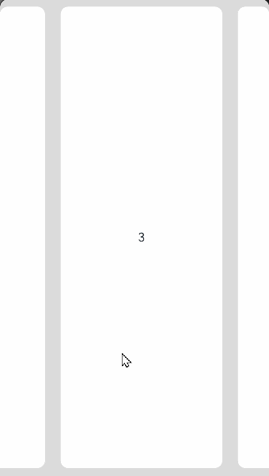

# List

The **\<List>** component provides a list container that presents a series of list items arranged in a column with the same width. It supports presentations of the same type of data in a multiple and coherent row style, for example, images or text.

> **NOTE**
>
> - This component is supported since API version 7. Updates will be marked with a superscript to indicate their earliest API version.
> - This component can produce a bounce effect only when there is more than one screen of content.


## Child Components

This component supports the [\<ListItem>](ts-container-listitem.md) and [\<ListItemGroup>](ts-container-listitemgroup.md) child components.

> **NOTE**
>
> Below are the rules for calculating the indexes of the child components of **\<List>**:
>
> The index increases in ascending order of child components.
>
> In the **if/else** statement, only the child components in the branch where the condition is met participate in the index calculation.
>
> In the **ForEach** or **LazyForEach** statement, the indexes of all expanded subnodes are calculated.
>
> If the values of [if/else](../../quick-start/arkts-rendering-control-ifelse.md), [ForEach](../../quick-start/arkts-rendering-control-foreach.md), and [LazyForEach](../../quick-start/arkts-rendering-control-lazyforeach.md) change, the indexes of subnodes are updated.
>
> Each **\<ListItemGroup>** component is taken as a whole and assigned an index, and the indexes of the list items within are not included in the index calculation.
>
> Child components of **\<List>** whose **visibility** attribute is set to **Hidden** or **None** are included in the index calculation.
>
> Child components of **\<List>** whose **visibility** attribute is set to **None** are not displayed, but the spacing above and below them still takes effect.


## APIs

List(value?:{space?: number | string, initialIndex?: number, scroller?: Scroller})

Since API version 9, this API is supported in ArkTS widgets.

**Parameters**

| Name         | Type                                    | Mandatory  | Description                                    |
| ------------ | ---------------------------------------- | ---- | ---------------------------------------- |
| space        | number \| string               | No   | Spacing between list items along the main axis.<br>Default value: **0**<br>**NOTE**<br>If this parameter is set to a negative number or a value greater than or equal to the length of the list content area, the default value is used.<br>If this parameter is set to a value less than the width of the list divider, the width of the list divider is used as the spacing.|
| initialIndex | number                                   | No   | Item displayed at the beginning of the viewport when the current list is loaded for the first time, that is, the first item to be displayed.<br>Default value: **0**<br>**NOTE**<br>If the set value is a negative number or is greater than the index of the last item in the list, the value is invalid. In this case, the default value will be used.|
| scroller     | [Scroller](ts-container-scroll.md#scroller) | No   | Scroller, which can be bound to scrollable components.<br>**NOTE**<br>The scroller cannot be bound to other scrollable components.|

## Attributes

In addition to the [universal attributes](ts-universal-attributes-size.md), the following attributes are supported.

| Name                                   | Type                                    | Description                                      |
| ------------------------------------- | ---------------------------------------- | ---------------------------------------- |
| listDirection                         | [Axis](ts-appendix-enums.md#axis)        | Direction in which the list items are arranged.<br>Default value: **Axis.Vertical**<br>Since API version 9, this API is supported in ArkTS widgets.|
| divider                               | {<br>strokeWidth: [Length](ts-types.md#length),<br>color?:[ResourceColor](ts-types.md#resourcecolor),<br>startMargin?: Length,<br>endMargin?: Length<br>} \| null | Style of the divider for the list items. By default, there is no divider.<br>- **strokeWidth**: stroke width of the divider.<br>- **color**: color of the divider.<br>- **startMargin**: distance between the divider and the start edge of the list.<br>- **endMargin**: distance between the divider and the end edge of the list.<br>Since API version 9, this API is supported in ArkTS widgets.<br>If **endMargin** and **startMargin** add up to a value that exceeds the column width, they will be set to **0**.<br>**strokeWidth**, **startMargin**, and **endMargin** cannot be set in percentage.<br>The divider is drawn between list items along the main axis, and not above the first list item and below the last list item.<br>In multi-column mode, the value of **startMargin** is calculated from the start edge of the cross axis of each column. In other cases, it is calculated from the start edge of the cross axis of the list.|
| scrollBar                             | [BarState](ts-appendix-enums.md#barstate) | Scrollbar status.<br>Default value: **BarState.Off**<br>Since API version 9, this API is supported in ArkTS widgets.<br>**NOTE**<br>In API version 9 and earlier versions, the default value is **BarState.Off**. In API version 10, the default value is **BarState.Auto**.|
| cachedCount                           | number                                   | Number of list items or list item groups to be preloaded (cached). It works only in [LazyForEach](../../quick-start/arkts-rendering-control-lazyforeach.md). A list item group is calculated as a whole, and all list items of the group are preloaded at the same time. For details, see [Minimizing White Blocks During Swiping](../../performance/arkts-performance-improvement-recommendation.md#minimizing-white-blocks-during-swiping).<br>Default value: **1**<br>Since API version 9, this API is supported in ArkTS widgets.<br>**NOTE**<br>In single-column mode, the number of the list items to be cached before and after the currently displayed one equals the value of **cachedCount**.<br>In multi-column mode, the number of the list items to be cached is the value of **cachedCount** multiplied by the number of columns.|
| editMode<sup>(deprecated)</sup>       | boolean                                  | Whether to enter editing mode.<br>This API is deprecated since API version 9. For details about how to implement deletion of a selected list item, see [Example 3](#example-3).<br>Default value: **false**|
| edgeEffect                            | value:[EdgeEffect](ts-appendix-enums.md#edgeeffect), <br>options?:[EdgeEffectOptions<sup>11+</sup>](ts-container-scroll.md#edgeeffectoptions11)   | Effect used at the edges of the component when the boundary of the scrollable content is reached.<br>\- **value**: effect used at the edges of the **\<List>** component when the boundary of the scrollable content is reached. The spring effect and shadow effect are supported.<br>Default value: **EdgeEffect.Spring**<br>\- **options**: whether to enable the scroll effect when the component content size is smaller than the component itself.<br>Default value: **false**<br>Since API version 9, this API is supported in ArkTS widgets.|
| chainAnimation                        | boolean                                  | Whether to display chained animations on this list when it slides or its top or bottom is dragged. The list items are separated with even space, and one item animation starts after the previous animation during basic sliding interactions. The chained animation effect is similar with spring physics.<br>Default value: **false**<br>- **false**: No chained animations are displayed.<br>- **true**: Chained animations are displayed.<br>Since API version 9, this API is supported in ArkTS widgets.<br>**NOTE**<br>When chained animations are in motion, the list divider is not displayed.<br>The following prerequisites must be met for the chained animations to take effect:<br> - The edge scrolling effect of the list is of the Spring type.<br> - The multi-column mode is not enabled for the list.|
| chainAnimationOptions<sup>10+</sup>   | [ChainAnimationOptions](#chainanimationoptions10) | Chained animation settings.<br>**System API**: This is a system API.     |
| multiSelectable<sup>8+</sup>          | boolean                                  | Whether to enable mouse frame selection.<br>Default value: **false**<br>- **false**: The mouse frame selection is disabled.<br>- **true**: The mouse frame selection is enabled.<br>Since API version 9, this API is supported in ArkTS widgets.|
| lanes<sup>9+</sup>                    | number \| [LengthConstrain](ts-types.md#lengthconstrain),<br>gutter<sup>10+</sup>?:[Dimension](ts-types.md#dimension10) | In the following description, **listDirection** is set to **Axis.Vertical**:<br>Number of columns in which the list items are arranged along the cross axis.<br>Default value: **1**<br>The rules are as follows:<br>- If the value is set to a number, the column width is calculated by dividing the cross-axis width of the **\<List>** component by the specified number.<br>- If the value is set to {minLength, maxLength}, the number of columns is adjusted adaptively based on the width of the **\<List>** component, ensuring that the width respects the {minLength, maxLength} constraints during adaptation. The **minLength** constraint is prioritized.<br>- If the value is set to {minLength, maxLength}, and the cross-axis width constraint of the parent component is infinite, the parent component is arranged by column, and the column width is calculated based on the largest list item in the display area.<br>- Each list item group occupies one row in multi-column mode. Its child list items are arranged based on the **lanes** attribute of the list.<br>- If the value is set to {minLength, maxLength}, the number of columns is calculated based on the cross-axis width of the list item group. If the cross-axis width of the list item group is different from that of the list, the number of columns in the list item group may be different from that in the list.<br>If the value is set to the **gutter** type, it indicates the column spacing. It takes effect when the number of columns is greater than 1.<br>Default value: **0**<br>This API is supported in ArkTS widgets.|
| alignListItem<sup>9+</sup>            | [ListItemAlign](#listitemalign9)     | Alignment mode of list items along the cross axis when: Cross-axis width of the **\<List>** component > Cross-axis width of list items x Value of **lanes**.<br>Default value: **ListItemAlign.Start**<br>This API is supported in ArkTS widgets.|
| sticky<sup>9+</sup>                   | [StickyStyle](#stickystyle9)         | Whether to pin the header to the top or the footer to the bottom in the **\<ListItemGroup>** component. This attribute is used together with the **[\<ListItemGroup>](ts-container-listitemgroup.md)** component.<br>Default value: **StickyStyle.None**<br>This API is supported in ArkTS widgets.<br>**NOTE**<br>The **sticky** attribute can be set to **StickyStyle.Header** or \| **StickyStyle.Footer** to support both the pin-to-top and pin-to-bottom features.|
| scrollSnapAlign<sup>10+</sup>         | [ScrollSnapAlign](#scrollsnapalign10) | Alignment mode of list items when scrolling ends.<br>Default value: **ScrollSnapAlign.NONE**<br>**NOTE**<br>This attribute is effective only when the heights of list items are the same.<br>It does not take effect after scrolling by a touchpad or mouse device ends.|
| enableScrollInteraction<sup>10+</sup> | boolean                                  | Whether to support scroll gestures. When this attribute is set to **false**, scrolling by finger or mouse is not supported, but the scroll controller API is not affected.<br>Default value: **true**|
| nestedScroll<sup>10+</sup>            | [NestedScrollOptions](ts-container-scroll.md#nestedscrolloptions10) | Nested scrolling options. You can set the nested scrolling mode in the forward and backward directions to implement scrolling linkage with the parent component.  |
| friction<sup>10+</sup>                | number \| [Resource](ts-types.md#resource) | Friction coefficient. It applies only to gestures in the scrolling area, and it affects only indirectly the scroll chaining during the inertial scrolling process.<br>Default value: **0.9** for wearable devices and **0.6** for non-wearable devices<br>**NOTE**<br>A value less than or equal to 0 evaluates to the default value.|
| scrollBarWidth<sup>11+</sup>   | string \| number         | Width of the scrollbar. This attribute cannot be set in percentage.<br>Default value: **4**<br>Unit: vp<br>**NOTE**<br>If the width of the scrollbar exceeds its height, it will change to the default value.|
| scrollBarColor<sup>11+</sup>   | string \| number \| [Color](ts-appendix-enums.md#color)   | Color of the scrollbar.|

## ListItemAlign<sup>9+</sup>

This API is supported in ArkTS widgets.

| Name    | Description                       |
| ------ | ------------------------- |
| Start  | The list items are packed toward the start edge of the **\<List>** component along the cross axis.|
| Center | The list items are centered in the **\<List>** component along the cross axis.|
| End    | The list items are packed toward the end edge of the **\<List>** component along the cross axis.|

## StickyStyle<sup>9+</sup>

This API is supported in ArkTS widgets.

| Name    | Description                                |
| ------ | ---------------------------------- |
| None   | In the **\<ListItemGroup>** component, the header is not pinned to the top, and the footer is not pinned to the bottom.|
| Header | In the **\<ListItemGroup>** component, the header is pinned to the top, and the footer is not pinned to the bottom. |
| Footer | In the **\<ListItemGroup>** component, the footer is pinned to the bottom, and the header is not pinned to the top. |

## ChainEdgeEffect<sup>10+</sup>

Describes the chained animation edge scrolling effect.

**System API**: This is a system API.

| Name     | Description                                      |
| ------- | ---------------------------------------- |
| DEFAULT | Default effect. After the list is scrolled to the edge, a continued drag of the list will result in reduced spacing between the list items in the drag direction and increased spacing between the list items in the direction opposite to the drag direction.|
| STRETCH | After the list is scrolled to the edge, a continued drag of the list result in increased spacing between all the list items.                |

## chainAnimationOptions<sup>10+</sup>

Provides the chained animation settings, which cover the maximum spacing, minimum spacing, intensity, conductivity, and edge scrolling effect.

**System API**: This is a system API.

| Name          | Type                                      | Mandatory  | Description                                      |
| ------------ | ---------------------------------------- | ---- | ---------------------------------------- |
| minSpace     | [Length](ts-types.md#length)             | Yes   | Minimum spacing between the chained animations.                           |
| maxSpace     | [Length](ts-types.md#length)             | Yes   | Maximum spacing between the chained animations.                           |
| conductivity | number                                   | No   | Conductivity of the chained animations. The value range is [0,1]. A larger value indicates higher conductivity.<br>Default value: **0.7**|
| intensity    | number                                   | No   | Intensity of the chained animations. The value range is [0,1]. A larger value indicates more obvious animations.<br>Default value: **0.3**|
| edgeEffect   | [ChainEdgeEffect](#chainedgeeffect10)| No   | Chained animation edge scrolling effect.<br>Default value: **ChainEdgeEffect.DEFAULT**|

> **NOTE**
>
> The default value of the universal attribute [clip](ts-universal-attributes-sharp-clipping.md) is **true** for the **\<List>** component.

## ScrollSnapAlign<sup>10+</sup>

Enumerates the alignment modes of list items when scrolling ends.

Since API version 10, this API is supported in ArkTS widgets.

When list items are left-, right-, top-, or bottom-aligned, the items at the end must be completely displayed, without exposure of any blank area of the boundary; the items at the other end can be out of alignment.

This API is available only when the heights of list items are the same.

| Name    | Description                                      |
| ------ | ---------------------------------------- |
| NONE   | No alignment. This is the default value.           |
| START  | The first item in the view is aligned at the start of the list.<br>**NOTE**<br>When the list hits the end, the items at the end must be completely displayed. In this case, the items at the start may not be aligned.|
| CENTER | The middle items in the view are aligned in the center of the list.<br>**NOTE**<br>The items at the start and end can be aligned in the center of the list. In this case, the list may have a blank area exposed, and the first or last item is aligned to the center.|
| END    | The last item in the view is aligned at the end of the list.<br>**NOTE**<br>When the list hits the start, the items at the start must be completely displayed. In this case, the items at the end may not be aligned.|
## CloseAllSwipeActions<sup>11+</sup>

Implements the callbacks and events for the [\<ListItem>](ts-container-listitem.md) in the [expanded](ts-container-listitem.md#swipeactionstate11) state.

| Name    | Type    | Mandatory| Description                  |
| :------- | -------- | ---- | ---------------------- |
| onFinish | ()=>void | No  | Triggered after the collapse animation is complete.|

## Events

| Name                                      | Description                                    |
| ---------------------------------------- | ---------------------------------------- |
| onItemDelete<sup>(deprecated)</sup>(event: (index: number) => boolean) | Triggered when a list item is deleted.<br>This API is deprecated since API version 9.<br>- **index**: index of the deleted list item.|
| onScroll(event: (scrollOffset: number, scrollState: ScrollState) => void) | Triggered when the list scrolls.<br>- **scrollOffset**: scroll offset of each frame. The offset is positive when the list is scrolled up and negative when the list is scrolled down.<br>- **[scrollState](#scrollstate)**: current scroll state.<br>Since API version 9, this API is supported in ArkTS widgets.|
| onScrollIndex(event: (start: number, end: number, center<sup>10+</sup>: number) => void) | Triggered when a child component enters or leaves the list display area. Since API version 10, this event is also triggered when the child component in the center of the list display area changes.<br>During index calculation, each **\<ListItemGroup>** component is taken as a whole and assigned an index, and the indexes of the list items within are not included in the calculation.<br>- **start**: index of the first child component in the list display area.<br>- **end**: index of the last child component in the list display area.<br>- **center**: index of the center child component in the list display area.<br>This event is triggered once when the list is initialized and when the index of the first list item or the next list item in the list display area changes. Since API version 10, this event is also triggered when the child component in the center of the list display area changes.<br>When the list edge scrolling effect is the spring effect, the **onScrollIndex** event is not triggered when the user scrolls the list to the edge or releases the list to rebound.<br>Since API version 9, this API is supported in ArkTS widgets.|
| onReachStart(event: () => void)          | Triggered when the list reaches the start position.<br>Since API version 9, this API is supported in ArkTS widgets.<br>**NOTE**<br>This event is triggered once when **initialIndex** is **0** during list initialization and once when the list scrolls to the start position. When the list edge scrolling effect is the spring effect, this event is triggered once when the list passes the start position and is triggered again when the list returns to the start position.|
| onReachEnd(event: () => void)            | Triggered when the list reaches the end position.<br>Since API version 9, this API is supported in ArkTS widgets.<br>**NOTE**<br>When the list edge scrolling effect is the spring effect, this event is triggered once when the list passes the end position and is triggered again when the list returns to the end position.|
| onScrollFrameBegin<sup>9+</sup>(event: (offset: number, state: ScrollState) => { offsetRemain }) | Triggered when the list starts to scroll. The input parameters indicate the amount by which the list will scroll. The event handler then works out the amount by which the list needs to scroll based on the real-world situation and returns the result.<br>\- **offset**: amount to scroll by, in vp.<br>\- **state**: current scrolling state.<br>- **offsetRemain**: actual amount by which the list scrolls, in vp.<br>This event is triggered when the user starts dragging the list or the list starts inertial scrolling. This event is not triggered when the list rebounds or the scroll controller is used.<br>This API is supported in ArkTS widgets.<br>**NOTE**<br>If **listDirection** is set to **Axis.Vertical**, the return value is the amount by which the list needs to scroll in the vertical direction. If **listDirection** is set to **Axis.Horizontal**, the return value is the amount by which the list needs to scroll in the horizontal direction.|
| onScrollStart<sup>9+</sup>(event: () => void) | Triggered when the list starts scrolling initiated by the user's finger dragging the list or its scrollbar. This event is also triggered when the animation contained in the scrolling triggered by [Scroller](ts-container-scroll.md#scroller) starts.<br>This API is supported in ArkTS widgets.|
| onScrollStop(event: () => void)          | Triggered when the list stops scrolling after the user's finger leaves the screen. This event is also triggered when the animation contained in the scrolling triggered by [Scroller](ts-container-scroll.md#scroller) stops.<br>Since API version 9, this API is supported in ArkTS widgets.|
| onItemMove(event: (from: number, to: number) => boolean) | Triggered when a list item moves.<br>- **from**: index of the item before moving.<br>- **to**: index of the item after moving.|
| onItemDragStart(event: (event: ItemDragInfo, itemIndex: number) => ((() => any) \| void) | Triggered when a list element starts to be dragged.<br>- **event**: See [ItemDragInfo](ts-container-grid.md#itemdraginfo).<br>- **itemIndex**: index of the dragged list element.|
| onItemDragEnter(event: (event: ItemDragInfo) => void) | Triggered when the dragged item enters the drop target of the list.<br>- **event**: See [ItemDragInfo](ts-container-grid.md#itemdraginfo).|
| onItemDragMove(event: (event: ItemDragInfo, itemIndex: number, insertIndex: number) => void) | Triggered when the dragged item moves over the drop target of the list.<br>- **event**: See [ItemDragInfo](ts-container-grid.md#itemdraginfo).<br>- **itemIndex**: initial position of the dragged item.<br>- **insertIndex**: index of the position to which the dragged item will be dropped.|
| onItemDragLeave(event: (event: ItemDragInfo, itemIndex: number) => void) | Triggered when the dragged item leaves the drop target of the list.<br>- **event**: See [ItemDragInfo](ts-container-grid.md#itemdraginfo).<br>- **itemIndex**: index of the list item.|
| onItemDrop(event: (event: ItemDragInfo, itemIndex: number, insertIndex: number, isSuccess: boolean) => void) | Triggered when the dragged item is dropped on the drop target of the list.<br>- **event**: See [ItemDragInfo](ts-container-grid.md#itemdraginfo).<br>- **itemIndex**: initial position of the dragged item.<br>- **insertIndex**: index of the position to which the dragged item will be dropped.<br>- **isSuccess**: whether the dragged item is successfully dropped.<br>**NOTE**<br>During dragging across lists, **true** is returned if the drop target is bound to **onItemDrop**. Otherwise, **false** is returned. During dragging within a list, **isSuccess** is the return value of the **onItemMove** event.|

## ScrollState

Since API version 9, this API is supported in ArkTS widgets.

| Name    | Description                                      |
| ------ | ---------------------------------------- |
| Idle   | Idle. The list enters this state when an API in the controller is used to scroll the list or when the scrollbar is dragged.<br>**NOTE**<br> Since API version 10, the list enters this state when it is not scrolling or an API in the controller that does not apply an animation is called.|
| Scroll | Scrolling. The list enters this state when the user drags the list to scroll.<br>**NOTE**<br> Since API version 10, the list also enters this state when the user drags the scrollbar or the mouse wheel to scroll the list.|
| Fling  | Inertial scrolling. The list enters this state when inertial scrolling occurs or when the list bounces back after being released from a fling.<br>**NOTE**<br> Since API version 10, the list enters this state when: inertial scrolling occurs after a fling; the list bounces back after being released from a fling; inertial scrolling occurs after quick dragging of the built-in scrollbar; scrolling occurs after an API in the controller that applies an animation is called.|

The table below lists the changes in the **ScrollState** enums.

| Scenario           | API Version 9 and Earlier| API Version 10 and Later|
| ------------- | ---------------- | ---------------- |
| Finger dragging       | Scroll           | Scroll           |
| Inertial scrolling         | Fling            | Fling            |
| Cross-boundary bouncing         | Fling            | Fling            |
| Scrolling by mouse wheel       | Idle             | Scroll           |
| Scrollbar dragging        | Idle             | Scroll           |
| Scrolling by the scroll controller (with animation) | Idle             | Fling            |
| Scrolling by the scroll controller (without animation)| Idle             | Idle             |

>  **NOTE**
>
>  To enable the editable mode for a list, the following conditions must be met: (This feature is deprecated since API version 9.)
>
>  - **editMode** is set to **true**.
>
>  - The list is bound to the **onItemDelete** event and the event returns **true** in the event callback.
>
>  - The **editable** attribute of **ListItem** is set to **true**.
>
>  To enable dragging for a list item, the following conditions must be met:
>
>  - **editMode** is set to **true**. (This is not required since API version 9.)
>
>  - The list item is bound to the **onDragStart** event and the event returns a floating UI during event callback.

## ListScroller<sup>11+</sup>

Implements the scroll controller of the **\<List>** component. A **\<List>** component is bound to a **ListScroller** on a one-to-one basis.


>  **NOTE**
>
>  **ListScroller** inherits from [Scroller](ts-container-scroll.md#scroller) and has all methods of [Scroller](ts-container-scroll.md#scroller).

### Objects to Import

```
listScroller: ListScroller = new ListScroller()
```


### getItemRectInGroup<sup>11+</sup>

getItemRectInGroup(index: number, indexInGroup: number): RectResult

Obtains the size of a [list item](ts-container-listitem.md) in a [list item group](ts-container-listitemgroup.md) and its position relative to the list.

**Parameters**

| Name  | Type  | Mandatory  | Description             |
| ----- | ------ | ---- | ----------------- |
| index | number | Yes   | Index of the list item group in the list.|
| indexInGroup | number | Yes   | Index of the list item in the list item group.|

> **NOTE**
>
> - The value of **index** must be the index of a child component visible in the display area. Otherwise, the value is considered invalid.
> - The child component for which **index** is set must be a list item group. Otherwise, the **index **value is considered invalid.
> - The value of **indexInGroup** must be the index of a list item in the list item group visible in the display area. Otherwise, the value is considered invalid.
> - When **index** or **indexInGroup** is set to an invalid value, the returned size and position are both **0**.

**Return value**

| Type      | Description      |
| -------------------  | -------- |
| [RectResult](ts-types.md#rectresult10) | Size of the list item in the list item group and its position relative to the list.|

### scrollToItemInGroup<sup>11+</sup>

scrollToItemInGroup(index: number, indexInGroup:number, smooth?: boolean, align?: ScrollAlign): void

Scrolls to the specified list item in the specified list item group.

When **smooth** is set to **true**, all passed items are loaded and counted in layout calculation. This may result in performance issues if a large number of items are involved.

**Parameters**

| Name               | Type| Mandatory| Description                                                    |
| --------------------- | -------- | ---- | ------------------------------------------------------------ |
| index                 | number   | Yes  | Index of the target list item group in the current container.<br>**NOTE**<br>If the value set is a negative value or greater than the maximum index of the items in the container, the value is deemed abnormal, and no scrolling will be performed.                    |
| indexInGroup          | number   | Yes  | Index of the target list item in the list item group specified by **index**.<br>**NOTE**<br>If the value set is a negative value or greater than the maximum index of the items in the list item group, the value is deemed abnormal, and no scrolling will be performed.|
| smooth                | boolean  | No  | Whether to enable the smooth animation for scrolling to the item with the specified index. The value **true** means to enable that the smooth animation, and **false** means the opposite.<br>Default value: **false**|
| align                 | [ScrollAlign](ts-container-scroll.md#scrollalign10)  | No  | How the list item to scroll to is aligned with the container.<br>Default value: **ScrollAlign.START**|

### closeAllSwipeActions<sup>11+</sup>

closeAllSwipeActions(options?: [CloseSwipeActionOptions](#closeallswipeactions11)): void

Collapses the [list items](ts-container-listitem.md) in the [EXPANDED](ts-container-listitem.md#swipeactionstate11) state and sets callback events.

**Parameters**

| Name | Type                                                  | Mandatory| Description                                                    |
| ------- | ---------------------------------------------------------- | ---- | ------------------------------------------------------------ |
| options | [CloseSwipeActionOptions](#closeallswipeactions11) | No  | Callback events for collapsing [list items](ts-container-listitem.md) in the [EXPANDED](ts-container-listitem.md#swipeactionstate11) state.|

> **NOTE**
>
> A **ListScroller** must be bound to the **\<List>** component.

## Example

### Example 1

```ts
// xxx.ets
@Entry
@Component
struct ListExample {
  private arr: number[] = [0, 1, 2, 3, 4, 5, 6, 7, 8, 9]

  build() {
    Column() {
      List({ space: 20, initialIndex: 0 }) {
        ForEach(this.arr, (item: number) => {
          ListItem() {
            Text('' + item)
              .width('100%').height(100).fontSize(16)
              .textAlign(TextAlign.Center).borderRadius(10).backgroundColor(0xFFFFFF)
          }
        }, (item: string) => item)
      }
      .listDirection(Axis.Vertical) // Arrangement direction
      .scrollBar(BarState.Off)
      .friction(0.6)
      .divider({ strokeWidth: 2, color: 0xFFFFFF, startMargin: 20, endMargin: 20 }) // Divider
      .edgeEffect(EdgeEffect.Spring) // Set the edge scrolling effect to Spring.
      .onScrollIndex((firstIndex: number, lastIndex: number, centerIndex: number) => {
        console.info('first' + firstIndex)
        console.info('last' + lastIndex)
        console.info('center' + centerIndex)
      })
      .onScroll((scrollOffset: number, scrollState: ScrollState) => {
        console.info(`onScroll scrollState = ScrollState` + scrollState + `, scrollOffset = ` + scrollOffset)
      })
      .width('90%')
    }
    .width('100%')
    .height('100%')
    .backgroundColor(0xDCDCDC)
    .padding({ top: 5 })
  }
}
```


### Example 2

```ts
// xxx.ets
@Entry
@Component
struct ListLanesExample {
  @State arr: string[] = ["0", "1", "2", "3", "4", "5", "6", "7", "8", "9", "10", "11", "12", "13", "14", "15", "16", "17", "18", "19"]
  @State alignListItem: ListItemAlign = ListItemAlign.Start

  build() {
    Column() {
      List({ space: 20, initialIndex: 0 }) {
        ForEach(this.arr, (item: string) => {
          ListItem() {
            Text('' + item)
              .width('100%')
              .height(100)
              .fontSize(16)
              .textAlign(TextAlign.Center)
              .borderRadius(10)
              .backgroundColor(0xFFFFFF)
          }
          .border({ width: 2, color: Color.Green })
        }, (item: string) => item)
      }
      .height(300)
      .width("90%")
      .friction(0.6)
      .border({ width: 3, color: Color.Red })
      .lanes({ minLength: 40, maxLength: 40 })
      .alignListItem(this.alignListItem)
      .scrollBar(BarState.Off)

      Button("Change alignListItem: "+ this.alignListItem).onClick(() => {
        if (this.alignListItem == ListItemAlign.Start) {
          this.alignListItem = ListItemAlign.Center
        } else if (this.alignListItem == ListItemAlign.Center) {
          this.alignListItem = ListItemAlign.End
        } else {
          this.alignListItem = ListItemAlign.Start
        }
      })
    }.width('100%').height('100%').backgroundColor(0xDCDCDC).padding({ top: 5 })
  }
}
```


### Example 3

```ts
// xxx.ets
@Entry
@Component
struct ListExample {
  @State arr: number[] = [0, 1, 2, 3, 4, 5, 6, 7, 8, 9]
  @State editFlag: boolean = false

  build() {
    Stack({ alignContent: Alignment.TopStart }) {
      Column() {
        List({ space: 20, initialIndex: 0 }) {
          ForEach(this.arr, (item: number, index?: number) => {
            ListItem() {
              Flex({ direction: FlexDirection.Row, alignItems: ItemAlign.Center }) {
                Text('' + item)
                  .width('100%')
                  .height(80)
                  .fontSize(20)
                  .textAlign(TextAlign.Center)
                  .borderRadius(10)
                  .backgroundColor(0xFFFFFF)
                  .flexShrink(1)
                if (this.editFlag) {
                  Button() {
                    Text("delete").fontSize(16)
                  }.width('30%').height(40)
                  .onClick(() => {
                    if (index != undefined) {
                      console.info(this.arr[index] + 'Delete')
                      this.arr.splice(index, 1)
                      console.info(JSON.stringify(this.arr))
                      this.editFlag = false
                    }
                  }).stateEffect(true)
                }
              }
            }
          }, (item: string) => item)
        }.width('90%')
        .scrollBar(BarState.Off)
        .friction(0.6)
      }.width('100%')

      Button('edit list')
        .onClick(() => {
          this.editFlag = !this.editFlag
        }).margin({ top: 5, left: 20 })
    }.width('100%').height('100%').backgroundColor(0xDCDCDC).padding({ top: 5 })
  }
}
```


### Example 4

```ts
// xxx.ets
@Entry
@Component
struct ListExample {
  private arr: number[] = []
  private scrollerForList: Scroller = new Scroller()

  aboutToAppear() {
    for (let i = 0; i < 20; i++) {
      this.arr.push(i)
    }
  }
  build() {
    Column() {
      Row() {
        List({ space: 20, initialIndex: 3, scroller: this.scrollerForList }) {
          ForEach(this.arr, (item: number) => {
            ListItem() {
              Text('' + item)
                .width('100%').height(100).fontSize(16)
                .textAlign(TextAlign.Center)
            }
            .borderRadius(10).backgroundColor(0xFFFFFF)
            .width('60%')
            .height('80%')
          }, (item: number) => JSON.stringify(item))
        }
        .chainAnimationOptions({
          minSpace: 20,
          maxSpace: 60,
          edgeEffect: ChainEdgeEffect.STRETCH
        })
        .chainAnimation(true)
        .edgeEffect(EdgeEffect.Spring)
        .listDirection(Axis.Horizontal)
        .height('100%')
        .width('100%')
        .scrollSnapAlign(ScrollSnapAlign.CENTER)
        .borderRadius(10)
        .backgroundColor(0xDCDCDC)
      }
      .width('100%')
      .height('100%')
      .backgroundColor(0xDCDCDC)
      .padding({ top: 10 })
    }
  }
}

```


