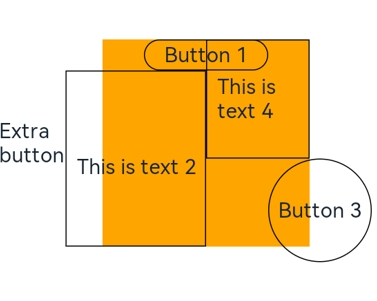

# RelativeContainer

The **\<RelativeContainer>** component is used for element alignment in complex scenarios.

>  **NOTE**
>
> This component is supported since API version 9. Updates will be marked with a superscript to indicate their earliest API version.


## Rules 

 * Components in a container are aligned horizontally or vertically. 
   * Alignment modes in the horizontal direction can be left, middle, or right, achieved by the **HorizontalAlign.Start**, **HorizontalAlign.Center**, and **HorizontalAlign.End** attributes of the container, respectively.
   * Alignment modes in the vertical direction can be top, center, or bottom, achieved by the **VerticalAlign.Top**, **VerticalAlign.Center**, and **VerticalAlign.Bottom** attributes of the container, respectively.
 * A child component can set the container or another child component as the anchor. 
   * To show in the **\<RelativeContainer>**, child components must have an ID. The container ID is fixed at **__container__**. 
   * Three positions on the child component in a specific direction can use as anchors three positions on the container or another child component in the same direction. If anchors are set for more than two positions in a single direction, then: Start and Center are preferred in the horizontal direction, and Top and Center are preferred in the vertical direction.
   * The child component size set on the frontend page is not affected by the **\<RelativeContainer>** rules. If two or more **alignRules** values are set for one direction of the child component, you are not advised to set the size for this direction.
   * If offset is required after the alignment, it can be set through **offset**. 
 * Exceptions
   * When a mutual or circular dependency occurs, none of the child components in the container are drawn. 
   * If anchors are set for more than two positions in a single direction but the anchor positions are reversed, the size of the child component is 0, which means that the child component is not drawn. 

## Child Components

Multiple child components are supported.


## APIs

RelativeContainer()

Since API version 9, this API is supported in ArkTS widgets.

## Example

```ts
@Entry
@Component
struct Index {
  build() {
    Row() {

      RelativeContainer() {
        Row().width(100).height(100)
          .backgroundColor("#FF3333")
          .alignRules({
            top: {anchor: "__container__", align: VerticalAlign.Top},
            left: {anchor: "__container__", align: HorizontalAlign.Start}
          })
          .id("row1")

        Row().width(100).height(100)
          .backgroundColor("#FFCC00")
          .alignRules({
            top: {anchor: "__container__", align: VerticalAlign.Top},
            right: {anchor: "__container__", align: HorizontalAlign.End}
          })
          .id("row2")

        Row().height(100)
          .backgroundColor("#FF6633")
          .alignRules({
            top: {anchor: "row1", align: VerticalAlign.Bottom},
            left: {anchor: "row1", align: HorizontalAlign.End},
            right: {anchor: "row2", align: HorizontalAlign.Start}
          })
          .id("row3")

        Row()
          .backgroundColor("#FF9966")
          .alignRules({
            top: {anchor: "row3", align: VerticalAlign.Bottom},
            bottom: {anchor: "__container__", align: VerticalAlign.Bottom},
            left: {anchor: "__container__", align: HorizontalAlign.Start},
            right: {anchor: "row1", align: HorizontalAlign.End}
          })
          .id("row4")

        Row()
          .backgroundColor("#FF66FF")
          .alignRules({
            top: {anchor: "row3", align: VerticalAlign.Bottom},
            bottom: {anchor: "__container__", align: VerticalAlign.Bottom},
            left: {anchor: "row2", align: HorizontalAlign.Start},
            right: {anchor: "__container__", align: HorizontalAlign.End}
          })
          .id("row5")
      }
      .width(300).height(300)
      .margin({left: 50})
      .border({width:2, color: "#6699FF"})
    }
    .height('100%')
  }
}

```

