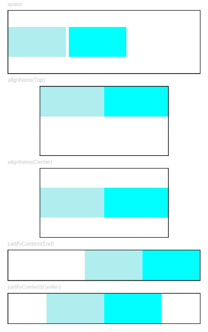

# Row

The **<Row\>** component lays out child components horizontally.

>  **NOTE**
>
>  This component is supported since API version 7. Updates will be marked with a superscript to indicate their earliest API version.


## Child Components

Supported


## APIs

Row(value?:{space?:  number | string })

Since API version 9, this API is supported in ArkTS widgets.

**Parameters**

| Name| Type| Mandatory| Description|
| -------- | -------- | -------- | -------- |
| space | string \| number | No| Horizontal spacing between two adjacent child components.<br>Since API version 9, this parameter does not take effect when it is set to a negative number or **justifyContent** is set to **FlexAlign.SpaceBetween**, **FlexAlign.SpaceAround** or **FlexAlign.SpaceEvenly**.<br>Default value: **0**, in vp<br>**NOTE**<br>The value can be a number greater than or equal to 0 or a string that can be converted to a number.|


## Attributes

| Name| Type| Description|
| -------- | -------- | -------- |
| alignItems | [VerticalAlign](ts-appendix-enums.md#verticalalign) | Alignment mode of child components in the vertical direction.<br>Default value: **VerticalAlign.Center**<br>Since API version 9, this API is supported in ArkTS widgets.|
| justifyContent<sup>8+</sup> | [FlexAlign](ts-appendix-enums.md#flexalign) | Alignment mode of the child components in the horizontal direction.<br>FlexAlign.Start <br>Since API version 9, this API is supported in ArkTS widgets.|


## Example

```ts
// xxx.ets
@Entry
@Component
struct RowExample {
  build() {
    Column({ space: 5 }) {
      // Set the horizontal spacing between two adjacent child components to 5.
      Text('space').fontSize(9).fontColor(0xCCCCCC).width('90%')
      Row({ space: 5 }) {
        Row().width('30%').height(50).backgroundColor(0xAFEEEE)
        Row().width('30%').height(50).backgroundColor(0x00FFFF)
      }.width('90%').height(107).border({ width: 1 })

      // Set the alignment mode of the child components in the vertical direction.
      Text('alignItems(Bottom)').fontSize(9).fontColor(0xCCCCCC).width('90%')
      Row() {
        Row().width('30%').height(50).backgroundColor(0xAFEEEE)
        Row().width('30%').height(50).backgroundColor(0x00FFFF)
      }.width('90%').alignItems(VerticalAlign.Bottom).height('15%').border({ width: 1 })

      Text('alignItems(Center)').fontSize(9).fontColor(0xCCCCCC).width('90%')
      Row() {
        Row().width('30%').height(50).backgroundColor(0xAFEEEE)
        Row().width('30%').height(50).backgroundColor(0x00FFFF)
      }.width('90%').alignItems(VerticalAlign.Center).height('15%').border({ width: 1 })

      // Set the alignment mode of the child components in the horizontal direction.
      Text('justifyContent(End)').fontSize(9).fontColor(0xCCCCCC).width('90%')
      Row() {
        Row().width('30%').height(50).backgroundColor(0xAFEEEE)
        Row().width('30%').height(50).backgroundColor(0x00FFFF)
      }.width('90%').border({ width: 1 }).justifyContent(FlexAlign.End)

      Text('justifyContent(Center)').fontSize(9).fontColor(0xCCCCCC).width('90%')
      Row() {
        Row().width('30%').height(50).backgroundColor(0xAFEEEE)
        Row().width('30%').height(50).backgroundColor(0x00FFFF)
      }.width('90%').border({ width: 1 }).justifyContent(FlexAlign.Center)
    }.width('100%')
  }
}
```


