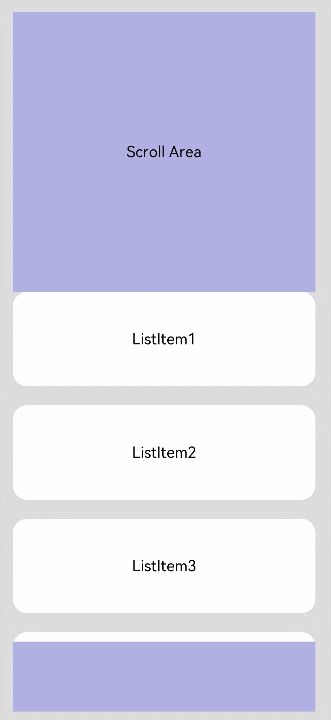

# Scroll

The **\<Scroll>** component scrolls the content when the layout size of a component exceeds the size of its parent component.

>  **NOTE**
>  - This component is supported since API version 7. Updates will be marked with a superscript to indicate their earliest API version.
>  - When nesting a **\<List>** within this component, specify the width and height for the **\<List>** under scenarios where consistently high performance is required. If the width and height are not specified, this component will load all content of the **\<List>**.
>  - This component can scroll only when the size on the main axis is less than the content size.
>  - This component can produce a bounce effect only when there is more than one screen of content.


## Child Components

This component supports only one child component.


## APIs

Scroll(scroller?: Scroller)

## Attributes

In addition to the [universal attributes](ts-universal-attributes-size.md), the following attributes are supported.

| Name            | Type                                    | Description       |
| -------------- | ---------------------------------------- | --------- |
| scrollable     | [ScrollDirection](#scrolldirection)                        | Scroll direction.<br>Default value: **ScrollDirection.Vertical**|
| scrollBar      | [BarState](ts-appendix-enums.md#barstate) | Scrollbar status.<br>Default value: **BarState.Off**|
| scrollBarColor | string \| number \| [Color](ts-appendix-enums.md#color)   | Color of the scrollbar.|
| scrollBarWidth | string \| number         | Width of the scrollbar.|
| edgeEffect     | [EdgeEffect](ts-appendix-enums.md#edgeeffect)            | Scroll effect. For details, see **EdgeEffect**.<br>Default value: **EdgeEffect.None**|

## ScrollDirection
| Name      | Description                    |
| ---------- | ------------------------ |
| Horizontal | Only horizontal scrolling is supported.    |
| Vertical   | Only vertical scrolling is supported.    |
| None       | Scrolling is disabled.              |
| Free<sup>(deprecated) </sup> | Vertical or horizontal scrolling is supported.<br>This API is deprecated since API version 9. |

## Events

| Name                                                        | Description                                                    |
| ------------------------------------------------------------ | ------------------------------------------------------------ |
| onScrollBegin<sup>9+</sup>(event: (dx: number, dy: number) => { dxRemain: number, dyRemain: number }) | Invoked when scrolling starts.<br>Parameters:<br>- **dx**: amount to scroll by in the horizontal direction.<br>- **dy**: amount to scroll by in the vertical direction.<br>Return value:<br>- **dxRemain**: remaining amount to scroll by in the horizontal direction.<br>- **dyRemain**: remaining amount to scroll by in the vertical direction.|
| onScroll(event: (xOffset: number, yOffset: number) => void)  | Invoked to return the horizontal and vertical offsets during scrolling when the specified scroll event occurs.         |
| onScrollEdge(event: (side: Edge) => void)                    | Invoked when scrolling reaches the edge.                                        |
| onScrollEnd(event: () => void)                               | Invoked when scrolling stops.                                          |

>  **NOTE**
>
>  If the **onScrollBegin** event and **scrollBy** API are used to implement nested scrolling, you must set **edgeEffect** of the scrolling child node to **None**. For example, if a **\<List>** is nested in the **\<Scroll>** component, the **edgeEffect** attribute of the **\<List>** must be set to **EdgeEffect.None**.

## Scroller

Implements a controller for a scrollable container component. You can bind this component to a container component and use it to control the scrolling of that component. Currently, this controller can be bound to the **\<List>**, **\<Scroll>** and **\<ScrollBar>** components. One controller can control only one container component.


### Objects to Import

```
scroller: Scroller = new Scroller()
```


### scrollTo

scrollTo(value: { xOffset: number | string, yOffset: number | string, animation?: { duration: number, curve: Curve } }): void


Scrolls to the specified position.

**Parameters**

| Name   | Type                                                    | Mandatory| Description                                                    |
| --------- | ------------------------------------------------------------ | ---- | ------------------------------------------------------------ |
| xOffset   | Length                                                       | Yes  | Horizontal scrolling offset.                                              |
| yOffset   | Length                                                       | Yes  | Vertical scrolling offset.                                              |
| animation | {<br>duration: number,<br>curve: [Curve](ts-animatorproperty.md)<br>} | No  | Animation configuration, which includes the following:<br>- **duration**: scrolling duration.<br>- **curve**: scrolling curve.|


### scrollEdge

scrollEdge(value: Edge): void


Scrolls to the edge of the container.

**Parameters**

| Name  | Type| Mandatory  | Description     |
| ----- | ---- | ---- | --------- |
| value | [Edge](ts-appendix-enums.md#edge) | Yes   | Edge position to scroll to.|


### scrollPage

scrollPage(value: { next: boolean, direction?: Axis }): void

Scrolls to the next or previous page.

**Parameters**

| Name      | Type   | Mandatory  | Description                          |
| --------- | ------- | ---- | ------------------------------ |
| next      | boolean | Yes   | Whether to turn to the next page. The value **true** means to scroll to the next page, and **false** means to scroll to the previous page.|
| direction<sup>(deprecated) </sup> | [Axis](ts-appendix-enums.md#axis)    | No   | Scrolling direction: horizontal or vertical.<br>This API is deprecated since API version 9.               |


### currentOffset

currentOffset()


Obtains the scrolling offset.

**Return value**

| Type                                      | Description                                      |
| ---------------------------------------- | ---------------------------------------- |
| {<br>xOffset: number,<br>yOffset: number<br>} | **xOffset**: horizontal scrolling offset.<br>**yOffset**: vertical scrolling offset.|


### scrollToIndex

scrollToIndex(value: number): void


Scrolls to the item with the specified index.


>  **NOTE**
>
>  Only the **\<List>** component is supported.

**Parameters**

| Name| Type| Mandatory| Description                          |
| ------ | -------- | ---- | ---------------------------------- |
| value  | number   | Yes  | Index of the item to be scrolled to in the list.|


### scrollBy<sup>9+</sup>

scrollBy(dx: Length, dy: Length): void


Scrolls by the specified amount.


>  **NOTE**
>
>  Only the **\<Scroll>** component is supported.

**Parameters**

| Name  | Type  | Mandatory  | Description             |
| ----- | ------ | ---- | ----------------- |
| dx | Length | Yes   | Amount to scroll by in the horizontal direction. The percentage format is not supported.|
| dy | Length | Yes   | Amount to scroll by in the vertical direction. The percentage format is not supported.|


## Example
### Example 1

```ts
// xxx.ets
@Entry
@Component
struct ScrollExample {
  scroller: Scroller = new Scroller();
  private arr: number[] = [0, 1, 2, 3, 4, 5, 6, 7, 8, 9];

  build() {
    Stack({ alignContent: Alignment.TopStart }) {
      Scroll(this.scroller) {
        Column() {
          ForEach(this.arr, (item) => {
            Text(item.toString())
              .width('90%')
              .height(150)
              .backgroundColor(0xFFFFFF)
              .borderRadius(15)
              .fontSize(16)
              .textAlign(TextAlign.Center)
              .margin({ top: 10 })
          }, item => item)
        }.width('100%')
      }
      .scrollable(ScrollDirection.Vertical)  // The scrollbar scrolls in the vertical direction.
      .scrollBar(BarState.On)  // The scrollbar is always displayed.
      .scrollBarColor(Color.Gray)  // Color of the scrollbar.
      .scrollBarWidth(30) // Width of the scrollbar.
      .edgeEffect(EdgeEffect.None)
      .onScroll((xOffset: number, yOffset: number) => {
        console.info(xOffset + ' ' + yOffset);
      })
      .onScrollEdge((side: Edge) => {
        console.info('To the edge');
      })
      .onScrollEnd(() => {
        console.info('Scroll Stop');
      })

      Button('scroll 150')
        .onClick(() => { // Click to scroll down to 150.0 vp.
          this.scroller.scrollBy(0,150);
        })
        .margin({ top: 10, left: 20 })
      Button('scroll 100')
        .onClick(() => { // Click to scroll down by 100.0 vp.
          this.scroller.scrollTo({ xOffset: 0, yOffset: this.scroller.currentOffset().yOffset + 100 });
        })
        .margin({ top: 60, left: 20 })
      Button('back top')
        .onClick(() => { // Click to go back to the top.
          this.scroller.scrollEdge(Edge.Top);
        })
        .margin({ top: 110, left: 20 })
      Button('next page')
        .onClick(() => { // Click to go to the next page.
          this.scroller.scrollPage({ next: true });
        })
        .margin({ top: 170, left: 20 })
    }.width('100%').height('100%').backgroundColor(0xDCDCDC)
  }
}
```


### Example 2
```ts
@Entry
@Component
struct NestedScroll {
  @State listPosition: number = 0; // 0 indicates scrolling to the top of the list, 1 indicates scrolling to the middle of the list, and 2 indicates scrolling to the bottom of the list.
  private arr: number[] = [1, 2, 3, 4, 5, 6, 7, 8, 9, 10];
  private scroller: Scroller = new Scroller();

  build() {
    Flex() {
      Scroll(this.scroller) {
        Column() {
          Text("Scroll Area")
            .width("100%").height("40%").backgroundColor(0X330000FF)
            .fontSize(16).textAlign(TextAlign.Center)

          List({ space: 20 }) {
            ForEach(this.arr, (item) => {
              ListItem() {
                Text("ListItem" + item)
                  .width("100%").height("100%").borderRadius(15)
                  .fontSize(16).textAlign(TextAlign.Center).backgroundColor(Color.White)
              }.width("100%").height(100)
            }, item => item)
          }
          .width("100%").height("50%").edgeEffect(EdgeEffect.None)
          .onReachStart(() => {
            this.listPosition = 0;
          })
          .onReachEnd(() => {
            this.listPosition = 2;
          })
          .onScrollBegin((dx: number, dy: number) => {
            if ((this.listPosition == 0 && dy >= 0) || (this.listPosition == 2 && dy <= 0)) {
              this.scroller.scrollBy(0, -dy);
              return { dxRemain: dx, dyRemain: 0 };
            }
            this.listPosition = 1;
            return { dxRemain: dx, dyRemain: dy };
          })

          Text("Scroll Area")
            .width("100%").height("40%").backgroundColor(0X330000FF)
            .fontSize(16).textAlign(TextAlign.Center)
        }
      }
      .width("100%").height("100%")
    }.width('100%').height('100%').backgroundColor(0xDCDCDC).padding(20)
  }
}
```


