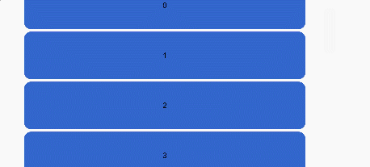

# ScrollBar<a name="EN-US_TOPIC_0000001237715099"></a>

> **NOTE:** 
>This component is supported since API version 8. Updates will be marked with a superscript to indicate their earliest API version.

The  **<ScrollBar\>**  is used together with the scrollable components, such as  **<List\>**,  **<Grid\>**, and  **<Scroll\>**.

## Required Permissions<a name="section9776134617382"></a>

None

## Child Components<a name="section6691716153919"></a>

This component can contain a single child component.

## APIs<a name="section5475917144111"></a>

ScrollBar\(value: ScrollBarOption\)

-   ScrollBarOption parameters

    <a name="table73451359132513"></a>
    <table><thead align="left"><tr id="row1634505910257"><th class="cellrowborder" valign="top" width="19.37%" id="mcps1.1.6.1.1"><p id="p23451592254"><a name="p23451592254"></a><a name="p23451592254"></a>Name</p>
    </th>
    <th class="cellrowborder" valign="top" width="20.630000000000003%" id="mcps1.1.6.1.2"><p id="p734515911252"><a name="p734515911252"></a><a name="p734515911252"></a>Type</p>
    </th>
    <th class="cellrowborder" valign="top" width="20%" id="mcps1.1.6.1.3"><p id="p163451159192516"><a name="p163451159192516"></a><a name="p163451159192516"></a>Mandatory</p>
    </th>
    <th class="cellrowborder" valign="top" width="20%" id="mcps1.1.6.1.4"><p id="p173451059122512"><a name="p173451059122512"></a><a name="p173451059122512"></a>Default Value</p>
    </th>
    <th class="cellrowborder" valign="top" width="20%" id="mcps1.1.6.1.5"><p id="p5345115916257"><a name="p5345115916257"></a><a name="p5345115916257"></a>Description</p>
    </th>
    </tr>
    </thead>
    <tbody><tr id="row8345659182519"><td class="cellrowborder" valign="top" width="19.37%" headers="mcps1.1.6.1.1 "><p id="p234525962510"><a name="p234525962510"></a><a name="p234525962510"></a>scroller</p>
    </td>
    <td class="cellrowborder" valign="top" width="20.630000000000003%" headers="mcps1.1.6.1.2 "><p id="p17345195982518"><a name="p17345195982518"></a><a name="p17345195982518"></a><a href="ts-container-scroll.md#section123902548458">Scroller</a></p>
    </td>
    <td class="cellrowborder" valign="top" width="20%" headers="mcps1.1.6.1.3 "><p id="p12345459132516"><a name="p12345459132516"></a><a name="p12345459132516"></a>Yes</p>
    </td>
    <td class="cellrowborder" valign="top" width="20%" headers="mcps1.1.6.1.4 "><p id="p1034535962512"><a name="p1034535962512"></a><a name="p1034535962512"></a>-</p>
    </td>
    <td class="cellrowborder" valign="top" width="20%" headers="mcps1.1.6.1.5 "><p id="p16346159142520"><a name="p16346159142520"></a><a name="p16346159142520"></a>Scrollable component controller, which can be bound to scrollable components.</p>
    </td>
    </tr>
    <tr id="row63461259122513"><td class="cellrowborder" valign="top" width="19.37%" headers="mcps1.1.6.1.1 "><p id="p143464598252"><a name="p143464598252"></a><a name="p143464598252"></a>direction</p>
    </td>
    <td class="cellrowborder" valign="top" width="20.630000000000003%" headers="mcps1.1.6.1.2 "><p id="p1134675913258"><a name="p1134675913258"></a><a name="p1134675913258"></a><a href="#li3339655172412">ScrollBarDirection</a></p>
    </td>
    <td class="cellrowborder" valign="top" width="20%" headers="mcps1.1.6.1.3 "><p id="p1434612597250"><a name="p1434612597250"></a><a name="p1434612597250"></a>No</p>
    </td>
    <td class="cellrowborder" valign="top" width="20%" headers="mcps1.1.6.1.4 "><p id="p63467599258"><a name="p63467599258"></a><a name="p63467599258"></a>ScrollBarDirection.Vertical</p>
    </td>
    <td class="cellrowborder" valign="top" width="20%" headers="mcps1.1.6.1.5 "><p id="p1634635992511"><a name="p1634635992511"></a><a name="p1634635992511"></a>Scrollbar direction in which scrollable components scroll.</p>
    </td>
    </tr>
    <tr id="row1634619594257"><td class="cellrowborder" valign="top" width="19.37%" headers="mcps1.1.6.1.1 "><p id="p1734617591250"><a name="p1734617591250"></a><a name="p1734617591250"></a>state</p>
    </td>
    <td class="cellrowborder" valign="top" width="20.630000000000003%" headers="mcps1.1.6.1.2 "><p id="p1334665915258"><a name="p1334665915258"></a><a name="p1334665915258"></a><a href="#li719411322578">BarState</a></p>
    </td>
    <td class="cellrowborder" valign="top" width="20%" headers="mcps1.1.6.1.3 "><p id="p43460595258"><a name="p43460595258"></a><a name="p43460595258"></a>No</p>
    </td>
    <td class="cellrowborder" valign="top" width="20%" headers="mcps1.1.6.1.4 "><p id="p1434645912256"><a name="p1434645912256"></a><a name="p1434645912256"></a>BarState.Auto</p>
    </td>
    <td class="cellrowborder" valign="top" width="20%" headers="mcps1.1.6.1.5 "><p id="p17346135918258"><a name="p17346135918258"></a><a name="p17346135918258"></a>Scroll bar status.</p>
    </td>
    </tr>
    </tbody>
    </table>

    > **NOTE:** 
    >The **<\ScrollBar>** component defines the behavior style of the scrollable area, and its subnodes define the behavior style of the scrollbar.
    >This component is bound to a scrollable component through **scroller**, and can be used to scroll the scrollable component only when their directions are the same. The **<\ScrollBar>** component can be bound to only one scrollable component, and vice versa.

-   <a name="li3339655172412"></a>ScrollBarDirection enums

    <a name="table569213415287"></a>
    <table><thead align="left"><tr id="row1269204182810"><th class="cellrowborder" valign="top" width="50%" id="mcps1.1.3.1.1"><p id="p669210414285"><a name="p669210414285"></a><a name="p669210414285"></a>Name</p>
    </th>
    <th class="cellrowborder" valign="top" width="50%" id="mcps1.1.3.1.2"><p id="p1869264172811"><a name="p1869264172811"></a><a name="p1869264172811"></a>Description</p>
    </th>
    </tr>
    </thead>
    <tbody><tr id="row126921241112810"><td class="cellrowborder" valign="top" width="50%" headers="mcps1.1.3.1.1 "><p id="p669219411285"><a name="p669219411285"></a><a name="p669219411285"></a>Vertical</p>
    </td>
    <td class="cellrowborder" valign="top" width="50%" headers="mcps1.1.3.1.2 "><p id="p11692104112817"><a name="p11692104112817"></a><a name="p11692104112817"></a>Vertical scrollbar.</p>
    </td>
    </tr>
    <tr id="row469284113289"><td class="cellrowborder" valign="top" width="50%" headers="mcps1.1.3.1.1 "><p id="p06921941162810"><a name="p06921941162810"></a><a name="p06921941162810"></a>Horizontal</p>
    </td>
    <td class="cellrowborder" valign="top" width="50%" headers="mcps1.1.3.1.2 "><p id="p15692174115282"><a name="p15692174115282"></a><a name="p15692174115282"></a>Horizontal scrollbar.</p>
    </td>
    </tr>
    </tbody>
    </table>

-   <a name="li719411322578"></a>BarState enums

    <a name="table101946325573"></a>
    <table><thead align="left"><tr id="row819473218570"><th class="cellrowborder" valign="top" width="50%" id="mcps1.1.3.1.1"><p id="p7194332105717"><a name="p7194332105717"></a><a name="p7194332105717"></a>Name</p>
    </th>
    <th class="cellrowborder" valign="top" width="50%" id="mcps1.1.3.1.2"><p id="p1819493219573"><a name="p1819493219573"></a><a name="p1819493219573"></a>Description</p>
    </th>
    </tr>
    </thead>
    <tbody><tr id="row1719410328579"><td class="cellrowborder" valign="top" width="50%" headers="mcps1.1.3.1.1 "><p id="p51942327574"><a name="p51942327574"></a><a name="p51942327574"></a>On</p>
    </td>
    <td class="cellrowborder" valign="top" width="50%" headers="mcps1.1.3.1.2 "><p id="p1619411326571"><a name="p1619411326571"></a><a name="p1619411326571"></a>Always displayed.</p>
    </td>
    </tr>
    <tr id="row819416324577"><td class="cellrowborder" valign="top" width="50%" headers="mcps1.1.3.1.1 "><p id="p12195143275714"><a name="p12195143275714"></a><a name="p12195143275714"></a>Off</p>
    </td>
    <td class="cellrowborder" valign="top" width="50%" headers="mcps1.1.3.1.2 "><p id="p10195133213579"><a name="p10195133213579"></a><a name="p10195133213579"></a>Hidden.</p>
    </td>
    </tr>
    <tr id="row19251320581"><td class="cellrowborder" valign="top" width="50%" headers="mcps1.1.3.1.1 "><p id="p1292101315815"><a name="p1292101315815"></a><a name="p1292101315815"></a>Auto</p>
    </td>
    <td class="cellrowborder" valign="top" width="50%" headers="mcps1.1.3.1.2 "><p id="p1692101325817"><a name="p1692101325817"></a><a name="p1692101325817"></a>Displayed on demand (displayed when the user touches the screen and hidden after inactivity of 2s).</p>
    </td>
    </tr>
    </tbody>
    </table>


## Example<a name="section12159163318014"></a>

```
@Entry
@Component
struct ScrollBarExample {
  private scroller: Scroller = new Scroller()
  private arr: number[] = [0, 1, 2, 3, 4, 5, 6, 7, 8, 9]

  build() {
    Column() {
      Stack({ alignContent: Alignment.End }) {
        Scroll(this.scroller) {
          Flex({ direction: FlexDirection.Column }) {
            ForEach(this.arr, (item) => {
              Row() {
                Text(item.toString())
                  .width('90%')
                  .height(100)
                  .backgroundColor('#3366CC')
                  .borderRadius(15)
                  .fontSize(16)
                  .textAlign(TextAlign.Center)
                  .margin({ top: 5 })
              }
            }, item => item)
          }.margin({ left: 52 })
        }
        .scrollBar(BarState.Off)
        .scrollable(ScrollDirection.Vertical)
        ScrollBar({ scroller: this.scroller, direction: ScrollBarDirection.Vertical,state: BarState.Auto }) {
          Text()
            .width(30)
            .height(100)
            .borderRadius(10)
            .backgroundColor('#C0C0C0')
        }.width(30).backgroundColor('#ededed')
      }
    }
  }
}
```


