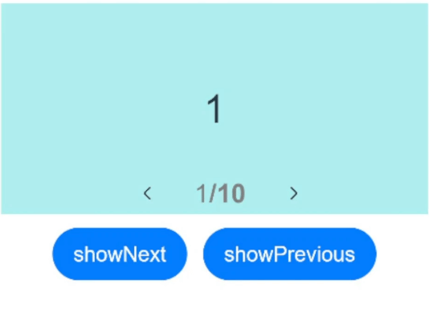

# Swiper

 The **\<Swiper>** component is able to display child components in looping mode.

> **NOTE**
>
> This component is supported since API version 7. Updates will be marked with a superscript to indicate their earliest API version.


## Child Components

This component can contain child components.

>  **NOTE**
>
>  Built-in components and custom components are allowed, with support for ([if/else](../../quick-start/arkts-rendering-control-ifelse.md), [ForEach](../../quick-start/arkts-rendering-control-foreach.md), and [LazyForEach](../../quick-start/arkts-rendering-control-lazyforeach.md)) rendering control.
>
>  When the **\<Swiper>** component's **displayMode** attribute is set to **SwiperDisplayMode.AutoLinear** or its **displayCount** attribute is set to **'auto'**, the child component whose **visibility** attribute is set to **None** does not take up space in the viewport, but this does not affect the number of navigation dots.
>
>  If the **visibility** attribute of a child component is set to **None** or **Hidden**, it takes up space in the viewport, but is not displayed.
>
>  When the number of child components is less than or equal to the total number of allowed nodes (totalDisplayCount = DisplayCount + prevMargin? (1: 0 ) + nextMargin? (1: 0 )) in the content area, the **\<Swiper>** component uses the non-looping mode for layout. In this case, the child components specified by **nextMargin** and **prevMargin** take up space in the viewport, but are not displayed. The specifications of the **\<Swiper>** component are calculated based on the value of **totalDisplayCount**.


## APIs

Swiper(controller?: SwiperController)

**Parameters**

| Name       | Type                                 | Mandatory  | Description                |
| ---------- | ------------------------------------- | ---- | -------------------- |
| controller | [SwiperController](#swipercontroller) | No   | Controller bound to the component to control the page switching.|


## Attributes

In addition to the [universal attributes](ts-universal-attributes-size.md), the following attributes are supported. [Menu control](ts-universal-attributes-menu.md) is not supported.

| Name                                   | Type                                    | Description                                      |
| ------------------------------------- | ---------------------------------------- | ---------------------------------------- |
| index                                 | number                                   | Index of the child component currently displayed in the container.<br>Default value: **0**<br>**NOTE**<br>If the value is less than 0 or greater than or equal to the number of child components, the default value **0** is used.<br>Since API version 10, this attribute supports [$$](../../quick-start/arkts-two-way-sync.md) for two-way binding of variables.|
| autoPlay                              | boolean                                  | Whether to enable automatic playback for child component switching.<br>Default value: **false**<br>**NOTE**<br>If **loop** is set to **false**, the playback stops when the last page is displayed. The playback continues when the page is not the last page after a swipe gesture.|
| interval                              | number                                   | Interval for automatic playback, in ms.<br>Default value: **3000**      |
| indicator<sup>10+</sup>               | [DotIndicator](#dotindicator10) \| [DigitIndicator](#digitindicator10) \| boolean | Style of the navigation point indicator.<br> \- **DotIndicator**: dot style.<br> \- **DigitIndicator**: digit style.<br> \- **boolean**: whether to enable the navigation point indicator.<br>  Default value: **true**<br>  Default type: **DotIndicator**|
| loop                                  | boolean                                  | Whether to enable loop playback.<br>The value **true** means to enable loop playback. When LazyForEach is used, it is recommended that the number of the components to load exceed 5.<br>Default value: **true**|
| duration                              | number                                   | Duration of the animation for switching child components, in ms.<br>Default value: **400**           |
| vertical                              | boolean                                  | Whether vertical swiping is used.<br>Default value: **false**                  |
| itemSpace                             | number \| string               | Space between child components.<br>Default value: **0**<br>**NOTE**<br>This parameter cannot be set in percentage.|
| displayMode                           | SwiperDisplayMode                        | Mode in which elements are displayed along the main axis. This attribute takes effect only when **displayCount** is not set.<br>Default value: **SwiperDisplayMode.Stretch**|
| cachedCount<sup>8+</sup>              | number                                   | Number of child components to be cached.<br>Default value: **1**|
| disableSwipe<sup>8+</sup>             | boolean                                  | Whether to disable the swipe feature.<br>Default value: **false**               |
| curve<sup>8+</sup>                    | [Curve](ts-appendix-enums.md#curve)  \| string | Animation curve. The ease-in/ease-out curve is used by default. For details about common curves, see [Curve](ts-appendix-enums.md#curve). You can also create custom curves (interpolation curve objects) by using the API provided by the [interpolation calculation](../apis/js-apis-curve.md) module.<br>Default value: **Curve.Linear**|
| indicatorStyle<sup>(deprecated)</sup> | {<br>left?: [Length](ts-types.md#length),<br>top?: [Length](ts-types.md#length),<br>right?: [Length](ts-types.md#length),<br>bottom?: [Length](ts-types.md#length),<br>size?: [Length](ts-types.md#length),<br>mask?: boolean,<br>color?: [ResourceColor](ts-types.md),<br>selectedColor?: [ResourceColor](ts-types.md)<br>} | Style of the navigation point indicator.<br>\- **left**: distance between the navigation point indicator and the left edge of the **\<Swiper>** component.<br>\- **top**: distance between the navigation point indicator and the top edge of the **\<Swiper>** component.<br>\- **right**: distance between the navigation point indicator and the right edge of the **\<Swiper>** component.<br>\- **bottom**: distance between the navigation point indicator and the bottom edge of the **\<Swiper>** component.<br>\- **size**: diameter of the navigation point indicator. The value cannot be in percentage. Default value: **6vp**<br>\- **mask**: whether to enable the mask for the navigation point indicator.<br>\- **color**: color of the navigation point indicator.<br>\- **selectedColor**: color of the selected navigation dot.<br>This API is supported since API version 8 and is deprecated since API version 10. You are advised to use [indicator](#indicator10) instead.|
| displayCount<sup>8+</sup>   | number \| string \| <br>[SwiperAutoFill](#swiperautofill10)<sup>10+</sup> | Number of elements to display per page.<br>Default value: **1**<br>**NOTE**<br>If the value is of the string type, it can only be **'auto'**, whose display effect is the same as that of **SwiperDisplayMode.AutoLinear**.<br>If the value is set to a number less than or equal to 0, the default value **1** is used.<br>If the value is of the number type, child components stretch (shrink) on the main axis after the swiper width [deducting the result of itemSpace x (displayCount - 1)] is evenly distributed among them on the main axis.<br> If the value is of the SwiperAutoFill type, the system automatically calculates and changes the number of elements to display per page based on the **\<Swiper>** component width and the **minSize** settings for the child component. If **minSize** is left empty or set to a value less than or equal to 0, the **\<Swiper>** component displays one column.|
| effectMode<sup>8+</sup>               | [EdgeEffect](ts-appendix-enums.md#edgeeffect) | Effect when the component is at one of the edges. This parameter is effective only when **loop** is set to **false**. For details about the supported effects, see the **EdgeEffect** enums.<br>Default value: **EdgeEffect.Spring**<br>**NOTE**<br>The spring effect does not take effect when the controller API is called.|
| displayArrow<sup>10+</sup>            | value:[ArrowStyle](#arrowstyle10) \| boolean,<br>isHoverShow?: boolean | Arrow style of the navigation point indicator.<br>- **value**: arrow and background to set. In abnormal scenarios, the default values in the **ArrowStyle** object are used.<br>\- **isHoverShow**: whether to show the arrow only when the mouse pointer hovers over the navigation point indicator.<br>Default value: **false**<br>**NOTE**<br>When **isHoverShow** is set to **false**, the arrow is always displayed and can be clicked to turn pages.<br>When **isHoverShow** is set to **true**, the arrow is displayed only when the mouse pointer hovers over the navigation point indicator, and it can be clicked to turn pages.|
| nextMargin<sup>10+</sup>    | <br>[Length](ts-types.md#length)<br>| Next margin, used to reveal a small part of the next item.<br>Default value: **0**<br>**NOTE**<br>This attribute is available only when **SwiperDisplayMode** is set to **STRETCH**.<br>When the main axis runs horizontally and either the next margin or previous margin is greater than the calculated width of the child component, neither the next margin nor previous margin is displayed.<br>When the main axis runs vertically and either the next margin or previous margin is greater than the calculated height of the child component, neither the next margin nor previous margin is displayed.|
| prevMargin<sup>10+</sup>    | <br>[Length](ts-types.md#length)<br>| Previous margin, used to reveal a small part of the previous item.<br>Default value: **0**<br>**NOTE**<br>This attribute is available only when **SwiperDisplayMode** is set to **STRETCH**.<br>When the main axis runs horizontally and either the next margin or previous margin is greater than the calculated width of the child component, neither the next margin nor previous margin is displayed.<br>When the main axis runs vertically and either the next margin or previous margin is greater than the calculated height of the child component, neither the next margin nor previous margin is displayed.|

## SwiperDisplayMode

| Name                               | Description                                      |
| --------------------------------- | ---------------------------------------- |
| Stretch<sup>(deprecated)</sup>    | The slide width of the **\<Swiper>** component is equal to the width of the component.<br>This API is deprecated since API version 10. You are advised to use **STRETCH** instead.|
| AutoLinear<sup>(deprecated)</sup> | The slide width of the **\<Swiper>** component is equal to that of the child component with the maximum width.<br>This API is deprecated since API version 10. You are advised to use **AUTO_LINEAR** instead.|
| STRETCH<sup>10+</sup>             | The slide width of the **\<Swiper>** component is equal to the width of the component.            |
| AUTO_LINEAR<sup>10+</sup>         | The slide width of the **\<Swiper>** component is equal to the width of the leftmost child component in the viewport.             |

## SwiperController

Controller of the **\<Swiper>** component. You can bind this object to the **\<Swiper>** component and use it to control page switching.

### showNext

showNext(): void

Turns to the next page. Page turning occurs with the animation, whose duration is specified by **duration**.

### showPrevious

showPrevious(): void

Turns to the previous page. Page turning occurs with the animation, whose duration is specified by **duration**.

### finishAnimation

finishAnimation(callback?: () => void): void

Stops an animation.

**Parameters**

| Name     | Type      | Mandatory. | Description    |
| -------- | ---------- | ---- | -------- |
| callback | () => void | No   | Callback invoked when the animation stops.|

## Indicator<sup>10+</sup>

Sets the distance between the navigation point indicator and the **\<Swiper>** component.

| Name   | Type                        | Mandatory. | Description                                    |
| ------ | ---------------------------- | ---- | ---------------------------------------- |
| left   | [Length](ts-types.md#length) | No   | Distance between the navigation point indicator and the left edge of the **\<Swiper>** component.<br>Default value: **0**<br>Unit: vp|
| top    | [Length](ts-types.md#length) | No   | Distance between the navigation point indicator and the top edge of the **\<Swiper>** component.<br>Default value: **0**<br>Unit: vp|
| right  | [Length](ts-types.md#length) | No   | Distance between the navigation point indicator and the right edge of the **\<Swiper>** component.<br>Default value: **0**<br>Unit: vp|
| bottom | [Length](ts-types.md#length) | No   | Distance between the navigation point indicator and the bottom edge of the **\<Swiper>** component.<br>Default value: **0**<br>Unit: vp|

## DotIndicator<sup>10+</sup>

Defines the navigation point indicator of the dot style, which inherits attributes and features from **Indicator**.

| Name               | Type                                    | Mandatory. | Description                                    |
| ------------------ | ---------------------------------------- | ---- | ---------------------------------------- |
| itemWidth          | [Length](ts-types.md#length)             | No   | Width of the navigation point indicator of the dot style. This parameter cannot be set in percentage.<br>Default value: **6**<br>Unit: vp|
| itemHeight         | [Length](ts-types.md#length)             | No   | Height of the navigation point indicator of the dot style. This parameter cannot be set in percentage.<br>Default value: **6**<br>Unit: vp|
| selectedItemWidth  | [Length](ts-types.md#length)             | No   | Width of the selected navigation point indicator of the dot style. This parameter cannot be set in percentage.<br>Default value: **12**<br>Unit: vp|
| selectedItemHeight | [Length](ts-types.md#length)             | No   | Height of the selected navigation point indicator of the dot style. This parameter cannot be set in percentage.<br>Default value: **6**<br>Unit: vp|
| mask               | boolean                                  | No   | Whether to enable the mask for the navigation point indicator of the dot style.<br>Default value: **false**|
| color              | [ResourceColor](ts-types.md#resourcecolor) | No   | Color of the navigation point indicator of the dot style.<br>Default value: **'\#182431'** (10% opacity)|
| selectedColor      | [ResourceColor](ts-types.md#resourcecolor) | No   | Color of the selected indicator dot.<br>Default value: **'\#007DFF'**|

## DigitIndicator<sup>10+</sup>

Defines the navigation point indicator of the digit style, which inherits attributes and features from **Indicator**.

| Name              | Type                                    | Mandatory. | Description                                    |
| ----------------- | ---------------------------------------- | ---- | ---------------------------------------- |
| fontColor         | [ResourceColor](ts-types.md#resourcecolor) | No   | Font color of the navigation point indicator of the digit style.<br>Default value: **'\#ff182431'**|
| selectedFontColor | [ResourceColor](ts-types.md#resourcecolor) | No   | Font color of the selected navigation point indicator of the digit style.<br>Default value: **'\#ff182431'**|
| digitFont         | {<br>size?:[Length](ts-types.md#length)<br>weight?:number \| [FontWeight](ts-appendix-enums.md#fontweight) \| string<br>} | No   | Font style of the navigation point indicator of the digit style.<br>\- **size**:font size. It cannot be set in percentage.<br>Default value: **14vp**<br>\- **weight**: font weight.|
| selectedDigitFont | {<br>size?:[Length](ts-types.md#length)<br>weight?:number \| [FontWeight](ts-appendix-enums.md#fontweight) \| string<br>} | No   | Font style of the selected navigation point indicator of the digit style.<br>\- **size**:font size. It cannot be set in percentage.<br>Default value: **14vp**<br>\- **weight**: font weight.|

## ArrowStyle<sup>10+</sup>
Describes the left and right arrow attributes.

| Name             | Type                                    | Mandatory. | Description                                    |
| ---------------- | ---------------------------------------- | ---- | ---------------------------------------- |
| showBackground   | boolean                                  | No   | Whether to show the background for the arrow.<br>Default value: **false**               |
| isSidebarMiddle  | boolean                                  | No   | Whether the arrow is shown on either side of the navigation point indicator.<br>Default value: **false** (the arrow is shown on either side of the navigation point indicator)|
| backgroundSize   | [Length](ts-types.md#length)             | No   | Size of the background.<br>On both sides of the navigation point indicator:<br>Default value: **24vp**<br>On both sides of the component:<br>Default value: **32vp**<br>This parameter cannot be set in percentage.|
| backgroundColor  | [ResourceColor](ts-types.md#resourcecolor) | No   | Color of the background.<br>On both sides of the navigation point indicator:<br>Default value: **'\#00000000'**<br>On both sides of the component:<br>Default value: **'\#19182431'**|
| arrowSize        | [Length](ts-types.md#length)             | No   | Size of the arrow.<br>On both sides of the navigation point indicator:<br>Default value: **18vp**<br>On both sides of the component:<br>Default value: **24vp**<br>**NOTE**<br>If **showBackground** is set to **true**, the value of **arrowSize** is 3/4 of the value of **backgroundSize**.<br>This parameter cannot be set in percentage.|
| arrowColor       | [ResourceColor](ts-types.md#resourcecolor) | No   | Color of the arrow.<br>Default value: **'\#182431'**                |

## SwiperAutoFill<sup>10+</sup>

Describes the auto-fill attribute.

| Name | Type            | Mandatory.| Description                            |
| ------- | -------------------- | ------ | ------------------------------------ |
| minSize | [VP](ts-types.md#vp10) | Yes    | Minimum width of the element.<br>Default value: **0**|

## Events

In addition to the [universal events](ts-universal-events-click.md), the following events are supported.

| Name                                      | Description                                    |
| ---------------------------------------- | ---------------------------------------- |
| onChange(event: (index: number) => void) | Triggered when the index of the currently displayed child component changes.<br>- **index**: index of the currently displayed element.<br>**NOTE**<br>When the **\<Swiper>** component is used together with **LazyForEach**, the subpage UI update cannot be triggered in the **onChange** event.|
| onAnimationStart<sup>9+</sup>(event: (index: number, targetIndex<sup>10+</sup>: number, extraInfo<sup>10+</sup>: [SwiperAnimationEvent](ts-types.md#swiperanimationevent10)) => void) | Triggered when the switching animation starts.<br>- **index**: index of the currently displayed element.<br>- **targetIndex**: index of the target element to switch to.<br>- **extraInfo**: extra information of the animation, including the offset of the currently displayed element and target element relative to the start position of the **\<Swiper>** along the main axis, and the hands-off velocity.<br>**NOTE**<br>The **index** parameter indicates the index before the animation starts (not the one after). When the **\<Swiper>** component contains multiple columns, the index is of the leftmost element.|
| onAnimationEnd<sup>9+</sup>(event: (index: number, extraInfo: [SwiperAnimationEvent](ts-types.md#swiperanimationevent10)) => void) | Triggered when the switching animation ends.<br>- **index**: index of the currently displayed element.<br>- **extraInfo**: extra information of the animation, which is the offset of the currently displayed element relative to the start position of the **\<Swiper>** along the main axis.<br>**NOTE**<br>This event is triggered when the switching animation of the **\<Swiper>** component ends, whether it is caused by gesture interruption or by calling **finishAnimation** through SwiperController. The **index** parameter indicates the index after the animation ends. When the **\<Swiper>** component contains multiple columns, the index is of the leftmost element.|
| onGestureSwipe<sup>10+</sup>(event: (index: number, extraInfo: [SwiperAnimationEvent](ts-types.md#swiperanimationevent10)) => void) | Triggered on a frame-by-frame basis when the page is turned by a swipe.<br>- **index**: index of the currently displayed element.<br>- **extraInfo**: extra information of the animation, which is the offset of the currently displayed element relative to the start position of the **\<Swiper>** along the main axis.<br>**NOTE**<br>If there are multiple columns, **index** indicates the index of the leftmost component.|

## Example

### Example 1
```ts
// xxx.ets
class MyDataSource implements IDataSource {
  private list: number[] = []

  constructor(list: number[]) {
    this.list = list
  }

  totalCount(): number {
    return this.list.length
  }

  getData(index: number): number {
    return this.list[index]
  }

  registerDataChangeListener(listener: DataChangeListener): void {
  }

  unregisterDataChangeListener() {
  }
}

@Entry
@Component
struct SwiperExample {
  private swiperController: SwiperController = new SwiperController()
  private data: MyDataSource = new MyDataSource([])

  aboutToAppear(): void {
    let list: number[] = []
    for (let i = 1; i <= 10; i++) {
      list.push(i);
    }
    this.data = new MyDataSource(list)
  }

  build() {
    Column({ space: 5 }) {
      Swiper(this.swiperController) {
        LazyForEach(this.data, (item: string) => {
          Text(item.toString())
            .width('90%')
            .height(160)
            .backgroundColor(0xAFEEEE)
            .textAlign(TextAlign.Center)
            .fontSize(30)
        }, (item: string) => item)
      }
      .cachedCount(2)
      .index(1)
      .autoPlay(true)
      .interval(4000)
      .loop(true)
      .duration(1000)
      .itemSpace(0)
      .indicator( // Set the style of the navigation point indicator.
        new DotIndicator()
          .itemWidth(15)
          .itemHeight(15)
          .selectedItemWidth(15)
          .selectedItemHeight(15)
          .color(Color.Gray)
          .selectedColor(Color.Blue))
      .displayArrow({ // Set the arrow style of the navigation point indicator.
        showBackground: true,
        isSidebarMiddle: true,
        backgroundSize: 24,
        backgroundColor: Color.White,
        arrowSize: 18,
        arrowColor: Color.Blue
      }, false)
      .curve(Curve.Linear)
      .onChange((index: number) => {
        console.info(index.toString())
      })
      .onGestureSwipe((index: number, extraInfo: SwiperAnimationEvent) => {
        console.info("index: " + index)
        console.info("current offset: " + extraInfo.currentOffset)
      })
      .onAnimationStart((index: number, targetIndex: number, extraInfo: SwiperAnimationEvent) => {
        console.info("index: " + index)
        console.info("targetIndex: " + targetIndex)
        console.info("current offset: " + extraInfo.currentOffset)
        console.info("target offset: " + extraInfo.targetOffset)
        console.info("velocity: " + extraInfo.velocity)
      })
      .onAnimationEnd((index: number, extraInfo: SwiperAnimationEvent) => {
        console.info("index: " + index)
        console.info("current offset: " + extraInfo.currentOffset)
      })

      Row({ space: 12 }) {
        Button('showNext')
          .onClick(() => {
            this.swiperController.showNext()
          })
        Button('showPrevious')
          .onClick(() => {
            this.swiperController.showPrevious()
          })
      }.margin(5)
    }.width('100%')
    .margin({ top: 5 })
  }
}
```


### Example 2
```ts
// xxx.ets
class MyDataSource implements IDataSource {
  private list: number[] = []

  constructor(list: number[]) {
    this.list = list
  }

  totalCount(): number {
    return this.list.length
  }

  getData(index: number): number {
    return this.list[index]
  }

  registerDataChangeListener(listener: DataChangeListener): void {
  }

  unregisterDataChangeListener() {
  }
}

@Entry
@Component
struct SwiperExample {
  private swiperController: SwiperController = new SwiperController()
  private data: MyDataSource = new MyDataSource([])

  aboutToAppear(): void {
    let list: number[] = []
    for (let i = 1; i <= 10; i++) {
      list.push(i);
    }
    this.data = new MyDataSource(list)
  }

  build() {
    Column({ space: 5 }) {
      Swiper(this.swiperController) {
        LazyForEach(this.data, (item: string) => {
          Text(item.toString())
            .width('90%')
            .height(160)
            .backgroundColor(0xAFEEEE)
            .textAlign(TextAlign.Center)
            .fontSize(30)
        }, (item: string) => item)
      }
      .cachedCount(2)
      .index(1)
      .autoPlay(true)
      .interval(4000)
      .indicator(Indicator.digit() // Set the navigation point indicator of the digit style.
        .right("43%")
        .top(200)
        .fontColor(Color.Gray)
        .selectedFontColor(Color.Gray)
        .digitFont({ size: 20, weight: FontWeight.Bold })
        .selectedDigitFont({ size: 20, weight: FontWeight.Normal }))
      .loop(true)
      .duration(1000)
      .itemSpace(0)
      .displayArrow(true, false)

      Row({ space: 12 }) {
        Button('showNext')
          .onClick(() => {
            this.swiperController.showNext()
          })
        Button('showPrevious')
          .onClick(() => {
            this.swiperController.showPrevious()
          })
      }.margin(5)
    }.width('100%')
    .margin({ top: 5 })
  }
}
```

