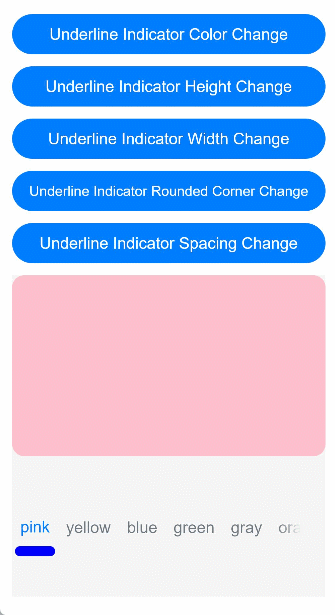
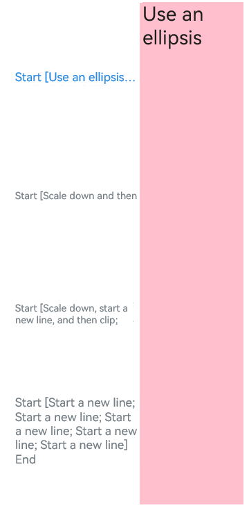

# TabContent

The **\<TabContent>** component is used only in the **\<Tabs>** component. It corresponds to the content view of a switched tab page.

>  **NOTE**
>
>  This component is supported since API version 7. Updates will be marked with a superscript to indicate their earliest API version.


## Child Components

This component supports only one child component.

>  **NOTE**
>
>  Built-in components and custom components are allowed, with support for ([if/else](../../quick-start/arkts-rendering-control-ifelse.md), [ForEach](../../quick-start/arkts-rendering-control-foreach.md), and [LazyForEach](../../quick-start/arkts-rendering-control-lazyforeach.md)) rendering control.


## APIs

TabContent()


## Attributes

In addition to the [universal attributes](ts-universal-attributes-size.md), the following attributes are supported.

| Name| Type| Description|
| -------- | -------- | -------- |
| tabBar | string \| [Resource](ts-types.md#resource) \| {<br>icon?: string \| [Resource](ts-types.md#resource),<br>text?: string \| [Resource](ts-types.md#resource)<br>}<br>\| [CustomBuilder](ts-types.md)<sup>8+</sup> | Content displayed on the tab bar.<br>**CustomBuilder**: builder, to which components can be passed (applicable to API version 8 and later versions).<br>**NOTE**<br>When using an SVG image for the icon, delete the width and height attributes of the image. Otherwise, the icon size will be determined by the width and height attributes of the SVG image.<br>If the content set exceeds the space provided by the tab bar, it will be clipped.|
| tabBar<sup>9+</sup> | [SubTabBarStyle](#subtabbarstyle9) \| [BottomTabBarStyle](#bottomtabbarstyle9) | Content displayed on the tab bar.<br>**SubTabBarStyle**: subtab style. It takes text as its input parameter.<br>**BottomTabBarStyle**: bottom and side tab style. It takes text and images as its input parameters.<br>**NOTE**<br>The bottom tab style does not include an indicator.<br>When an icon display error occurs, a gray blank block is displayed.|

>  **NOTE**
>
>  - The **\<TabContent>** component does not support setting of the common width attribute. By default, its width is the same as that of the parent **\<Tabs>** component.
>  - The **\<TabContent>** component does not support setting of the universal height attribute. Its height is determined by the height of the parent **\<Tabs>** component and the **\<TabBar>** component.
>  - If the **vertical** attribute is **false**, the width and height descriptions are swapped in the preceding two restrictions.
>  - **\<TabContent>** does not support page scrolling. If page scrolling is required, consider nesting a list.

## SubTabBarStyle<sup>9+</sup>

Implements the subtab style.

### constructor

constructor(content: string | Resource)

Constructor used to create a **SubTabBarStyle** instance.

**Parameters**

| Name| Type        | Mandatory| Description|
| -------- | -------- | -------- | -------- |
| content | string \| [Resource](ts-types.md#resource) | Yes| Text for the tab. Since API version 10, the type of **content** is **ResourceStr**.|

### of<sup>10+</sup>

static of(content: ResourceStr)

Static constructor used to create a **SubTabBarStyle** instance.

**Parameters**

| Name | Type                                  | Mandatory| Description          |
| ------- | ------------------------------------------ | ---- | ------------------ |
| content | [ResourceStr](ts-types.md#resourcestr) | Yes  | Text for the tab.|

### Attributes

The following attributes are supported.

| Name        | Type                                                    | Description                                                        |
| ------------ | ------------------------------------------------------------ | ------------------------------------------------------------ |
| indicator<sup>10+</sup> | [IndicatorStyle](#indicatorstyle10)| Indicator style of the selected subtab. It is valid only in the horizontal layout.|
| selectedMode<sup>10+</sup> | [SelectedMode](#selectedmode10)   | Display mode of the selected subtab.<br>Default value: **SelectedMode.INDICATOR**|
| board<sup>10+</sup> | [BoardStyle](#boardstyle10)   | Board style of the selected subtab. This attribute applies only |
| labelStyle<sup>10+</sup> | [LabelStyle](#labelstyle10) | Label text and font of the subtab.|
| padding<sup>10+</sup> | [Padding](ts-types.md#padding) \| [Dimension](ts-types.md#dimension10) | Padding of the subtab. It cannot be set in percentage. When the parameter is of the Dimension type, the value applies to all sides.<br>Default value: **{left:8.0vp,right:8.0vp,top:17.0vp,bottom:18.0vp}**|

## IndicatorStyle<sup>10+</sup>

| Name| Type| Mandatory| Description|
| -------- | -------- | -------- | -------------------------------- |
| color | [ResourceColor](ts-types.md#resourcecolor) | No| Color of the indicator and board.<br>Default value: **#FF007DFF**|
| height | [Length](ts-types.md#length) | No| Height of the indicator. It cannot be set in percentage.<br>Default value: **2.0**<br>Unit: vp|
| width | [Length](ts-types.md#length) | No| Width of the indicator. It cannot be set in percentage.<br>Default value: **0.0**<br>Unit: vp<br>**NOTE**<br>If this parameter is set to **0**, the tab text width will be used instead.|
| borderRadius | [Length](ts-types.md#length) | No| Rounded corner radius of the indicator. It cannot be set in percentage.<br>Default value: **0.0**<br>Unit: vp|
| marginTop | [Length](ts-types.md#length) | No| Spacing between the indicator and text. It cannot be set in percentage.<br>Default value: **8.0**<br>Unit: vp|

## SelectedMode<sup>10+</sup>
| Name      | Description                    |
| ---------- | ------------------------ |
| INDICATOR | Indicator mode.    |
| BOARD   | Board mode.    |

## BoardStyle<sup>10+</sup>

| Name| Type| Mandatory| Description|
| -------- | -------- | -------- | ------------------------------------ |
| borderRadius | [Length](ts-types.md#length) | No| Rounded corner radius of the board. It cannot be set in percentage.<br>Default value: **8.0**<br>Unit: vp|

## LabelStyle<sup>10+</sup>

| Name                | Type                                                    | Mandatory| Description                                                        |
| -------------------- | ------------------------------------------------------------ | ---- | ------------------------------------------------------------ |
| overflow             | [TextOverflow](ts-appendix-enums.md#textoverflow)            | No  | Display mode when the label text is too long. By default, an ellipsis (...) is used to represent text overflow.|
| maxLines             | number                                                       | No  | Maximum number of lines in the label text. If this attribute is specified, the text will not exceed the specified number of lines. You can use **textOverflow** to specify how to represent text overflow. Default value: **1**|
| minFontSize          | number \| [ResourceStr](ts-types.md#resourcestr)             | No  | Minimum font size of the label text. It cannot be set in percentage. For the setting to take effect, this attribute must be used together with **maxFontSize**, **maxLines**, or layout constraint settings. When the adaptive text size is set, **font.size** does not take effect. Default value: **0.0fp**|
| maxFontSize          | number \| [ResourceStr](ts-types.md#resourcestr)             | No  | Maximum font size of the label text. It cannot be set in percentage. For the setting to take effect, this attribute must be used together with **minFontSize**, **maxLines**, or layout constraint settings. When the adaptive text size is set, **font.size** does not take effect. Default value: **0.0fp**|
| heightAdaptivePolicy | [TextHeightAdaptivePolicy](ts-appendix-enums.md#textheightadaptivepolicy10) | No  | How the adaptive height is determined for the label text. By default, the **maxLines** settings are prioritized.                             |
| font                 | [Font](ts-types.md#font)                                     | No  | Font of the label text.<br>When the tab is a subtab, the default font is in 16.0 fp size, 'HarmonyOS Sans' family, and normal font style and weight.<br>When the tab is a bottom tab, the default font is in 10.0 fp size, 'HarmonyOS Sans' family, normal font style, and medium weight.     |

## BottomTabBarStyle<sup>9+</sup>

Implements the bottom and side tab style.

### constructor

constructor(icon: string | Resource, content: string | Resource)

A constructor used to create a **BottomTabBarStyle** instance.

**Parameters**

| Name| Type        | Mandatory| Description|
| -------- | -------- | -------- | -------- |
| icon | string \| [Resource](ts-types.md#resource) | Yes| Image for the tab. Since API version 10, the type of **icon** is **ResourceStr**.|
| text | string \| [Resource](ts-types.md#resource) | Yes| Text for the tab. Since API version 10, the type of **text** is **ResourceStr**.|

### of<sup>10+</sup>

static of(icon: ResourceStr, text: ResourceStr)
Static constructor used to create a **BottomTabBarStyle** instance.

**Parameters**

| Name| Type        | Mandatory| Description|
| -------- | -------- | -------- | -------- |
| icon | [ResourceStr](ts-types.md#resourcestr) | Yes| Image for the tab.|
| text | [ResourceStr](ts-types.md#resourcestr) | Yes| Text for the tab.|

### Attributes

The following attributes are supported.

| Name        | Type                                                    | Description                                                        |
| ------------ | ------------------------------------------------------------ | ------------------------------------------------------------ |
| padding<sup>10+</sup> | [Padding](ts-types.md#padding) \| [Dimension](ts-types.md#dimension10) | Padding of the bottom tab. It cannot be set in percentage. When the parameter is of the Dimension type, the value applies to all sides.<br>Default value: **{left:4.0vp,right:4.0vp,top:0.0vp,bottom:0.0vp}**|
| verticalAlign<sup>10+</sup> |  [VerticalAlign](ts-appendix-enums.md#verticalalign) | Vertical alignment mode of the images and text on the bottom tab.<br>Default value: **VerticalAlign.Center**|
| layoutMode<sup>10+</sup> |  [LayoutMode](#layoutmode10) | Layout of the images and text on the bottom tab. For details, see **LayoutMode**.<br>Default value: **LayoutMode.VERTICAL**|
| symmetricExtensible<sup>10+</sup> |  boolean | Whether the images and text on the bottom tab can be symmetrically extended by the minimum value of the available space on the left and right bottom tabs. This parameter is valid only between bottom tabs in fixed horizontal mode.<br>Default value: **false**|
| labelStyle<sup>10+</sup> | [LabelStyle](#labelstyle10) | Label text and font of the subtab.|

## LayoutMode<sup>10+</sup>

| Name        | Description                                      |
| ----------  | ---------------------------------------- |
| AUTO        | When the tab width is greater than 104 vp, the tab content is arranged from left to right. Otherwise,the tab content is arranged from top to bottom. This parameter is valid only when the tab bar is in vertical mode or fixed horizontal mode.|
| VERTICAL    | The tab content is arranged from top to bottom.|
| HORIZONAL   | The tab content is arranged from left to right.|


## Example

### Example 1

```ts
// xxx.ets
@Entry
@Component
struct TabContentExample {
  @State fontColor: string = '#182431'
  @State selectedFontColor: string = '#007DFF'
  @State currentIndex: number = 0
  private controller: TabsController = new TabsController()

  @Builder TabBuilder(index: number) {
    Column() {
      Image(this.currentIndex === index ? '/common/public_icon_on.svg' : '/common/public_icon_off.svg')
        .width(24)
        .height(24)
        .margin({ bottom: 4 })
        .objectFit(ImageFit.Contain)
      Text(`Tab${index + 1}`)
        .fontColor(this.currentIndex === index ? this.selectedFontColor : this.fontColor)
        .fontSize(10)
        .fontWeight(500)
        .lineHeight(14)
    }.width('100%')
  }

  build() {
    Column() {
      Tabs({ barPosition: BarPosition.End, controller: this.controller }) {
        TabContent() {
          Column() {
            Text('Tab1')
              .fontSize(36)
              .fontColor('#182431')
              .fontWeight(500)
              .opacity(0.4)
              .margin({ top: 30, bottom: 56.5 })
            Divider()
              .strokeWidth(0.5)
              .color('#182431')
              .opacity(0.05)
          }.width('100%')
        }.tabBar(this.TabBuilder(0))

        TabContent() {
          Column() {
            Text('Tab2')
              .fontSize(36)
              .fontColor('#182431')
              .fontWeight(500)
              .opacity(0.4)
              .margin({ top: 30, bottom: 56.5 })
            Divider()
              .strokeWidth(0.5)
              .color('#182431')
              .opacity(0.05)
          }.width('100%')
        }.tabBar(this.TabBuilder(1))

        TabContent() {
          Column() {
            Text('Tab3')
              .fontSize(36)
              .fontColor('#182431')
              .fontWeight(500)
              .opacity(0.4)
              .margin({ top: 30, bottom: 56.5 })
            Divider()
              .strokeWidth(0.5)
              .color('#182431')
              .opacity(0.05)
          }.width('100%')
        }.tabBar(this.TabBuilder(2))

        TabContent() {
          Column() {
            Text('Tab4')
              .fontSize(36)
              .fontColor('#182431')
              .fontWeight(500)
              .opacity(0.4)
              .margin({ top: 30, bottom: 56.5 })
            Divider()
              .strokeWidth(0.5)
              .color('#182431')
              .opacity(0.05)
          }.width('100%')
        }.tabBar(this.TabBuilder(3))
      }
      .vertical(false)
      .barHeight(56)
      .onChange((index: number) => {
        this.currentIndex = index
      })
      .width(360)
      .height(190)
      .backgroundColor('#F1F3F5')
      .margin({ top: 38 })
    }.width('100%')
  }
}
```


### Example 2

```ts
// xxx.ets
@Entry
@Component
struct TabContentExample {
  @State fontColor: string = '#182431'
  @State selectedFontColor: string = '#007DFF'
  @State currentIndex: number = 0
  private controller: TabsController = new TabsController()

  @Builder TabBuilder(index: number) {
    Column() {
      Image(this.currentIndex === index ? '/common/public_icon_on.svg' : '/common/public_icon_off.svg')
        .width(24)
        .height(24)
        .margin({ bottom: 4 })
        .objectFit(ImageFit.Contain)
      Text('Tab')
        .fontColor(this.currentIndex === index ? this.selectedFontColor : this.fontColor)
        .fontSize(10)
        .fontWeight(500)
        .lineHeight(14)
    }.width('100%').height('100%').justifyContent(FlexAlign.Center)
  }

  build() {
    Column() {
      Tabs({ barPosition: BarPosition.Start, controller: this.controller }) {
        TabContent()
          .tabBar(this.TabBuilder(0))
        TabContent()
          .tabBar(this.TabBuilder(1))
        TabContent()
          .tabBar(this.TabBuilder(2))
        TabContent()
          .tabBar(this.TabBuilder(3))
      }
      .vertical(true)
      .barWidth(96)
      .barHeight(414)
      .onChange((index: number) => {
        this.currentIndex = index
      })
      .width(96)
      .height(414)
      .backgroundColor('#F1F3F5')
      .margin({ top: 52 })
    }.width('100%')
  }
}
```


### Example 3

```ts
// xxx.ets
@Entry
@Component
struct TabBarStyleExample {
  build() {
    Column({ space: 5 }) {
      Text ("Subtab Style")
      Column() {
        Tabs({ barPosition: BarPosition.Start }) {
          TabContent() {
            Column().width('100%').height('100%').backgroundColor(Color.Pink)
          }.tabBar(new SubTabBarStyle('Pink'))

          TabContent() {
            Column().width('100%').height('100%').backgroundColor(Color.Yellow)
          }.tabBar(new SubTabBarStyle('Yellow'))

          TabContent() {
            Column().width('100%').height('100%').backgroundColor(Color.Blue)
          }.tabBar(new SubTabBarStyle('Blue'))

          TabContent() {
            Column().width('100%').height('100%').backgroundColor(Color.Green)
          }.tabBar(new SubTabBarStyle('Green'))
        }
        .vertical(false)
        .scrollable(true)
        .barMode(BarMode.Fixed)
        .onChange((index: number) => {
          console.info(index.toString())
        })
        .width('100%')
        .backgroundColor(0xF1F3F5)
      }.width('100%').height(200)
      Text ("Bottom Tab Style")
      Column() {
        Tabs({ barPosition: BarPosition.End }) {
          TabContent() {
            Column().width('100%').height('100%').backgroundColor(Color.Pink)
          }.tabBar(new BottomTabBarStyle($r('sys.media.ohos_app_icon'), 'pink'))

          TabContent() {
            Column().width('100%').height('100%').backgroundColor(Color.Yellow)
          }.tabBar(new BottomTabBarStyle($r('sys.media.ohos_app_icon'), 'Yellow'))

          TabContent() {
            Column().width('100%').height('100%').backgroundColor(Color.Blue)
          }.tabBar(new BottomTabBarStyle($r('sys.media.ohos_app_icon'), 'Blue'))

          TabContent() {
            Column().width('100%').height('100%').backgroundColor(Color.Green)
          }.tabBar(new BottomTabBarStyle($r('sys.media.ohos_app_icon'), 'Green'))
        }
        .vertical(false)
        .scrollable(true)
        .barMode(BarMode.Fixed)
        .onChange((index: number) => {
          console.info(index.toString())
        })
        .width('100%')
        .backgroundColor(0xF1F3F5)
      }.width('100%').height(200)
      Text ("Side Tab Style")
      Column() {
        Tabs({ barPosition: BarPosition.Start }) {
          TabContent() {
            Column().width('100%').height('100%').backgroundColor(Color.Pink)
          }.tabBar(new BottomTabBarStyle($r('sys.media.ohos_app_icon'), 'pink'))

          TabContent() {
            Column().width('100%').height('100%').backgroundColor(Color.Yellow)
          }.tabBar(new BottomTabBarStyle($r('sys.media.ohos_app_icon'), 'Yellow'))

          TabContent() {
            Column().width('100%').height('100%').backgroundColor(Color.Blue)
          }.tabBar(new BottomTabBarStyle($r('sys.media.ohos_app_icon'), 'Blue'))

          TabContent() {
            Column().width('100%').height('100%').backgroundColor(Color.Green)
          }.tabBar(new BottomTabBarStyle($r('sys.media.ohos_app_icon'), 'Green'))
        }
        .vertical(true).scrollable(true).barMode(BarMode.Fixed)
        .onChange((index: number) => {
          console.info(index.toString())
        })
        .width('100%')
        .backgroundColor(0xF1F3F5)
      }.width('100%').height(400)
    }
  }
}
```


### Example 4

```ts
// xxx.ets
@Entry
@Component
struct TabsAttr {
  private controller: TabsController = new TabsController()
  @State indicatorColor: Color = Color.Blue;
  @State indicatorWidth: number = 40;
  @State indicatorHeight: number = 10;
  @State indicatorBorderRadius: number = 5;
  @State indicatorSpace: number = 10;
  @State subTabBorderRadius: number = 20;
  @State selectedMode: SelectedMode = SelectedMode.INDICATOR;
  private colorFlag: boolean = true;
  private widthFlag: boolean = true;
  private heightFlag: boolean = true;
  private borderFlag: boolean = true;
  private spaceFlag: boolean = true;

  build() {
    Column() {
      Button ("Change Indicator Color").width ('100%').margin ({ bottom:'12vp' })
        .onClick((event?: ClickEvent) => {
          // Animation configuration for the width and height attributes of the <Button> component
          if (this.colorFlag) {
            animateTo({
              duration: 1000, // Animation duration.
              curve: Curve.Linear, // Animation curve.
              delay: 200, // Animation delay.
              iterations: 1, // Number of playback times.
              playMode: PlayMode.Normal, // Animation playback mode.
              onFinish: () => {
                console.info('play end')
              }
            }, () => {
              this.indicatorColor = Color.Red
            })
          } else {
            animateTo({
              duration: 1000, // Animation duration.
              curve: Curve.Linear, // Animation curve.
              delay: 200, // Animation delay.
              iterations: 1, // Number of playback times.
              playMode: PlayMode.Normal, // Animation playback mode.
              onFinish: () => {
                console.info('play end')
              }
            }, () => {
              this.indicatorColor = Color.Yellow
            })
          }
          this.colorFlag = !this.colorFlag
        })
      Button("Change Indicator Height").width('100%').margin({ bottom: '12vp' })
        .onClick((event?: ClickEvent) => {
          // Animation configuration for the width and height attributes of the <Button> component
          if (this.heightFlag) {
            animateTo({
              duration: 1000, // Animation duration.
              curve: Curve.Linear, // Animation curve.
              delay: 200, // Animation delay.
              iterations: 1, // Number of playback times.
              playMode: PlayMode.Normal, // Animation playback mode.
              onFinish: () => {
                console.info('play end')
              }
            }, () => {
              this.indicatorHeight = 20
            })
          } else {
            animateTo({
              duration: 1000, // Animation duration.
              curve: Curve.Linear, // Animation curve.
              delay: 200, // Animation delay.
              iterations: 1, // Number of playback times.
              playMode: PlayMode.Normal, // Animation playback mode.
              onFinish: () => {
                console.info('play end')
              }
            }, () => {
              this.indicatorHeight = 10
            })
          }
          this.heightFlag = !this.heightFlag
        })
      Button("Change Indicator Width").width('100%').margin({ bottom: '12vp' })
        .onClick((event?: ClickEvent) => {
          // Animation configuration for the width and height attributes of the <Button> component
          if (this.widthFlag) {
            animateTo({
              duration: 1000, // Animation duration.
              curve: Curve.Linear, // Animation curve.
              delay: 200, // Animation delay.
              iterations: 1, // Number of playback times.
              playMode: PlayMode.Normal, // Animation playback mode.
              onFinish: () => {
                console.info('play end')
              }
            }, () => {
              this.indicatorWidth = 30
            })
          } else {
            animateTo({
              duration: 1000, // Animation duration.
              curve: Curve.Linear, // Animation curve.
              delay: 200, // Animation delay.
              iterations: 1, // Number of playback times.
              playMode: PlayMode.Normal, // Animation playback mode.
              onFinish: () => {
                console.info('play end')
              }
            }, () => {
              this.indicatorWidth = 50
            })
          }
          this.widthFlag = !this.widthFlag
        })
      Button ("Change Indicator Corner Radius").width ('100%').margin ({ bottom:'12vp' })
        .onClick((event?: ClickEvent) => {
          // Animation configuration for the width and height attributes of the <Button> component
          if (this.borderFlag) {
            animateTo({
              duration: 1000, // Animation duration.
              curve: Curve.Linear, // Animation curve.
              delay: 200, // Animation delay.
              iterations: 1, // Number of playback times.
              playMode: PlayMode.Normal, // Animation playback mode.
              onFinish: () => {
                console.info('play end')
              }
            }, () => {
              this.indicatorBorderRadius = 0
            })
          } else {
            animateTo({
              duration: 1000, // Animation duration.
              curve: Curve.Linear, // Animation curve.
              delay: 200, // Animation delay.
              iterations: 1, // Number of playback times.
              playMode: PlayMode.Normal, // Animation playback mode.
              onFinish: () => {
                console.info('play end')
              }
            }, () => {
              this.indicatorBorderRadius = 5
            })
          }
          this.borderFlag = !this.borderFlag
        })
      Button ("Change Indicator Spacing").width ('100%').margin ({ bottom:'12vp' })
        .onClick((event?: ClickEvent) => {
          // Animation configuration for the width and height attributes of the <Button> component
          if (this.spaceFlag) {
            animateTo({
              duration: 1000, // Animation duration.
              curve: Curve.Linear, // Animation curve.
              delay: 200, // Animation delay.
              iterations: 1, // Number of playback times.
              playMode: PlayMode.Normal, // Animation playback mode.
              onFinish: () => {
                console.info('play end')
              }
            }, () => {
              this.indicatorSpace = 20
            })
          } else {
            animateTo({
              duration: 1000, // Animation duration.
              curve: Curve.Linear, // Animation curve.
              delay: 200, // Animation delay.
              iterations: 1, // Number of playback times.
              playMode: PlayMode.Normal, // Animation playback mode.
              onFinish: () => {
                console.info('play end')
              }
            }, () => {
              this.indicatorSpace = 10
            })
          }
          this.spaceFlag = !this.spaceFlag
        })
      Tabs({ barPosition: BarPosition.End, controller: this.controller }) {
        TabContent() {
          Column().width('100%').height('100%').backgroundColor(Color.Pink).borderRadius('12vp')
        }.tabBar(SubTabBarStyle.of('pink')
          .indicator({
            color: this.indicatorColor, // Indicator color.
            height: this.indicatorHeight, // Indicator height.
            width: this.indicatorWidth, // Indicator width.
            borderRadius: this.indicatorBorderRadius, // Rounded corner radius of the indicator.
            marginTop: this.indicatorSpace // Spacing between the indicator and text.
          })
          .selectedMode(this.selectedMode)
          .board({ borderRadius: this.subTabBorderRadius })
          .labelStyle({})
        )

        TabContent() {
          Column().width('100%').height('100%').backgroundColor(Color.Yellow).borderRadius('12vp')
        }.tabBar('yellow')

        TabContent() {
          Column().width('100%').height('100%').backgroundColor(Color.Blue).borderRadius('12vp')
        }.tabBar('blue')

        TabContent() {
          Column().width('100%').height('100%').backgroundColor(Color.Green).borderRadius('12vp')
        }.tabBar('green')

        TabContent() {
          Column().width('100%').height('100%').backgroundColor(Color.Gray).borderRadius('12vp')
        }.tabBar('gray')

        TabContent() {
          Column().width('100%').height('100%').backgroundColor(Color.Orange).borderRadius('12vp')
        }.tabBar('orange')
      }
      .vertical(false)
      .scrollable(true)
      .barMode(BarMode.Scrollable)
      .barHeight(140)
      .animationDuration(400)
      .onChange((index: number) => {
        console.info(index.toString())
      })
      .backgroundColor(0xF5F5F5)
      .height(320)
    }.width('100%').height(250).padding({ top: '24vp', left: '24vp', right: '24vp' })
  }
}
```



### Example 5

```ts
// xxx.ets
@Entry
@Component
struct TabsTextOverflow {
  @State message: string = 'Hello World'
  private controller: TabsController = new TabsController()
  @State subTabOverflowOpaque: boolean = true;
  build() {
    Column() {
      Tabs({ barPosition: BarPosition.Start, controller: this.controller }) {
        TabContent() {
          Column(){
            Text('Use an ellipsis').fontSize(30).fontColor(0xFF000000)
          }.width('100%').height('100%').backgroundColor(Color.Pink)
        }.tabBar (SubTabBarStyle.of ('Start [Use an ellipsis] End')
          .labelStyle({ overflow: TextOverflow.Ellipsis, maxLines: 1, minFontSize: 10, heightAdaptivePolicy: TextHeightAdaptivePolicy.MAX_LINES_FIRST,
            font: { size: 20 } }))
        TabContent() {
          Column()
          {
            Text('Scale down and then clip').fontSize(30).fontColor(0xFF000000)
          }.width('100%').height('100%').backgroundColor(Color.Pink)
        }.tabBar (SubTabBarStyle.of ('Start [Scale down and then clip; Scale down and then clip] End')
          .labelStyle({ overflow: TextOverflow.Clip, maxLines: 1, minFontSize: 15, maxFontSize: 15, heightAdaptivePolicy: TextHeightAdaptivePolicy.MIN_FONT_SIZE_FIRST,
            font: { size: 20 } }))
        TabContent() {
          Column(){
            Text('Scale down, start a new line, and then clip').fontSize(30).fontColor(0xFF000000)
          }.width('100%').height('100%').backgroundColor(Color.Pink)
        }.tabBar (SubTabBarStyle.of ('Start [Scale down, start a new line, and then clip; Scale down, start a new line, and then clip] End')
          .labelStyle({ overflow: TextOverflow.Clip, maxLines: 2, minFontSize: 15, maxFontSize: 15, heightAdaptivePolicy: TextHeightAdaptivePolicy.MIN_FONT_SIZE_FIRST,
            font: { size: 20 } }))
        TabContent() {
          Column() {
            Text('Start a new line').fontSize(30).fontColor(0xFF000000)
          }
          .width('100%').height('100%').backgroundColor(Color.Pink)
        }.tabBar(SubTabBarStyle.of('Start [Start a new line; Start a new line; Start a new line; Start a new line; Start a new line] End')
          .labelStyle({ overflow: TextOverflow.Clip, maxLines: 10, minFontSize: 10, heightAdaptivePolicy: TextHeightAdaptivePolicy.MAX_LINES_FIRST,
            font: { size: 20 } }))
      }
      .vertical(true).scrollable(true)
      .barMode(BarMode.Fixed)
      .barHeight(720)
      .barWidth(200).animationDuration(400)
      .onChange((index: number) => {
        console.info(index.toString())
      })
      .height('100%').width('100%')
    }
    .height('100%')
  }
}
```



### Example 6

```ts
// xxx.ets
@Entry
@Component
struct TabContentExample6 {
  private controller: TabsController = new TabsController()
  @State text: string = "2"
  @State tabPadding: number = 0;
  @State symmetricExtensible: boolean = false;
  @State layoutMode: LayoutMode = LayoutMode.VERTICAL;
  @State verticalAlign: VerticalAlign = VerticalAlign.Center;

  build() {
    Column() {
      Row() {
        Button("padding+10 " + this.tabPadding)
          .width('47%')
          .height(50)
          .margin({ top: 5 })
          .onClick((event?: ClickEvent) => {
            this.tabPadding += 10
          })
          .margin({ right: '6%', bottom: '12vp' })
        Button("padding-10 " + this.tabPadding)
          .width('47%')
          .height(50)
          .margin({ top: 5 })
          .onClick((event?: ClickEvent) => {
            this.tabPadding -= 10
          })
          .margin({ bottom: '12vp' })
      }

      Row() {
        Button ("Add Text")
          .width('47%')
          .height(50)
          .margin({ top: 5 })
          .onClick((event?: ClickEvent) => {
            this.text += 'Add Text'
          })
          .margin({ right: '6%', bottom: '12vp' })
        Button ("Reset Text")
          .width('47%')
          .height(50)
          .margin({ top: 5 })
          .onClick((event?: ClickEvent) => {
            this.text = "2"
          })
          .margin({ bottom: '12vp' })
      }

      Row() {
        Button ("Set SymmetricExtensible to " + this.symmetricExtensible)
          .width('100%')
          .height(50)
          .margin({ top: 5 })
          .onClick((event?: ClickEvent) => {
            this.symmetricExtensible = !this.symmetricExtensible
          })
          .margin({ bottom: '12vp' })
      }

      Row() {
        Button ("Vertical Layout")
          .width('47%')
          .height(50)
          .margin({ top: 5 })
          .onClick((event?: ClickEvent) => {
            this.layoutMode = LayoutMode.VERTICAL;
          })
          .margin({ right: '6%', bottom: '12vp' })
        Button ("horizontal Layout")
          .width('47%')
          .height(50)
          .margin({ top: 5 })
          .onClick((event?: ClickEvent) => {
            this.layoutMode = LayoutMode.HORIZONTAL;
          })
          .margin({ bottom: '12vp' })
      }

      Row() {
        Button ("VerticalAlign.Top")
          .width('100%')
          .height(50)
          .margin({ top: 5 })
          .onClick((event?: ClickEvent) => {
            this.verticalAlign = VerticalAlign.Top;
          })
          .margin({ bottom: '12vp' })
      }

      Row() {
        Button ("VerticalAlign.Center")
          .width('100%')
          .height(50)
          .margin({ top: 5 })
          .onClick((event?: ClickEvent) => {
            this.verticalAlign = VerticalAlign.Center;
          })
          .margin({ bottom: '12vp' })
      }

      Row() {
        Button ("VerticalAlign.Bottom")
          .width('100%')
          .height(50)
          .margin({ top: 5 })
          .onClick((event?: ClickEvent) => {
            this.verticalAlign = VerticalAlign.Bottom;
          })
          .margin({ bottom: '12vp' })
      }


      Tabs({ barPosition: BarPosition.End, controller: this.controller }) {
        TabContent() {
          Column().width('100%').height('100%').backgroundColor(Color.Pink)
        }.tabBar(BottomTabBarStyle.of($r("sys.media.ohos_app_icon"), "1"))

        TabContent() {
          Column().width('100%').height('100%').backgroundColor(Color.Green)
        }.tabBar(BottomTabBarStyle.of($r("sys.media.ohos_app_icon"), this.text)
          .padding(this.tabPadding)
          .verticalAlign(this.verticalAlign)
          .layoutMode(this.layoutMode)
          .symmetricExtensible(this.symmetricExtensible))

        TabContent() {
          Column().width('100%').height('100%').backgroundColor(Color.Blue)
        }.tabBar(BottomTabBarStyle.of($r("sys.media.ohos_app_icon"), "3"))
      }
      .animationDuration(300)
      .height('60%')
      .backgroundColor(0xf1f3f5)
      .barMode(BarMode.Fixed)
    }
    .width('100%')
    .height(500)
    .margin({ top: 5 })
    .padding('24vp')
  }
}
```


