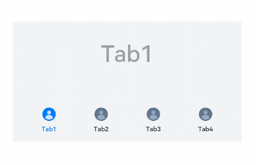
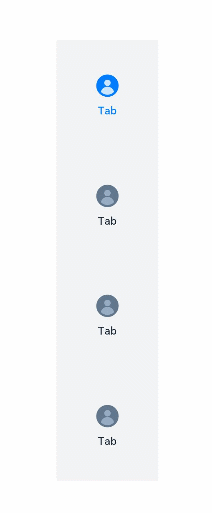

# TabContent

The **\<TabContent>** component is used only in the **\<Tabs>** component. It corresponds to the content view of a switched tab page.

>  **NOTE**
>
>  This component is supported since API version 7. Updates will be marked with a superscript to indicate their earliest API version.


## Child Components

This component supports only one child component.


## APIs

TabContent()


## Attributes

In addition to the [universal attributes](ts-universal-attributes-size.md), the following attributes are supported.

| Name| Type| Description|
| -------- | -------- | -------- |
| tabBar | string \| Resource \| {<br>icon?: string \| Resource,<br>text?: string \| Resource<br>}<br>\| [CustomBuilder](ts-types.md)<sup>8+</sup> | Content displayed on the tab bar.<br>**CustomBuilder**: builder, to which components can be passed (applicable to API version 8 and later versions).<br>> **NOTE**<br>If an icon uses an SVG image, the width and height attributes of the SVG image must be deleted. Otherwise, the icon size will be determined by the width and height attributes of the SVG image.|

>  **NOTE**
> - The **\<TabContent>** component does not support setting of the common width attribute. By default, its width is the same as that of the parent **\<Tabs>** component.
> - The **\<TabContent>** component does not support setting of the common height attribute. Its height is determined by the height of the parent **\<Tabs>** component and the **\<TabBar>** component.
> - The **\<TabContent>** component does not support setting of the [touch target](ts-universal-attributes-touch-target.md).


## Example

Example 1:

```ts
// xxx.ets
@Entry
@Component
struct TabContentExample {
  @State fontColor: string = '#182431'
  @State selectedFontColor: string = '#007DFF'
  @State currentIndex: number = 0
  private controller: TabsController = new TabsController()

  @Builder TabBuilder(index: number) {
    Column() {
      Image(this.currentIndex === index ? '/common/public_icon_on.svg' : '/common/public_icon_off.svg')
        .width(24)
        .height(24)
        .margin({ bottom: 4 })
        .objectFit(ImageFit.Contain)
      Text(`Tab${index + 1}`)
        .fontColor(this.currentIndex === index ? this.selectedFontColor : this.fontColor)
        .fontSize(10)
        .fontWeight(500)
        .lineHeight(14)
    }.width('100%')
  }

  build() {
    Column() {
      Tabs({ barPosition: BarPosition.End, controller: this.controller }) {
        TabContent() {
          Column() {
            Text('Tab1')
              .fontSize(36)
              .fontColor('#182431')
              .fontWeight(500)
              .opacity(0.4)
              .margin({ top: 30, bottom: 56.5 })
            Divider()
              .strokeWidth(0.5)
              .color('#182431')
              .opacity(0.05)
          }.width('100%')
        }.tabBar(this.TabBuilder(0))

        TabContent() {
          Column() {
            Text('Tab2')
              .fontSize(36)
              .fontColor('#182431')
              .fontWeight(500)
              .opacity(0.4)
              .margin({ top: 30, bottom: 56.5 })
            Divider()
              .strokeWidth(0.5)
              .color('#182431')
              .opacity(0.05)
          }.width('100%')
        }.tabBar(this.TabBuilder(1))

        TabContent() {
          Column() {
            Text('Tab3')
              .fontSize(36)
              .fontColor('#182431')
              .fontWeight(500)
              .opacity(0.4)
              .margin({ top: 30, bottom: 56.5 })
            Divider()
              .strokeWidth(0.5)
              .color('#182431')
              .opacity(0.05)
          }.width('100%')
        }.tabBar(this.TabBuilder(2))

        TabContent() {
          Column() {
            Text('Tab4')
              .fontSize(36)
              .fontColor('#182431')
              .fontWeight(500)
              .opacity(0.4)
              .margin({ top: 30, bottom: 56.5 })
            Divider()
              .strokeWidth(0.5)
              .color('#182431')
              .opacity(0.05)
          }.width('100%')
        }.tabBar(this.TabBuilder(3))
      }
      .vertical(false)
      .barHeight(56)
      .onChange((index: number) => {
        this.currentIndex = index
      })
      .width(360)
      .height(190)
      .backgroundColor('#F1F3F5')
      .margin({ top: 38 })
    }.width('100%')
  }
}
```



Example 2:

```ts
// xxx.ets
@Entry
@Component
struct TabContentExample {
  @State fontColor: string = '#182431'
  @State selectedFontColor: string = '#007DFF'
  @State currentIndex: number = 0
  private controller: TabsController = new TabsController()

  @Builder TabBuilder(index: number) {
    Column() {
      Image(this.currentIndex === index ? '/common/public_icon_on.svg' : '/common/public_icon_off.svg')
        .width(24)
        .height(24)
        .margin({ bottom: 4 })
        .objectFit(ImageFit.Contain)
      Text('Tab')
        .fontColor(this.currentIndex === index ? this.selectedFontColor : this.fontColor)
        .fontSize(10)
        .fontWeight(500)
        .lineHeight(14)
    }.width('100%').height('100%').justifyContent(FlexAlign.Center)
  }

  build() {
    Column() {
      Tabs({ barPosition: BarPosition.Start, controller: this.controller }) {
        TabContent()
          .tabBar(this.TabBuilder(0))
        TabContent()
          .tabBar(this.TabBuilder(1))
        TabContent()
          .tabBar(this.TabBuilder(2))
        TabContent()
          .tabBar(this.TabBuilder(3))
      }
      .vertical(true)
      .barWidth(96)
      .barHeight(414)
      .onChange((index: number) => {
        this.currentIndex = index
      })
      .width(96)
      .height(414)
      .backgroundColor('#F1F3F5')
      .margin({ top: 52 })
    }.width('100%')
  }
}
```


