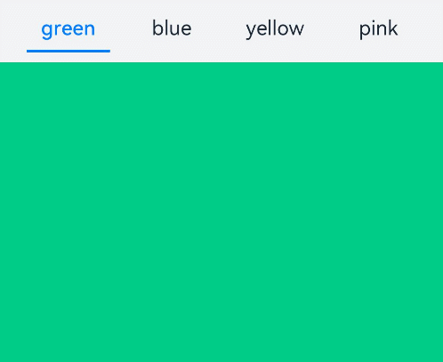

# Tabs

The **\<Tabs>** component is a container component that allows users to switch between content views through tabs. Each tab page corresponds to a content view.

>  **NOTE**
>
>  This component is supported since API version 7. Updates will be marked with a superscript to indicate their earliest API version.


## Child Components

Only the [\<TabContent>](ts-container-tabcontent.md) child component is supported.


## APIs

Tabs(value?: {barPosition?: BarPosition, index?: number, controller?: [TabsController](#tabscontroller)})

**Parameters**

| Name     | Type                         | Mandatory| Description                                                    |
| ----------- | --------------------------------- | ---- | ------------------------------------------------------------ |
| barPosition | BarPosition                       | No  | Position of the **\<Tabs>** component.<br>Default value: **BarPosition.Start**          |
| index       | number                            | No  | Initial tab index.<br>Default value: **0**<br>**NOTE**<br>A value less than 0 evaluates to the default value.<br>The value ranges from 0 to the number of **\<TabContent>** subnodes minus 1.<br>When this parameter is set to different values, the slide animation for tab switching is enabled by default. To disable the animation, set **animationDuration** to **0**.<br>Since API version 10, this parameter supports [$$](../../quick-start/arkts-two-way-sync.md) for two-way binding of variables. |
| controller  | [TabsController](#tabscontroller) | No  | Tab controller.                                            |

## BarPosition

| Name   | Description                                      |
| ----- | ---------------------------------------- |
| Start | If the **vertical** attribute is set to **true**, the tab is on the left of the container. If the **vertical** attribute is set to **false**, the tab is on the top of the container.|
| End   | If the **vertical** attribute is set to **true**, the tab is on the right of the container. If the **vertical** attribute is set to **false**, the tab is at the bottom of the container.|


## Attributes

In addition to the [universal attributes](ts-universal-attributes-size.md), the following attributes are supported.

| Name                      | Type                                    | Description                                      |
| ------------------------ | ---------------------------------------- | ---------------------------------------- |
| vertical                 | boolean                                  | Whether to use vertical tabs. The value **true** means to use vertical tabs, and **false** means to use horizontal tabs.<br>Default value: **false**|
| scrollable               | boolean                                  | Whether the tabs are scrollable. The value **true** means that the tabs are scrollable, and **false** means the opposite.<br>Default value: **true**|
| barMode                  | BarMode                                  | Tab bar layout mode. For details, see **BarMode**.<br>Default value: **BarMode.Fixed**|
| barWidth                 | number \| Length<sup>8+</sup>  | Width of the tab bar.<br>The default value varies.<br>If the tab bar has the **vertical** attribute set to **false** and does not have a style specified, the default value is the width of the **\<Tabs>** component.<br>If the tab bar has the **vertical** attribute set to **true** and does not have a style specified, the default value is **56vp**.<br>If the tab bar has the **vertical** attribute set to **false** and **SubTabbarStyle** specified, the default value is the width of the **\<Tabs>** component.<br>If the tab bar has the **vertical** attribute set to **true** and **SubTabbarStyle** specified, the default value is **56vp**.<br>If the tab bar has the **vertical** attribute set to **true** and **BottomTabbarStyle** specified, the default value is **96vp**.<br>If the tab bar has the **vertical** attribute set to **false** and **BottomTabbarStyle** specified, the default value is the width of the **\<Tabs>** component.<br>**NOTE**<br>A value less than 0 or greater than the width of the **\<Tabs>** component evaluates to the default value.|
| barHeight                | number \| Length<sup>8+</sup>  | Height of the tab bar.<br>The default value varies.<br>If the tab bar has the **vertical** attribute set to **false** and does not have a style specified, the default value is **56vp**.<br>If the tab bar has the **vertical** attribute set to **true** and does not have a style specified, the default value is the height of the **\<Tabs>** component.<br>If the tab bar has the **vertical** attribute set to **false** and **SubTabbarStyle** specified, the default value is **56vp**.<br>If the tab bar has the **vertical** attribute set to **true** and **SubTabbarStyle** specified, the default value is the height of the **\<Tabs>** component.<br>If the tab bar has the **vertical** attribute set to **true** and **BottomTabbarStyle** specified, the default value is the height of the **\<Tabs>** component.<br>If the tab bar has the **vertical** attribute set to **false** and **BottomTabbarStyle** specified, the default value is **56vp**.<br>**NOTE**<br>A value less than 0 or greater than the height of the **\<Tabs>** component evaluates to the default value. |
| animationDuration        | number                                   | Duration of the slide animation for tab switching. If this parameter is set, the tab switching animation is played when the user switches between tabs by sliding or clicking. If this parameter is not set, the tab switching animation is played only when the user switches between tabs by sliding.<br>Default value: **300**<br>**NOTE**<br>A value less than 0 or in percentage evaluates to the default value. |
| divider<sup>10+</sup>    | [DividerStyle](#dividerstyle10) \| null | Whether the divider is displayed for the **\<TabBar>** and **\<TabContent>** components and the divider style. By default, the divider is not displayed.<br> **DividerStyle**: divider style.<br> **null**: The divider is not displayed.|
| fadingEdge<sup>10+</sup> | boolean                                  | Whether the tab fades out when it exceeds the container width.<br>Default value: **true**         |
| barOverlap<sup>10+</sup> | boolean                                  | Whether the tab bar is superimposed on the **\<TabContent>** component after having its background blurred.<br>Default value: **false**         |
| barBackgroundColor<sup>10+</sup> | [ResourceColor](ts-types.md#resourcecolor)           | Background color of the tab bar.<br>Default value: transparent|

## DividerStyle<sup>10+</sup>

| Name         | Type                                    | Mandatory  | Description                                 |
| ----------- | ---------------------------------------- | ---- | ----------------------------------- |
| strokeWidth | [Length](ts-types.md#length)             | Yes   | Width of the divider. It cannot be set in percentage.                            |
| color       | [ResourceColor](ts-types.md#resourcecolor) | No   | Color of the divider.<br>Default value: **#33182431**          |
| startMargin | [Length](ts-types.md#length)             | No   | Distance between the divider and the top of the sidebar. It cannot be set in percentage.<br>Default value: **0.0**<br>Unit: vp|
| endMargin   | [Length](ts-types.md#length)             | No   | Distance between the divider and the bottom of the sidebar. It cannot be set in percentage.<br>Default value: **0.0**<br>Unit: vp|

## BarMode

| Name        | Description                                      |
| ---------- | ---------------------------------------- |
| Scrollable | The width of each tab is determined by the actual layout. The tabs are scrollable in the following case: In horizontal layout, the total width exceeds the tab bar width; in horizontal layout, the total height exceeds the tab bar height.|
| Fixed      | The width of each tab is determined by equally dividing the number of tabs by the bar width (or bar height in the vertical layout).|

## Events

In addition to the [universal events](ts-universal-events-click.md), the following events are supported.

| Name                                      | Description                                    |
| ---------------------------------------- | ---------------------------------------- |
| onChange(event: (index: number) =&gt; void) | Triggered when a tab is switched.<br>- **index**: index of the active tab. The index starts from 0.<br>This event is triggered when any of the following conditions is met:<br>1. The **\<TabContent>** component supports sliding, and the user slides on the tab bar.<br>2. The [Controller](#tabscontroller) API is called.<br>3. The attribute value is updated using a [state variable](../../quick-start/arkts-state.md).<br>4. A tab is clicked.|

## TabsController

Defines a tab controller, which is used to control switching of tabs. One **TabsController** cannot control multiple **\<Tabs>** components.

### Objects to Import

```ts
controller: TabsController = new TabsController()
```

### changeIndex

changeIndex(value: number): void

Switches to the specified tab.

**Parameters**

| Name  | Type  | Mandatory  | Description                                    |
| ----- | ------ | ---- | ---------------------------------------- |
| value | number | Yes   | Index of the tab. The value starts from 0.<br>**NOTE**<br>If this parameter is set to a value less than 0 or greater than the maximum number, the event will be invalid. |


## Example

```ts
// xxx.ets
@Entry
@Component
struct TabsExample {
  @State fontColor: string = '#182431'
  @State selectedFontColor: string = '#007DFF'
  @State currentIndex: number = 0
  private controller: TabsController = new TabsController()

  @Builder TabBuilder(index: number, name: string) {
    Column() {
      Text(name)
        .fontColor(this.currentIndex === index ? this.selectedFontColor : this.fontColor)
        .fontSize(16)
        .fontWeight(this.currentIndex === index ? 500 : 400)
        .lineHeight(22)
        .margin({ top: 17, bottom: 7 })
      Divider()
        .strokeWidth(2)
        .color('#007DFF')
        .opacity(this.currentIndex === index ? 1 : 0)
    }.width('100%')
  }

  build() {
    Column() {
      Tabs({ barPosition: BarPosition.Start, controller: this.controller }) {
        TabContent() {
          Column().width('100%').height('100%').backgroundColor('#00CB87')
        }.tabBar(this.TabBuilder(0, 'green'))

        TabContent() {
          Column().width('100%').height('100%').backgroundColor('#007DFF')
        }.tabBar(this.TabBuilder(1, 'blue'))

        TabContent() {
          Column().width('100%').height('100%').backgroundColor('#FFBF00')
        }.tabBar(this.TabBuilder(2, 'yellow'))

        TabContent() {
          Column().width('100%').height('100%').backgroundColor('#E67C92')
        }.tabBar(this.TabBuilder(3, 'pink'))
      }
      .vertical(false)
      .barMode(BarMode.Fixed)
      .barWidth(360)
      .barHeight(56)
      .animationDuration(400)
      .onChange((index: number) => {
        this.currentIndex = index
      })
      .width(360)
      .height(296)
      .margin({ top: 52 })
      .backgroundColor('#F1F3F5')
    }.width('100%')
  }
}
```


