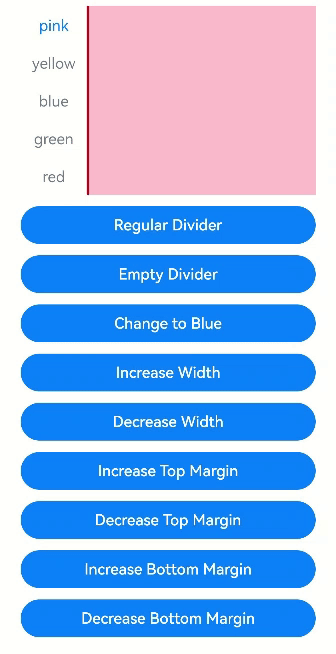
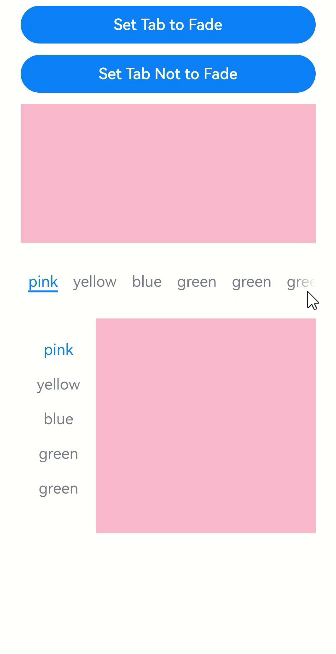
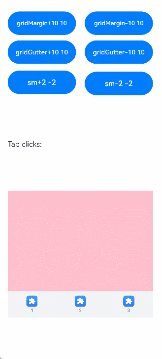
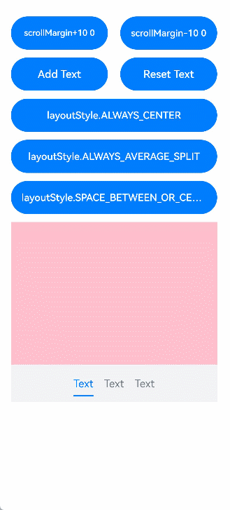

# Tabs

The **\<Tabs>** component is a container component that allows users to switch between content views through tabs. Each tab page corresponds to a content view.

>  **NOTE**
>
>  This component is supported since API version 7. Updates will be marked with a superscript to indicate their earliest API version.


## Child Components

Only the [\<TabContent>](ts-container-tabcontent.md) child component is supported.

>  **NOTE**
>
>  If the child component has the **visibility** attribute set to **None** or **Hidden**, it takes up space in the viewport, but is not displayed.


## APIs

Tabs(value?: {barPosition?: BarPosition, index?: number, controller?: [TabsController](#tabscontroller)})

**Parameters**

| Name        | Type                             | Mandatory  | Description                                    |
| ----------- | --------------------------------- | ---- | ---------------------------------------- |
| barPosition | [BarPosition](#barposition)| No   | Position of the **\<Tabs>** component.<br>Default value: **BarPosition.Start**  |
| index       | number                            | No   | Index of the currently displayed tab.<br>Default value: **0**<br>**NOTE**<br>A value less than 0 evaluates to the default value.<br>The value ranges from 0 to the number of **\<TabContent>** subnodes minus 1.<br>When the tab is switched by changing the index, the tab switching animation does not take effect. When **changeindex** of **TabController** is used for tab switching, the tab switching animation is enabled by default. You can disable the animation by setting **animationDuration** to **0**.<br>Since API version 10, this parameter supports [$$](../../quick-start/arkts-two-way-sync.md) for two-way binding of variables. |
| controller  | [TabsController](#tabscontroller) | No   | Tab controller.                              |

## BarPosition

| Name   | Description                                      |
| ----- | ---------------------------------------- |
| Start | If the **vertical** attribute is set to **true**, the tab is on the left of the container. If the **vertical** attribute is set to **false**, the tab is on the top of the container.|
| End   | If the **vertical** attribute is set to **true**, the tab is on the right of the container. If the **vertical** attribute is set to **false**, the tab is at the bottom of the container.|


## Attributes

In addition to the [universal attributes](ts-universal-attributes-size.md), the following attributes are supported.

| Name                              | Type                                    | Description                                      |
| -------------------------------- | ---------------------------------------- | ---------------------------------------- |
| vertical                         | boolean                                  | Whether to use vertical tabs. The value **true** means to use vertical tabs, and **false** means to use horizontal tabs.<br>Default value: **false**|
| scrollable                       | boolean                                  | Whether the tabs are scrollable. The value **true** means that the tabs are scrollable, and **false** means the opposite.<br>Default value: **true**|
| barMode                          | [BarMode](#barmode),[ScrollableBarModeOptions](#scrollablebarmodeoptions10) | Tab bar layout mode. **BarMode** is mandatory, and **ScrollableBarModeOptions** is optional. For details, see **BarMode** and **ScrollableBarModeOptions**. Since API version 10, the optional **ScrollableBarModeOptions** parameter is supported. It is effective only when the tab bar is in scrollable mode.<br>Default value: **BarMode.Fixed**|
| barWidth                         | number \| Length<sup>8+</sup>  | Width of the tab bar.<br>The default value varies.<br>If the tab bar has the **vertical** attribute set to **false** and does not have [SubTabBarStyle](ts-container-tabcontent.md#subtabbarstyle9) or [BottomTabBarStyle](ts-container-tabcontent.md#bottomtabbarstyle9) specified, the default value is the width of the **\<Tabs>** component.<br>If the tab bar has the **vertical** attribute set to **true** and does not have **SubTabBarStyle** or **BottomTabBarStyle** specified, the default value is **56vp**.<br>If the tab bar has the **vertical** attribute set to **false** and **SubTabbarStyle** specified, the default value is the width of the **\<Tabs>** component.<br>If the tab bar has the **vertical** attribute set to **true** and **SubTabbarStyle** specified, the default value is **56vp**.<br>If the tab bar has the **vertical** attribute set to **true** and **BottomTabbarStyle** specified, the default value is **96vp**.<br>If the tab bar has the **vertical** attribute set to **false** and **BottomTabbarStyle** specified, the default value is the width of the **\<Tabs>** component.<br>**NOTE**<br>A value less than 0 or greater than the width of the **\<Tabs>** component evaluates to the default value. |
| barHeight                        | number \| Length<sup>8+</sup>  | Height of the tab bar.<br>The default value varies.<br>If the tab bar has the **vertical** attribute set to **false** and does not have a style specified, the default value is **56vp**.<br>If the tab bar has the **vertical** attribute set to **true** and does not have a style specified, the default value is the height of the **\<Tabs>** component.<br>If the tab bar has the **vertical** attribute set to **false** and **SubTabbarStyle** specified, the default value is **56vp**.<br>If the tab bar has the **vertical** attribute set to **true** and **SubTabbarStyle** specified, the default value is the height of the **\<Tabs>** component.<br>If the tab bar has the **vertical** attribute set to **true** and **BottomTabbarStyle** specified, the default value is the height of the **\<Tabs>** component.<br>If the tab bar has the **vertical** attribute set to **false** and **BottomTabbarStyle** specified, the default value is **56vp**.<br>**NOTE**<br>A value less than 0 or greater than the height of the **\<Tabs>** component evaluates to the default value. |
| animationDuration                | number                                   | Length of time required to complete the tab switching animation that is initiated by clicking a specific tab.<br>The default value varies.<br>API version 10 and earlier versions: If this parameter is not set, the default value 0 ms is used, which means that no tab switching animation is displayed when a specific tab is clicked. If this parameter is set to a value less than 0, the default value 300 ms is used.<br>API version 11 and later versions: If this parameter is set to a value less than 0 or is not set, and the tab bar is set to **BottomTabBarStyle**, the default value 0 ms is used. If the tab bar is set to other styles, the default value 300 ms is used.<br>**NOTE**<br>This parameter cannot be set in percentage. |
| divider<sup>10+</sup>            | [DividerStyle](#dividerstyle10) \| null | Whether the divider is displayed for the **\<TabBar>** and **\<TabContent>** components and the divider style. By default, the divider is not displayed.<br> **DividerStyle**: divider style.<br> **null**: The divider is not displayed.|
| fadingEdge<sup>10+</sup>         | boolean                                  | Whether the tab fades out when it exceeds the container width.<br>Default value: **true**        |
| barOverlap<sup>10+</sup>         | boolean                                  | Whether the tab bar is superimposed on the **\<TabContent>** component after having its background blurred.<br>Default value: **false**|
| barBackgroundColor<sup>10+</sup> | [ResourceColor](ts-types.md#resourcecolor) | Background color of the tab bar.<br>Default value: transparent              |
| barGridAlign<sup>10+</sup> | [BarGridColumnOptions](#bargridcolumnoptions10) | Visible area of the tab bar in grid mode. For details, see **BarGridColumnOptions**. This attribute is effective only in horizontal mode. It is not applicable to [XS, XL, and XXL devices](../../ui/arkts-layout-development-grid-layout.md#grid-breakpoints).             |

## DividerStyle<sup>10+</sup>

| Name         | Type                                    | Mandatory  | Description                                      |
| ----------- | ---------------------------------------- | ---- | ---------------------------------------- |
| strokeWidth | [Length](ts-types.md#length)             | Yes   | Width of the divider. It cannot be set in percentage.                       |
| color       | [ResourceColor](ts-types.md#resourcecolor) | No   | Color of the divider.<br>Default value: **#33182431**               |
| startMargin | [Length](ts-types.md#length)             | No   | Distance between the divider and the top of the sidebar. It cannot be set in percentage.<br>Default value: **0.0**<br>Unit: vp|
| endMargin   | [Length](ts-types.md#length)             | No   | Distance between the divider and the bottom of the sidebar. It cannot be set in percentage.<br>Default value: **0.0**<br>Unit: vp|

## BarGridColumnOptions<sup>10+</sup>

| Name         | Type                                    | Mandatory  | Description                                      |
| ----------- | ---------------------------------------- | ---- | ---------------------------------------- |
| margin | [Dimension](ts-types.md#dimension10)             | No   | Column margin in grid mode. It cannot be set in percentage.<br>Default value: **24.0**<br>Unit: vp                       |
| gutter      | [Dimension](ts-types.md#dimension10) | No   | Column gutter (that is, gap between columns) in grid mode. It cannot be set in percentage.<br>Default value: **24.0**<br>Unit: vp                    |
| sm | number            | No   | Number of columns occupied by a tab on a screen whose width is greater than or equal to 320 vp but less than 600 vp.<br>The value must be a non-negative even number. The default value is **-1**, indicating that the tab takes up the entire width of the tab bar.|
| md   | number          | No   | Number of columns occupied by a tab on a screen whose width is greater than or equal to 600 vp but less than 800 vp.<br>The value must be a non-negative even number. The default value is **-1**, indicating that the tab takes up the entire width of the tab bar.|
| lg   | number           | No   | Number of columns occupied by a tab on a screen whose width is greater than or equal to 840 vp but less than 1024 vp.<br>The value must be a non-negative even number. The default value is **-1**, indicating that the tab takes up the entire width of the tab bar.|

## ScrollableBarModeOptions<sup>10+</sup>

| Name         | Type                                    | Mandatory  | Description                                      |
| ----------- | ---------------------------------------- | ---- | ---------------------------------------- |
| margin | [Dimension](ts-types.md#dimension10)          | No   | Left and right margin of the tab bar in scrollable mode. It cannot be set in percentage.<br>Default value: **0.0**<br>Unit: vp                   |
| nonScrollableLayoutStyle      | [LayoutStyle](#layoutstyle10) | No   | Tab layout mode of the tab bar when not scrolling in scrollable mode.<br>Default value: **LayoutStyle.ALWAYS_CENTER**          |

## BarMode

| Name        | Description                                      |
| ---------- | ---------------------------------------- |
| Scrollable | The width of each tab is determined by the actual layout. The tabs are scrollable in the following case: In horizontal layout, the total width exceeds the tab bar width; in horizontal layout, the total height exceeds the tab bar height.|
| Fixed      | The width of each tab is determined by equally dividing the number of tabs by the bar width (or bar height in the vertical layout).|

## LayoutStyle<sup>10+</sup>

| Name        | Description                                      |
| ---------- | ---------------------------------------- |
| ALWAYS_CENTER | When the tab content exceeds the tab bar width, the tabs are scrollable.<br>Otherwise, the tabs are compactly centered and not scrollable.|
| ALWAYS_AVERAGE_SPLITE      | When the tab content exceeds the tab bar width, the tabs are scrollable.<br>Otherwise, the tabs are not scrollable, and the tab bar width is distributed evenly between all tabs.<br>This option is valid only in horizontal mode, and is equivalent to **LayoutStyle.ALWAYS_CENTER** otherwise.|
| SPACE_BETWEEN_OR_CENTER      | When the tab content exceeds the tab bar width, the tabs are scrollable.<br>When the tab content exceeds half of the tab bar width but still within the tab bar width, the tabs are compactly centered and not scrollable.<br>When the tab content does not exceed half of the tab bar width, the tabs are centered within half of the tab bar width, with even spacing between, and not scrollable.|

## Events

In addition to the [universal events](ts-universal-events-click.md), the following events are supported.

| Name                                      | Description                                    |
| ---------------------------------------- | ---------------------------------------- |
| onChange(event: (index: number) =&gt; void) | Triggered when a tab is switched.<br>- **index**: index of the active tab. The index starts from 0.<br>This event is triggered when any of the following conditions is met:<br>1. The **\<TabContent>** component supports sliding, and the user slides on the tab bar.<br>2. The [Controller](#tabscontroller) API is called.<br>3. The attribute value is updated using a [state variable](../../quick-start/arkts-state.md).<br>4. A tab is clicked.|
| onTabBarClick(event: (index: number) =&gt; void)<sup>10+</sup> | Triggered when a tab is clicked.<br>- **index**: index of the clicked tab. The index starts from 0.<br>This event is triggered when any of the following conditions is met:<br>A tab is clicked.|
| onAnimationStart<sup>11+</sup>(handler: (index: number, targetIndex: number, event: [TabsAnimationEvent](ts-types.md#tabsanimationevent11)) => void) | Triggered when the tab switching animation starts.<br>- **index**: index of the currently displayed element.<br>- **targetIndex**: index of the target element to switch to.<br>- **event**: animation-related information, including the offset of the currently displayed element and target element relative to the start position of the **\<Tabs>** along the main axis, and the hands-off velocity.<br>**NOTE**<br>The **index** parameter indicates the index before the animation starts (not the one after).|
| onAnimationEnd<sup>11+</sup>(handler: (index: number, event: [TabsAnimationEvent](ts-types.md#tabsanimationevent11)) => void) | Triggered when the tab switching animation ends.<br>- **index**: index of the currently displayed element.<br>- **event**: animation-related information, including the offset of the currently displayed element relative to the start position of the **\<Tabs>** along the main axis.<br>**NOTE**<br>This event is triggered when the tab switching animation ends, whether it is caused by gesture interruption or not. The **index** parameter indicates the index after the animation ends.|
| onGestureSwipe<sup>11+</sup>(handler: (index: number, event: [TabsAnimationEvent](ts-types.md#tabsanimationevent11)) => void) | Triggered on a frame-by-frame basis when the tab is switched by a swipe.<br>- **index**: index of the currently displayed element.<br>- **event**: animation-related information, including the offset of the currently displayed element relative to the start position of the **\<Tabs>** along the main axis.|
| customContentTransition<sup>11+</sup>(delegate: (from: number, to: number) => [TabContentAnimatedTransition](ts-types.md#tabcontentanimatedtransition11) \| undefined) | Custom tab switching animation. **from** and **to** indicate the return values.<br> - **from**: index of the currently displayed tab before the animation starts.<br>- **to**: index of the target tab before the animation starts.<br> Instructions:<br>  1. When the custom tab switching animation is used, the default switching animation of the **\<Tabs>** component is disabled, and tabs cannot be switched through swiping.<br> 2. The value **undefined** means not to use the custom tab switching animation, in which case the default switching animation is used.<br> 3. The custom tab switching animation cannot be interrupted.<br> 4. Currently, the custom tab switching animation can be triggered only by clicking a tab or by calling the **TabsController.changeIndex()** API.<br> 5. When the custom tab switching animation is used, the **\<Tabs>** component supports all events except **onGestureSwipe**.<br> 6. Notes about the **onChange** and **onAnimationEnd** events: If the second custom animation is triggered during the execution of the first custom animation, the **onChange** and **onAnimationEnd** events of the first custom animation will be triggered when the second custom animation starts.<br> 7. When the custom animation is used, the stack layout is used for pages involved in the animation. If the **zIndex** attribute is not set for related pages, the **zIndex** values of all pages are the same. In this case, the pages are rendered in the order in which they are added to the component tree (that is, the sequence of page indexes). In light of this, to control the rendering levels of pages, set the **zIndex** attribute of the pages.<br>|

## TabsController

Defines a tab controller, which is used to control switching of tabs. One **TabsController** cannot control multiple **\<Tabs>** components.

### Objects to Import

```ts
let controller: TabsController = new TabsController()
```

### changeIndex

changeIndex(value: number): void

Switches to the specified tab.

**Parameters**

| Name  | Type  | Mandatory  | Description                                    |
| ----- | ------ | ---- | ---------------------------------------- |
| value | number | Yes   | Index of the tab. The value starts from 0.<br>**NOTE**<br>If this parameter is set to a value less than 0 or greater than the maximum number, the default value **0** is used.|


## Example

### Example 1

```ts
// xxx.ets
@Entry
@Component
struct TabsExample {
  @State fontColor: string = '#182431'
  @State selectedFontColor: string = '#007DFF'
  @State currentIndex: number = 0
  private controller: TabsController = new TabsController()

  @Builder TabBuilder(index: number, name: string) {
    Column() {
      Text(name)
        .fontColor(this.currentIndex === index ? this.selectedFontColor : this.fontColor)
        .fontSize(16)
        .fontWeight(this.currentIndex === index ? 500 : 400)
        .lineHeight(22)
        .margin({ top: 17, bottom: 7 })
      Divider()
        .strokeWidth(2)
        .color('#007DFF')
        .opacity(this.currentIndex === index ? 1 : 0)
    }.width('100%')
  }

  build() {
    Column() {
      Tabs({ barPosition: BarPosition.Start, controller: this.controller }) {
        TabContent() {
          Column().width('100%').height('100%').backgroundColor('#00CB87')
        }.tabBar(this.TabBuilder(0, 'green'))

        TabContent() {
          Column().width('100%').height('100%').backgroundColor('#007DFF')
        }.tabBar(this.TabBuilder(1, 'blue'))

        TabContent() {
          Column().width('100%').height('100%').backgroundColor('#FFBF00')
        }.tabBar(this.TabBuilder(2, 'yellow'))

        TabContent() {
          Column().width('100%').height('100%').backgroundColor('#E67C92')
        }.tabBar(this.TabBuilder(3, 'pink'))
      }
      .vertical(false)
      .barMode(BarMode.Fixed)
      .barWidth(360)
      .barHeight(56)
      .animationDuration(400)
      .onChange((index: number) => {
        this.currentIndex = index
      })
      .width(360)
      .height(296)
      .margin({ top: 52 })
      .backgroundColor('#F1F3F5')
    }.width('100%')
  }
}
```


### Example 2

```ts
// xxx.ets
@Entry
@Component
struct TabsDivider1 {
  private controller1: TabsController = new TabsController()
  @State dividerColor: string = 'red'
  @State strokeWidth: number = 2
  @State startMargin: number = 0
  @State endMargin: number = 0
  @State nullFlag: boolean = false

  build() {
    Column() {
      Tabs({ controller: this.controller1 }) {
        TabContent() {
          Column().width('100%').height('100%').backgroundColor(Color.Pink)
        }.tabBar('pink')

        TabContent() {
          Column().width('100%').height('100%').backgroundColor(Color.Yellow)
        }.tabBar('yellow')

        TabContent() {
          Column().width('100%').height('100%').backgroundColor(Color.Blue)
        }.tabBar('blue')

        TabContent() {
          Column().width('100%').height('100%').backgroundColor(Color.Green)
        }.tabBar('green')

        TabContent() {
          Column().width('100%').height('100%').backgroundColor(Color.Red)
        }.tabBar('red')
      }
      .vertical(true)
      .scrollable(true)
      .barMode(BarMode.Fixed)
      .barWidth(70)
      .barHeight(200)
      .animationDuration(400)
      .onChange((index: number) => {
        console.info(index.toString())
      })
      .height('200vp')
      .margin({ bottom: '12vp' })
      .divider(this.nullFlag ? null : {
        strokeWidth: this.strokeWidth,
        color: this.dividerColor,
        startMargin: this.startMargin,
        endMargin: this.endMargin
      })

      Button ('Regular Divider').width('100%').margin({ bottom: '12vp'})
        .onClick(() => {
          this.nullFlag = false;
          this.strokeWidth = 2;
          this.dividerColor = 'red';
          this.startMargin = 0;
          this.endMargin = 0;
        })
      Button('Empty Divider').width('100%').margin({ bottom: '12vp' })
        .onClick(() => {
          this.nullFlag = true
        })
      Button('Change to Blue').width('100%').margin({ bottom: '12vp'})
        .onClick(() => {
          this.dividerColor = 'blue'
        })
      Button('Increase Width').width('100%').margin({ bottom: '12vp' })
        .onClick(() => {
          this.strokeWidth += 2
        })
      Button('Decrease Width').width('100%').margin({ bottom: '12vp'})
        .onClick(() => {
          if (this.strokeWidth > 2) {
            this.strokeWidth -= 2
          }
        })
      Button ('Increase Top Margin').width ('100%').margin ({ bottom:'12vp'})
        .onClick(() => {
          this.startMargin += 2
        })
      Button ('Decrease Top Margin').width ('100%').margin ({ bottom:'12vp' })
        .onClick(() => {
          if (this.startMargin > 2) {
            this.startMargin -= 2
          }
        })
      Button ('Increase Bottom Margin').width ('100%').margin ({ bottom:'12vp'})
        .onClick(() => {
          this.endMargin += 2
        })
      Button ('Decrease Bottom Margin').width ('100%').margin ({ bottom:'12vp' })
        .onClick(() => {
          if (this.endMargin > 2) {
            this.endMargin -= 2
          }
        })
    }.padding({ top: '24vp', left: '24vp', right: '24vp' })
  }
}
```



### Example 3

```ts
// xxx.ets
@Entry
@Component
struct TabsOpaque {
  @State message: string = 'Hello World'
  private controller: TabsController = new TabsController()
  private controller1: TabsController = new TabsController()
  @State selfFadingFade: boolean = true;

  build() {
    Column() {
      Button (Set Tab to Fade').width ('100%').margin ({bottom: '12vp'})
        .onClick((event?: ClickEvent) => {
          this.selfFadingFade = true;
        })
      Button (Set Tab Not to Fade').width ('100%').margin ({bottom: '12vp'})
        .onClick((event?: ClickEvent) => {
          this.selfFadingFade = false;
        })
      Tabs({ barPosition: BarPosition.End, controller: this.controller }) {
        TabContent() {
          Column().width('100%').height('100%').backgroundColor(Color.Pink)
        }.tabBar('pink')

        TabContent() {
          Column().width('100%').height('100%').backgroundColor(Color.Yellow)
        }.tabBar('yellow')

        TabContent() {
          Column().width('100%').height('100%').backgroundColor(Color.Blue)
        }.tabBar('blue')

        TabContent() {
          Column().width('100%').height('100%').backgroundColor(Color.Green)
        }.tabBar('green')

        TabContent() {
          Column().width('100%').height('100%').backgroundColor(Color.Green)
        }.tabBar('green')

        TabContent() {
          Column().width('100%').height('100%').backgroundColor(Color.Green)
        }.tabBar('green')

        TabContent() {
          Column().width('100%').height('100%').backgroundColor(Color.Green)
        }.tabBar('green')

        TabContent() {
          Column().width('100%').height('100%').backgroundColor(Color.Green)
        }.tabBar('green')
      }
      .vertical(false)
      .scrollable(true)
      .barMode(BarMode.Scrollable)
      .barHeight(80)
      .animationDuration(400)
      .onChange((index: number) => {
        console.info(index.toString())
      })
      .fadingEdge(this.selfFadingFade)
      .height('30%')
      .width('100%')

      Tabs({ barPosition: BarPosition.Start, controller: this.controller1 }) {
        TabContent() {
          Column().width('100%').height('100%').backgroundColor(Color.Pink)
        }.tabBar('pink')

        TabContent() {
          Column().width('100%').height('100%').backgroundColor(Color.Yellow)
        }.tabBar('yellow')

        TabContent() {
          Column().width('100%').height('100%').backgroundColor(Color.Blue)
        }.tabBar('blue')

        TabContent() {
          Column().width('100%').height('100%').backgroundColor(Color.Green)
        }.tabBar('green')

        TabContent() {
          Column().width('100%').height('100%').backgroundColor(Color.Green)
        }.tabBar('green')

        TabContent() {
          Column().width('100%').height('100%').backgroundColor(Color.Green)
        }.tabBar('green')
      }
      .vertical(true)
      .scrollable(true)
      .barMode(BarMode.Scrollable)
      .barHeight(200)
      .barWidth(80)
      .animationDuration(400)
      .onChange((index: number) => {
        console.info(index.toString())
      })
      .fadingEdge(this.selfFadingFade)
      .height('30%')
      .width('100%')
    }
    .padding({ top: '24vp', left: '24vp', right: '24vp' })
  }
}
```



### Example 4

```ts
// xxx.ets
@Entry
@Component
struct barBackgroundColorTest {
  private controller: TabsController = new TabsController()
  @State barOverlap: boolean = true;
  @State barBackgroundColor: string = '#88888888';

  build() {
    Column() {
      Button ("Change barOverlap").width ('100%').margin ({ bottom:'12vp'})
        .onClick((event?: ClickEvent) => {
          if (this.barOverlap) {
            this.barOverlap = false;
          } else {
            this.barOverlap = true;
          }
        })

      Tabs({ barPosition: BarPosition.Start, index: 0, controller: this.controller }) {
        TabContent() {
          Column() {
            Text(`barOverlap ${this.barOverlap}`).fontSize(16).margin({ top: this.barOverlap ? '56vp' : 0 })
            Text(`barBackgroundColor ${this.barBackgroundColor}`).fontSize(16)
          }.width('100%').width('100%').height('100%')
          .backgroundColor(Color.Pink)
        }
        .tabBar(new BottomTabBarStyle($r('sys.media.ohos_app_icon'), "1"))

        TabContent() {
          Column() {
            Text(`barOverlap ${this.barOverlap}`).fontSize(16).margin({ top: this.barOverlap ? '56vp' : 0 })
            Text(`barBackgroundColor ${this.barBackgroundColor}`).fontSize(16)
          }.width('100%').width('100%').height('100%')
          .backgroundColor(Color.Yellow)
        }
        .tabBar(new BottomTabBarStyle($r('sys.media.ohos_app_icon'), "2"))

        TabContent() {
          Column() {
            Text(`barOverlap ${this.barOverlap}`).fontSize(16).margin({ top: this.barOverlap ? '56vp' : 0 })
            Text(`barBackgroundColor ${this.barBackgroundColor}`).fontSize(16)
          }.width('100%').width('100%').height('100%')
          .backgroundColor(Color.Green)
        }
        .tabBar(new BottomTabBarStyle($r('sys.media.ohos_app_icon'), "3"))
      }
      .vertical(false)
      .barMode(BarMode.Fixed)
      .height('60%')
      .barOverlap(this.barOverlap)
      .scrollable(true)
      .animationDuration(10)
      .barBackgroundColor(this.barBackgroundColor)
    }
    .height(500)
    .padding({ top: '24vp', left: '24vp', right: '24vp' })
  }
}
```


### Example 5

```ts
// xxx.ets
@Entry
@Component
struct TabsExample5 {
  private controller: TabsController = new TabsController()
  @State gridMargin: number = 10
  @State gridGutter: number = 10
  @State sm: number = -2
  @State clickedContent: string = "";

  build() {
    Column() {
      Row() {
        Button("gridMargin+10 " + this.gridMargin)
          .width('47%')
          .height(50)
          .margin({ top: 5 })
          .onClick((event?: ClickEvent) => {
            this.gridMargin += 10
          })
          .margin({ right: '6%', bottom: '12vp' })
        Button("gridMargin-10 " + this.gridMargin)
          .width('47%')
          .height(50)
          .margin({ top: 5 })
          .onClick((event?: ClickEvent) => {
            this.gridMargin -= 10
          })
          .margin({ bottom: '12vp' })
      }

      Row() {
        Button("gridGutter+10 " + this.gridGutter)
          .width('47%')
          .height(50)
          .margin({ top: 5 })
          .onClick((event?: ClickEvent) => {
            this.gridGutter += 10
          })
          .margin({ right: '6%', bottom: '12vp' })
        Button("gridGutter-10 " + this.gridGutter)
          .width('47%')
          .height(50)
          .margin({ top: 5 })
          .onClick((event?: ClickEvent) => {
            this.gridGutter -= 10
          })
          .margin({ bottom: '12vp' })
      }

      Row() {
        Button("sm+2 " + this.sm)
          .width('47%')
          .height(50)
          .margin({ top: 5 })
          .onClick((event?: ClickEvent) => {
            this.sm += 2
          })
          .margin({ right: '6%' })
        Button("sm-2 " + this.sm).width('47%').height(50).margin({ top: 5 })
          .onClick((event?: ClickEvent) => {
            this.sm -= 2
          })
      }

      Text ("Tab clicks: "+ this.clickedContent).width ('100%').height (200).margin ({ top: 5 })


      Tabs({ barPosition: BarPosition.End, controller: this.controller }) {
        TabContent() {
          Column().width('100%').height('100%').backgroundColor(Color.Pink)
        }.tabBar(BottomTabBarStyle.of($r("sys.media.ohos_app_icon"), "1"))

        TabContent() {
          Column().width('100%').height('100%').backgroundColor(Color.Green)
        }.tabBar(BottomTabBarStyle.of($r("sys.media.ohos_app_icon"), "2"))

        TabContent() {
          Column().width('100%').height('100%').backgroundColor(Color.Blue)
        }.tabBar(BottomTabBarStyle.of($r("sys.media.ohos_app_icon"), "3"))
      }
      .width('350vp')
      .animationDuration(300)
      .height('60%')
      .barGridAlign({ sm: this.sm, margin: this.gridMargin, gutter: this.gridGutter })
      .backgroundColor(0xf1f3f5)
      .onTabBarClick((index: number) => {
        this.clickedContent += "index " + index + " was clicked\n";
      })
    }
    .width('100%')
    .height(500)
    .margin({ top: 5 })
    .padding('10vp')
  }
}
```



### Example 6

```ts
// xxx.ets
@Entry
@Component
struct TabsExample6 {
  private controller: TabsController = new TabsController()
  @State scrollMargin: number = 0
  @State layoutStyle: LayoutStyle = LayoutStyle.ALWAYS_CENTER
  @State text: string = "Text"

  build() {
    Column() {
      Row() {
        Button("scrollMargin+10 " + this.scrollMargin)
          .width('47%')
          .height(50)
          .margin({ top: 5 })
          .onClick((event?: ClickEvent) => {
            this.scrollMargin += 10
          })
          .margin({ right: '6%', bottom: '12vp' })
        Button("scrollMargin-10 " + this.scrollMargin)
          .width('47%')
          .height(50)
          .margin({ top: 5 })
          .onClick((event?: ClickEvent) => {
            this.scrollMargin -= 10
          })
          .margin({ bottom: '12vp' })
      }

      Row() {
        Button ("Add Text")
          .width('47%')
          .height(50)
          .margin({ top: 5 })
          .onClick((event?: ClickEvent) => {
            this.text += 'Add Text'
          })
          .margin({ right: '6%', bottom: '12vp' })
        Button ("Reset Text")
          .width('47%')
          .height(50)
          .margin({ top: 5 })
          .onClick((event?: ClickEvent) => {
            this.text = "Text"
          })
          .margin({ bottom: '12vp' })
      }

      Row() {
        Button("layoutStyle.ALWAYS_CENTER")
          .width('100%')
          .height(50)
          .margin({ top: 5 })
          .fontSize(15)
          .onClick((event?: ClickEvent) => {
            this.layoutStyle = LayoutStyle.ALWAYS_CENTER;
          })
          .margin({ bottom: '12vp' })
      }

      Row() {
        Button("layoutStyle.ALWAYS_AVERAGE_SPLIT")
          .width('100%')
          .height(50)
          .margin({ top: 5 })
          .fontSize(15)
          .onClick((event?: ClickEvent) => {
            this.layoutStyle = LayoutStyle.ALWAYS_AVERAGE_SPLIT;
          })
          .margin({ bottom: '12vp' })
      }

      Row() {
        Button("layoutStyle.SPACE_BETWEEN_OR_CENTER")
          .width('100%')
          .height(50)
          .margin({ top: 5 })
          .fontSize(15)
          .onClick((event?: ClickEvent) => {
            this.layoutStyle = LayoutStyle.SPACE_BETWEEN_OR_CENTER;
          })
          .margin({ bottom: '12vp' })
      }

      Tabs({ barPosition: BarPosition.End, controller: this.controller }) {
        TabContent() {
          Column().width('100%').height('100%').backgroundColor(Color.Pink)
        }.tabBar(SubTabBarStyle.of(this.text))

        TabContent() {
          Column().width('100%').height('100%').backgroundColor(Color.Green)
        }.tabBar(SubTabBarStyle.of(this.text))

        TabContent() {
          Column().width('100%').height('100%').backgroundColor(Color.Blue)
        }.tabBar(SubTabBarStyle.of(this.text))
      }
      .animationDuration(300)
      .height('60%')
      .backgroundColor(0xf1f3f5)
      .barMode(BarMode.Scrollable, { margin: this.scrollMargin, nonScrollableLayoutStyle: this.layoutStyle })
    }
    .width('100%')
    .height(500)
    .margin({ top: 5 })
    .padding('24vp')
  }
}
```



### Example 7

```ts
// xxx.ets
@Entry
@Component
struct TabsCustomAnimationExample {
  @State useCustomAnimation: boolean = true
  @State tabContent0Scale: number = 1.0
  @State tabContent1Scale: number = 1.0
  @State tabContent0Opacity: number = 1.0
  @State tabContent1Opacity: number = 1.0
  @State tabContent2Opacity: number = 1.0
  tabsController: TabsController = new TabsController()
  private firstTimeout: number = 3000
  private secondTimeout: number = 5000
  private first2secondDuration: number = 3000
  private second2thirdDuration: number = 5000
  private first2thirdDuration: number = 2000
  private baseCustomAnimation: (from: number, to: number) => TabContentAnimatedTransition = (from: number, to: number) => {
    if ((from === 0 && to === 1) || (from === 1 && to === 0)) {
      // Scale animation
      let firstCustomTransition = {
        timeout: this.firstTimeout,
        transition: (proxy: TabContentTransitionProxy) => {
          if (proxy.from === 0 && proxy.to === 1) {
            this.tabContent0Scale = 1.0
            this.tabContent1Scale = 0.5
          } else {
            this.tabContent0Scale = 0.5
            this.tabContent1Scale = 1.0
          }

          animateTo({
            duration: this.first2secondDuration,
            onFinish: () => {
              proxy.finishTransition()
            }
          }, () => {
            if (proxy.from === 0 && proxy.to === 1) {
              this.tabContent0Scale = 0.5
              this.tabContent1Scale = 1.0
            } else {
              this.tabContent0Scale = 1.0
              this.tabContent1Scale = 0.5
            }
          })
        }
      } as TabContentAnimatedTransition;
      return firstCustomTransition;
    } else {
      // Opacity animation
      let secondCustomTransition = {
        timeout: this.secondTimeout,
        transition: (proxy: TabContentTransitionProxy) => {
          if ((proxy.from === 1 && proxy.to === 2) || (proxy.from === 2 && proxy.to === 1)) {
            if (proxy.from === 1 && proxy.to === 2) {
              this.tabContent1Opacity = 1.0
              this.tabContent2Opacity = 0.5
            } else {
              this.tabContent1Opacity = 0.5
              this.tabContent2Opacity = 1.0
            }
            animateTo({
              duration: this.second2thirdDuration,
              onFinish: () => {
                proxy.finishTransition()
              }
            }, () => {
              if (proxy.from === 1 && proxy.to === 2) {
                this.tabContent1Opacity = 0.5
                this.tabContent2Opacity = 1.0
              } else {
                this.tabContent1Opacity = 1.0
                this.tabContent2Opacity = 0.5
              }
            })
          } else if ((proxy.from === 0 && proxy.to === 2) || (proxy.from === 2 && proxy.to === 0)) {
            if (proxy.from === 0 && proxy.to === 2) {
              this.tabContent0Opacity = 1.0
              this.tabContent2Opacity = 0.5
            } else {
              this.tabContent0Opacity = 0.5
              this.tabContent2Opacity = 1.0
            }
            animateTo({
              duration: this.first2thirdDuration,
              onFinish: () => {
                proxy.finishTransition()
              }
            }, () => {
              if (proxy.from === 0 && proxy.to === 2) {
                this.tabContent0Opacity = 0.5
                this.tabContent2Opacity = 1.0
              } else {
                this.tabContent0Opacity = 1.0
                this.tabContent2Opacity = 0.5
              }
            })
          }
        }
      } as TabContentAnimatedTransition;
      return secondCustomTransition;
    }
  }

  build() {
    Column() {
      Tabs({ controller: this.tabsController }) {
        TabContent() {
          Text("Red")
        }
        .tabBar("Red")
        .scale({ x: this.tabContent0Scale, y: this.tabContent0Scale })
        .backgroundColor(Color.Red)
        .opacity(this.tabContent0Opacity)
        .width(100)
        .height(100)

        TabContent() {
          Text("Yellow")
        }
        .tabBar("Yellow")
        .scale({ x: this.tabContent1Scale, y: this.tabContent1Scale })
        .backgroundColor(Color.Yellow)
        .opacity(this.tabContent1Opacity)
        .width(200)
        .height(200)

        TabContent() {
          Text("Blue")
        }
        .tabBar("Blue")
        .backgroundColor(Color.Blue)
        .opacity(this.tabContent2Opacity)
        .width(300)
        .height(300)

      }
      .backgroundColor(0xf1f3f5)
      .width('100%')
      .height(500)
      .margin({ top: 5 })
      .customContentTransition(this.useCustomAnimation ? this.baseCustomAnimation : undefined)
      .barMode(BarMode.Scrollable)
      .onChange((index: number) => {
        console.info("onChange index: " + index)
      })
      .onTabBarClick((index: number) => {
        console.info("onTabBarClick index: " + index)
      })
    }
  }
}
```


