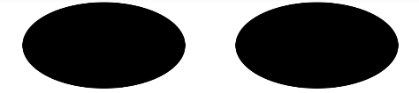

# Ellipse


> **NOTE**<br>
> This component is supported since API version 7. Updates will be marked with a superscript to indicate their earliest API version.


The **&lt;Ellipse&gt;** component is used to draw an ellipse.


## Required Permissions

None


## Child Components

None


## APIs

ellipse(options?: {width: Length, height: Length})

- Parameters
  | Name | Type | Mandatory | Default Value | Description | 
  | -------- | -------- | -------- | -------- | -------- |
  | options | Object | No | - | For details, see the **options** parameters. | 

- options parameters
  | Name | Type | Mandatory | Default Value | Description | 
  | -------- | -------- | -------- | -------- | -------- |
  | width | Length | Yes | - | Width. | 
  | height | Length | Yes | - | Height. | 


## Attributes

| Name | Type | Default Value | Mandatory | Description | 
| -------- | -------- | -------- | -------- | -------- |
| width | Length | 0 | No | Width of the rectangle where the ellipse is located. | 
| height | Length | 0 | No | Height of the rectangle where the ellipse is located. | 


## Example

  
```ts
@Entry
@Component
struct EllipseExample {
  build() {
    Flex({ justifyContent: FlexAlign.SpaceAround }) {
      // Draw an ellipse in a 150 x 70 rectangle.
      Ellipse({ width: 150, height: 80 })
      // Draw an ellipse in a 150 x 70 rectangle.
      Ellipse().width(150).height(80)
    }.width('100%').margin({ top: 5 })
  }
}
```

