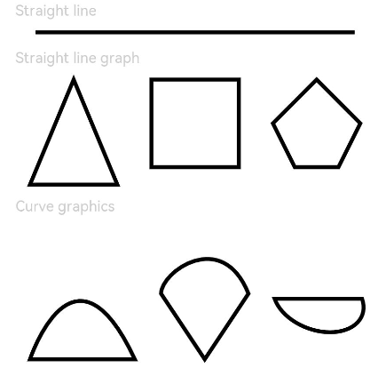

# Path

The **<Path\>** component is used to define a closed shape.

> **NOTE**
>
> This component is supported since API version 7. Updates will be marked with a superscript to indicate their earliest API version.


## Child Components

Not supported

## APIs

Path(value?: { width?: number | string; height?: number | string; commands?: string })

Since API version 9, this API is supported in ArkTS widgets.

**Parameters**

| Name  | Type        | Mandatory| Description                           |
| -------- | ---------------- | ---- | ----------------------------------- |
| width    | number \| string | No  | Width of the rectangle where the path is located.<br>Default value: **0**   |
| height   | number \| string | No  | Height of the rectangle where the path is located.<br>Default value: **0**   |
| commands | string           | No  | Command for drawing the path.<br>Default value: **''**|

## Attributes

In addition to the [universal attributes](ts-universal-attributes-size.md), the following attributes are supported.

| Name    | Type                               | Default Value | Description                                    |
| -------- | ----------------------------------- | ---- | ---------------------------------------- |
| commands | string                              | ''   | Command for drawing the path. The unit is px. For details about how to convert pixel units, see [Pixel Units](ts-pixel-units.md).<br>Since API version 9, this API is supported in ArkTS widgets.|
| fill | [ResourceColor](ts-types.md) | Color.Black | Color of the fill area.<br>Since API version 9, this API is supported in ArkTS widgets.|
| fillOpacity | number \| string \| [Resource](ts-types.md#resource)| 1 | Opacity of the fill area.<br>Since API version 9, this API is supported in ArkTS widgets.|
| stroke | [ResourceColor](ts-types.md) | - |Stroke color. If this attribute is not set, the component does not have any stroke.<br>Since API version 9, this API is supported in ArkTS widgets.|
| strokeDashArray | Array&lt;Length&gt; | [] | Stroke dashes.<br>Since API version 9, this API is supported in ArkTS widgets.|
| strokeDashOffset | number \| string | 0 | Offset of the start point for drawing the stroke.<br>Since API version 9, this API is supported in ArkTS widgets.|
| strokeLineCap | [LineCapStyle](ts-appendix-enums.md#linecapstyle) | LineCapStyle.Butt | Cap style of the stroke.<br>Since API version 9, this API is supported in ArkTS widgets.|
| strokeLineJoin | [LineJoinStyle](ts-appendix-enums.md#linejoinstyle) | LineJoinStyle.Miter | Join style of the stroke.<br>Since API version 9, this API is supported in ArkTS widgets.|
| strokeMiterLimit | number \| string | 4 | Limit on the ratio of the miter length to the value of **strokeWidth** used to draw a miter join. The miter length indicates the distance from the outer tip to the inner corner of the miter.<br>**NOTE**<br>This attribute must be set to a value greater than or equal to 1 and takes effect when **strokeLineJoin** is set to **LineJoinStyle.Miter**.<br>Since API version 9, this API is supported in ArkTS widgets.|
| strokeOpacity | number \| string \| [Resource](ts-types.md#resource)| 1 | Opacity of the stroke.<br>**NOTE**<br>The value range is [0.0, 1.0]. If the set value is less than 0.0, **0.0** will be used. If the set value is greater than 1.0, **1.0** will be used.<br>Since API version 9, this API is supported in ArkTS widgets.|
| strokeWidth | Length | 1 | Width of the stroke.<br>Since API version 9, this API is supported in ArkTS widgets.<br>**NOTE**<br>The value cannot be a percentage.|
| antiAlias | boolean | true | Whether anti-aliasing is enabled.<br>Since API version 9, this API is supported in ArkTS widgets.|

The supported commands are as follows:

| Command  | Name                              | Parameter                                      | Description                                      |
| ---- | -------------------------------- | ---------------------------------------- | ---------------------------------------- |
| M    | moveto                           | (x y)                                   | Starts a new subpath at the point specified by the given (x, y) coordinates. For example, `M 0 0` starts a new subpath at point (0, 0).|
| L    | lineto                           | (x y)                                   | Draws a line from the current point to the point specified by the given (x, y) coordinates. The specified point becomes the start point of the new subpath. For example, `L 50 50` draws a line from the current point to point (50, 50), which is the start point of the new subpath.|
| H    | horizontal lineto                | x                                        | Draws a horizontal line from the current point. This command is equivalent to the **L** command where the y-coordinate is 0. For example, `H 50 ` draws a line from the current point to point (50, 0), which is the start point of the new subpath.|
| V    | vertical lineto                  | y                                        | Draws a vertical line from the current point. This command is equivalent to the **L** command where the x-coordinate is 0. For example, `V 50 ` draws a line from the current point to point (0, 50), which is the start point of the new subpath.|
| C    | curveto                          | (x1 y1 x2 y2 x y)                        | Draws a cubic Bezier curve from the current point to the point specified by the given (x, y) coordinates, with (x1, y1) as the control point of the curve start point and (x2, y2) as the control point of the curve end point. For example, `C100 100 250 100 250 200 ` draws a cubic Bezier curve from the current point to point (250, 200), which is the start point of the new subpath.|
| S    | smooth curveto                   | (x2 y2 x y)                              | Draws a cubic Bezier curve from the current point to the point specified by the given (x, y) coordinates, with (x2, y2) as the control point of the curve end point. If the previous command is **C** or **S**, the control point of the curve start point is the mapping of the control point of the curve end point in the previous command relative to the start point. For example, in `C100 100 250 100 250 200 S400 300 400 200`, the second segment of the cubic Bezier curve uses point (250, 300) as the control point of the curve start point. If there is no previous command or the previous command is not **C** or **S**, the control point of the curve start point coincides with the current point.|
| Q    | quadratic Belzier curve          | (x1 y1 x y)                              | Draws a quadratic Bezier curve from the current point to the point specified by the given (x, y) coordinates, with (x1, y1) as the control point. For example, `Q400 50 600 300` draws a quadratic Bezier curve from the current point to point (600, 300), which is the start point of the new subpath.|
| T    | smooth quadratic Belzier curveto | (x y)                                    | Draws a quadratic Bezier curve from the current point to the point specified by the given (x, y) coordinates. If the previous command is **Q** or **T**, the control point is the mapping of the control point of the curve end point in the previous command relative to the start point. For example, in `Q400 50 600 300 T1000 300`, the second segment of the quadratic Bezier curve uses point (800, 350) as the control point. If there is no previous command or the previous command is not **Q** or **T**, the control point of the curve start point coincides with the current point.|
| A    | elliptical Arc                   | (rx ry x-axis-rotation large-arc-flag sweep-flag x y) | Draws an elliptical arc from the current point to the point specified by the given (x, y) coordinates. **(rx, ry)** and **x-axis-rotation** define the size and direction of the arc, indicating how the arc rotates relative to the current coordinate system (in degrees). **large-arc-flag** and **sweep-flag** define how the arc is drawn.|
| Z    | closepath                        | none                                     | Closes the current subpath by connecting the current path back to the initial point of the current subpath.            |

For example, **commands('M0 20 L50 50 L50 100 Z')** defines a triangle that starts from position (0, 20), by drawing a line from point (0, 20) to point (50, 50), then a line from point (50, 50) to point (50, 100), and finally a line from point (50, 100) to point (0, 20).

## Example

```ts
// xxx.ets
@Entry
@Component
struct PathExample {
  build() {
    Column({ space: 10 }) {
      Text('Straight line')
        .fontSize(11)
        .fontColor(0xCCCCCC)
        .width('90%')
      // Draw a straight line whose length is 600 px and width is 3 vp.
      Path()
        .width('600px')
        .height('10px')
        .commands('M0 0 L600 0')
        .stroke(Color.Black)
        .strokeWidth(3)

      Text('Straight line graph')
        .fontSize(11)
        .fontColor(0xCCCCCC)
        .width('90%')
      // Draw a straight line.
      Flex({ justifyContent: FlexAlign.SpaceBetween }) {
        Path()
          .width('210px')
          .height('310px')
          .commands('M100 0 L200 240 L0 240 Z')
          .fillOpacity(0)
          .stroke(Color.Black)
          .strokeWidth(3)
        Path()
          .width('210px')
          .height('310px')
          .commands('M0 0 H200 V200 H0 Z')
          .fillOpacity(0)
          .stroke(Color.Black)
          .strokeWidth(3)
        Path()
          .width('210px')
          .height('310px')
          .commands('M100 0 L0 100 L50 200 L150 200 L200 100 Z')
          .fillOpacity(0)
          .stroke(Color.Black)
          .strokeWidth(3)
      }.width('95%')

      Text('Curve graphics').fontSize(11).fontColor(0xCCCCCC).width('90%')
      // Draw an arc.
      Flex({ justifyContent: FlexAlign.SpaceBetween }) {
        Path()
          .width('250px')
          .height('310px')
          .commands("M0 300 S100 0 240 300 Z")
          .fillOpacity(0)
          .stroke(Color.Black)
          .strokeWidth(3)
        Path()
          .width('210px')
          .height('310px')
          .commands('M0 150 C0 100 140 0 200 150 L100 300 Z')
          .fillOpacity(0)
          .stroke(Color.Black)
          .strokeWidth(3)
        Path()
          .width('210px')
          .height('310px')
          .commands('M0 100 A30 20 20 0 0 200 100 Z')
          .fillOpacity(0)
          .stroke(Color.Black)
          .strokeWidth(3)
      }.width('95%')
    }.width('100%')
    .margin({ top: 5 })
  }
}
```


