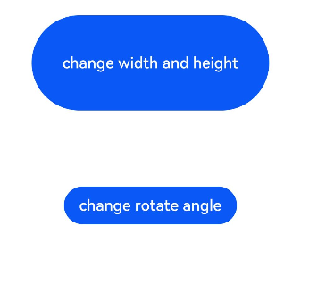

# Explicit Animation

You can create explicit animation with your custom settings.

>  **NOTE**
>
>  The APIs of this module are supported since API version 7. Updates will be marked with a superscript to indicate their earliest API version.


animateTo(value: AnimateParam, event: () => void): void

| Name            | Type       |       Mandatory    |        Description       |
| ---------------- | ------------ | -------------------- | -------------------- |
| value | [AnimateParam](#animateparam)| Yes| Animation settings.|
| event | () => void | Yes| Closure function that displays the dynamic effect. The system automatically inserts the transition animation if the status changes in the closure function.|

## AnimateParam

| Name| Type| Description|
| -------- | -------- | -------- |
| duration | number | Animation duration, in ms.<br>Default value: **1000**|
| tempo | number | Animation playback speed. A larger value indicates faster animation playback, and a smaller value indicates slower animation playback. The value **0** means that there is no animation.<br>Default value: **1.0**|
| curve | Curve \| Curves | Animation curve.<br>Default value: **Curve.Linear**|
| delay | number | Delay of animation playback, in ms. By default, the playback is not delayed.<br>Default value: **0**|
| iterations | number | Number of times that the animation is played. By default, the animation is played once. The value **-1** indicates that the animation is played for an unlimited number of times.<br>Default value: **1**|
| playMode | [PlayMode](ts-appendix-enums.md#playmode) | Animation playback mode. By default, the animation is played from the beginning after the playback is complete.<br>Default value: **PlayMode.Normal**|
| onFinish   | () =&gt; void   | Callback invoked when the animation playback is complete.|


## Example

```ts
// xxx.ets
@Entry
@Component
struct AnimateToExample {
  @State widthSize: number = 250
  @State heightSize: number = 100
  @State rotateAngle: number = 0
  private flag: boolean = true

  build() {
    Column() {
      Button('change width and height')
        .width(this.widthSize)
        .height(this.heightSize)
        .margin(30)
        .onClick(() => {
          if (this.flag) {
            animateTo({
              duration: 2000,
              curve: Curve.EaseOut,
              iterations: 3,
              playMode: PlayMode.Normal,
              onFinish: () => {
                console.info('play end')
              }
            }, () => {
              this.widthSize = 100
              this.heightSize = 50
            })
          } else {
            animateTo({}, () => {
              this.widthSize = 250
              this.heightSize = 100
            })
          }
          this.flag = !this.flag
        })
      Button('change rotate angle')
        .margin(50)
        .rotate({ x: 0, y: 0, z: 1, angle: this.rotateAngle })
        .onClick(() => {
          animateTo({
            duration: 1200,
            curve: Curve.Friction,
            delay: 500,
            iterations: -1, // The value -1 indicates that the animation is played for an unlimited number of times.
            playMode: PlayMode.AlternateReverse,
            onFinish: () => {
              console.info('play end')
            }
          }, () => {
            this.rotateAngle = 90
          })
        })
    }.width('100%').margin({ top: 5 })
  }
}
```

The figure below shows two buttons in their initial state.



Clicking the first button plays the animation of resizing the button, and clicking the second button plays the animation of rotating the button clockwise by 90 degrees. The figure below shows the two buttons when the animations have finished.


