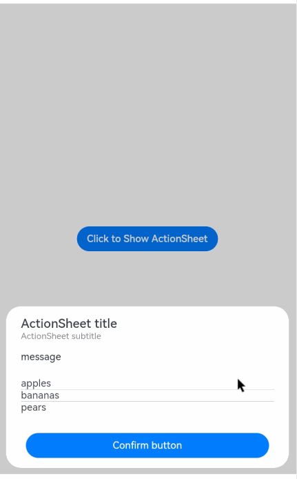

# Action Sheet

An action sheet is a dialog box that displays actions a user can take.

>  **NOTE**
>
>  The APIs of this module are supported since API version 8. Updates will be marked with a superscript to indicate their earliest API version.
>
> The functionality of this module depends on UI context. This means that the APIs of this module cannot be used where the UI context is unclear. For details, see [UIContext](../apis/js-apis-arkui-UIContext.md#uicontext).
>
> Since API version 10, you can use the [showActionSheet](../apis/js-apis-arkui-UIContext.md#showactionsheet) API in [UIContext](../apis/js-apis-arkui-UIContext.md#uicontext) to obtain the UI context.

## ActionSheet.show

show(value: { title: string | Resource, subtitle: Resource, message: string | Resource, confirm?: {enabled?: boolean, defaultFocus?: boolean, style?: DialogButtonStyle, value: string | Resource, action:() => void}, cancel?:()=>void, sheets: Array&lt;SheetInfo&gt;, autoCancel?:boolean, alignment?: DialogAlignment, offset?: { dx: number | string | Resource; dy: number | string | Resource } })

Defines and shows the action sheet.

**Parameters**

| Name       | Type                   | Mandatory | Description                         |
| ---------- | -------------------------- | ------- | ----------------------------- |
| title      | [Resource](ts-types.md#resource) \| string | Yes    |  Title of the dialog box.|
| subtitle<sup>10+</sup> | [ResourceStr](ts-types.md#resourcestr) | No| Subtitle of the dialog box.|
| message    | [Resource](ts-types.md#resource) \| string | Yes    | Content of the dialog box. |
| autoCancel | boolean                           | No    | Whether to close the dialog box when the overlay is clicked.<br>Default value: **true**<br>The value **true** means to close the dialog box when the overlay is clicked, and **false** means the opposite.|
| confirm    | {<br>enabled<sup>10+</sup>?: boolean,<br>defaultFocus<sup>10+</sup>?: boolean,<br>style<sup>10+</sup>?: [DialogButtonStyle](#dialogbuttonstyle10),<br>value: [ResourceStr](ts-types.md#resourcestr),<br>action: () =&gt; void<br>} | No | Information about the confirm button.<br>**enabled**: whether to respond when the button is clicked.<br>Default value: **true**<br>**defaultFocus**: whether the button is the default focus.<br>Default value: **false**<br>**style**: button style.<br>Default value: **DialogButtonStyle.DEFAULT**<br>**value**: button text.<br>**action**: callback upon button clicking.|
| cancel     | () =&gt; void           | No    | Callback invoked when the dialog box is closed after the overlay is clicked.  |
| alignment  | [DialogAlignment](ts-methods-alert-dialog-box.md#dialogalignment) | No    |  Alignment mode of the dialog box in the vertical direction.<br>Default value: **DialogAlignment.Bottom**|
| offset     | {<br>dx: Length,<br>dy: Length<br>} | No     | Offset of the dialog box relative to the alignment position.{<br>dx: 0,<br>dy: 0<br>} |
| sheets     | Array&lt;SheetInfo&gt; | Yes      | Options in the dialog box. Each option supports the image, text, and callback.|
| maskRect<sup>10+</sup> | [Rectangle](ts-methods-alert-dialog-box.md#rectangle10) | No    | Mask area of the dialog box. Events outside the mask area are transparently transmitted, and events within the mask area are not.<br>Default value: **{ x: 0, y: 0, width: '100%', height: '100%' }**|

## SheetInfo

| Name| Type                                                    | Mandatory| Description         |
| ------ | ------------------------------------------------------------ | ---- | ----------------- |
| title  | [ResourceStr](ts-types.md#resourcestr) | Yes  | Sheet text.      |
| icon   | [ResourceStr](ts-types.md#resourcestr) | No  | Sheet icon. By default, no icon is displayed.    |
| action | ()=&gt;void                                          | Yes  | Callback when the sheet is selected.|

## DialogButtonStyle<sup>10+</sup>

| Name     | Description.                             |
| --------- | --------------------------------- |
| DEFAULT   | Blue text on white background (black background under the dark theme).|
| HIGHLIGHT | White text on blue background.                       |


## Example


```ts
@Entry
@Component
struct ActionSheetExample {
  build() {
    Flex({ direction: FlexDirection.Column, alignItems: ItemAlign.Center, justifyContent: FlexAlign.Center }) {
      Button('Click to Show ActionSheet')
        .onClick(() => {
          ActionSheet.show({
            title: 'ActionSheet title',
            subtitle: 'ActionSheet subtitle',
            message: 'message',
            autoCancel: true,
            confirm: {
              defaultFocus: true,
              value: 'Confirm button',
              action: () => {
                console.log('Get Alert Dialog handled')
              }
            },
            cancel: () => {
              console.log('actionSheet canceled')
            },
            alignment: DialogAlignment.Bottom,
            offset: { dx: 0, dy: -10 },
            sheets: [
              {
                title: 'apples',
                action: () => {
                  console.log('apples')
                }
              },
              {
                title: 'bananas',
                action: () => {
                  console.log('bananas')
                }
              },
              {
                title: 'pears',
                action: () => {
                  console.log('pears')
                }
              }
            ]
          })
        })
    }.width('100%')
    .height('100%')
  }
}
```


