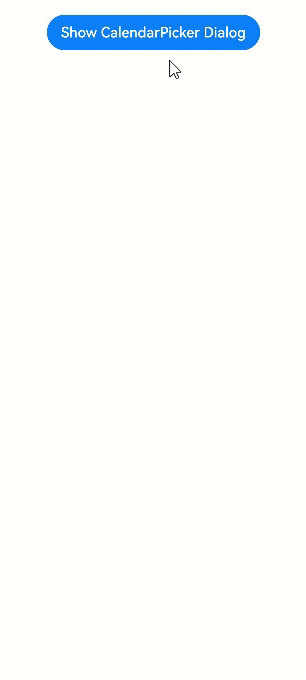

# Calendar Picker Dialog Box

A calendar picker dialog box is a dialog box that allows users to select a date from a calendar picker.

> **NOTE**
>
> This component is supported since API version 10. Updates will be marked with a superscript to indicate their earliest API version.
>
> The functionality of this module depends on UI context. This means that the APIs of this module cannot be used where the UI context is unclear. For details, see [UIContext](../apis/js-apis-arkui-UIContext.md#uicontext).

## CalendarPickerDialog.show

show(options?: [CalendarDialogOptions](#calendardialogoptions))

Shows a calendar picker dialog box.

## CalendarDialogOptions

| Name    | Type                                 | Mandatory| Description                                                    |
| ---------- | ----------------------------------------- | ---- | ------------------------------------------------------------ |
| selected   | Date                                      | No  | Selected date. Default value: current system date                   |
| hintRadius | number \|[Resource](ts-types.md#resource) | No  | Style of the background of the selected state.<br>Default value: The background is a circle.<br>**NOTE**<br>If the value is **0**, the background is a rectangle with square corners. If the value is in the 0–16 range, the background is a rectangle with rounded corners. If the value is equal to or greater than 16, the background is a circle.|
| onAccept   | (value: Date) => void                     | No  | Triggered when the OK button in the dialog box is clicked.<br>**value**: selected date value|
| onCancel   | () => void                                | No  | Triggered when the Cancel button in the dialog box is clicked.                        |
| onChange   | (value: Date) => void                     | No  | Triggered when the selection in the picker changes the selected date.<br>**value**: selected date value|

## Example

```ts
// xxx.ets
@Entry
@Component
struct CalendarPickerDialogExample {
  private selectedDate: Date = new Date()
  build() {
    Column() {
      Button("Show CalendarPicker Dialog")
        .margin(20)
        .onClick(() => {
          console.info("CalendarDialog.show")
          CalendarPickerDialog.show({
            selected: this.selectedDate,
            onAccept: (value) => {
              console.info("calendar onAccept:" + JSON.stringify(value))
            },
            onCancel: () => {
              console.info("calendar onCancel")
            },
            onChange: (value) => {
              console.info("calendar onChange:" + JSON.stringify(value))
            }
          })
        })
    }.width('100%')
  }
}
```


