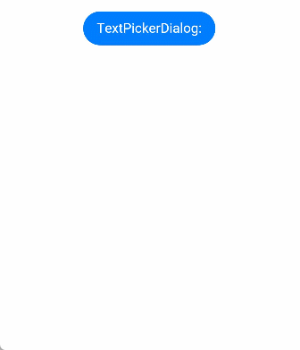

# Text Picker Dialog Box

A text picker dialog box is a dialog box that allows users to select text from the given range.

>  **NOTE**
>
> The APIs of this module are supported since API version 8. Updates will be marked with a superscript to indicate their earliest API version.
>
> The functionality of this module depends on UI context. This means that the APIs of this module cannot be used where the UI context is unclear. For details, see [UIContext](../apis/js-apis-arkui-UIContext.md#uicontext).
>
> Since API version 10, you can use the [showTextPickerDialog](../apis/js-apis-arkui-UIContext.md#showtextpickerdialog) API in [UIContext](../apis/js-apis-arkui-UIContext.md#uicontext) to obtain the UI context.

## TextPickerDialog.show

show(options?: TextPickerDialogOptions)

Shows a text picker in the given settings.

**TextPickerDialogOptions**

| Name| Type| Mandatory|  Description|
| -------- | -------- | -------- |  -------- |
| range | string[] \| [Resource](ts-types.md#resource)\|[TextPickerRangeContent](ts-basic-components-textpicker.md#textpickerrangecontent10)[]<sup>10+</sup> | Yes| Data selection range of the picker. This parameter cannot be set to an empty array. If set to an empty array, it will not be displayed.<br>**NOTE**<br>The Resource type supports only [strarray.json](../../quick-start/resource-categories-and-access.md#resource-group-subdirectories).|
| selected | number | No|  Index of the selected item.<br>Default value: **0**|
| value       | string           | No   | Text of the selected item. This parameter does not take effect when the **selected** parameter is set. If the value is not within the range, the first item in the range is used instead.<br>**NOTE**<br>This parameter works only when the picker contains text only. |
| defaultPickerItemHeight | number \| string | No| Height of the picker item.|
| disappearTextStyle<sup>10+</sup> | [PickerTextStyle](ts-basic-components-datepicker.md#pickertextstyle10) | No| Font color, font size, and font width for the top and bottom items.<br>Default value:<br>{<br>color: '#ff182431',<br>font: {<br>size: '14fp', <br>weight: FontWeight.Regular<br>}<br>} |
| textStyle<sup>10+</sup> | [PickerTextStyle](ts-basic-components-datepicker.md#pickertextstyle10) | No| Font color, font size, and font width of all items except the top, bottom, and selected items.<br>Default value:<br>{<br>color: '#ff182431',<br>font: {<br>size: '16fp', <br>weight: FontWeight.Regular<br>}<br>} |
| selectedTextStyle<sup>10+</sup> | [PickerTextStyle](ts-basic-components-datepicker.md#pickertextstyle10) | No| Font color, font size, and font width of the selected item.<br>Default value:<br>{<br>color: '#ff007dff',<br>font: {<br>size: '20vp', <br>weight: FontWeight.Medium<br>}<br>} |
| canLoop<sup>10+</sup> | boolean | No| Whether to support scroll looping. The value **true** means to support scroll looping, and **false** means the opposite.<br>Default value: **true**|
| alignment<sup>10+</sup>  | [DialogAlignment](ts-methods-alert-dialog-box.md#dialogalignment) | No  | Alignment mode of the dialog box in the vertical direction.<br>Default value: **DialogAlignment.Default**|
| offset<sup>10+</sup>     | [Offset](ts-types.md#offset) | No    | Offset of the dialog box based on the **alignment** settings.<br>Default value: **{ dx: 0 , dy: 0 }**|
| maskRect<sup>10+</sup>| [Rectangle](ts-methods-alert-dialog-box.md#rectangle10) | No    | Mask area of the dialog box. Events outside the mask area are transparently transmitted, and events within the mask area are not.<br>Default value: **{ x: 0, y: 0, width: '100%', height: '100%' }**|
| onAccept | (value: [TextPickerResult](#textpickerresult)) => void | No|  Callback invoked when the OK button in the dialog box is clicked.|
| onCancel | () => void | No| Callback invoked when the Cancel button in the dialog box is clicked.|
| onChange | (value: [TextPickerResult](#textpickerresult)) => void | No|  Callback invoked when the selected item changes.|

## TextPickerResult

| Name| Type| Description|
| -------- | -------- | -------- |
| value | string \| string []<sup>10+</sup> | Text of the selected item.<br>**NOTE**<br>When the picker contains text only or both text and imagery, **value** indicates the text value of the selected item. (For a multi-column picker, **value** is of the array type.)<br>For an image list, **value** is empty.|
| index | number \| number []<sup>10+</sup> | Index of the selected item in the range. (For a multi-column picker, **index** is of the array type.)|

## Example

```ts
// xxx.ets
@Entry
@Component
struct TextPickerDialogExample {
  private select: number | number[] = 2
  private fruits: string[] = ['apple1', 'orange2', 'peach3', 'grape4', 'banana5']

  build() {
    Row() {
      Column() {
        Button("TextPickerDialog")
          .margin(20)
          .onClick(() => {
            TextPickerDialog.show({
              range: this.fruits,
              selected: this.select,
              disappearTextStyle: {color: Color.Red, font: {size: 15, weight: FontWeight.Lighter}},
              textStyle: {color: Color.Black, font: {size: 20, weight: FontWeight.Normal}},
              selectedTextStyle: {color: Color.Blue, font: {size: 30, weight: FontWeight.Bolder}},
              onAccept: (value: TextPickerResult) => {
                // Set select to the index of the item selected when the OK button is touched. In this way, when the text picker dialog box is displayed again, the selected item is the one last confirmed.
                this.select = value.index
                console.info("TextPickerDialog:onAccept()" + JSON.stringify(value))
              },
              onCancel: () => {
                console.info("TextPickerDialog:onCancel()")
              },
              onChange: (value: TextPickerResult) => {
                console.info("TextPickerDialog:onChange()" + JSON.stringify(value))
              }
            })
          })
      }.width('100%')
    }.height('100%')
  }
}
```


