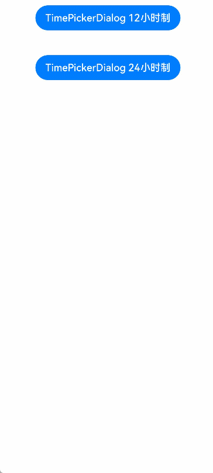

# Time Picker Dialog Box

A time picker dialog box is a dialog box that allows users to select a time from the 24-hour range through scrolling.

>  **NOTE**
>
> The APIs of this module are supported since API version 8. Updates will be marked with a superscript to indicate their earliest API version.
>
> The functionality of this module depends on UI context. This means that the APIs of this module cannot be used where the UI context is unclear. For details, see [UIContext](../apis/js-apis-arkui-UIContext.md#uicontext).
>
> Since API version 10, you can use the [showTimePickerDialog](../apis/js-apis-arkui-UIContext.md#showtimepickerdialog) API in [UIContext](../apis/js-apis-arkui-UIContext.md#uicontext) to obtain the UI context.

## TimePickerDialog.show

show(options?: TimePickerDialogOptions)

Shows a time picker dialog box.

**TimePickerDialogOptions**


| Name| Type| Mandatory| Description|
| -------- | -------- | -------- | -------- |
| selected | Date | No| Selected time.<br>Default value: current system time|
| useMilitaryTime | boolean | No| Whether to display time in 24-hour format. The 12-hour format is used by default.<br>Default value: **false**<br>**NOTE**<br>When in the 12-hour format, the AM/PM zone does not change depending on the hour portion.|
| disappearTextStyle<sup>10+</sup> | [PickerTextStyle](ts-basic-components-datepicker.md#pickertextstyle10) | No| Font color, font size, and font width for the top and bottom items.<br>Default value:<br>{<br>color: '#ff182431',<br>font: {<br>size: '14fp', <br>weight: FontWeight.Regular<br>}<br>} |
| textStyle<sup>10+</sup> | [PickerTextStyle](ts-basic-components-datepicker.md#pickertextstyle10) | No| Font color, font size, and font width of all items except the top, bottom, and selected items.<br>Default value:<br>{<br>color: '#ff182431',<br>font: {<br>size: '16fp', <br>weight: FontWeight.Regular<br>}<br>} |
| selectedTextStyle<sup>10+</sup> | [PickerTextStyle](ts-basic-components-datepicker.md#pickertextstyle10) | No| Font color, font size, and font width of the selected item.<br>Default value:<br>{<br>color: '#ff007dff',<br>font: {<br>size: '20vp', <br>weight: FontWeight.Medium<br>}<br>} |
| alignment<sup>10+</sup>  | [DialogAlignment](ts-methods-alert-dialog-box.md#dialogalignment) | No  | Alignment mode of the dialog box in the vertical direction.<br>Default value: **DialogAlignment.Default**|
| offset<sup>10+</sup>     | [Offset](ts-types.md#offset) | No    | Offset of the dialog box based on the **alignment** settings.<br>Default value: **{ dx: 0 , dy: 0 }**|
| maskRect<sup>10+</sup>| [Rectangle](ts-methods-alert-dialog-box.md#rectangle10) | No    | Mask area of the dialog box. Events outside the mask area are transparently transmitted, and events within the mask area are not.<br>Default value: **{ x: 0, y: 0, width: '100%', height: '100%' }**|
| onAccept | (value: [TimePickerResult](ts-basic-components-timepicker.md#TimePickerResult)) => void | No| Callback invoked when the OK button in the dialog box is clicked.|
| onCancel | () => void | No| Callback invoked when the Cancel button in the dialog box is clicked.|
| onChange | (value: [TimePickerResult](ts-basic-components-timepicker.md#TimePickerResult)) => void | No| Callback invoked when the selected time changes.|

## Example

```ts
// xxx.ets
@Entry
@Component
struct TimePickerDialogExample {
  private selectTime: Date = new Date('2020-12-25T08:30:00')

  build() {
    Column() {
      Button ("TimePickerDialog 12-hour format")
        .margin(20)
        .onClick(() => {
          TimePickerDialog.show({
            selected: this.selectTime,
            disappearTextStyle: { color: Color.Red, font: { size: 15, weight: FontWeight.Lighter } },
            textStyle: { color: Color.Black, font: { size: 20, weight: FontWeight.Normal } },
            selectedTextStyle: { color: Color.Blue, font: { size: 30, weight: FontWeight.Bolder } },
            onAccept: (value: TimePickerResult) => {
              // Set selectTime to the time when the OK button is clicked. In this way, when the dialog box is displayed again, the selected time is the time when the operation was confirmed last time.
              if (value.hour != undefined && value.minute != undefined) {
                this.selectTime.setHours(value.hour, value.minute)
                console.info("TimePickerDialog:onAccept()" + JSON.stringify(value))
              }
            },
            onCancel: () => {
              console.info("TimePickerDialog:onCancel()")
            },
            onChange: (value: TimePickerResult) => {
              console.info("TimePickerDialog:onChange()" + JSON.stringify(value))
            }
          })
        })
      Button ("TimePickerDialog 24-hour format")
        .margin(20)
        .onClick(() => {
          TimePickerDialog.show({
            selected: this.selectTime,
            useMilitaryTime: true,
            disappearTextStyle: { color: Color.Red, font: { size: 15, weight: FontWeight.Lighter } },
            textStyle: { color: Color.Black, font: { size: 20, weight: FontWeight.Normal } },
            selectedTextStyle: { color: Color.Blue, font: { size: 30, weight: FontWeight.Bolder } },
            onAccept: (value: TimePickerResult) => {
              if (value.hour != undefined && value.minute != undefined) {
                this.selectTime.setHours(value.hour, value.minute)
                console.info("TimePickerDialog:onAccept()" + JSON.stringify(value))
              }
            },
            onCancel: () => {
              console.info("TimePickerDialog:onCancel()")
            },
            onChange: (value: TimePickerResult) => {
              console.info("TimePickerDialog:onChange()" + JSON.stringify(value))
            }
          })
        })
    }.width('100%')
  }
}
```


