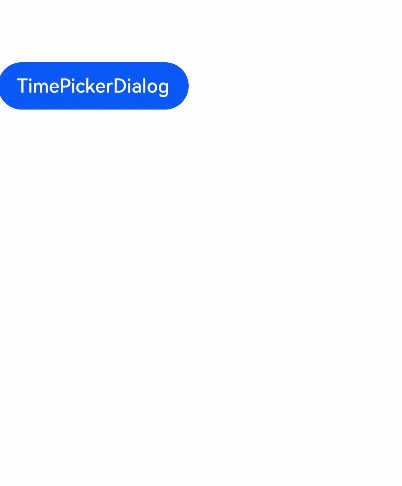

# Time Picker Dialog Box

You can display a time picker in a dialog box to allow users to select a time from the given range, which is from 00:00 to 23:59 by default.

>  **NOTE**
>
> The APIs of this module are supported since API version 8. Updates will be marked with a superscript to indicate their earliest API version.

## TimePickerDialog.show

show(options?: TimePickerDialogOptions)

Defines and displays a time picker dialog box.

- options parameters
  | Name| Type| Mandatory| Description|
  | -------- | -------- | -------- | -------- |
  | selected | Date | No| Selected time.<br>Default value: current system time|
  | useMilitaryTime | boolean | No| Whether to display time in 24-hour format. The 12-hour format is used by default.<br>Default value: **false**|
  | onAccept | (value: [TimePickerResult](ts-basic-components-timepicker.md#TimePickerResult)) => void | No| Callback invoked when the OK button in the dialog box is clicked.|
  | onCancel | () => void | No| Callback invoked when the Cancel button in the dialog box is clicked.|
  | onChange | (value: [TimePickerResult](ts-basic-components-timepicker.md#TimePickerResult)) => void | No| Callback invoked when the selected time changes.|

## Example

### Time Picker Sample Code (24-Hour Clock)
```ts
// xxx.ets
@Entry
@Component
struct TimePickerDialogExample01 {
  @State isUseMilitaryTime: boolean = true;

  build() {
    Flex({direction: FlexDirection.Column, alignItems: ItemAlign.Center,
      justifyContent: FlexAlign.Center }) {
      Button("TimePickerDialog").onClick(() => {
        TimePickerDialog.show({
          useMilitaryTime: this.isUseMilitaryTime,
          onAccept: (value: TimePickerResult) => {
            console.info("TimePickerDialog:onAccept()" + JSON.stringify(value));
          },
          onCancel: () => {
            console.info("TimePickerDialog:onCancel()");
          },
          onChange: (value: TimePickerResult) => {
            console.info("TimePickerDialog:onChange()" + JSON.stringify(value));
          }
        })
      })
    }
  }
}
```
    

### Time Picker Sample Code (12-Hour Clock)

```ts
// xxx.ets
@Entry
@Component
struct TimePickerDialogExample02 {
  @State isUseMilitaryTime: boolean = false;

  build() {
    Flex({direction: FlexDirection.Column, alignItems: ItemAlign.Center,
      justifyContent: FlexAlign.Center }) {
      Button("TimePickerDialog").onClick(() => {
        TimePickerDialog.show({
          useMilitaryTime: this.isUseMilitaryTime,
          onAccept: (value: TimePickerResult) => {
            console.info("TimePickerDialog:onAccept()" + JSON.stringify(value));
          },
          onCancel: () => {
            console.info("TimePickerDialog:onCancel()");
          },
          onChange: (value: TimePickerResult) => {
            console.info("TimePickerDialog:onChange()" + JSON.stringify(value));
          }
        })
      })
    }
  }
}
```

   