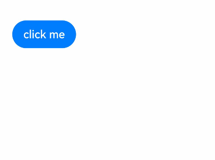

# Motion Path Animation

The motion path animation is used to animate a component along a custom path.

>  **NOTE**
>
> The APIs of this module are supported since API version 7. Updates will be marked with a superscript to indicate their earliest API version.


## Attributes

| Name| Type| Description|
| -------- | -------- | -------- |
| motionPath | {<br>path: string,<br>from?: number,<br>to?: number,<br>rotatable?: boolean<br>} | Motion path of the component.<br>- **path**: motion path of the translation animation. The value is an SVG path string. In the value, **start** and **end** can be used in place of the start point and end point, for example, **'Mstart.x start.y L50 50 Lend.x end.y Z'**. For details, see [Path Drawing](../../ui/ui-js-components-svg-path.md).<br>- **from**: start point of the motion path.<br>Default value: **0.0**<br>Value range: [0, 1]<br>- **to**: end point of the motion path.<br>Default value: **1.0**<br>Value range: [0, 1]<br>- **rotatable**: whether to rotate along the path.<br>Default value: **false** |


## Example

```ts
// xxx.ets
@Entry
@Component
struct MotionPathExample {
  @State toggle: boolean = true

  build() {
    Column() {
      Button('click me').margin(50)
        // Execute the animation: Move from the start point to (300,200), then to (300,500), and finally to the end point.
        .motionPath({ path: 'Mstart.x start.y L300 200 L300 500 Lend.x end.y', from: 0.0, to: 1.0, rotatable: true })
        .onClick(() => {
          animateTo({ duration: 4000, curve: Curve.Linear }, () => {
            this.toggle =! this.toggle // Use this.toggle to change the position of the component.
          })
        })
    }.width('100%').height('100%').alignItems(this.toggle ? HorizontalAlign.Start : HorizontalAlign.Center)
  }
}
```


