# OffscreenCanvasRenderingContext2D

Use **OffscreenCanvasRenderingContext2D** to draw rectangles, images, and text offscreen onto a canvas. Drawing offscreen onto a canvas is a process where content to draw onto the canvas is first drawn in the buffer, and then converted into a picture, and finally the picture is drawn on the canvas. This process increases the drawing efficiency.

>  **NOTE**
>
>  The APIs of this module are supported since API version 8. Updates will be marked with a superscript to indicate their earliest API version.


## APIs

OffscreenCanvasRenderingContext2D(width: number, height: number, settings?: RenderingContextSettings)

Since API version 9, this API is supported in ArkTS widgets.

**Parameters**

| Name     | Type                                    | Mandatory  | Description                          |
| -------- | ---------------------------------------- | ---- | ------------------------------ |
| width    | number                                   | Yes   | Width of the offscreen canvas.                       |
| height   | number                                   | Yes   | Height of the offscreen canvas.                       |
| settings | [RenderingContextSettings](ts-canvasrenderingcontext2d.md#renderingcontextsettings) | No   | See RenderingContextSettings.|


## Attributes

| Name                                      | Type                                      | Description                                      |
| ---------------------------------------- | ---------------------------------------- | ---------------------------------------- |
| [fillStyle](#fillstyle)                  | string \|number<sup>10+</sup> \|[CanvasGradient](ts-components-canvas-canvasgradient.md) \| [CanvasPattern](ts-components-canvas-canvaspattern.md#canvaspattern) | Style to fill an area.<br>- When the type is **string**, this attribute indicates the color of the filling area.<br>- When the type is **number**, this attribute indicates the color of the filling area.<br>- When the type is **CanvasGradient**, this attribute indicates a gradient object, which is created using the **[createLinearGradient](#createlineargradient)** API.<br>- When the type is **CanvasPattern**, this attribute indicates a pattern, which is created using the **[createPattern](#createpattern)** API.<br>Since API version 9, this API is supported in ArkTS widgets.|
| [lineWidth](#linewidth)                  | number                                   | Line width.<br>Since API version 9, this API is supported in ArkTS widgets.|
| [strokeStyle](#strokestyle)              | string \|number<sup>10+</sup> \|[CanvasGradient](ts-components-canvas-canvasgradient.md) \| [CanvasPattern](ts-components-canvas-canvaspattern.md#canvaspattern) | Stroke style.<br>- When the type is **string**, this attribute indicates the stroke color.<br>- When the type is **number**, this attribute indicates the stroke color.<br>- When the type is **CanvasGradient**, this attribute indicates a gradient object, which is created using the **[createLinearGradient](#createlineargradient)** API.<br>- When the type is **CanvasPattern**, this attribute indicates a pattern, which is created using the **[createPattern](#createpattern)** API.<br>Since API version 9, this API is supported in ArkTS widgets.|
| [lineCap](#linecap)                      | CanvasLineCap                            | Style of the line endpoints. The options are as follows:<br>- **butt**: The endpoints of the line are squared off.<br>- **round**: The endpoints of the line are rounded.<br>- **square**: The endpoints of the line are squared off, and each endpoint has added a rectangle whose length is the same as the line thickness and whose width is half of the line thickness.<br>- Default value: **'butt'**<br>Since API version 9, this API is supported in ArkTS widgets.|
| [lineJoin](#linejoin)                    | CanvasLineJoin                           | Style of the shape used to join line segments. The options are as follows:<br>- **round**: The intersection is a sector, whose radius at the rounded corner is equal to the line width.<br>- **bevel**: The intersection is a triangle. The rectangular corner of each line is independent.<br>- **miter**: The intersection has a miter corner by extending the outside edges of the lines until they meet. You can view the effect of this attribute in **miterLimit**.<br>- Default value: **'miter'**<br>Since API version 9, this API is supported in ArkTS widgets.|
| [miterLimit](#miterlimit)                | number                                   | Maximum miter length. The miter length is the distance between the inner corner and the outer corner where two lines meet.<br>- Default value: **10**<br>Since API version 9, this API is supported in ArkTS widgets.|
| [font](#font)                            | string                                   | Font style.<br>Syntax: ctx.font='font-size font-family'<br>- (Optional) **font-size**: font size and line height. The unit can only be pixels.<br>(Optional) **font-family**: font family.<br>Syntax: ctx.font='font-style font-weight font-size font-family'<br>- (Optional) **font-style**: font style. Available values are **normal** and **italic**.<br>- (Optional) **font-weight**: font weight. Available values are as follows: **normal**, **bold**, **bolder**, **lighter**, **100**, **200**, **300**, **400**, **500**, **600**, **700**, **800**, **900**.<br>- (Optional) **font-size**: font size and line height. The unit can be px or vp and must be specified.<br>- (Optional) **font-family**: font family. Available values are **sans-serif**, **serif**, and **monospace**.<br>Default value: **'normal normal 14px sans-serif'**<br>Since API version 9, this API is supported in ArkTS widgets.|
| [textAlign](#textalign)                  | CanvasTextAlign                          | Text alignment mode. Available values are as follows:<br>- **left**: The text is left-aligned.<br>- **right**: The text is right-aligned.<br>- **center**: The text is center-aligned.<br>- **start**: The text is aligned with the start bound.<br>- **end**: The text is aligned with the end bound.<br>**NOTE**<br><br>In the **ltr** layout mode, the value **'start'** equals **'left'**. In the **rtl** layout mode, the value **'start'** equals **'right'**.<br>- Default value: **'left'**<br>Since API version 9, this API is supported in ArkTS widgets.|
| [textBaseline](#textbaseline)            | CanvasTextBaseline                       | Horizontal alignment mode of text. Available values are as follows:<br>- **alphabetic**: The text baseline is the normal alphabetic baseline.<br>- **top**: The text baseline is on the top of the text bounding box.<br>- **hanging**: The text baseline is a hanging baseline over the text.<br>- **middle**: The text baseline is in the middle of the text bounding box.<br>**'ideographic'**: The text baseline is the ideographic baseline. If a character exceeds the alphabetic baseline, the ideographic baseline is located at the bottom of the excess character.<br>- **bottom**: The text baseline is at the bottom of the text bounding box. Its difference from the ideographic baseline is that the ideographic baseline does not consider letters in the next line.<br>- Default value: **'alphabetic'**<br>Since API version 9, this API is supported in ArkTS widgets.|
| [globalAlpha](#globalalpha)              | number                                   | Opacity.<br>**0.0**: completely transparent.<br>**1.0**: completely opaque.               |
| [lineDashOffset](#linedashoffset)        | number                                   | Offset of the dashed line. The precision is float.<br>- Default value: **0.0**<br>Since API version 9, this API is supported in ArkTS widgets.|
| [globalCompositeOperation](#globalcompositeoperation) | string                                   | Composition operation type. Available values are as follows: **'source-over'**, **'source-atop'**, **'source-in'**, **'source-out'**, **'destination-over'**, **'destination-atop'**, **'destination-in'**, **'destination-out'**, **'lighter'**, **'copy'**, and **'xor'**.<br>- Default value: **'source-over'**<br>Since API version 9, this API is supported in ArkTS widgets.|
| [shadowBlur](#shadowblur)                | number                                   | Blur level during shadow drawing. A larger value indicates a more blurred effect. The precision is float.<br>- Default value: **0.0**<br>Since API version 9, this API is supported in ArkTS widgets.|
| [shadowColor](#shadowcolor)              | string                                   | Shadow color.<br>Since API version 9, this API is supported in ArkTS widgets.|
| [shadowOffsetX](#shadowoffsetx)          | number                                   | X-axis shadow offset relative to the original object.<br>Since API version 9, this API is supported in ArkTS widgets.|
| [shadowOffsetY](#shadowoffsety)          | number                                   | Y-axis shadow offset relative to the original object.<br>Since API version 9, this API is supported in ArkTS widgets.|
| [imageSmoothingEnabled](#imagesmoothingenabled) | boolean                                  | Whether to adjust the image smoothness during image drawing. The value **true** means to enable this feature, and **false** means the opposite.<br>- Default value: **true**<br>Since API version 9, this API is supported in ArkTS widgets.|
| [imageSmoothingQuality](#imagesmoothingquality) | ImageSmoothingQuality                    | Quality of image smoothing. This attribute works only when **imageSmoothingEnabled** is set to **true**. Available values are as follows:<br>- **'low'**: low quality.<br>- **'medium'**: medium quality.<br>- **'high'**: high quality.<br>Default value: **'low'**<br>Since API version 9, this API is supported in ArkTS widgets.|
| [direction](#direction)                  | CanvasDirection                          | Text direction used for drawing text. Available values are as follows:<br>- **'inherit'**: The text direction is inherited from the **\<Canvas>** component.<br>- **'ltr'**: The text direction is from left to right.<br>- **'rtl'**: The text direction is from right to left.<br>Default value: **'inherit'**<br>Since API version 9, this API is supported in ArkTS widgets.|
| [filter](#filter)                        | string                                   | Filter effect. Available values are as follows:<br>- **'none'**: no filter effect.<br>- **'blur'**: applies the Gaussian blur for the image.<br>- **'brightness'**: applies a linear multiplication to the image to make it look brighter or darker.<br>- **'contrast'**: adjusts the image contrast.<br>- **'grayscale'**: converts the image to a grayscale image.<br>- **'hue-rotate'**: applies hue rotation to the image.<br>- **'invert'**: inverts the input image.<br>- **'opacity'**: sets the opacity of the image.<br>- **'saturate'**: sets the saturation of the image.<br>- **'sepia'**: converts the image to dark brown.<br>Default value: **'none'**<br>Since API version 9, this API is supported in ArkTS widgets.|

> **NOTE**
> For **fillStyle**, **shadowColor**, and **strokeStyle**, the value format of the string type is 'rgb(255, 255, 255)', 'rgba(255, 255, 255, 1.0)', '\#FFFFFF'.


### fillStyle

```ts
// xxx.ets
@Entry
@Component
struct FillStyleExample {
  private settings: RenderingContextSettings = new RenderingContextSettings(true)
  private context: CanvasRenderingContext2D = new CanvasRenderingContext2D(this.settings)
  private offCanvas: OffscreenCanvas = new OffscreenCanvas(600, 600)

  build() {
    Flex({ direction: FlexDirection.Column, alignItems: ItemAlign.Center, justifyContent: FlexAlign.Center }) {
      Canvas(this.context)
        .width('100%')
        .height('100%')
        .backgroundColor('#ffff00')
        .onReady(() =>{
          let offContext = this.offCanvas.getContext("2d", this.settings)
          offContext.fillStyle = '#0000ff'
          offContext.fillRect(20, 20, 150, 100)
          let image = this.offCanvas.transferToImageBitmap()
          this.context.transferFromImageBitmap(image)
        })
    }
    .width('100%')
    .height('100%')
  }
}
```


```ts
// xxx.ets
@Entry
@Component
struct FillStyleExample {
  private settings: RenderingContextSettings = new RenderingContextSettings(true)
  private context: CanvasRenderingContext2D = new CanvasRenderingContext2D(this.settings)
  private offCanvas: OffscreenCanvas = new OffscreenCanvas(600, 600)

  build() {
    Flex({ direction: FlexDirection.Column, alignItems: ItemAlign.Center, justifyContent: FlexAlign.Center }) {
      Canvas(this.context)
        .width('100%')
        .height('100%')
        .backgroundColor('#ffff00')
        .onReady(() =>{
          let offContext = this.offCanvas.getContext("2d", this.settings)
          offContext.fillStyle = 0x0000FF
          offContext.fillRect(20, 20, 150, 100)
          let image = this.offCanvas.transferToImageBitmap()
          this.context.transferFromImageBitmap(image)
        })
    }
    .width('100%')
    .height('100%')
  }
}
```


### lineWidth

```ts
// xxx.ets
@Entry
@Component
struct LineWidthExample {
  private settings: RenderingContextSettings = new RenderingContextSettings(true)
  private context: CanvasRenderingContext2D = new CanvasRenderingContext2D(this.settings)
  private offCanvas: OffscreenCanvas = new OffscreenCanvas(600, 600)

  build() {
    Flex({ direction: FlexDirection.Column, alignItems: ItemAlign.Center, justifyContent: FlexAlign.Center }) {
      Canvas(this.context)
        .width('100%')
        .height('100%')
        .backgroundColor('#ffff00')
        .onReady(() =>{
          let offContext = this.offCanvas.getContext("2d", this.settings)
          offContext.lineWidth = 5
          offContext.strokeRect(25, 25, 85, 105)
          let image = this.offCanvas.transferToImageBitmap()
          this.context.transferFromImageBitmap(image)
      })
    }
    .width('100%')
    .height('100%')
  }
}
```


### strokeStyle

```ts
// xxx.ets
@Entry
@Component
struct StrokeStyleExample {
  private settings: RenderingContextSettings = new RenderingContextSettings(true)
  private context: CanvasRenderingContext2D = new CanvasRenderingContext2D(this.settings)
  private offCanvas: OffscreenCanvas = new OffscreenCanvas(600, 600)

  build() {
    Flex({ direction: FlexDirection.Column, alignItems: ItemAlign.Center, justifyContent: FlexAlign.Center }) {
      Canvas(this.context)
        .width('100%')
        .height('100%')
        .backgroundColor('#ffff00')
        .onReady(() =>{
          let offContext = this.offCanvas.getContext("2d", this.settings)
          offContext.lineWidth = 10
          offContext.strokeStyle = '#0000ff'
          offContext.strokeRect(25, 25, 155, 105)
          let image = this.offCanvas.transferToImageBitmap()
          this.context.transferFromImageBitmap(image)
        })
    }
    .width('100%')
    .height('100%')
  }
}
```


```ts
// xxx.ets
@Entry
@Component
struct StrokeStyleExample {
  private settings: RenderingContextSettings = new RenderingContextSettings(true)
  private context: CanvasRenderingContext2D = new CanvasRenderingContext2D(this.settings)
  private offCanvas: OffscreenCanvas = new OffscreenCanvas(600, 600)

  build() {
    Flex({ direction: FlexDirection.Column, alignItems: ItemAlign.Center, justifyContent: FlexAlign.Center }) {
      Canvas(this.context)
        .width('100%')
        .height('100%')
        .backgroundColor('#ffff00')
        .onReady(() =>{
          let offContext = this.offCanvas.getContext("2d", this.settings)
          offContext.lineWidth = 10
          offContext.strokeStyle = 0x0000ff
          offContext.strokeRect(25, 25, 155, 105)
          let image = this.offCanvas.transferToImageBitmap()
          this.context.transferFromImageBitmap(image)
        })
    }
    .width('100%')
    .height('100%')
  }
}
```


### lineCap

```ts
// xxx.ets
@Entry
@Component
struct LineCapExample {
  private settings: RenderingContextSettings = new RenderingContextSettings(true)
  private context: CanvasRenderingContext2D = new CanvasRenderingContext2D(this.settings)
  private offCanvas: OffscreenCanvas = new OffscreenCanvas(600, 600)

  build() {
    Flex({ direction: FlexDirection.Column, alignItems: ItemAlign.Center, justifyContent: FlexAlign.Center }) {
      Canvas(this.context)
        .width('100%')
        .height('100%')
        .backgroundColor('#ffff00')
        .onReady(() =>{
          let offContext = this.offCanvas.getContext("2d", this.settings)
          offContext.lineWidth = 8
          offContext.beginPath()
          offContext.lineCap = 'round'
          offContext.moveTo(30, 50)
          offContext.lineTo(220, 50)
          offContext.stroke()
          let image = this.offCanvas.transferToImageBitmap()
          this.context.transferFromImageBitmap(image)
        })
    }
    .width('100%')
    .height('100%')
  }
}
```


### lineJoin

```ts
// xxx.ets
@Entry
@Component
struct LineJoinExample {
  private settings: RenderingContextSettings = new RenderingContextSettings(true)
  private context: CanvasRenderingContext2D = new CanvasRenderingContext2D(this.settings)
  private offCanvas: OffscreenCanvas = new OffscreenCanvas(600, 600)

  build() {
    Flex({ direction: FlexDirection.Column, alignItems: ItemAlign.Center, justifyContent: FlexAlign.Center }) {
      Canvas(this.context)
        .width('100%')
        .height('100%')
        .backgroundColor('#ffff00')
        .onReady(() =>{
          let offContext = this.offCanvas.getContext("2d", this.settings)
          offContext.beginPath()
          offContext.lineWidth = 8
          offContext.lineJoin = 'miter'
          offContext.moveTo(30, 30)
          offContext.lineTo(120, 60)
          offContext.lineTo(30, 110)
          offContext.stroke()
          let image = this.offCanvas.transferToImageBitmap()
          this.context.transferFromImageBitmap(image)
      })
    }
    .width('100%')
    .height('100%')
  }
}
```


### miterLimit

```ts
// xxx.ets
@Entry
@Component
struct MiterLimit {
  private settings: RenderingContextSettings = new RenderingContextSettings(true)
  private context: CanvasRenderingContext2D = new CanvasRenderingContext2D(this.settings)
  private offCanvas: OffscreenCanvas = new OffscreenCanvas(600, 600)
  
  build() {
    Flex({ direction: FlexDirection.Column, alignItems: ItemAlign.Center, justifyContent: FlexAlign.Center }) {
      Canvas(this.context)
        .width('100%')
        .height('100%')
        .backgroundColor('#ffff00')
        .onReady(() =>{
          let offContext = this.offCanvas.getContext("2d", this.settings)
          offContext.lineWidth = 8
          offContext.lineJoin = 'miter'
          offContext.miterLimit = 3
          offContext.moveTo(30, 30)
          offContext.lineTo(60, 35)
          offContext.lineTo(30, 37)
          offContext.stroke()
          let image = this.offCanvas.transferToImageBitmap()
          this.context.transferFromImageBitmap(image)
      })
    }
    .width('100%')
    .height('100%')
  }
}
```

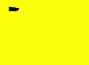


### font

```ts
// xxx.ets
@Entry
@Component
struct Fonts {
  private settings: RenderingContextSettings = new RenderingContextSettings(true)
  private context: CanvasRenderingContext2D = new CanvasRenderingContext2D(this.settings)
  private offCanvas: OffscreenCanvas = new OffscreenCanvas(600, 600)
  
  build() {
    Flex({ direction: FlexDirection.Column, alignItems: ItemAlign.Center, justifyContent: FlexAlign.Center }) {
      Canvas(this.context)
        .width('100%')
        .height('100%')
        .backgroundColor('#ffff00')
        .onReady(() =>{
          let offContext = this.offCanvas.getContext("2d", this.settings)
          offContext.font = '30px sans-serif'
          offContext.fillText("Hello World", 20, 60)
          let image = this.offCanvas.transferToImageBitmap()
          this.context.transferFromImageBitmap(image)
      })
    }
    .width('100%')
    .height('100%')
  }
}
```


### textAlign

```ts
// xxx.ets
@Entry
@Component
struct CanvasExample {
  private settings: RenderingContextSettings = new RenderingContextSettings(true)
  private context: CanvasRenderingContext2D = new CanvasRenderingContext2D(this.settings)
  private offCanvas: OffscreenCanvas = new OffscreenCanvas(600, 600)
  
  build() {
    Flex({ direction: FlexDirection.Column, alignItems: ItemAlign.Center, justifyContent: FlexAlign.Center }) {
      Canvas(this.context)
        .width('100%')
        .height('100%')
        .backgroundColor('#ffff00')
        .onReady(() =>{
        let offContext = this.offCanvas.getContext("2d", this.settings)
        offContext.strokeStyle = '#0000ff'
        offContext.moveTo(140, 10)
        offContext.lineTo(140, 160)
        offContext.stroke()

        offContext.font = '18px sans-serif'

        offContext.textAlign = 'start'
        offContext.fillText('textAlign=start', 140, 60)
        offContext.textAlign = 'end'
        offContext.fillText('textAlign=end', 140, 80)
        offContext.textAlign = 'left'
        offContext.fillText('textAlign=left', 140, 100)
        offContext.textAlign = 'center'
        offContext.fillText('textAlign=center',140, 120)
        offContext.textAlign = 'right'
        offContext.fillText('textAlign=right',140, 140)
        let image = this.offCanvas.transferToImageBitmap()
        this.context.transferFromImageBitmap(image)
      })
    }
    .width('100%')
    .height('100%')
  }
}
```


### textBaseline

```ts
// xxx.ets
@Entry
@Component
struct TextBaseline {
  private settings: RenderingContextSettings = new RenderingContextSettings(true)
  private context: CanvasRenderingContext2D = new CanvasRenderingContext2D(this.settings)
  private offCanvas: OffscreenCanvas = new OffscreenCanvas(600, 600)
  
  build() {
    Flex({ direction: FlexDirection.Column, alignItems: ItemAlign.Center, justifyContent: FlexAlign.Center }) {
      Canvas(this.context)
        .width('100%')
        .height('100%')
        .backgroundColor('#ffff00')
        .onReady(() =>{
          let offContext = this.offCanvas.getContext("2d", this.settings)
          offContext.strokeStyle = '#0000ff'
          offContext.moveTo(0, 120)
          offContext.lineTo(400, 120)
          offContext.stroke()

          offContext.font = '20px sans-serif'

          offContext.textBaseline = 'top'
          offContext.fillText('Top', 10, 120)
          offContext.textBaseline = 'bottom'
          offContext.fillText('Bottom', 55, 120)
          offContext.textBaseline = 'middle'
          offContext.fillText('Middle', 125, 120)
          offContext.textBaseline = 'alphabetic'
          offContext.fillText('Alphabetic', 195, 120)
          offContext.textBaseline = 'hanging'
          offContext.fillText('Hanging', 295, 120)
          let image = this.offCanvas.transferToImageBitmap()
          this.context.transferFromImageBitmap(image)
      })
    }
    .width('100%')
    .height('100%')
  }
}
```


### globalAlpha

```ts
// xxx.ets
@Entry
@Component
struct GlobalAlpha {
  private settings: RenderingContextSettings = new RenderingContextSettings(true)
  private context: CanvasRenderingContext2D = new CanvasRenderingContext2D(this.settings)
  private offCanvas: OffscreenCanvas = new OffscreenCanvas(600, 600)
  
  build() {
    Flex({ direction: FlexDirection.Column, alignItems: ItemAlign.Center, justifyContent: FlexAlign.Center }) {
      Canvas(this.context)
        .width('100%')
        .height('100%')
        .backgroundColor('#ffff00')
        .onReady(() =>{
          let offContext = this.offCanvas.getContext("2d", this.settings)
          offContext.fillStyle = 'rgb(0,0,255)'
          offContext.fillRect(0, 0, 50, 50)
          offContext.globalAlpha = 0.4
          offContext.fillStyle = 'rgb(0,0,255)'
          offContext.fillRect(50, 50, 50, 50)
          let image = this.offCanvas.transferToImageBitmap()
          this.context.transferFromImageBitmap(image)
      })
    }
    .width('100%')
    .height('100%')
  }
}
```


### lineDashOffset

```ts
// xxx.ets
@Entry
@Component
struct LineDashOffset {
  private settings: RenderingContextSettings = new RenderingContextSettings(true)
  private context: CanvasRenderingContext2D = new CanvasRenderingContext2D(this.settings)
  private offCanvas: OffscreenCanvas = new OffscreenCanvas(600, 600)
  
  build() {
    Flex({ direction: FlexDirection.Column, alignItems: ItemAlign.Center, justifyContent: FlexAlign.Center }) {
      Canvas(this.context)
        .width('100%')
        .height('100%')
        .backgroundColor('#ffff00')
        .onReady(() =>{
          let offContext = this.offCanvas.getContext("2d", this.settings)
          offContext.arc(100, 75, 50, 0, 6.28)
          offContext.setLineDash([10,20])
          offContext.lineDashOffset = 10.0
          offContext.stroke()
          let image = this.offCanvas.transferToImageBitmap()
          this.context.transferFromImageBitmap(image)
      })
    }
    .width('100%')
    .height('100%')
  }
}

```


### globalCompositeOperation

| Name              | Description                      |
| ---------------- | ------------------------ |
| source-over      | Displays the new drawing above the existing drawing. This attribute is used by default.  |
| source-atop      | Displays the new drawing on the top of the existing drawing.       |
| source-in        | Displays the new drawing inside the existing drawing.        |
| source-out       | Displays part of the new drawing that is outside of the existing drawing.       |
| destination-over | Displays the existing drawing above the new drawing.       |
| destination-atop | Displays the existing drawing on the top of the new drawing.       |
| destination-in   | Displays the existing drawing inside the new drawing.        |
| destination-out  | Displays the existing drawing outside the new drawing.        |
| lighter          | Displays both the new and existing drawing.         |
| copy             | Displays the new drawing and neglects the existing drawing.       |
| xor              | Combines the new drawing and existing drawing using the XOR operation.|

```ts
// xxx.ets
@Entry
@Component
struct GlobalCompositeOperation {
  private settings: RenderingContextSettings = new RenderingContextSettings(true)
  private context: CanvasRenderingContext2D = new CanvasRenderingContext2D(this.settings)
  private offCanvas: OffscreenCanvas = new OffscreenCanvas(600, 600)
  
  build() {
    Flex({ direction: FlexDirection.Column, alignItems: ItemAlign.Center, justifyContent: FlexAlign.Center }) {
      Canvas(this.context)
        .width('100%')
        .height('100%')
        .backgroundColor('#ffff00')
        .onReady(() =>{
          let offContext = this.offCanvas.getContext("2d", this.settings)
          offContext.fillStyle = 'rgb(255,0,0)'
          offContext.fillRect(20, 20, 50, 50)
          offContext.globalCompositeOperation = 'source-over'
          offContext.fillStyle = 'rgb(0,0,255)'
          offContext.fillRect(50, 50, 50, 50)
          offContext.fillStyle = 'rgb(255,0,0)'
          offContext.fillRect(120, 20, 50, 50)
          offContext.globalCompositeOperation = 'destination-over'
          offContext.fillStyle = 'rgb(0,0,255)'
          offContext.fillRect(150, 50, 50, 50)
          let image = this.offCanvas.transferToImageBitmap()
          this.context.transferFromImageBitmap(image)
      })
    }
    .width('100%')
    .height('100%')
  }
}
```


### shadowBlur

```ts
// xxx.ets
@Entry
@Component
struct ShadowBlur {
  private settings: RenderingContextSettings = new RenderingContextSettings(true)
  private context: CanvasRenderingContext2D = new CanvasRenderingContext2D(this.settings)
  private offCanvas: OffscreenCanvas = new OffscreenCanvas(600, 600)
  
  build() {
    Flex({ direction: FlexDirection.Column, alignItems: ItemAlign.Center, justifyContent: FlexAlign.Center }) {
      Canvas(this.context)
        .width('100%')
        .height('100%')
        .backgroundColor('#ffff00')
        .onReady(() =>{
          let offContext = this.offCanvas.getContext("2d", this.settings)
          offContext.shadowBlur = 30
          offContext.shadowColor = 'rgb(0,0,0)'
          offContext.fillStyle = 'rgb(255,0,0)'
          offContext.fillRect(20, 20, 100, 80)
          let image = this.offCanvas.transferToImageBitmap()
          this.context.transferFromImageBitmap(image)
      })
    }
    .width('100%')
    .height('100%')
  }
}
```


### shadowColor

```ts
// xxx.ets
@Entry
@Component
struct ShadowColor {
  private settings: RenderingContextSettings = new RenderingContextSettings(true)
  private context: CanvasRenderingContext2D = new CanvasRenderingContext2D(this.settings)
  private offCanvas: OffscreenCanvas = new OffscreenCanvas(600, 600)
  
  build() {
    Flex({ direction: FlexDirection.Column, alignItems: ItemAlign.Center, justifyContent: FlexAlign.Center }) {
      Canvas(this.context)
        .width('100%')
        .height('100%')
        .backgroundColor('#ffff00')
        .onReady(() =>{
          let offContext = this.offCanvas.getContext("2d", this.settings)
          offContext.shadowBlur = 30
          offContext.shadowColor = 'rgb(0,0,255)'
          offContext.fillStyle = 'rgb(255,0,0)'
          offContext.fillRect(30, 30, 100, 100)
          let image = this.offCanvas.transferToImageBitmap()
          this.context.transferFromImageBitmap(image)
      })
    }
    .width('100%')
    .height('100%')
  }
}
```

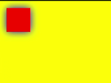


### shadowOffsetX

```ts
// xxx.ets
@Entry
@Component
struct ShadowOffsetX {
  private settings: RenderingContextSettings = new RenderingContextSettings(true)
  private context: CanvasRenderingContext2D = new CanvasRenderingContext2D(this.settings)
  private offCanvas: OffscreenCanvas = new OffscreenCanvas(600, 600)
  
  build() {
    Flex({ direction: FlexDirection.Column, alignItems: ItemAlign.Center, justifyContent: FlexAlign.Center }) {
      Canvas(this.context)
        .width('100%')
        .height('100%')
        .backgroundColor('#ffff00')
        .onReady(() =>{
          let offContext = this.offCanvas.getContext("2d", this.settings)
          offContext.shadowBlur = 10
          offContext.shadowOffsetX = 20
          offContext.shadowColor = 'rgb(0,0,0)'
          offContext.fillStyle = 'rgb(255,0,0)'
          offContext.fillRect(20, 20, 100, 80)
          let image = this.offCanvas.transferToImageBitmap()
          this.context.transferFromImageBitmap(image)
      })
    }
    .width('100%')
    .height('100%')
  }
}
```


### shadowOffsetY

```ts
// xxx.ets
@Entry
@Component
struct ShadowOffsetY {
  private settings: RenderingContextSettings = new RenderingContextSettings(true)
  private context: CanvasRenderingContext2D = new CanvasRenderingContext2D(this.settings)
  private offCanvas: OffscreenCanvas = new OffscreenCanvas(600, 600)

  build() {
    Flex({ direction: FlexDirection.Column, alignItems: ItemAlign.Center, justifyContent: FlexAlign.Center }) {
      Canvas(this.context)
        .width('100%')
        .height('100%')
        .backgroundColor('#ffff00')
        .onReady(() =>{
          let offContext = this.offCanvas.getContext("2d", this.settings)
          offContext.shadowBlur = 10
          offContext.shadowOffsetY = 20
          offContext.shadowColor = 'rgb(0,0,0)'
          offContext.fillStyle = 'rgb(255,0,0)'
          offContext.fillRect(30, 30, 100, 100)
          let image = this.offCanvas.transferToImageBitmap()
          this.context.transferFromImageBitmap(image)
      })
    }
    .width('100%')
    .height('100%')
  }
}
```

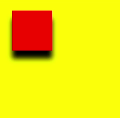


### imageSmoothingEnabled

```ts
// xxx.ets
@Entry
@Component
struct ImageSmoothingEnabled {
  private settings: RenderingContextSettings = new RenderingContextSettings(true)
  private context: CanvasRenderingContext2D = new CanvasRenderingContext2D(this.settings)
  private img:ImageBitmap = new ImageBitmap("common/images/icon.jpg")
  private offCanvas: OffscreenCanvas = new OffscreenCanvas(600, 600)
  
  build() {
    Flex({ direction: FlexDirection.Column, alignItems: ItemAlign.Center, justifyContent: FlexAlign.Center }) {
      Canvas(this.context)
        .width('100%')
        .height('100%')
        .backgroundColor('#ffff00')
        .onReady(() =>{
          let offContext = this.offCanvas.getContext("2d", this.settings)
          offContext.imageSmoothingEnabled = false
          offContext.drawImage(this.img,0,0,400,200)
          let image = this.offCanvas.transferToImageBitmap()
          this.context.transferFromImageBitmap(image)
      })
    }
    .width('100%')
    .height('100%')
  }
}
```

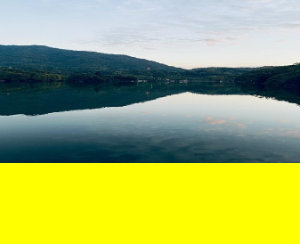


## Methods


### fillRect

fillRect(x: number, y: number, w: number, h: number): void

Fills a rectangle on the canvas.

Since API version 9, this API is supported in ArkTS widgets.

 **Parameters**

| Name    | Type    | Mandatory  | Default Value | Description           |
| ------ | ------ | ---- | ---- | ------------- |
| x      | number | Yes   | 0    | X-coordinate of the upper left corner of the rectangle.|
| y      | number | Yes   | 0    | Y-coordinate of the upper left corner of the rectangle.|
| width  | number | Yes   | 0    | Width of the rectangle.     |
| height | number | Yes   | 0    | Height of the rectangle.     |

 **Example**

  ```ts
  // xxx.ets
  @Entry
  @Component
  struct FillRect {
    private settings: RenderingContextSettings = new RenderingContextSettings(true)
    private context: CanvasRenderingContext2D = new CanvasRenderingContext2D(this.settings)
    private offCanvas: OffscreenCanvas = new OffscreenCanvas(600, 600)
    
    build() {
      Flex({ direction: FlexDirection.Column, alignItems: ItemAlign.Center, justifyContent: FlexAlign.Center }) {
        Canvas(this.context)
          .width('100%')
          .height('100%')
          .backgroundColor('#ffff00')
          .onReady(() =>{
            let offContext = this.offCanvas.getContext("2d", this.settings)
            offContext.fillRect(30,30,100,100)
            let image = this.offCanvas.transferToImageBitmap()
            this.context.transferFromImageBitmap(image)
         })
        }
      .width('100%')
      .height('100%')
    }
  }
  ```

  


### strokeRect

strokeRect(x: number, y: number, w: number, h: number): void

Draws an outlined rectangle on the canvas.

Since API version 9, this API is supported in ArkTS widgets.

 **Parameters**

| Name    | Type    | Mandatory  | Default Value | Description          |
| ------ | ------ | ---- | ---- | ------------ |
| x      | number | Yes   | 0    | X-coordinate of the upper left corner of the rectangle.|
| y      | number | Yes   | 0    | Y-coordinate of the upper left corner of the rectangle.|
| width  | number | Yes   | 0    | Width of the rectangle.    |
| height | number | Yes   | 0    | Height of the rectangle.    |

 **Example**

  ```ts
  // xxx.ets
  @Entry
  @Component
  struct StrokeRect {
    private settings: RenderingContextSettings = new RenderingContextSettings(true)
    private context: CanvasRenderingContext2D = new CanvasRenderingContext2D(this.settings)
    private offCanvas: OffscreenCanvas = new OffscreenCanvas(600, 600)

    build() {
      Flex({ direction: FlexDirection.Column, alignItems: ItemAlign.Center, justifyContent: FlexAlign.Center }) {
        Canvas(this.context)
          .width('100%')
          .height('100%')
          .backgroundColor('#ffff00')
          .onReady(() =>{
            let offContext = this.offCanvas.getContext("2d", this.settings)
            offContext.strokeRect(30, 30, 200, 150)
            let image = this.offCanvas.transferToImageBitmap()
            this.context.transferFromImageBitmap(image)
        })
      }
      .width('100%')
      .height('100%')
    }
  }
  ```

  


### clearRect

clearRect(x: number, y: number, w: number, h: number): void

Clears the content in a rectangle on the canvas.

Since API version 9, this API is supported in ArkTS widgets.

 **Parameters**

| Name    | Type    | Mandatory  | Default Value | Description           |
| ------ | ------ | ---- | ---- | ------------- |
| x      | number | Yes   | 0    | X-coordinate of the upper left corner of the rectangle.|
| y      | number | Yes   | 0    | Y-coordinate of the upper left corner of the rectangle.|
| width  | number | Yes   | 0    | Width of the rectangle.     |
| height | number | Yes   | 0    | Height of the rectangle.     |

 **Example**

  ```ts
  // xxx.ets
  @Entry
  @Component
  struct ClearRect {
    private settings: RenderingContextSettings = new RenderingContextSettings(true)
    private context: CanvasRenderingContext2D = new CanvasRenderingContext2D(this.settings)
    private offCanvas: OffscreenCanvas = new OffscreenCanvas(600, 600)

    build() {
      Flex({ direction: FlexDirection.Column, alignItems: ItemAlign.Center, justifyContent: FlexAlign.Center }) {
        Canvas(this.context)
          .width('100%')
          .height('100%')
          .backgroundColor('#ffff00')
          .onReady(() =>{
            let offContext = this.offCanvas.getContext("2d", this.settings)
            offContext.fillStyle = 'rgb(0,0,255)'
            offContext.fillRect(20,20,200,200)
            offContext.clearRect(30,30,150,100)
            let image = this.offCanvas.transferToImageBitmap()
            this.context.transferFromImageBitmap(image)
        })
      }
      .width('100%')
      .height('100%')
    }
  }
  ```

  


### fillText

fillText(text: string, x: number, y: number, maxWidth?: number): void

Draws filled text on the canvas.

Since API version 9, this API is supported in ArkTS widgets.

**Parameters**

| Name      | Type    | Mandatory  | Default Value | Description             |
| -------- | ------ | ---- | ---- | --------------- |
| text     | string | Yes   | ""   | Text to draw.     |
| x        | number | Yes   | 0    | X-coordinate of the lower left corner of the text.|
| y        | number | Yes   | 0    | Y-coordinate of the lower left corner of the text.|
| maxWidth | number | No   | -    | Maximum width allowed for the text.   |

 **Example**

  ```ts
  // xxx.ets
  @Entry
  @Component
  struct FillText {
    private settings: RenderingContextSettings = new RenderingContextSettings(true)
    private context: CanvasRenderingContext2D = new CanvasRenderingContext2D(this.settings)
    private offCanvas: OffscreenCanvas = new OffscreenCanvas(600, 600)

    build() {
      Flex({ direction: FlexDirection.Column, alignItems: ItemAlign.Center, justifyContent: FlexAlign.Center }) {
        Canvas(this.context)
          .width('100%')
          .height('100%')
          .backgroundColor('#ffff00')
          .onReady(() =>{
            let offContext = this.offCanvas.getContext("2d", this.settings)
            offContext.font = '30px sans-serif'
            offContext.fillText("Hello World!", 20, 100)
            let image = this.offCanvas.transferToImageBitmap()
            this.context.transferFromImageBitmap(image)
        })
      }
      .width('100%')
      .height('100%')
    }
  }
  ```

  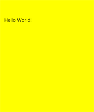


### strokeText

strokeText(text: string, x: number, y: number): void

Draws a text stroke on the canvas.

Since API version 9, this API is supported in ArkTS widgets.

**Parameters**

| Name      | Type    | Mandatory  | Default Value | Description             |
| -------- | ------ | ---- | ---- | --------------- |
| text     | string | Yes   | ""   | Text to draw.     |
| x        | number | Yes   | 0    | X-coordinate of the lower left corner of the text.|
| y        | number | Yes   | 0    | Y-coordinate of the lower left corner of the text.|
| maxWidth | number | No   | -    | Maximum width of the text to be drawn. |

 **Example**

  ```ts
  // xxx.ets
  @Entry
  @Component
  struct StrokeText {
    private settings: RenderingContextSettings = new RenderingContextSettings(true)
    private context: CanvasRenderingContext2D = new CanvasRenderingContext2D(this.settings)
    private offCanvas: OffscreenCanvas = new OffscreenCanvas(600, 600)

    build() {
      Flex({ direction: FlexDirection.Column, alignItems: ItemAlign.Center, justifyContent: FlexAlign.Center }) {
        Canvas(this.context)
          .width('100%')
          .height('100%')
          .backgroundColor('#ffff00')
          .onReady(() =>{
            let offContext = this.offCanvas.getContext("2d", this.settings)
            offContext.font = '55px sans-serif'
            offContext.strokeText("Hello World!", 20, 60)
            let image = this.offCanvas.transferToImageBitmap()
            this.context.transferFromImageBitmap(image)
        })
      }
      .width('100%')
      .height('100%')
    }
  }
  ```

  


### measureText

measureText(text: string): TextMetrics

Returns a **TextMetrics** object used to obtain the width of specified text.

Since API version 9, this API is supported in ArkTS widgets.

 **Parameters**

| Name  | Type    | Mandatory  | Default Value | Description        |
| ---- | ------ | ---- | ---- | ---------- |
| text | string | Yes   | ""   | Text to be measured.|

 **Return value**

| Type         | Description                                      |
| ----------- | ---------------------------------------- |
| TextMetrics | **TextMetrics** object.<br>Since API version 9, this API is supported in ArkTS widgets.|

**TextMetrics** attributes

| Name                      | Type    | Description                                      |
| ------------------------ | ------ | ---------------------------------------- |
| width                    | number | Width of the text.                                 |
| height                   | number | Height of the text.                                 |
| actualBoundingBoxAscent  | number | Distance from the horizontal line specified by the **CanvasRenderingContext2D.textBaseline** attribute to the top of the bounding rectangle used to render the text. The current value is **0**.|
| actualBoundingBoxDescent | number | Distance from the horizontal line specified by the **CanvasRenderingContext2D.textBaseline** attribute to the bottom of the bounding rectangle used to render the text. The current value is **0**.|
| actualBoundingBoxLeft    | number | Distance parallel to the baseline from the alignment point determined by the **CanvasRenderingContext2D.textAlign** attribute to the left side of the bounding rectangle of the text. The current value is **0**.|
| actualBoundingBoxRight   | number | Distance parallel to the baseline from the alignment point determined by the **CanvasRenderingContext2D.textAlign** attribute to the right side of the bounding rectangle of the text. The current value is **0**.|
| alphabeticBaseline       | number | Distance from the horizontal line specified by the **CanvasRenderingContext2D.textBaseline** attribute to the alphabetic baseline of the line box. The current value is **0**.|
| emHeightAscent           | number | Distance from the horizontal line specified by the **CanvasRenderingContext2D.textBaseline** attribute to the top of the em square in the line box. The current value is **0**.|
| emHeightDescent          | number | Distance from the horizontal line specified by the **CanvasRenderingContext2D.textBaseline** attribute to the bottom of the em square in the line box. The current value is **0**.|
| fontBoundingBoxAscent    | number | Distance from the horizontal line specified by the **CanvasRenderingContext2D.textBaseline** attribute to the top of the highest bounding rectangle of all the fonts used to render the text. The current value is **0**.|
| fontBoundingBoxDescent   | number | Distance from the horizontal line specified by the **CanvasRenderingContext2D.textBaseline** attribute to the bottom of the bounding rectangle of all the fonts used to render the text. The current value is **0**.|
| hangingBaseline          | number | Distance from the horizontal line specified by the **CanvasRenderingContext2D.textBaseline** attribute to the hanging baseline of the line box. The current value is **0**.|
| ideographicBaseline      | number | Distance from the horizontal line indicated by the **CanvasRenderingContext2D.textBaseline** attribute to the ideographic baseline of the line box. The current value is **0**.|

 **Example**

  ```ts
  // xxx.ets
  @Entry
  @Component
  struct MeasureText {
    private settings: RenderingContextSettings = new RenderingContextSettings(true)
    private context: CanvasRenderingContext2D = new CanvasRenderingContext2D(this.settings)
    private offCanvas: OffscreenCanvas = new OffscreenCanvas(600, 600)

    build() {
      Flex({ direction: FlexDirection.Column, alignItems: ItemAlign.Center, justifyContent: FlexAlign.Center }) {
        Canvas(this.context)
          .width('100%')
          .height('100%')
          .backgroundColor('#ffff00')
          .onReady(() =>{
            let offContext = this.offCanvas.getContext("2d", this.settings)
            offContext.font = '50px sans-serif'
            offContext.fillText("Hello World!", 20, 100)
            offContext.fillText("width:" + this.context.measureText("Hello World!").width, 20, 200)
            let image = this.offCanvas.transferToImageBitmap()
            this.context.transferFromImageBitmap(image)
        })
      }
      .width('100%')
      .height('100%')
    }
  }
  ```

  


### stroke

stroke(path?: Path2D): void

Strokes a path.

Since API version 9, this API is supported in ArkTS widgets.

 **Parameters**

| Name  | Type                                      | Mandatory  | Default Value | Description          |
| ---- | ---------------------------------------- | ---- | ---- | ------------ |
| path | [Path2D](ts-components-canvas-path2d.md) | No   | null | A **Path2D** path to draw.|

 **Example**

  ```ts
  // xxx.ets
  @Entry
  @Component
  struct Stroke {
    private settings: RenderingContextSettings = new RenderingContextSettings(true)
    private context: CanvasRenderingContext2D = new CanvasRenderingContext2D(this.settings)
    private offCanvas: OffscreenCanvas = new OffscreenCanvas(600, 600)

    build() {
      Flex({ direction: FlexDirection.Column, alignItems: ItemAlign.Center, justifyContent: FlexAlign.Center }) {
        Canvas(this.context)
          .width('100%')
          .height('100%')
          .backgroundColor('#ffff00')
          .onReady(() =>{
            let offContext = this.offCanvas.getContext("2d", this.settings)
            offContext.moveTo(25, 25)
            offContext.lineTo(25, 105)
            offContext.lineTo(75, 105)
            offContext.lineTo(75, 25)
            offContext.strokeStyle = 'rgb(0,0,255)'
            offContext.stroke()
            let image = this.offCanvas.transferToImageBitmap()
            this.context.transferFromImageBitmap(image)
          })
      }
      .width('100%')
      .height('100%')
    }
  }
  ```

  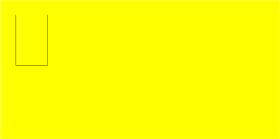


### beginPath

beginPath(): void

Creates a drawing path.

Since API version 9, this API is supported in ArkTS widgets.

 **Example**

  ```ts
  // xxx.ets
  @Entry
  @Component
  struct BeginPath {
    private settings: RenderingContextSettings = new RenderingContextSettings(true)
    private context: CanvasRenderingContext2D = new CanvasRenderingContext2D(this.settings)
    private offCanvas: OffscreenCanvas = new OffscreenCanvas(600, 600)

    build() {
      Flex({ direction: FlexDirection.Column, alignItems: ItemAlign.Center, justifyContent: FlexAlign.Center }) {
        Canvas(this.context)
          .width('100%')
          .height('100%')
          .backgroundColor('#ffff00')
          .onReady(() =>{
            let offContext = this.offCanvas.getContext("2d", this.settings)
            offContext.beginPath()
            offContext.lineWidth = 6
            offContext.strokeStyle = '#0000ff'
            offContext.moveTo(15, 80)
            offContext.lineTo(280, 160)
            offContext.stroke()
            let image = this.offCanvas.transferToImageBitmap()
            this.context.transferFromImageBitmap(image)
          })
      }
      .width('100%')
      .height('100%')
    }
  }
  ```

  


### moveTo

moveTo(x: number, y: number): void

Moves a drawing path to a target position on the canvas.

Since API version 9, this API is supported in ArkTS widgets.

 **Parameters**

| Name  | Type    | Mandatory  | Default Value | Description       |
| ---- | ------ | ---- | ---- | --------- |
| x    | number | Yes   | 0    | X-coordinate of the target position.|
| y    | number | Yes   | 0    | Y-coordinate of the target position.|

 **Example**

  ```ts
  // xxx.ets
  @Entry
  @Component
  struct MoveTo {
    private settings: RenderingContextSettings = new RenderingContextSettings(true)
    private context: CanvasRenderingContext2D = new CanvasRenderingContext2D(this.settings)
    private offCanvas: OffscreenCanvas = new OffscreenCanvas(600, 600)

    build() {
      Flex({ direction: FlexDirection.Column, alignItems: ItemAlign.Center, justifyContent: FlexAlign.Center }) {
        Canvas(this.context)
          .width('100%')
          .height('100%')
          .backgroundColor('#ffff00')
          .onReady(() =>{
            let offContext = this.offCanvas.getContext("2d", this.settings)
            offContext.beginPath()
            offContext.moveTo(10, 10)
            offContext.lineTo(280, 160)
            offContext.stroke()
            let image = this.offCanvas.transferToImageBitmap()
            this.context.transferFromImageBitmap(image)
          })
      }
      .width('100%')
      .height('100%')
    }
  }
  ```

  


### lineTo

lineTo(x: number, y: number): void

Connects the current point to a target position using a straight line.

Since API version 9, this API is supported in ArkTS widgets.

 **Parameters**

| Name  | Type    | Mandatory  | Default Value | Description       |
| ---- | ------ | ---- | ---- | --------- |
| x    | number | Yes   | 0    | X-coordinate of the target position.|
| y    | number | Yes   | 0    | Y-coordinate of the target position.|

 **Example**

  ```ts
  // xxx.ets
  @Entry
  @Component
  struct LineTo {
    private settings: RenderingContextSettings = new RenderingContextSettings(true)
    private context: CanvasRenderingContext2D = new CanvasRenderingContext2D(this.settings)
    private offCanvas: OffscreenCanvas = new OffscreenCanvas(600, 600)

    build() {
      Flex({ direction: FlexDirection.Column, alignItems: ItemAlign.Center, justifyContent: FlexAlign.Center }) {
        Canvas(this.context)
          .width('100%')
          .height('100%')
          .backgroundColor('#ffff00')
          .onReady(() =>{
            let offContext = this.offCanvas.getContext("2d", this.settings)
            offContext.beginPath()
            offContext.moveTo(10, 10)
            offContext.lineTo(280, 160)
            offContext.stroke()
            let image = this.offCanvas.transferToImageBitmap()
            this.context.transferFromImageBitmap(image)
          })
      }
      .width('100%')
      .height('100%')
    }
  }
  ```

  


### closePath

closePath(): void

Draws a closed path.

Since API version 9, this API is supported in ArkTS widgets.

 **Example**

  ```ts
  // xxx.ets
  @Entry
  @Component
  struct ClosePath {
    private settings: RenderingContextSettings = new RenderingContextSettings(true)
    private context: CanvasRenderingContext2D = new CanvasRenderingContext2D(this.settings)
    private offCanvas: OffscreenCanvas = new OffscreenCanvas(600, 600)

    build() {
      Flex({ direction: FlexDirection.Column, alignItems: ItemAlign.Center, justifyContent: FlexAlign.Center }) {
        Canvas(this.context)
          .width('100%')
          .height('100%')
          .backgroundColor('#ffff00')
          .onReady(() =>{
              let offContext = this.offCanvas.getContext("2d", this.settings)
              offContext.beginPath()
              offContext.moveTo(30, 30)
              offContext.lineTo(110, 30)
              offContext.lineTo(70, 90)
              offContext.closePath()
              offContext.stroke()
              let image = this.offCanvas.transferToImageBitmap()
              this.context.transferFromImageBitmap(image)
          })
      }
      .width('100%')
      .height('100%')
    }
  }
  ```

  


### createPattern

createPattern(image: ImageBitmap, repetition: string | null): CanvasPattern | null

Creates a pattern for image filling based on a specified source image and repetition mode.

Since API version 9, this API is supported in ArkTS widgets.

**Parameters**

| Name        | Type                                      | Mandatory  | Default Value | Description                                      |
| ---------- | ---------------------------------------- | ---- | ---- | ---------------------------------------- |
| image      | [ImageBitmap](ts-components-canvas-imagebitmap.md) | Yes   | null | Source image. For details, see **ImageBitmap**.                 |
| repetition | string                                   | Yes   | ""  | Repetition mode. The value can be **'repeat'**, **'repeat-x'**, **'repeat-y'**, **'no-repeat'**, **'clamp'**, or **'mirror'**.|

**Return value**

| Type                                      | Description                     |
| ---------------------------------------- | ----------------------- |
| [CanvasPattern](ts-components-canvas-canvaspattern.md#canvaspattern) | Created pattern for image filling based on a specified source image and repetition mode.|

 **Example**

  ```ts
  // xxx.ets
  @Entry
  @Component
  struct CreatePattern {
    private settings: RenderingContextSettings = new RenderingContextSettings(true)
    private context: CanvasRenderingContext2D = new CanvasRenderingContext2D(this.settings)
    private img:ImageBitmap = new ImageBitmap("common/images/icon.jpg")
    private offCanvas: OffscreenCanvas = new OffscreenCanvas(600, 600)

    build() {
      Flex({ direction: FlexDirection.Column, alignItems: ItemAlign.Center, justifyContent: FlexAlign.Center }) {
        Canvas(this.context)
          .width('100%')
          .height('100%')
          .backgroundColor('#ffff00')
          .onReady(() =>{
            let offContext = this.offCanvas.getContext("2d", this.settings)
            let pattern = offContext.createPattern(this.img, 'repeat')
            offContext.fillStyle = pattern as CanvasPattern
            offContext.fillRect(0, 0, 200, 200)
            let image = this.offCanvas.transferToImageBitmap()
            this.context.transferFromImageBitmap(image)
          })
      }
      .width('100%')
      .height('100%')
    }
  }
  ```

  


### bezierCurveTo

bezierCurveTo(cp1x: number, cp1y: number, cp2x: number, cp2y: number, x: number, y: number): void

Draws a cubic bezier curve on the canvas.

Since API version 9, this API is supported in ArkTS widgets.

 **Parameters**

| Name  | Type    | Mandatory  | Default Value | Description            |
| ---- | ------ | ---- | ---- | -------------- |
| cp1x | number | Yes   | 0    | X-coordinate of the first parameter of the bezier curve.|
| cp1y | number | Yes   | 0    | Y-coordinate of the first parameter of the bezier curve.|
| cp2x | number | Yes   | 0    | X-coordinate of the second parameter of the bezier curve.|
| cp2y | number | Yes   | 0    | Y-coordinate of the second parameter of the bezier curve.|
| x    | number | Yes   | 0    | X-coordinate of the end point on the bezier curve.   |
| y    | number | Yes   | 0    | Y-coordinate of the end point on the bezier curve.   |

 **Example**

  ```ts
  // xxx.ets
  @Entry
  @Component
  struct BezierCurveTo {
    private settings: RenderingContextSettings = new RenderingContextSettings(true)
    private context: CanvasRenderingContext2D = new CanvasRenderingContext2D(this.settings)
    private offCanvas: OffscreenCanvas = new OffscreenCanvas(600, 600)

    build() {
      Flex({ direction: FlexDirection.Column, alignItems: ItemAlign.Center, justifyContent: FlexAlign.Center }) {
        Canvas(this.context)
          .width('100%')
          .height('100%')
          .backgroundColor('#ffff00')
          .onReady(() =>{
            let offContext = this.offCanvas.getContext("2d", this.settings)
            offContext.beginPath()
            offContext.moveTo(10, 10)
            offContext.bezierCurveTo(20, 100, 200, 100, 200, 20)
            offContext.stroke()
            let image = this.offCanvas.transferToImageBitmap()
            this.context.transferFromImageBitmap(image)
          })
      }
      .width('100%')
      .height('100%')
    }
  }
  ```

  


### quadraticCurveTo

quadraticCurveTo(cpx: number, cpy: number, x: number, y: number): void

Draws a quadratic curve on the canvas.

Since API version 9, this API is supported in ArkTS widgets.

 **Parameters**

| Name  | Type    | Mandatory  | Default Value | Description         |
| ---- | ------ | ---- | ---- | ----------- |
| cpx  | number | Yes   | 0    | X-coordinate of the bezier curve parameter.|
| cpy  | number | Yes   | 0    | Y-coordinate of the bezier curve parameter.|
| x    | number | Yes   | 0    | X-coordinate of the end point on the bezier curve.|
| y    | number | Yes   | 0    | Y-coordinate of the end point on the bezier curve.|

 **Example**

  ```ts
  // xxx.ets
  @Entry
  @Component
  struct QuadraticCurveTo {
    private settings: RenderingContextSettings = new RenderingContextSettings(true)
    private context: CanvasRenderingContext2D = new CanvasRenderingContext2D(this.settings)
    private offCanvas: OffscreenCanvas = new OffscreenCanvas(600, 600)

    build() {
      Flex({ direction: FlexDirection.Column, alignItems: ItemAlign.Center, justifyContent: FlexAlign.Center }) {
        Canvas(this.context)
          .width('100%')
          .height('100%')
          .backgroundColor('#ffff00')
          .onReady(() =>{
            let offContext = this.offCanvas.getContext("2d", this.settings)
            offContext.beginPath()
            offContext.moveTo(20, 20)
            offContext.quadraticCurveTo(100, 100, 200, 20)
            offContext.stroke()
            let image = this.offCanvas.transferToImageBitmap()
            this.context.transferFromImageBitmap(image)
        })
      }
      .width('100%')
      .height('100%')
    }
  }
  ```

  


### arc

arc(x: number, y: number, radius: number, startAngle: number, endAngle: number, counterclockwise?: boolean): void

Draws an arc on the canvas.

Since API version 9, this API is supported in ArkTS widgets.

 **Parameters**

| Name              | Type     | Mandatory  | Default Value  | Description        |
| ---------------- | ------- | ---- | ----- | ---------- |
| x                | number  | Yes   | 0     | X-coordinate of the center point of the arc.|
| y                | number  | Yes   | 0     | Y-coordinate of the center point of the arc.|
| radius           | number  | Yes   | 0     | Radius of the arc.   |
| startAngle       | number  | Yes   | 0     | Start radian of the arc.  |
| endAngle         | number  | Yes   | 0     | End radian of the arc.  |
| counterclockwise | boolean | No   | false | Whether to draw the arc counterclockwise.|

 **Example**

  ```ts
  // xxx.ets
  @Entry
  @Component
  struct Arc {
    private settings: RenderingContextSettings = new RenderingContextSettings(true)
    private context: CanvasRenderingContext2D = new CanvasRenderingContext2D(this.settings)
    private offCanvas: OffscreenCanvas = new OffscreenCanvas(600, 600)

    build() {
      Flex({ direction: FlexDirection.Column, alignItems: ItemAlign.Center, justifyContent: FlexAlign.Center }) {
        Canvas(this.context)
          .width('100%')
          .height('100%')
          .backgroundColor('#ffff00')
          .onReady(() =>{
            let offContext = this.offCanvas.getContext("2d", this.settings)
            offContext.beginPath()
            offContext.arc(100, 75, 50, 0, 6.28)
            offContext.stroke()
            let image = this.offCanvas.transferToImageBitmap()
            this.context.transferFromImageBitmap(image)
          })
      }
      .width('100%')
      .height('100%')
    }
  }
  ```

  


### arcTo

arcTo(x1: number, y1: number, x2: number, y2: number, radius: number): void

Draws an arc based on the radius and points on the arc.

Since API version 9, this API is supported in ArkTS widgets.

 **Parameters**

| Name    | Type    | Mandatory  | Default Value | Description             |
| ------ | ------ | ---- | ---- | --------------- |
| x1     | number | Yes   | 0    | X-coordinate of the first point on the arc.|
| y1     | number | Yes   | 0    | Y-coordinate of the first point on the arc.|
| x2     | number | Yes   | 0    | X-coordinate of the second point on the arc.|
| y2     | number | Yes   | 0    | Y-coordinate of the second point on the arc.|
| radius | number | Yes   | 0    | Radius of the arc.       |

 **Example**

  ```ts
  // xxx.ets
  @Entry
  @Component
  struct ArcTo {
    private settings: RenderingContextSettings = new RenderingContextSettings(true)
    private context: CanvasRenderingContext2D = new CanvasRenderingContext2D(this.settings)
    private offCanvas: OffscreenCanvas = new OffscreenCanvas(600, 600)

    build() {
      Flex({ direction: FlexDirection.Column, alignItems: ItemAlign.Center, justifyContent: FlexAlign.Center }) {
        Canvas(this.context)
          .width('100%')
          .height('100%')
          .backgroundColor('#ffff00')
          .onReady(() =>{
            let offContext = this.offCanvas.getContext("2d", this.settings)
            offContext.moveTo(100, 20)
            offContext.arcTo(150, 20, 150, 70, 50)
            offContext.stroke()
            let image = this.offCanvas.transferToImageBitmap()
            this.context.transferFromImageBitmap(image)
          })
      }
      .width('100%')
      .height('100%')
    }
  }
  ```

  


### ellipse

ellipse(x: number, y: number, radiusX: number, radiusY: number, rotation: number, startAngle: number, endAngle: number, counterclockwise?: boolean): void

Draws an ellipse in the specified rectangular region on the canvas.

Since API version 9, this API is supported in ArkTS widgets.

 **Parameters**

| Name              | Type     | Mandatory  | Default Value  | Description                                      |
| ---------------- | ------- | ---- | ----- | ---------------------------------------- |
| x                | number  | Yes   | 0     | X-coordinate of the ellipse center.                              |
| y                | number  | Yes   | 0     | Y-coordinate of the ellipse center.                              |
| radiusX          | number  | Yes   | 0     | Ellipse radius on the x-axis.                              |
| radiusY          | number  | Yes   | 0     | Ellipse radius on the y-axis.                              |
| rotation         | number  | Yes   | 0     | Rotation angle of the ellipse. The unit is radian.                          |
| startAngle       | number  | Yes   | 0     | Angle of the start point for drawing the ellipse. The unit is radian.                       |
| endAngle         | number  | Yes   | 0     | Angle of the end point for drawing the ellipse. The unit is radian.                       |
| counterclockwise | boolean | No   | false | Whether to draw the ellipse counterclockwise.<br>**true**: Draw the ellipse counterclockwise.<br>**false**: Draw the ellipse clockwise.|

 **Example**

  ```ts
  // xxx.ets
  @Entry
  @Component
  struct CanvasExample {
    private settings: RenderingContextSettings = new RenderingContextSettings(true)
    private context: CanvasRenderingContext2D = new CanvasRenderingContext2D(this.settings)
    private offCanvas: OffscreenCanvas = new OffscreenCanvas(600, 600)
    build() {
      Flex({ direction: FlexDirection.Column, alignItems: ItemAlign.Center, justifyContent: FlexAlign.Center }) {
        Canvas(this.context)
          .width('100%')
          .height('100%')
          .backgroundColor('#ffff00')
          .onReady(() =>{
            let offContext = this.offCanvas.getContext("2d", this.settings)
            offContext.beginPath()
            offContext.ellipse(200, 200, 50, 100, Math.PI * 0.25, Math.PI * 0.5, Math.PI * 2)
            offContext.stroke()
            let image = this.offCanvas.transferToImageBitmap()
            this.context.transferFromImageBitmap(image)
          })
      }
      .width('100%')
      .height('100%')
    }
  }
  ```

  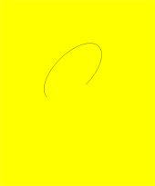


### rect

rect(x: number, y: number, w: number, h: number): void

Creates a rectangle on the canvas.

Since API version 9, this API is supported in ArkTS widgets.

 **Parameters**

| Name  | Type    | Mandatory  | Default Value | Description           |
| ---- | ------ | ---- | ---- | ------------- |
| x    | number | Yes   | 0    | X-coordinate of the upper left corner of the rectangle.|
| y    | number | Yes   | 0    | Y-coordinate of the upper left corner of the rectangle.|
| w    | number | Yes   | 0    | Width of the rectangle.     |
| h    | number | Yes   | 0    | Height of the rectangle.     |

 **Example**

  ```ts
  // xxx.ets
  @Entry
  @Component
  struct CanvasExample {
    private settings: RenderingContextSettings = new RenderingContextSettings(true)
    private context: CanvasRenderingContext2D = new CanvasRenderingContext2D(this.settings)
    private offCanvas: OffscreenCanvas = new OffscreenCanvas(600, 600)

    build() {
      Flex({ direction: FlexDirection.Column, alignItems: ItemAlign.Center, justifyContent: FlexAlign.Center }) {
        Canvas(this.context)
          .width('100%')
          .height('100%')
          .backgroundColor('#ffff00')
          .onReady(() =>{
            let offContext = this.offCanvas.getContext("2d", this.settings)
            offContext.rect(20, 20, 100, 100) // Create a 100*100 rectangle at (20, 20)
            offContext.stroke()
            let image = this.offCanvas.transferToImageBitmap()
            this.context.transferFromImageBitmap(image)
          })
      }
      .width('100%')
      .height('100%')
    }
  }
  ```

  


### fill

fill(fillRule?: CanvasFillRule): void

Fills the area inside a closed path on the canvas.

Since API version 9, this API is supported in ArkTS widgets.

**Parameters**

| Name      | Type            | Mandatory  | Default Value      | Description                                      |
| -------- | -------------- | ---- | --------- | ---------------------------------------- |
| fillRule | CanvasFillRule | No   | "nonzero" | Rule by which to determine whether a point is inside or outside the area to fill.<br>The options are **"nonzero"** and **"evenodd"**.|

  ```ts
  // xxx.ets
  @Entry
  @Component
  struct Fill {
    private settings: RenderingContextSettings = new RenderingContextSettings(true)
    private context: CanvasRenderingContext2D = new CanvasRenderingContext2D(this.settings)
    private offCanvas: OffscreenCanvas = new OffscreenCanvas(600, 600)

    build() {
      Flex({ direction: FlexDirection.Column, alignItems: ItemAlign.Center, justifyContent: FlexAlign.Center }) {
        Canvas(this.context)
          .width('100%')
          .height('100%')
          .backgroundColor('#ffff00')
          .onReady(() =>{
            let offContext = this.offCanvas.getContext("2d", this.settings)
            offContext.fillStyle = '#000000'
            offContext.rect(20, 20, 100, 100) // Create a 100*100 rectangle at (20, 20)
            offContext.fill()
            let image = this.offCanvas.transferToImageBitmap()
            this.context.transferFromImageBitmap(image)
          })
      }
      .width('100%')
      .height('100%')
    }
  }
  ```

  


fill(path: Path2D, fillRule?: CanvasFillRule): void

Fills the area inside a closed path on the canvas.

Since API version 9, this API is supported in ArkTS widgets.

**Parameters**

| Name      | Type            | Mandatory  | Default Value      | Description                                      |
| -------- | -------------- | ---- | --------- | ---------------------------------------- |
| path     | Path2D         | Yes   |           | A **Path2D** path to fill.                             |
| fillRule | CanvasFillRule | No   | "nonzero" | Rule by which to determine whether a point is inside or outside the area to fill.<br>The options are **"nonzero"** and **"evenodd"**.|


**Example**  

```ts
// xxx.ets
@Entry
@Component
struct Fill {
  private settings: RenderingContextSettings = new RenderingContextSettings(true)
  private context: CanvasRenderingContext2D = new CanvasRenderingContext2D(this.settings)
  private offCanvas: OffscreenCanvas = new OffscreenCanvas(600, 600)

  build() {
    Flex({ direction: FlexDirection.Column, alignItems: ItemAlign.Center, justifyContent: FlexAlign.Center }) {
      Canvas(this.context)
        .width('100%')
        .height('100%')
        .backgroundColor('#ffff00')
        .onReady(() =>{
          let offContext = this.offCanvas.getContext("2d", this.settings)
          let region = new Path2D()
          region.moveTo(30, 90)
          region.lineTo(110, 20)
          region.lineTo(240, 130)
          region.lineTo(60, 130)
          region.lineTo(190, 20)
          region.lineTo(270, 90)
          region.closePath()
          // Fill path
          offContext.fillStyle = '#00ff00'
          offContext.fill(region, "evenodd")
          let image = this.offCanvas.transferToImageBitmap()
          this.context.transferFromImageBitmap(image)
        })
    }
    .width('100%')
    .height('100%')
  }
}
```

 


### clip

clip(fillRule?: CanvasFillRule): void

Sets the current path to a clipping path.

Since API version 9, this API is supported in ArkTS widgets.

**Parameters**

| Name      | Type            | Mandatory  | Default Value      | Description                                      |
| -------- | -------------- | ---- | --------- | ---------------------------------------- |
| fillRule | CanvasFillRule | No   | "nonzero" | Rule by which to determine whether a point is inside or outside the area to clip.<br>The options are **"nonzero"** and **"evenodd"**.|

 **Example**

  ```ts
  // xxx.ets
  @Entry
  @Component
  struct Clip {
    private settings: RenderingContextSettings = new RenderingContextSettings(true)
    private context: CanvasRenderingContext2D = new CanvasRenderingContext2D(this.settings)
    private offCanvas: OffscreenCanvas = new OffscreenCanvas(600, 600)

    build() {
      Flex({ direction: FlexDirection.Column, alignItems: ItemAlign.Center, justifyContent: FlexAlign.Center }) {
        Canvas(this.context)
          .width('100%')
          .height('100%')
          .backgroundColor('#ffff00')
          .onReady(() =>{
            let offContext = this.offCanvas.getContext("2d", this.settings)
            offContext.rect(0, 0, 100, 200)
            offContext.stroke()
            offContext.clip()
            offContext.fillStyle = "rgb(255,0,0)"
            offContext.fillRect(0, 0, 200, 200)
            let image = this.offCanvas.transferToImageBitmap()
            this.context.transferFromImageBitmap(image)
          })
      }
      .width('100%')
      .height('100%')
    }
  }
  ```

  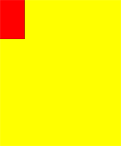


clip(path:Path2D, fillRule?: CanvasFillRule): void

Sets a closed path to a clipping path.

Since API version 9, this API is supported in ArkTS widgets.

**Parameters**

| Name      | Type            | Mandatory  | Default Value      | Description                                      |
| -------- | -------------- | ---- | --------- | ---------------------------------------- |
| path     | Path2D         | Yes   |           | A **Path2D** path to clip.                             |
| fillRule | CanvasFillRule | No   | "nonzero" | Rule by which to determine whether a point is inside or outside the area to clip.<br>The options are **"nonzero"** and **"evenodd"**.|

 **Example**

  ```ts
  // xxx.ets
  @Entry
  @Component
  struct Clip {
    private settings: RenderingContextSettings = new RenderingContextSettings(true)
    private context: CanvasRenderingContext2D = new CanvasRenderingContext2D(this.settings)
    private offCanvas: OffscreenCanvas = new OffscreenCanvas(600, 600)

    build() {
      Flex({ direction: FlexDirection.Column, alignItems: ItemAlign.Center, justifyContent: FlexAlign.Center }) {
        Canvas(this.context)
          .width('100%')
          .height('100%')
          .backgroundColor('#ffff00')
          .onReady(() =>{
            let offContext = this.offCanvas.getContext("2d", this.settings)
            let region = new Path2D()
            region.moveTo(30, 90)
            region.lineTo(110, 20)
            region.lineTo(240, 130)
            region.lineTo(60, 130)
            region.lineTo(190, 20)
            region.lineTo(270, 90)
            region.closePath()
            offContext.clip(region,"evenodd")
            offContext.fillStyle = "rgb(0,255,0)"
            offContext.fillRect(0, 0, 600, 600)
            let image = this.offCanvas.transferToImageBitmap()
            this.context.transferFromImageBitmap(image)
          })
      }
      .width('100%')
      .height('100%')
    }
  }
  ```

  


### filter

filter(filter: string): void

Sets a filter for the image on the canvas.

Since API version 9, this API is supported in ArkTS widgets.

**Parameters**

| Name    | Type    | Mandatory  | Default Value | Description                                      |
| ------ | ------ | ---- | ---- | ---------------------------------------- |
| filter | string | Yes   | -    | Functions that accept various filter effects. Available values are as follows:<br>- **'none'**: no filter effect.<br>- **'blur'**: applies the Gaussian blur for the image.<br>- **'brightness'**: applies a linear multiplication to the image to make it look brighter or darker.<br>- **'contrast'**: adjusts the image contrast.<br>- **'grayscale'**: converts the image to a grayscale image.<br>- **'hue-rotate'**: applies hue rotation to the image.<br>- **'invert'**: inverts the input image.<br>- **'opacity'**: sets the opacity of the image.<br>- **'saturate'**: sets the saturation of the image.<br>- **'sepia'**: converts the image to dark brown.<br>Default value: **'none'**|

**Example**
```ts
  // xxx.ets
  @Entry
  @Component
  struct FilterDemoOff {
    private settings: RenderingContextSettings = new RenderingContextSettings(true);
    private context: CanvasRenderingContext2D = new CanvasRenderingContext2D(this.settings);
    private offCanvas: OffscreenCanvas = new OffscreenCanvas(600, 600)
    private img:ImageBitmap = new ImageBitmap("common/images/example.jpg");

    build() {
      Flex({ direction: FlexDirection.Column, alignItems: ItemAlign.Center, justifyContent: FlexAlign.Center }) {
        Canvas(this.context)
          .width('100%')
          .height('100%')
          .backgroundColor('#ffff00')
          .onReady(() =>{
            let offContext = this.offCanvas.getContext("2d", this.settings)
            let offctx = offContext
            let img = this.img

            offctx.drawImage(img, 0, 0, 100, 100);

            offctx.filter = 'grayscale(50%)';
            offctx.drawImage(img, 100, 0, 100, 100);

            offctx.filter = 'sepia(60%)';
            offctx.drawImage(img, 200, 0, 100, 100);

            offctx.filter = 'saturate(30%)';
            offctx.drawImage(img, 0, 100, 100, 100);

            offctx.filter = 'hue-rotate(90degree)';
            offctx.drawImage(img, 100, 100, 100, 100);

            offctx.filter = 'invert(100%)';
            offctx.drawImage(img, 200, 100, 100, 100);

            offctx.filter = 'opacity(25%)';
            offctx.drawImage(img, 0, 200, 100, 100);

            offctx.filter = 'brightness(0.4)';
            offctx.drawImage(img, 100, 200, 100, 100);

            offctx.filter = 'contrast(200%)';
            offctx.drawImage(img, 200, 200, 100, 100);

            offctx.filter = 'blur(5px)';
            offctx.drawImage(img, 0, 300, 100, 100);

            let image = this.offCanvas.transferToImageBitmap()
            this.context.transferFromImageBitmap(image)
          })
      }
      .width('100%')
      .height('100%')
    }
  }
```


### resetTransform

resetTransform(): void

Resets the current transform to the identity matrix. This API is a void API.

Since API version 9, this API is supported in ArkTS widgets.


### direction

direction(direction: CanvasDirection): void

Sets the text direction for drawing text.

Since API version 9, this API is supported in ArkTS widgets.

**Example**
```ts
  // xxx.ets
  @Entry
  @Component
  struct DirectionDemoOff {
    private settings: RenderingContextSettings = new RenderingContextSettings(true);
    private context: CanvasRenderingContext2D = new CanvasRenderingContext2D(this.settings);
    private offCanvas: OffscreenCanvas = new OffscreenCanvas(600, 600)

    build() {
      Flex({ direction: FlexDirection.Column, alignItems: ItemAlign.Center, justifyContent: FlexAlign.Center }) {
        Canvas(this.context)
          .width('100%')
          .height('100%')
          .backgroundColor('#ffff00')
          .onReady(() =>{
            let offContext = this.offCanvas.getContext("2d", this.settings)
            let offctx = offContext
            offctx.font = '48px serif';
            offctx.textAlign = 'start'
            offctx.fillText("Hi ltr!", 200, 50);

            offctx.direction = "rtl";
            offctx.fillText("Hi rtl!", 200, 100);

            let image = offctx.transferToImageBitmap()
            this.context.transferFromImageBitmap(image)
          })
      }
      .width('100%')
      .height('100%')
    }
  }
```


### rotate

rotate(angle: number): void

Rotates a canvas clockwise around its coordinate axes.

Since API version 9, this API is supported in ArkTS widgets.

 **Parameters**

| Name   | Type    | Mandatory  | Default Value | Description                                      |
| ----- | ------ | ---- | ---- | ---------------------------------------- |
| angle | number | Yes   | 0    | Clockwise rotation angle. You can use **Math.PI / 180** to convert the angle to a radian.|

 **Example**

  ```ts
  // xxx.ets
  @Entry
  @Component
  struct Rotate {
    private settings: RenderingContextSettings = new RenderingContextSettings(true)
    private context: CanvasRenderingContext2D = new CanvasRenderingContext2D(this.settings)
    private offCanvas: OffscreenCanvas = new OffscreenCanvas(600, 600)

    build() {
      Flex({ direction: FlexDirection.Column, alignItems: ItemAlign.Center, justifyContent: FlexAlign.Center }) {
        Canvas(this.context)
          .width('100%')
          .height('100%')
          .backgroundColor('#ffff00')
          .onReady(() =>{
            let offContext = this.offCanvas.getContext("2d", this.settings)
            offContext.rotate(45 * Math.PI / 180)
            offContext.fillRect(70, 20, 50, 50)
            let image = this.offCanvas.transferToImageBitmap()
            this.context.transferFromImageBitmap(image)
          })
      }
      .width('100%')
      .height('100%')
    }
  }
  ```

  


### scale

scale(x: number, y: number): void

Scales the canvas based on scale factors.

Since API version 9, this API is supported in ArkTS widgets.

 **Parameters**

| Name  | Type    | Mandatory  | Default Value | Description         |
| ---- | ------ | ---- | ---- | ----------- |
| x    | number | Yes   | 0    | Horizontal scale factor.|
| y    | number | Yes   | 0    | Vertical scale factor.|

 **Example**

  ```ts
  // xxx.ets
  @Entry
  @Component
  struct Scale {
    private settings: RenderingContextSettings = new RenderingContextSettings(true)
    private context: CanvasRenderingContext2D = new CanvasRenderingContext2D(this.settings)
    private offCanvas: OffscreenCanvas = new OffscreenCanvas(600, 600)

    build() {
      Flex({ direction: FlexDirection.Column, alignItems: ItemAlign.Center, justifyContent: FlexAlign.Center }) {
        Canvas(this.context)
          .width('100%')
          .height('100%')
          .backgroundColor('#ffff00')
          .onReady(() =>{
            let offContext = this.offCanvas.getContext("2d", this.settings)
            offContext.lineWidth = 3
            offContext.strokeRect(30, 30, 50, 50)
            offContext.scale(2, 2) // Scale to 200%
            offContext.strokeRect(30, 30, 50, 50)
            let image = this.offCanvas.transferToImageBitmap()
            this.context.transferFromImageBitmap(image)
          })
      }
      .width('100%')
      .height('100%')
    }
  }
  ```

  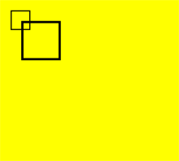


### transform

transform(a: number, b: number, c: number, d: number, e: number, f: number): void

Defines a transformation matrix. To transform a graph, you only need to set parameters of the matrix. The coordinates of the graph are multiplied by the matrix values to obtain new coordinates of the transformed graph. You can use the matrix to implement multiple transform effects.

Since API version 9, this API is supported in ArkTS widgets.

> **NOTE**
> The following formulas calculate coordinates of the transformed graph. **x** and **y** represent coordinates before transformation, and **x'** and **y'** represent coordinates after transformation.
>
> - x' = scaleX \* x + skewY \* y + translateX
>
> - y' = skewX \* x + scaleY \* y + translateY

**Parameters**

| Name  | Type    | Mandatory  | Default Value | Description                  |
| ---- | ------ | ---- | ---- | -------------------- |
| a    | number | Yes   | 0    | X-axis scale.    |
| b    | number | Yes   | 0    | X-axis skew.     |
| c    | number | Yes   | 0    | Y-axis skew.     |
| d    | number | Yes   | 0    | Y-axis scale.    |
| e    | number | Yes   | 0    | X-axis translation.|
| f    | number | Yes   | 0    | Y-axis translation.|

 **Example**

  ```ts
  // xxx.ets
  @Entry
  @Component
  struct Transform {
    private settings: RenderingContextSettings = new RenderingContextSettings(true)
    private context: CanvasRenderingContext2D = new CanvasRenderingContext2D(this.settings)
    private offCanvas: OffscreenCanvas = new OffscreenCanvas(600, 600)

    build() {
      Flex({ direction: FlexDirection.Column, alignItems: ItemAlign.Center, justifyContent: FlexAlign.Center }) {
        Canvas(this.context)
          .width('100%')
          .height('100%')
          .backgroundColor('#ffff00')
          .onReady(() =>{
            let offContext = this.offCanvas.getContext("2d", this.settings)
            offContext.fillStyle = 'rgb(0,0,0)'
            offContext.fillRect(0, 0, 100, 100)
            offContext.transform(1, 0.5, -0.5, 1, 10, 10)
            offContext.fillStyle = 'rgb(255,0,0)'
            offContext.fillRect(0, 0, 100, 100)
            offContext.transform(1, 0.5, -0.5, 1, 10, 10)
            offContext.fillStyle = 'rgb(0,0,255)'
            offContext.fillRect(0, 0, 100, 100)
            let image = this.offCanvas.transferToImageBitmap()
            this.context.transferFromImageBitmap(image)
          })
      }
      .width('100%')
      .height('100%')
    }
  }
  ```

  


### setTransform

setTransform(a: number, b: number, c: number, d: number, e: number, f: number): void

Resets the existing transformation matrix and creates a new transformation matrix by using the same parameters as the **transform()** API.

Since API version 9, this API is supported in ArkTS widgets.

**Parameters**

| Name  | Type    | Mandatory  | Default Value | Description                  |
| ---- | ------ | ---- | ---- | -------------------- |
| a    | number | Yes   | 0    | X-axis scale.    |
| b    | number | Yes   | 0    | X-axis skew.     |
| c    | number | Yes   | 0    | Y-axis skew.     |
| d    | number | Yes   | 0    | Y-axis scale.    |
| e    | number | Yes   | 0    | X-axis translation.|
| f    | number | Yes   | 0    | Y-axis translation.|

 **Example**

  ```ts
  // xxx.ets
  @Entry
  @Component
  struct SetTransform {
    private settings: RenderingContextSettings = new RenderingContextSettings(true)
    private context: CanvasRenderingContext2D = new CanvasRenderingContext2D(this.settings)
    private offCanvas: OffscreenCanvas = new OffscreenCanvas(600, 600)

    build() {
      Flex({ direction: FlexDirection.Column, alignItems: ItemAlign.Center, justifyContent: FlexAlign.Center }) {
        Canvas(this.context)
          .width('100%')
          .height('100%')
          .backgroundColor('#ffff00')
          .onReady(() =>{
            let offContext = this.offCanvas.getContext("2d", this.settings)
            offContext.fillStyle = 'rgb(255,0,0)'
            offContext.fillRect(0, 0, 100, 100)
            offContext.setTransform(1,0.5, -0.5, 1, 10, 10)
            offContext.fillStyle = 'rgb(0,0,255)'
            offContext.fillRect(0, 0, 100, 100)
            let image = this.offCanvas.transferToImageBitmap()
            this.context.transferFromImageBitmap(image)
          })
      }
      .width('100%')
      .height('100%')
    }
  }
  ```

  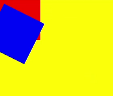


### setTransform

setTransform(transform?: Matrix2D): void

Resets the current transformation and creates a new transformation matrix based on the specified **Matrix2D** object.

Since API version 9, this API is supported in ArkTS widgets.

**Parameters**

| Name   | Type                                      | Mandatory  | Default Value | Description   |
| --------- | ---------------------------------------- | ---- | ---- | ----- |
| transform | [Matrix2D](ts-components-canvas-matrix2d.md#Matrix2D) | No   | null | Transformation matrix.|

### getTransform

getTransform(): Matrix2D

Obtains the current transformation matrix being applied to the context.

Since API version 9, this API is supported in ArkTS widgets.

**Return value**

| Type                                      | Description   |
| ---------------------------------------- | ----- |
| [Matrix2D](ts-components-canvas-matrix2d.md#Matrix2D) | Matrix object.|

**Example**

  ```ts
  // xxx.ets
  @Entry
  @Component
  struct TransFormDemo {
    private settings: RenderingContextSettings = new RenderingContextSettings(true);
    private context1: CanvasRenderingContext2D = new CanvasRenderingContext2D(this.settings);
    private offcontext1: OffscreenCanvasRenderingContext2D = new OffscreenCanvasRenderingContext2D(600, 100, this.settings);
    private context2: CanvasRenderingContext2D = new CanvasRenderingContext2D(this.settings);
    private offcontext2: OffscreenCanvasRenderingContext2D = new OffscreenCanvasRenderingContext2D(600, 100, this.settings);

    build() {
      Flex({ direction: FlexDirection.Column, alignItems: ItemAlign.Center, justifyContent: FlexAlign.Center }) {
        Text('context1');
        Canvas(this.context1)
          .width('230vp')
          .height('120vp')
          .backgroundColor('#ffff00')
          .onReady(() =>{
            this.offcontext1.fillRect(50, 50, 50, 50);
            this.offcontext1.setTransform(1.2, Math.PI/8, Math.PI/6, 0.5, 30, -25);
            this.offcontext1.fillRect(50, 50, 50, 50);
            let image = this.offcontext1.transferToImageBitmap();
            this.context1.transferFromImageBitmap(image);
          })
        Text('context2');
        Canvas(this.context2)
          .width('230vp')
          .height('120vp')
          .backgroundColor('#0ffff0')
          .onReady(() =>{
            this.offcontext2.fillRect(50, 50, 50, 50);
            let storedTransform = this.offcontext1.getTransform();
            console.log("Matrix [scaleX = " + storedTransform.scaleX + ", scaleY = " + storedTransform.scaleY +
            ", rotateX = " + storedTransform.rotateX + ", rotateY = " + storedTransform.rotateY +
            ", translateX = " + storedTransform.translateX + ", translateY = " + storedTransform.translateY + "]")
            this.offcontext2.setTransform(storedTransform);
            this.offcontext2.fillRect(50,50,50,50);
            let image = this.offcontext2.transferToImageBitmap();
            this.context2.transferFromImageBitmap(image);
          })
      }
      .width('100%')
      .height('100%')
    }
  }
  ```

  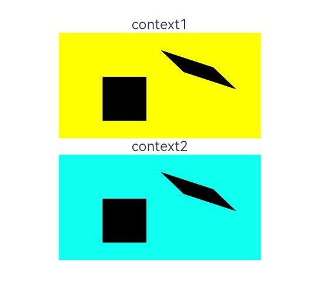
  
### translate

translate(x: number, y: number): void

Moves the origin of the coordinate system.

Since API version 9, this API is supported in ArkTS widgets.

 **Parameters**

| Name  | Type    | Mandatory  | Default Value | Description      |
| ---- | ------ | ---- | ---- | -------- |
| x    | number | Yes   | 0    | X-axis translation.|
| y    | number | Yes   | 0    | Y-axis translation.|

 **Example**

  ```ts
  // xxx.ets
  @Entry
  @Component
  struct Translate {
    private settings: RenderingContextSettings = new RenderingContextSettings(true)
    private context: CanvasRenderingContext2D = new CanvasRenderingContext2D(this.settings)
    private offCanvas: OffscreenCanvas = new OffscreenCanvas(600, 600)

    build() {
      Flex({ direction: FlexDirection.Column, alignItems: ItemAlign.Center, justifyContent: FlexAlign.Center }) {
        Canvas(this.context)
          .width('100%')
          .height('100%')
          .backgroundColor('#ffff00')
          .onReady(() =>{
            let offContext = this.offCanvas.getContext("2d", this.settings)
            offContext.fillRect(10, 10, 50, 50)
            offContext.translate(70, 70)
            offContext.fillRect(10, 10, 50, 50)
            let image = this.offCanvas.transferToImageBitmap()
            this.context.transferFromImageBitmap(image)
          })
      }
      .width('100%')
      .height('100%')
    }
  }
  ```

  


### drawImage

drawImage(image: ImageBitmap | PixelMap, dx: number, dy: number): void

drawImage(image: ImageBitmap | PixelMap, dx: number, dy: number, dw: number, dh: number): void

drawImage(image: ImageBitmap | PixelMap, sx: number, sy: number, sw: number, sh: number, dx: number, dy: number, dw: number, dh: number):void

Draws an image on the canvas.

Since API version 9, this API is supported in ArkTS widgets, except that **PixelMap** objects are not supported.

 **Parameters**

| Name   | Type                                      | Mandatory  | Default Value | Description                           |
| ----- | ---------------------------------------- | ---- | ---- | ----------------------------- |
| image | [ImageBitmap](ts-components-canvas-imagebitmap.md) or [PixelMap](../apis/js-apis-image.md#pixelmap7)| Yes   | null | Image resource. For details, see **ImageBitmap** or **PixelMap**.|
| sx    | number                                   | No   | 0    | X-coordinate of the upper left corner of the rectangle used to crop the source image.         |
| sy    | number                                   | No   | 0    | Y-coordinate of the upper left corner of the rectangle used to crop the source image.         |
| sw    | number                                   | No   | 0    | Target width to crop the source image.               |
| sh    | number                                   | No   | 0    | Target height to crop the source image.               |
| dx    | number                                   | Yes   | 0    | X-coordinate of the upper left corner of the drawing area on the canvas.               |
| dy    | number                                   | Yes   | 0    | Y-coordinate of the upper left corner of the drawing area on the canvas.         |
| dw    | number                                   | No   | 0    | Width of the drawing area.                     |
| dh    | number                                   | No   | 0    | Height of the drawing area.                     |


 **Example**

  ```ts
  // xxx.ets
  @Entry
  @Component
  struct DrawImage {
    private settings: RenderingContextSettings = new RenderingContextSettings(true)
    private context: CanvasRenderingContext2D = new CanvasRenderingContext2D(this.settings)
    private img:ImageBitmap = new ImageBitmap("common/images/icon.jpg")
    private offCanvas: OffscreenCanvas = new OffscreenCanvas(600, 600)
    build() {
      Flex({ direction: FlexDirection.Column, alignItems: ItemAlign.Center, justifyContent: FlexAlign.Center }) {
        Canvas(this.context)
        .width('100%')
        .height('100%')
        .backgroundColor('#ffff00')
        .onReady(() => {
            let offContext = this.offCanvas.getContext("2d", this.settings)
            offContext.drawImage( this.img,0,0,400,200)
            let image = this.offCanvas.transferToImageBitmap()
            this.context.transferFromImageBitmap(image)
        })
      }
      .width('100%')
      .height('100%')
    }
  }
  ```

  


### createImageData

createImageData(sw: number, sh: number): ImageData

Creates an **[ImageData](ts-components-canvas-imagedata.md)** object with the specified dimensions.

Since API version 9, this API is supported in ArkTS widgets.

 **Parameters**

| Name  | Type    | Mandatory  | Default Value  | Description           |
| ---- | ------ | ---- | ---- | ------------- |
| sw   | number | Yes   | 0    | Width of the **ImageData** object.|
| sh   | number | Yes   | 0    | Height of the **ImageData** object.|


createImageData(imageData: ImageData): ImageData

Creates an **[ImageData](ts-components-canvas-imagedata.md)** object by copying an existing **ImageData** object.

Since API version 9, this API is supported in ArkTS widgets.

 **Parameters**

| Name       | Type                                      | Mandatory  | Default Value  | Description              |
| --------- | ---------------------------------------- | ---- | ---- | ---------------- |
| imagedata | [ImageData](ts-components-canvas-imagedata.md) | Yes   | null | **ImageData** object to copy.|

 **Return value**

| Type                                      | Description           |
| ---------------------------------------- | ------------- |
| [ImageData](ts-components-canvas-imagedata.md) | New **ImageData** object.|

### getPixelMap

getPixelMap(sx: number, sy: number, sw: number, sh: number): PixelMap

Obtains the **[PixelMap](../apis/js-apis-image.md#pixelmap7)** object created with the pixels within the specified area on the canvas.

 **Parameters**

| Name  | Type    | Mandatory  | Default Value | Description             |
| ---- | ------ | ---- | ---- | --------------- |
| sx   | number | Yes   | 0    | X-coordinate of the upper left corner of the output area.|
| sy   | number | Yes   | 0    | Y-coordinate of the upper left corner of the output area.|
| sw   | number | Yes   | 0    | Width of the output area.    |
| sh   | number | Yes   | 0    | Height of the output area.    |

**Return value**

| Type                                      | Description          |
| ---------------------------------------- | ------------ |
| [PixelMap](../apis/js-apis-image.md#pixelmap7) | **PixelMap** object.|

### setPixelMap

setPixelMap(value?: PixelMap): void

Draws the input [PixelMap](../apis/js-apis-image.md#pixelmap7) object on the canvas.

 **Parameters**

| Name  | Type    | Mandatory  | Default Value | Description             |
| ---- | ------ | ---- | ---- | --------------- |
| sx   | number | Yes   | 0    | X-coordinate of the upper left corner of the output area.|
| sy   | number | Yes   | 0    | Y-coordinate of the upper left corner of the output area.|
| sw   | number | Yes   | 0    | Width of the output area.    |
| sh   | number | Yes   | 0    | Height of the output area.    |

**Return value**

| Type                                      | Description          |
| ---------------------------------------- | ------------ |
| [PixelMap](../apis/js-apis-image.md#pixelmap7) | **PixelMap** object.|


### getImageData

getImageData(sx: number, sy: number, sw: number, sh: number): ImageData

Obtains the **[ImageData](ts-components-canvas-imagedata.md)** object created with the pixels within the specified area on the canvas.

Since API version 9, this API is supported in ArkTS widgets.

 **Parameters**

| Name  | Type    | Mandatory  | Default Value | Description             |
| ---- | ------ | ---- | ---- | --------------- |
| sx   | number | Yes   | 0    | X-coordinate of the upper left corner of the output area.|
| sy   | number | Yes   | 0    | Y-coordinate of the upper left corner of the output area.|
| sw   | number | Yes   | 0    | Width of the output area.    |
| sh   | number | Yes   | 0    | Height of the output area.    |

   **Return value**

| Type                                      | Description           |
| ---------------------------------------- | ------------- |
| [ImageData](ts-components-canvas-imagedata.md) | New **ImageData** object.|


**Example**

  ```ts
  // xxx.ets
  @Entry
  @Component
  struct GetImageData {
    private settings: RenderingContextSettings = new RenderingContextSettings(true)
    private context: CanvasRenderingContext2D = new CanvasRenderingContext2D(this.settings)
    private offCanvas: OffscreenCanvas = new OffscreenCanvas(600, 600)
    private img:ImageBitmap = new ImageBitmap("/common/images/1234.png")

    build() {
      Flex({ direction: FlexDirection.Column, alignItems: ItemAlign.Center, justifyContent: FlexAlign.Center }) {
        Canvas(this.context)
          .width('100%')
          .height('100%')
          .backgroundColor('#ffff00')
          .onReady(() =>{
            let offContext = this.offCanvas.getContext("2d", this.settings)
            offContext.drawImage(this.img,0,0,130,130)
            let imagedata = offContext.getImageData(50,50,130,130)
            offContext.putImageData(imagedata,150,150)
            let image = this.offCanvas.transferToImageBitmap()
            this.context.transferFromImageBitmap(image)
          })
      }
      .width('100%')
      .height('100%')
    }
  }
  ```

  


### putImageData

putImageData(imageData: Object, dx: number | string, dy: number | string): void

putImageData(imageData: Object, dx: number | string, dy: number | string, dirtyX: number | string, dirtyY: number | string, dirtyWidth?: number | string, dirtyHeight: number | string): void

Puts an **[ImageData](ts-components-canvas-imagedata.md)** object onto a rectangular area on the canvas.

Since API version 9, this API is supported in ArkTS widgets.

 **Parameters**

| Name         | Type                                      | Mandatory  | Default Value         | Description                           |
| ----------- | ---------------------------------------- | ---- | ------------ | ----------------------------- |
| imagedata   | Object                                   | Yes   | null         | **ImageData** object with pixels to put onto the canvas.           |
| dx          | number \| string<sup>10+</sup> | Yes   | 0            | X-axis offset of the rectangular area on the canvas.               |
| dy          | number \| string<sup>10+</sup> | Yes   | 0            | Y-axis offset of the rectangular area on the canvas.               |
| dirtyX      | number \| string<sup>10+</sup> | No   | 0            | X-axis offset of the upper left corner of the rectangular area relative to that of the source image.|
| dirtyY      | number \| string<sup>10+</sup> | No   | 0            | Y-axis offset of the upper left corner of the rectangular area relative to that of the source image.|
| dirtyWidth  | number \| string<sup>10+</sup> | No   | Width of the **ImageData** object| Width of the rectangular area to crop the source image.              |
| dirtyHeight | number \| string<sup>10+</sup> | No   | Height of the **ImageData** object| Height of the rectangular area to crop the source image.              |

 **Example**

  ```ts
  // xxx.ets
  @Entry
  @Component
  struct PutImageData {
    private settings: RenderingContextSettings = new RenderingContextSettings(true)
    private context: CanvasRenderingContext2D = new CanvasRenderingContext2D(this.settings)
    private offCanvas: OffscreenCanvas = new OffscreenCanvas(600, 600)
    build() {
      Flex({ direction: FlexDirection.Column, alignItems: ItemAlign.Center, justifyContent: FlexAlign.Center }) {
        Canvas(this.context)
          .width('100%')
          .height('100%')
          .backgroundColor('#ffff00')
          .onReady(() =>{
            let offContext = this.offCanvas.getContext("2d", this.settings)
            let imageData = offContext.createImageData(100, 100)
            for (let i = 0; i < imageData.data.length; i += 4) {
              imageData.data[i + 0] = 255
              imageData.data[i + 1] = 0
              imageData.data[i + 2] = 255
              imageData.data[i + 3] = 255
            }
            offContext.putImageData(imageData, 10, 10)
            let image = this.offCanvas.transferToImageBitmap()
            this.context.transferFromImageBitmap(image)
          })
      }
      .width('100%')
      .height('100%')
    }
  }
  ```

  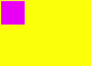

### setLineDash

setLineDash(segments: number[]): void

Sets the dash line style.

Since API version 9, this API is supported in ArkTS widgets.

**Parameters**

| Name      | Type      | Description                 |
| -------- | -------- | ------------------- |
| segments | number[] | An array of numbers that specify distances to alternately draw a line and a gap.|

**Example**

  ```ts
  @Entry
  @Component
  struct SetLineDash {
    private settings: RenderingContextSettings = new RenderingContextSettings(true)
    private context: CanvasRenderingContext2D = new CanvasRenderingContext2D(this.settings)
    private offCanvas: OffscreenCanvas = new OffscreenCanvas(600, 600)
    
    build() {
      Flex({ direction: FlexDirection.Column, alignItems: ItemAlign.Center, justifyContent: FlexAlign.Center }) {
        Canvas(this.context)
          .width('100%')
          .height('100%')
          .backgroundColor('#ffff00')
          .onReady(() =>{
            let offContext = this.offCanvas.getContext("2d", this.settings)
            offContext.arc(100, 75, 50, 0, 6.28)
            offContext.setLineDash([10,20])
            offContext.stroke()
            let image = this.offCanvas.transferToImageBitmap()
            this.context.transferFromImageBitmap(image)
        })
      }
      .width('100%')
      .height('100%')
    }
  }
  ```
  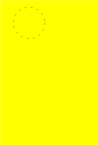


### getLineDash

getLineDash(): number[]

Obtains the dash line style.

Since API version 9, this API is supported in ArkTS widgets.

**Return value**

| Type      | Description                      |
| -------- | ------------------------ |
| number[] | An array describing the interval of alternate line segments and length of spacing.|

**Example**

  ```ts
  // xxx.ets
  @Entry
  @Component
  struct OffscreenCanvasGetLineDash {
    @State message: string = 'Hello World'
    private settings: RenderingContextSettings = new RenderingContextSettings(true)
    private context: CanvasRenderingContext2D = new CanvasRenderingContext2D(this.settings)
    private offCanvas: OffscreenCanvas = new OffscreenCanvas(600, 600)
    build() {
      Row() {
        Column() {
          Text(this.message)
            .fontSize(50)
            .fontWeight(FontWeight.Bold)
            .onClick(()=>{
              console.error('before getlinedash clicked')
              let offContext = this.offCanvas.getContext("2d", this.settings)
              let res = offContext.getLineDash()
              console.error(JSON.stringify(res))
            })
          Canvas(this.context)
            .width('100%')
            .height('100%')
            .backgroundColor('#ffff00')
            .onReady(() => {
              let offContext = this.offCanvas.getContext("2d", this.settings)
              offContext.arc(100, 75, 50, 0, 6.28)
              offContext.setLineDash([10,20])
              offContext.stroke()
              let res = offContext.getLineDash()
              let image = this.offCanvas.transferToImageBitmap()
              this.context.transferFromImageBitmap(image)
            })
        }
        .width('100%')
      }
      .height('100%')
    }
  }
  ```
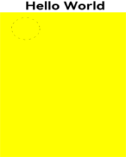 


### toDataURL

toDataURL(type?: string, quality?: number): string

Generates a URL containing image display information.

Since API version 9, this API is supported in ArkTS widgets.

**Parameters**

| Name    | Type  | Mandatory  | Description                                      |
| ------- | ------ | ---- | ---------------------------------------- |
| type    | string | No   | Image format. The default value is **image/png**.           |
| quality | number | No   | Image quality, which ranges from 0 to 1, when the image format is **image/jpeg** or **image/webp**. If the set value is beyond the value range, the default value **0.92** is used.|

**Return value**

| Type    | Description       |
| ------ | --------- |
| string | Image URL.|

**Example**

  ```ts
  // xxx.ets  
  @Entry
  @Component
  struct ToDataURL {
      private settings: RenderingContextSettings = new RenderingContextSettings(true)
      private context: CanvasRenderingContext2D = new CanvasRenderingContext2D(this.settings)
      private offCanvas: OffscreenCanvas = new OffscreenCanvas(600, 600)

    build() {
      Flex({ direction: FlexDirection.Column, alignItems: ItemAlign.Center, justifyContent: FlexAlign.Center }) {
        Canvas(this.context)
          .width('100%')
          .height('100%')
          .backgroundColor('#ffff00')
          .onReady(() =>{
            let offContext = this.offCanvas.getContext("2d", this.settings)
            let dataURL = offContext.toDataURL()
          })
      }
      .width('100%')
      .height('100%')
    }
  }
  ```


### imageSmoothingQuality

imageSmoothingQuality(quality: imageSmoothingQuality)

Sets the quality of image smoothing.

Since API version 9, this API is supported in ArkTS widgets.

 **Parameters**

| Name     | Type                   | Description                                      |
| ------- | --------------------- | ---------------------------------------- |
| quality | imageSmoothingQuality | Quality of image smoothing.<br>- **'low'**: low quality.<br>- **'medium'**: medium quality.<br>- **'high'**: high quality.|

**Example**
```ts
  // xxx.ets
  @Entry
  @Component
  struct ImageSmoothingQualityDemoOff {
    private settings: RenderingContextSettings = new RenderingContextSettings(true);
    private context: CanvasRenderingContext2D = new CanvasRenderingContext2D(this.settings);
    private offCanvas: OffscreenCanvas = new OffscreenCanvas(600, 600)
    private img:ImageBitmap = new ImageBitmap("common/images/example.jpg");

    build() {
      Flex({ direction: FlexDirection.Column, alignItems: ItemAlign.Center, justifyContent: FlexAlign.Center }) {
        Canvas(this.context)
          .width('100%')
          .height('100%')
          .backgroundColor('#ffff00')
          .onReady(() =>{
            let offContext = this.offCanvas.getContext("2d", this.settings)
            let offctx = offContext
            offctx.imageSmoothingEnabled = true
            offctx.imageSmoothingQuality = 'high'
            offctx.drawImage(this.img, 0, 0, 400, 200)

            let image = this.offCanvas.transferToImageBitmap()
            this.context.transferFromImageBitmap(image)
          })
      }
      .width('100%')
      .height('100%')
    }
  }
```


### transferToImageBitmap

transferToImageBitmap(): ImageBitmap

Creates an **ImageBitmap** object on the most recently rendered image of the **OffscreenCanvas**.

**Return value**

| Type                                      | Description             |
| ---------------------------------------- | --------------- |
| [ImageBitmap](ts-components-canvas-imagebitmap.md) | Pixel data rendered on the **OffscreenCanvas**.|


 **Example**

  ```ts
  // xxx.ets
  @Entry
  @Component
  struct PutImageData {
    private settings: RenderingContextSettings = new RenderingContextSettings(true)
    private context: CanvasRenderingContext2D = new CanvasRenderingContext2D(this.settings)
    private offCanvas: OffscreenCanvas = new OffscreenCanvas(600, 600)

    build() {
      Flex({ direction: FlexDirection.Column, alignItems: ItemAlign.Center, justifyContent: FlexAlign.Center }) {
        Canvas(this.context)
          .width('100%')
          .height('100%')
          .backgroundColor('#ffff00')
          .onReady(() =>{
            let offContext = this.offCanvas.getContext("2d", this.settings)
            let imageData = offContext.createImageData(100, 100)
            for (let i = 0; i < imageData.data.length; i += 4) {
              imageData.data[i + 0] = 255
              imageData.data[i + 1] = 0
              imageData.data[i + 2] = 255
              imageData.data[i + 3] = 255
            }
            offContext.putImageData(imageData, 10, 10)
            let image = this.offCanvas.transferToImageBitmap()
            this.context.transferFromImageBitmap(image)
          })
      }
      .width('100%')
      .height('100%')
    }
  }
  ```
 

### restore

restore(): void

Restores the saved drawing context.

Since API version 9, this API is supported in ArkTS widgets.

 **Example**

  ```ts
  // xxx.ets
  @Entry
  @Component
  struct CanvasExample {
    private settings: RenderingContextSettings = new RenderingContextSettings(true)
    private context: CanvasRenderingContext2D = new CanvasRenderingContext2D(this.settings)
    private offCanvas: OffscreenCanvas = new OffscreenCanvas(600, 600)
    
    build() {
      Flex({ direction: FlexDirection.Column, alignItems: ItemAlign.Center, justifyContent: FlexAlign.Center }) {
        Canvas(this.context)
          .width('100%')
          .height('100%')
          .backgroundColor('#ffff00')
          .onReady(() =>{
            let offContext = this.offCanvas.getContext("2d", this.settings)
            offContext.save() // save the default state
            offContext.fillStyle = "#00ff00"
            offContext.fillRect(20, 20, 100, 100)
            offContext.restore() // restore to the default state
            offContext.fillRect(150, 75, 100, 100)
            let image = this.offCanvas.transferToImageBitmap()
            this.context.transferFromImageBitmap(image)
          })
      }
      .width('100%')
      .height('100%')
    }
  }
  ```
 


### save

save(): void

Saves the current drawing context.

Since API version 9, this API is supported in ArkTS widgets.

 **Example**

  ```ts
  // xxx.ets
  @Entry
  @Component
  struct CanvasExample {
    private settings: RenderingContextSettings = new RenderingContextSettings(true)
    private context: CanvasRenderingContext2D = new CanvasRenderingContext2D(this.settings)
    private offCanvas: OffscreenCanvas = new OffscreenCanvas(600, 600)
    
    build() {
      Flex({ direction: FlexDirection.Column, alignItems: ItemAlign.Center, justifyContent: FlexAlign.Center }) {
        Canvas(this.context)
          .width('100%')
          .height('100%')
          .backgroundColor('#ffff00')
          .onReady(() =>{
            let offContext = this.offCanvas.getContext("2d", this.settings)
            offContext.save() // save the default state
            offContext.fillStyle = "#00ff00"
            offContext.fillRect(20, 20, 100, 100)
            offContext.restore() // restore to the default state
            offContext.fillRect(150, 75, 100, 100)
            let image = this.offCanvas.transferToImageBitmap()
            this.context.transferFromImageBitmap(image)
          })
      }
      .width('100%')
      .height('100%')
    }
  }
  ```
 


### createLinearGradient

createLinearGradient(x0: number, y0: number, x1: number, y1: number): void

Creates a linear gradient.

Since API version 9, this API is supported in ArkTS widgets.

 **Parameters**

| Name  | Type    | Mandatory  | Default Value | Description      |
| ---- | ------ | ---- | ---- | -------- |
| x0   | number | Yes   | 0    | X-coordinate of the start point.|
| y0   | number | Yes   | 0    | Y-coordinate of the start point.|
| x1   | number | Yes   | 0    | X-coordinate of the end point.|
| y1   | number | Yes   | 0    | Y-coordinate of the end point.|

 **Example**

  ```ts
  // xxx.ets
  @Entry
  @Component
  struct CreateLinearGradient {
    private settings: RenderingContextSettings = new RenderingContextSettings(true)
    private context: CanvasRenderingContext2D = new CanvasRenderingContext2D(this.settings)
    private offCanvas: OffscreenCanvas = new OffscreenCanvas(600, 600)
    
    build() {
      Flex({ direction: FlexDirection.Column, alignItems: ItemAlign.Center, justifyContent: FlexAlign.Center }) {
        Canvas(this.context)
          .width('100%')
          .height('100%')
          .backgroundColor('#ffff00')
          .onReady(() =>{
            let offContext = this.offCanvas.getContext("2d", this.settings)
            let grad = offContext.createLinearGradient(50,0, 300,100)
            grad.addColorStop(0.0, '#ff0000')
            grad.addColorStop(0.5, '#ffffff')
            grad.addColorStop(1.0, '#00ff00')
            offContext.fillStyle = grad
            offContext.fillRect(0, 0, 400, 400)
            let image = this.offCanvas.transferToImageBitmap()
            this.context.transferFromImageBitmap(image)
          })
      }
      .width('100%')
      .height('100%')
    }
  }
  ```

  


### createRadialGradient

createRadialGradient(x0: number, y0: number, r0: number, x1: number, y1: number, r1: number): void

Creates a linear gradient.

Since API version 9, this API is supported in ArkTS widgets.

  **Parameters**

| Name  | Type    | Mandatory  | Default Value | Description               |
| ---- | ------ | ---- | ---- | ----------------- |
| x0   | number | Yes   | 0    | X-coordinate of the center of the start circle.        |
| y0   | number | Yes   | 0    | Y-coordinate of the center of the start circle.        |
| r0   | number | Yes   | 0    | Radius of the start circle, which must be a non-negative finite number.|
| x1   | number | Yes   | 0    | X-coordinate of the center of the end circle.        |
| y1   | number | Yes   | 0    | Y-coordinate of the center of the end circle.        |
| r1   | number | Yes   | 0    | Radius of the end circle, which must be a non-negative finite number.|

  **Example** 

  ```ts
  // xxx.ets
  @Entry
  @Component
  struct CreateRadialGradient {
    private settings: RenderingContextSettings = new RenderingContextSettings(true)
    private context: CanvasRenderingContext2D = new CanvasRenderingContext2D(this.settings)
    private offCanvas: OffscreenCanvas = new OffscreenCanvas(600, 600)
    
    build() {
      Flex({ direction: FlexDirection.Column, alignItems: ItemAlign.Center, justifyContent: FlexAlign.Center }) {
        Canvas(this.context)
          .width('100%')
          .height('100%')
          .backgroundColor('#ffff00')
          .onReady(() =>{
            let offContext = this.offCanvas.getContext("2d", this.settings)
            let grad = offContext.createRadialGradient(200,200,50, 200,200,200)
            grad.addColorStop(0.0, '#ff0000')
            grad.addColorStop(0.5, '#ffffff')
            grad.addColorStop(1.0, '#00ff00')
            offContext.fillStyle = grad
            offContext.fillRect(0, 0, 440, 440)
            let image = this.offCanvas.transferToImageBitmap()
            this.context.transferFromImageBitmap(image)
          })
      }
      .width('100%')
      .height('100%')
    }
  }
  ```

  

### createConicGradient<sup>10+</sup>

createConicGradient(startAngle: number, x: number, y: number): CanvasGradient

Creates a conic gradient.

**Parameters**

| Name        | Type    | Mandatory  | Default Value | Description                                 |
| ---------- | ------ | ---- | ---- | ----------------------------------- |
| startAngle | number | Yes   | 0    | Angle at which the gradient starts, in radians. The angle measurement starts horizontally from the right side of the center and moves clockwise.|
| x          | number | Yes   | 0    | X-coordinate of the center of the conic gradient, in vp.                  |
| y          | number | Yes   | 0    | Y-coordinate of the center of the conic gradient, in vp.                  |

**Example**

```ts
// xxx.ets
@Entry
@Component
struct OffscreenCanvasConicGradientPage {
  private settings: RenderingContextSettings = new RenderingContextSettings(true)
  private context: CanvasRenderingContext2D = new CanvasRenderingContext2D(this.settings)
  private offCanvas: OffscreenCanvas = new OffscreenCanvas(600, 600)

  build() {
    Flex({ direction: FlexDirection.Column, alignItems: ItemAlign.Center, justifyContent: FlexAlign.Center }) {
      Canvas(this.context)
        .width('100%')
        .height('100%')
        .backgroundColor('#ffffff')
        .onReady(() =>{
          let offContext = this.offCanvas.getContext("2d", this.settings)
          let grad = offContext.createConicGradient(0, 50, 80)
          grad.addColorStop(0.0, '#ff0000')
          grad.addColorStop(0.5, '#ffffff')
          grad.addColorStop(1.0, '#00ff00')
          offContext.fillStyle = grad
          offContext.fillRect(0, 30, 100, 100)
          let image = this.offCanvas.transferToImageBitmap()
          this.context.transferFromImageBitmap(image)
        })
    }
    .width('100%')
    .height('100%')
  }
}
```

  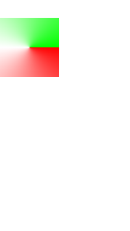
