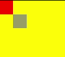

# OffscreenCanvasRenderingConxt2D<a name="EN-US_TOPIC_0000001192595178"></a>

> **NOTE:** 
>This component is supported since API version 8. Updates will be marked with a superscript to indicate their earliest API version.

Use  **OffscreenCanvasRenderingContext2D**  to draw rectangles, images, and text offscreen onto a canvas. Drawing offscreen onto a canvas is a process where content to draw onto the canvas is first drawn in the buffer, and then converted into a picture, and finally the picture is drawn on the canvas. This process increases the drawing efficiency.

## APIs<a name="section15647101282420"></a>

OffscreenCanvasRenderingContext2D\(width: number, height: number, setting: RenderingContextSettings\)

-   Parameters

    <a name="table193606194544"></a>
    <table><thead align="left"><tr id="row536071910541"><th class="cellrowborder" valign="top" width="12.540000000000001%" id="mcps1.1.6.1.1"><p id="p436112199544"><a name="p436112199544"></a><a name="p436112199544"></a>Name</p>
    </th>
    <th class="cellrowborder" valign="top" width="20.150000000000002%" id="mcps1.1.6.1.2"><p id="p19361319115410"><a name="p19361319115410"></a><a name="p19361319115410"></a>Type</p>
    </th>
    <th class="cellrowborder" valign="top" width="12.49%" id="mcps1.1.6.1.3"><p id="p9361201975417"><a name="p9361201975417"></a><a name="p9361201975417"></a>Mandatory</p>
    </th>
    <th class="cellrowborder" valign="top" width="18.6%" id="mcps1.1.6.1.4"><p id="p43611199542"><a name="p43611199542"></a><a name="p43611199542"></a>Default Value</p>
    </th>
    <th class="cellrowborder" valign="top" width="36.22%" id="mcps1.1.6.1.5"><p id="p1136141975419"><a name="p1136141975419"></a><a name="p1136141975419"></a>Description</p>
    </th>
    </tr>
    </thead>
    <tbody><tr id="row373833719443"><td class="cellrowborder" valign="top" width="12.540000000000001%" headers="mcps1.1.6.1.1 "><p id="p6739113714414"><a name="p6739113714414"></a><a name="p6739113714414"></a>width</p>
    </td>
    <td class="cellrowborder" valign="top" width="20.150000000000002%" headers="mcps1.1.6.1.2 "><p id="p773933764415"><a name="p773933764415"></a><a name="p773933764415"></a>number</p>
    </td>
    <td class="cellrowborder" valign="top" width="12.49%" headers="mcps1.1.6.1.3 "><p id="p2073933724411"><a name="p2073933724411"></a><a name="p2073933724411"></a>Yes</p>
    </td>
    <td class="cellrowborder" valign="top" width="18.6%" headers="mcps1.1.6.1.4 "><p id="p473973724414"><a name="p473973724414"></a><a name="p473973724414"></a>-</p>
    </td>
    <td class="cellrowborder" valign="top" width="36.22%" headers="mcps1.1.6.1.5 "><p id="p373903794414"><a name="p373903794414"></a><a name="p373903794414"></a>Width of the offscreen canvas.</p>
    </td>
    </tr>
    <tr id="row3164103312448"><td class="cellrowborder" valign="top" width="12.540000000000001%" headers="mcps1.1.6.1.1 "><p id="p1116523312443"><a name="p1116523312443"></a><a name="p1116523312443"></a>height</p>
    </td>
    <td class="cellrowborder" valign="top" width="20.150000000000002%" headers="mcps1.1.6.1.2 "><p id="p916573315443"><a name="p916573315443"></a><a name="p916573315443"></a>number</p>
    </td>
    <td class="cellrowborder" valign="top" width="12.49%" headers="mcps1.1.6.1.3 "><p id="p816518332441"><a name="p816518332441"></a><a name="p816518332441"></a>Yes</p>
    </td>
    <td class="cellrowborder" valign="top" width="18.6%" headers="mcps1.1.6.1.4 "><p id="p13166193314446"><a name="p13166193314446"></a><a name="p13166193314446"></a>-</p>
    </td>
    <td class="cellrowborder" valign="top" width="36.22%" headers="mcps1.1.6.1.5 "><p id="p1316683314413"><a name="p1316683314413"></a><a name="p1316683314413"></a>Height of the offscreen canvas.</p>
    </td>
    </tr>
    <tr id="row10361101915545"><td class="cellrowborder" valign="top" width="12.540000000000001%" headers="mcps1.1.6.1.1 "><p id="p1361119155417"><a name="p1361119155417"></a><a name="p1361119155417"></a>setting</p>
    </td>
    <td class="cellrowborder" valign="top" width="20.150000000000002%" headers="mcps1.1.6.1.2 "><p id="p8361181913548"><a name="p8361181913548"></a><a name="p8361181913548"></a><a href="ts-canvasrenderingcontext2d.md#section189411348141711">RenderingContextSettings</a></p>
    </td>
    <td class="cellrowborder" valign="top" width="12.49%" headers="mcps1.1.6.1.3 "><p id="p153611119195411"><a name="p153611119195411"></a><a name="p153611119195411"></a>Yes</p>
    </td>
    <td class="cellrowborder" valign="top" width="18.6%" headers="mcps1.1.6.1.4 "><p id="p1436114193546"><a name="p1436114193546"></a><a name="p1436114193546"></a>-</p>
    </td>
    <td class="cellrowborder" valign="top" width="36.22%" headers="mcps1.1.6.1.5 "><p id="p328155017218"><a name="p328155017218"></a><a name="p328155017218"></a>For details, see APIs of <a href="ts-canvasrenderingcontext2d.md#section189411348141711">RenderingContextSettings</a>.</p>
    </td>
    </tr>
    </tbody>
    </table>


## Attributes<a name="section122871125229"></a>

<a name="table5448mcpsimp"></a>
<table><thead align="left"><tr id="row5456mcpsimp"><th class="cellrowborder" valign="top" width="13.951395139513952%" id="mcps1.1.5.1.1"><p id="p5458mcpsimp"><a name="p5458mcpsimp"></a><a name="p5458mcpsimp"></a>Name</p>
</th>
<th class="cellrowborder" valign="top" width="26.732673267326728%" id="mcps1.1.5.1.2"><p id="p5460mcpsimp"><a name="p5460mcpsimp"></a><a name="p5460mcpsimp"></a>Type</p>
</th>
<th class="cellrowborder" valign="top" width="9.68096809680968%" id="mcps1.1.5.1.3"><p id="p138236401285"><a name="p138236401285"></a><a name="p138236401285"></a>Default Value</p>
</th>
<th class="cellrowborder" valign="top" width="49.63496349634964%" id="mcps1.1.5.1.4"><p id="p5466mcpsimp"><a name="p5466mcpsimp"></a><a name="p5466mcpsimp"></a>Description</p>
</th>
</tr>
</thead>
<tbody><tr id="row5467mcpsimp"><td class="cellrowborder" valign="top" width="13.951395139513952%" headers="mcps1.1.5.1.1 "><p id="p194373617255"><a name="p194373617255"></a><a name="p194373617255"></a><a href="ts-canvasrenderingcontext2d.md#section14391838151316">fillStyle</a></p>
</td>
<td class="cellrowborder" valign="top" width="26.732673267326728%" headers="mcps1.1.5.1.2 "><p id="p5471mcpsimp"><a name="p5471mcpsimp"></a><a name="p5471mcpsimp"></a>&lt;color&gt; | <a href="ts-components-canvas-canvasgradient.md">CanvasGradient</a> | <a href="#section146853345417">CanvasPattern</a></p>
</td>
<td class="cellrowborder" valign="top" width="9.68096809680968%" headers="mcps1.1.5.1.3 "><p id="p128231040182817"><a name="p128231040182817"></a><a name="p128231040182817"></a>-</p>
</td>
<td class="cellrowborder" valign="top" width="49.63496349634964%" headers="mcps1.1.5.1.4 "><p id="p5477mcpsimp"><a name="p5477mcpsimp"></a><a name="p5477mcpsimp"></a>Style to fill an area.</p>
<a name="ul139315155296"></a><a name="ul139315155296"></a><ul id="ul139315155296"><li>When the type is <strong id="b106882466137"><a name="b106882466137"></a><a name="b106882466137"></a>&lt;color&gt;</strong>, this parameter indicates the color of the filling area.</li><li>When the type is <strong id="b11267174921311"><a name="b11267174921311"></a><a name="b11267174921311"></a>CanvasGradient</strong>, this parameter indicates a gradient object, which is created using the <a href="#section14582213497">createLinearGradient</a> method.</li><li>When the type is <strong id="b141595917138"><a name="b141595917138"></a><a name="b141595917138"></a>CanvasPattern</strong>, use the <a href="#section660873113512">createPattern</a> method to create a pattern.</li></ul>
</td>
</tr>
<tr id="row5478mcpsimp"><td class="cellrowborder" valign="top" width="13.951395139513952%" headers="mcps1.1.5.1.1 "><p id="p5480mcpsimp"><a name="p5480mcpsimp"></a><a name="p5480mcpsimp"></a><a href="ts-canvasrenderingcontext2d.md#section104861220181415">lineWidth</a></p>
</td>
<td class="cellrowborder" valign="top" width="26.732673267326728%" headers="mcps1.1.5.1.2 "><p id="p19243401305"><a name="p19243401305"></a><a name="p19243401305"></a>number</p>
</td>
<td class="cellrowborder" valign="top" width="9.68096809680968%" headers="mcps1.1.5.1.3 "><p id="p88231840142814"><a name="p88231840142814"></a><a name="p88231840142814"></a>-</p>
</td>
<td class="cellrowborder" valign="top" width="49.63496349634964%" headers="mcps1.1.5.1.4 "><p id="p5488mcpsimp"><a name="p5488mcpsimp"></a><a name="p5488mcpsimp"></a>Line width.</p>
</td>
</tr>
<tr id="row1930464616243"><td class="cellrowborder" valign="top" width="13.951395139513952%" headers="mcps1.1.5.1.1 "><p id="p9305154611244"><a name="p9305154611244"></a><a name="p9305154611244"></a><a href="ts-canvasrenderingcontext2d.md#section1216741261620">strokeStyle</a></p>
</td>
<td class="cellrowborder" valign="top" width="26.732673267326728%" headers="mcps1.1.5.1.2 "><p id="p143052463243"><a name="p143052463243"></a><a name="p143052463243"></a>&lt;color&gt; | <a href="ts-components-canvas-canvasgradient.md">CanvasGradient</a> | <a href="#section146853345417">CanvasPattern</a></p>
</td>
<td class="cellrowborder" valign="top" width="9.68096809680968%" headers="mcps1.1.5.1.3 "><p id="p103051746202413"><a name="p103051746202413"></a><a name="p103051746202413"></a>-</p>
</td>
<td class="cellrowborder" valign="top" width="49.63496349634964%" headers="mcps1.1.5.1.4 "><p id="p1431612011267"><a name="p1431612011267"></a><a name="p1431612011267"></a>Stroke style.</p>
<a name="ul53168018260"></a><a name="ul53168018260"></a><ul id="ul53168018260"><li>When the type is <strong id="b1272718106144"><a name="b1272718106144"></a><a name="b1272718106144"></a>&lt;color&gt;</strong>, this parameter indicates the stroke color.</li><li>When the type is <strong id="b136731013111411"><a name="b136731013111411"></a><a name="b136731013111411"></a>CanvasGradient</strong>, this parameter indicates a gradient object, which is created using the <a href="#section14582213497">createLinearGradient</a> method.</li><li>When the type is <strong id="b16389122216144"><a name="b16389122216144"></a><a name="b16389122216144"></a>CanvasPattern</strong>, use the <a href="#section660873113512">createPattern</a> method to create a pattern.</li></ul>
</td>
</tr>
<tr id="row1491315492523"><td class="cellrowborder" valign="top" width="13.951395139513952%" headers="mcps1.1.5.1.1 "><p id="p6914104918527"><a name="p6914104918527"></a><a name="p6914104918527"></a><a href="ts-canvasrenderingcontext2d.md#section887817337173">lineCap</a></p>
</td>
<td class="cellrowborder" valign="top" width="26.732673267326728%" headers="mcps1.1.5.1.2 "><p id="p12914449165217"><a name="p12914449165217"></a><a name="p12914449165217"></a>string</p>
</td>
<td class="cellrowborder" valign="top" width="9.68096809680968%" headers="mcps1.1.5.1.3 "><p id="p4914194995218"><a name="p4914194995218"></a><a name="p4914194995218"></a>'butt'</p>
</td>
<td class="cellrowborder" valign="top" width="49.63496349634964%" headers="mcps1.1.5.1.4 "><p id="p388031620530"><a name="p388031620530"></a><a name="p388031620530"></a>Style of the specified line endpoint. The options are as follows:</p>
<a name="ul4880171605310"></a><a name="ul4880171605310"></a><ul id="ul4880171605310"><li><strong id="b1179624771415"><a name="b1179624771415"></a><a name="b1179624771415"></a>'butt'</strong>: The endpoints of the line are squared off.</li><li><strong id="b566834812143"><a name="b566834812143"></a><a name="b566834812143"></a>'round'</strong>: The endpoints of the line are rounded.</li><li><strong id="b526055861410"><a name="b526055861410"></a><a name="b526055861410"></a>'square'</strong>: The endpoints of the line are squared off, and each endpoint has added a rectangle whose length is the same as the line thickness and whose width is half of the line thickness.</li></ul>
</td>
</tr>
<tr id="row3349241115414"><td class="cellrowborder" valign="top" width="13.951395139513952%" headers="mcps1.1.5.1.1 "><p id="p034954105410"><a name="p034954105410"></a><a name="p034954105410"></a><a href="ts-canvasrenderingcontext2d.md#section77593271919">lineJoin</a></p>
</td>
<td class="cellrowborder" valign="top" width="26.732673267326728%" headers="mcps1.1.5.1.2 "><p id="p1835013416547"><a name="p1835013416547"></a><a name="p1835013416547"></a>string</p>
</td>
<td class="cellrowborder" valign="top" width="9.68096809680968%" headers="mcps1.1.5.1.3 "><p id="p03501741145413"><a name="p03501741145413"></a><a name="p03501741145413"></a>'miter'</p>
</td>
<td class="cellrowborder" valign="top" width="49.63496349634964%" headers="mcps1.1.5.1.4 "><p id="p1529212156559"><a name="p1529212156559"></a><a name="p1529212156559"></a>Style of the intersection point between line segments. The options are as follows:</p>
<a name="ul929219154551"></a><a name="ul929219154551"></a><ul id="ul929219154551"><li><strong id="b16173105121518"><a name="b16173105121518"></a><a name="b16173105121518"></a>'round'</strong>: The intersection is a sector, whose radius at the rounded corner is equal to the line width.</li><li><strong id="b337867141516"><a name="b337867141516"></a><a name="b337867141516"></a>'bevel'</strong>: The intersection is a triangle. The rectangular corner of each line is independent.</li><li><strong id="b2318128161512"><a name="b2318128161512"></a><a name="b2318128161512"></a>'miter'</strong>: The intersection has a miter corner by extending the outside edges of the lines until they meet. You can view the effect of this attribute in <strong id="b23182891517"><a name="b23182891517"></a><a name="b23182891517"></a>miterLimit</strong>.</li></ul>
</td>
</tr>
<tr id="row169726172599"><td class="cellrowborder" valign="top" width="13.951395139513952%" headers="mcps1.1.5.1.1 "><p id="p10972217205918"><a name="p10972217205918"></a><a name="p10972217205918"></a><a href="ts-canvasrenderingcontext2d.md#section177441243427">miterLimit</a></p>
</td>
<td class="cellrowborder" valign="top" width="26.732673267326728%" headers="mcps1.1.5.1.2 "><p id="p1997281785917"><a name="p1997281785917"></a><a name="p1997281785917"></a>number</p>
</td>
<td class="cellrowborder" valign="top" width="9.68096809680968%" headers="mcps1.1.5.1.3 "><p id="p997311725915"><a name="p997311725915"></a><a name="p997311725915"></a>10</p>
</td>
<td class="cellrowborder" valign="top" width="49.63496349634964%" headers="mcps1.1.5.1.4 "><p id="p1797319176594"><a name="p1797319176594"></a><a name="p1797319176594"></a>Maximum miter length. The miter length is the distance between the inner corner and the outer corner where two lines meet.</p>
</td>
</tr>
<tr id="row17431738523"><td class="cellrowborder" valign="top" width="13.951395139513952%" headers="mcps1.1.5.1.1 "><p id="p9437315210"><a name="p9437315210"></a><a name="p9437315210"></a><a href="ts-canvasrenderingcontext2d.md#section185699365434">font</a></p>
</td>
<td class="cellrowborder" valign="top" width="26.732673267326728%" headers="mcps1.1.5.1.2 "><p id="p54315316521"><a name="p54315316521"></a><a name="p54315316521"></a>string</p>
</td>
<td class="cellrowborder" valign="top" width="9.68096809680968%" headers="mcps1.1.5.1.3 "><p id="p5122135214815"><a name="p5122135214815"></a><a name="p5122135214815"></a>'normal normal 14px sans-serif'</p>
</td>
<td class="cellrowborder" valign="top" width="49.63496349634964%" headers="mcps1.1.5.1.4 "><p id="p112514494494"><a name="p112514494494"></a><a name="p112514494494"></a>Font style.</p>
<p id="p24315121810"><a name="p24315121810"></a><a name="p24315121810"></a>Syntax: ctx.font='font-size font-family'</p>
<a name="ul9432122811"></a><a name="ul9432122811"></a><ul id="ul9432122811"><li>(Optional) <strong id="b11650111410151"><a name="b11650111410151"></a><a name="b11650111410151"></a>font-size</strong>: font size and row height. The unit can only be pixels.</li><li>(Optional) <strong id="b578872620155"><a name="b578872620155"></a><a name="b578872620155"></a>font-family</strong>: font family.</li></ul>
<p id="p14804172734717"><a name="p14804172734717"></a><a name="p14804172734717"></a>Syntax: ctx.font='font-style font-weight font-size font-family'</p>
<a name="ul128041227164715"></a><a name="ul128041227164715"></a><ul id="ul128041227164715"><li>(Optional) <strong id="b7948334181516"><a name="b7948334181516"></a><a name="b7948334181516"></a>font-style</strong>: specifies the font style. Available values are <strong id="b209491334101516"><a name="b209491334101516"></a><a name="b209491334101516"></a>'normal'</strong> and <strong id="b18950934121510"><a name="b18950934121510"></a><a name="b18950934121510"></a>'italic'</strong>.</li><li>(Optional) <strong id="b3794164641514"><a name="b3794164641514"></a><a name="b3794164641514"></a>font-weight</strong>: font weight. Available values are as follows: <strong id="b12795134611154"><a name="b12795134611154"></a><a name="b12795134611154"></a>'normal'</strong>, <strong id="b20795446161514"><a name="b20795446161514"></a><a name="b20795446161514"></a>'bold'</strong>, <strong id="b6796846141518"><a name="b6796846141518"></a><a name="b6796846141518"></a>'bolder'</strong>, <strong id="b137971246131516"><a name="b137971246131516"></a><a name="b137971246131516"></a>'lighter'</strong>, <strong id="b20797124619158"><a name="b20797124619158"></a><a name="b20797124619158"></a>100</strong>, <strong id="b1579814681515"><a name="b1579814681515"></a><a name="b1579814681515"></a>200</strong>, <strong id="b279904612157"><a name="b279904612157"></a><a name="b279904612157"></a>300</strong>, <strong id="b197997469158"><a name="b197997469158"></a><a name="b197997469158"></a>400</strong>, <strong id="b158001846191518"><a name="b158001846191518"></a><a name="b158001846191518"></a>500</strong>, <strong id="b1880012462156"><a name="b1880012462156"></a><a name="b1880012462156"></a>600</strong>, <strong id="b1380134691510"><a name="b1380134691510"></a><a name="b1380134691510"></a>700</strong>, <strong id="b9802114610157"><a name="b9802114610157"></a><a name="b9802114610157"></a>800</strong>, <strong id="b1180274681513"><a name="b1180274681513"></a><a name="b1180274681513"></a>900</strong></li><li>(Optional) <strong id="b15634165212153"><a name="b15634165212153"></a><a name="b15634165212153"></a>font-size</strong>: font size and row height. The unit can only be pixels.</li><li>(Optional) <strong id="b118781255141516"><a name="b118781255141516"></a><a name="b118781255141516"></a>font-family</strong>: font family. Available values are <strong id="b98791655191516"><a name="b98791655191516"></a><a name="b98791655191516"></a>'sans-serif'</strong>, <strong id="b11879155516155"><a name="b11879155516155"></a><a name="b11879155516155"></a>'serif'</strong>, and <strong id="b7880185521511"><a name="b7880185521511"></a><a name="b7880185521511"></a>'monospace'</strong>.</li></ul>
</td>
</tr>
<tr id="row568518327518"><td class="cellrowborder" valign="top" width="13.951395139513952%" headers="mcps1.1.5.1.1 "><p id="p10685203255117"><a name="p10685203255117"></a><a name="p10685203255117"></a><a href="ts-canvasrenderingcontext2d.md#section41621415164419">textAlign</a></p>
</td>
<td class="cellrowborder" valign="top" width="26.732673267326728%" headers="mcps1.1.5.1.2 "><p id="p206851132195115"><a name="p206851132195115"></a><a name="p206851132195115"></a>string</p>
</td>
<td class="cellrowborder" valign="top" width="9.68096809680968%" headers="mcps1.1.5.1.3 "><p id="p768516327516"><a name="p768516327516"></a><a name="p768516327516"></a>'left'</p>
</td>
<td class="cellrowborder" valign="top" width="49.63496349634964%" headers="mcps1.1.5.1.4 "><p id="p1268512328512"><a name="p1268512328512"></a><a name="p1268512328512"></a>Text alignment mode. Available values are as follows:</p>
<a name="ul47713282523"></a><a name="ul47713282523"></a><ul id="ul47713282523"><li><strong id="b1948595831513"><a name="b1948595831513"></a><a name="b1948595831513"></a>'left'</strong>: The text is left-aligned.</li><li><strong id="b2431359181519"><a name="b2431359181519"></a><a name="b2431359181519"></a>'right'</strong>: The text is right-aligned.</li><li><strong id="b126301312161"><a name="b126301312161"></a><a name="b126301312161"></a>'center'</strong>: The text is center-aligned.</li><li><strong id="b65461523168"><a name="b65461523168"></a><a name="b65461523168"></a>'start'</strong>: The text is aligned with the start bound.</li><li><strong id="b1321174161614"><a name="b1321174161614"></a><a name="b1321174161614"></a>'end'</strong>: The text is aligned with the end bound.</li></ul>
<div class="note" id="note18771928165213"><a name="note18771928165213"></a><a name="note18771928165213"></a><span class="notetitle"> NOTE: </span><div class="notebody"><p id="p977142811526"><a name="p977142811526"></a><a name="p977142811526"></a>In the <strong id="b1989017411618"><a name="b1989017411618"></a><a name="b1989017411618"></a>ltr</strong> layout mode, the value <strong id="b14890114181614"><a name="b14890114181614"></a><a name="b14890114181614"></a>start</strong> equals <strong id="b1789110417164"><a name="b1789110417164"></a><a name="b1789110417164"></a>left</strong>. In the <strong id="b12891134151611"><a name="b12891134151611"></a><a name="b12891134151611"></a>rtl</strong> layout mode, the value <strong id="b98924471611"><a name="b98924471611"></a><a name="b98924471611"></a>start</strong> equals <strong id="b1893164181619"><a name="b1893164181619"></a><a name="b1893164181619"></a>right</strong>.</p>
</div></div>
</td>
</tr>
<tr id="row162312415315"><td class="cellrowborder" valign="top" width="13.951395139513952%" headers="mcps1.1.5.1.1 "><p id="p1729812301537"><a name="p1729812301537"></a><a name="p1729812301537"></a><a href="ts-canvasrenderingcontext2d.md#section0497195924412">textBaseline</a></p>
</td>
<td class="cellrowborder" valign="top" width="26.732673267326728%" headers="mcps1.1.5.1.2 "><p id="p56231324155312"><a name="p56231324155312"></a><a name="p56231324155312"></a>string</p>
</td>
<td class="cellrowborder" valign="top" width="9.68096809680968%" headers="mcps1.1.5.1.3 "><p id="p1862372445314"><a name="p1862372445314"></a><a name="p1862372445314"></a>'alphabetic'</p>
</td>
<td class="cellrowborder" valign="top" width="49.63496349634964%" headers="mcps1.1.5.1.4 "><p id="p1662319249536"><a name="p1662319249536"></a><a name="p1662319249536"></a>Horizontal alignment mode of text. Available values are as follows:</p>
<a name="ul1944781165420"></a><a name="ul1944781165420"></a><ul id="ul1944781165420"><li><strong id="b121789918166"><a name="b121789918166"></a><a name="b121789918166"></a>'alphabetic'</strong>: The text baseline is the normal alphabetic baseline.</li><li><strong id="b844971031620"><a name="b844971031620"></a><a name="b844971031620"></a>'top'</strong>: The text baseline is on the top of the text bounding box.</li><li><strong id="b15473171121618"><a name="b15473171121618"></a><a name="b15473171121618"></a>'hanging'</strong>: The text baseline is a hanging baseline over the text.</li><li><strong id="b2019281213169"><a name="b2019281213169"></a><a name="b2019281213169"></a>'middle'</strong>: The text baseline is in the middle of the text bounding box.</li><li><strong id="b11714136168"><a name="b11714136168"></a><a name="b11714136168"></a>'ideographic'</strong>: The text baseline is the ideographic baseline. If a character exceeds the alphabetic baseline, the ideographic baseline is located at the bottom of the excess character.</li><li><strong id="b10936171441614"><a name="b10936171441614"></a><a name="b10936171441614"></a>'bottom'</strong>: The text baseline is at the bottom of the text bounding box. Its difference from the ideographic baseline is that the ideographic baseline does not consider letters in the next line.</li></ul>
</td>
</tr>
<tr id="row1861912319472"><td class="cellrowborder" valign="top" width="13.951395139513952%" headers="mcps1.1.5.1.1 "><p id="p6620153194714"><a name="p6620153194714"></a><a name="p6620153194714"></a><a href="ts-canvasrenderingcontext2d.md#section14962525174510">globalAlpha</a></p>
</td>
<td class="cellrowborder" valign="top" width="26.732673267326728%" headers="mcps1.1.5.1.2 "><p id="p0620143114710"><a name="p0620143114710"></a><a name="p0620143114710"></a>number</p>
</td>
<td class="cellrowborder" valign="top" width="9.68096809680968%" headers="mcps1.1.5.1.3 "><p id="p16620536473"><a name="p16620536473"></a><a name="p16620536473"></a>-</p>
</td>
<td class="cellrowborder" valign="top" width="49.63496349634964%" headers="mcps1.1.5.1.4 "><p id="p1062063174719"><a name="p1062063174719"></a><a name="p1062063174719"></a>Opacity. <strong id="b71587208167"><a name="b71587208167"></a><a name="b71587208167"></a>0.0</strong>: completely transparent; <strong id="b1915916201166"><a name="b1915916201166"></a><a name="b1915916201166"></a>1.0</strong>: completely opaque.</p>
</td>
</tr>
<tr id="row674934291912"><td class="cellrowborder" valign="top" width="13.951395139513952%" headers="mcps1.1.5.1.1 "><p id="p15749144231914"><a name="p15749144231914"></a><a name="p15749144231914"></a><a href="ts-canvasrenderingcontext2d.md#section10163191119469">lineDashOffset</a></p>
</td>
<td class="cellrowborder" valign="top" width="26.732673267326728%" headers="mcps1.1.5.1.2 "><p id="p1749842121919"><a name="p1749842121919"></a><a name="p1749842121919"></a>number</p>
</td>
<td class="cellrowborder" valign="top" width="9.68096809680968%" headers="mcps1.1.5.1.3 "><p id="p11749144201914"><a name="p11749144201914"></a><a name="p11749144201914"></a>0.0</p>
</td>
<td class="cellrowborder" valign="top" width="49.63496349634964%" headers="mcps1.1.5.1.4 "><p id="p674954211197"><a name="p674954211197"></a><a name="p674954211197"></a>Offset of the dashed line. The precision is float.</p>
</td>
</tr>
<tr id="row95411935182216"><td class="cellrowborder" valign="top" width="13.951395139513952%" headers="mcps1.1.5.1.1 "><p id="p115417357226"><a name="p115417357226"></a><a name="p115417357226"></a><a href="ts-canvasrenderingcontext2d.md#section20658135394618">globalCompositeOperation</a></p>
</td>
<td class="cellrowborder" valign="top" width="26.732673267326728%" headers="mcps1.1.5.1.2 "><p id="p25411035182217"><a name="p25411035182217"></a><a name="p25411035182217"></a>string</p>
</td>
<td class="cellrowborder" valign="top" width="9.68096809680968%" headers="mcps1.1.5.1.3 "><p id="p19541735112215"><a name="p19541735112215"></a><a name="p19541735112215"></a>'source-over'</p>
</td>
<td class="cellrowborder" valign="top" width="49.63496349634964%" headers="mcps1.1.5.1.4 "><p id="p254163517229"><a name="p254163517229"></a><a name="p254163517229"></a>Composition operation type. Available values are as follows: 'source-over', 'source-atop', 'source-in', 'source-out', 'destination-over', 'destination-atop', 'destination-in', 'destination-out', 'lighter', 'copy', and 'xor'.</p>
</td>
</tr>
<tr id="row9663153633113"><td class="cellrowborder" valign="top" width="13.951395139513952%" headers="mcps1.1.5.1.1 "><p id="p106641736183111"><a name="p106641736183111"></a><a name="p106641736183111"></a><a href="ts-canvasrenderingcontext2d.md#section962555815501">shadowBlur</a></p>
</td>
<td class="cellrowborder" valign="top" width="26.732673267326728%" headers="mcps1.1.5.1.2 "><p id="p15664836133114"><a name="p15664836133114"></a><a name="p15664836133114"></a>number</p>
</td>
<td class="cellrowborder" valign="top" width="9.68096809680968%" headers="mcps1.1.5.1.3 "><p id="p46641736183114"><a name="p46641736183114"></a><a name="p46641736183114"></a>0.0</p>
</td>
<td class="cellrowborder" valign="top" width="49.63496349634964%" headers="mcps1.1.5.1.4 "><p id="p7664103673118"><a name="p7664103673118"></a><a name="p7664103673118"></a>Blur level during shadow drawing. A larger value indicates a more blurred effect. The precision is float.</p>
</td>
</tr>
<tr id="row056212488333"><td class="cellrowborder" valign="top" width="13.951395139513952%" headers="mcps1.1.5.1.1 "><p id="p1056264873311"><a name="p1056264873311"></a><a name="p1056264873311"></a><a href="ts-canvasrenderingcontext2d.md#section1380963318510">shadowColor</a></p>
</td>
<td class="cellrowborder" valign="top" width="26.732673267326728%" headers="mcps1.1.5.1.2 "><p id="p1856213484334"><a name="p1856213484334"></a><a name="p1856213484334"></a>&lt;color&gt;</p>
</td>
<td class="cellrowborder" valign="top" width="9.68096809680968%" headers="mcps1.1.5.1.3 "><p id="p25621848163318"><a name="p25621848163318"></a><a name="p25621848163318"></a>-</p>
</td>
<td class="cellrowborder" valign="top" width="49.63496349634964%" headers="mcps1.1.5.1.4 "><p id="p1562748123320"><a name="p1562748123320"></a><a name="p1562748123320"></a>Shadow color.</p>
</td>
</tr>
<tr id="row1288144353519"><td class="cellrowborder" valign="top" width="13.951395139513952%" headers="mcps1.1.5.1.1 "><p id="p6881143153511"><a name="p6881143153511"></a><a name="p6881143153511"></a><a href="ts-canvasrenderingcontext2d.md#section83601599526">shadowOffsetX</a></p>
</td>
<td class="cellrowborder" valign="top" width="26.732673267326728%" headers="mcps1.1.5.1.2 "><p id="p68814363510"><a name="p68814363510"></a><a name="p68814363510"></a>number</p>
</td>
<td class="cellrowborder" valign="top" width="9.68096809680968%" headers="mcps1.1.5.1.3 "><p id="p1488104393514"><a name="p1488104393514"></a><a name="p1488104393514"></a>-</p>
</td>
<td class="cellrowborder" valign="top" width="49.63496349634964%" headers="mcps1.1.5.1.4 "><p id="p588164310356"><a name="p588164310356"></a><a name="p588164310356"></a>X-axis shadow offset relative to the original object.</p>
</td>
</tr>
<tr id="row83031316183814"><td class="cellrowborder" valign="top" width="13.951395139513952%" headers="mcps1.1.5.1.1 "><p id="p1641410177382"><a name="p1641410177382"></a><a name="p1641410177382"></a><a href="ts-canvasrenderingcontext2d.md#section10859152455314">shadowOffsetY</a></p>
</td>
<td class="cellrowborder" valign="top" width="26.732673267326728%" headers="mcps1.1.5.1.2 "><p id="p83031616153813"><a name="p83031616153813"></a><a name="p83031616153813"></a>number</p>
</td>
<td class="cellrowborder" valign="top" width="9.68096809680968%" headers="mcps1.1.5.1.3 "><p id="p1330318161388"><a name="p1330318161388"></a><a name="p1330318161388"></a>-</p>
</td>
<td class="cellrowborder" valign="top" width="49.63496349634964%" headers="mcps1.1.5.1.4 "><p id="p1830451623810"><a name="p1830451623810"></a><a name="p1830451623810"></a>Y-axis shadow offset relative to the original object.</p>
</td>
</tr>
<tr id="row18343553194012"><td class="cellrowborder" valign="top" width="13.951395139513952%" headers="mcps1.1.5.1.1 "><p id="p14343353164014"><a name="p14343353164014"></a><a name="p14343353164014"></a><a href="ts-canvasrenderingcontext2d.md#section132528555535">imageSmoothingEnabled</a></p>
</td>
<td class="cellrowborder" valign="top" width="26.732673267326728%" headers="mcps1.1.5.1.2 "><p id="p1734319533401"><a name="p1734319533401"></a><a name="p1734319533401"></a>boolean</p>
</td>
<td class="cellrowborder" valign="top" width="9.68096809680968%" headers="mcps1.1.5.1.3 "><p id="p134315324012"><a name="p134315324012"></a><a name="p134315324012"></a>true</p>
</td>
<td class="cellrowborder" valign="top" width="49.63496349634964%" headers="mcps1.1.5.1.4 "><p id="p83431253164015"><a name="p83431253164015"></a><a name="p83431253164015"></a>Whether to adjust the image smoothness during image drawing. The value <strong id="b1110155614165"><a name="b1110155614165"></a><a name="b1110155614165"></a>true</strong> means to enable this feature, and <strong id="b1810356141611"><a name="b1810356141611"></a><a name="b1810356141611"></a>false</strong> means the opposite.</p>
</td>
</tr>
<tr id="row6429324184315"><td class="cellrowborder" valign="top" width="13.951395139513952%" headers="mcps1.1.5.1.1 "><p id="p2429122414430"><a name="p2429122414430"></a><a name="p2429122414430"></a>imageSmoothingQuality</p>
</td>
<td class="cellrowborder" valign="top" width="26.732673267326728%" headers="mcps1.1.5.1.2 "><p id="p19429172413432"><a name="p19429172413432"></a><a name="p19429172413432"></a>string</p>
</td>
<td class="cellrowborder" valign="top" width="9.68096809680968%" headers="mcps1.1.5.1.3 "><p id="p1842912464313"><a name="p1842912464313"></a><a name="p1842912464313"></a>'low'</p>
</td>
<td class="cellrowborder" valign="top" width="49.63496349634964%" headers="mcps1.1.5.1.4 "><p id="p45511755196"><a name="p45511755196"></a><a name="p45511755196"></a>Image smoothness. The value can be <strong id="b6605957161618"><a name="b6605957161618"></a><a name="b6605957161618"></a>'low'</strong>, <strong id="b76068579161"><a name="b76068579161"></a><a name="b76068579161"></a>'medium'</strong>, or <strong id="b460614576165"><a name="b460614576165"></a><a name="b460614576165"></a>'high'</strong>.</p>
</td>
</tr>
</tbody>
</table>

> **NOTE:** 
>The value of the  **<color\>**  type can be in 'rgb\(255, 255, 255\)', 'rgba\(255, 255, 255, 1.0\)', or '\#FFFFFF' format.

### fillStyle<a name="section14391838151316"></a>

```
@Entry
@Component
struct FillStyleExample {
  private settings: RenderingContextSettings = new RenderingContextSettings(true,true)
  private context: CanvasRenderingContext2D = new CanvasRenderingContext2D(this.settings)
  private offContext: OffscreenCanvasRenderingContext2D = new OffscreenCanvasRenderingContext2D(600, 600, this.settings)

  build() {
    Flex({ direction: FlexDirection.Column, alignItems: ItemAlign.Center, justifyContent: FlexAlign.Center }) {
      Canvas(this.context)
        .width('100%')
        .height('100%')
        .backgroundColor('#ffff00')
        .onReady(() =>{
          this.offContext.fillStyle = '#0000ff'
          this.offContext.fillRect(20, 160, 150, 100)
          var image = this.offContext.transferToImageBitmap();
          this.context.transferFromImageBitmap(image);
        })
    }
    .width('100%')
    .height('100%')
  }
}
```


### lineWidth<a name="section104861220181415"></a>

```
@Entry
@Component
struct LineWidthExample {
  private settings: RenderingContextSettings = new RenderingContextSettings(true,true)
  private context: CanvasRenderingContext2D = new CanvasRenderingContext2D(this.settings)
  private offContext: OffscreenCanvasRenderingContext2D = new OffscreenCanvasRenderingContext2D(600, 600, this.settings)

  build() {
    Flex({ direction: FlexDirection.Column, alignItems: ItemAlign.Center, justifyContent: FlexAlign.Center }) {
      Canvas(this.context)
        .width('100%')
        .height('100%')
        .backgroundColor('#ffff00')
        .onReady(() =>{
          this.offContext.lineWidth = 5
          this.offContext.strokeRect(25, 25, 85, 105)
          var image = this.offContext.transferToImageBitmap()
          this.context.transferFromImageBitmap(image)
      })
    }
    .width('100%')
    .height('100%')
  }
}
```


### strokeStyle<a name="section1216741261620"></a>

```
@Entry
@Component
struct StrokeStyleExample {
  private settings: RenderingContextSettings = new RenderingContextSettings(true,true)
  private context: CanvasRenderingContext2D = new CanvasRenderingContext2D(this.settings)
  private offContext: OffscreenCanvasRenderingContext2D = new OffscreenCanvasRenderingContext2D(600, 600, this.settings)

  build() {
    Flex({ direction: FlexDirection.Column, alignItems: ItemAlign.Center, justifyContent: FlexAlign.Center }) {
      Canvas(this.context)
        .width('100%')
        .height('100%')
        .backgroundColor('#ffff00')
        .onReady(() =>{
          this.offContext.lineWidth = 10
          this.offContext.strokeStyle = '#0000ff'
          this.offContext.strokeRect(25, 25, 155, 105)
          var image = this.offContext.transferToImageBitmap()
          this.context.transferFromImageBitmap(image)
        })
    }
    .width('100%')
    .height('100%')
  }
}
```


### lineCap<a name="section887817337173"></a>

```
@Entry
@Component
struct LineCapExample {
  private settings: RenderingContextSettings = new RenderingContextSettings(true,true)
  private context: CanvasRenderingContext2D = new CanvasRenderingContext2D(this.settings)
  private offContext: OffscreenCanvasRenderingContext2D = new OffscreenCanvasRenderingContext2D(600, 600, this.settings)

  build() {
    Flex({ direction: FlexDirection.Column, alignItems: ItemAlign.Center, justifyContent: FlexAlign.Center }) {
      Canvas(this.context)
        .width('100%')
        .height('100%')
        .backgroundColor('#ffff00')
        .onReady(() =>{
          this.offContext.lineWidth = 8
          this.offContext.beginPath()
          this.offContext.lineCap = 'round'
          this.offContext.moveTo(30, 50)
          this.offContext.lineTo(220, 50)
          this.offContext.stroke()
          var image = this.offContext.transferToImageBitmap()
          this.context.transferFromImageBitmap(image)
        })
    }
    .width('100%')
    .height('100%')
  }
}
```


### lineJoin<a name="section77593271919"></a>

```
@Entry
@Component
struct LineJoinExample {
  private settings: RenderingContextSettings = new RenderingContextSettings(true,true)
  private context: CanvasRenderingContext2D = new CanvasRenderingContext2D(this.settings)
  private offContext: OffscreenCanvasRenderingContext2D = new OffscreenCanvasRenderingContext2D(600, 600, this.settings)

  build() {
    Flex({ direction: FlexDirection.Column, alignItems: ItemAlign.Center, justifyContent: FlexAlign.Center }) {
      Canvas(this.context)
        .width('100%')
        .height('100%')
        .backgroundColor('#ffff00')
        .onReady(() =>{
          this.offContext.beginPath()
          this.offContext.lineWidth = 8
          this.offContext.lineJoin = 'miter'
          this.offContext.moveTo(30, 30)
          this.offContext.lineTo(120, 60)
          this.offContext.lineTo(30, 110)
          this.offContext.stroke()
          var image = this.offContext.transferToImageBitmap()
          this.context.transferFromImageBitmap(image)
      })
    }
    .width('100%')
    .height('100%')
  }
}
```


### miterLimit<a name="section177441243427"></a>

```
@Entry
@Component
struct MiterLimit {
  private settings: RenderingContextSettings = new RenderingContextSettings(true,true)
  private context: CanvasRenderingContext2D = new CanvasRenderingContext2D(this.settings)
  private offContext: OffscreenCanvasRenderingContext2D = new OffscreenCanvasRenderingContext2D(600, 600, this.settings)
  
  build() {
    Flex({ direction: FlexDirection.Column, alignItems: ItemAlign.Center, justifyContent: FlexAlign.Center }) {
      Canvas(this.context)
        .width('100%')
        .height('100%')
        .backgroundColor('#ffff00')
        .onReady(() =>{
          this.offContext.lineWidth = 8
          this.offContext.lineJoin = 'miter'
          this.offContext.miterLimit = 3
          this.offContext.moveTo(30, 30)
          this.offContext.lineTo(60, 35)
          this.offContext.lineTo(30, 37)
          this.offContext.stroke()
          var image = this.offContext.transferToImageBitmap()
          this.context.transferFromImageBitmap(image)
      })
    }
    .width('100%')
    .height('100%')
  }
}
```


### font<a name="section185699365434"></a>

```
@Entry
@Component
struct Font {
  private settings: RenderingContextSettings = new RenderingContextSettings(true,true)
  private context: CanvasRenderingContext2D = new CanvasRenderingContext2D(this.settings)
  private offContext: OffscreenCanvasRenderingContext2D = new OffscreenCanvasRenderingContext2D(600, 600, this.settings)
  
  build() {
    Flex({ direction: FlexDirection.Column, alignItems: ItemAlign.Center, justifyContent: FlexAlign.Center }) {
      Canvas(this.context)
        .width('100%')
        .height('100%')
        .backgroundColor('#ffff00')
        .onReady(() =>{
          this.offContext.font = '30px sans-serif'
          this.offContext.fillText("Hello World", 20, 60)
          var image = this.offContext.transferToImageBitmap()
          this.context.transferFromImageBitmap(image)
      })
    }
    .width('100%')
    .height('100%')
  }
}
```


### textAlign<a name="section41621415164419"></a>

```
@Entry
@Component
struct TextAlign {
  private settings: RenderingContextSettings = new RenderingContextSettings(true,true)
  private context: CanvasRenderingContext2D = new CanvasRenderingContext2D(this.settings)
  private offContext: OffscreenCanvasRenderingContext2D = new OffscreenCanvasRenderingContext2D(600, 600, this.settings)
  
  build() {
    Flex({ direction: FlexDirection.Column, alignItems: ItemAlign.Center, justifyContent: FlexAlign.Center }) {
      Canvas(this.context)
        .width('100%')
        .height('100%')
        .backgroundColor('#ffff00')
        .onReady(() =>{
        this.offContext.strokeStyle = '#0000ff'
        this.offContext.moveTo(140, 10)
        this.offContext.lineTo(140, 160)
        this.offContext.stroke()

        this.offContext.font = '18px sans-serif'

        this.offContext.textAlign = 'start'
        this.offContext.fillText('textAlign=start', 140, 60)
        this.offContext.textAlign = 'end'
        this.offContext.fillText('textAlign=end', 140, 80)
        this.offContext.textAlign = 'left'
        this.offContext.fillText('textAlign=left', 140, 100)
        this.offContext.textAlign = 'center'
        this.offContext.fillText('textAlign=center',140, 120)
        this.offContext.textAlign = 'right'
        this.offContext.fillText('textAlign=right',140, 140)
        var image = this.offContext.transferToImageBitmap()
        this.context.transferFromImageBitmap(image)
      })
    }
    .width('100%')
    .height('100%')
  }
}
```


### textBaseline<a name="section0497195924412"></a>

```
@Entry
@Component
struct TextBaseline {
  private settings: RenderingContextSettings = new RenderingContextSettings(true,true)
  private context: CanvasRenderingContext2D = new CanvasRenderingContext2D(this.settings)
  private offContext: OffscreenCanvasRenderingContext2D = new OffscreenCanvasRenderingContext2D(600, 600, this.settings)
  
  build() {
    Flex({ direction: FlexDirection.Column, alignItems: ItemAlign.Center, justifyContent: FlexAlign.Center }) {
      Canvas(this.context)
        .width('100%')
        .height('100%')
        .backgroundColor('#ffff00')
        .onReady(() =>{
          this.offContext.strokeStyle = '#0000ff'
          this.offContext.moveTo(0, 120)
          this.offContext.lineTo(400, 120)
          this.offContext.stroke()

          this.offContext.font = '20px sans-serif'

          this.offContext.textBaseline = 'top'
          this.offContext.fillText('Top', 10, 120)
          this.offContext.textBaseline = 'bottom'
          this.offContext.fillText('Bottom', 55, 120)
          this.offContext.textBaseline = 'middle'
          this.offContext.fillText('Middle', 125, 120)
          this.offContext.textBaseline = 'alphabetic'
          this.offContext.fillText('Alphabetic', 195, 120)
          this.offContext.textBaseline = 'hanging'
          this.offContext.fillText('Hanging', 295, 120)
          var image = this.offContext.transferToImageBitmap()
          this.context.transferFromImageBitmap(image)
      })
    }
    .width('100%')
    .height('100%')
  }
}
```


### globalAlpha<a name="section14962525174510"></a>

```
@Entry
@Component
struct GlobalAlpha {
  private settings: RenderingContextSettings = new RenderingContextSettings(true,true)
  private context: CanvasRenderingContext2D = new CanvasRenderingContext2D(this.settings)
  private offContext: OffscreenCanvasRenderingContext2D = new OffscreenCanvasRenderingContext2D(600, 600, this.settings)
  
  build() {
    Flex({ direction: FlexDirection.Column, alignItems: ItemAlign.Center, justifyContent: FlexAlign.Center }) {
      Canvas(this.context)
        .width('100%')
        .height('100%')
        .backgroundColor('#ffff00')
        .onReady(() =>{
          this.offContext.fillStyle = 'rgb(255,0,0)'
          this.offContext.fillRect(0, 0, 50, 50)
          this.offContext.globalAlpha = 0.4
          this.offContext.fillStyle = 'rgb(0,0,255)'
          this.offContext.fillRect(50, 50, 50, 50)
          var image = this.offContext.transferToImageBitmap()
          this.context.transferFromImageBitmap(image)
      })
    }
    .width('100%')
    .height('100%')
  }
}
```



### lineDashOffset<a name="section10163191119469"></a>

```
@Entry
@Component
struct LineDashOffset {
  private settings: RenderingContextSettings = new RenderingContextSettings(true,true)
  private context: CanvasRenderingContext2D = new CanvasRenderingContext2D(this.settings)
  private offContext: OffscreenCanvasRenderingContext2D = new OffscreenCanvasRenderingContext2D(600, 600, this.settings)
  
  build() {
    Flex({ direction: FlexDirection.Column, alignItems: ItemAlign.Center, justifyContent: FlexAlign.Center }) {
      Canvas(this.context)
        .width('100%')
        .height('100%')
        .backgroundColor('#ffff00')
        .onReady(() =>{
          this.offContext.arc(100, 75, 50, 0, 6.28)
          this.offContext.setLineDash([10,20])
          this.offContext.stroke();
          var image = this.offContext.transferToImageBitmap()
          this.context.transferFromImageBitmap(image)
      })
    }
    .width('100%')
    .height('100%')
  }
}
```


### globalCompositeOperation<a name="section20658135394618"></a>

<a name="table1171418182610"></a>
<table><thead align="left"><tr id="row2168191820268"><th class="cellrowborder" valign="top" width="50%" id="mcps1.1.3.1.1"><p id="p1816811815262"><a name="p1816811815262"></a><a name="p1816811815262"></a>Name</p>
</th>
<th class="cellrowborder" valign="top" width="50%" id="mcps1.1.3.1.2"><p id="p15168618142618"><a name="p15168618142618"></a><a name="p15168618142618"></a>Description</p>
</th>
</tr>
</thead>
<tbody><tr id="row316821852620"><td class="cellrowborder" valign="top" width="50%" headers="mcps1.1.3.1.1 "><p id="p1116811184264"><a name="p1116811184264"></a><a name="p1116811184264"></a>source-over</p>
</td>
<td class="cellrowborder" valign="top" width="50%" headers="mcps1.1.3.1.2 "><p id="p31681918182610"><a name="p31681918182610"></a><a name="p31681918182610"></a>Displays the new drawing above the existing drawing. This attribute is used by default.</p>
</td>
</tr>
<tr id="row016881852610"><td class="cellrowborder" valign="top" width="50%" headers="mcps1.1.3.1.1 "><p id="p12168131819266"><a name="p12168131819266"></a><a name="p12168131819266"></a>source-atop</p>
</td>
<td class="cellrowborder" valign="top" width="50%" headers="mcps1.1.3.1.2 "><p id="p316811184267"><a name="p316811184267"></a><a name="p316811184267"></a>Displays the new drawing on the top of the existing drawing.</p>
</td>
</tr>
<tr id="row131681018112611"><td class="cellrowborder" valign="top" width="50%" headers="mcps1.1.3.1.1 "><p id="p51681618132610"><a name="p51681618132610"></a><a name="p51681618132610"></a>source-in</p>
</td>
<td class="cellrowborder" valign="top" width="50%" headers="mcps1.1.3.1.2 "><p id="p101681318112617"><a name="p101681318112617"></a><a name="p101681318112617"></a>Displays the new drawing inside the existing drawing.</p>
</td>
</tr>
<tr id="row4169191872617"><td class="cellrowborder" valign="top" width="50%" headers="mcps1.1.3.1.1 "><p id="p316831842612"><a name="p316831842612"></a><a name="p316831842612"></a>source-out</p>
</td>
<td class="cellrowborder" valign="top" width="50%" headers="mcps1.1.3.1.2 "><p id="p1416961812613"><a name="p1416961812613"></a><a name="p1416961812613"></a>Displays the part of the new drawing that is outside of the existing drawing.</p>
</td>
</tr>
<tr id="row116951812260"><td class="cellrowborder" valign="top" width="50%" headers="mcps1.1.3.1.1 "><p id="p1169318112610"><a name="p1169318112610"></a><a name="p1169318112610"></a>destination-over</p>
</td>
<td class="cellrowborder" valign="top" width="50%" headers="mcps1.1.3.1.2 "><p id="p191691118182610"><a name="p191691118182610"></a><a name="p191691118182610"></a>Displays the existing drawing above the new drawing.</p>
</td>
</tr>
<tr id="row21691318122615"><td class="cellrowborder" valign="top" width="50%" headers="mcps1.1.3.1.1 "><p id="p91690186265"><a name="p91690186265"></a><a name="p91690186265"></a>destination-atop</p>
</td>
<td class="cellrowborder" valign="top" width="50%" headers="mcps1.1.3.1.2 "><p id="p111691918162610"><a name="p111691918162610"></a><a name="p111691918162610"></a>Displays the existing drawing above the new drawing.</p>
</td>
</tr>
<tr id="row1817018186267"><td class="cellrowborder" valign="top" width="50%" headers="mcps1.1.3.1.1 "><p id="p5169618122614"><a name="p5169618122614"></a><a name="p5169618122614"></a>destination-in</p>
</td>
<td class="cellrowborder" valign="top" width="50%" headers="mcps1.1.3.1.2 "><p id="p01691518162615"><a name="p01691518162615"></a><a name="p01691518162615"></a>Displays the existing drawing inside the new drawing.</p>
</td>
</tr>
<tr id="row81701518132612"><td class="cellrowborder" valign="top" width="50%" headers="mcps1.1.3.1.1 "><p id="p1917012187269"><a name="p1917012187269"></a><a name="p1917012187269"></a>destination-out</p>
</td>
<td class="cellrowborder" valign="top" width="50%" headers="mcps1.1.3.1.2 "><p id="p1817041842615"><a name="p1817041842615"></a><a name="p1817041842615"></a>Displays the part of the existing drawing that is outside of the new drawing.</p>
</td>
</tr>
<tr id="row217031872611"><td class="cellrowborder" valign="top" width="50%" headers="mcps1.1.3.1.1 "><p id="p141701518192616"><a name="p141701518192616"></a><a name="p141701518192616"></a>lighter</p>
</td>
<td class="cellrowborder" valign="top" width="50%" headers="mcps1.1.3.1.2 "><p id="p7170718112616"><a name="p7170718112616"></a><a name="p7170718112616"></a>Displays both the new drawing and the existing drawing.</p>
</td>
</tr>
<tr id="row131701118112615"><td class="cellrowborder" valign="top" width="50%" headers="mcps1.1.3.1.1 "><p id="p317081852616"><a name="p317081852616"></a><a name="p317081852616"></a>copy</p>
</td>
<td class="cellrowborder" valign="top" width="50%" headers="mcps1.1.3.1.2 "><p id="p1170718182615"><a name="p1170718182615"></a><a name="p1170718182615"></a>Displays the new drawing and neglects the existing drawing.</p>
</td>
</tr>
<tr id="row10171161862615"><td class="cellrowborder" valign="top" width="50%" headers="mcps1.1.3.1.1 "><p id="p6170191819269"><a name="p6170191819269"></a><a name="p6170191819269"></a>xor</p>
</td>
<td class="cellrowborder" valign="top" width="50%" headers="mcps1.1.3.1.2 "><p id="p71716181269"><a name="p71716181269"></a><a name="p71716181269"></a>Combines the new drawing and existing drawing using the XOR operation.</p>
</td>
</tr>
</tbody>
</table>

```
@Entry
@Component
struct GlobalCompositeOperation {
  private settings: RenderingContextSettings = new RenderingContextSettings(true,true)
  private context: CanvasRenderingContext2D = new CanvasRenderingContext2D(this.settings)
  private offContext: OffscreenCanvasRenderingContext2D = new OffscreenCanvasRenderingContext2D(600, 600, this.settings)
  
  build() {
    Flex({ direction: FlexDirection.Column, alignItems: ItemAlign.Center, justifyContent: FlexAlign.Center }) {
      Canvas(this.context)
        .width('100%')
        .height('100%')
        .backgroundColor('#ffff00')
        .onReady(() =>{
          this.offContext.fillStyle = 'rgb(255,0,0)'
          this.offContext.fillRect(20, 20, 50, 50)
          this.offContext.globalCompositeOperation = 'source-over'
          this.offContext.fillStyle = 'rgb(0,0,255)'
          this.offContext.fillRect(50, 50, 50, 50)
          this.offContext.fillStyle = 'rgb(255,0,0)'
          this.offContext.fillRect(120, 20, 50, 50)
          this.offContext.globalCompositeOperation = 'destination-over'
          this.offContext.fillStyle = 'rgb(0,0,255)'
          this.offContext.fillRect(150, 50, 50, 50)
          var image = this.offContext.transferToImageBitmap()
          this.context.transferFromImageBitmap(image)
      })
    }
    .width('100%')
    .height('100%')
  }
}
```


### shadowBlur<a name="section962555815501"></a>

```
@Entry
@Component
struct ShadowBlur {
  private settings: RenderingContextSettings = new RenderingContextSettings(true,true)
  private context: CanvasRenderingContext2D = new CanvasRenderingContext2D(this.settings)
  private offContext: OffscreenCanvasRenderingContext2D = new OffscreenCanvasRenderingContext2D(600, 600, this.settings)
  
  build() {
    Flex({ direction: FlexDirection.Column, alignItems: ItemAlign.Center, justifyContent: FlexAlign.Center }) {
      Canvas(this.context)
        .width('100%')
        .height('100%')
        .backgroundColor('#ffff00')
        .onReady(() =>{
          this.offContext.shadowBlur = 30
          this.offContext.shadowColor = 'rgb(0,0,0)'
          this.offContext.fillStyle = 'rgb(255,0,0)'
          this.offContext.fillRect(20, 20, 100, 80)
          var image = this.offContext.transferToImageBitmap()
          this.context.transferFromImageBitmap(image)
      })
    }
    .width('100%')
    .height('100%')
  }
}
```


### shadowColor<a name="section1380963318510"></a>

```
@Entry
@Component
struct ShadowColor {
  private settings: RenderingContextSettings = new RenderingContextSettings(true,true)
  private context: CanvasRenderingContext2D = new CanvasRenderingContext2D(this.settings)
  private offContext: OffscreenCanvasRenderingContext2D = new OffscreenCanvasRenderingContext2D(600, 600, this.settings)
  
  build() {
    Flex({ direction: FlexDirection.Column, alignItems: ItemAlign.Center, justifyContent: FlexAlign.Center }) {
      Canvas(this.context)
        .width('100%')
        .height('100%')
        .backgroundColor('#ffff00')
        .onReady(() =>{
          this.offContext.shadowBlur = 30
          this.offContext.shadowColor = 'rgb(0,0,255)'
          this.offContext.fillStyle = 'rgb(255,0,0)'
          this.offContext.fillRect(30, 30, 100, 100)
          var image = this.offContext.transferToImageBitmap
()
          this.context.transferFromImageBitmap(image)
      })
    }
    .width('100%')
    .height('100%')
  }
}
```


### shadowOffsetX<a name="section83601599526"></a>

```
@Entry
@Component
struct ShadowOffsetX {
  private settings: RenderingContextSettings = new RenderingContextSettings(true,true)
  private context: CanvasRenderingContext2D = new CanvasRenderingContext2D(this.settings)
  private offContext: OffscreenCanvasRenderingContext2D = new OffscreenCanvasRenderingContext2D(600, 600, this.settings)
  
  build() {
    Flex({ direction: FlexDirection.Column, alignItems: ItemAlign.Center, justifyContent: FlexAlign.Center }) {
      Canvas(this.context)
        .width('100%')
        .height('100%')
        .backgroundColor('#ffff00')
        .onReady(() =>{
          this.offContext.shadowBlur = 10
          this.offContext.shadowOffsetX = 20
          this.offContext.shadowColor = 'rgb(0,0,0)'
          this.offContext.fillStyle = 'rgb(255,0,0)'
          this.offContext.fillRect(20, 20, 100, 80)
          var image = this.offContext.transferToImageBitmap()
          this.context.transferFromImageBitmap(image)
      })
    }
    .width('100%')
    .height('100%')
  }
}
```


### shadowOffsetY<a name="section10859152455314"></a>

```
@Entry
@Component
struct ShadowOffsetY {
  private settings: RenderingContextSettings = new RenderingContextSettings(true,true)
  private context: CanvasRenderingContext2D = new CanvasRenderingContext2D(this.settings)
  private offContext: OffscreenCanvasRenderingContext2D = new OffscreenCanvasRenderingContext2D(600, 600, this.settings)

  build() {
    Flex({ direction: FlexDirection.Column, alignItems: ItemAlign.Center, justifyContent: FlexAlign.Center }) {
      Canvas(this.context)
        .width('100%')
        .height('100%')
        .backgroundColor('#ffff00')
        .onReady(() =>{
          this.offContext.shadowBlur = 10
          this.offContext.shadowOffsetY = 20
          this.offContext.shadowColor = 'rgb(0,0,0)'
          this.offContext.fillStyle = 'rgb(255,0,0)'
          this.offContext.fillRect(30, 30, 100, 100)
          var image = this.offContext.transferToImageBitmap()
          this.context.transferFromImageBitmap(image)
      })
    }
    .width('100%')
    .height('100%')
  }
}
```


### imageSmoothingEnabled<a name="section132528555535"></a>

```
@Entry
@Component
struct ImageSmoothingEnabled {
  private settings: RenderingContextSettings = new RenderingContextSettings(true,true)
  private context: CanvasRenderingContext2D = new CanvasRenderingContext2D(this.settings)
  private img:ImageBitmap = new ImageBitmap("common/images/icon.jpg")
  private offContext: OffscreenCanvasRenderingContext2D = new OffscreenCanvasRenderingContext2D(600, 600, this.settings)
  
  build() {
    Flex({ direction: FlexDirection.Column, alignItems: ItemAlign.Center, justifyContent: FlexAlign.Center }) {
      Canvas(this.context)
        .width('100%')
        .height('100%')
        .backgroundColor('#ffff00')
        .onReady(() =>{
          this.offContext.imageSmoothingEnabled = false
          this.offContext.drawImage( this.img,0,0,400,200)
          var image = this.offContext.transferToImageBitmap()
          this.context.transferFromImageBitmap(image)
      })
    }
    .width('100%')
    .height('100%')
  }
}
```


## Methods<a name="section176019704517"></a>

### fillRect<a name="section6249718104518"></a>

fillRect\(x: number, y: number, w: number, h: number\): void

Fills a rectangle on the canvas.

-   Parameters

    <a name="table22700517475"></a>
    <table><thead align="left"><tr id="row627105114475"><th class="cellrowborder" valign="top" width="23.67236723672367%" id="mcps1.1.6.1.1"><p id="p142716519477"><a name="p142716519477"></a><a name="p142716519477"></a>Name</p>
    </th>
    <th class="cellrowborder" valign="top" width="20.742074207420742%" id="mcps1.1.6.1.2"><p id="p9271451154716"><a name="p9271451154716"></a><a name="p9271451154716"></a>Type</p>
    </th>
    <th class="cellrowborder" valign="top" width="14.291429142914291%" id="mcps1.1.6.1.3"><p id="p20454148115111"><a name="p20454148115111"></a><a name="p20454148115111"></a>Mandatory</p>
    </th>
    <th class="cellrowborder" valign="top" width="12.781278127812781%" id="mcps1.1.6.1.4"><p id="p7500013516"><a name="p7500013516"></a><a name="p7500013516"></a>Default Value</p>
    </th>
    <th class="cellrowborder" valign="top" width="28.512851285128516%" id="mcps1.1.6.1.5"><p id="p1627105124719"><a name="p1627105124719"></a><a name="p1627105124719"></a>Description</p>
    </th>
    </tr>
    </thead>
    <tbody><tr id="row4271175119479"><td class="cellrowborder" valign="top" width="23.67236723672367%" headers="mcps1.1.6.1.1 "><p id="p1827185124716"><a name="p1827185124716"></a><a name="p1827185124716"></a>x</p>
    </td>
    <td class="cellrowborder" valign="top" width="20.742074207420742%" headers="mcps1.1.6.1.2 "><p id="p127175114710"><a name="p127175114710"></a><a name="p127175114710"></a>number</p>
    </td>
    <td class="cellrowborder" valign="top" width="14.291429142914291%" headers="mcps1.1.6.1.3 "><p id="p171691549105011"><a name="p171691549105011"></a><a name="p171691549105011"></a>Yes</p>
    </td>
    <td class="cellrowborder" valign="top" width="12.781278127812781%" headers="mcps1.1.6.1.4 "><p id="p12517019511"><a name="p12517019511"></a><a name="p12517019511"></a>0</p>
    </td>
    <td class="cellrowborder" valign="top" width="28.512851285128516%" headers="mcps1.1.6.1.5 "><p id="p7271051204714"><a name="p7271051204714"></a><a name="p7271051204714"></a>X-coordinate of the upper left corner of the rectangle.</p>
    </td>
    </tr>
    <tr id="row142711551154714"><td class="cellrowborder" valign="top" width="23.67236723672367%" headers="mcps1.1.6.1.1 "><p id="p1327135134712"><a name="p1327135134712"></a><a name="p1327135134712"></a>y</p>
    </td>
    <td class="cellrowborder" valign="top" width="20.742074207420742%" headers="mcps1.1.6.1.2 "><p id="p4271751134716"><a name="p4271751134716"></a><a name="p4271751134716"></a>number</p>
    </td>
    <td class="cellrowborder" valign="top" width="14.291429142914291%" headers="mcps1.1.6.1.3 "><p id="p916915498503"><a name="p916915498503"></a><a name="p916915498503"></a>Yes</p>
    </td>
    <td class="cellrowborder" valign="top" width="12.781278127812781%" headers="mcps1.1.6.1.4 "><p id="p8510035119"><a name="p8510035119"></a><a name="p8510035119"></a>0</p>
    </td>
    <td class="cellrowborder" valign="top" width="28.512851285128516%" headers="mcps1.1.6.1.5 "><p id="p17271185194717"><a name="p17271185194717"></a><a name="p17271185194717"></a>Y-coordinate of the upper left corner of the rectangle.</p>
    </td>
    </tr>
    <tr id="row132711451164714"><td class="cellrowborder" valign="top" width="23.67236723672367%" headers="mcps1.1.6.1.1 "><p id="p1827111517473"><a name="p1827111517473"></a><a name="p1827111517473"></a>width</p>
    </td>
    <td class="cellrowborder" valign="top" width="20.742074207420742%" headers="mcps1.1.6.1.2 "><p id="p42720512473"><a name="p42720512473"></a><a name="p42720512473"></a>number</p>
    </td>
    <td class="cellrowborder" valign="top" width="14.291429142914291%" headers="mcps1.1.6.1.3 "><p id="p816924920504"><a name="p816924920504"></a><a name="p816924920504"></a>Yes</p>
    </td>
    <td class="cellrowborder" valign="top" width="12.781278127812781%" headers="mcps1.1.6.1.4 "><p id="p1651901515"><a name="p1651901515"></a><a name="p1651901515"></a>0</p>
    </td>
    <td class="cellrowborder" valign="top" width="28.512851285128516%" headers="mcps1.1.6.1.5 "><p id="p25861842185019"><a name="p25861842185019"></a><a name="p25861842185019"></a>Width of the rectangle.</p>
    </td>
    </tr>
    <tr id="row1272115184714"><td class="cellrowborder" valign="top" width="23.67236723672367%" headers="mcps1.1.6.1.1 "><p id="p2272155134718"><a name="p2272155134718"></a><a name="p2272155134718"></a>height</p>
    </td>
    <td class="cellrowborder" valign="top" width="20.742074207420742%" headers="mcps1.1.6.1.2 "><p id="p42721551184719"><a name="p42721551184719"></a><a name="p42721551184719"></a>number</p>
    </td>
    <td class="cellrowborder" valign="top" width="14.291429142914291%" headers="mcps1.1.6.1.3 "><p id="p1616912492500"><a name="p1616912492500"></a><a name="p1616912492500"></a>Yes</p>
    </td>
    <td class="cellrowborder" valign="top" width="12.781278127812781%" headers="mcps1.1.6.1.4 "><p id="p185120145120"><a name="p185120145120"></a><a name="p185120145120"></a>0</p>
    </td>
    <td class="cellrowborder" valign="top" width="28.512851285128516%" headers="mcps1.1.6.1.5 "><p id="p758612425506"><a name="p758612425506"></a><a name="p758612425506"></a>Height of the rectangle.</p>
    </td>
    </tr>
    </tbody>
    </table>

-   Example

    ```
    @Entry
    @Component
    struct FillRect {
      private settings: RenderingContextSettings = new RenderingContextSettings(true,true)
      private context: CanvasRenderingContext2D = new CanvasRenderingContext2D(this.settings)
      private offContext: OffscreenCanvasRenderingContext2D = new OffscreenCanvasRenderingContext2D(600, 600, this.settings)
      
      build() {
        Flex({ direction: FlexDirection.Column, alignItems: ItemAlign.Center, justifyContent: FlexAlign.Center }) {
          Canvas(this.context)
            .width('100%')
            .height('100%')
            .backgroundColor('#ffff00')
            .onReady(() =>{
              this.offContext.fillRect(0,30,100,100)
              var image = this.offContext.transferToImageBitmap()
              this.context.transferFromImageBitmap(image)
           })
          }
        .width('100%')
        .height('100%')
      }
    }
    ```

    


### strokeRect<a name="section4486103344615"></a>

strokeRect\(x: number, y: number, w: number, h: number\): void

Draws a rectangle stroke on the canvas.

-   Parameters

    <a name="table165775763110"></a>
    <table><thead align="left"><tr id="row18567574310"><th class="cellrowborder" valign="top" width="20.45%" id="mcps1.1.6.1.1"><p id="p165618578317"><a name="p165618578317"></a><a name="p165618578317"></a>Name</p>
    </th>
    <th class="cellrowborder" valign="top" width="23.97%" id="mcps1.1.6.1.2"><p id="p05655711314"><a name="p05655711314"></a><a name="p05655711314"></a>Type</p>
    </th>
    <th class="cellrowborder" valign="top" width="16.72%" id="mcps1.1.6.1.3"><p id="p174981419115215"><a name="p174981419115215"></a><a name="p174981419115215"></a>Mandatory</p>
    </th>
    <th class="cellrowborder" valign="top" width="10.35%" id="mcps1.1.6.1.4"><p id="p6370101215216"><a name="p6370101215216"></a><a name="p6370101215216"></a>Default Value</p>
    </th>
    <th class="cellrowborder" valign="top" width="28.51%" id="mcps1.1.6.1.5"><p id="p1656457113110"><a name="p1656457113110"></a><a name="p1656457113110"></a>Description</p>
    </th>
    </tr>
    </thead>
    <tbody><tr id="row756105716319"><td class="cellrowborder" valign="top" width="20.45%" headers="mcps1.1.6.1.1 "><p id="p185610575318"><a name="p185610575318"></a><a name="p185610575318"></a>x</p>
    </td>
    <td class="cellrowborder" valign="top" width="23.97%" headers="mcps1.1.6.1.2 "><p id="p135685763118"><a name="p135685763118"></a><a name="p135685763118"></a>number</p>
    </td>
    <td class="cellrowborder" valign="top" width="16.72%" headers="mcps1.1.6.1.3 "><p id="p349818194528"><a name="p349818194528"></a><a name="p349818194528"></a>Yes</p>
    </td>
    <td class="cellrowborder" valign="top" width="10.35%" headers="mcps1.1.6.1.4 "><p id="p237191215213"><a name="p237191215213"></a><a name="p237191215213"></a>0</p>
    </td>
    <td class="cellrowborder" valign="top" width="28.51%" headers="mcps1.1.6.1.5 "><p id="p165610577318"><a name="p165610577318"></a><a name="p165610577318"></a>X-coordinate of the upper left corner of the rectangle stroke.</p>
    </td>
    </tr>
    <tr id="row25795753111"><td class="cellrowborder" valign="top" width="20.45%" headers="mcps1.1.6.1.1 "><p id="p556195712315"><a name="p556195712315"></a><a name="p556195712315"></a>y</p>
    </td>
    <td class="cellrowborder" valign="top" width="23.97%" headers="mcps1.1.6.1.2 "><p id="p357155773110"><a name="p357155773110"></a><a name="p357155773110"></a>number</p>
    </td>
    <td class="cellrowborder" valign="top" width="16.72%" headers="mcps1.1.6.1.3 "><p id="p3498919165216"><a name="p3498919165216"></a><a name="p3498919165216"></a>Yes</p>
    </td>
    <td class="cellrowborder" valign="top" width="10.35%" headers="mcps1.1.6.1.4 "><p id="p037161285217"><a name="p037161285217"></a><a name="p037161285217"></a>0</p>
    </td>
    <td class="cellrowborder" valign="top" width="28.51%" headers="mcps1.1.6.1.5 "><p id="p105785723112"><a name="p105785723112"></a><a name="p105785723112"></a>Y-coordinate of the upper left corner of the rectangle stroke.</p>
    </td>
    </tr>
    <tr id="row195712570312"><td class="cellrowborder" valign="top" width="20.45%" headers="mcps1.1.6.1.1 "><p id="p205735793111"><a name="p205735793111"></a><a name="p205735793111"></a>width</p>
    </td>
    <td class="cellrowborder" valign="top" width="23.97%" headers="mcps1.1.6.1.2 "><p id="p45795713311"><a name="p45795713311"></a><a name="p45795713311"></a>number</p>
    </td>
    <td class="cellrowborder" valign="top" width="16.72%" headers="mcps1.1.6.1.3 "><p id="p2498201985216"><a name="p2498201985216"></a><a name="p2498201985216"></a>Yes</p>
    </td>
    <td class="cellrowborder" valign="top" width="10.35%" headers="mcps1.1.6.1.4 "><p id="p183712124529"><a name="p183712124529"></a><a name="p183712124529"></a>0</p>
    </td>
    <td class="cellrowborder" valign="top" width="28.51%" headers="mcps1.1.6.1.5 "><p id="p1357357193110"><a name="p1357357193110"></a><a name="p1357357193110"></a>Width of the rectangle.</p>
    </td>
    </tr>
    <tr id="row4571357203118"><td class="cellrowborder" valign="top" width="20.45%" headers="mcps1.1.6.1.1 "><p id="p65775713317"><a name="p65775713317"></a><a name="p65775713317"></a>height</p>
    </td>
    <td class="cellrowborder" valign="top" width="23.97%" headers="mcps1.1.6.1.2 "><p id="p1557195713111"><a name="p1557195713111"></a><a name="p1557195713111"></a>number</p>
    </td>
    <td class="cellrowborder" valign="top" width="16.72%" headers="mcps1.1.6.1.3 "><p id="p0498141915523"><a name="p0498141915523"></a><a name="p0498141915523"></a>Yes</p>
    </td>
    <td class="cellrowborder" valign="top" width="10.35%" headers="mcps1.1.6.1.4 "><p id="p1371171210524"><a name="p1371171210524"></a><a name="p1371171210524"></a>0</p>
    </td>
    <td class="cellrowborder" valign="top" width="28.51%" headers="mcps1.1.6.1.5 "><p id="p6571057123119"><a name="p6571057123119"></a><a name="p6571057123119"></a>Height of the rectangle.</p>
    </td>
    </tr>
    </tbody>
    </table>


-   Example

    ```
    @Entry
    @Component
    struct StrokeRect {
      private settings: RenderingContextSettings = new RenderingContextSettings(true,true)
      private context: CanvasRenderingContext2D = new CanvasRenderingContext2D(this.settings)
      private offContext: OffscreenCanvasRenderingContext2D = new OffscreenCanvasRenderingContext2D(600, 600, this.settings)
      build() {
        Flex({ direction: FlexDirection.Column, alignItems: ItemAlign.Center, justifyContent: FlexAlign.Center }) {
          Canvas(this.context)
            .width('100%')
            .height('100%')
            .backgroundColor('#ffff00')
            .onReady(() =>{
              this.offContext.strokeRect(30, 30, 200, 150)
              var image = this.offContext.transferToImageBitmap()
              this.context.transferFromImageBitmap(image)
          })
        }
        .width('100%')
        .height('100%')
      }
    }
    ```

    


### clearRect<a name="section1912011017475"></a>

clearRect\(x: number, y: number, w: number, h: number\): void

Clears the content in a rectangle on the canvas.

-   Parameters

    <a name="table1497325113371"></a>
    <table><thead align="left"><tr id="row99691512370"><th class="cellrowborder" valign="top" width="17.54%" id="mcps1.1.6.1.1"><p id="p1596995153719"><a name="p1596995153719"></a><a name="p1596995153719"></a>Name</p>
    </th>
    <th class="cellrowborder" valign="top" width="18.12%" id="mcps1.1.6.1.2"><p id="p99691451183714"><a name="p99691451183714"></a><a name="p99691451183714"></a>Type</p>
    </th>
    <th class="cellrowborder" valign="top" width="15.229999999999999%" id="mcps1.1.6.1.3"><p id="p1642092585315"><a name="p1642092585315"></a><a name="p1642092585315"></a>Mandatory</p>
    </th>
    <th class="cellrowborder" valign="top" width="20.599999999999998%" id="mcps1.1.6.1.4"><p id="p17258191914538"><a name="p17258191914538"></a><a name="p17258191914538"></a>Default Value</p>
    </th>
    <th class="cellrowborder" valign="top" width="28.51%" id="mcps1.1.6.1.5"><p id="p1396985112376"><a name="p1396985112376"></a><a name="p1396985112376"></a>Description</p>
    </th>
    </tr>
    </thead>
    <tbody><tr id="row4970951163719"><td class="cellrowborder" valign="top" width="17.54%" headers="mcps1.1.6.1.1 "><p id="p169692516373"><a name="p169692516373"></a><a name="p169692516373"></a>x</p>
    </td>
    <td class="cellrowborder" valign="top" width="18.12%" headers="mcps1.1.6.1.2 "><p id="p1297015119378"><a name="p1297015119378"></a><a name="p1297015119378"></a>number</p>
    </td>
    <td class="cellrowborder" valign="top" width="15.229999999999999%" headers="mcps1.1.6.1.3 "><p id="p54201925125311"><a name="p54201925125311"></a><a name="p54201925125311"></a>Yes</p>
    </td>
    <td class="cellrowborder" valign="top" width="20.599999999999998%" headers="mcps1.1.6.1.4 "><p id="p92582196539"><a name="p92582196539"></a><a name="p92582196539"></a>0</p>
    </td>
    <td class="cellrowborder" valign="top" width="28.51%" headers="mcps1.1.6.1.5 "><p id="p179701351103712"><a name="p179701351103712"></a><a name="p179701351103712"></a>X-coordinate of the upper left corner of the rectangle.</p>
    </td>
    </tr>
    <tr id="row2970145103712"><td class="cellrowborder" valign="top" width="17.54%" headers="mcps1.1.6.1.1 "><p id="p4970951123718"><a name="p4970951123718"></a><a name="p4970951123718"></a>y</p>
    </td>
    <td class="cellrowborder" valign="top" width="18.12%" headers="mcps1.1.6.1.2 "><p id="p597085193715"><a name="p597085193715"></a><a name="p597085193715"></a>number</p>
    </td>
    <td class="cellrowborder" valign="top" width="15.229999999999999%" headers="mcps1.1.6.1.3 "><p id="p1142032510532"><a name="p1142032510532"></a><a name="p1142032510532"></a>Yes</p>
    </td>
    <td class="cellrowborder" valign="top" width="20.599999999999998%" headers="mcps1.1.6.1.4 "><p id="p2259111912539"><a name="p2259111912539"></a><a name="p2259111912539"></a>0</p>
    </td>
    <td class="cellrowborder" valign="top" width="28.51%" headers="mcps1.1.6.1.5 "><p id="p1297095193713"><a name="p1297095193713"></a><a name="p1297095193713"></a>Y-coordinate of the upper left corner of the rectangle.</p>
    </td>
    </tr>
    <tr id="row097345115375"><td class="cellrowborder" valign="top" width="17.54%" headers="mcps1.1.6.1.1 "><p id="p179721951193717"><a name="p179721951193717"></a><a name="p179721951193717"></a>width</p>
    </td>
    <td class="cellrowborder" valign="top" width="18.12%" headers="mcps1.1.6.1.2 "><p id="p1297365173713"><a name="p1297365173713"></a><a name="p1297365173713"></a>number</p>
    </td>
    <td class="cellrowborder" valign="top" width="15.229999999999999%" headers="mcps1.1.6.1.3 "><p id="p242017251531"><a name="p242017251531"></a><a name="p242017251531"></a>Yes</p>
    </td>
    <td class="cellrowborder" valign="top" width="20.599999999999998%" headers="mcps1.1.6.1.4 "><p id="p425981919537"><a name="p425981919537"></a><a name="p425981919537"></a>0</p>
    </td>
    <td class="cellrowborder" valign="top" width="28.51%" headers="mcps1.1.6.1.5 "><p id="p129731351153719"><a name="p129731351153719"></a><a name="p129731351153719"></a>Width of the rectangle.</p>
    </td>
    </tr>
    <tr id="row12973125193714"><td class="cellrowborder" valign="top" width="17.54%" headers="mcps1.1.6.1.1 "><p id="p16973195173713"><a name="p16973195173713"></a><a name="p16973195173713"></a>height</p>
    </td>
    <td class="cellrowborder" valign="top" width="18.12%" headers="mcps1.1.6.1.2 "><p id="p297365110376"><a name="p297365110376"></a><a name="p297365110376"></a>number</p>
    </td>
    <td class="cellrowborder" valign="top" width="15.229999999999999%" headers="mcps1.1.6.1.3 "><p id="p742092510534"><a name="p742092510534"></a><a name="p742092510534"></a>Yes</p>
    </td>
    <td class="cellrowborder" valign="top" width="20.599999999999998%" headers="mcps1.1.6.1.4 "><p id="p1325941914538"><a name="p1325941914538"></a><a name="p1325941914538"></a>0</p>
    </td>
    <td class="cellrowborder" valign="top" width="28.51%" headers="mcps1.1.6.1.5 "><p id="p14973195116379"><a name="p14973195116379"></a><a name="p14973195116379"></a>Height of the rectangle.</p>
    </td>
    </tr>
    </tbody>
    </table>


-   Example

    ```
    @Entry
    @Component
    struct ClearRect {
      private settings: RenderingContextSettings = new RenderingContextSettings(true,true)
      private context: CanvasRenderingContext2D = new CanvasRenderingContext2D(this.settings)
      private offContext: OffscreenCanvasRenderingContext2D = new OffscreenCanvasRenderingContext2D(600, 600, this.settings)
      build() {
        Flex({ direction: FlexDirection.Column, alignItems: ItemAlign.Center, justifyContent: FlexAlign.Center }) {
          Canvas(this.context)
            .width('100%')
            .height('100%')
            .backgroundColor('#ffff00')
            .onReady(() =>{
              this.offContext.fillStyle = 'rgb(0,0,255)'
              this.offContext.fillRect(0,0,500,500)
              this.offContext.clearRect(20,20,150,100)
              var image = this.offContext.transferToImageBitmap()
              this.context.transferFromImageBitmap(image)
          })
        }
        .width('100%')
        .height('100%')
      }
    }
    ```

    


### fillText<a name="section1730050184811"></a>

fillText\(text: string, x: number, y: number\): void

Draws filled text on the canvas.

-   Parameters

    <a name="table103261612144511"></a>
    <table><thead align="left"><tr id="row9325171204513"><th class="cellrowborder" valign="top" width="19.52%" id="mcps1.1.6.1.1"><p id="p1632411210454"><a name="p1632411210454"></a><a name="p1632411210454"></a>Parameters</p>
    </th>
    <th class="cellrowborder" valign="top" width="23.03%" id="mcps1.1.6.1.2"><p id="p20325312114512"><a name="p20325312114512"></a><a name="p20325312114512"></a>Type</p>
    </th>
    <th class="cellrowborder" valign="top" width="16.96%" id="mcps1.1.6.1.3"><p id="p8278153019541"><a name="p8278153019541"></a><a name="p8278153019541"></a>Mandatory</p>
    </th>
    <th class="cellrowborder" valign="top" width="11.98%" id="mcps1.1.6.1.4"><p id="p178651824115416"><a name="p178651824115416"></a><a name="p178651824115416"></a>Default Value</p>
    </th>
    <th class="cellrowborder" valign="top" width="28.51%" id="mcps1.1.6.1.5"><p id="p9325121294515"><a name="p9325121294515"></a><a name="p9325121294515"></a>Description</p>
    </th>
    </tr>
    </thead>
    <tbody><tr id="row1325201212455"><td class="cellrowborder" valign="top" width="19.52%" headers="mcps1.1.6.1.1 "><p id="p93251612194518"><a name="p93251612194518"></a><a name="p93251612194518"></a>text</p>
    </td>
    <td class="cellrowborder" valign="top" width="23.03%" headers="mcps1.1.6.1.2 "><p id="p163251512164512"><a name="p163251512164512"></a><a name="p163251512164512"></a>string</p>
    </td>
    <td class="cellrowborder" valign="top" width="16.96%" headers="mcps1.1.6.1.3 "><p id="p1227853015411"><a name="p1227853015411"></a><a name="p1227853015411"></a>Yes</p>
    </td>
    <td class="cellrowborder" valign="top" width="11.98%" headers="mcps1.1.6.1.4 "><p id="p4865182413542"><a name="p4865182413542"></a><a name="p4865182413542"></a>""</p>
    </td>
    <td class="cellrowborder" valign="top" width="28.51%" headers="mcps1.1.6.1.5 "><p id="p3325191210452"><a name="p3325191210452"></a><a name="p3325191210452"></a>Text to draw.</p>
    </td>
    </tr>
    <tr id="row1332612125451"><td class="cellrowborder" valign="top" width="19.52%" headers="mcps1.1.6.1.1 "><p id="p1632515127457"><a name="p1632515127457"></a><a name="p1632515127457"></a>x</p>
    </td>
    <td class="cellrowborder" valign="top" width="23.03%" headers="mcps1.1.6.1.2 "><p id="p19325121212456"><a name="p19325121212456"></a><a name="p19325121212456"></a>number</p>
    </td>
    <td class="cellrowborder" valign="top" width="16.96%" headers="mcps1.1.6.1.3 "><p id="p5278230135415"><a name="p5278230135415"></a><a name="p5278230135415"></a>Yes</p>
    </td>
    <td class="cellrowborder" valign="top" width="11.98%" headers="mcps1.1.6.1.4 "><p id="p1986562475418"><a name="p1986562475418"></a><a name="p1986562475418"></a>0</p>
    </td>
    <td class="cellrowborder" valign="top" width="28.51%" headers="mcps1.1.6.1.5 "><p id="p16326101284514"><a name="p16326101284514"></a><a name="p16326101284514"></a>X-coordinate of the lower left corner of the text.</p>
    </td>
    </tr>
    <tr id="row6326121224511"><td class="cellrowborder" valign="top" width="19.52%" headers="mcps1.1.6.1.1 "><p id="p1032613121457"><a name="p1032613121457"></a><a name="p1032613121457"></a>y</p>
    </td>
    <td class="cellrowborder" valign="top" width="23.03%" headers="mcps1.1.6.1.2 "><p id="p19326212164513"><a name="p19326212164513"></a><a name="p19326212164513"></a>number</p>
    </td>
    <td class="cellrowborder" valign="top" width="16.96%" headers="mcps1.1.6.1.3 "><p id="p827863055414"><a name="p827863055414"></a><a name="p827863055414"></a>Yes</p>
    </td>
    <td class="cellrowborder" valign="top" width="11.98%" headers="mcps1.1.6.1.4 "><p id="p186510247545"><a name="p186510247545"></a><a name="p186510247545"></a>0</p>
    </td>
    <td class="cellrowborder" valign="top" width="28.51%" headers="mcps1.1.6.1.5 "><p id="p732691284511"><a name="p732691284511"></a><a name="p732691284511"></a>Y-coordinate of the lower left corner of the text.</p>
    </td>
    </tr>
    </tbody>
    </table>


-   Example

    ```
    @Entry
    @Component
    struct FillText {
      private settings: RenderingContextSettings = new RenderingContextSettings(true,true)
      private context: CanvasRenderingContext2D = new CanvasRenderingContext2D(this.settings)
      private offContext: OffscreenCanvasRenderingContext2D = new OffscreenCanvasRenderingContext2D(600, 600, this.settings)
      build() {
        Flex({ direction: FlexDirection.Column, alignItems: ItemAlign.Center, justifyContent: FlexAlign.Center }) {
          Canvas(this.context)
            .width('100%')
            .height('100%')
            .backgroundColor('#ffff00')
            .onReady(() =>{
              this.offContext.font = '30px sans-serif'
              this.offContext.fillText("Hello World!", 20, 100)
              var image = this.offContext.transferToImageBitmap()
              this.context.transferFromImageBitmap(image)
          })
        }
        .width('100%')
        .height('100%')
      }
    }
    ```

    


### strokeText<a name="section1777264110485"></a>

strokeText\(text: string, x: number, y: number\): void

Draws a text stroke on the canvas.

-   Parameters

    <a name="table189228539482"></a>
    <table><thead align="left"><tr id="row11921155384816"><th class="cellrowborder" valign="top" width="19.75%" id="mcps1.1.6.1.1"><p id="p12920145313483"><a name="p12920145313483"></a><a name="p12920145313483"></a>Name</p>
    </th>
    <th class="cellrowborder" valign="top" width="24.55%" id="mcps1.1.6.1.2"><p id="p89211953114816"><a name="p89211953114816"></a><a name="p89211953114816"></a>Type</p>
    </th>
    <th class="cellrowborder" valign="top" width="14.41%" id="mcps1.1.6.1.3"><p id="p3411171520559"><a name="p3411171520559"></a><a name="p3411171520559"></a>Mandatory</p>
    </th>
    <th class="cellrowborder" valign="top" width="12.78%" id="mcps1.1.6.1.4"><p id="p15205122114556"><a name="p15205122114556"></a><a name="p15205122114556"></a>Default Value</p>
    </th>
    <th class="cellrowborder" valign="top" width="28.51%" id="mcps1.1.6.1.5"><p id="p9921165312483"><a name="p9921165312483"></a><a name="p9921165312483"></a>Description</p>
    </th>
    </tr>
    </thead>
    <tbody><tr id="row1192175324817"><td class="cellrowborder" valign="top" width="19.75%" headers="mcps1.1.6.1.1 "><p id="p1392116531480"><a name="p1392116531480"></a><a name="p1392116531480"></a>text</p>
    </td>
    <td class="cellrowborder" valign="top" width="24.55%" headers="mcps1.1.6.1.2 "><p id="p1792155364820"><a name="p1792155364820"></a><a name="p1792155364820"></a>string</p>
    </td>
    <td class="cellrowborder" valign="top" width="14.41%" headers="mcps1.1.6.1.3 "><p id="p1941111517554"><a name="p1941111517554"></a><a name="p1941111517554"></a>Yes</p>
    </td>
    <td class="cellrowborder" valign="top" width="12.78%" headers="mcps1.1.6.1.4 "><p id="p1205102155514"><a name="p1205102155514"></a><a name="p1205102155514"></a>""</p>
    </td>
    <td class="cellrowborder" valign="top" width="28.51%" headers="mcps1.1.6.1.5 "><p id="p69211553194811"><a name="p69211553194811"></a><a name="p69211553194811"></a>Text to draw.</p>
    </td>
    </tr>
    <tr id="row199221653124812"><td class="cellrowborder" valign="top" width="19.75%" headers="mcps1.1.6.1.1 "><p id="p11921175394815"><a name="p11921175394815"></a><a name="p11921175394815"></a>x</p>
    </td>
    <td class="cellrowborder" valign="top" width="24.55%" headers="mcps1.1.6.1.2 "><p id="p692295320489"><a name="p692295320489"></a><a name="p692295320489"></a>number</p>
    </td>
    <td class="cellrowborder" valign="top" width="14.41%" headers="mcps1.1.6.1.3 "><p id="p24114152550"><a name="p24114152550"></a><a name="p24114152550"></a>Yes</p>
    </td>
    <td class="cellrowborder" valign="top" width="12.78%" headers="mcps1.1.6.1.4 "><p id="p1620592111556"><a name="p1620592111556"></a><a name="p1620592111556"></a>0</p>
    </td>
    <td class="cellrowborder" valign="top" width="28.51%" headers="mcps1.1.6.1.5 "><p id="p179221353164818"><a name="p179221353164818"></a><a name="p179221353164818"></a>X-coordinate of the lower left corner of the text.</p>
    </td>
    </tr>
    <tr id="row9922453144814"><td class="cellrowborder" valign="top" width="19.75%" headers="mcps1.1.6.1.1 "><p id="p2922175384813"><a name="p2922175384813"></a><a name="p2922175384813"></a>y</p>
    </td>
    <td class="cellrowborder" valign="top" width="24.55%" headers="mcps1.1.6.1.2 "><p id="p189223537489"><a name="p189223537489"></a><a name="p189223537489"></a>number</p>
    </td>
    <td class="cellrowborder" valign="top" width="14.41%" headers="mcps1.1.6.1.3 "><p id="p1041115154552"><a name="p1041115154552"></a><a name="p1041115154552"></a>Yes</p>
    </td>
    <td class="cellrowborder" valign="top" width="12.78%" headers="mcps1.1.6.1.4 "><p id="p620572117554"><a name="p620572117554"></a><a name="p620572117554"></a>0</p>
    </td>
    <td class="cellrowborder" valign="top" width="28.51%" headers="mcps1.1.6.1.5 "><p id="p10922175364811"><a name="p10922175364811"></a><a name="p10922175364811"></a>Y-coordinate of the lower left corner of the text.</p>
    </td>
    </tr>
    </tbody>
    </table>


-   Example

    ```
    @Entry
    @Component
    struct StrokeText {
      private settings: RenderingContextSettings = new RenderingContextSettings(true,true)
      private context: CanvasRenderingContext2D = new CanvasRenderingContext2D(this.settings)
      private offContext: OffscreenCanvasRenderingContext2D = new OffscreenCanvasRenderingContext2D(600, 600, this.settings)
      build() {
        Flex({ direction: FlexDirection.Column, alignItems: ItemAlign.Center, justifyContent: FlexAlign.Center }) {
          Canvas(this.context)
            .width('100%')
            .height('100%')
            .backgroundColor('#ffff00')
            .onReady(() =>{
              this.offContext.font = '55px sans-serif'
              this.offContext.strokeText("Hello World!", 20, 60)
              var image = this.offContext.transferToImageBitmap()
              this.context.transferFromImageBitmap(image)
          })
        }
        .width('100%')
        .height('100%')
      }
    }
    ```

    


### measureText<a name="section1945701213289"></a>

measureText\(text: string\): TextMetrics

Returns a  **TextMetrics**  object used to obtain the width of specified text.

-   Parameters

    <a name="table44681253165017"></a>
    <table><thead align="left"><tr id="row1746814532503"><th class="cellrowborder" valign="top" width="21.73%" id="mcps1.1.6.1.1"><p id="p144671653105011"><a name="p144671653105011"></a><a name="p144671653105011"></a>Name</p>
    </th>
    <th class="cellrowborder" valign="top" width="15.329999999999998%" id="mcps1.1.6.1.2"><p id="p16467053115020"><a name="p16467053115020"></a><a name="p16467053115020"></a>Type</p>
    </th>
    <th class="cellrowborder" valign="top" width="18.15%" id="mcps1.1.6.1.3"><p id="p53223268565"><a name="p53223268565"></a><a name="p53223268565"></a>Mandatory</p>
    </th>
    <th class="cellrowborder" valign="top" width="16.28%" id="mcps1.1.6.1.4"><p id="p1437813214565"><a name="p1437813214565"></a><a name="p1437813214565"></a>Default Value</p>
    </th>
    <th class="cellrowborder" valign="top" width="28.51%" id="mcps1.1.6.1.5"><p id="p64681853145011"><a name="p64681853145011"></a><a name="p64681853145011"></a>Description</p>
    </th>
    </tr>
    </thead>
    <tbody><tr id="row1246815355020"><td class="cellrowborder" valign="top" width="21.73%" headers="mcps1.1.6.1.1 "><p id="p14468145385014"><a name="p14468145385014"></a><a name="p14468145385014"></a>text</p>
    </td>
    <td class="cellrowborder" valign="top" width="15.329999999999998%" headers="mcps1.1.6.1.2 "><p id="p1146819531509"><a name="p1146819531509"></a><a name="p1146819531509"></a>string</p>
    </td>
    <td class="cellrowborder" valign="top" width="18.15%" headers="mcps1.1.6.1.3 "><p id="p12322926205620"><a name="p12322926205620"></a><a name="p12322926205620"></a>Yes</p>
    </td>
    <td class="cellrowborder" valign="top" width="16.28%" headers="mcps1.1.6.1.4 "><p id="p153782032195616"><a name="p153782032195616"></a><a name="p153782032195616"></a>""</p>
    </td>
    <td class="cellrowborder" valign="top" width="28.51%" headers="mcps1.1.6.1.5 "><p id="p94681853175017"><a name="p94681853175017"></a><a name="p94681853175017"></a>Text to be measured.</p>
    </td>
    </tr>
    </tbody>
    </table>

-   Return values

    <a name="table16391145317913"></a>
    <table><thead align="left"><tr id="row2391145319910"><th class="cellrowborder" valign="top" width="17.380000000000003%" id="mcps1.1.3.1.1"><p id="p13911353991"><a name="p13911353991"></a><a name="p13911353991"></a>Type</p>
    </th>
    <th class="cellrowborder" valign="top" width="82.62%" id="mcps1.1.3.1.2"><p id="p193911531395"><a name="p193911531395"></a><a name="p193911531395"></a>Description</p>
    </th>
    </tr>
    </thead>
    <tbody><tr id="row1339114531391"><td class="cellrowborder" valign="top" width="17.380000000000003%" headers="mcps1.1.3.1.1 "><p id="p156879250282"><a name="p156879250282"></a><a name="p156879250282"></a><a href="#li0376175812415">TextMetrics</a></p>
    </td>
    <td class="cellrowborder" valign="top" width="82.62%" headers="mcps1.1.3.1.2 "><p id="p1312703682719"><a name="p1312703682719"></a><a name="p1312703682719"></a><strong id="b117602044152717"><a name="b117602044152717"></a><a name="b117602044152717"></a>TextMetrics</strong> object.</p>
    </td>
    </tr>
    </tbody>
    </table>

-   <a name="li0376175812415"></a>**TextMetrics**  attributes

    <a name="table67211828124016"></a>
    <table><thead align="left"><tr id="row108577289405"><th class="cellrowborder" valign="top" width="22.872287228722872%" id="mcps1.1.4.1.1"><p id="p385742814403"><a name="p385742814403"></a><a name="p385742814403"></a>Attribute</p>
    </th>
    <th class="cellrowborder" valign="top" width="29.352935293529352%" id="mcps1.1.4.1.2"><p id="p19857192816408"><a name="p19857192816408"></a><a name="p19857192816408"></a>Type</p>
    </th>
    <th class="cellrowborder" valign="top" width="47.774777477747776%" id="mcps1.1.4.1.3"><p id="p18573288402"><a name="p18573288402"></a><a name="p18573288402"></a>Description</p>
    </th>
    </tr>
    </thead>
    <tbody><tr id="row1085792824019"><td class="cellrowborder" valign="top" width="22.872287228722872%" headers="mcps1.1.4.1.1 "><p id="p1485792815404"><a name="p1485792815404"></a><a name="p1485792815404"></a>width</p>
    </td>
    <td class="cellrowborder" valign="top" width="29.352935293529352%" headers="mcps1.1.4.1.2 "><p id="p11857182804010"><a name="p11857182804010"></a><a name="p11857182804010"></a>number</p>
    </td>
    <td class="cellrowborder" valign="top" width="47.774777477747776%" headers="mcps1.1.4.1.3 "><p id="p1785711281405"><a name="p1785711281405"></a><a name="p1785711281405"></a>Width of the text string.</p>
    </td>
    </tr>
    </tbody>
    </table>


-   Example

    ```
    @Entry
    @Component
    struct MeasureText {
      private settings: RenderingContextSettings = new RenderingContextSettings(true,true)
      private context: CanvasRenderingContext2D = new CanvasRenderingContext2D(this.settings)
      private offContext: OffscreenCanvasRenderingContext2D = new OffscreenCanvasRenderingContext2D(600, 600, this.settings)
      build() {
        Flex({ direction: FlexDirection.Column, alignItems: ItemAlign.Center, justifyContent: FlexAlign.Center }) {
          Canvas(this.context)
            .width('100%')
            .height('100%')
            .backgroundColor('#ffff00')
            .onReady(() =>{
              this.offContext.font = '50px sans-serif'
              this.offContext.fillText("Hello World!", 20, 100)
              this.offContext.fillText("width:" + this.context.measureText("Hello World!").width, 20, 200)
              var image = this.offContext.transferToImageBitmap()
              this.context.transferFromImageBitmap(image)
          })
        }
        .width('100%')
        .height('100%')
      }
    }
    ```

    


### stroke<a name="section1843806192911"></a>

stroke\(path?: Path2D\): void

Strokes a path.

-   Parameters

    <a name="table01731111185812"></a>
    <table><thead align="left"><tr id="row1317391185820"><th class="cellrowborder" valign="top" width="19.75%" id="mcps1.1.6.1.1"><p id="p1617431110587"><a name="p1617431110587"></a><a name="p1617431110587"></a>Name</p>
    </th>
    <th class="cellrowborder" valign="top" width="24.55%" id="mcps1.1.6.1.2"><p id="p217471110589"><a name="p217471110589"></a><a name="p217471110589"></a>Type</p>
    </th>
    <th class="cellrowborder" valign="top" width="14.41%" id="mcps1.1.6.1.3"><p id="p41741511145812"><a name="p41741511145812"></a><a name="p41741511145812"></a>Mandatory</p>
    </th>
    <th class="cellrowborder" valign="top" width="12.78%" id="mcps1.1.6.1.4"><p id="p317461165818"><a name="p317461165818"></a><a name="p317461165818"></a>Default Value</p>
    </th>
    <th class="cellrowborder" valign="top" width="28.51%" id="mcps1.1.6.1.5"><p id="p3174181135812"><a name="p3174181135812"></a><a name="p3174181135812"></a>Description</p>
    </th>
    </tr>
    </thead>
    <tbody><tr id="row18174121155810"><td class="cellrowborder" valign="top" width="19.75%" headers="mcps1.1.6.1.1 "><p id="p1517411110585"><a name="p1517411110585"></a><a name="p1517411110585"></a>path</p>
    </td>
    <td class="cellrowborder" valign="top" width="24.55%" headers="mcps1.1.6.1.2 "><p id="p111741011145820"><a name="p111741011145820"></a><a name="p111741011145820"></a><a href="ts-components-canvas-path2d.md">Path2D</a></p>
    </td>
    <td class="cellrowborder" valign="top" width="14.41%" headers="mcps1.1.6.1.3 "><p id="p417431135819"><a name="p417431135819"></a><a name="p417431135819"></a>No</p>
    </td>
    <td class="cellrowborder" valign="top" width="12.78%" headers="mcps1.1.6.1.4 "><p id="p11751111155815"><a name="p11751111155815"></a><a name="p11751111155815"></a>null</p>
    </td>
    <td class="cellrowborder" valign="top" width="28.51%" headers="mcps1.1.6.1.5 "><p id="p171751711145810"><a name="p171751711145810"></a><a name="p171751711145810"></a>A <strong id="b2798142615282"><a name="b2798142615282"></a><a name="b2798142615282"></a>Path2D</strong> path to draw.</p>
    </td>
    </tr>
    </tbody>
    </table>


-   Example

    ```
    @Entry
    @Component
    struct Stroke {
      private settings: RenderingContextSettings = new RenderingContextSettings(true,true)
      private context: CanvasRenderingContext2D = new CanvasRenderingContext2D(this.settings)
      private offContext: OffscreenCanvasRenderingContext2D = new OffscreenRenderingContext(600, 600, this.settings)
      build() {
        Flex({ direction: FlexDirection.Column, alignItems: ItemAlign.Center, justifyContent: FlexAlign.Center }) {
          Canvas(this.context)
            .width('100%')
            .height('100%')
            .backgroundColor('#ffff00')
            .onReady(() =>{
              this.offContext.moveTo(25, 25)
              this.offContext.lineTo(25, 105)
              this.offContext.strokeStyle = 'rgb(0,0,255)'
              this.offContext.stroke()
              var image = this.offContext.transferToImageBitmap()
              this.context.transferFromImageBitmap(image)
            })
        }
        .width('100%')
        .height('100%')
      }
    }
    ```

    


### beginPath<a name="section11464112911322"></a>

beginPath\(\): void

Creates a drawing path.

-   Example

    ```
    @Entry
    @Component
    struct BeginPath {
      private settings: RenderingContextSettings = new RenderingContextSettings(true,true)
      private context: CanvasRenderingContext2D = new CanvasRenderingContext2D(this.settings)
      private offContext: OffscreenCanvasRenderingContext2D = new OffscreenCanvasRenderingContext2D(600, 600, this.settings)
      build() {
        Flex({ direction: FlexDirection.Column, alignItems: ItemAlign.Center, justifyContent: FlexAlign.Center }) {
          Canvas(this.context)
            .width('100%')
            .height('100%')
            .backgroundColor('#ffff00')
            .onReady(() =>{
              this.offContext.beginPath()
              this.offContext.lineWidth = 6
              this.offContext.strokeStyle = '#0000ff'
              this.offContext.moveTo(15, 80)
              this.offContext.lineTo(280, 160)
              this.offContext.stroke()
              var image = this.offContext.transferToImageBitmap()
              this.context.transferFromImageBitmap(image)
            })
        }
        .width('100%')
        .height('100%')
      }
    }
    ```

    


### moveTo<a name="section960915210337"></a>

moveTo\(x: number, y: number\): void

Moves a drawing path to a target position on the canvas.

-   Parameters

    <a name="table043983775614"></a>
    <table><thead align="left"><tr id="row11437143711564"><th class="cellrowborder" valign="top" width="16.6%" id="mcps1.1.6.1.1"><p id="p17437193775619"><a name="p17437193775619"></a><a name="p17437193775619"></a>Name</p>
    </th>
    <th class="cellrowborder" valign="top" width="20.979999999999997%" id="mcps1.1.6.1.2"><p id="p1643773714564"><a name="p1643773714564"></a><a name="p1643773714564"></a>Type</p>
    </th>
    <th class="cellrowborder" valign="top" width="12.78%" id="mcps1.1.6.1.3"><p id="p105471588213"><a name="p105471588213"></a><a name="p105471588213"></a>Mandatory</p>
    </th>
    <th class="cellrowborder" valign="top" width="21.13%" id="mcps1.1.6.1.4"><p id="p5994549311"><a name="p5994549311"></a><a name="p5994549311"></a>Default Value</p>
    </th>
    <th class="cellrowborder" valign="top" width="28.51%" id="mcps1.1.6.1.5"><p id="p04379374560"><a name="p04379374560"></a><a name="p04379374560"></a>Description</p>
    </th>
    </tr>
    </thead>
    <tbody><tr id="row20438153716561"><td class="cellrowborder" valign="top" width="16.6%" headers="mcps1.1.6.1.1 "><p id="p10437337195612"><a name="p10437337195612"></a><a name="p10437337195612"></a>x</p>
    </td>
    <td class="cellrowborder" valign="top" width="20.979999999999997%" headers="mcps1.1.6.1.2 "><p id="p743753720562"><a name="p743753720562"></a><a name="p743753720562"></a>number</p>
    </td>
    <td class="cellrowborder" valign="top" width="12.78%" headers="mcps1.1.6.1.3 "><p id="p5548185814218"><a name="p5548185814218"></a><a name="p5548185814218"></a>Yes</p>
    </td>
    <td class="cellrowborder" valign="top" width="21.13%" headers="mcps1.1.6.1.4 "><p id="p1099410410313"><a name="p1099410410313"></a><a name="p1099410410313"></a>0</p>
    </td>
    <td class="cellrowborder" valign="top" width="28.51%" headers="mcps1.1.6.1.5 "><p id="p443813719561"><a name="p443813719561"></a><a name="p443813719561"></a>X-coordinate of the target position.</p>
    </td>
    </tr>
    <tr id="row12439163719567"><td class="cellrowborder" valign="top" width="16.6%" headers="mcps1.1.6.1.1 "><p id="p1143873755614"><a name="p1143873755614"></a><a name="p1143873755614"></a>y</p>
    </td>
    <td class="cellrowborder" valign="top" width="20.979999999999997%" headers="mcps1.1.6.1.2 "><p id="p154384373560"><a name="p154384373560"></a><a name="p154384373560"></a>number</p>
    </td>
    <td class="cellrowborder" valign="top" width="12.78%" headers="mcps1.1.6.1.3 "><p id="p55486589211"><a name="p55486589211"></a><a name="p55486589211"></a>Yes</p>
    </td>
    <td class="cellrowborder" valign="top" width="21.13%" headers="mcps1.1.6.1.4 "><p id="p119941442316"><a name="p119941442316"></a><a name="p119941442316"></a>0</p>
    </td>
    <td class="cellrowborder" valign="top" width="28.51%" headers="mcps1.1.6.1.5 "><p id="p9438203717562"><a name="p9438203717562"></a><a name="p9438203717562"></a>Y-coordinate of the target position.</p>
    </td>
    </tr>
    </tbody>
    </table>


-   Example

    ```
    @Entry
    @Component
    struct MoveTo {
      private settings: RenderingContextSettings = new RenderingContextSettings(true,true)
      private context: CanvasRenderingContext2D = new CanvasRenderingContext2D(this.settings)
      private offContext: OffscreenCanvasRenderingContext2D = new OffscreenCanvasRenderingContext2D(600, 600, this.settings)
      build() {
        Flex({ direction: FlexDirection.Column, alignItems: ItemAlign.Center, justifyContent: FlexAlign.Center }) {
          Canvas(this.context)
            .width('100%')
            .height('100%')
            .backgroundColor('#ffff00')
            .onReady(() =>{
              this.offContext.beginPath()
              this.offContext.moveTo(10, 10)
              this.offContext.lineTo(280, 160)
              this.offContext.stroke()
              var image = this.offContext.transferToImageBitmap()
              this.context.transferFromImageBitmap(image)
            })
        }
        .width('100%')
        .height('100%')
      }
    }
    ```

    


### lineTo<a name="section62318408338"></a>

lineTo\(x: number, y: number\): void

Connects the current point to a target position using a straight line.

-   Parameters

    <a name="table0862904537"></a>
    <table><thead align="left"><tr id="row1286110145314"><th class="cellrowborder" valign="top" width="28.51%" id="mcps1.1.6.1.1"><p id="p98612015311"><a name="p98612015311"></a><a name="p98612015311"></a>Name</p>
    </th>
    <th class="cellrowborder" valign="top" width="18.78%" id="mcps1.1.6.1.2"><p id="p0861801537"><a name="p0861801537"></a><a name="p0861801537"></a>Type</p>
    </th>
    <th class="cellrowborder" valign="top" width="11.21%" id="mcps1.1.6.1.3"><p id="p539435316315"><a name="p539435316315"></a><a name="p539435316315"></a>Mandatory</p>
    </th>
    <th class="cellrowborder" valign="top" width="12.989999999999998%" id="mcps1.1.6.1.4"><p id="p9507559530"><a name="p9507559530"></a><a name="p9507559530"></a>Default Value</p>
    </th>
    <th class="cellrowborder" valign="top" width="28.51%" id="mcps1.1.6.1.5"><p id="p88610055312"><a name="p88610055312"></a><a name="p88610055312"></a>Description</p>
    </th>
    </tr>
    </thead>
    <tbody><tr id="row18622055315"><td class="cellrowborder" valign="top" width="28.51%" headers="mcps1.1.6.1.1 "><p id="p208617065311"><a name="p208617065311"></a><a name="p208617065311"></a>x</p>
    </td>
    <td class="cellrowborder" valign="top" width="18.78%" headers="mcps1.1.6.1.2 "><p id="p2086270135320"><a name="p2086270135320"></a><a name="p2086270135320"></a>number</p>
    </td>
    <td class="cellrowborder" valign="top" width="11.21%" headers="mcps1.1.6.1.3 "><p id="p83947531133"><a name="p83947531133"></a><a name="p83947531133"></a>Yes</p>
    </td>
    <td class="cellrowborder" valign="top" width="12.989999999999998%" headers="mcps1.1.6.1.4 "><p id="p1450713591433"><a name="p1450713591433"></a><a name="p1450713591433"></a>0</p>
    </td>
    <td class="cellrowborder" valign="top" width="28.51%" headers="mcps1.1.6.1.5 "><p id="p178621209534"><a name="p178621209534"></a><a name="p178621209534"></a>X-coordinate of the target position.</p>
    </td>
    </tr>
    <tr id="row10862130125318"><td class="cellrowborder" valign="top" width="28.51%" headers="mcps1.1.6.1.1 "><p id="p286216019538"><a name="p286216019538"></a><a name="p286216019538"></a>y</p>
    </td>
    <td class="cellrowborder" valign="top" width="18.78%" headers="mcps1.1.6.1.2 "><p id="p168621802535"><a name="p168621802535"></a><a name="p168621802535"></a>number</p>
    </td>
    <td class="cellrowborder" valign="top" width="11.21%" headers="mcps1.1.6.1.3 "><p id="p133945531333"><a name="p133945531333"></a><a name="p133945531333"></a>Yes</p>
    </td>
    <td class="cellrowborder" valign="top" width="12.989999999999998%" headers="mcps1.1.6.1.4 "><p id="p10507195914313"><a name="p10507195914313"></a><a name="p10507195914313"></a>0</p>
    </td>
    <td class="cellrowborder" valign="top" width="28.51%" headers="mcps1.1.6.1.5 "><p id="p138621108539"><a name="p138621108539"></a><a name="p138621108539"></a>Y-coordinate of the target position.</p>
    </td>
    </tr>
    </tbody>
    </table>


-   Example

    ```
    @Entry
    @Component
    struct LineTo {
      private settings: RenderingContextSettings = new RenderingContextSettings(true,true)
      private context: CanvasRenderingContext2D = new CanvasRenderingContext2D(this.settings)
      private offContext: OffscreenCanvasRenderingContext2D = new OffscreenCanvasRenderingContext2D(600, 600, this.settings)
      build() {
        Flex({ direction: FlexDirection.Column, alignItems: ItemAlign.Center, justifyContent: FlexAlign.Center }) {
          Canvas(this.context)
            .width('100%')
            .height('100%')
            .backgroundColor('#ffff00')
            .onReady(() =>{
              this.offContext.beginPath()
              this.offContext.moveTo(10, 10)
              this.offContext.lineTo(280, 160)
              this.offContext.stroke()
              var image = this.offContext.transferToImageBitmap()
              this.context.transferFromImageBitmap(image)
            })
        }
        .width('100%')
        .height('100%')
      }
    }
    ```

    


### closePath<a name="section18507165183416"></a>

closePath\(\): void

Draws a closed path.

-   Example

    ```
    @Entry
    @Component
    struct ClosePath {
      private settings: RenderingContextSettings = new RenderingContextSettings(true,true)
      private context: CanvasRenderingContext2D = new CanvasRenderingContext2D(this.settings)
      private offContext: OffscreenCanvasRenderingContext2D = new OffscreenCanvasRenderingContext2D(600, 600, this.settings)
      build() {
        Flex({ direction: FlexDirection.Column, alignItems: ItemAlign.Center, justifyContent: FlexAlign.Center }) {
          Canvas(this.context)
            .width('100%')
            .height('100%')
            .backgroundColor('#ffff00')
            .onReady(() =>{
                this.offContext.beginPath()
                this.offContext.moveTo(30, 30)
                this.offContext.lineTo(110, 30)
                this.offContext.lineTo(70, 90)
                this.offContext.closePath()
                this.offContext.stroke()
                var image = this.offContext.transferToImageBitmap()
                this.context.transferFromImageBitmap(image)
            })
        }
        .width('100%')
        .height('100%')
      }
    }
    ```

    


### createPattern<a name="section660873113512"></a>

createPattern\(image: ImageBitmap, repetition: string\): CanvasPattern

Creates a pattern for image filling based on a specified source image and repetition mode.

-   Parameters

    <a name="table13990205814558"></a>
    <table><thead align="left"><tr id="row199901558125515"><th class="cellrowborder" valign="top" width="28.51%" id="mcps1.1.6.1.1"><p id="p2098995825514"><a name="p2098995825514"></a><a name="p2098995825514"></a>Name</p>
    </th>
    <th class="cellrowborder" valign="top" width="17.330000000000002%" id="mcps1.1.6.1.2"><p id="p6989958155520"><a name="p6989958155520"></a><a name="p6989958155520"></a>Type</p>
    </th>
    <th class="cellrowborder" valign="top" width="11.44%" id="mcps1.1.6.1.3"><p id="p178971910470"><a name="p178971910470"></a><a name="p178971910470"></a>Mandatory</p>
    </th>
    <th class="cellrowborder" valign="top" width="14.21%" id="mcps1.1.6.1.4"><p id="p17300151771"><a name="p17300151771"></a><a name="p17300151771"></a>Default Value</p>
    </th>
    <th class="cellrowborder" valign="top" width="28.51%" id="mcps1.1.6.1.5"><p id="p9990358145510"><a name="p9990358145510"></a><a name="p9990358145510"></a>Description</p>
    </th>
    </tr>
    </thead>
    <tbody><tr id="row199075815553"><td class="cellrowborder" valign="top" width="28.51%" headers="mcps1.1.6.1.1 "><p id="p09905583557"><a name="p09905583557"></a><a name="p09905583557"></a>image</p>
    </td>
    <td class="cellrowborder" valign="top" width="17.330000000000002%" headers="mcps1.1.6.1.2 "><p id="p19901558185511"><a name="p19901558185511"></a><a name="p19901558185511"></a><a href="ts-components-canvas-imagebitmap.md">ImageBitmap</a></p>
    </td>
    <td class="cellrowborder" valign="top" width="11.44%" headers="mcps1.1.6.1.3 "><p id="p168975106719"><a name="p168975106719"></a><a name="p168975106719"></a>Yes</p>
    </td>
    <td class="cellrowborder" valign="top" width="14.21%" headers="mcps1.1.6.1.4 "><p id="p773012152711"><a name="p773012152711"></a><a name="p773012152711"></a>null</p>
    </td>
    <td class="cellrowborder" valign="top" width="28.51%" headers="mcps1.1.6.1.5 "><p id="p1399075815558"><a name="p1399075815558"></a><a name="p1399075815558"></a>Source image. For details, see <a href="ts-components-canvas-imagebitmap.md">ImageBitmap</a>.</p>
    </td>
    </tr>
    <tr id="row17990058105510"><td class="cellrowborder" valign="top" width="28.51%" headers="mcps1.1.6.1.1 "><p id="p8990165812552"><a name="p8990165812552"></a><a name="p8990165812552"></a>repetition</p>
    </td>
    <td class="cellrowborder" valign="top" width="17.330000000000002%" headers="mcps1.1.6.1.2 "><p id="p19905580556"><a name="p19905580556"></a><a name="p19905580556"></a>string</p>
    </td>
    <td class="cellrowborder" valign="top" width="11.44%" headers="mcps1.1.6.1.3 "><p id="p2897910374"><a name="p2897910374"></a><a name="p2897910374"></a>Yes</p>
    </td>
    <td class="cellrowborder" valign="top" width="14.21%" headers="mcps1.1.6.1.4 "><p id="p67303153711"><a name="p67303153711"></a><a name="p67303153711"></a>""</p>
    </td>
    <td class="cellrowborder" valign="top" width="28.51%" headers="mcps1.1.6.1.5 "><p id="p699017580554"><a name="p699017580554"></a><a name="p699017580554"></a>Repetition mode. The value can be <strong id="b1532573394519"><a name="b1532573394519"></a><a name="b1532573394519"></a>'repeat'</strong>, <strong id="b632573316452"><a name="b632573316452"></a><a name="b632573316452"></a>'repeat-x'</strong>, <strong id="b6325633134511"><a name="b6325633134511"></a><a name="b6325633134511"></a>'repeat-y'</strong>, or <strong id="b11326113324511"><a name="b11326113324511"></a><a name="b11326113324511"></a>'no-repeat'</strong>.</p>
    </td>
    </tr>
    </tbody>
    </table>

-   Example

    ```
    @Entry
    @Component
    struct CreatePattern {
      private settings: RenderingContextSettings = new RenderingContextSettings(true,true)
      private context: CanvasRenderingContext2D = new CanvasRenderingContext2D(this.settings)
      private img:ImageBitmap = new ImageBitmap("common/images/icon.jpg")
      private offContext: OffscreenCanvasRenderingContext2D = new OffscreenCanvasRenderingContext2D(600, 600, this.settings)
      build() {
        Flex({ direction: FlexDirection.Column, alignItems: ItemAlign.Center, justifyContent: FlexAlign.Center }) {
          Canvas(this.context)
            .width('100%')
            .height('100%')
            .backgroundColor('#ffff00')
            .onReady(() =>{
              var pattern = this.offContext.createPattern(this.img, 'repeat')
              this.offContext.fillStyle = pattern
              this.offContext.fillRect(0, 0, 200, 200)
              var image = this.offContext.transferToImageBitmap()
              this.context.transferFromImageBitmap(image)
            })
        }
        .width('100%')
        .height('100%')
      }
    }
    ```

    


### bezierCurveTo<a name="section1682477193618"></a>

bezierCurveTo\(cp1x: number, cp1y: number, cp2x: number, cp2y: number, x: number, y: number\): void

Draws a cubic bezier curve on the canvas.

-   Parameters

    <a name="table1846413314014"></a>
    <table><thead align="left"><tr id="row104611434015"><th class="cellrowborder" valign="top" width="28.51%" id="mcps1.1.6.1.1"><p id="p19461531705"><a name="p19461531705"></a><a name="p19461531705"></a>Name</p>
    </th>
    <th class="cellrowborder" valign="top" width="18.42%" id="mcps1.1.6.1.2"><p id="p646114310018"><a name="p646114310018"></a><a name="p646114310018"></a>Type</p>
    </th>
    <th class="cellrowborder" valign="top" width="12.65%" id="mcps1.1.6.1.3"><p id="p58496449811"><a name="p58496449811"></a><a name="p58496449811"></a>Mandatory</p>
    </th>
    <th class="cellrowborder" valign="top" width="11.91%" id="mcps1.1.6.1.4"><p id="p181781550984"><a name="p181781550984"></a><a name="p181781550984"></a>Default Value</p>
    </th>
    <th class="cellrowborder" valign="top" width="28.51%" id="mcps1.1.6.1.5"><p id="p194611739019"><a name="p194611739019"></a><a name="p194611739019"></a>Description</p>
    </th>
    </tr>
    </thead>
    <tbody><tr id="row44611732013"><td class="cellrowborder" valign="top" width="28.51%" headers="mcps1.1.6.1.1 "><p id="p14612031206"><a name="p14612031206"></a><a name="p14612031206"></a>cp1x</p>
    </td>
    <td class="cellrowborder" valign="top" width="18.42%" headers="mcps1.1.6.1.2 "><p id="p164611735019"><a name="p164611735019"></a><a name="p164611735019"></a>number</p>
    </td>
    <td class="cellrowborder" valign="top" width="12.65%" headers="mcps1.1.6.1.3 "><p id="p98496449818"><a name="p98496449818"></a><a name="p98496449818"></a>Yes</p>
    </td>
    <td class="cellrowborder" valign="top" width="11.91%" headers="mcps1.1.6.1.4 "><p id="p5178195012810"><a name="p5178195012810"></a><a name="p5178195012810"></a>0</p>
    </td>
    <td class="cellrowborder" valign="top" width="28.51%" headers="mcps1.1.6.1.5 "><p id="p54611233019"><a name="p54611233019"></a><a name="p54611233019"></a>X-coordinate of the first parameter of the bezier curve.</p>
    </td>
    </tr>
    <tr id="row4462123601"><td class="cellrowborder" valign="top" width="28.51%" headers="mcps1.1.6.1.1 "><p id="p84612031108"><a name="p84612031108"></a><a name="p84612031108"></a>cp1y</p>
    </td>
    <td class="cellrowborder" valign="top" width="18.42%" headers="mcps1.1.6.1.2 "><p id="p134621131401"><a name="p134621131401"></a><a name="p134621131401"></a>number</p>
    </td>
    <td class="cellrowborder" valign="top" width="12.65%" headers="mcps1.1.6.1.3 "><p id="p08491644983"><a name="p08491644983"></a><a name="p08491644983"></a>Yes</p>
    </td>
    <td class="cellrowborder" valign="top" width="11.91%" headers="mcps1.1.6.1.4 "><p id="p16178850583"><a name="p16178850583"></a><a name="p16178850583"></a>0</p>
    </td>
    <td class="cellrowborder" valign="top" width="28.51%" headers="mcps1.1.6.1.5 "><p id="p1046212316013"><a name="p1046212316013"></a><a name="p1046212316013"></a>Y-coordinate of the first parameter of the bezier curve.</p>
    </td>
    </tr>
    <tr id="row194621034020"><td class="cellrowborder" valign="top" width="28.51%" headers="mcps1.1.6.1.1 "><p id="p646213701"><a name="p646213701"></a><a name="p646213701"></a>cp2x</p>
    </td>
    <td class="cellrowborder" valign="top" width="18.42%" headers="mcps1.1.6.1.2 "><p id="p8462193507"><a name="p8462193507"></a><a name="p8462193507"></a>number</p>
    </td>
    <td class="cellrowborder" valign="top" width="12.65%" headers="mcps1.1.6.1.3 "><p id="p88492447818"><a name="p88492447818"></a><a name="p88492447818"></a>Yes</p>
    </td>
    <td class="cellrowborder" valign="top" width="11.91%" headers="mcps1.1.6.1.4 "><p id="p91784507818"><a name="p91784507818"></a><a name="p91784507818"></a>0</p>
    </td>
    <td class="cellrowborder" valign="top" width="28.51%" headers="mcps1.1.6.1.5 "><p id="p746263502"><a name="p746263502"></a><a name="p746263502"></a>X-coordinate of the second parameter of the bezier curve.</p>
    </td>
    </tr>
    <tr id="row144621935018"><td class="cellrowborder" valign="top" width="28.51%" headers="mcps1.1.6.1.1 "><p id="p1446243505"><a name="p1446243505"></a><a name="p1446243505"></a>cp2y</p>
    </td>
    <td class="cellrowborder" valign="top" width="18.42%" headers="mcps1.1.6.1.2 "><p id="p1746217311020"><a name="p1746217311020"></a><a name="p1746217311020"></a>number</p>
    </td>
    <td class="cellrowborder" valign="top" width="12.65%" headers="mcps1.1.6.1.3 "><p id="p128498446811"><a name="p128498446811"></a><a name="p128498446811"></a>Yes</p>
    </td>
    <td class="cellrowborder" valign="top" width="11.91%" headers="mcps1.1.6.1.4 "><p id="p817895013813"><a name="p817895013813"></a><a name="p817895013813"></a>0</p>
    </td>
    <td class="cellrowborder" valign="top" width="28.51%" headers="mcps1.1.6.1.5 "><p id="p9462732001"><a name="p9462732001"></a><a name="p9462732001"></a>Y-coordinate of the second parameter of the bezier curve.</p>
    </td>
    </tr>
    <tr id="row14637315013"><td class="cellrowborder" valign="top" width="28.51%" headers="mcps1.1.6.1.1 "><p id="p34621339011"><a name="p34621339011"></a><a name="p34621339011"></a>x</p>
    </td>
    <td class="cellrowborder" valign="top" width="18.42%" headers="mcps1.1.6.1.2 "><p id="p16463939016"><a name="p16463939016"></a><a name="p16463939016"></a>number</p>
    </td>
    <td class="cellrowborder" valign="top" width="12.65%" headers="mcps1.1.6.1.3 "><p id="p085019441280"><a name="p085019441280"></a><a name="p085019441280"></a>Yes</p>
    </td>
    <td class="cellrowborder" valign="top" width="11.91%" headers="mcps1.1.6.1.4 "><p id="p017813502087"><a name="p017813502087"></a><a name="p017813502087"></a>0</p>
    </td>
    <td class="cellrowborder" valign="top" width="28.51%" headers="mcps1.1.6.1.5 "><p id="p104631831109"><a name="p104631831109"></a><a name="p104631831109"></a>X-coordinate of the end point on the bezier curve.</p>
    </td>
    </tr>
    <tr id="row114631533016"><td class="cellrowborder" valign="top" width="28.51%" headers="mcps1.1.6.1.1 "><p id="p346315313015"><a name="p346315313015"></a><a name="p346315313015"></a>y</p>
    </td>
    <td class="cellrowborder" valign="top" width="18.42%" headers="mcps1.1.6.1.2 "><p id="p84631033020"><a name="p84631033020"></a><a name="p84631033020"></a>number</p>
    </td>
    <td class="cellrowborder" valign="top" width="12.65%" headers="mcps1.1.6.1.3 "><p id="p68507441081"><a name="p68507441081"></a><a name="p68507441081"></a>Yes</p>
    </td>
    <td class="cellrowborder" valign="top" width="11.91%" headers="mcps1.1.6.1.4 "><p id="p61781501384"><a name="p61781501384"></a><a name="p61781501384"></a>0</p>
    </td>
    <td class="cellrowborder" valign="top" width="28.51%" headers="mcps1.1.6.1.5 "><p id="p74631331309"><a name="p74631331309"></a><a name="p74631331309"></a>Y-coordinate of the end point on the bezier curve.</p>
    </td>
    </tr>
    </tbody>
    </table>


-   Example

    ```
    @Entry
    @Component
    struct BezierCurveTo {
      private settings: RenderingContextSettings = new RenderingContextSettings(true,true)
      private context: CanvasRenderingContext2D = new CanvasRenderingContext2D(this.settings)
      private offContext: OffscreenCanvasRenderingContext2D = new OffscreenCanvasRenderingContext2D(600, 600, this.settings)
      build() {
        Flex({ direction: FlexDirection.Column, alignItems: ItemAlign.Center, justifyContent: FlexAlign.Center }) {
          Canvas(this.context)
            .width('100%')
            .height('100%')
            .backgroundColor('#ffff00')
            .onReady(() =>{
              this.offContext.beginPath()
              this.offContext.moveTo(10, 10)
              this.offContext.bezierCurveTo(20, 100, 200, 100, 200, 20)
              this.offContext.stroke()
              var image = this.offContext.transferToImageBitmap()
              this.context.transferFromImageBitmap(image)
            })
        }
        .width('100%')
        .height('100%')
      }
    }
    ```

    


### quadraticCurveTo<a name="section18227355123619"></a>

quadraticCurveTo\(cpx: number, cpy: number, x: number, y: number\): void

Draws a quadratic curve on the canvas.

-   Parameters

    <a name="table844513311575"></a>
    <table><thead align="left"><tr id="row154437316717"><th class="cellrowborder" valign="top" width="28.51000000000001%" id="mcps1.1.6.1.1"><p id="p1844333114710"><a name="p1844333114710"></a><a name="p1844333114710"></a>Name</p>
    </th>
    <th class="cellrowborder" valign="top" width="15.750000000000004%" id="mcps1.1.6.1.2"><p id="p194430318720"><a name="p194430318720"></a><a name="p194430318720"></a>Type</p>
    </th>
    <th class="cellrowborder" valign="top" width="13.260000000000002%" id="mcps1.1.6.1.3"><p id="p698743112914"><a name="p698743112914"></a><a name="p698743112914"></a>Mandatory</p>
    </th>
    <th class="cellrowborder" valign="top" width="13.970000000000002%" id="mcps1.1.6.1.4"><p id="p63541938298"><a name="p63541938298"></a><a name="p63541938298"></a>Default Value</p>
    </th>
    <th class="cellrowborder" valign="top" width="28.51000000000001%" id="mcps1.1.6.1.5"><p id="p544383119711"><a name="p544383119711"></a><a name="p544383119711"></a>Description</p>
    </th>
    </tr>
    </thead>
    <tbody><tr id="row1444412310715"><td class="cellrowborder" valign="top" width="28.51000000000001%" headers="mcps1.1.6.1.1 "><p id="p134443311719"><a name="p134443311719"></a><a name="p134443311719"></a>cpx</p>
    </td>
    <td class="cellrowborder" valign="top" width="15.750000000000004%" headers="mcps1.1.6.1.2 "><p id="p134446311572"><a name="p134446311572"></a><a name="p134446311572"></a>number</p>
    </td>
    <td class="cellrowborder" valign="top" width="13.260000000000002%" headers="mcps1.1.6.1.3 "><p id="p2987531891"><a name="p2987531891"></a><a name="p2987531891"></a>Yes</p>
    </td>
    <td class="cellrowborder" valign="top" width="13.970000000000002%" headers="mcps1.1.6.1.4 "><p id="p1135473817912"><a name="p1135473817912"></a><a name="p1135473817912"></a>0</p>
    </td>
    <td class="cellrowborder" valign="top" width="28.51000000000001%" headers="mcps1.1.6.1.5 "><p id="p04441311574"><a name="p04441311574"></a><a name="p04441311574"></a>X-coordinate of the bezier curve parameter.</p>
    </td>
    </tr>
    <tr id="row174449318711"><td class="cellrowborder" valign="top" width="28.51000000000001%" headers="mcps1.1.6.1.1 "><p id="p9444431675"><a name="p9444431675"></a><a name="p9444431675"></a>cpy</p>
    </td>
    <td class="cellrowborder" valign="top" width="15.750000000000004%" headers="mcps1.1.6.1.2 "><p id="p84444319719"><a name="p84444319719"></a><a name="p84444319719"></a>number</p>
    </td>
    <td class="cellrowborder" valign="top" width="13.260000000000002%" headers="mcps1.1.6.1.3 "><p id="p1998716319912"><a name="p1998716319912"></a><a name="p1998716319912"></a>Yes</p>
    </td>
    <td class="cellrowborder" valign="top" width="13.970000000000002%" headers="mcps1.1.6.1.4 "><p id="p33541388916"><a name="p33541388916"></a><a name="p33541388916"></a>0</p>
    </td>
    <td class="cellrowborder" valign="top" width="28.51000000000001%" headers="mcps1.1.6.1.5 "><p id="p144415316718"><a name="p144415316718"></a><a name="p144415316718"></a>Y-coordinate of the bezier curve parameter.</p>
    </td>
    </tr>
    <tr id="row64452311714"><td class="cellrowborder" valign="top" width="28.51000000000001%" headers="mcps1.1.6.1.1 "><p id="p184441831872"><a name="p184441831872"></a><a name="p184441831872"></a>x</p>
    </td>
    <td class="cellrowborder" valign="top" width="15.750000000000004%" headers="mcps1.1.6.1.2 "><p id="p1044417311871"><a name="p1044417311871"></a><a name="p1044417311871"></a>number</p>
    </td>
    <td class="cellrowborder" valign="top" width="13.260000000000002%" headers="mcps1.1.6.1.3 "><p id="p139871231498"><a name="p139871231498"></a><a name="p139871231498"></a>Yes</p>
    </td>
    <td class="cellrowborder" valign="top" width="13.970000000000002%" headers="mcps1.1.6.1.4 "><p id="p10354838791"><a name="p10354838791"></a><a name="p10354838791"></a>0</p>
    </td>
    <td class="cellrowborder" valign="top" width="28.51000000000001%" headers="mcps1.1.6.1.5 "><p id="p144440318719"><a name="p144440318719"></a><a name="p144440318719"></a>X-coordinate of the end point on the bezier curve.</p>
    </td>
    </tr>
    <tr id="row14451031679"><td class="cellrowborder" valign="top" width="28.51000000000001%" headers="mcps1.1.6.1.1 "><p id="p184458316712"><a name="p184458316712"></a><a name="p184458316712"></a>y</p>
    </td>
    <td class="cellrowborder" valign="top" width="15.750000000000004%" headers="mcps1.1.6.1.2 "><p id="p19445183111717"><a name="p19445183111717"></a><a name="p19445183111717"></a>number</p>
    </td>
    <td class="cellrowborder" valign="top" width="13.260000000000002%" headers="mcps1.1.6.1.3 "><p id="p398783119910"><a name="p398783119910"></a><a name="p398783119910"></a>Yes</p>
    </td>
    <td class="cellrowborder" valign="top" width="13.970000000000002%" headers="mcps1.1.6.1.4 "><p id="p1535483815915"><a name="p1535483815915"></a><a name="p1535483815915"></a>0</p>
    </td>
    <td class="cellrowborder" valign="top" width="28.51000000000001%" headers="mcps1.1.6.1.5 "><p id="p8445203119717"><a name="p8445203119717"></a><a name="p8445203119717"></a>Y-coordinate of the end point on the bezier curve.</p>
    </td>
    </tr>
    </tbody>
    </table>


-   Example

    ```
    @Entry
    @Component
    struct QuadraticCurveTo {
      private settings: RenderingContextSettings = new RenderingContextSettings(true,true)
      private context: CanvasRenderingContext2D = new CanvasRenderingContext2D(this.settings)
      private offContext: OffscreenCanvasRenderingContext2D = new OffscreenCanvasRenderingContext2D(600, 600, this.settings)
      build() {
        Flex({ direction: FlexDirection.Column, alignItems: ItemAlign.Center, justifyContent: FlexAlign.Center }) {
          Canvas(this.context)
            .width('100%')
            .height('100%')
            .backgroundColor('#ffff00')
            .onReady(() =>{
              this.offContext.beginPath();
              this.offContext.moveTo(20, 20);
              this.offContext.quadraticCurveTo(100, 100, 200, 20);
              this.offContext.stroke();
              var image = this.offContext.transferToImageBitmap()
              this.context.transferFromImageBitmap(image)
          })
        }
        .width('100%')
        .height('100%')
      }
    }
    ```

    


### arc<a name="section3984132853718"></a>

arc\(x: number, y: number, radius: number, startAngle: number, endAngle: number, anticlockwise?: boolean\): void

Draws an arc on the canvas.

-   Parameters

    <a name="table1685815501294"></a>
    <table><thead align="left"><tr id="row58561950293"><th class="cellrowborder" valign="top" width="28.51%" id="mcps1.1.6.1.1"><p id="p18565502915"><a name="p18565502915"></a><a name="p18565502915"></a>Name</p>
    </th>
    <th class="cellrowborder" valign="top" width="19.139999999999997%" id="mcps1.1.6.1.2"><p id="p13856175017919"><a name="p13856175017919"></a><a name="p13856175017919"></a>Type</p>
    </th>
    <th class="cellrowborder" valign="top" width="13.15%" id="mcps1.1.6.1.3"><p id="p17163102401019"><a name="p17163102401019"></a><a name="p17163102401019"></a>Mandatory</p>
    </th>
    <th class="cellrowborder" valign="top" width="10.69%" id="mcps1.1.6.1.4"><p id="p544133219101"><a name="p544133219101"></a><a name="p544133219101"></a>Default Value</p>
    </th>
    <th class="cellrowborder" valign="top" width="28.51%" id="mcps1.1.6.1.5"><p id="p16856125011919"><a name="p16856125011919"></a><a name="p16856125011919"></a>Description</p>
    </th>
    </tr>
    </thead>
    <tbody><tr id="row1785705020920"><td class="cellrowborder" valign="top" width="28.51%" headers="mcps1.1.6.1.1 "><p id="p285685011911"><a name="p285685011911"></a><a name="p285685011911"></a>x</p>
    </td>
    <td class="cellrowborder" valign="top" width="19.139999999999997%" headers="mcps1.1.6.1.2 "><p id="p1685612506911"><a name="p1685612506911"></a><a name="p1685612506911"></a>number</p>
    </td>
    <td class="cellrowborder" valign="top" width="13.15%" headers="mcps1.1.6.1.3 "><p id="p51631424171012"><a name="p51631424171012"></a><a name="p51631424171012"></a>Yes</p>
    </td>
    <td class="cellrowborder" valign="top" width="10.69%" headers="mcps1.1.6.1.4 "><p id="p174493251016"><a name="p174493251016"></a><a name="p174493251016"></a>0</p>
    </td>
    <td class="cellrowborder" valign="top" width="28.51%" headers="mcps1.1.6.1.5 "><p id="p6857105019918"><a name="p6857105019918"></a><a name="p6857105019918"></a>X-coordinate of the center point of the arc.</p>
    </td>
    </tr>
    <tr id="row1485745015913"><td class="cellrowborder" valign="top" width="28.51%" headers="mcps1.1.6.1.1 "><p id="p148573503915"><a name="p148573503915"></a><a name="p148573503915"></a>y</p>
    </td>
    <td class="cellrowborder" valign="top" width="19.139999999999997%" headers="mcps1.1.6.1.2 "><p id="p1585719507913"><a name="p1585719507913"></a><a name="p1585719507913"></a>number</p>
    </td>
    <td class="cellrowborder" valign="top" width="13.15%" headers="mcps1.1.6.1.3 "><p id="p71639241108"><a name="p71639241108"></a><a name="p71639241108"></a>Yes</p>
    </td>
    <td class="cellrowborder" valign="top" width="10.69%" headers="mcps1.1.6.1.4 "><p id="p74410325105"><a name="p74410325105"></a><a name="p74410325105"></a>0</p>
    </td>
    <td class="cellrowborder" valign="top" width="28.51%" headers="mcps1.1.6.1.5 "><p id="p1685725017912"><a name="p1685725017912"></a><a name="p1685725017912"></a>Y-coordinate of the center point of the arc.</p>
    </td>
    </tr>
    <tr id="row885717501999"><td class="cellrowborder" valign="top" width="28.51%" headers="mcps1.1.6.1.1 "><p id="p128576506913"><a name="p128576506913"></a><a name="p128576506913"></a>radius</p>
    </td>
    <td class="cellrowborder" valign="top" width="19.139999999999997%" headers="mcps1.1.6.1.2 "><p id="p085765018915"><a name="p085765018915"></a><a name="p085765018915"></a>number</p>
    </td>
    <td class="cellrowborder" valign="top" width="13.15%" headers="mcps1.1.6.1.3 "><p id="p216362441010"><a name="p216362441010"></a><a name="p216362441010"></a>Yes</p>
    </td>
    <td class="cellrowborder" valign="top" width="10.69%" headers="mcps1.1.6.1.4 "><p id="p19441732111015"><a name="p19441732111015"></a><a name="p19441732111015"></a>0</p>
    </td>
    <td class="cellrowborder" valign="top" width="28.51%" headers="mcps1.1.6.1.5 "><p id="p685716502912"><a name="p685716502912"></a><a name="p685716502912"></a>Radius of the arc.</p>
    </td>
    </tr>
    <tr id="row1885817507919"><td class="cellrowborder" valign="top" width="28.51%" headers="mcps1.1.6.1.1 "><p id="p985755013918"><a name="p985755013918"></a><a name="p985755013918"></a>startAngle</p>
    </td>
    <td class="cellrowborder" valign="top" width="19.139999999999997%" headers="mcps1.1.6.1.2 "><p id="p68571150999"><a name="p68571150999"></a><a name="p68571150999"></a>number</p>
    </td>
    <td class="cellrowborder" valign="top" width="13.15%" headers="mcps1.1.6.1.3 "><p id="p016342413100"><a name="p016342413100"></a><a name="p016342413100"></a>Yes</p>
    </td>
    <td class="cellrowborder" valign="top" width="10.69%" headers="mcps1.1.6.1.4 "><p id="p1344143241019"><a name="p1344143241019"></a><a name="p1344143241019"></a>0</p>
    </td>
    <td class="cellrowborder" valign="top" width="28.51%" headers="mcps1.1.6.1.5 "><p id="p118573505912"><a name="p118573505912"></a><a name="p118573505912"></a>Start radian of the arc.</p>
    </td>
    </tr>
    <tr id="row2858185013911"><td class="cellrowborder" valign="top" width="28.51%" headers="mcps1.1.6.1.1 "><p id="p88585501991"><a name="p88585501991"></a><a name="p88585501991"></a>endAngle</p>
    </td>
    <td class="cellrowborder" valign="top" width="19.139999999999997%" headers="mcps1.1.6.1.2 "><p id="p188581050996"><a name="p188581050996"></a><a name="p188581050996"></a>number</p>
    </td>
    <td class="cellrowborder" valign="top" width="13.15%" headers="mcps1.1.6.1.3 "><p id="p1016332441011"><a name="p1016332441011"></a><a name="p1016332441011"></a>Yes</p>
    </td>
    <td class="cellrowborder" valign="top" width="10.69%" headers="mcps1.1.6.1.4 "><p id="p1344183291013"><a name="p1344183291013"></a><a name="p1344183291013"></a>0</p>
    </td>
    <td class="cellrowborder" valign="top" width="28.51%" headers="mcps1.1.6.1.5 "><p id="p98581950097"><a name="p98581950097"></a><a name="p98581950097"></a>End radian of the arc.</p>
    </td>
    </tr>
    <tr id="row178587502914"><td class="cellrowborder" valign="top" width="28.51%" headers="mcps1.1.6.1.1 "><p id="p148583501595"><a name="p148583501595"></a><a name="p148583501595"></a>anticlockwise</p>
    </td>
    <td class="cellrowborder" valign="top" width="19.139999999999997%" headers="mcps1.1.6.1.2 "><p id="p1285812501894"><a name="p1285812501894"></a><a name="p1285812501894"></a>boolean</p>
    </td>
    <td class="cellrowborder" valign="top" width="13.15%" headers="mcps1.1.6.1.3 "><p id="p4163624101016"><a name="p4163624101016"></a><a name="p4163624101016"></a>No</p>
    </td>
    <td class="cellrowborder" valign="top" width="10.69%" headers="mcps1.1.6.1.4 "><p id="p1744163214109"><a name="p1744163214109"></a><a name="p1744163214109"></a>false</p>
    </td>
    <td class="cellrowborder" valign="top" width="28.51%" headers="mcps1.1.6.1.5 "><p id="p98589506912"><a name="p98589506912"></a><a name="p98589506912"></a>Whether to draw the arc counterclockwise.</p>
    </td>
    </tr>
    </tbody>
    </table>

-   Example

    ```
    @Entry
    @Component
    struct Arc {
      private settings: RenderingContextSettings = new RenderingContextSettings(true,true)
      private context: CanvasRenderingContext2D = new CanvasRenderingContext2D(this.settings)
      private offContext: OffscreenCanvasRenderingContext2D = new OffscreenCanvasRenderingContext2D(600, 600, this.settings)
      build() {
        Flex({ direction: FlexDirection.Column, alignItems: ItemAlign.Center, justifyContent: FlexAlign.Center }) {
          Canvas(this.context)
            .width('100%')
            .height('100%')
            .backgroundColor('#ffff00')
            .onReady(() =>{
              this.offContext.beginPath()
              this.offContext.arc(100, 75, 50, 0, 6.28)
              this.offContext.stroke()
              var image = this.offContext.transferToImageBitmap()
              this.context.transferFromImageBitmap(image)
            })
        }
        .width('100%')
        .height('100%')
      }
    }
    ```

    


### arcTo<a name="section119216819381"></a>

arcTo\(x1: number, y1: number, x2: number, y2: number, radius: number\): void

Draws an arc based on the radius and points on the arc.

-   Parameters

    <a name="table1329914791515"></a>
    <table><thead align="left"><tr id="row182970710154"><th class="cellrowborder" valign="top" width="28.51%" id="mcps1.1.6.1.1"><p id="p162979719153"><a name="p162979719153"></a><a name="p162979719153"></a>Name</p>
    </th>
    <th class="cellrowborder" valign="top" width="18.17%" id="mcps1.1.6.1.2"><p id="p1529712713151"><a name="p1529712713151"></a><a name="p1529712713151"></a>Type</p>
    </th>
    <th class="cellrowborder" valign="top" width="10.48%" id="mcps1.1.6.1.3"><p id="p713917244118"><a name="p713917244118"></a><a name="p713917244118"></a>Mandatory</p>
    </th>
    <th class="cellrowborder" valign="top" width="14.330000000000002%" id="mcps1.1.6.1.4"><p id="p8619122971118"><a name="p8619122971118"></a><a name="p8619122971118"></a>Default Value</p>
    </th>
    <th class="cellrowborder" valign="top" width="28.51%" id="mcps1.1.6.1.5"><p id="p14297271157"><a name="p14297271157"></a><a name="p14297271157"></a>Description</p>
    </th>
    </tr>
    </thead>
    <tbody><tr id="row1629837141513"><td class="cellrowborder" valign="top" width="28.51%" headers="mcps1.1.6.1.1 "><p id="p1829797201512"><a name="p1829797201512"></a><a name="p1829797201512"></a>x1</p>
    </td>
    <td class="cellrowborder" valign="top" width="18.17%" headers="mcps1.1.6.1.2 "><p id="p1429719711152"><a name="p1429719711152"></a><a name="p1429719711152"></a>number</p>
    </td>
    <td class="cellrowborder" valign="top" width="10.48%" headers="mcps1.1.6.1.3 "><p id="p13139182441120"><a name="p13139182441120"></a><a name="p13139182441120"></a>Yes</p>
    </td>
    <td class="cellrowborder" valign="top" width="14.330000000000002%" headers="mcps1.1.6.1.4 "><p id="p461911294112"><a name="p461911294112"></a><a name="p461911294112"></a>0</p>
    </td>
    <td class="cellrowborder" valign="top" width="28.51%" headers="mcps1.1.6.1.5 "><p id="p2029819715156"><a name="p2029819715156"></a><a name="p2029819715156"></a>X-coordinate of the first point on the arc.</p>
    </td>
    </tr>
    <tr id="row162982741511"><td class="cellrowborder" valign="top" width="28.51%" headers="mcps1.1.6.1.1 "><p id="p429815720159"><a name="p429815720159"></a><a name="p429815720159"></a>y1</p>
    </td>
    <td class="cellrowborder" valign="top" width="18.17%" headers="mcps1.1.6.1.2 "><p id="p1329827111513"><a name="p1329827111513"></a><a name="p1329827111513"></a>number</p>
    </td>
    <td class="cellrowborder" valign="top" width="10.48%" headers="mcps1.1.6.1.3 "><p id="p1014018242117"><a name="p1014018242117"></a><a name="p1014018242117"></a>Yes</p>
    </td>
    <td class="cellrowborder" valign="top" width="14.330000000000002%" headers="mcps1.1.6.1.4 "><p id="p261952917118"><a name="p261952917118"></a><a name="p261952917118"></a>0</p>
    </td>
    <td class="cellrowborder" valign="top" width="28.51%" headers="mcps1.1.6.1.5 "><p id="p102981771158"><a name="p102981771158"></a><a name="p102981771158"></a>Y-coordinate of the first point on the arc.</p>
    </td>
    </tr>
    <tr id="row12985718157"><td class="cellrowborder" valign="top" width="28.51%" headers="mcps1.1.6.1.1 "><p id="p62987761517"><a name="p62987761517"></a><a name="p62987761517"></a>x2</p>
    </td>
    <td class="cellrowborder" valign="top" width="18.17%" headers="mcps1.1.6.1.2 "><p id="p1629813720153"><a name="p1629813720153"></a><a name="p1629813720153"></a>number</p>
    </td>
    <td class="cellrowborder" valign="top" width="10.48%" headers="mcps1.1.6.1.3 "><p id="p814042461114"><a name="p814042461114"></a><a name="p814042461114"></a>Yes</p>
    </td>
    <td class="cellrowborder" valign="top" width="14.330000000000002%" headers="mcps1.1.6.1.4 "><p id="p4619172901119"><a name="p4619172901119"></a><a name="p4619172901119"></a>0</p>
    </td>
    <td class="cellrowborder" valign="top" width="28.51%" headers="mcps1.1.6.1.5 "><p id="p152986711512"><a name="p152986711512"></a><a name="p152986711512"></a>X-coordinate of the second point on the arc.</p>
    </td>
    </tr>
    <tr id="row22996701511"><td class="cellrowborder" valign="top" width="28.51%" headers="mcps1.1.6.1.1 "><p id="p92981870152"><a name="p92981870152"></a><a name="p92981870152"></a>y2</p>
    </td>
    <td class="cellrowborder" valign="top" width="18.17%" headers="mcps1.1.6.1.2 "><p id="p22981677154"><a name="p22981677154"></a><a name="p22981677154"></a>number</p>
    </td>
    <td class="cellrowborder" valign="top" width="10.48%" headers="mcps1.1.6.1.3 "><p id="p914092420115"><a name="p914092420115"></a><a name="p914092420115"></a>Yes</p>
    </td>
    <td class="cellrowborder" valign="top" width="14.330000000000002%" headers="mcps1.1.6.1.4 "><p id="p156209292113"><a name="p156209292113"></a><a name="p156209292113"></a>0</p>
    </td>
    <td class="cellrowborder" valign="top" width="28.51%" headers="mcps1.1.6.1.5 "><p id="p1929919717158"><a name="p1929919717158"></a><a name="p1929919717158"></a>Y-coordinate of the second point on the arc.</p>
    </td>
    </tr>
    <tr id="row1429915718151"><td class="cellrowborder" valign="top" width="28.51%" headers="mcps1.1.6.1.1 "><p id="p102991571157"><a name="p102991571157"></a><a name="p102991571157"></a>radius</p>
    </td>
    <td class="cellrowborder" valign="top" width="18.17%" headers="mcps1.1.6.1.2 "><p id="p1829947171517"><a name="p1829947171517"></a><a name="p1829947171517"></a>number</p>
    </td>
    <td class="cellrowborder" valign="top" width="10.48%" headers="mcps1.1.6.1.3 "><p id="p1140182431119"><a name="p1140182431119"></a><a name="p1140182431119"></a>Yes</p>
    </td>
    <td class="cellrowborder" valign="top" width="14.330000000000002%" headers="mcps1.1.6.1.4 "><p id="p162022914111"><a name="p162022914111"></a><a name="p162022914111"></a>0</p>
    </td>
    <td class="cellrowborder" valign="top" width="28.51%" headers="mcps1.1.6.1.5 "><p id="p02997741518"><a name="p02997741518"></a><a name="p02997741518"></a>Radius of the arc.</p>
    </td>
    </tr>
    </tbody>
    </table>


-   Example

    ```
    @Entry
    @Component
    struct ArcTo {
      private settings: RenderingContextSettings = new RenderingContextSettings(true,true)
      private context: CanvasRenderingContext2D = new CanvasRenderingContext2D(this.settings)
      private offContext: OffscreenCanvasRenderingContext2D = new OffscreenCanvasRenderingContext2D(600, 600, this.settings)
      build() {
        Flex({ direction: FlexDirection.Column, alignItems: ItemAlign.Center, justifyContent: FlexAlign.Center }) {
          Canvas(this.context)
            .width('100%')
            .height('100%')
            .backgroundColor('#ffff00')
            .onReady(() =>{
              this.offContext.moveTo(100, 20);
              this.offContext.arcTo(150, 20, 150, 70, 50);
              this.offContext.stroke();
              var image = this.offContext.transferToImageBitmap()
              this.context.transferFromImageBitmap(image)
            })
        }
        .width('100%')
        .height('100%')
      }
    }
    ```

    


### ellipse<a name="section1167873913385"></a>

ellipse\(x: number, y: number, radiusX: number, radiusY: number, rotation: number, startAngle: number, endAngle: number, anticlockwise?: boolean\): void

Draws an ellipse in the specified rectangular region.

-   Parameters

    <a name="table450718315196"></a>
    <table><thead align="left"><tr id="row175044320194"><th class="cellrowborder" valign="top" width="19.75%" id="mcps1.1.6.1.1"><p id="p1504334195"><a name="p1504334195"></a><a name="p1504334195"></a>Name</p>
    </th>
    <th class="cellrowborder" valign="top" width="20.14%" id="mcps1.1.6.1.2"><p id="p1950420318199"><a name="p1950420318199"></a><a name="p1950420318199"></a>Type</p>
    </th>
    <th class="cellrowborder" valign="top" width="13.87%" id="mcps1.1.6.1.3"><p id="p821312914144"><a name="p821312914144"></a><a name="p821312914144"></a>Mandatory</p>
    </th>
    <th class="cellrowborder" valign="top" width="16.03%" id="mcps1.1.6.1.4"><p id="p1785311416148"><a name="p1785311416148"></a><a name="p1785311416148"></a>Default Value</p>
    </th>
    <th class="cellrowborder" valign="top" width="30.209999999999997%" id="mcps1.1.6.1.5"><p id="p950418320192"><a name="p950418320192"></a><a name="p950418320192"></a>Description</p>
    </th>
    </tr>
    </thead>
    <tbody><tr id="row195051317198"><td class="cellrowborder" valign="top" width="19.75%" headers="mcps1.1.6.1.1 "><p id="p5504123101910"><a name="p5504123101910"></a><a name="p5504123101910"></a>x</p>
    </td>
    <td class="cellrowborder" valign="top" width="20.14%" headers="mcps1.1.6.1.2 "><p id="p4504433196"><a name="p4504433196"></a><a name="p4504433196"></a>number</p>
    </td>
    <td class="cellrowborder" valign="top" width="13.87%" headers="mcps1.1.6.1.3 "><p id="p521315911413"><a name="p521315911413"></a><a name="p521315911413"></a>Yes</p>
    </td>
    <td class="cellrowborder" valign="top" width="16.03%" headers="mcps1.1.6.1.4 "><p id="p1885313143145"><a name="p1885313143145"></a><a name="p1885313143145"></a>0</p>
    </td>
    <td class="cellrowborder" valign="top" width="30.209999999999997%" headers="mcps1.1.6.1.5 "><p id="p15056351910"><a name="p15056351910"></a><a name="p15056351910"></a>X-coordinate of the ellipse center.</p>
    </td>
    </tr>
    <tr id="row65051638195"><td class="cellrowborder" valign="top" width="19.75%" headers="mcps1.1.6.1.1 "><p id="p1750517314199"><a name="p1750517314199"></a><a name="p1750517314199"></a>y</p>
    </td>
    <td class="cellrowborder" valign="top" width="20.14%" headers="mcps1.1.6.1.2 "><p id="p3505143161914"><a name="p3505143161914"></a><a name="p3505143161914"></a>number</p>
    </td>
    <td class="cellrowborder" valign="top" width="13.87%" headers="mcps1.1.6.1.3 "><p id="p32134912140"><a name="p32134912140"></a><a name="p32134912140"></a>Yes</p>
    </td>
    <td class="cellrowborder" valign="top" width="16.03%" headers="mcps1.1.6.1.4 "><p id="p13853101411416"><a name="p13853101411416"></a><a name="p13853101411416"></a>0</p>
    </td>
    <td class="cellrowborder" valign="top" width="30.209999999999997%" headers="mcps1.1.6.1.5 "><p id="p85058311915"><a name="p85058311915"></a><a name="p85058311915"></a>Y-coordinate of the ellipse center.</p>
    </td>
    </tr>
    <tr id="row25051439198"><td class="cellrowborder" valign="top" width="19.75%" headers="mcps1.1.6.1.1 "><p id="p95059391919"><a name="p95059391919"></a><a name="p95059391919"></a>radiusX</p>
    </td>
    <td class="cellrowborder" valign="top" width="20.14%" headers="mcps1.1.6.1.2 "><p id="p165051036193"><a name="p165051036193"></a><a name="p165051036193"></a>number</p>
    </td>
    <td class="cellrowborder" valign="top" width="13.87%" headers="mcps1.1.6.1.3 "><p id="p8213129141419"><a name="p8213129141419"></a><a name="p8213129141419"></a>Yes</p>
    </td>
    <td class="cellrowborder" valign="top" width="16.03%" headers="mcps1.1.6.1.4 "><p id="p68537149141"><a name="p68537149141"></a><a name="p68537149141"></a>0</p>
    </td>
    <td class="cellrowborder" valign="top" width="30.209999999999997%" headers="mcps1.1.6.1.5 "><p id="p1650519341912"><a name="p1650519341912"></a><a name="p1650519341912"></a>Ellipse radius on the x-axis.</p>
    </td>
    </tr>
    <tr id="row105059313190"><td class="cellrowborder" valign="top" width="19.75%" headers="mcps1.1.6.1.1 "><p id="p3505736199"><a name="p3505736199"></a><a name="p3505736199"></a>radiusY</p>
    </td>
    <td class="cellrowborder" valign="top" width="20.14%" headers="mcps1.1.6.1.2 "><p id="p185056314199"><a name="p185056314199"></a><a name="p185056314199"></a>number</p>
    </td>
    <td class="cellrowborder" valign="top" width="13.87%" headers="mcps1.1.6.1.3 "><p id="p1821399171420"><a name="p1821399171420"></a><a name="p1821399171420"></a>Yes</p>
    </td>
    <td class="cellrowborder" valign="top" width="16.03%" headers="mcps1.1.6.1.4 "><p id="p8853151471412"><a name="p8853151471412"></a><a name="p8853151471412"></a>0</p>
    </td>
    <td class="cellrowborder" valign="top" width="30.209999999999997%" headers="mcps1.1.6.1.5 "><p id="p165054319193"><a name="p165054319193"></a><a name="p165054319193"></a>Ellipse radius on the y-axis.</p>
    </td>
    </tr>
    <tr id="row650614321914"><td class="cellrowborder" valign="top" width="19.75%" headers="mcps1.1.6.1.1 "><p id="p1450511310194"><a name="p1450511310194"></a><a name="p1450511310194"></a>rotation</p>
    </td>
    <td class="cellrowborder" valign="top" width="20.14%" headers="mcps1.1.6.1.2 "><p id="p205061235199"><a name="p205061235199"></a><a name="p205061235199"></a>number</p>
    </td>
    <td class="cellrowborder" valign="top" width="13.87%" headers="mcps1.1.6.1.3 "><p id="p15213179111418"><a name="p15213179111418"></a><a name="p15213179111418"></a>Yes</p>
    </td>
    <td class="cellrowborder" valign="top" width="16.03%" headers="mcps1.1.6.1.4 "><p id="p16853214121415"><a name="p16853214121415"></a><a name="p16853214121415"></a>0</p>
    </td>
    <td class="cellrowborder" valign="top" width="30.209999999999997%" headers="mcps1.1.6.1.5 "><p id="p05061638195"><a name="p05061638195"></a><a name="p05061638195"></a>Rotation angle of the ellipse, in radians.</p>
    </td>
    </tr>
    <tr id="row1506731196"><td class="cellrowborder" valign="top" width="19.75%" headers="mcps1.1.6.1.1 "><p id="p14506831197"><a name="p14506831197"></a><a name="p14506831197"></a>startAngle</p>
    </td>
    <td class="cellrowborder" valign="top" width="20.14%" headers="mcps1.1.6.1.2 "><p id="p1750623101910"><a name="p1750623101910"></a><a name="p1750623101910"></a>number</p>
    </td>
    <td class="cellrowborder" valign="top" width="13.87%" headers="mcps1.1.6.1.3 "><p id="p9213189131411"><a name="p9213189131411"></a><a name="p9213189131411"></a>Yes</p>
    </td>
    <td class="cellrowborder" valign="top" width="16.03%" headers="mcps1.1.6.1.4 "><p id="p1785301431414"><a name="p1785301431414"></a><a name="p1785301431414"></a>0</p>
    </td>
    <td class="cellrowborder" valign="top" width="30.209999999999997%" headers="mcps1.1.6.1.5 "><p id="p9506123121920"><a name="p9506123121920"></a><a name="p9506123121920"></a>Angle of the start point for drawing the ellipse, in radians.</p>
    </td>
    </tr>
    <tr id="row65061537199"><td class="cellrowborder" valign="top" width="19.75%" headers="mcps1.1.6.1.1 "><p id="p850619317199"><a name="p850619317199"></a><a name="p850619317199"></a>endAngle</p>
    </td>
    <td class="cellrowborder" valign="top" width="20.14%" headers="mcps1.1.6.1.2 "><p id="p95062331912"><a name="p95062331912"></a><a name="p95062331912"></a>number</p>
    </td>
    <td class="cellrowborder" valign="top" width="13.87%" headers="mcps1.1.6.1.3 "><p id="p321314913144"><a name="p321314913144"></a><a name="p321314913144"></a>Yes</p>
    </td>
    <td class="cellrowborder" valign="top" width="16.03%" headers="mcps1.1.6.1.4 "><p id="p28535144142"><a name="p28535144142"></a><a name="p28535144142"></a>0</p>
    </td>
    <td class="cellrowborder" valign="top" width="30.209999999999997%" headers="mcps1.1.6.1.5 "><p id="p185061837197"><a name="p185061837197"></a><a name="p185061837197"></a>Angle of the end point for drawing the ellipse, in radians.</p>
    </td>
    </tr>
    <tr id="row1150717316199"><td class="cellrowborder" valign="top" width="19.75%" headers="mcps1.1.6.1.1 "><p id="p11506193181911"><a name="p11506193181911"></a><a name="p11506193181911"></a>anticlockwise</p>
    </td>
    <td class="cellrowborder" valign="top" width="20.14%" headers="mcps1.1.6.1.2 "><p id="p3507538196"><a name="p3507538196"></a><a name="p3507538196"></a>boolean</p>
    </td>
    <td class="cellrowborder" valign="top" width="13.87%" headers="mcps1.1.6.1.3 "><p id="p172131199142"><a name="p172131199142"></a><a name="p172131199142"></a>No</p>
    </td>
    <td class="cellrowborder" valign="top" width="16.03%" headers="mcps1.1.6.1.4 "><p id="p4853111451419"><a name="p4853111451419"></a><a name="p4853111451419"></a>false</p>
    </td>
    <td class="cellrowborder" valign="top" width="30.209999999999997%" headers="mcps1.1.6.1.5 "><p id="p1850718313190"><a name="p1850718313190"></a><a name="p1850718313190"></a>Whether to draw the ellipse in the counterclockwise direction. The value <strong id="b12541105164711"><a name="b12541105164711"></a><a name="b12541105164711"></a>0</strong> means to draw the ellipse in the clockwise direction, and <strong id="b45421251104713"><a name="b45421251104713"></a><a name="b45421251104713"></a>1</strong> means to draw the ellipse in the counterclockwise direction. This parameter is optional. The default value is <strong id="b27601752184714"><a name="b27601752184714"></a><a name="b27601752184714"></a>0</strong>.</p>
    </td>
    </tr>
    </tbody>
    </table>


-   Example

    ```
    @Entry
    @Component
    struct Ellipse {
      private settings: RenderingContextSettings = new RenderingContextSettings(true,true)
      private context: CanvasRenderingContext2D = new CanvasRenderingContext2D(this.settings)
      private offContext: OffscreenCanvasRenderingContext2D = new OffscreenCanvasRenderingContext2D(600, 600, this.settings)
      build() {
        Flex({ direction: FlexDirection.Column, alignItems: ItemAlign.Center, justifyContent: FlexAlign.Center }) {
          Canvas(this.context)
            .width('100%')
            .height('100%')
            .backgroundColor('#ffff00')
            .onReady(() =>{
              this.offContext.beginPath()
              this.offContext.ellipse(200, 200, 50, 100, Math.PI * 0.25, Math.PI * 0.5, Math.PI, true)
              this.offContext.stroke()
              var image = this.offContext.transferToImageBitmap()
              this.context.transferFromImageBitmap(image)
            })
        }
        .width('100%')
        .height('100%')
      }
    }
    ```

    


### rect<a name="section1868942618396"></a>

rect\(x: number, y: number, width: number, height: number\): void

Creates a rectangle.

-   Parameters

    <a name="table1622173213205"></a>
    <table><thead align="left"><tr id="row14220032182013"><th class="cellrowborder" valign="top" width="28.51%" id="mcps1.1.6.1.1"><p id="p02201232112019"><a name="p02201232112019"></a><a name="p02201232112019"></a>Name</p>
    </th>
    <th class="cellrowborder" valign="top" width="16.11%" id="mcps1.1.6.1.2"><p id="p18220133212011"><a name="p18220133212011"></a><a name="p18220133212011"></a>Type</p>
    </th>
    <th class="cellrowborder" valign="top" width="12.9%" id="mcps1.1.6.1.3"><p id="p11820919101519"><a name="p11820919101519"></a><a name="p11820919101519"></a>Mandatory</p>
    </th>
    <th class="cellrowborder" valign="top" width="13.969999999999999%" id="mcps1.1.6.1.4"><p id="p267692818152"><a name="p267692818152"></a><a name="p267692818152"></a>Default Value</p>
    </th>
    <th class="cellrowborder" valign="top" width="28.51%" id="mcps1.1.6.1.5"><p id="p1922093242018"><a name="p1922093242018"></a><a name="p1922093242018"></a>Description</p>
    </th>
    </tr>
    </thead>
    <tbody><tr id="row02204322207"><td class="cellrowborder" valign="top" width="28.51%" headers="mcps1.1.6.1.1 "><p id="p19220173219209"><a name="p19220173219209"></a><a name="p19220173219209"></a>x</p>
    </td>
    <td class="cellrowborder" valign="top" width="16.11%" headers="mcps1.1.6.1.2 "><p id="p192201332162010"><a name="p192201332162010"></a><a name="p192201332162010"></a>number</p>
    </td>
    <td class="cellrowborder" valign="top" width="12.9%" headers="mcps1.1.6.1.3 "><p id="p1282091912157"><a name="p1282091912157"></a><a name="p1282091912157"></a>Yes</p>
    </td>
    <td class="cellrowborder" valign="top" width="13.969999999999999%" headers="mcps1.1.6.1.4 "><p id="p1267622817151"><a name="p1267622817151"></a><a name="p1267622817151"></a>0</p>
    </td>
    <td class="cellrowborder" valign="top" width="28.51%" headers="mcps1.1.6.1.5 "><p id="p622093282017"><a name="p622093282017"></a><a name="p622093282017"></a>X-coordinate of the upper left corner of the rectangle.</p>
    </td>
    </tr>
    <tr id="row1022133216200"><td class="cellrowborder" valign="top" width="28.51%" headers="mcps1.1.6.1.1 "><p id="p52202328209"><a name="p52202328209"></a><a name="p52202328209"></a>y</p>
    </td>
    <td class="cellrowborder" valign="top" width="16.11%" headers="mcps1.1.6.1.2 "><p id="p02210325203"><a name="p02210325203"></a><a name="p02210325203"></a>number</p>
    </td>
    <td class="cellrowborder" valign="top" width="12.9%" headers="mcps1.1.6.1.3 "><p id="p19820141971513"><a name="p19820141971513"></a><a name="p19820141971513"></a>Yes</p>
    </td>
    <td class="cellrowborder" valign="top" width="13.969999999999999%" headers="mcps1.1.6.1.4 "><p id="p367692811517"><a name="p367692811517"></a><a name="p367692811517"></a>0</p>
    </td>
    <td class="cellrowborder" valign="top" width="28.51%" headers="mcps1.1.6.1.5 "><p id="p1122119323205"><a name="p1122119323205"></a><a name="p1122119323205"></a>Y-coordinate of the upper left corner of the rectangle.</p>
    </td>
    </tr>
    <tr id="row22211532142010"><td class="cellrowborder" valign="top" width="28.51%" headers="mcps1.1.6.1.1 "><p id="p02211232172017"><a name="p02211232172017"></a><a name="p02211232172017"></a>width</p>
    </td>
    <td class="cellrowborder" valign="top" width="16.11%" headers="mcps1.1.6.1.2 "><p id="p1221123215204"><a name="p1221123215204"></a><a name="p1221123215204"></a>number</p>
    </td>
    <td class="cellrowborder" valign="top" width="12.9%" headers="mcps1.1.6.1.3 "><p id="p68202194158"><a name="p68202194158"></a><a name="p68202194158"></a>Yes</p>
    </td>
    <td class="cellrowborder" valign="top" width="13.969999999999999%" headers="mcps1.1.6.1.4 "><p id="p1267618283156"><a name="p1267618283156"></a><a name="p1267618283156"></a>0</p>
    </td>
    <td class="cellrowborder" valign="top" width="28.51%" headers="mcps1.1.6.1.5 "><p id="p32211432182014"><a name="p32211432182014"></a><a name="p32211432182014"></a>Width of the rectangle.</p>
    </td>
    </tr>
    <tr id="row7221532132018"><td class="cellrowborder" valign="top" width="28.51%" headers="mcps1.1.6.1.1 "><p id="p6221032102010"><a name="p6221032102010"></a><a name="p6221032102010"></a>height</p>
    </td>
    <td class="cellrowborder" valign="top" width="16.11%" headers="mcps1.1.6.1.2 "><p id="p1322114329207"><a name="p1322114329207"></a><a name="p1322114329207"></a>number</p>
    </td>
    <td class="cellrowborder" valign="top" width="12.9%" headers="mcps1.1.6.1.3 "><p id="p14820121913154"><a name="p14820121913154"></a><a name="p14820121913154"></a>Yes</p>
    </td>
    <td class="cellrowborder" valign="top" width="13.969999999999999%" headers="mcps1.1.6.1.4 "><p id="p196768285154"><a name="p196768285154"></a><a name="p196768285154"></a>0</p>
    </td>
    <td class="cellrowborder" valign="top" width="28.51%" headers="mcps1.1.6.1.5 "><p id="p5221632122018"><a name="p5221632122018"></a><a name="p5221632122018"></a>Height of the rectangle.</p>
    </td>
    </tr>
    </tbody>
    </table>


-   Example

    ```
    @Entry
    @Component
    struct Rect {
      private settings: RenderingContextSettings = new RenderingContextSettings(true,true)
      private context: CanvasRenderingContext2D = new CanvasRenderingContext2D(this.settings)
      private offContext: OffscreenCanvasRenderingContext2D = new OffscreenCanvasRenderingContext2D(600, 600, this.settings)
      build() {
        Flex({ direction: FlexDirection.Column, alignItems: ItemAlign.Center, justifyContent: FlexAlign.Center }) {
          Canvas(this.context)
            .width('100%')
            .height('100%')
            .backgroundColor('#ffff00')
            .onReady(() =>{
              this.offContext.rect(20, 20, 100, 100) // Create a 100*100 rectangle at (20, 20)
              this.offContext.stroke()
              var image = this.offContext.transferToImageBitmap()
              this.context.transferFromImageBitmap(image)
            })
        }
        .width('100%')
        .height('100%')
      }
    }
    ```

    


### fill<a name="section4620115915396"></a>

fill\(\): void

Fills the area inside a closed path.

-   Example

    ```
    @Entry
    @Component
    struct Fill {
      private settings: RenderingContextSettings = new RenderingContextSettings(true,true)
      private context: CanvasRenderingContext2D = new CanvasRenderingContext2D(this.settings)
      private offContext: OffscreenCanvasRenderingContext2D = new OffscreenCanvasRenderingContext2D(600, 600, this.settings)
      build() {
        Flex({ direction: FlexDirection.Column, alignItems: ItemAlign.Center, justifyContent: FlexAlign.Center }) {
          Canvas(this.context)
            .width('100%')
            .height('100%')
            .backgroundColor('#ffff00')
            .onReady(() =>{
              this.offContext.rect(20, 20, 100, 100) // Create a 100*100 rectangle at (20, 20)
              this.offContext.fill()
              var image = this.offContext.transferToImageBitmap()
              this.context.transferFromImageBitmap(image)
            })
        }
        .width('100%')
        .height('100%')
      }
    }
    ```

    


### clip<a name="section6761132716402"></a>

clip\(\): void

Sets the current path to a clipping path.

-   Example

    ```
    @Entry
    @Component
    struct Clip {
      private settings: RenderingContextSettings = new RenderingContextSettings(true,true)
      private context: CanvasRenderingContext2D = new CanvasRenderingContext2D(this.settings)
      private offContext: OffscreenCanvasRenderingContext2D = new OffscreenCanvasRenderingContext2D(600, 600, this.settings)
      build() {
        Flex({ direction: FlexDirection.Column, alignItems: ItemAlign.Center, justifyContent: FlexAlign.Center }) {
          Canvas(this.context)
            .width('100%')
            .height('100%')
            .backgroundColor('#ffff00')
            .onReady(() =>{
              this.offContext.rect(0, 0, 200, 200)
              this.offContext.stroke()
              this.offContext.clip()
              this.offContext.fillStyle = "rgb(255,0,0)"
              this.offContext.fillRect(0, 0, 150, 150)
              var image = this.offContext.transferToImageBitmap()
              this.context.transferFromImageBitmap(image)
            })
        }
        .width('100%')
        .height('100%')
      }
    }
    ```

    


### rotate<a name="section2763756204013"></a>

rotate\(rotate: number\): void

Rotates a canvas clockwise around its coordinate axes.

-   Parameters

    <a name="table105511032162410"></a>
    <table><thead align="left"><tr id="row195511832162416"><th class="cellrowborder" valign="top" width="14.729999999999999%" id="mcps1.1.6.1.1"><p id="p855143217248"><a name="p855143217248"></a><a name="p855143217248"></a>Name</p>
    </th>
    <th class="cellrowborder" valign="top" width="13.26%" id="mcps1.1.6.1.2"><p id="p65511132102412"><a name="p65511132102412"></a><a name="p65511132102412"></a>Type</p>
    </th>
    <th class="cellrowborder" valign="top" width="12.030000000000001%" id="mcps1.1.6.1.3"><p id="p19314185712167"><a name="p19314185712167"></a><a name="p19314185712167"></a>Mandatory</p>
    </th>
    <th class="cellrowborder" valign="top" width="19.02%" id="mcps1.1.6.1.4"><p id="p1829813215176"><a name="p1829813215176"></a><a name="p1829813215176"></a>Default Value</p>
    </th>
    <th class="cellrowborder" valign="top" width="40.96%" id="mcps1.1.6.1.5"><p id="p955173242412"><a name="p955173242412"></a><a name="p955173242412"></a>Description</p>
    </th>
    </tr>
    </thead>
    <tbody><tr id="row25511132132416"><td class="cellrowborder" valign="top" width="14.729999999999999%" headers="mcps1.1.6.1.1 "><p id="p8551632142419"><a name="p8551632142419"></a><a name="p8551632142419"></a>rotate</p>
    </td>
    <td class="cellrowborder" valign="top" width="13.26%" headers="mcps1.1.6.1.2 "><p id="p165511632102419"><a name="p165511632102419"></a><a name="p165511632102419"></a>number</p>
    </td>
    <td class="cellrowborder" valign="top" width="12.030000000000001%" headers="mcps1.1.6.1.3 "><p id="p931419572164"><a name="p931419572164"></a><a name="p931419572164"></a>Yes</p>
    </td>
    <td class="cellrowborder" valign="top" width="19.02%" headers="mcps1.1.6.1.4 "><p id="p1629817231716"><a name="p1629817231716"></a><a name="p1629817231716"></a>0</p>
    </td>
    <td class="cellrowborder" valign="top" width="40.96%" headers="mcps1.1.6.1.5 "><p id="p1855193292413"><a name="p1855193292413"></a><a name="p1855193292413"></a>Clockwise rotation angle. You can use <strong id="b1318655144816"><a name="b1318655144816"></a><a name="b1318655144816"></a>Math.PI / 180</strong> to convert the angle to a radian.</p>
    </td>
    </tr>
    </tbody>
    </table>


-   Example

    ```
    @Entry
    @Component
    struct Rotate {
      private settings: RenderingContextSettings = new RenderingContextSettings(true,true)
      private context: CanvasRenderingContext2D = new CanvasRenderingContext2D(this.settings)
      private offContext: OffscreenCanvasRenderingContext2D = new OffscreenCanvasRenderingContext2D(600, 600, this.settings)
      build() {
        Flex({ direction: FlexDirection.Column, alignItems: ItemAlign.Center, justifyContent: FlexAlign.Center }) {
          Canvas(this.context)
            .width('100%')
            .height('100%')
            .backgroundColor('#ffff00')
            .onReady(() =>{
              this.offContext.rotate(45 * Math.PI / 180) // Rotate the rectangle 45 degrees
              this.offContext.fillRect(70, 20, 50, 50)
              var image = this.offContext.transferToImageBitmap()
              this.context.transferFromImageBitmap(image)
            })
        }
        .width('100%')
        .height('100%')
      }
    }
    ```

    


### scale<a name="section915124934112"></a>

scale\(x: number, y: number\): void

Scales a canvas based on scaling factors.

-   Parameters

    <a name="table8153193817250"></a>
    <table><thead align="left"><tr id="row1415333822513"><th class="cellrowborder" valign="top" width="17.330000000000002%" id="mcps1.1.6.1.1"><p id="p8152143812517"><a name="p8152143812517"></a><a name="p8152143812517"></a>Name</p>
    </th>
    <th class="cellrowborder" valign="top" width="28.860000000000003%" id="mcps1.1.6.1.2"><p id="p13152238132513"><a name="p13152238132513"></a><a name="p13152238132513"></a>Type</p>
    </th>
    <th class="cellrowborder" valign="top" width="12.27%" id="mcps1.1.6.1.3"><p id="p181861841161716"><a name="p181861841161716"></a><a name="p181861841161716"></a>Mandatory</p>
    </th>
    <th class="cellrowborder" valign="top" width="13.03%" id="mcps1.1.6.1.4"><p id="p152111436121714"><a name="p152111436121714"></a><a name="p152111436121714"></a>Default Value</p>
    </th>
    <th class="cellrowborder" valign="top" width="28.51%" id="mcps1.1.6.1.5"><p id="p1215283812511"><a name="p1215283812511"></a><a name="p1215283812511"></a>Description</p>
    </th>
    </tr>
    </thead>
    <tbody><tr id="row6153103872517"><td class="cellrowborder" valign="top" width="17.330000000000002%" headers="mcps1.1.6.1.1 "><p id="p1415353817251"><a name="p1415353817251"></a><a name="p1415353817251"></a>x</p>
    </td>
    <td class="cellrowborder" valign="top" width="28.860000000000003%" headers="mcps1.1.6.1.2 "><p id="p18153338162512"><a name="p18153338162512"></a><a name="p18153338162512"></a>number</p>
    </td>
    <td class="cellrowborder" valign="top" width="12.27%" headers="mcps1.1.6.1.3 "><p id="p518634101715"><a name="p518634101715"></a><a name="p518634101715"></a>Yes</p>
    </td>
    <td class="cellrowborder" valign="top" width="13.03%" headers="mcps1.1.6.1.4 "><p id="p5211636191711"><a name="p5211636191711"></a><a name="p5211636191711"></a>0</p>
    </td>
    <td class="cellrowborder" valign="top" width="28.51%" headers="mcps1.1.6.1.5 "><p id="p9153193812256"><a name="p9153193812256"></a><a name="p9153193812256"></a>Horizontal scale factor.</p>
    </td>
    </tr>
    <tr id="row91531438182510"><td class="cellrowborder" valign="top" width="17.330000000000002%" headers="mcps1.1.6.1.1 "><p id="p10153113811252"><a name="p10153113811252"></a><a name="p10153113811252"></a>y</p>
    </td>
    <td class="cellrowborder" valign="top" width="28.860000000000003%" headers="mcps1.1.6.1.2 "><p id="p19153173822518"><a name="p19153173822518"></a><a name="p19153173822518"></a>number</p>
    </td>
    <td class="cellrowborder" valign="top" width="12.27%" headers="mcps1.1.6.1.3 "><p id="p18186164151713"><a name="p18186164151713"></a><a name="p18186164151713"></a>Yes</p>
    </td>
    <td class="cellrowborder" valign="top" width="13.03%" headers="mcps1.1.6.1.4 "><p id="p1021113621711"><a name="p1021113621711"></a><a name="p1021113621711"></a>0</p>
    </td>
    <td class="cellrowborder" valign="top" width="28.51%" headers="mcps1.1.6.1.5 "><p id="p8153203842518"><a name="p8153203842518"></a><a name="p8153203842518"></a>Vertical scale factor.</p>
    </td>
    </tr>
    </tbody>
    </table>


-   Example

    ```
    @Entry
    @Component
    struct Scale {
      private settings: RenderingContextSettings = new RenderingContextSettings(true,true)
      private context: CanvasRenderingContext2D = new CanvasRenderingContext2D(this.settings)
      private offContext: OffscreenCanvasRenderingContext2D = new OffscreenCanvasRenderingContext2D(600, 600, this.settings)
      build() {
        Flex({ direction: FlexDirection.Column, alignItems: ItemAlign.Center, justifyContent: FlexAlign.Center }) {
          Canvas(this.context)
            .width('100%')
            .height('100%')
            .backgroundColor('#ffff00')
            .onReady(() =>{
              this.offContext.strokeRect(10, 10, 25, 25)
              this.offContext.scale(2, 2) // Scale to 200%
              this.offContext.strokeRect(10, 10, 25, 25)
              var image = this.offContext.transferToImageBitmap()
              this.context.transferFromImageBitmap(image)
            })
        }
        .width('100%')
        .height('100%')
      }
    }
    ```

    


### transform<a name="section20379142884219"></a>

transform\(scaleX: number, skewX: number, skewY: number, scaleY: number, translateX: number, translateY: number\): void

Defines a transformation matrix. To transform a graph, you only need to set parameters of the matrix. The coordinates of the graph are multiplied by the matrix values to obtain new coordinates of the transformed graph. You can use the matrix to implement multiple transform effects.

> **NOTE:** 
>The following formulas calculate coordinates of the transformed graph.  **x**  and  **y**  represent coordinates before transformation, and  **x'**  and  **y'**  represent coordinates after transformation.
>-   x' = scaleX \* x + skewY \* y + translateX
>-   y' = skewX \* x + scaleY \* y + translateY

-   Parameters

    <a name="table1191915312717"></a>
    <table><thead align="left"><tr id="row09169362712"><th class="cellrowborder" valign="top" width="22.05%" id="mcps1.1.6.1.1"><p id="p129161332716"><a name="p129161332716"></a><a name="p129161332716"></a>Name</p>
    </th>
    <th class="cellrowborder" valign="top" width="20.14%" id="mcps1.1.6.1.2"><p id="p491617311278"><a name="p491617311278"></a><a name="p491617311278"></a>Type</p>
    </th>
    <th class="cellrowborder" valign="top" width="16.78%" id="mcps1.1.6.1.3"><p id="p26021281182"><a name="p26021281182"></a><a name="p26021281182"></a>Mandatory</p>
    </th>
    <th class="cellrowborder" valign="top" width="12.520000000000001%" id="mcps1.1.6.1.4"><p id="p16978193418183"><a name="p16978193418183"></a><a name="p16978193418183"></a>Default Value</p>
    </th>
    <th class="cellrowborder" valign="top" width="28.51%" id="mcps1.1.6.1.5"><p id="p1991603132713"><a name="p1991603132713"></a><a name="p1991603132713"></a>Description</p>
    </th>
    </tr>
    </thead>
    <tbody><tr id="row69170319276"><td class="cellrowborder" valign="top" width="22.05%" headers="mcps1.1.6.1.1 "><p id="p1391619317278"><a name="p1391619317278"></a><a name="p1391619317278"></a>scaleX</p>
    </td>
    <td class="cellrowborder" valign="top" width="20.14%" headers="mcps1.1.6.1.2 "><p id="p2091612342712"><a name="p2091612342712"></a><a name="p2091612342712"></a>number</p>
    </td>
    <td class="cellrowborder" valign="top" width="16.78%" headers="mcps1.1.6.1.3 "><p id="p17602828111819"><a name="p17602828111819"></a><a name="p17602828111819"></a>Yes</p>
    </td>
    <td class="cellrowborder" valign="top" width="12.520000000000001%" headers="mcps1.1.6.1.4 "><p id="p1097910343186"><a name="p1097910343186"></a><a name="p1097910343186"></a>0</p>
    </td>
    <td class="cellrowborder" valign="top" width="28.51%" headers="mcps1.1.6.1.5 "><p id="p1891617342711"><a name="p1891617342711"></a><a name="p1891617342711"></a>X-axis scale.</p>
    </td>
    </tr>
    <tr id="row19917163112715"><td class="cellrowborder" valign="top" width="22.05%" headers="mcps1.1.6.1.1 "><p id="p9917113122716"><a name="p9917113122716"></a><a name="p9917113122716"></a>skewX</p>
    </td>
    <td class="cellrowborder" valign="top" width="20.14%" headers="mcps1.1.6.1.2 "><p id="p391713372715"><a name="p391713372715"></a><a name="p391713372715"></a>number</p>
    </td>
    <td class="cellrowborder" valign="top" width="16.78%" headers="mcps1.1.6.1.3 "><p id="p360222816181"><a name="p360222816181"></a><a name="p360222816181"></a>Yes</p>
    </td>
    <td class="cellrowborder" valign="top" width="12.520000000000001%" headers="mcps1.1.6.1.4 "><p id="p11979934131812"><a name="p11979934131812"></a><a name="p11979934131812"></a>0</p>
    </td>
    <td class="cellrowborder" valign="top" width="28.51%" headers="mcps1.1.6.1.5 "><p id="p491713112718"><a name="p491713112718"></a><a name="p491713112718"></a>X-axis skew.</p>
    </td>
    </tr>
    <tr id="row7917334279"><td class="cellrowborder" valign="top" width="22.05%" headers="mcps1.1.6.1.1 "><p id="p10917639275"><a name="p10917639275"></a><a name="p10917639275"></a>skewY</p>
    </td>
    <td class="cellrowborder" valign="top" width="20.14%" headers="mcps1.1.6.1.2 "><p id="p9917103192711"><a name="p9917103192711"></a><a name="p9917103192711"></a>number</p>
    </td>
    <td class="cellrowborder" valign="top" width="16.78%" headers="mcps1.1.6.1.3 "><p id="p1602122831817"><a name="p1602122831817"></a><a name="p1602122831817"></a>Yes</p>
    </td>
    <td class="cellrowborder" valign="top" width="12.520000000000001%" headers="mcps1.1.6.1.4 "><p id="p15979173401810"><a name="p15979173401810"></a><a name="p15979173401810"></a>0</p>
    </td>
    <td class="cellrowborder" valign="top" width="28.51%" headers="mcps1.1.6.1.5 "><p id="p1791717382713"><a name="p1791717382713"></a><a name="p1791717382713"></a>Y-axis skew.</p>
    </td>
    </tr>
    <tr id="row1918335276"><td class="cellrowborder" valign="top" width="22.05%" headers="mcps1.1.6.1.1 "><p id="p109171338271"><a name="p109171338271"></a><a name="p109171338271"></a>scaleY</p>
    </td>
    <td class="cellrowborder" valign="top" width="20.14%" headers="mcps1.1.6.1.2 "><p id="p1391711362710"><a name="p1391711362710"></a><a name="p1391711362710"></a>number</p>
    </td>
    <td class="cellrowborder" valign="top" width="16.78%" headers="mcps1.1.6.1.3 "><p id="p26021228131819"><a name="p26021228131819"></a><a name="p26021228131819"></a>Yes</p>
    </td>
    <td class="cellrowborder" valign="top" width="12.520000000000001%" headers="mcps1.1.6.1.4 "><p id="p59791834181814"><a name="p59791834181814"></a><a name="p59791834181814"></a>0</p>
    </td>
    <td class="cellrowborder" valign="top" width="28.51%" headers="mcps1.1.6.1.5 "><p id="p109175314271"><a name="p109175314271"></a><a name="p109175314271"></a>Y-axis scale.</p>
    </td>
    </tr>
    <tr id="row109184316272"><td class="cellrowborder" valign="top" width="22.05%" headers="mcps1.1.6.1.1 "><p id="p49187322717"><a name="p49187322717"></a><a name="p49187322717"></a>translateX</p>
    </td>
    <td class="cellrowborder" valign="top" width="20.14%" headers="mcps1.1.6.1.2 "><p id="p18918153102713"><a name="p18918153102713"></a><a name="p18918153102713"></a>number</p>
    </td>
    <td class="cellrowborder" valign="top" width="16.78%" headers="mcps1.1.6.1.3 "><p id="p1060214282187"><a name="p1060214282187"></a><a name="p1060214282187"></a>Yes</p>
    </td>
    <td class="cellrowborder" valign="top" width="12.520000000000001%" headers="mcps1.1.6.1.4 "><p id="p797953461811"><a name="p797953461811"></a><a name="p797953461811"></a>0</p>
    </td>
    <td class="cellrowborder" valign="top" width="28.51%" headers="mcps1.1.6.1.5 "><p id="p49181233272"><a name="p49181233272"></a><a name="p49181233272"></a>X-axis translation.</p>
    </td>
    </tr>
    <tr id="row691910342710"><td class="cellrowborder" valign="top" width="22.05%" headers="mcps1.1.6.1.1 "><p id="p29184342713"><a name="p29184342713"></a><a name="p29184342713"></a>translateY</p>
    </td>
    <td class="cellrowborder" valign="top" width="20.14%" headers="mcps1.1.6.1.2 "><p id="p169191337272"><a name="p169191337272"></a><a name="p169191337272"></a>number</p>
    </td>
    <td class="cellrowborder" valign="top" width="16.78%" headers="mcps1.1.6.1.3 "><p id="p106021428181818"><a name="p106021428181818"></a><a name="p106021428181818"></a>Yes</p>
    </td>
    <td class="cellrowborder" valign="top" width="12.520000000000001%" headers="mcps1.1.6.1.4 "><p id="p3979153461816"><a name="p3979153461816"></a><a name="p3979153461816"></a>0</p>
    </td>
    <td class="cellrowborder" valign="top" width="28.51%" headers="mcps1.1.6.1.5 "><p id="p179191311272"><a name="p179191311272"></a><a name="p179191311272"></a>Y-axis translation.</p>
    </td>
    </tr>
    </tbody>
    </table>

-   Example

    ```
    @Entry
    @Component
    struct Transform {
      private settings: RenderingContextSettings = new RenderingContextSettings(true,true)
      private context: CanvasRenderingContext2D = new CanvasRenderingContext2D(this.settings)
      private offContext: OffscreenCanvasRenderingContext2D = new OffscreenCanvasRenderingContext2D(600, 600, this.settings)
      build() {
        Flex({ direction: FlexDirection.Column, alignItems: ItemAlign.Center, justifyContent: FlexAlign.Center }) {
          Canvas(this.context)
            .width('100%')
            .height('100%')
            .backgroundColor('#ffff00')
            .onReady(() =>{
              this.offContext.fillStyle = 'rgb(0,0,0)'
              this.offContext.fillRect(0, 0, 100, 100)
              this.offContext.transform(1, 0.5, -0.5, 1, 10, 10)
              this.offContext.fillStyle = 'rgb(255,0,0)'
              this.offContext.fillRect(0, 0, 100, 100)
              this.offContext.transform(1, 0.5, -0.5, 1, 10, 10)
              this.offContext.fillStyle = 'rgb(0,0,255)'
              this.offContext.fillRect(0, 0, 100, 100)
              var image = this.offContext.transferToImageBitmap()
              this.context.transferFromImageBitmap(image)
            })
        }
        .width('100%')
        .height('100%')
      }
    }
    ```

    


### setTransform<a name="section56207711434"></a>

setTransform\(scaleX: number, skewX: number, skewY: number, scale: number, translateX: number, translateY: number\): void

Resets the existing transformation matrix and creates a new transformation matrix by using the same parameters as the  **transform\(\)**  function.

-   Parameters

    <a name="table1118143092810"></a>
    <table><thead align="left"><tr id="row13111230202813"><th class="cellrowborder" valign="top" width="23.14%" id="mcps1.1.6.1.1"><p id="p71101130122816"><a name="p71101130122816"></a><a name="p71101130122816"></a>Name</p>
    </th>
    <th class="cellrowborder" valign="top" width="20.27%" id="mcps1.1.6.1.2"><p id="p191102030142814"><a name="p191102030142814"></a><a name="p191102030142814"></a>Type</p>
    </th>
    <th class="cellrowborder" valign="top" width="14.96%" id="mcps1.1.6.1.3"><p id="p16738101331912"><a name="p16738101331912"></a><a name="p16738101331912"></a>Mandatory</p>
    </th>
    <th class="cellrowborder" valign="top" width="13.120000000000001%" id="mcps1.1.6.1.4"><p id="p131621187198"><a name="p131621187198"></a><a name="p131621187198"></a>Default Value</p>
    </th>
    <th class="cellrowborder" valign="top" width="28.51%" id="mcps1.1.6.1.5"><p id="p10110103010286"><a name="p10110103010286"></a><a name="p10110103010286"></a>Description</p>
    </th>
    </tr>
    </thead>
    <tbody><tr id="row111117307283"><td class="cellrowborder" valign="top" width="23.14%" headers="mcps1.1.6.1.1 "><p id="p711103011287"><a name="p711103011287"></a><a name="p711103011287"></a>scaleX</p>
    </td>
    <td class="cellrowborder" valign="top" width="20.27%" headers="mcps1.1.6.1.2 "><p id="p7111193092813"><a name="p7111193092813"></a><a name="p7111193092813"></a>number</p>
    </td>
    <td class="cellrowborder" valign="top" width="14.96%" headers="mcps1.1.6.1.3 "><p id="p773921371915"><a name="p773921371915"></a><a name="p773921371915"></a>Yes</p>
    </td>
    <td class="cellrowborder" valign="top" width="13.120000000000001%" headers="mcps1.1.6.1.4 "><p id="p8162918171914"><a name="p8162918171914"></a><a name="p8162918171914"></a>0</p>
    </td>
    <td class="cellrowborder" valign="top" width="28.51%" headers="mcps1.1.6.1.5 "><p id="p7111113014288"><a name="p7111113014288"></a><a name="p7111113014288"></a>X-axis scale.</p>
    </td>
    </tr>
    <tr id="row1117930172816"><td class="cellrowborder" valign="top" width="23.14%" headers="mcps1.1.6.1.1 "><p id="p91111830132813"><a name="p91111830132813"></a><a name="p91111830132813"></a>skewX</p>
    </td>
    <td class="cellrowborder" valign="top" width="20.27%" headers="mcps1.1.6.1.2 "><p id="p511173022814"><a name="p511173022814"></a><a name="p511173022814"></a>number</p>
    </td>
    <td class="cellrowborder" valign="top" width="14.96%" headers="mcps1.1.6.1.3 "><p id="p1873951301913"><a name="p1873951301913"></a><a name="p1873951301913"></a>Yes</p>
    </td>
    <td class="cellrowborder" valign="top" width="13.120000000000001%" headers="mcps1.1.6.1.4 "><p id="p1716261815196"><a name="p1716261815196"></a><a name="p1716261815196"></a>0</p>
    </td>
    <td class="cellrowborder" valign="top" width="28.51%" headers="mcps1.1.6.1.5 "><p id="p1117143014284"><a name="p1117143014284"></a><a name="p1117143014284"></a>X-axis skew.</p>
    </td>
    </tr>
    <tr id="row15117430152814"><td class="cellrowborder" valign="top" width="23.14%" headers="mcps1.1.6.1.1 "><p id="p13117163011285"><a name="p13117163011285"></a><a name="p13117163011285"></a>skewY</p>
    </td>
    <td class="cellrowborder" valign="top" width="20.27%" headers="mcps1.1.6.1.2 "><p id="p1911743019284"><a name="p1911743019284"></a><a name="p1911743019284"></a>number</p>
    </td>
    <td class="cellrowborder" valign="top" width="14.96%" headers="mcps1.1.6.1.3 "><p id="p37392134196"><a name="p37392134196"></a><a name="p37392134196"></a>Yes</p>
    </td>
    <td class="cellrowborder" valign="top" width="13.120000000000001%" headers="mcps1.1.6.1.4 "><p id="p716331811193"><a name="p716331811193"></a><a name="p716331811193"></a>0</p>
    </td>
    <td class="cellrowborder" valign="top" width="28.51%" headers="mcps1.1.6.1.5 "><p id="p0117130102818"><a name="p0117130102818"></a><a name="p0117130102818"></a>Y-axis skew.</p>
    </td>
    </tr>
    <tr id="row111171630112814"><td class="cellrowborder" valign="top" width="23.14%" headers="mcps1.1.6.1.1 "><p id="p7117153018282"><a name="p7117153018282"></a><a name="p7117153018282"></a>scaleY</p>
    </td>
    <td class="cellrowborder" valign="top" width="20.27%" headers="mcps1.1.6.1.2 "><p id="p19117123012281"><a name="p19117123012281"></a><a name="p19117123012281"></a>number</p>
    </td>
    <td class="cellrowborder" valign="top" width="14.96%" headers="mcps1.1.6.1.3 "><p id="p14739513131910"><a name="p14739513131910"></a><a name="p14739513131910"></a>Yes</p>
    </td>
    <td class="cellrowborder" valign="top" width="13.120000000000001%" headers="mcps1.1.6.1.4 "><p id="p316381881915"><a name="p316381881915"></a><a name="p316381881915"></a>0</p>
    </td>
    <td class="cellrowborder" valign="top" width="28.51%" headers="mcps1.1.6.1.5 "><p id="p1411773032810"><a name="p1411773032810"></a><a name="p1411773032810"></a>Y-axis scale.</p>
    </td>
    </tr>
    <tr id="row8118183012281"><td class="cellrowborder" valign="top" width="23.14%" headers="mcps1.1.6.1.1 "><p id="p16117163012282"><a name="p16117163012282"></a><a name="p16117163012282"></a>translateX</p>
    </td>
    <td class="cellrowborder" valign="top" width="20.27%" headers="mcps1.1.6.1.2 "><p id="p2118103092816"><a name="p2118103092816"></a><a name="p2118103092816"></a>number</p>
    </td>
    <td class="cellrowborder" valign="top" width="14.96%" headers="mcps1.1.6.1.3 "><p id="p2073919132194"><a name="p2073919132194"></a><a name="p2073919132194"></a>Yes</p>
    </td>
    <td class="cellrowborder" valign="top" width="13.120000000000001%" headers="mcps1.1.6.1.4 "><p id="p61631118161913"><a name="p61631118161913"></a><a name="p61631118161913"></a>0</p>
    </td>
    <td class="cellrowborder" valign="top" width="28.51%" headers="mcps1.1.6.1.5 "><p id="p1811873072819"><a name="p1811873072819"></a><a name="p1811873072819"></a>X-axis translation.</p>
    </td>
    </tr>
    <tr id="row111823072817"><td class="cellrowborder" valign="top" width="23.14%" headers="mcps1.1.6.1.1 "><p id="p11118130102816"><a name="p11118130102816"></a><a name="p11118130102816"></a>translateY</p>
    </td>
    <td class="cellrowborder" valign="top" width="20.27%" headers="mcps1.1.6.1.2 "><p id="p2118930102813"><a name="p2118930102813"></a><a name="p2118930102813"></a>number</p>
    </td>
    <td class="cellrowborder" valign="top" width="14.96%" headers="mcps1.1.6.1.3 "><p id="p11739101321913"><a name="p11739101321913"></a><a name="p11739101321913"></a>Yes</p>
    </td>
    <td class="cellrowborder" valign="top" width="13.120000000000001%" headers="mcps1.1.6.1.4 "><p id="p171634183195"><a name="p171634183195"></a><a name="p171634183195"></a>0</p>
    </td>
    <td class="cellrowborder" valign="top" width="28.51%" headers="mcps1.1.6.1.5 "><p id="p3118163014289"><a name="p3118163014289"></a><a name="p3118163014289"></a>Y-axis translation.</p>
    </td>
    </tr>
    </tbody>
    </table>

-   Example

    ```
    @Entry
    @Component
    struct SetTransform {
      private settings: RenderingContextSettings = new RenderingContextSettings(true,true)
      private context: CanvasRenderingContext2D = new CanvasRenderingContext2D(this.settings)
      private offContext: OffscreenCanvasRenderingContext2D = new OffscreenCanvasRenderingContext2D(600, 600, this.settings)
      build() {
        Flex({ direction: FlexDirection.Column, alignItems: ItemAlign.Center, justifyContent: FlexAlign.Center }) {
          Canvas(this.context)
            .width('100%')
            .height('100%')
            .backgroundColor('#ffff00')
            .onReady(() =>{
              this.offContext.fillStyle = 'rgb(255,0,0)'
              this.offContext.fillRect(0, 0, 100, 100)
              this.offContext.setTransform(1,0.5, -0.5, 1, 10, 10)
              this.offContext.fillStyle = 'rgb(0,0,255)'
              this.offContext.fillRect(0, 0, 100, 100)
              var image = this.offContext.transferToImageBitmap()
              this.context.transferFromImageBitmap(image)
            })
        }
        .width('100%')
        .height('100%')
      }
    }
    ```

    


### translate<a name="section104793395437"></a>

translate\(x: number, y: number\): void

Moves the origin of the coordinate system.

-   Parameters

    <a name="table1362133712301"></a>
    <table><thead align="left"><tr id="row9361173710307"><th class="cellrowborder" valign="top" width="23.26%" id="mcps1.1.6.1.1"><p id="p536113717306"><a name="p536113717306"></a><a name="p536113717306"></a>Name</p>
    </th>
    <th class="cellrowborder" valign="top" width="21.12%" id="mcps1.1.6.1.2"><p id="p2036193714304"><a name="p2036193714304"></a><a name="p2036193714304"></a>Type</p>
    </th>
    <th class="cellrowborder" valign="top" width="14.6%" id="mcps1.1.6.1.3"><p id="p129235563190"><a name="p129235563190"></a><a name="p129235563190"></a>Mandatory</p>
    </th>
    <th class="cellrowborder" valign="top" width="12.509999999999998%" id="mcps1.1.6.1.4"><p id="p1594681182016"><a name="p1594681182016"></a><a name="p1594681182016"></a>Default Value</p>
    </th>
    <th class="cellrowborder" valign="top" width="28.51%" id="mcps1.1.6.1.5"><p id="p13361103733012"><a name="p13361103733012"></a><a name="p13361103733012"></a>Description</p>
    </th>
    </tr>
    </thead>
    <tbody><tr id="row5362163783010"><td class="cellrowborder" valign="top" width="23.26%" headers="mcps1.1.6.1.1 "><p id="p03621937153018"><a name="p03621937153018"></a><a name="p03621937153018"></a>x</p>
    </td>
    <td class="cellrowborder" valign="top" width="21.12%" headers="mcps1.1.6.1.2 "><p id="p18362637123017"><a name="p18362637123017"></a><a name="p18362637123017"></a>number</p>
    </td>
    <td class="cellrowborder" valign="top" width="14.6%" headers="mcps1.1.6.1.3 "><p id="p17923195614192"><a name="p17923195614192"></a><a name="p17923195614192"></a>Yes</p>
    </td>
    <td class="cellrowborder" valign="top" width="12.509999999999998%" headers="mcps1.1.6.1.4 "><p id="p694661132019"><a name="p694661132019"></a><a name="p694661132019"></a>0</p>
    </td>
    <td class="cellrowborder" valign="top" width="28.51%" headers="mcps1.1.6.1.5 "><p id="p93621037183013"><a name="p93621037183013"></a><a name="p93621037183013"></a>X-axis translation</p>
    </td>
    </tr>
    <tr id="row4362037133012"><td class="cellrowborder" valign="top" width="23.26%" headers="mcps1.1.6.1.1 "><p id="p1936213710301"><a name="p1936213710301"></a><a name="p1936213710301"></a>y</p>
    </td>
    <td class="cellrowborder" valign="top" width="21.12%" headers="mcps1.1.6.1.2 "><p id="p936253712309"><a name="p936253712309"></a><a name="p936253712309"></a>number</p>
    </td>
    <td class="cellrowborder" valign="top" width="14.6%" headers="mcps1.1.6.1.3 "><p id="p139231456161915"><a name="p139231456161915"></a><a name="p139231456161915"></a>Yes</p>
    </td>
    <td class="cellrowborder" valign="top" width="12.509999999999998%" headers="mcps1.1.6.1.4 "><p id="p11946212202"><a name="p11946212202"></a><a name="p11946212202"></a>0</p>
    </td>
    <td class="cellrowborder" valign="top" width="28.51%" headers="mcps1.1.6.1.5 "><p id="p143621037153019"><a name="p143621037153019"></a><a name="p143621037153019"></a>Y-axis translation.</p>
    </td>
    </tr>
    </tbody>
    </table>

-   Example

    ```
    @Entry
    @Component
    struct Translate {
      private settings: RenderingContextSettings = new RenderingContextSettings(true,true)
      private context: CanvasRenderingContext2D = new CanvasRenderingContext2D(this.settings)
      private offContext: OffscreenCanvasRenderingContext2D = new OffscreenCanvasRenderingContext2D(600, 600, this.settings)
      build() {
        Flex({ direction: FlexDirection.Column, alignItems: ItemAlign.Center, justifyContent: FlexAlign.Center }) {
          Canvas(this.context)
            .width('100%')
            .height('100%')
            .backgroundColor('#ffff00')
            .onReady(() =>{
              this.offContext.fillRect(10, 10, 50, 50)
              this.offContext.translate(70, 70)
              this.offContext.fillRect(10, 10, 50, 50)
              var image = this.offContext.transferToImageBitmap()
              this.context.transferFromImageBitmap(image)
            })
        }
        .width('100%')
        .height('100%')
      }
    }
    ```

    


### drawImage<a name="section1089821044417"></a>

drawImage\(image: ImageBitmap, dx: number, dy: number\): void

drawImage\(image: ImageBitmap, dx: number, dy: number, dWidth: number, dHeight: number\): void

drawImage\(image: ImageBitmap, sx: number, sy: number, sWidth: number, sHeight: number, dx: number, dy: number, dWidth: number, dHeight: number\):void

Draws an image.

-   Parameters

    <a name="table045918133582"></a>
    <table><thead align="left"><tr id="row846011136587"><th class="cellrowborder" valign="top" width="18.47%" id="mcps1.1.6.1.1"><p id="p18460201355812"><a name="p18460201355812"></a><a name="p18460201355812"></a>Name</p>
    </th>
    <th class="cellrowborder" valign="top" width="23.73%" id="mcps1.1.6.1.2"><p id="p1846017136587"><a name="p1846017136587"></a><a name="p1846017136587"></a>Type</p>
    </th>
    <th class="cellrowborder" valign="top" width="14.879999999999999%" id="mcps1.1.6.1.3"><p id="p1846013130587"><a name="p1846013130587"></a><a name="p1846013130587"></a>Mandatory</p>
    </th>
    <th class="cellrowborder" valign="top" width="14.41%" id="mcps1.1.6.1.4"><p id="p8460313155815"><a name="p8460313155815"></a><a name="p8460313155815"></a>Default Value</p>
    </th>
    <th class="cellrowborder" valign="top" width="28.51%" id="mcps1.1.6.1.5"><p id="p16460613175816"><a name="p16460613175816"></a><a name="p16460613175816"></a>Description</p>
    </th>
    </tr>
    </thead>
    <tbody><tr id="row8461131317581"><td class="cellrowborder" valign="top" width="18.47%" headers="mcps1.1.6.1.1 "><p id="p746151311580"><a name="p746151311580"></a><a name="p746151311580"></a>image</p>
    </td>
    <td class="cellrowborder" valign="top" width="23.73%" headers="mcps1.1.6.1.2 "><p id="p736519439501"><a name="p736519439501"></a><a name="p736519439501"></a><a href="ts-components-canvas-imagebitmap.md">ImageBitmap</a></p>
    </td>
    <td class="cellrowborder" valign="top" width="14.879999999999999%" headers="mcps1.1.6.1.3 "><p id="p746151385819"><a name="p746151385819"></a><a name="p746151385819"></a>Yes</p>
    </td>
    <td class="cellrowborder" valign="top" width="14.41%" headers="mcps1.1.6.1.4 "><p id="p7461111311585"><a name="p7461111311585"></a><a name="p7461111311585"></a>null</p>
    </td>
    <td class="cellrowborder" valign="top" width="28.51%" headers="mcps1.1.6.1.5 "><p id="p84611713175816"><a name="p84611713175816"></a><a name="p84611713175816"></a>Image resource. For details, see <a href="ts-components-canvas-imagebitmap.md">ImageBitmap</a>.</p>
    </td>
    </tr>
    <tr id="row14461111355814"><td class="cellrowborder" valign="top" width="18.47%" headers="mcps1.1.6.1.1 "><p id="p11461161316582"><a name="p11461161316582"></a><a name="p11461161316582"></a>sx</p>
    </td>
    <td class="cellrowborder" valign="top" width="23.73%" headers="mcps1.1.6.1.2 "><p id="p10461121345810"><a name="p10461121345810"></a><a name="p10461121345810"></a>number</p>
    </td>
    <td class="cellrowborder" valign="top" width="14.879999999999999%" headers="mcps1.1.6.1.3 "><p id="p346220131588"><a name="p346220131588"></a><a name="p346220131588"></a>No</p>
    </td>
    <td class="cellrowborder" valign="top" width="14.41%" headers="mcps1.1.6.1.4 "><p id="p34621413135811"><a name="p34621413135811"></a><a name="p34621413135811"></a>0</p>
    </td>
    <td class="cellrowborder" valign="top" width="28.51%" headers="mcps1.1.6.1.5 "><p id="p74628135580"><a name="p74628135580"></a><a name="p74628135580"></a>X-coordinate of the upper left corner of the rectangle used to crop the source image.</p>
    </td>
    </tr>
    <tr id="row12462191314583"><td class="cellrowborder" valign="top" width="18.47%" headers="mcps1.1.6.1.1 "><p id="p8462121315816"><a name="p8462121315816"></a><a name="p8462121315816"></a>sy</p>
    </td>
    <td class="cellrowborder" valign="top" width="23.73%" headers="mcps1.1.6.1.2 "><p id="p746213132582"><a name="p746213132582"></a><a name="p746213132582"></a>number</p>
    </td>
    <td class="cellrowborder" valign="top" width="14.879999999999999%" headers="mcps1.1.6.1.3 "><p id="p16462121311585"><a name="p16462121311585"></a><a name="p16462121311585"></a>No</p>
    </td>
    <td class="cellrowborder" valign="top" width="14.41%" headers="mcps1.1.6.1.4 "><p id="p1246381335814"><a name="p1246381335814"></a><a name="p1246381335814"></a>0</p>
    </td>
    <td class="cellrowborder" valign="top" width="28.51%" headers="mcps1.1.6.1.5 "><p id="p20463151311581"><a name="p20463151311581"></a><a name="p20463151311581"></a>Y-coordinate of the upper left corner of the rectangle used to crop the source image.</p>
    </td>
    </tr>
    <tr id="row646331317589"><td class="cellrowborder" valign="top" width="18.47%" headers="mcps1.1.6.1.1 "><p id="p18463191335817"><a name="p18463191335817"></a><a name="p18463191335817"></a>sWidth</p>
    </td>
    <td class="cellrowborder" valign="top" width="23.73%" headers="mcps1.1.6.1.2 "><p id="p446331315583"><a name="p446331315583"></a><a name="p446331315583"></a>number</p>
    </td>
    <td class="cellrowborder" valign="top" width="14.879999999999999%" headers="mcps1.1.6.1.3 "><p id="p20463171320581"><a name="p20463171320581"></a><a name="p20463171320581"></a>No</p>
    </td>
    <td class="cellrowborder" valign="top" width="14.41%" headers="mcps1.1.6.1.4 "><p id="p6463161318581"><a name="p6463161318581"></a><a name="p6463161318581"></a>0</p>
    </td>
    <td class="cellrowborder" valign="top" width="28.51%" headers="mcps1.1.6.1.5 "><p id="p14635139588"><a name="p14635139588"></a><a name="p14635139588"></a>Target width to crop the source image.</p>
    </td>
    </tr>
    <tr id="row1646318132587"><td class="cellrowborder" valign="top" width="18.47%" headers="mcps1.1.6.1.1 "><p id="p646451355810"><a name="p646451355810"></a><a name="p646451355810"></a>sHeight</p>
    </td>
    <td class="cellrowborder" valign="top" width="23.73%" headers="mcps1.1.6.1.2 "><p id="p4464913115814"><a name="p4464913115814"></a><a name="p4464913115814"></a>number</p>
    </td>
    <td class="cellrowborder" valign="top" width="14.879999999999999%" headers="mcps1.1.6.1.3 "><p id="p20464113165812"><a name="p20464113165812"></a><a name="p20464113165812"></a>No</p>
    </td>
    <td class="cellrowborder" valign="top" width="14.41%" headers="mcps1.1.6.1.4 "><p id="p246481311582"><a name="p246481311582"></a><a name="p246481311582"></a>0</p>
    </td>
    <td class="cellrowborder" valign="top" width="28.51%" headers="mcps1.1.6.1.5 "><p id="p1546421365813"><a name="p1546421365813"></a><a name="p1546421365813"></a>Target height to crop the source image.</p>
    </td>
    </tr>
    <tr id="row446451375813"><td class="cellrowborder" valign="top" width="18.47%" headers="mcps1.1.6.1.1 "><p id="p1946411335816"><a name="p1946411335816"></a><a name="p1946411335816"></a>dx</p>
    </td>
    <td class="cellrowborder" valign="top" width="23.73%" headers="mcps1.1.6.1.2 "><p id="p8465151313589"><a name="p8465151313589"></a><a name="p8465151313589"></a>number</p>
    </td>
    <td class="cellrowborder" valign="top" width="14.879999999999999%" headers="mcps1.1.6.1.3 "><p id="p3465181310587"><a name="p3465181310587"></a><a name="p3465181310587"></a>Yes</p>
    </td>
    <td class="cellrowborder" valign="top" width="14.41%" headers="mcps1.1.6.1.4 "><p id="p10465913155814"><a name="p10465913155814"></a><a name="p10465913155814"></a>0</p>
    </td>
    <td class="cellrowborder" valign="top" width="28.51%" headers="mcps1.1.6.1.5 "><p id="p14465813115813"><a name="p14465813115813"></a><a name="p14465813115813"></a>X-coordinate of the upper left corner of the drawing area on the canvas.</p>
    </td>
    </tr>
    <tr id="row12465513195815"><td class="cellrowborder" valign="top" width="18.47%" headers="mcps1.1.6.1.1 "><p id="p1465201313585"><a name="p1465201313585"></a><a name="p1465201313585"></a>dy</p>
    </td>
    <td class="cellrowborder" valign="top" width="23.73%" headers="mcps1.1.6.1.2 "><p id="p74651135580"><a name="p74651135580"></a><a name="p74651135580"></a>number</p>
    </td>
    <td class="cellrowborder" valign="top" width="14.879999999999999%" headers="mcps1.1.6.1.3 "><p id="p64651613205817"><a name="p64651613205817"></a><a name="p64651613205817"></a>Yes</p>
    </td>
    <td class="cellrowborder" valign="top" width="14.41%" headers="mcps1.1.6.1.4 "><p id="p1546614137582"><a name="p1546614137582"></a><a name="p1546614137582"></a>0</p>
    </td>
    <td class="cellrowborder" valign="top" width="28.51%" headers="mcps1.1.6.1.5 "><p id="p3466161325816"><a name="p3466161325816"></a><a name="p3466161325816"></a>Y-coordinate of the upper left corner of the drawing area on the canvas.</p>
    </td>
    </tr>
    <tr id="row12466313185817"><td class="cellrowborder" valign="top" width="18.47%" headers="mcps1.1.6.1.1 "><p id="p144661313155813"><a name="p144661313155813"></a><a name="p144661313155813"></a>dWidth</p>
    </td>
    <td class="cellrowborder" valign="top" width="23.73%" headers="mcps1.1.6.1.2 "><p id="p24661613155810"><a name="p24661613155810"></a><a name="p24661613155810"></a>number</p>
    </td>
    <td class="cellrowborder" valign="top" width="14.879999999999999%" headers="mcps1.1.6.1.3 "><p id="p104661013135816"><a name="p104661013135816"></a><a name="p104661013135816"></a>No</p>
    </td>
    <td class="cellrowborder" valign="top" width="14.41%" headers="mcps1.1.6.1.4 "><p id="p144665133586"><a name="p144665133586"></a><a name="p144665133586"></a>0</p>
    </td>
    <td class="cellrowborder" valign="top" width="28.51%" headers="mcps1.1.6.1.5 "><p id="p046671314587"><a name="p046671314587"></a><a name="p046671314587"></a>Width of the drawing area.</p>
    </td>
    </tr>
    <tr id="row1467181325811"><td class="cellrowborder" valign="top" width="18.47%" headers="mcps1.1.6.1.1 "><p id="p18467191355819"><a name="p18467191355819"></a><a name="p18467191355819"></a>dHeight</p>
    </td>
    <td class="cellrowborder" valign="top" width="23.73%" headers="mcps1.1.6.1.2 "><p id="p1246712138583"><a name="p1246712138583"></a><a name="p1246712138583"></a>number</p>
    </td>
    <td class="cellrowborder" valign="top" width="14.879999999999999%" headers="mcps1.1.6.1.3 "><p id="p184678132583"><a name="p184678132583"></a><a name="p184678132583"></a>No</p>
    </td>
    <td class="cellrowborder" valign="top" width="14.41%" headers="mcps1.1.6.1.4 "><p id="p4467813175813"><a name="p4467813175813"></a><a name="p4467813175813"></a>0</p>
    </td>
    <td class="cellrowborder" valign="top" width="28.51%" headers="mcps1.1.6.1.5 "><p id="p144671913115820"><a name="p144671913115820"></a><a name="p144671913115820"></a>Height of the drawing area.</p>
    </td>
    </tr>
    </tbody>
    </table>


-   Example

    ```
    @Entry
    @Component
    struct Index {
      private settings: RenderingContextSettings = new RenderingContextSettings(true,true)
      private context: CanvasRenderingContext2D = new CanvasRenderingContext2D(this.settings)
      private img:ImageBitmap = new ImageBitmap("common/images/icon.jpg")
      private offContext: OffscreenCanvasRenderingContext2D = new OffscreenCanvasRenderingContext2D(600, 600, this.settings)
      build() {
        Flex({ direction: FlexDirection.Column, alignItems: ItemAlign.Center, justifyContent: FlexAlign.Center }) {
          Canvas(this.context)
          .width('100%')
          .height('100%')
          .backgroundColor('#ffff00')
          .onReady(() => {
              this.offContext.drawImage( this.img,0,0,400,200)
              var image = this.offContext.transferToImageBitmap()
              this.context.transferFromImageBitmap(image)
          })
        }
        .width('100%')
        .height('100%')
      }
    }
    ```

    


### createImageData<a name="section678933317459"></a>

createImageData\(width: number, height: number\): Object

Creates an  **ImageData**  object based on the specified width and height. For details, see  [ImageData](ts-components-canvas-imagedata.md).

-   Parameters

    <a name="table1315461283811"></a>
    <table><thead align="left"><tr id="row1015231243811"><th class="cellrowborder" valign="top" width="28.512851285128516%" id="mcps1.1.6.1.1"><p id="p7152312153810"><a name="p7152312153810"></a><a name="p7152312153810"></a>Name</p>
    </th>
    <th class="cellrowborder" valign="top" width="16.521652165216523%" id="mcps1.1.6.1.2"><p id="p1015261263817"><a name="p1015261263817"></a><a name="p1015261263817"></a>Type</p>
    </th>
    <th class="cellrowborder" valign="top" width="9.49094909490949%" id="mcps1.1.6.1.3"><p id="p29247427221"><a name="p29247427221"></a><a name="p29247427221"></a>Mandatory</p>
    </th>
    <th class="cellrowborder" valign="top" width="16.16161616161616%" id="mcps1.1.6.1.4"><p id="p15522134752214"><a name="p15522134752214"></a><a name="p15522134752214"></a>Default</p>
    </th>
    <th class="cellrowborder" valign="top" width="29.312931293129314%" id="mcps1.1.6.1.5"><p id="p9152712143812"><a name="p9152712143812"></a><a name="p9152712143812"></a>Description</p>
    </th>
    </tr>
    </thead>
    <tbody><tr id="row815320122384"><td class="cellrowborder" valign="top" width="28.512851285128516%" headers="mcps1.1.6.1.1 "><p id="p61525123383"><a name="p61525123383"></a><a name="p61525123383"></a>width</p>
    </td>
    <td class="cellrowborder" valign="top" width="16.521652165216523%" headers="mcps1.1.6.1.2 "><p id="p10153151283815"><a name="p10153151283815"></a><a name="p10153151283815"></a>number</p>
    </td>
    <td class="cellrowborder" valign="top" width="9.49094909490949%" headers="mcps1.1.6.1.3 "><p id="p12924164242215"><a name="p12924164242215"></a><a name="p12924164242215"></a>Yes</p>
    </td>
    <td class="cellrowborder" valign="top" width="16.16161616161616%" headers="mcps1.1.6.1.4 "><p id="p6522144762218"><a name="p6522144762218"></a><a name="p6522144762218"></a>0</p>
    </td>
    <td class="cellrowborder" valign="top" width="29.312931293129314%" headers="mcps1.1.6.1.5 "><p id="p1315331263812"><a name="p1315331263812"></a><a name="p1315331263812"></a>Width of the <strong id="b496370509"><a name="b496370509"></a><a name="b496370509"></a>ImageData</strong> object.</p>
    </td>
    </tr>
    <tr id="row121531812153813"><td class="cellrowborder" valign="top" width="28.512851285128516%" headers="mcps1.1.6.1.1 "><p id="p4153141214385"><a name="p4153141214385"></a><a name="p4153141214385"></a>height</p>
    </td>
    <td class="cellrowborder" valign="top" width="16.521652165216523%" headers="mcps1.1.6.1.2 "><p id="p01531212143810"><a name="p01531212143810"></a><a name="p01531212143810"></a>number</p>
    </td>
    <td class="cellrowborder" valign="top" width="9.49094909490949%" headers="mcps1.1.6.1.3 "><p id="p1492413424226"><a name="p1492413424226"></a><a name="p1492413424226"></a>Yes</p>
    </td>
    <td class="cellrowborder" valign="top" width="16.16161616161616%" headers="mcps1.1.6.1.4 "><p id="p152274715224"><a name="p152274715224"></a><a name="p152274715224"></a>0</p>
    </td>
    <td class="cellrowborder" valign="top" width="29.312931293129314%" headers="mcps1.1.6.1.5 "><p id="p3153131217382"><a name="p3153131217382"></a><a name="p3153131217382"></a>Height of the <strong id="b2052617314013"><a name="b2052617314013"></a><a name="b2052617314013"></a>ImageData</strong> object.</p>
    </td>
    </tr>
    </tbody>
    </table>


### createImageData<a name="section4401128204610"></a>

createImageData\(imageData: ImageData\): Object

Creates an  **ImageData**  object by copying an existing  **ImageData**  object. For details, see  [ImageData](ts-components-canvas-imagedata.md).

-   Parameters

    <a name="table1376617177461"></a>
    <table><thead align="left"><tr id="row476771711469"><th class="cellrowborder" valign="top" width="28.512851285128516%" id="mcps1.1.6.1.1"><p id="p13767131714620"><a name="p13767131714620"></a><a name="p13767131714620"></a>Name</p>
    </th>
    <th class="cellrowborder" valign="top" width="16.521652165216523%" id="mcps1.1.6.1.2"><p id="p376751724611"><a name="p376751724611"></a><a name="p376751724611"></a>Type</p>
    </th>
    <th class="cellrowborder" valign="top" width="9.49094909490949%" id="mcps1.1.6.1.3"><p id="p1876751718462"><a name="p1876751718462"></a><a name="p1876751718462"></a>Mandatory</p>
    </th>
    <th class="cellrowborder" valign="top" width="16.16161616161616%" id="mcps1.1.6.1.4"><p id="p1976701744613"><a name="p1976701744613"></a><a name="p1976701744613"></a>Default</p>
    </th>
    <th class="cellrowborder" valign="top" width="29.312931293129314%" id="mcps1.1.6.1.5"><p id="p1276841724620"><a name="p1276841724620"></a><a name="p1276841724620"></a>Description</p>
    </th>
    </tr>
    </thead>
    <tbody><tr id="row1677141717462"><td class="cellrowborder" valign="top" width="28.512851285128516%" headers="mcps1.1.6.1.1 "><p id="p377131712467"><a name="p377131712467"></a><a name="p377131712467"></a>imagedata</p>
    </td>
    <td class="cellrowborder" valign="top" width="16.521652165216523%" headers="mcps1.1.6.1.2 "><p id="p1777191734616"><a name="p1777191734616"></a><a name="p1777191734616"></a><a href="ts-components-canvas-imagedata.md">ImageData</a></p>
    </td>
    <td class="cellrowborder" valign="top" width="9.49094909490949%" headers="mcps1.1.6.1.3 "><p id="p6772417114619"><a name="p6772417114619"></a><a name="p6772417114619"></a>Yes</p>
    </td>
    <td class="cellrowborder" valign="top" width="16.16161616161616%" headers="mcps1.1.6.1.4 "><p id="p1377217176463"><a name="p1377217176463"></a><a name="p1377217176463"></a>null</p>
    </td>
    <td class="cellrowborder" valign="top" width="29.312931293129314%" headers="mcps1.1.6.1.5 "><p id="p11772161744612"><a name="p11772161744612"></a><a name="p11772161744612"></a><strong id="b16238654192510"><a name="b16238654192510"></a><a name="b16238654192510"></a>ImageData</strong> object to copy.</p>
    </td>
    </tr>
    </tbody>
    </table>


### getImageData<a name="section2513124310460"></a>

getImageData\(sx: number, sy: number, sw: number, sh: number\): Object

Creates an  [ImageData](ts-components-canvas-imagedata.md)  object with pixels in the specified area on the canvas.

-   Parameters

    <a name="table03551423182717"></a>
    <table><thead align="left"><tr id="row23561523152710"><th class="cellrowborder" valign="top" width="28.51000000000001%" id="mcps1.1.6.1.1"><p id="p1335652312713"><a name="p1335652312713"></a><a name="p1335652312713"></a>Name</p>
    </th>
    <th class="cellrowborder" valign="top" width="16.960000000000004%" id="mcps1.1.6.1.2"><p id="p0356182332717"><a name="p0356182332717"></a><a name="p0356182332717"></a>Type</p>
    </th>
    <th class="cellrowborder" valign="top" width="9.63%" id="mcps1.1.6.1.3"><p id="p1043529172512"><a name="p1043529172512"></a><a name="p1043529172512"></a>Mandatory</p>
    </th>
    <th class="cellrowborder" valign="top" width="16.39%" id="mcps1.1.6.1.4"><p id="p17308333182513"><a name="p17308333182513"></a><a name="p17308333182513"></a>Default Value</p>
    </th>
    <th class="cellrowborder" valign="top" width="28.51000000000001%" id="mcps1.1.6.1.5"><p id="p12356723122713"><a name="p12356723122713"></a><a name="p12356723122713"></a>Description</p>
    </th>
    </tr>
    </thead>
    <tbody><tr id="row1435692342711"><td class="cellrowborder" valign="top" width="28.51000000000001%" headers="mcps1.1.6.1.1 "><p id="p8356223102718"><a name="p8356223102718"></a><a name="p8356223102718"></a>sx</p>
    </td>
    <td class="cellrowborder" valign="top" width="16.960000000000004%" headers="mcps1.1.6.1.2 "><p id="p14357142313278"><a name="p14357142313278"></a><a name="p14357142313278"></a>number</p>
    </td>
    <td class="cellrowborder" valign="top" width="9.63%" headers="mcps1.1.6.1.3 "><p id="p74332962510"><a name="p74332962510"></a><a name="p74332962510"></a>Yes</p>
    </td>
    <td class="cellrowborder" valign="top" width="16.39%" headers="mcps1.1.6.1.4 "><p id="p8308133102515"><a name="p8308133102515"></a><a name="p8308133102515"></a>0</p>
    </td>
    <td class="cellrowborder" valign="top" width="28.51000000000001%" headers="mcps1.1.6.1.5 "><p id="p1357923192710"><a name="p1357923192710"></a><a name="p1357923192710"></a>X-coordinate of the upper left corner of the output area.</p>
    </td>
    </tr>
    <tr id="row7357142352712"><td class="cellrowborder" valign="top" width="28.51000000000001%" headers="mcps1.1.6.1.1 "><p id="p4357172313279"><a name="p4357172313279"></a><a name="p4357172313279"></a>sy</p>
    </td>
    <td class="cellrowborder" valign="top" width="16.960000000000004%" headers="mcps1.1.6.1.2 "><p id="p133571523152710"><a name="p133571523152710"></a><a name="p133571523152710"></a>number</p>
    </td>
    <td class="cellrowborder" valign="top" width="9.63%" headers="mcps1.1.6.1.3 "><p id="p1943162918254"><a name="p1943162918254"></a><a name="p1943162918254"></a>Yes</p>
    </td>
    <td class="cellrowborder" valign="top" width="16.39%" headers="mcps1.1.6.1.4 "><p id="p19308153312519"><a name="p19308153312519"></a><a name="p19308153312519"></a>0</p>
    </td>
    <td class="cellrowborder" valign="top" width="28.51000000000001%" headers="mcps1.1.6.1.5 "><p id="p18357152311271"><a name="p18357152311271"></a><a name="p18357152311271"></a>Y-coordinate of the upper left corner of the output area.</p>
    </td>
    </tr>
    <tr id="row83571223112712"><td class="cellrowborder" valign="top" width="28.51000000000001%" headers="mcps1.1.6.1.1 "><p id="p12358132313275"><a name="p12358132313275"></a><a name="p12358132313275"></a>sw</p>
    </td>
    <td class="cellrowborder" valign="top" width="16.960000000000004%" headers="mcps1.1.6.1.2 "><p id="p18358123162711"><a name="p18358123162711"></a><a name="p18358123162711"></a>number</p>
    </td>
    <td class="cellrowborder" valign="top" width="9.63%" headers="mcps1.1.6.1.3 "><p id="p174312296257"><a name="p174312296257"></a><a name="p174312296257"></a>Yes</p>
    </td>
    <td class="cellrowborder" valign="top" width="16.39%" headers="mcps1.1.6.1.4 "><p id="p3308203382517"><a name="p3308203382517"></a><a name="p3308203382517"></a>0</p>
    </td>
    <td class="cellrowborder" valign="top" width="28.51000000000001%" headers="mcps1.1.6.1.5 "><p id="p1035842332715"><a name="p1035842332715"></a><a name="p1035842332715"></a>Width of the output area.</p>
    </td>
    </tr>
    <tr id="row113588236273"><td class="cellrowborder" valign="top" width="28.51000000000001%" headers="mcps1.1.6.1.1 "><p id="p8358142392715"><a name="p8358142392715"></a><a name="p8358142392715"></a>sh</p>
    </td>
    <td class="cellrowborder" valign="top" width="16.960000000000004%" headers="mcps1.1.6.1.2 "><p id="p435882352717"><a name="p435882352717"></a><a name="p435882352717"></a>number</p>
    </td>
    <td class="cellrowborder" valign="top" width="9.63%" headers="mcps1.1.6.1.3 "><p id="p194352972513"><a name="p194352972513"></a><a name="p194352972513"></a>Yes</p>
    </td>
    <td class="cellrowborder" valign="top" width="16.39%" headers="mcps1.1.6.1.4 "><p id="p13308333172514"><a name="p13308333172514"></a><a name="p13308333172514"></a>0</p>
    </td>
    <td class="cellrowborder" valign="top" width="28.51000000000001%" headers="mcps1.1.6.1.5 "><p id="p1335832316271"><a name="p1335832316271"></a><a name="p1335832316271"></a>Height of the output area.</p>
    </td>
    </tr>
    </tbody>
    </table>


### putImageData<a name="section510051774711"></a>

putImageData\(imageData: Object, dx: number, dy: number, dirtyX?: number, dirtyY?: number, dirtyWidth?: number, dirtyHeight?: number\): void

Puts the  [ImageData](ts-components-canvas-imagedata.md)  onto a rectangular area on the canvas.

-   Parameters

    <a name="table1140093817271"></a>
    <table><thead align="left"><tr id="row1400738152714"><th class="cellrowborder" valign="top" width="28.51%" id="mcps1.1.6.1.1"><p id="p1340073812276"><a name="p1340073812276"></a><a name="p1340073812276"></a>Name</p>
    </th>
    <th class="cellrowborder" valign="top" width="16.96%" id="mcps1.1.6.1.2"><p id="p1740033816275"><a name="p1740033816275"></a><a name="p1740033816275"></a>Type</p>
    </th>
    <th class="cellrowborder" valign="top" width="10.24%" id="mcps1.1.6.1.3"><p id="p097033012619"><a name="p097033012619"></a><a name="p097033012619"></a>Mandatory</p>
    </th>
    <th class="cellrowborder" valign="top" width="15.78%" id="mcps1.1.6.1.4"><p id="p38681535192616"><a name="p38681535192616"></a><a name="p38681535192616"></a>Default Value</p>
    </th>
    <th class="cellrowborder" valign="top" width="28.51%" id="mcps1.1.6.1.5"><p id="p740143832713"><a name="p740143832713"></a><a name="p740143832713"></a>Description</p>
    </th>
    </tr>
    </thead>
    <tbody><tr id="row940163812710"><td class="cellrowborder" valign="top" width="28.51%" headers="mcps1.1.6.1.1 "><p id="p64019386271"><a name="p64019386271"></a><a name="p64019386271"></a>imagedata</p>
    </td>
    <td class="cellrowborder" valign="top" width="16.96%" headers="mcps1.1.6.1.2 "><p id="p114011138132714"><a name="p114011138132714"></a><a name="p114011138132714"></a>Object</p>
    </td>
    <td class="cellrowborder" valign="top" width="10.24%" headers="mcps1.1.6.1.3 "><p id="p1497063018261"><a name="p1497063018261"></a><a name="p1497063018261"></a>Yes</p>
    </td>
    <td class="cellrowborder" valign="top" width="15.78%" headers="mcps1.1.6.1.4 "><p id="p9868335182611"><a name="p9868335182611"></a><a name="p9868335182611"></a>null</p>
    </td>
    <td class="cellrowborder" valign="top" width="28.51%" headers="mcps1.1.6.1.5 "><p id="p8401173882716"><a name="p8401173882716"></a><a name="p8401173882716"></a><strong id="b46823353268"><a name="b46823353268"></a><a name="b46823353268"></a>ImageData</strong> object with pixels to put onto the canvas.</p>
    </td>
    </tr>
    <tr id="row54014381278"><td class="cellrowborder" valign="top" width="28.51%" headers="mcps1.1.6.1.1 "><p id="p184021338132711"><a name="p184021338132711"></a><a name="p184021338132711"></a>dx</p>
    </td>
    <td class="cellrowborder" valign="top" width="16.96%" headers="mcps1.1.6.1.2 "><p id="p540223872716"><a name="p540223872716"></a><a name="p540223872716"></a>number</p>
    </td>
    <td class="cellrowborder" valign="top" width="10.24%" headers="mcps1.1.6.1.3 "><p id="p697114305261"><a name="p697114305261"></a><a name="p697114305261"></a>Yes</p>
    </td>
    <td class="cellrowborder" valign="top" width="15.78%" headers="mcps1.1.6.1.4 "><p id="p14868635132618"><a name="p14868635132618"></a><a name="p14868635132618"></a>0</p>
    </td>
    <td class="cellrowborder" valign="top" width="28.51%" headers="mcps1.1.6.1.5 "><p id="p174021238172710"><a name="p174021238172710"></a><a name="p174021238172710"></a>X-axis offset of the rectangular area on the canvas.</p>
    </td>
    </tr>
    <tr id="row184027380274"><td class="cellrowborder" valign="top" width="28.51%" headers="mcps1.1.6.1.1 "><p id="p174021738192710"><a name="p174021738192710"></a><a name="p174021738192710"></a>dy</p>
    </td>
    <td class="cellrowborder" valign="top" width="16.96%" headers="mcps1.1.6.1.2 "><p id="p204022386272"><a name="p204022386272"></a><a name="p204022386272"></a>number</p>
    </td>
    <td class="cellrowborder" valign="top" width="10.24%" headers="mcps1.1.6.1.3 "><p id="p9971133042616"><a name="p9971133042616"></a><a name="p9971133042616"></a>Yes</p>
    </td>
    <td class="cellrowborder" valign="top" width="15.78%" headers="mcps1.1.6.1.4 "><p id="p7868435132615"><a name="p7868435132615"></a><a name="p7868435132615"></a>0</p>
    </td>
    <td class="cellrowborder" valign="top" width="28.51%" headers="mcps1.1.6.1.5 "><p id="p184021438162711"><a name="p184021438162711"></a><a name="p184021438162711"></a>Y-axis offset of the rectangular area on the canvas.</p>
    </td>
    </tr>
    <tr id="row940213892715"><td class="cellrowborder" valign="top" width="28.51%" headers="mcps1.1.6.1.1 "><p id="p194031938102716"><a name="p194031938102716"></a><a name="p194031938102716"></a>dirtyX</p>
    </td>
    <td class="cellrowborder" valign="top" width="16.96%" headers="mcps1.1.6.1.2 "><p id="p24034381275"><a name="p24034381275"></a><a name="p24034381275"></a>number</p>
    </td>
    <td class="cellrowborder" valign="top" width="10.24%" headers="mcps1.1.6.1.3 "><p id="p497153042619"><a name="p497153042619"></a><a name="p497153042619"></a>No</p>
    </td>
    <td class="cellrowborder" valign="top" width="15.78%" headers="mcps1.1.6.1.4 "><p id="p88681635102617"><a name="p88681635102617"></a><a name="p88681635102617"></a>0</p>
    </td>
    <td class="cellrowborder" valign="top" width="28.51%" headers="mcps1.1.6.1.5 "><p id="p140363822713"><a name="p140363822713"></a><a name="p140363822713"></a>X-axis offset of the upper left corner of the rectangular area relative to that of the source image.</p>
    </td>
    </tr>
    <tr id="row114031538202712"><td class="cellrowborder" valign="top" width="28.51%" headers="mcps1.1.6.1.1 "><p id="p1740393862716"><a name="p1740393862716"></a><a name="p1740393862716"></a>dirtyY</p>
    </td>
    <td class="cellrowborder" valign="top" width="16.96%" headers="mcps1.1.6.1.2 "><p id="p3403143862714"><a name="p3403143862714"></a><a name="p3403143862714"></a>number</p>
    </td>
    <td class="cellrowborder" valign="top" width="10.24%" headers="mcps1.1.6.1.3 "><p id="p09711030182613"><a name="p09711030182613"></a><a name="p09711030182613"></a>No</p>
    </td>
    <td class="cellrowborder" valign="top" width="15.78%" headers="mcps1.1.6.1.4 "><p id="p486853552613"><a name="p486853552613"></a><a name="p486853552613"></a>0</p>
    </td>
    <td class="cellrowborder" valign="top" width="28.51%" headers="mcps1.1.6.1.5 "><p id="p74045383271"><a name="p74045383271"></a><a name="p74045383271"></a>Y-axis offset of the upper left corner of the rectangular area relative to that of the source image.</p>
    </td>
    </tr>
    <tr id="row340443882716"><td class="cellrowborder" valign="top" width="28.51%" headers="mcps1.1.6.1.1 "><p id="p124041738162713"><a name="p124041738162713"></a><a name="p124041738162713"></a>dirtyWidth</p>
    </td>
    <td class="cellrowborder" valign="top" width="16.96%" headers="mcps1.1.6.1.2 "><p id="p0404238182716"><a name="p0404238182716"></a><a name="p0404238182716"></a>number</p>
    </td>
    <td class="cellrowborder" valign="top" width="10.24%" headers="mcps1.1.6.1.3 "><p id="p109711230182618"><a name="p109711230182618"></a><a name="p109711230182618"></a>No</p>
    </td>
    <td class="cellrowborder" valign="top" width="15.78%" headers="mcps1.1.6.1.4 "><p id="p5868435102615"><a name="p5868435102615"></a><a name="p5868435102615"></a>Width of the <strong id="b674474482611"><a name="b674474482611"></a><a name="b674474482611"></a>ImageData</strong> object</p>
    </td>
    <td class="cellrowborder" valign="top" width="28.51%" headers="mcps1.1.6.1.5 "><p id="p1840403813271"><a name="p1840403813271"></a><a name="p1840403813271"></a>Width of the rectangular area to crop the source image.</p>
    </td>
    </tr>
    <tr id="row1640417387275"><td class="cellrowborder" valign="top" width="28.51%" headers="mcps1.1.6.1.1 "><p id="p94041238122716"><a name="p94041238122716"></a><a name="p94041238122716"></a>dirtyHeight</p>
    </td>
    <td class="cellrowborder" valign="top" width="16.96%" headers="mcps1.1.6.1.2 "><p id="p14040385271"><a name="p14040385271"></a><a name="p14040385271"></a>number</p>
    </td>
    <td class="cellrowborder" valign="top" width="10.24%" headers="mcps1.1.6.1.3 "><p id="p59711930142612"><a name="p59711930142612"></a><a name="p59711930142612"></a>No</p>
    </td>
    <td class="cellrowborder" valign="top" width="15.78%" headers="mcps1.1.6.1.4 "><p id="p1486815355264"><a name="p1486815355264"></a><a name="p1486815355264"></a>Height of the <strong id="b2070135114264"><a name="b2070135114264"></a><a name="b2070135114264"></a>ImageData</strong> object</p>
    </td>
    <td class="cellrowborder" valign="top" width="28.51%" headers="mcps1.1.6.1.5 "><p id="p84051382278"><a name="p84051382278"></a><a name="p84051382278"></a>Height of the rectangular area to crop the source image.</p>
    </td>
    </tr>
    </tbody>
    </table>

-   Example

    ```
    @Entry
    @Component
    struct PutImageData {
      private settings: RenderingContextSettings = new RenderingContextSettings(true,true)
      private context: CanvasRenderingContext2D = new CanvasRenderingContext2D(this.settings)
      private offContext: OffscreenCanvasRenderingContext2D = new OffscreenCanvasRenderingContext2D(600, 600, this.settings)
      build() {
        Flex({ direction: FlexDirection.Column, alignItems: ItemAlign.Center, justifyContent: FlexAlign.Center }) {
          Canvas(this.context)
            .width('100%')
            .height('100%')
            .backgroundColor('#ffff00')
            .onReady(() =>{
              var imageData = this.offContext.createImageData(100, 100)
              for (var i = 0; i < imageData.data.length; i += 4) {
                imageData.data[i + 0] = 255
                imageData.data[i + 1] = 0
                imageData.data[i + 2] = 255
                imageData.data[i + 3] = 255
              }
              this.offContext.putImageData(imageData, 10, 10)
              var image = this.offContext.transferToImageBitmap()
              this.context.transferFromImageBitmap(image)
            })
        }
        .width('100%')
        .height('100%')
      }
    }
    ```

    


### restore<a name="section101561815489"></a>

restore\(\): void

Restores the saved drawing context.

-   Example

    ```
    @Entry
    @Component
    struct Restore {
      private settings: RenderingContextSettings = new RenderingContextSettings(true,true)
      private context: CanvasRenderingContext2D = new CanvasRenderingContext2D(this.settings)
      private offContext: OffscreenCanvasRenderingContext2D = new OffscreenCanvasRenderingContext2D(600, 600, this.settings)
      build() {
        Flex({ direction: FlexDirection.Column, alignItems: ItemAlign.Center, justifyContent: FlexAlign.Center }) {
          Canvas(this.context)
            .width('100%')
            .height('100%')
            .backgroundColor('#ffff00')
            .onReady(() =>{
              this.offContext.restore()
              var image = this.offContext.transferToImageBitmap()
              this.context.transferFromImageBitmap(image)
            })
        }
        .width('100%')
        .height('100%')
      }
    }
    ```


### save<a name="section122921438154815"></a>

save\(\): void

Saves the current drawing context.

-   Example

    ```
    @Entry
    @Component
    struct Restore {
      private settings: RenderingContextSettings = new RenderingContextSettings(true,true)
      private context: CanvasRenderingContext2D = new CanvasRenderingContext2D(this.settings)
      private offContext: OffscreenCanvasRenderingContext2D = new OffscreenCanvasRenderingContext2D(600, 600, this.settings)
      build() {
        Flex({ direction: FlexDirection.Column, alignItems: ItemAlign.Center, justifyContent: FlexAlign.Center }) {
          Canvas(this.context)
            .width('100%')
            .height('100%')
            .backgroundColor('#ffff00')
            .onReady(() =>{
              this.offContext.save()
              var image = this.offContext.transferToImageBitmap()
              this.context.transferFromImageBitmap(image)
          })
        }
        .width('100%')
        .height('100%')
      }
    }
    ```


### createLinearGradient<a name="section14582213497"></a>

createLinearGradient\(x0: number, y0: number, x1: number, y1: number\): void

Creates a linear gradient.

-   Parameters

    <a name="table138621614535"></a>
    <table><thead align="left"><tr id="row985101685315"><th class="cellrowborder" valign="top" width="28.512851285128516%" id="mcps1.1.6.1.1"><p id="p48411169533"><a name="p48411169533"></a><a name="p48411169533"></a>Name</p>
    </th>
    <th class="cellrowborder" valign="top" width="16.641664166416643%" id="mcps1.1.6.1.2"><p id="p184716145317"><a name="p184716145317"></a><a name="p184716145317"></a>Type</p>
    </th>
    <th class="cellrowborder" valign="top" width="12.02120212021202%" id="mcps1.1.6.1.3"><p id="p1164517478287"><a name="p1164517478287"></a><a name="p1164517478287"></a>Mandatory</p>
    </th>
    <th class="cellrowborder" valign="top" width="13.511351135113511%" id="mcps1.1.6.1.4"><p id="p5988953122811"><a name="p5988953122811"></a><a name="p5988953122811"></a>Default Value</p>
    </th>
    <th class="cellrowborder" valign="top" width="29.312931293129314%" id="mcps1.1.6.1.5"><p id="p88541613538"><a name="p88541613538"></a><a name="p88541613538"></a>Description</p>
    </th>
    </tr>
    </thead>
    <tbody><tr id="row188512161533"><td class="cellrowborder" valign="top" width="28.512851285128516%" headers="mcps1.1.6.1.1 "><p id="p1785141695316"><a name="p1785141695316"></a><a name="p1785141695316"></a>x0</p>
    </td>
    <td class="cellrowborder" valign="top" width="16.641664166416643%" headers="mcps1.1.6.1.2 "><p id="p88581645314"><a name="p88581645314"></a><a name="p88581645314"></a>number</p>
    </td>
    <td class="cellrowborder" valign="top" width="12.02120212021202%" headers="mcps1.1.6.1.3 "><p id="p11645154732816"><a name="p11645154732816"></a><a name="p11645154732816"></a>Yes</p>
    </td>
    <td class="cellrowborder" valign="top" width="13.511351135113511%" headers="mcps1.1.6.1.4 "><p id="p3988175311285"><a name="p3988175311285"></a><a name="p3988175311285"></a>0</p>
    </td>
    <td class="cellrowborder" valign="top" width="29.312931293129314%" headers="mcps1.1.6.1.5 "><p id="p685216145320"><a name="p685216145320"></a><a name="p685216145320"></a>X-coordinate of the start point.</p>
    </td>
    </tr>
    <tr id="row12851816185311"><td class="cellrowborder" valign="top" width="28.512851285128516%" headers="mcps1.1.6.1.1 "><p id="p1985191655315"><a name="p1985191655315"></a><a name="p1985191655315"></a>y0</p>
    </td>
    <td class="cellrowborder" valign="top" width="16.641664166416643%" headers="mcps1.1.6.1.2 "><p id="p1085171618532"><a name="p1085171618532"></a><a name="p1085171618532"></a>number</p>
    </td>
    <td class="cellrowborder" valign="top" width="12.02120212021202%" headers="mcps1.1.6.1.3 "><p id="p1464516471281"><a name="p1464516471281"></a><a name="p1464516471281"></a>Yes</p>
    </td>
    <td class="cellrowborder" valign="top" width="13.511351135113511%" headers="mcps1.1.6.1.4 "><p id="p49887536287"><a name="p49887536287"></a><a name="p49887536287"></a>0</p>
    </td>
    <td class="cellrowborder" valign="top" width="29.312931293129314%" headers="mcps1.1.6.1.5 "><p id="p3852166531"><a name="p3852166531"></a><a name="p3852166531"></a>Y-coordinate of the start point.</p>
    </td>
    </tr>
    <tr id="row188511168531"><td class="cellrowborder" valign="top" width="28.512851285128516%" headers="mcps1.1.6.1.1 "><p id="p178518163533"><a name="p178518163533"></a><a name="p178518163533"></a>x1</p>
    </td>
    <td class="cellrowborder" valign="top" width="16.641664166416643%" headers="mcps1.1.6.1.2 "><p id="p78571611530"><a name="p78571611530"></a><a name="p78571611530"></a>number</p>
    </td>
    <td class="cellrowborder" valign="top" width="12.02120212021202%" headers="mcps1.1.6.1.3 "><p id="p264574762811"><a name="p264574762811"></a><a name="p264574762811"></a>Yes</p>
    </td>
    <td class="cellrowborder" valign="top" width="13.511351135113511%" headers="mcps1.1.6.1.4 "><p id="p189886531283"><a name="p189886531283"></a><a name="p189886531283"></a>0</p>
    </td>
    <td class="cellrowborder" valign="top" width="29.312931293129314%" headers="mcps1.1.6.1.5 "><p id="p78501665319"><a name="p78501665319"></a><a name="p78501665319"></a>X-coordinate of the end point.</p>
    </td>
    </tr>
    <tr id="row586121665311"><td class="cellrowborder" valign="top" width="28.512851285128516%" headers="mcps1.1.6.1.1 "><p id="p1685101614536"><a name="p1685101614536"></a><a name="p1685101614536"></a>y1</p>
    </td>
    <td class="cellrowborder" valign="top" width="16.641664166416643%" headers="mcps1.1.6.1.2 "><p id="p4862163539"><a name="p4862163539"></a><a name="p4862163539"></a>number</p>
    </td>
    <td class="cellrowborder" valign="top" width="12.02120212021202%" headers="mcps1.1.6.1.3 "><p id="p15645547102815"><a name="p15645547102815"></a><a name="p15645547102815"></a>Yes</p>
    </td>
    <td class="cellrowborder" valign="top" width="13.511351135113511%" headers="mcps1.1.6.1.4 "><p id="p14988353142810"><a name="p14988353142810"></a><a name="p14988353142810"></a>0</p>
    </td>
    <td class="cellrowborder" valign="top" width="29.312931293129314%" headers="mcps1.1.6.1.5 "><p id="p986121685316"><a name="p986121685316"></a><a name="p986121685316"></a>Y-coordinate of the end point.</p>
    </td>
    </tr>
    </tbody>
    </table>

-   Example

    ```
    @Entry
    @Component
    struct CreateLinearGradient {
      private settings: RenderingContextSettings = new RenderingContextSettings(true,true)
      private context: CanvasRenderingContext2D = new CanvasRenderingContext2D(this.settings)
      private gra:CanvasGradient = new CanvasGradient()
      private offContext: OffscreenCanvasRenderingContext2D = new OffscreenCanvasRenderingContext2D(600, 600, this.settings)
      build() {
        Flex({ direction: FlexDirection.Column, alignItems: ItemAlign.Center, justifyContent: FlexAlign.Center }) {
          Canvas(this.context)
            .width('100%')
            .height('100%')
            .backgroundColor('#ffff00')
            .onReady(() =>{
              var grad = this.offContext.createLinearGradient(50,0, 300,100)
              this.gra.addColorStop(0.0, 'red')
              this.gra.addColorStop(0.5, 'white')
              this.gra.addColorStop(1.0, 'green')
              this.offContext.fillStyle = grad
              this.offContext.fillRect(0, 0, 500, 500)
              var image = this.offContext.transferToImageBitmap()
              this.context.transferFromImageBitmap(image)
            })
        }
        .width('100%')
        .height('100%')
      }
    }
    ```

    


### createRadialGradient<a name="section136731637204919"></a>

createRadialGradient\(x0: number, y0: number, r0: number, x1: number, y1: number, r1: number\): void

Creates a linear gradient.

-   Parameters

    <a name="table14083215541"></a>
    <table><thead align="left"><tr id="row5388326541"><th class="cellrowborder" valign="top" width="28.512851285128516%" id="mcps1.1.6.1.1"><p id="p113753285412"><a name="p113753285412"></a><a name="p113753285412"></a>Name</p>
    </th>
    <th class="cellrowborder" valign="top" width="17.25172517251725%" id="mcps1.1.6.1.2"><p id="p163711328546"><a name="p163711328546"></a><a name="p163711328546"></a>Type</p>
    </th>
    <th class="cellrowborder" valign="top" width="11.931193119311931%" id="mcps1.1.6.1.3"><p id="p47877337291"><a name="p47877337291"></a><a name="p47877337291"></a>Mandatory</p>
    </th>
    <th class="cellrowborder" valign="top" width="12.991299129912989%" id="mcps1.1.6.1.4"><p id="p1751720443295"><a name="p1751720443295"></a><a name="p1751720443295"></a>Default Value</p>
    </th>
    <th class="cellrowborder" valign="top" width="29.312931293129314%" id="mcps1.1.6.1.5"><p id="p18381032145418"><a name="p18381032145418"></a><a name="p18381032145418"></a>Description</p>
    </th>
    </tr>
    </thead>
    <tbody><tr id="row63873215548"><td class="cellrowborder" valign="top" width="28.512851285128516%" headers="mcps1.1.6.1.1 "><p id="p33863217543"><a name="p33863217543"></a><a name="p33863217543"></a>x0</p>
    </td>
    <td class="cellrowborder" valign="top" width="17.25172517251725%" headers="mcps1.1.6.1.2 "><p id="p83814323549"><a name="p83814323549"></a><a name="p83814323549"></a>number</p>
    </td>
    <td class="cellrowborder" valign="top" width="11.931193119311931%" headers="mcps1.1.6.1.3 "><p id="p4787123317291"><a name="p4787123317291"></a><a name="p4787123317291"></a>Yes</p>
    </td>
    <td class="cellrowborder" valign="top" width="12.991299129912989%" headers="mcps1.1.6.1.4 "><p id="p1451784442917"><a name="p1451784442917"></a><a name="p1451784442917"></a>0</p>
    </td>
    <td class="cellrowborder" valign="top" width="29.312931293129314%" headers="mcps1.1.6.1.5 "><p id="p73823295417"><a name="p73823295417"></a><a name="p73823295417"></a>X-coordinate of the center of the start circle.</p>
    </td>
    </tr>
    <tr id="row838183255414"><td class="cellrowborder" valign="top" width="28.512851285128516%" headers="mcps1.1.6.1.1 "><p id="p1338193214546"><a name="p1338193214546"></a><a name="p1338193214546"></a>y0</p>
    </td>
    <td class="cellrowborder" valign="top" width="17.25172517251725%" headers="mcps1.1.6.1.2 "><p id="p1238832155416"><a name="p1238832155416"></a><a name="p1238832155416"></a>number</p>
    </td>
    <td class="cellrowborder" valign="top" width="11.931193119311931%" headers="mcps1.1.6.1.3 "><p id="p5787933122910"><a name="p5787933122910"></a><a name="p5787933122910"></a>Yes</p>
    </td>
    <td class="cellrowborder" valign="top" width="12.991299129912989%" headers="mcps1.1.6.1.4 "><p id="p15517944112912"><a name="p15517944112912"></a><a name="p15517944112912"></a>0</p>
    </td>
    <td class="cellrowborder" valign="top" width="29.312931293129314%" headers="mcps1.1.6.1.5 "><p id="p338173275413"><a name="p338173275413"></a><a name="p338173275413"></a>Y-coordinate of the center of the start circle.</p>
    </td>
    </tr>
    <tr id="row1539143211548"><td class="cellrowborder" valign="top" width="28.512851285128516%" headers="mcps1.1.6.1.1 "><p id="p143893265415"><a name="p143893265415"></a><a name="p143893265415"></a>r0</p>
    </td>
    <td class="cellrowborder" valign="top" width="17.25172517251725%" headers="mcps1.1.6.1.2 "><p id="p33963213548"><a name="p33963213548"></a><a name="p33963213548"></a>number</p>
    </td>
    <td class="cellrowborder" valign="top" width="11.931193119311931%" headers="mcps1.1.6.1.3 "><p id="p107871933102913"><a name="p107871933102913"></a><a name="p107871933102913"></a>Yes</p>
    </td>
    <td class="cellrowborder" valign="top" width="12.991299129912989%" headers="mcps1.1.6.1.4 "><p id="p1151794422915"><a name="p1151794422915"></a><a name="p1151794422915"></a>0</p>
    </td>
    <td class="cellrowborder" valign="top" width="29.312931293129314%" headers="mcps1.1.6.1.5 "><p id="p239232165411"><a name="p239232165411"></a><a name="p239232165411"></a>Radius of the start circle, which must be a non-negative finite number.</p>
    </td>
    </tr>
    <tr id="row7392327549"><td class="cellrowborder" valign="top" width="28.512851285128516%" headers="mcps1.1.6.1.1 "><p id="p73953205420"><a name="p73953205420"></a><a name="p73953205420"></a>x1</p>
    </td>
    <td class="cellrowborder" valign="top" width="17.25172517251725%" headers="mcps1.1.6.1.2 "><p id="p23913217543"><a name="p23913217543"></a><a name="p23913217543"></a>number</p>
    </td>
    <td class="cellrowborder" valign="top" width="11.931193119311931%" headers="mcps1.1.6.1.3 "><p id="p1178753312292"><a name="p1178753312292"></a><a name="p1178753312292"></a>Yes</p>
    </td>
    <td class="cellrowborder" valign="top" width="12.991299129912989%" headers="mcps1.1.6.1.4 "><p id="p4517544102915"><a name="p4517544102915"></a><a name="p4517544102915"></a>0</p>
    </td>
    <td class="cellrowborder" valign="top" width="29.312931293129314%" headers="mcps1.1.6.1.5 "><p id="p43933210545"><a name="p43933210545"></a><a name="p43933210545"></a>X-coordinate of the center of the end circle.</p>
    </td>
    </tr>
    <tr id="row1339732195410"><td class="cellrowborder" valign="top" width="28.512851285128516%" headers="mcps1.1.6.1.1 "><p id="p839932105413"><a name="p839932105413"></a><a name="p839932105413"></a>y1</p>
    </td>
    <td class="cellrowborder" valign="top" width="17.25172517251725%" headers="mcps1.1.6.1.2 "><p id="p43910327541"><a name="p43910327541"></a><a name="p43910327541"></a>number</p>
    </td>
    <td class="cellrowborder" valign="top" width="11.931193119311931%" headers="mcps1.1.6.1.3 "><p id="p078733392919"><a name="p078733392919"></a><a name="p078733392919"></a>Yes</p>
    </td>
    <td class="cellrowborder" valign="top" width="12.991299129912989%" headers="mcps1.1.6.1.4 "><p id="p1151784422916"><a name="p1151784422916"></a><a name="p1151784422916"></a>0</p>
    </td>
    <td class="cellrowborder" valign="top" width="29.312931293129314%" headers="mcps1.1.6.1.5 "><p id="p9391032195411"><a name="p9391032195411"></a><a name="p9391032195411"></a>Y-coordinate of the center of the end circle.</p>
    </td>
    </tr>
    <tr id="row740143275410"><td class="cellrowborder" valign="top" width="28.512851285128516%" headers="mcps1.1.6.1.1 "><p id="p1440632125419"><a name="p1440632125419"></a><a name="p1440632125419"></a>r1</p>
    </td>
    <td class="cellrowborder" valign="top" width="17.25172517251725%" headers="mcps1.1.6.1.2 "><p id="p2405320545"><a name="p2405320545"></a><a name="p2405320545"></a>number</p>
    </td>
    <td class="cellrowborder" valign="top" width="11.931193119311931%" headers="mcps1.1.6.1.3 "><p id="p678713315293"><a name="p678713315293"></a><a name="p678713315293"></a>Yes</p>
    </td>
    <td class="cellrowborder" valign="top" width="12.991299129912989%" headers="mcps1.1.6.1.4 "><p id="p15171944172915"><a name="p15171944172915"></a><a name="p15171944172915"></a>0</p>
    </td>
    <td class="cellrowborder" valign="top" width="29.312931293129314%" headers="mcps1.1.6.1.5 "><p id="p240173211546"><a name="p240173211546"></a><a name="p240173211546"></a>Radius of the end circle, which must be a non-negative finite number.</p>
    </td>
    </tr>
    </tbody>
    </table>

-   Example

    ```
    @Entry
    @Component
    struct CreateRadialGradient {
      private settings: RenderingContextSettings = new RenderingContextSettings(true,true)
      private context: CanvasRenderingContext2D = new CanvasRenderingContext2D(this.settings)
      private gra:CanvasGradient = new CanvasGradient()
      private offContext: OffscreenCanvasRenderingContext2D = new OffscreenCanvasRenderingContext2D(600, 600, this.settings)
      build() {
        Flex({ direction: FlexDirection.Column, alignItems: ItemAlign.Center, justifyContent: FlexAlign.Center }) {
          Canvas(this.context)
            .width('100%')
            .height('100%')
            .backgroundColor('#ffff00')
            .onReady(() =>{
              var grad = this.offContext.createRadialGradient(200,200,50, 200,200,200)
              this.gra.addColorStop(0.0, 'red')
              this.gra.addColorStop(0.5, 'white')
              this.gra.addColorStop(1.0, 'green')
              this.offContext.fillStyle = grad
              this.offContext.fillRect(0, 0, 500, 500)
              var image = this.offContext.transferToImageBitmap()
              this.context.transferFromImageBitmap(image)
            })
        }
        .width('100%')
        .height('100%')
      }
    }
    ```

    


## CanvasPattern<a name="section146853345417"></a>

Defines an object created by using the  [createPattern](#section660873113512)  method.

