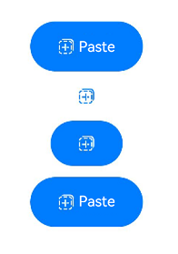

# PasteButton


The **\<PasteButton>** security component allows you to obtain temporary pasteboard permission from the user by their touching the button, eliminating the need for a permission request dialog box.


> **NOTE**
>
> This component is supported since API version 10. Updates will be marked with a superscript to indicate their earliest API version.


## Child Components

Not supported


## APIs
### PasteButton
PasteButton()

Creates a Paste button with an icon, text, and background.

### PasteButton
PasteButton(option:{icon?: PasteIconStyle, text?: PasteDescription, buttonType?: ButtonType})

Creates a Paste button that contains the specified elements.

**Parameters**

| Name| Type| Mandatory| Description|
| -------- | -------- | -------- | -------- |
| icon | [PasteIconStyle](#pasteiconstyle) | No| Icon style of the Paste button.<br>If this parameter is not specified, no icon is contained. Either **icon** or **text**, or both, must be set.|
| text | [PasteDescription](#pastedescription) | No| Text on the Paste button.<br>If this parameter is not specified, no text is contained. Either **icon** or **text**, or both, must be set.|
| buttonType | [ButtonType](ts-basic-components-button.md#ButtonType) | No| Background style of the Paste button.<br>If this parameter is not specified, there is no background.|


## Attributes

This component can only inherit the [universal attributes of security components](ts-securitycomponent-attributes.md#attributes)


## PasteIconStyle

| Name| Description|
| -------- | -------- |
| LINES | Line style icon.|


## PasteDescription

| Name| Description|
| -------- | -------- |
| PASTE | The text on the Paste button is **Paste**.|


## PasteButtonOnClickResult

| Name| Description|
| -------- | -------- |
| SUCCESS | The Paste button is touched successfully.|
| TEMPORARY_AUTHORIZATION_FAILED | Temporary authorization fails after the Paste button is touched.|


## Events

Only the following events are supported.

| Name| Description|
| -------- | -------- |
| onClick(event: (event: [ClickEvent](ts-universal-events-click.md#clickevent)), result: [PasteButtonOnClickResult](#pastebuttononclickresult)) =&gt; void) | Triggered when the component is touched.<br>**result**: authorization result. After the authorization, the pasteboard content can be read.<br>**event**: For details, see **ClickEvent**.|


## Example

```
// xxx.ets
@Entry
@Component
struct Index {
  build() {
    Row() {
      Column({space:10}) {
        // Create a default Paste button with an icon, text, and background.
        PasteButton().onClick((event: ClickEvent, result: PasteButtonOnClickResult)=>{
          console.info("result " + result)
        })
        // Whether an element is contained depends on whether the parameter corresponding to the element is specified.
        PasteButton({icon:PasteIconStyle.LINES})
        // Create a Paste button with only an icon and background.
        PasteButton({icon:PasteIconStyle.LINES, buttonType:ButtonType.Capsule})
        // Create a Paste button with an icon, text, and background.
        PasteButton({icon:PasteIconStyle.LINES, text:PasteDescription.PASTE, buttonType:ButtonType.Capsule})
      }.width('100%')
    }.height('100%')
  }
}
```


