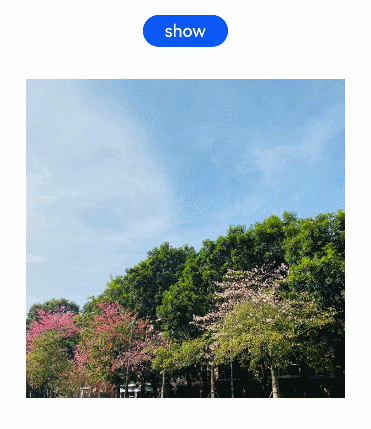

# Component Transition

Configure the component transition animations for when a component is inserted or deleted. This feature takes effect only when [animateTo](ts-explicit-animation.md) is used. The animation duration, curve, and delay are the same as those configured in **animateTo**.

>  **NOTE**
>
>  The APIs of this module are supported since API version 7. Updates will be marked with a superscript to indicate their earliest API version.


## Attributes


| Name| Type| Description|
| -------- | -------- | -------- |
| transition | TransitionOptions | Transition parameters, which are all optional. For details, see **TransitionOptions**.|

## TransitionOptions

| Name| Type| Mandatory| Description|
| -------- | -------- | -------- | -------- |
| type | [TransitionType](ts-appendix-enums.md#transitiontype)  | No| Transition type, which includes component addition and deletion by default.<br>Default value: **TransitionType.All**<br>**NOTE**<br>If **type** is not specified, insertion and deletion use the same transition type.|
| opacity | number | No| Opacity of the component during transition, which is the value of the start point of insertion and the end point of deletion.<br>Default value: **1**|
| translate | {<br>x? : number \| string,<br>y? : number \| string,<br>z? : number \| string<br>} | No| Translation of the component during transition, which is the value of the start point of insertion and the end point of deletion.<br>-**x**: distance to translate along the x-axis.<br>-**y**: distance to translate along the y-axis.<br>-**z**: distance to translate along the z-axis.|
| scale | {<br>x? : number,<br>y? : number,<br>z? : number,<br>centerX? : number \| string,<br>centerY? : number \| string<br>} | No| Scaling of the component during transition, which is the value of the start point of insertion and the end point of deletion.<br>- **x**: scale factor along the x-axis.<br>- **y**: scale factor along the y-axis.<br>- **z**: scale factor along the z-axis.<br>- **centerX** and **centerY**: x coordinate and y coordinate of the scale center, respectively. The default values are both **"50%"**.<br>- If the center point is 0, it indicates the upper left corner of the component.<br>|
| rotate | {<br>x?: number,<br>y?: number,<br>z?: number,<br>angle?: number \| string,<br>centerX?: number \| string,<br>centerY?: number \| string<br>} | No| Rotation of the component during transition, which is the value of the start point of insertion and the end point of deletion.<br>- **x**: rotation vector along the x-axis.<br>- **y**: rotation vector along the y-axis.<br>- **z**: rotation vector along the z-axis.<br>- **centerX** and **centerY**: x coordinate and y coordinate of the rotation center, respectively. The default values are both **"50%"**.<br>- If the center point is (0, 0), it indicates the upper left corner of the component.|


## Example

```ts
// xxx.ets
@Entry
@Component
struct TransitionExample {
  @State flag: boolean = true
  @State show: string = 'show'

  build() {
    Column() {
      Button(this.show).width(80).height(30).margin(30)
        .onClick(() => {
          // Click the button to show or hide the image.
          animateTo({ duration: 1000 }, () => {
            if (this.flag) {
              this.show = 'hide'
            } else {
              this.show = 'show'
            }
            this.flag = !this.flag
          })
        })
      if (this.flag) {
        // Apply different transition effects to the appearance and disappearance of the image.
        Image($r('app.media.testImg')).width(300).height(300)
          .transition({ type: TransitionType.Insert, scale: { x: 0, y: 1.0 } })
          .transition({ type: TransitionType.Delete, rotate: { angle: 180 } })
      }
    }.width('100%')
  }
}
```


