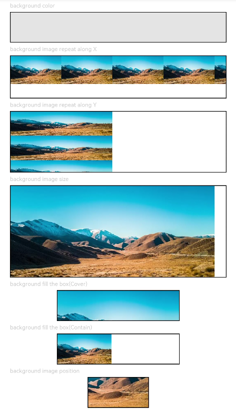

# Background<a name="EN-US_TOPIC_0000001237555119"></a>

> **NOTE:** 
>This attribute is supported since API version 7. Updates will be marked with a superscript to indicate their earliest API version.

The attributes in this topic are used to set the background color of a component.

## Required Permissions<a name="section781125411508"></a>

None

## Attributes<a name="section6820191711316"></a>

<a name="table548mcpsimp"></a>
<table><thead align="left"><tr id="row555mcpsimp"><th class="cellrowborder" valign="top" width="18.279999999999998%" id="mcps1.1.5.1.1"><p id="p557mcpsimp"><a name="p557mcpsimp"></a><a name="p557mcpsimp"></a>Name</p>
</th>
<th class="cellrowborder" valign="top" width="22.439999999999998%" id="mcps1.1.5.1.2"><p id="p559mcpsimp"><a name="p559mcpsimp"></a><a name="p559mcpsimp"></a>Type</p>
</th>
<th class="cellrowborder" valign="top" width="10.85%" id="mcps1.1.5.1.3"><p id="p561mcpsimp"><a name="p561mcpsimp"></a><a name="p561mcpsimp"></a>Default Value</p>
</th>
<th class="cellrowborder" valign="top" width="48.43%" id="mcps1.1.5.1.4"><p id="p563mcpsimp"><a name="p563mcpsimp"></a><a name="p563mcpsimp"></a>Description</p>
</th>
</tr>
</thead>
<tbody><tr id="row564mcpsimp"><td class="cellrowborder" valign="top" width="18.279999999999998%" headers="mcps1.1.5.1.1 "><p id="p566mcpsimp"><a name="p566mcpsimp"></a><a name="p566mcpsimp"></a>backgroundColor</p>
</td>
<td class="cellrowborder" valign="top" width="22.439999999999998%" headers="mcps1.1.5.1.2 "><p id="p568mcpsimp"><a name="p568mcpsimp"></a><a name="p568mcpsimp"></a>Color</p>
</td>
<td class="cellrowborder" valign="top" width="10.85%" headers="mcps1.1.5.1.3 "><p id="p570mcpsimp"><a name="p570mcpsimp"></a><a name="p570mcpsimp"></a>-</p>
</td>
<td class="cellrowborder" valign="top" width="48.43%" headers="mcps1.1.5.1.4 "><p id="p572mcpsimp"><a name="p572mcpsimp"></a><a name="p572mcpsimp"></a>Background color of a component.</p>
</td>
</tr>
<tr id="row1993142420457"><td class="cellrowborder" valign="top" width="18.279999999999998%" headers="mcps1.1.5.1.1 "><p id="p1493242415452"><a name="p1493242415452"></a><a name="p1493242415452"></a>backgroundImage</p>
</td>
<td class="cellrowborder" valign="top" width="22.439999999999998%" headers="mcps1.1.5.1.2 "><p id="p3215443104520"><a name="p3215443104520"></a><a name="p3215443104520"></a>src: string,</p>
<p id="p1393262494519"><a name="p1393262494519"></a><a name="p1393262494519"></a>repeat?: <a href="ts-appendix-enums.md#section5656191941718">ImageRepeat</a></p>
</td>
<td class="cellrowborder" valign="top" width="10.85%" headers="mcps1.1.5.1.3 "><p id="p1093220249451"><a name="p1093220249451"></a><a name="p1093220249451"></a>-</p>
</td>
<td class="cellrowborder" valign="top" width="48.43%" headers="mcps1.1.5.1.4 "><p id="p539239184613"><a name="p539239184613"></a><a name="p539239184613"></a><strong id="b1989061912920"><a name="b1989061912920"></a><a name="b1989061912920"></a>src</strong>: image address, which can be the address of an Internet or a local image. (SVG images are not supported.)</p>
<p id="p59321124124510"><a name="p59321124124510"></a><a name="p59321124124510"></a><strong id="b146564122510"><a name="b146564122510"></a><a name="b146564122510"></a>repeat</strong>: whether the background image is repeatedly used. By default, the background image is not repeatedly used.</p>
</td>
</tr>
<tr id="row865252718459"><td class="cellrowborder" valign="top" width="18.279999999999998%" headers="mcps1.1.5.1.1 "><p id="p116521927114520"><a name="p116521927114520"></a><a name="p116521927114520"></a>backgroundImageSize</p>
</td>
<td class="cellrowborder" valign="top" width="22.439999999999998%" headers="mcps1.1.5.1.2 "><p id="p11618630194614"><a name="p11618630194614"></a><a name="p11618630194614"></a>{</p>
<p id="p466233524614"><a name="p466233524614"></a><a name="p466233524614"></a>width?: Length,</p>
<p id="p208462032787"><a name="p208462032787"></a><a name="p208462032787"></a>height?: Length</p>
<p id="p20652192724512"><a name="p20652192724512"></a><a name="p20652192724512"></a>} | <a href="#li937882865915">ImageSize</a></p>
</td>
<td class="cellrowborder" valign="top" width="10.85%" headers="mcps1.1.5.1.3 "><p id="p6652202734515"><a name="p6652202734515"></a><a name="p6652202734515"></a>Auto</p>
</td>
<td class="cellrowborder" valign="top" width="48.43%" headers="mcps1.1.5.1.4 "><p id="p196521327134511"><a name="p196521327134511"></a><a name="p196521327134511"></a>Width and height of the background image. When the input is a <strong id="b2022994745115"><a name="b2022994745115"></a><a name="b2022994745115"></a>{width: Length, height: Length}</strong> object, if only one attribute is set, the other attribute is the set value multiplied by the original aspect ratio of the image. By default, the original image aspect ratio remains unchanged.</p>
</td>
</tr>
<tr id="row561293054512"><td class="cellrowborder" valign="top" width="18.279999999999998%" headers="mcps1.1.5.1.1 "><p id="p16612193094518"><a name="p16612193094518"></a><a name="p16612193094518"></a>backgroundImagePosition</p>
</td>
<td class="cellrowborder" valign="top" width="22.439999999999998%" headers="mcps1.1.5.1.2 "><p id="p159911535182"><a name="p159911535182"></a><a name="p159911535182"></a>{</p>
<p id="p11265191513910"><a name="p11265191513910"></a><a name="p11265191513910"></a>x?: Length,</p>
<p id="p33314129919"><a name="p33314129919"></a><a name="p33314129919"></a>y?: Length</p>
<p id="p86122302456"><a name="p86122302456"></a><a name="p86122302456"></a>} | <a href="ts-appendix-enums.md#section1145418513159">Alignment</a></p>
</td>
<td class="cellrowborder" valign="top" width="10.85%" headers="mcps1.1.5.1.3 "><p id="p768611265914"><a name="p768611265914"></a><a name="p768611265914"></a>{</p>
<p id="p182481283917"><a name="p182481283917"></a><a name="p182481283917"></a>x: 0,</p>
<p id="p48380293912"><a name="p48380293912"></a><a name="p48380293912"></a>y: 0</p>
<p id="p1261283014510"><a name="p1261283014510"></a><a name="p1261283014510"></a>}</p>
</td>
<td class="cellrowborder" valign="top" width="48.43%" headers="mcps1.1.5.1.4 "><p id="p261293004518"><a name="p261293004518"></a><a name="p261293004518"></a>Position of the background image in the component.</p>
</td>
</tr>
</tbody>
</table>

-   <a name="li937882865915"></a>ImageSize enums

    <a name="table61607433471"></a>
    <table><thead align="left"><tr id="row13210194394717"><th class="cellrowborder" valign="top" width="30.459999999999997%" id="mcps1.1.3.1.1"><p id="p7211134394716"><a name="p7211134394716"></a><a name="p7211134394716"></a>Name</p>
    </th>
    <th class="cellrowborder" valign="top" width="69.54%" id="mcps1.1.3.1.2"><p id="p6211204384714"><a name="p6211204384714"></a><a name="p6211204384714"></a>Description</p>
    </th>
    </tr>
    </thead>
    <tbody><tr id="row1121164334710"><td class="cellrowborder" valign="top" width="30.459999999999997%" headers="mcps1.1.3.1.1 "><p id="p8211144317475"><a name="p8211144317475"></a><a name="p8211144317475"></a>Cover</p>
    </td>
    <td class="cellrowborder" valign="top" width="69.54%" headers="mcps1.1.3.1.2 "><p id="p162119432471"><a name="p162119432471"></a><a name="p162119432471"></a>Default value. The image is scaled with its aspect ratio retained for both sides to be greater than or equal to the display boundaries.</p>
    </td>
    </tr>
    <tr id="row192118430476"><td class="cellrowborder" valign="top" width="30.459999999999997%" headers="mcps1.1.3.1.1 "><p id="p20211543164713"><a name="p20211543164713"></a><a name="p20211543164713"></a>Contain</p>
    </td>
    <td class="cellrowborder" valign="top" width="69.54%" headers="mcps1.1.3.1.2 "><p id="p162111943104711"><a name="p162111943104711"></a><a name="p162111943104711"></a>The image is scaled with its aspect ratio retained for the content to be completely displayed within the display boundaries.</p>
    </td>
    </tr>
    <tr id="row16211843204712"><td class="cellrowborder" valign="top" width="30.459999999999997%" headers="mcps1.1.3.1.1 "><p id="p7211134334715"><a name="p7211134334715"></a><a name="p7211134334715"></a>Auto</p>
    </td>
    <td class="cellrowborder" valign="top" width="69.54%" headers="mcps1.1.3.1.2 "><p id="p121118431474"><a name="p121118431474"></a><a name="p121118431474"></a>The original image aspect ratio is retained.</p>
    </td>
    </tr>
    </tbody>
    </table>


## Example<a name="section88491836154010"></a>

```
@Entry
@Component
struct BackgroundExample {
  build() {
    Column({ space: 5 }) {
      Text('background color').fontSize(9).width('90%').fontColor(0xCCCCCC)
      Row().width('90%').height(50).backgroundColor(0xE5E5E5).border({ width: 1 })

      Text('background image repeat along X').fontSize(9).width('90%').fontColor(0xCCCCCC)
      Row()
        .backgroundImage('/comment/bg.jpg', ImageRepeat.X)
        .backgroundImageSize({ width: '250px', height: '140px' })
        .width('90%')
        .height(70)
        .border({ width: 1 })

      Text('background image repeat along Y').fontSize(9).width('90%').fontColor(0xCCCCCC)
      Row()
        .backgroundImage('/comment/bg.jpg', ImageRepeat.Y)
        .backgroundImageSize({ width: '500px', height: '120px' })
        .width('90%')
        .height(100)
        .border({ width: 1 })

      Text('background image size').fontSize(9).width('90%').fontColor(0xCCCCCC)
      Row()
        .width('90%').height(150)
        .backgroundImage('/comment/bg.jpg', ImageRepeat.NoRepeat)
        .backgroundImageSize({ width: 1000, height: 500 })
        .border({ width: 1 })

      Text('background fill the box(Cover)').fontSize(9).width('90%').fontColor(0xCCCCCC)
      // Occupy all the space of the container, without ensuring that the image is completely displayed.
      Row()
        .width(200)
        .height(50)
        .backgroundImage('/comment/bg.jpg', ImageRepeat.NoRepeat)
        .backgroundImageSize(ImageSize.Cover)
        .border({ width: 1 })

      Text('background fill the box(Contain)').fontSize(9).width('90%').fontColor(0xCCCCCC)
      // Maximize the image while ensuring that it can be completely displayed.
      Row()
        .width(200)
        .height(50)
        .backgroundImage('/comment/bg.jpg', ImageRepeat.NoRepeat)
        .backgroundImageSize(ImageSize.Contain)
        .border({ width: 1 })

      Text('background image position').fontSize(9).width('90%').fontColor(0xCCCCCC)
      Row()
        .width(100)
        .height(50)
        .backgroundImage('/comment/bg.jpg', ImageRepeat.NoRepeat)
        .backgroundImageSize({ width: 1000, height: 560 })
        .backgroundImagePosition({ x: -500, y: -300 })
        .border({ width: 1 })
    }
    .width('100%').height('100%').padding({ top: 5 })
  }
}
```



