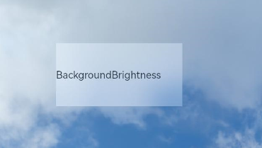

# Background

You can set the background for a component.

>  **NOTE**
>
>  The APIs of this module are supported since API version 7. Updates will be marked with a superscript to indicate their earliest API version.

## background<sup>10+</sup>

background(builder: CustomBuilder, options?: { align?: Alignment })

Sets the background color of the component.

**System capability**: SystemCapability.ArkUI.ArkUI.Full

**Parameters**

| Name | Type                                                | Mandatory| Description                                                        |
| ------- | ---------------------------------------------------- | ---- | ------------------------------------------------------------ |
| builder | [CustomBuilder](ts-types.md#custombuilder8)          | Yes  | Custom background.                                                |
| options | {align?:[Alignment](ts-appendix-enums.md#alignment)} | No  | Alignment mode between the custom background and the component.<br>If **background**, **backgroundColor**, and **backgroundImage** are set at the same time, they will all take effect, with **background** at the top layer.|

>  **NOTE**
>
>  The custom background takes some time to render, during which it cannot respond to events, or be dynamically updated. This attribute cannot be nested or be previewed in the previewer.

## backgroundColor

backgroundColor(value: ResourceColor)

Sets the background color of the component.

**Widget capability**: Since API version 9, this API is supported in ArkTS widgets.

**System capability**: SystemCapability.ArkUI.ArkUI.Full

**Parameters**

| Name| Type                                      | Mandatory| Description              |
| ------ | ------------------------------------------ | ---- | ------------------ |
| value  | [ResourceColor](ts-types.md#resourcecolor) | Yes  | Background color of the component.|

## backgroundImage

backgroundImage(src: ResourceStr, repeat?: ImageRepeat)

Sets the background image of the component.

**Widget capability**: Since API version 9, this API is supported in ArkTS widgets.

**System capability**: SystemCapability.ArkUI.ArkUI.Full

**Parameters**

| Name| Type                                           | Mandatory| Description                                                        |
| ------ | ----------------------------------------------- | ---- | ------------------------------------------------------------ |
| src    | [ResourceStr](ts-types.md#resourcestr)          | Yes  | Image address, which can be the address of an online, a local, or a Base64 encoded image. SVG images are not supported.|
| repeat | [ImageRepeat](ts-appendix-enums.md#imagerepeat) | No  | Whether the background image is repeated. By default, the background image is not repeated. If the set image has a transparent background and **backgroundColor** is set, the image is overlaid on the background color.|

## backgroundImageSize

backgroundImageSize(value: SizeOptions | ImageSize)

Sets the width and height of the component background image.

**Widget capability**: Since API version 9, this API is supported in ArkTS widgets.

**System capability**: SystemCapability.ArkUI.ArkUI.Full

**Parameters**

| Name| Type                                                        | Mandatory| Description                                                        |
| ------ | ------------------------------------------------------------ | ---- | ------------------------------------------------------------ |
| value  | [SizeOptions](ts-universal-attributes-size.md#sizeoptions) \| [ImageSize](ts-appendix-enums.md#imagesize) | Yes  | Width and height of the background image. If the input is a **{width: Length, height: Length}** object and only one attribute is set, the other attribute is the set value multiplied by the original aspect ratio of the image. By default, the original image aspect ratio remains unchanged.<br>The value range of **width** and **height** is [0, +∞).<br>Default value: **ImageSize.Auto**<br>Since API version 9, this API is supported in ArkTS widgets.<br>**NOTE**<br>A value less than 0 evaluates to the value **0**. If **height** is set but **width** is not, the image width is adjusted based on the original aspect ratio of the image.|

## backgroundImagePosition

backgroundImagePosition(value: Position | Alignment)

Sets the position of the component background image.

**Widget capability**: Since API version 9, this API is supported in ArkTS widgets.

**System capability**: SystemCapability.ArkUI.ArkUI.Full

**Parameters**

| Name| Type                                                        | Mandatory| Description                                                        |
| ------ | ------------------------------------------------------------ | ---- | ------------------------------------------------------------ |
| value  | [Position](ts-types.md#position8) \| [Alignment](ts-appendix-enums.md#alignment) | Yes  | Position of the background image in the component, that is, the coordinates relative to the upper left corner of the component.<br>Default value:<br>{<br>x: 0,<br>y: 0<br>} <br> When **x** and **y** are set in percentage, the offset is calculated based on the width and height of the component.<br>Since API version 9, this API is supported in ArkTS widgets.|

## backgroundBlurStyle<sup>9+</sup>

backgroundBlurStyle(value: BlurStyle, options?: BackgroundBlurStyleOptions)

Sets the background blur style applied between the content and the background.

**Widget capability**: Since API version 9, this API is supported in ArkTS widgets.

**System capability**: SystemCapability.ArkUI.ArkUI.Full

**Parameters**

| Name               | Type                                                        | Mandatory| Description                                                        |
| --------------------- | ------------------------------------------------------------ | ---- | ------------------------------------------------------------ |
| value                 | [BlurStyle](ts-appendix-enums.md#blurstyle9)                 | Yes  | Settings of the background blur style, including the blur radius, mask color, mask opacity, saturation, and brightness.|
| options<sup>10+</sup> | [BackgroundBlurStyleOptions](#backgroundblurstyleoptions10)| No  | Background blur options.                                              |

## backgroundEffect<sup>11+</sup> 

backgroundEffect(options: BackgroundEffectOptions)

Sets the background effect of the component.

**System capability**: SystemCapability.ArkUI.ArkUI.Full

**Parameters**

| Name | Type                                                        | Mandatory| Description                                      |
| ------- | ------------------------------------------------------------ | ---- | ------------------------------------------ |
| options | [BackgroundEffectOptions](ts-appendix-enums.md#backgroundeffectoptions11) | No  | Background effect, including saturation, brightness, and color.|

## backgroundBrightness<sup>11+</sup> 

backgroundBrightness(params: BackgroundBrightnessOptions)

Sets the background brightness of the component.

**System capability**: SystemCapability.ArkUI.ArkUI.Full

**System API**: This is a system API.

**Parameters**

| Name           | Type                                    | Mandatory  | Description                                      |
| ------------- | ---------------------------------------- | ---- | ---------------------------------------- |
| params        | [BackgroundBrightnessOptions](#backgroundbrightnessoptions11) | Yes   |  Background brightness of the component, including the brightness change rate and lightning up degree.     |

## BackgroundBlurStyleOptions<sup>10+</sup>

| Name           | Type                                    | Mandatory  | Description                                      |
| ------------- | ---------------------------------------- | ---- | ---------------------------------------- |
| colorMode     | [ThemeColorMode](ts-appendix-enums.md#themecolormode10) | No   | Color mode used for the background blur.<br>Default value: **ThemeColorMode.System**|
| adaptiveColor | [AdaptiveColor](ts-appendix-enums.md#adaptivecolor10) | No   | Adaptive color mode.<br> Default value: **AdaptiveColor.Default**|
| scale         | number                                   | No   | Blurredness of the background material. This API is a system API.<br>Default value: **1.0**<br>Value range: [0.0, 1.0]<br>|
| blurOptions<sup>11+</sup> | [BlurOptions](ts-appendix-enums.md#bluroptions11)         | No   | Grayscale blur parameters.          |

## BackgroundBrightnessOptions<sup>11+</sup>

| Name           | Type                                    | Mandatory  | Description                                      |
| ------------- | ---------------------------------------- | ---- | ---------------------------------------- |
| rate          | number | Yes   | Brightness change rate. A larger value indicates faster brightness decrease and a lower lightning up degree. This API is a system API.<br>Default value: **0.0**<br>Value range: (0.0, +∞)<br>|
| lightUpDegree | number | Yes   | Lightning up degree. A larger value indicates a higher lightning up degree. This API is a system API.<br> Default value: **0.0**<br>Value range: [-1.0, 1.0]<br>|

## Example

### Example 1

```ts
// xxx.ets
@Entry
@Component
struct BackgroundExample {

  build() {
    Column({ space: 5 }) {
      Text('background color').fontSize(9).width('90%').fontColor(0xCCCCCC)
      Row().width('90%').height(50).backgroundColor(0xE5E5E5).border({ width: 1 })

      Text('background image repeat along X').fontSize(9).width('90%').fontColor(0xCCCCCC)
      Row()
        .backgroundImage('/comment/bg.jpg', ImageRepeat.X)
        .backgroundImageSize({ width: '250px', height: '140px' })
        .width('90%')
        .height(70)
        .border({ width: 1 })

      Text('background image repeat along Y').fontSize(9).width('90%').fontColor(0xCCCCCC)
      Row()
        .backgroundImage('/comment/bg.jpg', ImageRepeat.Y)
        .backgroundImageSize({ width: '500px', height: '120px' })
        .width('90%')
        .height(100)
        .border({ width: 1 })

      Text('background image size').fontSize(9).width('90%').fontColor(0xCCCCCC)
      Row()
        .width('90%').height(150)
        .backgroundImage('/comment/bg.jpg', ImageRepeat.NoRepeat)
        .backgroundImageSize({ width: 1000, height: 500 })
        .border({ width: 1 })

      Text('background fill the box(Cover)').fontSize(9).width('90%').fontColor(0xCCCCCC)
      // Occupy all the space of the container, without ensuring that the image is completely displayed.
      Row()
        .width(200)
        .height(50)
        .backgroundImage('/comment/bg.jpg', ImageRepeat.NoRepeat)
        .backgroundImageSize(ImageSize.Cover)
        .border({ width: 1 })

      Text('background fill the box(Contain)').fontSize(9).width('90%').fontColor(0xCCCCCC)
      // Maximize the image while ensuring that it can be completely displayed.
      Row()
        .width(200)
        .height(50)
        .backgroundImage('/comment/bg.jpg', ImageRepeat.NoRepeat)
        .backgroundImageSize(ImageSize.Contain)
        .border({ width: 1 })

      Text('background image position').fontSize(9).width('90%').fontColor(0xCCCCCC)
      Row()
        .width(100)
        .height(50)
        .backgroundImage('/comment/bg.jpg', ImageRepeat.NoRepeat)
        .backgroundImageSize({ width: 1000, height: 560 })
        .backgroundImagePosition({ x: -500, y: -300 })
        .border({ width: 1 })
    }
    .width('100%').height('100%').padding({ top: 5 })
  }
}
```


### Example 2

```ts
// xxx.ets
@Entry
@Component
struct BackgroundBlurStyleDemo {
  build() {
    Column() {
      Row() {
        Text("Thin Material")
      }
      .width('50%')
      .height('50%')
      .backgroundBlurStyle(BlurStyle.Thin, { colorMode: ThemeColorMode.LIGHT, adaptiveColor: AdaptiveColor.DEFAULT, scale: 1.0 })
      .position({ x: '15%', y: '30%' })
    }
    .height('100%')
    .width('100%')
    .backgroundImage($r('app.media.bg'))
    .backgroundImageSize(ImageSize.Cover)
  }
}
```


### Example 3

```ts
// xxx.ets
@Entry
@Component
struct BackgroundExample {
  @Builder renderBackground() {
    Column() {
      Progress({value : 50})
    }
  }

  build() {
    Column() {
      Text("content")
        .width(100)
        .height(40)
        .fontColor("#FFF")
        .position({x:50, y:80})
        .textAlign(TextAlign.Center)
        .backgroundColor(Color.Green)
    }
    .width(200).height(200)
    .background(this.renderBackground)
    .backgroundColor(Color.Gray)
  }
}
```


### Example 4

Example of setting the background brightness for the component:

```ts
// xxx.ets
@Entry
@Component
struct BackgroundBrightnessDemo {
  build() {
    Column() {
      Row() {
        Text("BackgroundBrightness")
      }
      .width(200)
      .height(100)
      .position({ x: 100, y: 100 })
      .backgroundBlurStyle(BlurStyle.Thin, { colorMode: ThemeColorMode.LIGHT, adaptiveColor: AdaptiveColor.DEFAULT, scale: 1.0 })
      .backgroundBrightness({rate:0.5,lightUpDegree:0.5}) // Background brightness
    }
    .width('100%')
    .height('100%')
    .backgroundImage($r('app.media.image'))
    .backgroundImageSize(ImageSize.Cover)
  }
}
```

The following figures show how the component looks with the background brightness set.

When **rate** and **lightUpDegree** are both set to **0.5**


When **rate** is set to **0.5** and **lightUpDegree** **-0.1**


The following figure shows how the component looks without the background brightness set.


<!--no_check-->