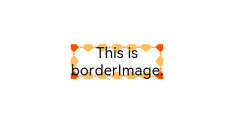

# Border Image

You can draw an image around a component.

>  **NOTE**
>
> The APIs of this module are supported since API version 9. Updates will be marked with a superscript to indicate their earliest API version.


## Attributes


| Name| Type| Description|
| -------- | -------- | -------- |
| source | string \| [Resource](../../ui/ts-types.md) \| [linearGradient](ts-universal-attributes-gradient-color.md) | Source or gradient color of the border image.|
| slice | [Length](../../ui/ts-types.md#length)\| EdgeWidth | Slice width of the border image.<br>Default value: **0**|
| width | [Length](../../ui/ts-types.md#length)\| EdgeWidth | Width of the border image.<br>Default value: **0**|
| outset | [Length](../../ui/ts-types.md#length)\| EdgeWidth | Amount by which the border image is extended beyond the border box.<br>Default value: **0**|
| RepeatMode  | RepeatMode | Repeat mode of the border image.<br>Default value: **RepeatMode.Stretch**|
| fill | boolean | Whether to fill the center of the border image.<br>Default value: **false**|
## EdgeWidth 

At least one parameter must be passed to reference an **EdgeWidth** object.


| Name| Type| Mandatory|Description|
| -------- | -------- |-------- |-------- |
| left | [Length](../../ui/ts-types.md#length) | No| Distance on the left.|
| right | [Length](../../ui/ts-types.md#length) | No| Distance on the right.|
| top | [Length](../../ui/ts-types.md#length) | No| Distance at the top.|
| bottom | [Length](../../ui/ts-types.md#length) | No| Distance on the bottom.|

## RepeatMode

| Name| Description|
| -------- | -------- |
| Repeat | The source image's slices are tiled. Tiles beyond the border box will be clipped.|
| Stretch | The source image's slices stretched to fill the border box.|
| Round | The source image's slices are tiled to fill the border box. Tiles may be compressed when needed.|
| Space | The source image's slices are tiled to fill the border box. Extra space will be filled in between tiles.|


## Example

```ts
// xxx.ets
@Entry
@Component
struct Index {

  build() {
    Row() {
      Column() {
        Text('This is\nborderImage.').textAlign(TextAlign.Center)
          .borderImage({
            source: "borderOrigin.png",
            slice: {top:"31%", bottom:"31%", left:"31%", right:"31%"},
            width: {top:"20px", bottom:"20px", left:"20px", right:"20px"},
            outset: {top:"5px", bottom:"5px", left:"5px", right:"5px"},
            repeat: RepeatMode.Repeat,
            fill: false
          });
      }
      .width('100%')
    }
    .height('100%')
  }
}
```




```ts
// xxx.ets
@Entry
@Component
struct Index {

  build() {
    Row() {
      Column() {
        Text('This is\ngradient color.').textAlign(TextAlign.Center)
          .borderImage({
            source: {angle:90,
              direction: GradientDirection.Left,
              colors: [[0xAEE1E1, 0.0], [0xD3E0DC, 0.3], [0xFCD1D1, 1.0]]},
            slice: {top:10, bottom:10, left:10, right:10},
            width: {top:"10px", bottom:"10px", left: "10px", right:"10px"},
            repeat: RepeatMode.Stretch,
            fill: false
          });
      }
      .width('100%')
    }
    .height('100%')
  }
}
```


