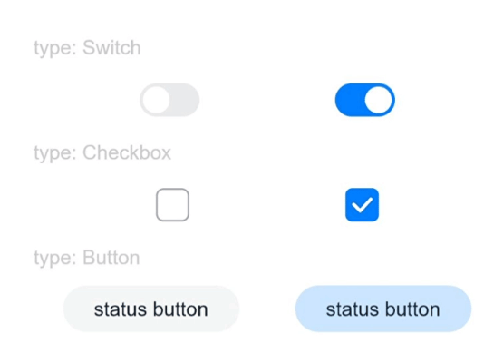

# Click Effect

You can set the click effect for a component to define how it behaves when clicked.

>  **NOTE**
>
> The APIs of this module are supported since API version 10. Updates will be marked with a superscript to indicate their earliest API version.


### Attributes

| Name       | Type           | Description                                                        |
| ----------- | ------------------- | ------------------------------------------------------------ |
| clickEffect | [ClickEffect](#clickeffect) \| null | Click effect of the component.<br>**NOTE**<br>The click effect is revoked when this attribute is set to **null**.|

### ClickEffect

| Name | Type                                                   | Mandatory| Description                                                        |
| ----- | ----------------------------------------------------------- | ---- | ------------------------------------------------------------ |
| level | [ClickEffectLevel](ts-appendix-enums.md#clickeffectlevel10) | Yes  | Click effect of the component.<br>Default value: **ClickEffectLevel.LIGHT**|
| scale | number                                                      | No  | Zoom ratio. This parameter works based on the setting of **ClickEffectLevel**.<br>**NOTE**<br>The default value of this parameter varies by the value of **level**.<br>- If **level** is set to **ClickEffectLevel.LIGHT**, the default value is **0.90**.<br>- If **level** is set to **ClickEffectLevel.MIDDLE** or **ClickEffectLevel.HEAVY**, the default value is **0.95**. |

### Example

```ts
// xxx.ets
@Entry
@Component
struct ToggleExample {
  build() {
    Column({ space: 10 }) {
      Text('type: Switch').fontSize(12).fontColor(0xcccccc).width('90%')
      Flex({ justifyContent: FlexAlign.SpaceEvenly, alignItems: ItemAlign.Center }) {
        Toggle({ type: ToggleType.Switch, isOn: false })
          .clickEffect({level:ClickEffectLevel.LIGHT})
          .selectedColor('#007DFF')
          .switchPointColor('#FFFFFF')
          .onChange((isOn: boolean) => {
            console.info('Component status:' + isOn)
          })

        Toggle({ type: ToggleType.Switch, isOn: true })
          .clickEffect({level:ClickEffectLevel.LIGHT, scale: 0.5})
          .selectedColor('#007DFF')
          .switchPointColor('#FFFFFF')
          .onChange((isOn: boolean) => {
            console.info('Component status:' + isOn)
          })
      }

      Text('type: Checkbox').fontSize(12).fontColor(0xcccccc).width('90%')
      Flex({ justifyContent: FlexAlign.SpaceEvenly, alignItems: ItemAlign.Center }) {
        Toggle({ type: ToggleType.Checkbox, isOn: false })
          .clickEffect({level:ClickEffectLevel.MIDDLE})
          .size({ width: 20, height: 20 })
          .selectedColor('#007DFF')
          .onChange((isOn: boolean) => {
            console.info('Component status:' + isOn)
          })

        Toggle({ type: ToggleType.Checkbox, isOn: true })
          .clickEffect({level:ClickEffectLevel.MIDDLE, scale: 0.5})
          .size({ width: 20, height: 20 })
          .selectedColor('#007DFF')
          .onChange((isOn: boolean) => {
            console.info('Component status:' + isOn)
          })
      }

      Text('type: Button').fontSize(12).fontColor(0xcccccc).width('90%')
      Flex({ justifyContent: FlexAlign.SpaceEvenly, alignItems: ItemAlign.Center }) {
        Toggle({ type: ToggleType.Button, isOn: false }) {
          Text('status button').fontColor('#182431').fontSize(12)
        }.width(106)
        .clickEffect({level:ClickEffectLevel.HEAVY})
        .selectedColor('rgba(0,125,255,0.20)')
        .onChange((isOn: boolean) => {
          console.info('Component status:' + isOn)
        })

        Toggle({ type: ToggleType.Button, isOn: true }) {
          Text('status button').fontColor('#182431').fontSize(12)
        }.width(106)
        .clickEffect({level:ClickEffectLevel.HEAVY, scale: 0.5})
        .selectedColor('rgba(0,125,255,0.20)')
        .onChange((isOn: boolean) => {
          console.info('Component status:' + isOn)
        })
      }
    }.width('100%').padding(24)
  }
}
```


