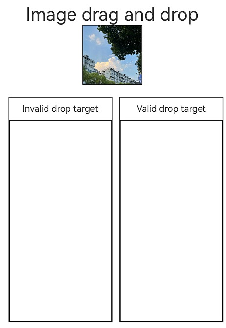
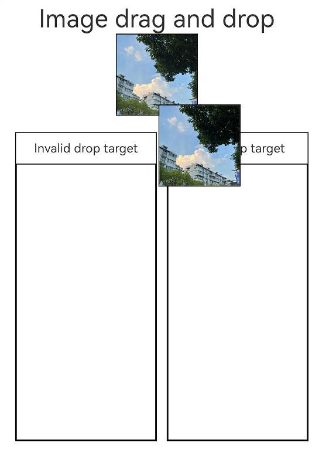

# Drag and Drop Control

The drag and drop control attributes set whether a component can respond to drag events.

> **NOTE**
> 
> The APIs of this module are supported since API version 10. Updates will be marked with a superscript to indicate their earliest API version.

The ArkUI framework implements the drag and drop capability for the following components, allowing them to serve as the drag source (from which data can be dragged) or drop target (to which data can be dropped). To enable drag and drop for these components, you only need to set their **draggable** attribute to **true**.

- The following component supports drag actions by default: **\<Search>**, **\<TextInput>**, **\<TextArea>**, **\<RichEditor>**, **\<Text>**, **\<Image>**, **\<FormComponent>**, **\<Hyperlink>**

- The following component supports drop actions by default: **\<Search>**, **\<TextInput>**, **\<TextArea>**, **\<Video>**

You can also define drag responses by implementing common drag events.

To enable drag and drop for other components, you need to set the **draggable** attribute to **true** and implement data transmission in APIs such as **onDragStart**.


## Attributes

| Name| Type| Description|
| -------- | -------- | -------- |
| allowDrop | Array\<[UniformDataType](../apis/js-apis-data-uniformTypeDescriptor.md#uniformdatatype)> | Type of data that can be dropped to the component.<br>Default value: empty<br>|
| draggable | boolean | Whether the component is draggable.<br>Default value: **false**<br>|
| dragPreview<sup>11+</sup> | [CustomBuilder](ts-types.md#custombuilder8) \| [DragItemInfo](ts-universal-events-drag-drop.md#dragiteminfo) | Preview displayed when the component is dragged. This attribute has effect for **onDragStart** only.<br>If the component supports drag and drop and a preview is specified through [bindContextMenu](ts-universal-attributes-menu.md#attributes), that specified preview is displayed when the component is dragged. The priority of the background image returned in [onDragStart](ts-universal-events-drag-drop.md#events) is lower than that of the preview set in [dragPreview](ts-universal-attributes-drag-drop.md#attributes). This means that, once set, the latter will be used in place of the former. Because [CustomBuilder](ts-types.md#custombuilder8) can be used only after offline rendering, it may increase performance overhead and latency. In light of this, you are advised to use [PixelMap](../apis/js-apis-image.md#pixelmap7) in [DragItemInfo](ts-universal-events-drag-drop.md#dragiteminfo) to set the preview.<br>Default value: empty<br>|
| dragPreviewOptions<sup>11+</sup> | [DragPreviewOptions<sup>11+</sup>](#dragpreviewoptions11) | How the background image is processed when the component is dragged.<br>Default value: **DragPreviewMode.AUTO**<br>|

## DragPreviewOptions<sup>11+</sup>

| Name| Type| Mandatory| Description|
| -------- | -------- | -------- | -------- |
| mode | [DragPreviewMode](#dragpreviewmode11) | No| How the background image is processed when the component is dragged.<br>Default value: **DragPreviewMode.AUTO**<br>|

## DragPreviewMode<sup>11+</sup>

| Name| Description|
| -------- | -------- |
| AUTO  | The system automatically changes the position of the dragged point based on the scenario and automatically scales the background image based on set rules.|
| DISABLE_SCALE  | The system does not scale the background image.|

## Example
### Example 1
Example of using the **allowDrop** and **draggable** attributes:

```ts
// xxx.ets
import UDC from '@ohos.data.unifiedDataChannel';
import UTD from '@ohos.data.uniformTypeDescriptor';

@Entry
@Component
struct ImageExample {
  @State uri: string = ""
  @State AblockArr: string[] = []
  @State BblockArr: string[] = []
  @State AVisible: Visibility = Visibility.Visible
  @State dragSuccess :Boolean = false

  build() {
    Column() {
      Text ('Image drag and drop')
        .fontSize('30dp')
      Flex({ direction: FlexDirection.Row, alignItems: ItemAlign.Center, justifyContent: FlexAlign.SpaceAround }) {
        Image($r('app.media.icon'))
          .width(100)
          .height(100)
          .border({ width: 1 })
          .visibility(this.AVisible)
          .draggable(true)
          .onDragEnd((event: DragEvent) => {
            let ret = event.getResult();
            if(ret == 0) {
              console.log("enter ret == 0")
              this.AVisible = Visibility.Hidden;
            } else {
              console.log("enter ret != 0")
              this.AVisible = Visibility.Visible;
            }
          })
      }
      .margin({ bottom: 20 })
      Row() {
        Column(){
          Text('Invalid drop target')
            .fontSize('15dp')
            .height('10%')
          List(){
            ForEach(this.AblockArr, (item:string, index) => {
              ListItem() {
                Image(item)
                  .width(100)
                  .height(100)
                  .border({width: 1})
              }
              .margin({ left: 30 , top : 30})
            }, (item:string) => item)
          }
          .height('90%')
          .width('100%')
          .allowDrop([UTD.UniformDataType.TEXT])
          .onDrop((event?: DragEvent, extraParams?: string) => {
            this.uri = JSON.parse(extraParams as string).extraInfo;
            this.AblockArr.splice(JSON.parse(extraParams as string).insertIndex, 0, this.uri);
            console.log("ondrop not udmf data");
          })
          .border({width: 1})
        }
        .height("50%")
        .width("45%")
        .border({ width: 1 })
        .margin({ left: 12 })
        Column(){
          Text ('Valid drop target')
            .fontSize('15dp')
            .height('10%')
          List(){
            ForEach(this.BblockArr, (item:string, index) => {
              ListItem() {
                Image(item)
                  .width(100)
                  .height(100)
                  .border({width: 1})
              }
              .margin({ left: 30 , top : 30})
            }, (item:string) => item)
          }
          .border({width: 1})
          .height('90%')
          .width('100%')
          .allowDrop([UTD.UniformDataType.IMAGE])
          .onDrop((event?: DragEvent, extraParams?: string) => {
            console.log("enter onDrop")
            let dragData:UnifiedData = (event as DragEvent).getData() as UnifiedData;
            if(dragData != undefined) {
              let arr:Array<UDC.UnifiedRecord> = dragData.getRecords();
              if(arr.length > 0) {
                let image = arr[0] as UDC.Image;
                this.uri = image.imageUri;
                this.BblockArr.splice(JSON.parse(extraParams as string).insertIndex, 0, this.uri);
              } else {
                console.log(`dragData arr is null`)
              }
            } else {
              console.log(`dragData  is undefined`)
            }
            console.log("ondrop udmf data");
            this.dragSuccess = true
          })
        }
        .height("50%")
        .width("45%")
        .border({ width: 1 })
        .margin({ left: 12 })
      }
    }.width('100%')
  }
}
```






### Example 2
Example of using the **dragPreview** attribute:
```ts
// xxx.ets
@Entry
@Component
struct DragPreviewDemo{
  @Builder dragPreviewBuilder() {
    Column() {
      Text("dragPreview")
        .width(150)
        .height(50)
        .fontSize(20)
        .borderRadius(10)
        .textAlign(TextAlign.Center)
        .fontColor(Color.Black)
        .backgroundColor(Color.Pink)
    }
  }

  @Builder MenuBuilder() {
    Flex({ direction: FlexDirection.Column, justifyContent: FlexAlign.Center, alignItems: ItemAlign.Center }) {
      Text("menu item 1")
        .fontSize(15)
        .width(100)
        .height(40)
        .textAlign(TextAlign.Center)
        .fontColor(Color.Black)
        .backgroundColor(Color.Pink)
      Divider()
        .height(5)
      Text("menu item 2")
        .fontSize(15)
        .width(100)
        .height(40)
        .textAlign(TextAlign.Center)
        .fontColor(Color.Black)
        .backgroundColor(Color.Pink)
    }
    .width(100)
  }

  build() {
    Row() {
      Column() {
        Image('/resource/image.jpeg')
          .width("30%")
          .draggable(true)
          .bindContextMenu(this.MenuBuilder, ResponseType.LongPress)
          .onDragStart(() => {
            console.log("Image onDragStart")
          })
          .dragPreview(this.dragPreviewBuilder)
      }
      .width("100%")
    }
    .height("100%")
  }
}
```


### Example 3
Example of using the **dragPreviewOptions** attribute:
```ts
// xxx.ets
@Entry
@Component
struct dragPreviewOptionsDemo{
  build() {
    Row() {
      Column() {
        Image('/resource/image.jpeg')
          .margin({ top: 10 })
          .width("100%")
          .draggable(true)
          .dragPreviewOptions({ mode: DragPreviewMode.AUTO })
      }
      .width("100%")
      .height("100%")
    }
  }
}
```


