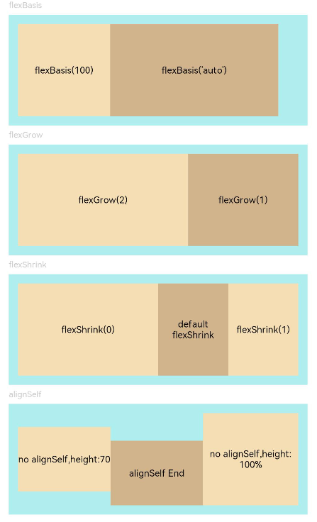

# Flex Layout

>  **NOTE**
>  - The APIs of this module are supported since API version 7. Updates will be marked with a superscript to indicate their earliest API version.
>
>  - The flex layout is valid only when the parent component is a **\<Flex>**, **\<Column>**, **\<Row>**, or **\<GridRow>** component.


## Attributes

| Name      | Type                                   | Description                                                        |
| ---------- | ------------------------------------------- | ------------------------------------------------------------ |
| flexBasis  | number \| string                            | Base size of the component in the main axis of the parent container.<br>Default value: **'auto'** (indicating that the base size of the component in the main axis is the original size of the component)<br>This attribute cannot be set in percentage.<br>Since API version 9, this API is supported in ArkTS widgets.|
| flexGrow   | number                                      | Percentage of the parent container's remaining space that is allocated to the component.<br>Default value: **0**<br>Since API version 9, this API is supported in ArkTS widgets.|
| flexShrink | number                                      | Percentage of the parent container's shrink size that is allocated to the component.<br>When the parent container is **\<Row>** or **\<Column>**, the default value is **0**.<br> When the parent container is **\<Flex>**, the default value is **1**.<br>Since API version 9, this API is supported in ArkTS widgets.|
| alignSelf  | [ItemAlign](ts-appendix-enums.md#itemalign) | Alignment mode of the child components along the cross axis of the parent container. The setting overwrites the **alignItems** setting of the parent container (**\<Flex>**, **\<Column>**, **\<Row>**, or **\<GridRow>**).<br>**\<GridCol>** can have the **alignsSelf** attribute bound to change its own layout along the cross axis.<br>Default value: **ItemAlign.Auto**<br>Since API version 9, this API is supported in ArkTS widgets.|
| layoutWeight   | number \| string                                   | Weight of the component during layout. When the container size is determined, the container space is allocated along the main axis among the component and sibling components based on the layout weight, and the component size setting is ignored.<br>Default value: **0**<br>Since API version 9, this API is supported in ArkTS widgets.<br>**NOTE**<br>This attribute is valid only for the **\<Row>**, **\<Column>**, and **\<Flex>** layouts.<br>The value can be a number greater than or equal to 0 or a string that can be converted to a number.|


## Example

```ts
// xxx.ets
@Entry
@Component
struct FlexExample {
  build() {
    Column({ space: 5 }) {
      Text('flexBasis').fontSize(9).fontColor(0xCCCCCC).width('90%')
      // Base size in the main axis
      // The value of flexBasis() can be 'auto' or a number, which is equivalent to .width()/.height().
      Flex() {
        Text('flexBasis(100)')
          .flexBasis(100) // The width is 100 vp.
          .height(100)
          .backgroundColor(0xF5DEB3)
          .textAlign(TextAlign.Center)
        Text(`flexBasis('auto')`)
          .flexBasis('auto') // The width is 60% of the original width.
          .width('60%')
          .height(100)
          .backgroundColor(0xD2B48C)
          .textAlign(TextAlign.Center)
      }.width('90%').height(120).padding(10).backgroundColor(0xAFEEEE)

      Text('flexGrow').fontSize(9).fontColor(0xCCCCCC).width('90%')
      // flexGrow() indicates the percentage of the remaining space allocated to the component.
      Flex() {
        Text('flexGrow(2)')
          .flexGrow(2) // The width allocated to the <Text> component is 2/3 of the remaining width of the parent container.
          .height(100)
          .backgroundColor(0xF5DEB3)
          .textAlign(TextAlign.Center)
        Text('flexGrow(1)')
          .flexGrow(1) // The width allocated to the <Text> component is 1/3 of the remaining width of the parent container.
          .height(100)
          .backgroundColor(0xD2B48C)
          .textAlign(TextAlign.Center)
      }.width('90%').height(120).padding(10).backgroundColor(0xAFEEEE)

      Text('flexShrink').fontSize(9).fontColor(0xCCCCCC).width('90%')
      // flexShrink() indicates the percentage of the shrink size allocated to the component.
      // The value is 0 for the first <Text> component and 1 for the other two <Text> components. This means that, if the components cannot be completely displayed in the parent container, the latter two are shrunk proportionally, while the former is not shrunk.
      Flex({ direction: FlexDirection.Row }) {
        Text('flexShrink(0)')
          .flexShrink(0)
          .width('50%')
          .height(100)
          .backgroundColor(0xF5DEB3)
          .textAlign(TextAlign.Center)
        Text('default flexShrink') // The default value is 1.
          .width('40%')
          .height(100)
          .backgroundColor(0xD2B48C)
          .textAlign(TextAlign.Center)
        Text('flexShrink(1)')
          .flexShrink(1)
          .width('40%')
          .height(100)
          .backgroundColor(0xF5DEB3)
          .textAlign(TextAlign.Center)
      }.width('90%').height(120).padding(10).backgroundColor(0xAFEEEE)

      Text('alignSelf').fontSize(9).fontColor(0xCCCCCC).width('90%')
      // The alignSelf setting overrides the alignItems setting of the parent container.
      Flex({ direction: FlexDirection.Row, alignItems: ItemAlign.Center }) {
        Text('no alignSelf,height:70')
          .width('33%')
          .height(70)
          .backgroundColor(0xF5DEB3)
          .textAlign(TextAlign.Center)
        Text('alignSelf End')
          .alignSelf(ItemAlign.End)
          .width('33%')
          .height(70)
          .backgroundColor(0xD2B48C)
          .textAlign(TextAlign.Center)
        Text('no alignSelf,height:100%')
          .width('34%')
          .height('100%')
          .backgroundColor(0xF5DEB3)
          .textAlign(TextAlign.Center)
      }.width('90%').height(120).padding(10).backgroundColor(0xAFEEEE)
    }.width('100%').margin({ top: 5 })
  }
}
```


