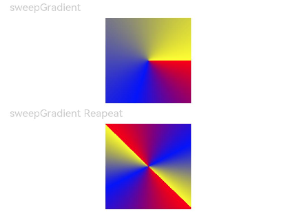

# Gradient Color

Create a more gorgeous look for a component by applying a gradient color effect to it.

>  **NOTE**
>
> The APIs of this module are supported since API version 7. Updates will be marked with a superscript to indicate their earliest API version.


## Attributes


| Name             | Type                                        | Description                              |
| -------------- | -------------------------------------------- | ----------------------------------- |
| linearGradient | {<br>angle?: number \| string,<br>direction?: [GradientDirection](ts-appendix-enums.md#gradientdirection),<br>colors: Array&lt;[ColorStop](ts-basic-components-gauge.md#colorstop)&gt;,<br>repeating?: boolean<br>} | Linear gradient.<br>- **angle**: start angle of the linear gradient. A positive value indicates a clockwise rotation from the origin, (0, 0).<br>  Default value: **180**<br>- **direction**: direction of the linear gradient. It does not take effect when **angle** is set.<br>  Default value: **GradientDirection.Bottom**<br>- **colors**: colors of the linear gradient.<br>- **repeating**: whether the colors are repeated.<br>  Default value: **false**<br>Since API version 9, this API is supported in ArkTS widgets.|
| sweepGradient  | {<br>center: [Point](./ts-drawing-components-polygon.md#point),<br>start?: number \| string,<br>end?: number \| string,<br>rotation?: number\|string,<br>colors: Array&lt;[ColorStop](ts-basic-components-gauge.md#colorstop)&gt;,<br>repeating?: boolean<br>} | Sweep gradient, which can sweep around the specified center point in the 0–360 degree range. If the rotation angle exceeds the range, a monochrome color instead of a gradient will be drawn.<br>- **center**: center point of the sweep gradient, that is, the coordinates relative to the upper left corner of the current component.<br>- **start**: start point of the sweep gradient.<br> Default value: **0**<br>- **end**: end point of the sweep gradient.<br> Default value: **0**<br>- **rotation**: rotation angle of the sweep gradient.<br> Default value: **0**<br>- **colors**: colors of the sweep gradient.<br>- **repeating**: whether the colors are repeated.<br>  Default value: **false**<br>Since API version 9, this API is supported in ArkTS widgets.<br>**NOTE**<br>A value less than 0 evaluates to the value **0**. A value greater than 360 evaluates to the value **1**.<br>When the data type of **start**, **end**, and **rotation** is string, the value **"90"** or **"90%"** is equivalent to **90**.|
| radialGradient | {<br>center: [Point](./ts-drawing-components-polygon.md#point),<br> radius: number \| string,<br>colors: Array&lt;[ColorStop](ts-basic-components-gauge.md#colorstop)&gt;,<br>repeating?: boolean<br>} | Radial gradient.<br>- **center**: center point of the radial gradient, that is, the coordinates relative to the upper left corner of the current component.<br>- **radius**: radius of the radial gradient.<br> Value range: [0, +∞)<br> **NOTE**<br>A value less than 0 evaluates to the value **0**.<br>- **colors**: colors of the radial gradient.<br>- **repeating**: whether the colors are repeated.<br>  Default value: **false**<br>Since API version 9, this API is supported in ArkTS widgets.|


## Example

```ts
// xxx.ets
@Entry
@Component
struct ColorGradientExample {
  build() {
    Column({ space: 5 }) {
      Text('linearGradient').fontSize(12).width('90%').fontColor(0xCCCCCC)
      Row()
        .width('90%')
        .height(50)
        .linearGradient({
          angle: 90,
          colors: [[0xff0000, 0.0], [0x0000ff, 0.3], [0xffff00, 1.0]]
        })
      Text('linearGradient Repeat').fontSize(12).width('90%').fontColor(0xCCCCCC)
      Row()
        .width('90%')
        .height(50)
        .linearGradient({
          direction: GradientDirection.Left, // Gradient direction.
          repeating: true, // Whether the gradient colors are repeated.
          colors: [[0xff0000, 0.0], [0x0000ff, 0.3], [0xffff00, 0.5]] // The gradient colors are repeated because the last color stop is less than 1.
        })
    }
    .width('100%')
    .padding({ top: 5 })
  }
}
```


```ts
@Entry
@Component
struct ColorGradientExample {
  build() {
    Column({ space: 5 }) {
      Text('sweepGradient').fontSize(12).width('90%').fontColor(0xCCCCCC)
      Row()
        .width(100)
        .height(100)
        .sweepGradient({
          center: [50, 50],
          start: 0,
          end: 359,
          colors: [[0xff0000, 0.0], [0x0000ff, 0.3], [0xffff00, 1.0]]
        })
      
      Text('sweepGradient Reapeat').fontSize(12).width('90%').fontColor(0xCCCCCC)
      Row()
        .width(100)
        .height(100)
        .sweepGradient({
          center: [50, 50],
          start: 0,
          end: 359,
          rotation: 45, // Rotation angle.
          repeating: true, // Whether the gradient colors are repeated.
          colors: [[0xff0000, 0.0], [0x0000ff, 0.3], [0xffff00, 0.5]] // The gradient colors are repeated because the last color stop is less than 1.
        })
    }
    .width('100%')
    .padding({ top: 5 })
  }
}
```



```ts
// xxx.ets
@Entry
@Component
struct ColorGradientExample {
  build() {
    Column({ space: 5 }) {
      Text('radialGradient').fontSize(12).width('90%').fontColor(0xCCCCCC)
      Row()
        .width(100)
        .height(100)
        .radialGradient({
          center: [50, 50],
          radius: 60,
          colors: [[0xff0000, 0.0], [0x0000ff, 0.3], [0xffff00, 1.0]]
        })
      Text('radialGradient Repeat').fontSize(12).width('90%').fontColor(0xCCCCCC)
      Row()
        .width(100)
        .height(100)
        .radialGradient({
          center: [50, 50],
          radius: 60,
          repeating: true,
          colors: [[0xff0000, 0.0], [0x0000ff, 0.3], [0xffff00, 0.5]] // The gradient colors are repeated because the last color stop is less than 1.
        })
    }
    .width('100%')
    .padding({ top: 5 })
  }
}
```


