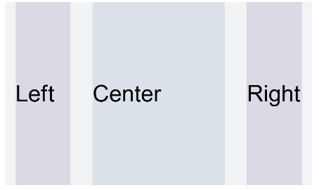

# Grid<a name="EN-US_TOPIC_0000001192755130"></a>

> **NOTE:** 
>-   This attribute is supported since API version 7. Updates will be marked with a superscript to indicate their earliest API version.
>-   The column width and column gap in the grid layout are determined by the nearest parent component  **GridContainer**. The component tree that uses grid attributes must contain one  **GridContainer**  or more.

## Required Permissions<a name="section781125411508"></a>

None

## Attributes<a name="section6820191711316"></a>

<a name="table1265031910316"></a>
<table><thead align="left"><tr id="row9650111916319"><th class="cellrowborder" valign="top" width="15.42%" id="mcps1.1.5.1.1"><p id="p18651919153114"><a name="p18651919153114"></a><a name="p18651919153114"></a>Name</p>
</th>
<th class="cellrowborder" valign="top" width="23.880000000000003%" id="mcps1.1.5.1.2"><p id="p965116197315"><a name="p965116197315"></a><a name="p965116197315"></a>Type</p>
</th>
<th class="cellrowborder" valign="top" width="9.55%" id="mcps1.1.5.1.3"><p id="p4651181953113"><a name="p4651181953113"></a><a name="p4651181953113"></a>Default Value</p>
</th>
<th class="cellrowborder" valign="top" width="51.15%" id="mcps1.1.5.1.4"><p id="p6651191918319"><a name="p6651191918319"></a><a name="p6651191918319"></a>Description</p>
</th>
</tr>
</thead>
<tbody><tr id="row1165131943114"><td class="cellrowborder" valign="top" width="15.42%" headers="mcps1.1.5.1.1 "><p id="p10511918121510"><a name="p10511918121510"></a><a name="p10511918121510"></a>useSizeType</p>
</td>
<td class="cellrowborder" valign="top" width="23.880000000000003%" headers="mcps1.1.5.1.2 "><p id="p2511181812157"><a name="p2511181812157"></a><a name="p2511181812157"></a>{</p>
<p id="p1151191816156"><a name="p1151191816156"></a><a name="p1151191816156"></a>xs?: number | { span: number, offset: number },</p>
<p id="p451101841519"><a name="p451101841519"></a><a name="p451101841519"></a>sm?: number | { span: number, offset: number },</p>
<p id="p12511171851518"><a name="p12511171851518"></a><a name="p12511171851518"></a>md?: number | { span: number, offset: number },</p>
<p id="p951171851514"><a name="p951171851514"></a><a name="p951171851514"></a>lg?: number | { span: number, offset: number }</p>
<p id="p45111418191517"><a name="p45111418191517"></a><a name="p45111418191517"></a>}</p>
</td>
<td class="cellrowborder" valign="top" width="9.55%" headers="mcps1.1.5.1.3 "><p id="p10511518201518"><a name="p10511518201518"></a><a name="p10511518201518"></a>-</p>
</td>
<td class="cellrowborder" valign="top" width="51.15%" headers="mcps1.1.5.1.4 "><p id="p684393617229"><a name="p684393617229"></a><a name="p684393617229"></a>Number of occupied columns and offset columns for a specific device width type. <strong id="b984216415178"><a name="b984216415178"></a><a name="b984216415178"></a>span</strong> indicates the number of occupied columns, and <strong id="b198914651713"><a name="b198914651713"></a><a name="b198914651713"></a>offset</strong> indicates the number of offset columns.</p>
<p id="p251151841510"><a name="p251151841510"></a><a name="p251151841510"></a>If the value is of the number type, only the number of columns can be set. If the value is in the format of {"span": 1, "offset": 0}, both the number of occupied columns and the number of offset columns need to be set.</p>
<a name="ul2612171925511"></a><a name="ul2612171925511"></a><ul id="ul2612171925511"><li><strong id="b9505132215189"><a name="b9505132215189"></a><a name="b9505132215189"></a>xs</strong> indicates that the device width type is <strong id="b1800143718188"><a name="b1800143718188"></a><a name="b1800143718188"></a>SizeType.XS</strong>.</li><li><strong id="b14586121313194"><a name="b14586121313194"></a><a name="b14586121313194"></a>sm</strong> indicates that the device width type is <strong id="b25921113151918"><a name="b25921113151918"></a><a name="b25921113151918"></a>SizeType.SM</strong>.</li></ul>
<a name="ul2246226185512"></a><a name="ul2246226185512"></a><ul id="ul2246226185512"><li><strong id="b109119226192"><a name="b109119226192"></a><a name="b109119226192"></a>md</strong> indicates that the device width type is <strong id="b791132215193"><a name="b791132215193"></a><a name="b791132215193"></a>SizeType.MD</strong>.</li><li><strong id="b662193131916"><a name="b662193131916"></a><a name="b662193131916"></a>lg</strong> indicates that the device width type is <strong id="b46243120198"><a name="b46243120198"></a><a name="b46243120198"></a>SizeType.LG</strong>.</li></ul>
</td>
</tr>
<tr id="row472mcpsimp"><td class="cellrowborder" valign="top" width="15.42%" headers="mcps1.1.5.1.1 "><p id="p160914118157"><a name="p160914118157"></a><a name="p160914118157"></a>gridSpan</p>
</td>
<td class="cellrowborder" valign="top" width="23.880000000000003%" headers="mcps1.1.5.1.2 "><p id="p136091811101519"><a name="p136091811101519"></a><a name="p136091811101519"></a>number</p>
</td>
<td class="cellrowborder" valign="top" width="9.55%" headers="mcps1.1.5.1.3 "><p id="p360921112150"><a name="p360921112150"></a><a name="p360921112150"></a>1</p>
</td>
<td class="cellrowborder" valign="top" width="51.15%" headers="mcps1.1.5.1.4 "><p id="p176091311181517"><a name="p176091311181517"></a><a name="p176091311181517"></a>Default number of occupied columns, that is, the number of occupied columns when <strong id="b6649102618447"><a name="b6649102618447"></a><a name="b6649102618447"></a>span</strong> in <strong id="b19930913182017"><a name="b19930913182017"></a><a name="b19930913182017"></a>useSizeType</strong> is not set.</p>
<div class="note" id="note155021950101610"><a name="note155021950101610"></a><a name="note155021950101610"></a><span class="notetitle"> NOTE: </span><div class="notebody"><p id="p20503115041613"><a name="p20503115041613"></a><a name="p20503115041613"></a>If the <strong id="b16051041164415"><a name="b16051041164415"></a><a name="b16051041164415"></a>span</strong> attribute is set, the component width is determined by the grid layout.</p>
</div></div>
</td>
</tr>
<tr id="row481mcpsimp"><td class="cellrowborder" valign="top" width="15.42%" headers="mcps1.1.5.1.1 "><p id="p3156334151515"><a name="p3156334151515"></a><a name="p3156334151515"></a>gridOffset</p>
</td>
<td class="cellrowborder" valign="top" width="23.880000000000003%" headers="mcps1.1.5.1.2 "><p id="p16156143420150"><a name="p16156143420150"></a><a name="p16156143420150"></a>number</p>
</td>
<td class="cellrowborder" valign="top" width="9.55%" headers="mcps1.1.5.1.3 "><p id="p1615611347155"><a name="p1615611347155"></a><a name="p1615611347155"></a>0</p>
</td>
<td class="cellrowborder" valign="top" width="51.15%" headers="mcps1.1.5.1.4 "><p id="p515683491513"><a name="p515683491513"></a><a name="p515683491513"></a>Default number of offset columns, that is, the number of offset columns in the start direction of the parent component (which is also the nth column that the component is in) when <strong id="b3400101818454"><a name="b3400101818454"></a><a name="b3400101818454"></a>offset</strong> in <strong id="b14440314112111"><a name="b14440314112111"></a><a name="b14440314112111"></a>useSizeType</strong> is not set.</p>
<div class="note" id="note31561434121517"><a name="note31561434121517"></a><a name="note31561434121517"></a><span class="notetitle"> NOTE: </span><div class="notebody"><p id="p1315613431519"><a name="p1315613431519"></a><a name="p1315613431519"></a>1. After this attribute is set, the horizontal layout of the current component does not follow the original layout of the parent component. Instead, it offsets along the start direction of the parent component.</p>
<p id="p3156203412152"><a name="p3156203412152"></a><a name="p3156203412152"></a>2. Offset = (Column width + Gap) x Number of columns</p>
<p id="p16156113416159"><a name="p16156113416159"></a><a name="p16156113416159"></a>3. After this attribute is set, sibling components will be arranged relatively to this component, as in the relative layout.</p>
</div></div>
</td>
</tr>
</tbody>
</table>

## Example<a name="section1976245813394"></a>

```
@Entry
@Component
struct GridContainerExample1 {
  build(){
    GridContainer() {
      Row({}) {
        Row() {
          Text('Left').fontSize(25)
        }
        .useSizeType({
          xs: { span: 1, offset: 0 }, sm: { span: 1, offset: 0 },
          md: { span: 1, offset: 0 }, lg: { span: 2, offset: 0 }
        })
        .height("100%")
        .backgroundColor(0x66bbb2cb)
        Row() {
          Text('Center').fontSize(25)
        }
        .useSizeType({
          xs: { span: 1, offset: 0 }, sm: { span: 2, offset: 1 },
          md: { span: 5, offset: 1 }, lg: { span: 7, offset: 2 }
        })
        .height("100%")
        .backgroundColor(0x66b6c5d1)
        Row() {
          Text('Right').fontSize(25)
        }
        .useSizeType({
          xs: { span: 1, offset: 0 }, sm: { span: 1, offset: 3 },
          md: { span: 2, offset: 6 }, lg: { span: 3, offset: 9 }
        })
        .height("100%")
        .backgroundColor(0x66bbb2cb)
      }
      .height(200)
    }
    .backgroundColor(0xf1f3f5)
    .margin({ top: 10 })
  }
}
```

**Figure  1**  Device width type SM<a name="fig20276133417719"></a>  


**Figure  2**  Device width type MD<a name="fig677595214820"></a>  


**Figure  3**  Device width type LG<a name="fig15900112016917"></a>  


