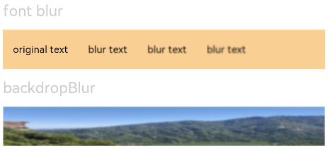
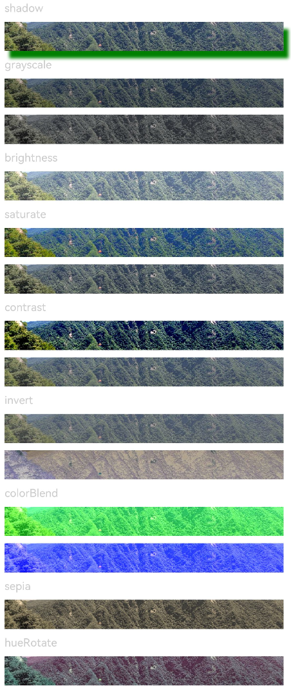
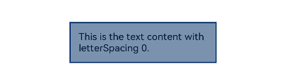
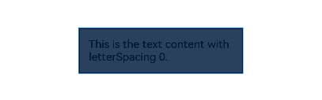
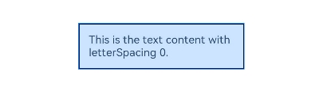
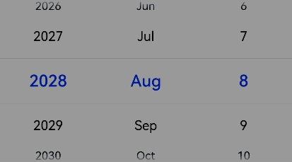
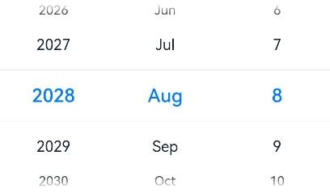
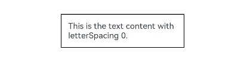
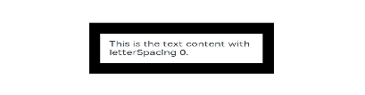

# Image Effects

Image effects include blur, shadow, spherical effect, and much more.

>  **NOTE**
>
>  The APIs of this module are supported since API version 7. Updates will be marked with a superscript to indicate their earliest API version.


## Attributes


| Name                            | Type                                                    | Default Value| Description                                                        |
| -------------------------------- | ------------------------------------------------------------ | ------ | ------------------------------------------------------------ |
| blur                             | number                                                       | -      | Content blur radius of the component. A greater value indicates a higher blur degree. If the value is **0**, the content is not blurred.<br>Value range: [0, +∞)<br>Since API version 9, this API is supported in ArkTS widgets.|
| backdropBlur                     | number                                                       | -      | Background blur radius of the component. A greater value indicates a higher blur degree. If the value is **0**, the background is not blurred.<br>Value range: [0, +∞)<br>Since API version 9, this API is supported in ArkTS widgets.|
| shadow                           | [ShadowOptions](#shadowoptions) \| [ShadowStyle](#shadowstyle10)<sup>10+</sup> | -      | Shadow of the component.<br>When the value type is **ShadowOptions**, the blur radius, shadow color, and offset along the x-axis and y-axis can be specified.<br>When the value type is **ShadowStyle**, the shadow style can be specified.<br>Since API version 9, this API is supported in ArkTS widgets, except that the [ShadowStyle](#shadowstyle10) type is not supported.|
| grayscale                        | number                                                       | 0.0    | Grayscale conversion ratio of the component. If the value is **1.0**, the component is completely converted to grayscale. If the value is **0.0**, the component remains unchanged. Between 0 and 1, the value applies a linear multiplier on the grayscale effect. The unit is percentage.<br>Value range: [0, 1]<br>**NOTE**<br>A value less than 0 evaluates to the value **0**. A value greater than 1 evaluates to the value **1**.<br>Since API version 9, this API is supported in ArkTS widgets.|
| brightness                       | number                                                       | 1.0    | Brightness of the component. The value **1** indicates no effects. The value **0** indicates the complete darkness. If the value is less than **1**, the brightness decreases. If the value is greater than **1**, the brightness increases. A greater value indicates a higher brightness.<br>Value range: [0, +∞)<br>**NOTE**<br>A value less than 0 evaluates to the value **0**.<br>Since API version 9, this API is supported in ArkTS widgets.|
| saturate                         | number                                                       | 1.0    | Saturation of the component. The saturation is the ratio of the chromatic component to the achromatic component (gray) in a color. If the value is **1**, the source image is displayed. If the value is greater than **1**, a higher percentage of the chromatic component indicates a higher saturation. If the value is less than **1**, a higher percentage of the achromatic component indicates a lower saturation. The unit is percentage.<br>Value range: [0, +∞)<br>**NOTE**<br>A value less than 0 evaluates to the value **0**.<br>Since API version 9, this API is supported in ArkTS widgets.|
| contrast                         | number                                                       | 1.0    | Contrast of the component. The input parameter is a contrast value. If the value is **1**, the source image is displayed. If the value is greater than 1, a larger value indicates a higher contrast and a clearer image. If the value is less than 1, a smaller value indicates a lower contrast is. If the value is **0**, the image becomes all gray. The unit is percentage.<br>Value range: [0, +∞)<br>**NOTE**<br>A value less than 0 evaluates to the value **0**.<br>Since API version 9, this API is supported in ArkTS widgets.|
| invert                           | number                                                       | 0      | Inversion ratio of the component. If the value is **1**, the component is completely inverted. If the value is **0**, the component remains unchanged. The unit is percentage.<br>Value range: [0, 1]<br>**NOTE**<br>A value less than 0 evaluates to the value **0**.<br>Since API version 9, this API is supported in ArkTS widgets.|
| sepia                            | number                                                       | 0      | Sepia conversion ratio of the component. If the value is **1**, the image is completely sepia. If the value is **0**, the component remains unchanged. The unit is percentage.<br>Since API version 9, this API is supported in ArkTS widgets.|
| hueRotate                        | number \| string                                   | '0deg' | Hue rotation angle of the component.<br>Value range: (-∞, +∞)<br>**NOTE**<br>A rotation of 360 degrees leaves the color unchanged. A rotation of 180 degrees and then -180 degrees also leaves the color unchanged. When the data type is number, the value 90 is equivalent to **'90deg'**.<br>Since API version 9, this API is supported in ArkTS widgets.|
| colorBlend<sup>8+</sup>    | [Color](ts-appendix-enums.md#color) \| string \| [Resource](ts-types.md#resource) | -      | Color to blend with the component.<br>Since API version 9, this API is supported in ArkTS widgets.|
| sphericalEffect<sup>10+</sup>    | [number]                                                     | -      | Spherical degree of the component.<br>The value ranges from 0 to 1.<br>**NOTE**<br>1. If the value is **0**, the component remains unchanged. If the value is **1**, the component is completely spherical. Between 0 and 1, a greater value indicates a higher spherical degree.<br>A value less than 0 evaluates to the value **0**. A value greater than 1 evaluates to the value **1**.<br> 2. If a component image is loaded asynchronously, the spherical effect is not supported. For example, the **\<Image>** component uses asynchronous loading by default, which means that **syncLoad** must be set to **true** to apply the spherical effect. However, this setting is not recommended. Asynchronous loading is also used for **backgroundImage**. Therefore, if **backgroundImage** is set, the spherical effect is not supported.<br>3. If the shadow effect is set for a component, the spherical effect is not supported.<br>This is a system API.|
| lightUpEffect<sup>10+</sup>      | [number]                                                     | -      | Light up degree of the component.<br>The value ranges from 0 to 1.<br>If the value is **0**, the component is dark. If the value is **1**, the component is fully illuminated. Between 0 and 1, a greater value indicates higher luminance. A value less than 0 evaluates to the value **0**. A value greater than 1 evaluates to the value **1**.<br>This is a system API.|
| pixelStretchEffect<sup>10+</sup> | [PixelStretchEffectOptions](ts-types.md#pixelstretcheffectoptions10) | -      | Pixel stretch effect options.<br>The **options** parameter includes the length by which a pixel is stretched toward the four edges.<br>**NOTE**<br>1. If the length is a positive value, the original image is stretched, and the image size increases. The edge pixels grow by the set length toward the top, bottom, left, and right edges.<br>2. 2. If the length is a negative value, the original image shrinks as follows, but the image size remains unchanged:<br>(1) The image shrinks from the four edges by the absolute value of length set through **options**.<br>(2) The image is stretched back to the original size with edge pixels.<br>3. Constraints on **options**:<br>(1) The length values for the four edges must be all positive or all negative. That is, the four edges are stretched or shrink at the same time in the same direction.<br>(2) The length values must all be a percentage or a specific value. Combined use of the percentage and specific value is not allowed.<br>(3) If the input value is invalid, the image is displayed as {0, 0, 0, 0}, that is, the image is the same as the original image.<br>This is a system API.|

## ShadowOptions

Provides the shadow attributes, including the blur radius, color, and offset along the x-axis and y-axis.

Since API version 9, this API is supported in ArkTS widgets.

| Name    | Type    | Mandatory  | Description             |
| ------ | ------ | ---- | --------------- |
| radius    | number \| [Resource](ts-types.md#resource)  | Yes   | Blur radius of the shadow.<br>Value range: [0, +∞)<br>**NOTE**<br>A value less than 0 evaluates to the value **0**.|
| color  | [Color](ts-appendix-enums.md#color) \| string \| [Resource](ts-types.md#resource)  | No   | Color of the shadow.<br>The default color is black.|
| offsetX | number \| [Resource](ts-types.md#resource)  | No   | Offset of the shadow along the x-axis.<br>The default value is **0**. |
| offsetY   | number \| [Resource](ts-types.md#resource)  | No   | Offset of the shadow along the y-axis.<br>The default value is **0**.|

## ShadowStyle<sup>10+</sup>

| Name  | Description                                  |
| ------ | -------------------------------------- |
| OUTER_DEFAULT_XS  | Mini shadow.|
| OUTER_DEFAULT_SM | Small shadow.|
| OUTER_DEFAULT_MD    | Medium shadow.|
| OUTER_DEFAULT_LG    | Large shadow.|
| OUTER_FLOATING_SM    | Floating small shadow.|
| OUTER_FLOATING_MD    | Floating medium shadow.|

## Example

### Example 1
Use **blur** to add the content blur effect and **backdropBlur** to add the background blur effect.
```ts
// xxx.ets
@Entry
@Component
struct BlurEffectsExample {
  build() {
    Column({ space: 10 }) {
      // Blur the font.
      Text('font blur').fontSize(15).fontColor(0xCCCCCC).width('90%')
      Flex({ alignItems: ItemAlign.Center }) {
        Text('original text').margin(10)
        Text('blur text')
          .blur(1).margin(10)
        Text('blur text')
          .blur(2).margin(10)
        Text('blur text')
          .blur(3).margin(10)
      }.width('90%').height(40)
      .backgroundColor(0xF9CF93)


      // Blur the background.
      Text('backdropBlur').fontSize(15).fontColor(0xCCCCCC).width('90%')
      Text()
        .width('90%')
        .height(40)
        .fontSize(16)
        .backdropBlur(3)
        .backgroundImage('/pages/attrs/image/image.jpg')
        .backgroundImageSize({ width: 1200, height: 160 })
    }.width('100%').margin({ top: 5 })
  }
}
```



### Example 2
Apply different image effects.
```ts
// xxx.ets
@Entry
@Component
struct ImageEffectsExample {
  build() {
    Column({ space: 10 }) {
      // Apply the shadow effect.
      Text('shadow').fontSize(15).fontColor(0xCCCCCC).width('90%')
      Image($r('app.media.image'))
        .width('90%')
        .height(40)
        .shadow({ radius: 10, color: Color.Green, offsetX: 20, offsetY: 30 })

      // Apply the grayscale effect. The grayscale value ranges from 0 to 1. The closer the grayscale value is to 1, the more obvious the grayscale effect is.
      Text('grayscale').fontSize(15).fontColor(0xCCCCCC).width('90%')
      Image($r('app.media.image')).width('90%').height(40).grayscale(0.3)
      Image($r('app.media.image')).width('90%').height(40).grayscale(0.8)

      // Apply the brightness effect. The value 1 indicates no effects. If the value is less than 1, the brightness decreases. If the value is greater than 1, the brightness increases.
      Text('brightness').fontSize(15).fontColor(0xCCCCCC).width('90%')
      Image($r('app.media.image')).width('90%').height(40).brightness(1.2)

      // Apply the saturation effect. If the value is 1, the source image is displayed.
      Text('saturate').fontSize(15).fontColor(0xCCCCCC).width('90%')
      Image($r('app.media.image')).width('90%').height(40).saturate(2.0)
      Image($r('app.media.image')).width('90%').height(40).saturate(0.7)

      // Apply the contrast effect. If the value is 1, the source image is displayed. If the value is greater than 1, a larger value indicates a higher contrast and a clearer image. If the value is less than 1, a smaller value indicates a lower contrast is.
      Text('contrast').fontSize(15).fontColor(0xCCCCCC).width('90%')
      Image($r('app.media.image')).width('90%').height(40).contrast(2.0)
      Image($r('app.media.image')).width('90%').height(40).contrast(0.8)

      // Invert the image.
      Text('invert').fontSize(15).fontColor(0xCCCCCC).width('90%')
      Image($r('app.media.image')).width('90%').height(40).invert(0.2)
      Image($r('app.media.image')).width('90%').height(40).invert(0.8)

      // Apply the color blend effect.
      Text('colorBlend').fontSize(15).fontColor(0xCCCCCC).width('90%')
      Image($r('app.media.image')).width('90%').height(40).colorBlend(Color.Green)
      Image($r('app.media.image')).width('90%').height(40).colorBlend(Color.Blue)

      // Convert the image color to sepia.
      Text('sepia').fontSize(15).fontColor(0xCCCCCC).width('90%')
      Image($r('app.media.image')).width('90%').height(40).sepia(0.8)

      // Apply the hue rotation effect.
      Text('hueRotate').fontSize(15).fontColor(0xCCCCCC).width('90%')
      Image($r('app.media.image')).width('90%').height(40).hueRotate(90)
    }.width('100%').margin({ top: 5 })
  }
}
```



### Example 3

You can apply a spherical effect to a component to make it appear spherized.

```ts
// xxx.ets
@Entry
@Component
struct SphericalEffectExample {
  build() {
    Stack() {
      TextInput({placeholder: "Enter a percentage."})
        .width('50%')
        .height(35)
        .type(InputType.Number)
        .enterKeyType(EnterKeyType.Done)
        .caretColor(Color.Red)
        .placeholderColor(Color.Blue)
        .placeholderFont({
          size: 20,
          style: FontStyle.Italic,
          weight: FontWeight.Bold
        })
        .sphericalEffect(0.5)
    }.alignContent(Alignment.Center).width("100%").height("100%")
  }
}

```

Below is how the component looks with the spherical effect applied:


Below is how the component looks without the spherical effect applied:


### Example 4

You can apply a light up effect to a component.

```ts
// xxx.ets
@Entry
@Component
struct LightUpExample {
  build() {
    Stack() {
      Text('This is the text content with letterSpacing 0.')
        .letterSpacing(0)
        .fontSize(12)
        .border({ width: 1 })
        .padding(10)
        .width('50%')
        .lightUpEffect(0.6)
    }.alignContent(Alignment.Center).width("100%").height("100%")
  }
}

```

Below is how the component looks with **lightUpEffect** set to **0.6**:



Below is how the component looks with **lightUpEffect** set to **0.2**:



Below is how the component looks without the light up effect applied:



### Example 5

```ts
// xxx.ets
@Entry
@Component
struct LightUpExample {
  @State isLunar: boolean = false
  private selectedDate: Date = new Date('2028-08-08')
  build() {
    Stack() {
      DatePicker({
        start: new Date('1970-1-1'),
        end: new Date('2100-1-1'),
        selected: this.selectedDate
      })
        .lunar(this.isLunar)
        .onChange((value: DatePickerResult) => {
          this.selectedDate.setFullYear(value.year, value.month, value.day)
          console.info('select current date is: ' + JSON.stringify(value))
        })
        .lightUpEffect(0.6)

    }.alignContent(Alignment.Center).width("100%").height("100%")
  }
}
```



Below is how the component looks without the light up effect applied:



### Example 6

You can apply a pixel stretch effect to a component.

```ts
// xxx.ets
@Entry
@Component
struct PixelStretchExample {
  build() {
    Stack() {
      Text('This is the text content with letterSpacing 0.')
        .letterSpacing(0)
        .fontSize(12)
        .border({ width: 1 })
        .padding(10)
        .width('50%')
        .pixelStretchEffect({top:10,left:10,right:10,bottom:10 })
    }.alignContent(Alignment.Center).width("100%").height("100%")
  }
}

```

Below is how the component looks with **lightUpEffect** set to **0.6**:


Below is how the component looks without the pixel stretch effect applied:



### Example 7

Based on Example 6, change the length values of the pixel stretch effect to negative:

```ts
// xxx.ets
@Entry
@Component
struct PixelStretchExample {
  build() {
    Stack() {
      Text('This is the text content with letterSpacing 0.')
        .letterSpacing(0)
        .fontSize(12)
        .border({ width: 1 })
        .padding(10)
        .width('50%')
        .pixelStretchEffect({top:-10,left:-10,right:-10,bottom:-10 })
    }.alignContent(Alignment.Center).width("100%").height("100%")
  }
}
```

Below is how the component looks:



Compared with the original image, the effect drawing is implemented in two steps:

1. The image size is reduced. The resultant size is the original image size minus the lengths by which the pixels shrink. For example, if the original image size is 100 x 100 and **pixelStretchEffect({top:-10,left:-10,**
**right:-10,bottom:-10})** is set, the resultant size is (100-10-10) x (100-10-10), that is, 8080.
2. Edge pixels are stretched to restore the image to its original size.