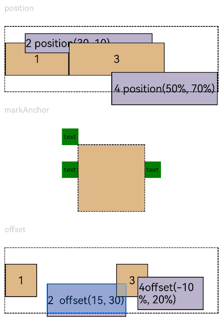

# Location

The location attributes set the alignment mode, layout direction, and position of a component.

>  **NOTE**
>
>  The APIs of this module are supported since API version 7. Updates will be marked with a superscript to indicate their earliest API version.


## Attributes


| Name| Type| Description|
| -------- | -------- | -------- |
| align | [Alignment](ts-appendix-enums.md#alignment) | Alignment mode of the component content in the drawing area.<br>Default value: **Alignment.Center**<br>Since API version 9, this API is supported in ArkTS widgets.|
| direction | [Direction](ts-appendix-enums.md#direction) | Horizontal layout of the component.<br>Default value: **Direction.Auto**<br>Since API version 9, this API is supported in ArkTS widgets.|
| position | [Position](ts-types.md#position8) | Offset of the component's upper left corner relative to the parent component's upper left corner. This offset is expressed using absolute values. When laying out components, this attribute does not affect the layout of the parent component. It only adjusts the component position during drawing.<br>This attribute is applicable to scenarios where the component is fixed at a position in the parent container, for example, where it is pinned to top or floating above the UI.<br>Since API version 9, this API is supported in ArkTS widgets.|
| markAnchor | [Position](ts-types.md#position8) | Anchor point of the component for positioning. The upper left corner of the component is used as the reference point for offset. Generally, this attribute is used together with the **position** and **offset** attributes. When used independently, this attribute is similar to **offset**.<br>Default value:<br>{<br>x: 0,<br>y: 0<br>}<br>Since API version 9, this API is supported in ArkTS widgets.|
| offset | [Position](ts-types.md#position8) | Offset of the component relative to itself. This offset is expressed using relative values. This attribute does not affect the layout of the parent component. It only adjusts the component position during drawing.<br>Default value:<br>{<br>x: 0,<br>y: 0<br>}<br>Since API version 9, this API is supported in ArkTS widgets.|
| alignRules<sup>9+</sup> | {<br>left?: { anchor: string, align: [HorizontalAlign](ts-appendix-enums.md#horizontalalign) };<br>right?: { anchor: string, align: [HorizontalAlign](ts-appendix-enums.md#horizontalalign) };<br>middle?: { anchor: string, align: [HorizontalAlign](ts-appendix-enums.md#horizontalalign) };<br>top?: { anchor: string, align: [VerticalAlign](ts-appendix-enums.md#verticalalign) };<br>bottom?: { anchor: string, align: [VerticalAlign](ts-appendix-enums.md#verticalalign) };<br>center?: { anchor: string, align: [VerticalAlign](ts-appendix-enums.md#verticalalign) }<br>} | Alignment rules relative to the container. This attribute is valid only when the container is [\<RelativeContainer>](ts-container-relativecontainer.md).<br>- **left**: left-aligned.<br>- **right**: right-aligned.<br>- **middle**: center-aligned.<br>- **top**: top-aligned.<br>- **bottom**: bottom-aligned.<br>- **center**: center-aligned.<br>This API is supported in ArkTS widgets.<br>**NOTE**<br>- **anchor**: ID of the component that functions as the anchor point.<br>- **align**: alignment mode relative to the anchor component.|


## Example
### Example 1
```ts
// xxx.ets
@Entry
@Component
struct PositionExample1 {
  build() {
    Column() {
      Column({ space: 10 }) {
        // When the component content is within the area specified by the component width and height, set the alignment mode of the content in the component.
        Text('align').fontSize(9).fontColor(0xCCCCCC).width('90%')
        Stack() {
          Text('First show in bottom end').height('65%').backgroundColor(0xD2B48C)
          Text('Second show in bottom end').backgroundColor(0xF5DEB3).opacity(0.9)
        }.width('90%').height(50).margin({ top: 5 }).backgroundColor(0xFFE4C4)
        .align(Alignment.BottomEnd)
        Stack() {
          Text('top start')
        }.width('90%').height(50).margin({ top: 5 }).backgroundColor(0xFFE4C4)
        .align(Alignment.TopStart)

        // To arrange the child components from left to right, set direction of the parent container to Direction.Ltr.
        Text('direction').fontSize(9).fontColor(0xCCCCCC).width('90%')
        Row() {
          Text('1').height(50).width('25%').fontSize(16).backgroundColor(0xF5DEB3)
          Text('2').height(50).width('25%').fontSize(16).backgroundColor(0xD2B48C)
          Text('3').height(50).width('25%').fontSize(16).backgroundColor(0xF5DEB3)
          Text('4').height(50).width('25%').fontSize(16).backgroundColor(0xD2B48C)
        }
        .width('90%')
        .direction(Direction.Ltr)
        // To arrange the child components from right to left, set direction of the parent container to Direction.Rtl.
        Row() {
          Text('1').height(50).width('25%').fontSize(16).backgroundColor(0xF5DEB3).textAlign(TextAlign.End)
          Text('2').height(50).width('25%').fontSize(16).backgroundColor(0xD2B48C).textAlign(TextAlign.End)
          Text('3').height(50).width('25%').fontSize(16).backgroundColor(0xF5DEB3).textAlign(TextAlign.End)
          Text('4').height(50).width('25%').fontSize(16).backgroundColor(0xD2B48C).textAlign(TextAlign.End)
        }
        .width('90%')
        .direction(Direction.Rtl)
      }
    }
    .width('100%').margin({ top: 5 })
  }
}
```


### Example 2
```ts
// xxx.ets
@Entry
@Component
struct PositionExample2 {
  build() {
    Column({ space: 20 }) {
      // Set the offset of the component's upper left corner relative to the parent component's upper left corner.
      Text('position').fontSize(12).fontColor(0xCCCCCC).width('90%')
      Row() {
        Text('1').size({ width: '30%', height: '50' }).backgroundColor(0xdeb887).border({ width: 1 }).fontSize(16)
          .textAlign(TextAlign.Center)
        Text('2 position(30, 10)')
          .size({ width: '60%', height: '30' })
          .backgroundColor(0xbbb2cb)
          .border({ width: 1 })
          .fontSize(16)
          .align(Alignment.Start)
          .position({ x: 30, y: 10 })
        Text('3').size({ width: '45%', height: '50' }).backgroundColor(0xdeb887).border({ width: 1 }).fontSize(16)
          .textAlign(TextAlign.Center)
        Text('4 position(50%, 70%)')
          .size({ width: '50%', height: '50' })
          .backgroundColor(0xbbb2cb)
          .border({ width: 1 })
          .fontSize(16)
          .position({ x: '50%', y: '70%' })
      }.width('90%').height(100).border({ width: 1, style: BorderStyle.Dashed })

      // Offset relative to the start point. x indicates the horizontal distance between the end point and the start point. If the value of x is greater than 0, the component is offset to the left. Otherwise, the component is offset to the right.
      // y indicates the vertical distance between the end point and the start point. If the value of y is greater than 0, the component is offset to the top. Otherwise, the component is offset to the bottom.
      Text('markAnchor').fontSize(12).fontColor(0xCCCCCC).width('90%')
      Stack({ alignContent: Alignment.TopStart }) {
        Row()
          .size({ width: '100', height: '100' })
          .backgroundColor(0xdeb887)
        Text('text')
          .fontSize('30px')
          .textAlign(TextAlign.Center)
          .size({ width: 25, height: 25 })
          .backgroundColor(Color.Green)
          .markAnchor({ x: 25, y: 25 })
        Text('text')
          .fontSize('30px')
          .textAlign(TextAlign.Center)
          .size({ width: 25, height: 25 })
          .backgroundColor(Color.Green)
          .markAnchor({ x: -100, y: -25 })
        Text('text')
          .fontSize('30px')
          .textAlign(TextAlign.Center)
          .size({ width: 25, height: 25 })
          .backgroundColor(Color.Green)
          .markAnchor({ x: 25, y: -25 })
      }.margin({ top: 25 }).border({ width: 1, style: BorderStyle.Dashed })

      // Offset of the component relative to itself. If the value of x is greater than 0, the component is offset to the right. Otherwise, the component is offset to the left. If the value of y is greater than 0, the component is offset to the bottom. Otherwise, the component is offset to the top.
      Text('offset').fontSize(12).fontColor(0xCCCCCC).width('90%')
      Row() {
        Text('1').size({ width: '15%', height: '50' }).backgroundColor(0xdeb887).border({ width: 1 }).fontSize(16)
          .textAlign(TextAlign.Center)
        Text('2  offset(15, 30)')
          .size({ width: 120, height: '50' })
          .backgroundColor(0xbbb2cb)
          .border({ width: 1 })
          .fontSize(16)
          .align(Alignment.Start)
          .offset({ x: 15, y: 30 })
        Text('3').size({ width: '15%', height: '50' }).backgroundColor(0xdeb887).border({ width: 1 }).fontSize(16)
          .textAlign(TextAlign.Center)
        Text('4 offset(-10%, 20%)')
          .size({ width: 100, height: '50' })
          .backgroundColor(0xbbb2cb)
          .border({ width: 1 })
          .fontSize(16)
          .offset({ x: '-5%', y: '20%' })
      }.width('90%').height(100).border({ width: 1, style: BorderStyle.Dashed })
    }
    .width('100%').margin({ top: 25 })
  }
}
```


