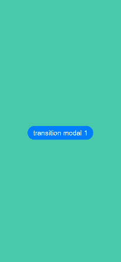

# Modal Transition

You can bind a full-screen modal to a component through the **bindContentCover** attribute. Better yet, with the **ModalTransition** parameter, you can apply a transition effect for when the component is inserted or deleted.

>  **NOTE**
>
>  The APIs of this module are supported since API version 10. Updates will be marked with a superscript to indicate their earliest API version.
>  Switching between landscape and portrait modes is not supported.

## Attributes

| Name              | Parameter                                      | Description                                    |
| ---------------- | ---------------------------------------- | ---------------------------------------- |
| bindContentCover | isShow: boolean,<br>builder: [CustomBuilder](ts-types.md#custombuilder8),<br>type?: [ModalTransition](ts-types.md#modaltransition10) | Binds a modal to the component, which can be displayed when the component is touched. The content of the modal is customizable. The transition type can be set to none, slide-up and slide-down animation, and opacity gradient animation.<br>**isShow**: whether to display the modal. Mandatory.<br>**builder**: content of the modal. Mandatory.<br>**type**: transition type of the modal. This parameter is optional. |

## Example

### Example 1

This example applies a custom animation to two modals whose transition type is none.

```ts
// xxx.ets
@Entry
@Component
struct ModalTransitionExample {
  @State isShow:boolean = false
  @State isShow2:boolean = false

  @Builder myBuilder2() {
    Column() {
      Button("close modal 2")
        .margin(10)
        .fontSize(20)
        .onClick(()=>{
          this.isShow2 = false;
        })
    }
    .width('100%')
    .height('100%')
    .backgroundColor(Color.Orange)
  }

  @Builder myBuilder() {
    Column() {
      Button("transition modal 2")
        .margin(10)
        .fontSize(20)
        .onClick(()=>{
          this.isShow2 = true;
        }).bindContentCover($$this.isShow2, this.myBuilder2(), ModalTransition.NONE)

      Button("close modal 1")
        .margin(10)
        .fontSize(20)
        .onClick(()=>{
          this.isShow = false;
        })
    }
    .width('100%')
    .height('100%')
    .backgroundColor(Color.Pink)
    .justifyContent(FlexAlign.Center)
  }

  build() {
    Column() {
      Button("transition modal 1")
        .onClick(() => {
          this.isShow = true
        })
        .fontSize(20)
        .margin(10)
        .bindContentCover($$this.isShow, this.myBuilder(), ModalTransition.NONE)
    }
    .justifyContent(FlexAlign.Center)
    .backgroundColor("#ff49c8ab")
    .width('100%')
    .height('100%')
  }
}
```


### Example 2

This example applies a custom animation to two modals whose transition type is none.

```ts
// xxx.ets
import curves from '@ohos.curves';
@Entry
@Component
struct ModalTransitionExample {
  @State  @Watch("isShow1Change") isShow:boolean = false
  @State  @Watch("isShow2Change") isShow2:boolean = false
  @State isScale1:number = 1;
  @State isScale2:number = 1;
  @State flag: boolean = true
  @State show: string = 'show'

  isShow1Change() {
    this.isShow ? this.isScale1 = 0.95 : this.isScale1 = 1
  }
  isShow2Change() {
    this.isShow2 ? this.isScale2 = 0.95 : this.isScale2 = 1
  }
  @Builder myBuilder2() {
    Column() {
      Button("close modal 2")
        .margin(10)
        .fontSize(20)
        .onClick(()=>{
          this.isShow2 = false;
        })
    }
    .width('100%')
    .height('100%')
    .backgroundColor(Color.Orange)
  }


  @Builder myBuilder() {
    Column() {
      Button("transition modal 2")
        .margin(10)
        .fontSize(20)
        .onClick(()=>{
          this.isShow2 = true;
        }).bindContentCover($$this.isShow2, this.myBuilder2(), ModalTransition.NONE)

      Button("close modal 1")
        .margin(10)
        .fontSize(20)
        .onClick(()=>{
          this.isShow = false;
        })
    }
    .width('100%')
    .height('100%')
    .backgroundColor(Color.Pink)
    .justifyContent(FlexAlign.Center)
    .scale({x: this.isScale2, y: this.isScale2})
    .animation({curve:curves.springMotion()})
  }

  build() {
    Column() {
      Button("transition modal 1")
        .onClick(() => {
          this.isShow = true
        })
        .fontSize(20)
        .margin(10)
        .bindContentCover($$this.isShow, this.myBuilder(), ModalTransition.NONE)
    }
    .justifyContent(FlexAlign.Center)
    .backgroundColor("#ff49c8ab")
    .width('100%')
    .height('100%')
    .scale({ x: this.isScale1, y: this.isScale1 })
    .animation({ curve: curves.springMotion() })
  }
}
```



### Example 3

This example shows two modals whose transition type is slide-up and slide-down animation.

```ts
// xxx.ets
@Entry
@Component
struct ModalTransitionExample {
  @State isShow:boolean = false
  @State isShow2:boolean = false

  @Builder myBuilder2() {
    Column() {
      Button("close modal 2")
        .margin(10)
        .fontSize(20)
        .onClick(()=>{
          this.isShow2 = false;
        })
    }
    .width('100%')
    .height('100%')
    .backgroundColor(Color.Gray)
  }

  @Builder myBuilder() {
    Column() {
      Button("transition modal 2")
        .margin(10)
        .fontSize(20)
        .onClick(()=>{
          this.isShow2 = true;
        }).bindContentCover(this.isShow2, this.myBuilder2(), ModalTransition.DEFAULT)

      Button("close modal 1")
        .margin(10)
        .fontSize(20)
        .onClick(()=>{
          this.isShow = false;
        })
    }
    .width('100%')
    .height('100%')
    .backgroundColor(Color.Pink)
    .justifyContent(FlexAlign.Center)
  }

  build() {
    Column() {
      Button("transition modal 1")
        .onClick(() => {
          this.isShow = true
        })
        .fontSize(20)
        .margin(10)
        .bindContentCover($$this.isShow, this.myBuilder(), ModalTransition.DEFAULT)
    }
    .justifyContent(FlexAlign.Center)
    .backgroundColor(Color.White)
    .width('100%')
    .height('100%')
  }
}
```


### Example 4

This example shows two modals whose transition type is opacity gradient animation.

```ts
// xxx.ets
@Entry
@Component
struct ModalTransitionExample {
  @State isShow:boolean = false
  @State isShow2:boolean = false

  @Builder myBuilder2() {
    Column() {
      Button("close modal 2")
        .margin(10)
        .fontSize(20)
        .onClick(()=>{
          this.isShow2 = false;
        })
    }
    .width('100%')
    .height('100%')
    .backgroundColor(Color.Gray)
    .justifyContent(FlexAlign.Center)
  }


  @Builder myBuilder() {
    Column() {
      Button("transition modal 2")
        .margin(10)
        .fontSize(20)
        .onClick(()=>{
          this.isShow2 = true;
        }).bindContentCover(this.isShow2, this.myBuilder2(), ModalTransition.ALPHA)

      Button("close modal 1")
        .margin(10)
        .fontSize(20)
        .onClick(()=>{
          this.isShow = false;
        })
    }
    .width('100%')
    .height('100%')
    .backgroundColor(Color.Pink)
    .justifyContent(FlexAlign.Center)
  }

  build() {
    Column() {
      Button("transition modal 1")
        .onClick(() => {
          this.isShow = true
        })
        .fontSize(20)
        .margin(10)
        .bindContentCover($$this.isShow, this.myBuilder(), ModalTransition.ALPHA)
    }
    .justifyContent(FlexAlign.Center)
    .backgroundColor(Color.White)
    .width('100%')
    .height('100%')
  }
}
```


