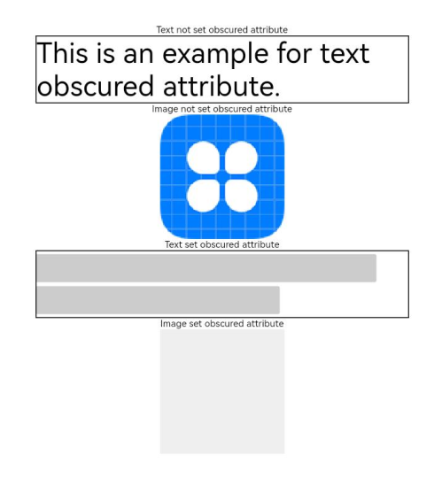

# Obscuring

When needed, you can obscure content of a component.

>  **NOTE**
>
> The APIs of this module are supported since API version 10. Updates will be marked with a superscript to indicate their earliest API version.


## Attributes


| Name   | Type                                    | Description                                 |
| -----| ------------------------------------------ | ------------------------------------ |
| obscured | Array<[ObscuredReasons](ts-appendix-enums.md#obscuredreasons10)> | How the component content is obscured.<br>Default value: **[]**<br>This API is supported in ArkTS widgets.<br>This API only works for the [\<Image>](ts-basic-components-image.md) and [\<Text>](ts-basic-components-text.md) components.<br>**NOTE**<br>To obscure an image when it is being loaded, you must set the width and height of the **\<Image>** component. |

## Example

```ts
// xxx.ets
@Entry
@Component
struct ObscuredExample {
  build() {
    Row() {
      Column() {
        Text('Text not set obscured attribute').fontSize(10).fontColor(Color.Black)
        Text('This is an example for text obscured attribute.')
          .fontSize(30)
          .width('600px')
          .fontColor(Color.Black)
          .border({ width: 1 })
        Text('Image not set obscured attribute').fontSize(10).fontColor(Color.Black)
        Image($r('app.media.icon'))
          .width('200px')
          .height('200px')
        Text('Text set obscured attribute').fontSize(10).fontColor(Color.Black)
        Text('This is an example for text obscured attribute.')
          .fontSize(30)
          .width('600px')
          .fontColor(Color.Black)
          .border({ width: 1 })
          .obscured([ObscuredReasons.PLACEHOLDER])
        Text('Image set obscured attribute').fontSize(10).fontColor(Color.Black)
        Image($r('app.media.icon'))
          .width('200px')
          .height('200px')
          .obscured([ObscuredReasons.PLACEHOLDER])
      }
      .width('100%')
    }
    .height('100%')
  }
}
```


