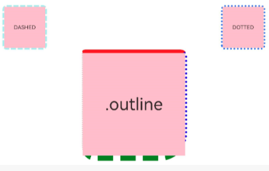

# Outline

You can set outline attributes for components.

>  **NOTE**
>
>  This feature is supported since API Version 11. Updates will be marked with a superscript to indicate their earliest API version.

## outline

outline(value: OutlineOptions)

Sets the outline attributes in one declaration.

**Widget capability**: Since API version 11, this feature is supported in ArkTS widgets.

**System capability**: SystemCapability.ArkUI.ArkUI.Full

**Parameters**

| Name| Type                                     | Mandatory| Description|
| ------ | ----------------------------------------- | ---- | ---- |
| value  | [OutlineOptions](#outlineoptions) | Yes  |      |

## outlineStyle

outlineStyle(value: OutlineStyle | EdgeOutlineStyles)

Sets the style of the outline.

**Widget capability**: Since API version 11, this feature is supported in ArkTS widgets.

**System capability**: SystemCapability.ArkUI.ArkUI.Full

**Parameters**

| Name| Type                                                        | Mandatory| Description                                                 |
| ------ | ------------------------------------------------------------ | ---- | ----------------------------------------------------- |
| value  | [OutlineStyle](ts-appendix-enums.md#outlinestyle11) \| [EdgeOutlineStyles](#edgeoutlinestyles) | Yes  | Outline style.<br>Default value: **OutlineStyle.SOLID**|

## outlineWidth

outlineWidth(value: Dimension | EdgeOutlineWidths)

Sets the thickness of the outline.

**Widget capability**: Since API version 11, this feature is supported in ArkTS widgets.

**System capability**: SystemCapability.ArkUI.ArkUI.Full

**Parameters**

| Name| Type                                                        | Mandatory| Description                                                        |
| ------ | ------------------------------------------------------------ | ---- | ------------------------------------------------------------ |
| value  | [Dimension](ts-types.md#dimension10) \| [EdgeOutlineWidths](#edgeoutlinewidths) | Yes  | Outline thickness. This parameter cannot be set in percentage.<br>Default value: **0**.|

## outlineColor

outlineColor(value: ResourceColor | EdgeColors)

Sets the color of the outline.

**Widget capability**: Since API version 11, this feature is supported in ArkTS widgets.

**System capability**: SystemCapability.ArkUI.ArkUI.Full

**Parameters**

| Name| Type                                                        | Mandatory| Description                                            |
| ------ | ------------------------------------------------------------ | ---- | ------------------------------------------------ |
| value  | [ResourceColor](ts-types.md#resourcecolor) \| [EdgeColors](#edgecolors) | Yes  | Outline color.<br>Default value: **Color.Black**|

## outlineRadius

outlineRadius(value: Dimension | OutlineRadiuses)

Sets the rounded corner radius of the outline.

**Widget capability**: Since API version 11, this feature is supported in ArkTS widgets.

**System capability**: SystemCapability.ArkUI.ArkUI.Full

**Parameters**

| Name| Type                                                        | Mandatory| Description                                                        |
| ------ | ------------------------------------------------------------ | ---- | ------------------------------------------------------------ |
| value  | [Dimension](ts-types.md#dimension10) \| [OutlineRadiuses](#outlineradiuses) | Yes  | Rounded corner radius of the outline. This parameter cannot be set in percentage.<br>Default value: **0**<br>Maximum effective value: Component width/2 + outlineWidth or component height/2 + outlineWidth|

## OutlineOptions

| Name  | Type                                                        | Description                                                        |
| ------ | ------------------------------------------------------------ | ------------------------------------------------------------ |
| width  | [Dimension](ts-types.md#dimension10) \| [EdgeOutlineWidths](#edgeoutlinewidths) | Outline thickness. This parameter cannot be set in percentage.<br>Default value: **0**|
| color  | [ResourceColor](ts-types.md#resourcecolor) \| [EdgeColors](#edgecolors) | Outline color.<br>Default value: **Color.Black**                  |
| radius | [Dimension](ts-types.md#dimension10) \| [OutlineRadiuses](#outlineradiuses) | Rounded corner radius of the outline. This parameter cannot be set in percentage.<br>Default value: **0**<br>Maximum effective value: Component width/2 + outlineWidth or component height/2 + outlineWidth|
| style  | [OutlineStyle](ts-appendix-enums.md#outlinestyle11) \| [EdgeOutlineStyles](#edgeoutlinestyles) | Outline style.<br>Default value: **OutlineStyle.SOLID**           |

## EdgeOutlineWidths

To reference this object, at least one parameter must be passed.

| Name    | Type                        | Mandatory  | Description     |
| ------ | ---------------------------- | ---- | ------- |
| left   | [Dimension](ts-types.md#dimension10) | No   | Thickness of the left outline.|
| right  | [Dimension](ts-types.md#dimension10) | No   | Thickness of the right outline.|
| top    | [Dimension](ts-types.md#dimension10) | No   | Thickness of the top outline.|
| bottom | [Dimension](ts-types.md#dimension10) | No   | Thickness of the bottom outline.|

## EdgeColors

To reference this object, at least one parameter must be passed.

| Name    | Type                                    | Mandatory  | Description     |
| ------ | ---------------------------------------- | ---- | ------- |
| left   | [ResourceColor](ts-types.md#resourcecolor) | No   | Color of the left outline.|
| right  | [ResourceColor](ts-types.md#resourcecolor) | No   | Color of the right outline.|
| top    | [ResourceColor](ts-types.md#resourcecolor) | No   | Color of the top outline.|
| bottom | [ResourceColor](ts-types.md#resourcecolor) | No   | Color of the bottom outline.|

## OutlineRadiuses

To reference this object, at least one parameter must be passed.

| Name         | Type                        | Mandatory  | Description      |
| ----------- | ---------------------------- | ---- | -------- |
| topLeft     | [Dimension](ts-types.md#dimension10) | No   | Radius of the upper-left rounded corner.|
| topRight    | [Dimension](ts-types.md#dimension10) | No   | Radius of the upper-right rounded corner.|
| bottomLeft  | [Dimension](ts-types.md#dimension10) | No   | Radius of the lower-left rounded corner.|
| bottomRight | [Dimension](ts-types.md#dimension10) | No   | Radius of the lower-right rounded corner.|

## EdgeOutlineStyles

To reference this object, at least one parameter must be passed.

| Name    | Type                                    | Mandatory  | Description     |
| ------ | ---------------------------------------- | ---- | ------- |
| left   | [OutlineStyle](ts-appendix-enums.md#outlinestyle11) | No   | Style of the left outline.|
| right  | [OutlineStyle](ts-appendix-enums.md#outlinestyle11) | No   | Style of the right outline.|
| top    | [OutlineStyle](ts-appendix-enums.md#outlinestyle11) | No   | Style of the top outline.|
| bottom | [OutlineStyle](ts-appendix-enums.md#outlinestyle11) | No   | Style of the bottom outline.|

## Example

```ts
// xxx.ets
@Entry
@Component
struct OutlineExample {
  build() {
    Column() {
      Flex({ justifyContent: FlexAlign.SpaceAround, alignItems: ItemAlign.Center }) {
        // Dashed line
        Text('DASHED')
          .backgroundColor(Color.Pink)
          .outlineStyle(OutlineStyle.DASHED).outlineWidth(5).outlineColor(0xAFEEEE).outlineRadius(10)
          .width(120).height(120).textAlign(TextAlign.Center).fontSize(16)
        // Dotted line
        Text('DOTTED')
          .backgroundColor(Color.Pink)
          .outline({ width: 5, color: 0x317AF7, radius: 10, style: OutlineStyle.DOTTED })
          .width(120).height(120).textAlign(TextAlign.Center).fontSize(16)
      }.width('100%').height(150)

      Text('.outline')
        .backgroundColor(Color.Pink)
        .fontSize(50)
        .width(300)
        .height(300)
        .outline({
          width: { left: 3, right: 6, top: 10, bottom: 15 },
          color: { left: '#e3bbbb', right: Color.Blue, top: Color.Red, bottom: Color.Green },
          radius: { topLeft: 10, topRight: 20, bottomLeft: 40, bottomRight: 80 },
          style: {
            left: OutlineStyle.DOTTED,
            right: OutlineStyle.DOTTED,
            top: OutlineStyle.SOLID,
            bottom: OutlineStyle.DASHED
          }
        }).textAlign(TextAlign.Center)
    }
  }
}
```


