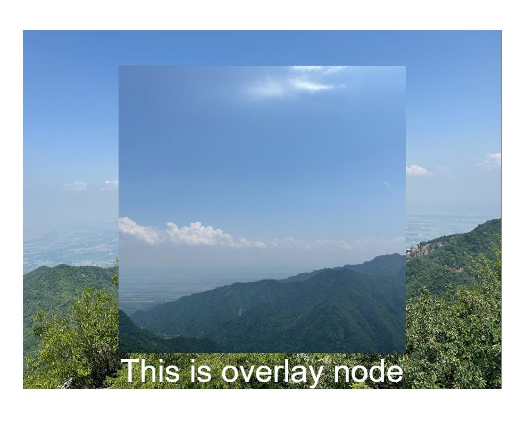

# Overlay

You can set overlay text for a component.

>  **NOTE**
>
>  The APIs of this module are supported since API version 7. Updates will be marked with a superscript to indicate their earliest API version.

## Attributes

| Name     | Type                                    | Default Value                                     | Description                                      |
| ------- | ---------------------------------------- | ---------------------------------------- | ---------------------------------------- |
| overlay | value: string &#124; [CustomBuilder](../arkui-ts/ts-types.md#custombuilder8)<sup>10+</sup>,<br>options?: {<br>align?: [Alignment](ts-appendix-enums.md#alignment), <br>offset?: {x?: number, y?: number}<br>} | {<br>align: Alignment.TopStart,<br>offset: { x: 0,  y: 0}<br>} | Overlay of mask text or a custom component added to the component.<br> **value**: mask text content or custom component constructor.<br>**options**: position of the overlay. **align** indicates the position of the overlay relative to the component. [offset](ts-universal-attributes-location.md) indicates the offset of the overlay relative to the upper left corner of itself. By default, the overlay is in the upper left corner of the component.<br>If both **align** and **offset** are set, the overlay is first positioned relative to the component, and then offset relative to the upper left corner of itself.<br>Since API version 9, this API is supported in ArkTS widgets.<br>**NOTE**<br>When the overlay is a custom component, it cannot obtain focus through sequential keyboard navigation.|

## Example

### Example 1

```ts
// xxx.ets
@Entry
@Component
struct OverlayExample {
  build() {
    Column() {
      Column() {
        Text('floating layer')
          .fontSize(12).fontColor(0xCCCCCC).maxLines(1)
        Column() {
          Image($r('app.media.img'))
            .width(240).height(240)
            .overlay("Winter is a beautiful season, especially when it snows.", {
              align: Alignment.Bottom,
              offset: { x: 0, y: -15 }
            })
        }.border({ color: Color.Black, width: 2 })
      }.width('100%')
    }.padding({ top: 20 })
  }
}
```


### Example 2

```ts
// xxx.ets
@Entry
@Component
struct OverlayExample {
  @Builder OverlayNode() {
    Column() {
      Image($r('app.media.img1'))
      Text("This is overlayNode").fontSize(20).fontColor(Color.White)
    }.width(180).height(180).alignItems(HorizontalAlign.Center)
  }

  build() {
    Column() {
      Image($r('app.media.img2'))
        .overlay(this.OverlayNode(), { align: Alignment.Center })
        .objectFit(ImageFit.Contain)
    }.width('100%')
    .border({ color: Color.Black, width: 2 }).padding(20)
  }
}
```

