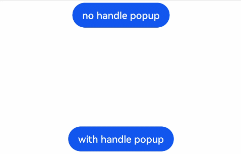

# Popup Control

You can bind a popup to a component, specifying its content, interaction logic, and display status.

>  **NOTE**
>
>  This attribute is supported since API version 7. Updates will be marked with a superscript to indicate their earliest API version.


## APIs


| Name          | Type                            | Description                                       |
| ---------- | ------------------------------------- | --------------------------------------- |
| bindPopup  | show: boolean,<br>popup: [PopupOptions](#popupoptions) \| [CustomPopupOptions](#custompopupoptions8)<sup>8+</sup> | Binds a popup to the component.<br>**show**: whether to show the popup. The default value is **false**, indicating that the popup is hidden.<br>**popup**: parameters of the popup.|

## PopupOptions

| Name                     | Type                                               | Mandatory   | Description                                         |
| -------------------------| ------------------------------------------------| -----| ----------------------------------------- |
| message                  | string                                          | Yes   | Content of the popup message.                                    |
| placementOnTop           | boolean                                         | No   | Whether to display the popup above the component. The default value is **false**.                 |
| primaryButton            | {<br>value: string,<br>action: () =&gt; void<br>} | No   | Primary button.<br>**value**: text of the primary button in the popup.<br>**action**: callback for clicking the primary button.|
| secondaryButton          | {<br>value: string,<br>action: () =&gt; void<br>} | No   | Secondary button.<br>**value**: text of the secondary button in the popup.<br>**action**: callback for clicking the secondary button.|
| onStateChange            | (event: { isVisible: boolean }) =&gt; void | No   | Callback for the popup status change event. The parameter **isVisible** indicates whether the popup is visible.     |
| arrowOffset<sup>9+</sup> | [Length](ts-types.md#length)                                 | No  | Offset of the popup arrow in the popup window. When residing above or below the popup, the arrow is offset to the left by default. When residing on the left or right side of the popup, the arrow is offset to the top by default.|
| showInSubWindow<sup>9+</sup> | boolean | No| Whether to show the popup in the subwindow. The default value is **false**.|

## CustomPopupOptions<sup>8+</sup>

| Name                      | Type                      | Mandatory    | Description                                                |
| -------------------------| ------------------------- | ---- | ---------------------------------------------------- |
| builder                  | [CustomBuilder](ts-types.md#custombuilder8)  | Yes  | Popup builder.                                         |
| placement                | [Placement](ts-appendix-enums.md#placement8) | No  | Preferred position of the popup. If the set position is insufficient for holding the popup, it will be automatically adjusted.<br>Default value: **Placement.Bottom**    |
| maskColor                | [ResourceColor](ts-types.md#resourcecolor)  | No  | Color of the popup mask.                                         |
| popupColor               | [ResourceColor](ts-types.md#resourcecolor)  | No  | Color of the popup.                                              |
| enableArrow              | boolean                                      | No  | Whether to display an arrow.<br>Since API version 9, if the location set for the popup arrow is not large enough, the arrow will not be displayed. For example, if **placement** is set to **Left** and the popup height is less than the arrow width (32 vp), the arrow will not be displayed.<br>Default value: **true**|
| autoCancel               | boolean                                      | No  | Whether to automatically close the popup when an operation is performed on the page.<br>Default value: **true**                       |
| onStateChange            | (event: { isVisible: boolean }) =&gt; void | No   | Callback for the popup status change event. The parameter **isVisible** indicates whether the popup is visible.|
| arrowOffset<sup>9+</sup> | [Length](ts-types.md#length) | No| Offset of the popup arrow in the popup window. When residing above or below the popup, the arrow is offset to the left by default. When residing on the left or right side of the popup, the arrow is offset to the top by default.|
| showInSubWindow<sup>9+</sup> | boolean | No| Whether to show the popup in the subwindow. The default value is **false**.|


## Example
```ts
// xxx.ets
@Entry
@Component
struct PopupExample {
  @State handlePopup: boolean = false
  @State customPopup: boolean = false

  // Popup builder
  @Builder popupBuilder() {
    Row({ space: 2 }) {
      Image($r("app.media.image")).width(24).height(24).margin({ left: -5 })
      Text('Custom Popup').fontSize(10)
    }.width(100).height(50).padding(5)
  }

  build() {
    Flex({ direction: FlexDirection.Column }) {
      // PopupOptions for setting the popup
      Button('PopupOptions')
        .onClick(() => {
          this.handlePopup = !this.handlePopup
        })
        .bindPopup(this.handlePopup, {
          message: 'This is a popup with PopupOptions',
          placementOnTop: true,
          showInSubWindow:false,
          primaryButton: {
            value: 'confirm',
            action: () => {
              this.handlePopup = !this.handlePopup
              console.info('confirm Button click')
            }
          },
          // Secondary button
          secondaryButton: {
            value: 'cancel',
            action: () => {
              this.handlePopup = !this.handlePopup
              console.info('cancel Button click')
            }
          },
          onStateChange: (e) => {
            console.info(e.isVisible.toString())
            if (!e.isVisible) {
              this.handlePopup = false
            }
          }
        })
        .position({ x: 100, y: 50 })


      // CustomPopupOptions for setting the popup
      Button('CustomPopupOptions')
        .onClick(() => {
          this.customPopup = !this.customPopup
        })
        .bindPopup(this.customPopup, {
          builder: this.popupBuilder,
          placement: Placement.Top,
          maskColor: 0x33000000,
          popupColor: Color.Yellow,
          enableArrow: true,
          showInSubWindow: false,
          onStateChange: (e) => {
            if (!e.isVisible) {
              this.customPopup = false
            }
          }
        })
        .position({ x: 80, y: 200 })
    }.width('100%').padding({ top: 5 })
  }
}
```


